# 登录注册找回密码页面设计

## 设计概述

设计一套完整的用户认证界面，包含登录、注册和密码重置三个页面，采用米白色温暖柔和的视觉风格，提供简洁优雅的交互体验和流畅的动效设计。同时补全后端缺失的注册和密码重置功能。

## 现状分析

### 已实现功能

**后端部分**
- 登录接口 (POST /auth/login)
- 刷新令牌接口 (POST /auth/refresh)
- 获取当前用户信息接口 (GET /auth/me)
- 用户创建功能 (UsersService.create)
- JWT 双令牌机制 (accessToken + refreshToken)
- 邮件服务基础设施 (MailService，包含密码重置邮件模板)
- 登录和注册的 Zod Schema 定义

**前端部分**
- 基础的 LoginForm 组件
- 简单的 LoginView 页面
- 认证状态管理 (auth store)
- 路由配置
- 国际化支持

### 缺失功能

**后端部分**
- 注册接口 (POST /auth/register)
- 找回密码请求接口 (POST /auth/forgot-password)
- 重置密码接口 (POST /auth/reset-password)
- 找回密码相关的 Zod Schema
- 重置令牌的存储与验证机制

**前端部分**
- 注册页面和表单组件
- 找回密码页面和表单组件
- 重置密码页面和表单组件
- 页面间的导航链接
- 优化的 UI 设计和交互动效
- 密码显示/隐藏切换功能

## 视觉设计规范

### 主题色彩

采用温暖柔和的米白色系配色方案：

| 用途 | 颜色值 | 说明 |
|------|--------|------|
| 主背景色 | #FAF8F3 | 米白色背景，营造温暖氛围 |
| 卡片背景 | #FFFFFF | 纯白卡片，突出内容区域 |
| 主色调 | #D4A574 | 暖金色，用于主要按钮和重点元素 |
| 主色调悬停 | #C89454 | 暖金色加深，按钮悬停状态 |
| 文本主色 | #3A3A3A | 深灰色，保证可读性 |
| 文本辅助色 | #8B8680 | 中灰色，次要信息 |
| 边框颜色 | #E8E4DD | 浅灰色，柔和边框 |
| 输入框聚焦 | #D4A574 | 主色调，聚焦状态 |
| 错误提示 | #D97757 | 温暖的橙红色 |
| 成功提示 | #90B494 | 柔和的绿色 |

### 圆角规范

| 元素类型 | 圆角大小 | 说明 |
|---------|---------|------|
| 卡片容器 | 20px | 主要内容卡片 |
| 输入框 | 12px | 表单输入框 |
| 按钮 | 12px | 各类按钮 |
| 小图标按钮 | 8px | 图标按钮 |
| 错误提示框 | 10px | 提示信息容器 |

### 间距规范

| 用途 | 间距值 | 说明 |
|------|--------|------|
| 卡片内边距 | 48px | 主卡片内边距 |
| 表单字段间距 | 24px | 表单元素垂直间距 |
| 按钮内边距 | 16px 32px | 上下 左右 |
| 文本行间距 | 1.6 | 提高可读性 |

### 动效规范

| 交互场景 | 动效类型 | 持续时间 | 缓动函数 |
|---------|---------|---------|---------|
| 页面进入 | 淡入 + 上移 | 600ms | ease-out |
| 输入框聚焦 | 边框颜色过渡 + 缩放 | 200ms | ease-in-out |
| 按钮悬停 | 颜色过渡 + 轻微抬升 | 200ms | ease-in-out |
| 按钮点击 | 缩放按下 | 100ms | ease-in-out |
| 错误提示显示 | 淡入 + 轻微抖动 | 300ms | ease-out |
| 表单切换 | 淡入淡出 | 400ms | ease-in-out |
| 密码可见性切换 | 图标旋转 | 200ms | ease-in-out |

## 数据模型设计

### 后端 Prisma Schema 扩展

需要在 User 模型中增加以下字段来支持密码重置功能：

| 字段名 | 类型 | 说明 | 可选 |
|-------|------|------|------|
| resetPasswordToken | String | 密码重置令牌（哈希后存储） | 是 |
| resetPasswordExpires | DateTime | 密码重置令牌过期时间 | 是 |

### Zod Schema 定义

需要在 shared 包中新增以下 Schema：

**找回密码请求 Schema**

| 字段 | 类型 | 验证规则 | 错误信息 |
|------|------|---------|---------|
| email | string | 必填、邮箱格式、转小写、去空格 | '请输入有效的邮箱地址' |

**重置密码 Schema**

| 字段 | 类型 | 验证规则 | 错误信息 |
|------|------|---------|---------|
| token | string | 必填、最小长度 1 | '重置令牌不能为空' |
| password | string | 必填、最小长度 6、最大长度 100、包含字母、包含数字 | '密码格式不符合要求' |
| confirmPassword | string | 必填、必须与 password 一致 | '两次输入的密码不一致' |

**注册扩展 Schema**

现有 RegisterSchema 已定义，但需要在前端增加确认密码字段：

| 字段 | 类型 | 验证规则 | 错误信息 |
|------|------|---------|---------|
| confirmPassword | string | 必填、必须与 password 一致 | '两次输入的密码不一致' |

### API 响应格式

所有接口遵循统一的响应格式：

```
{
  success: boolean,
  data: T,
  message?: string,
  timestamp: string
}
```

## 后端功能设计

### 注册功能

**接口路径**: POST /auth/register

**功能描述**: 用户通过邮箱、用户名和密码创建新账户

**请求参数**

| 参数名 | 类型 | 必填 | 说明 |
|-------|------|------|------|
| email | string | 是 | 用户邮箱 |
| name | string | 是 | 用户名 |
| password | string | 是 | 密码 |

**业务流程**

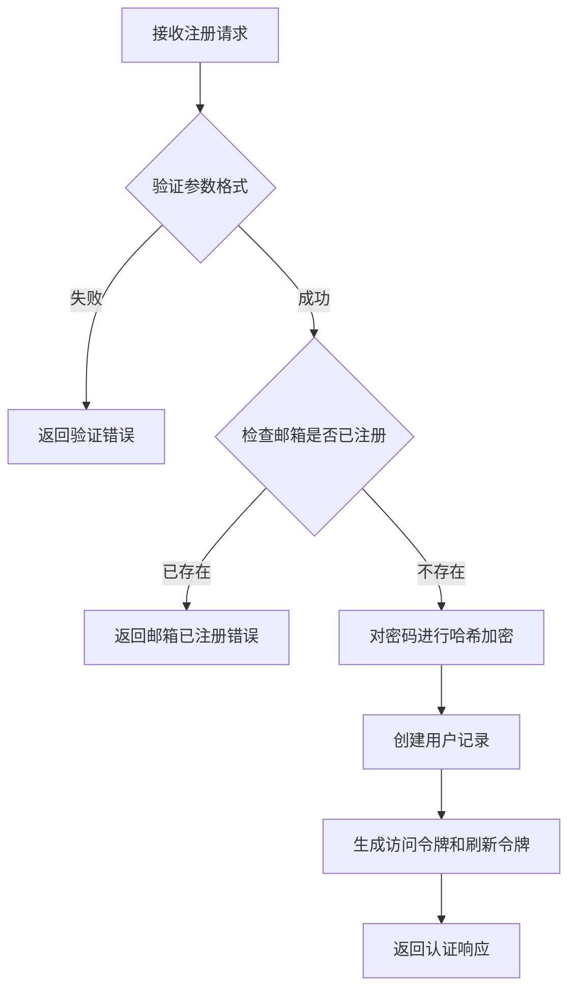

**响应数据**: AuthResponse 格式，包含 accessToken、refreshToken、expiresIn 和 user 信息

**速率限制**: 每分钟最多 3 次尝试

**错误处理**

| 错误场景 | HTTP 状态码 | 错误信息 |
|---------|------------|---------|
| 参数验证失败 | 400 | Zod 验证错误消息 |
| 邮箱已注册 | 409 | '邮箱已被注册' |
| 服务器错误 | 500 | '注册失败，请稍后重试' |

### 找回密码请求功能

**接口路径**: POST /auth/forgot-password

**功能描述**: 用户请求重置密码，系统发送重置链接到用户邮箱

**请求参数**

| 参数名 | 类型 | 必填 | 说明 |
|-------|------|------|------|
| email | string | 是 | 注册时使用的邮箱 |

**业务流程**

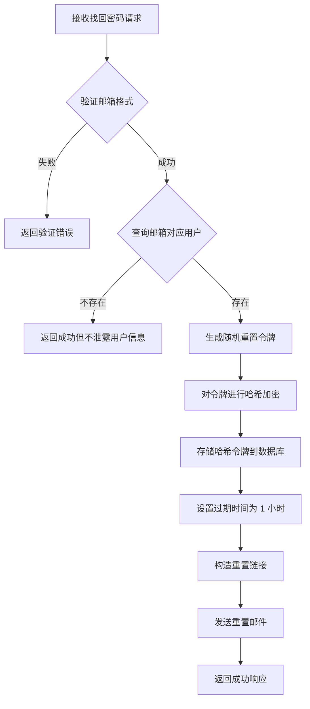

**重置令牌生成策略**

- 生成 32 字节随机字符串
- 使用 crypto.randomBytes 确保安全性
- 对原始令牌进行 SHA-256 哈希后存储
- 设置 1 小时过期时间

**重置链接格式**: `https://domain.com/reset-password?token={原始令牌}`

**响应数据**

| 字段 | 类型 | 说明 |
|------|------|------|
| message | string | '如果该邮箱已注册，重置链接已发送到您的邮箱' |

**速率限制**: 每分钟最多 3 次尝试

**安全设计**

- 无论邮箱是否存在都返回相同的成功消息，防止用户枚举攻击
- 令牌经过哈希加密存储，即使数据库泄露也无法直接使用
- 设置短期过期时间限制攻击窗口
- 记录请求日志用于异常检测

### 重置密码功能

**接口路径**: POST /auth/reset-password

**功能描述**: 用户通过邮件中的令牌重置密码

**请求参数**

| 参数名 | 类型 | 必填 | 说明 |
|-------|------|------|------|
| token | string | 是 | 重置令牌 |
| password | string | 是 | 新密码 |

**业务流程**

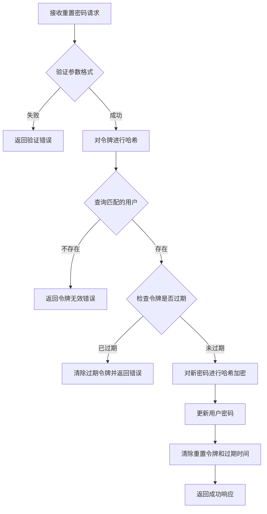

**响应数据**

| 字段 | 类型 | 说明 |
|------|------|------|
| message | string | '密码重置成功，请使用新密码登录' |

**速率限制**: 每分钟最多 5 次尝试

**错误处理**

| 错误场景 | HTTP 状态码 | 错误信息 |
|---------|------------|---------|
| 参数验证失败 | 400 | Zod 验证错误消息 |
| 令牌无效或已过期 | 400 | '重置链接无效或已过期' |
| 服务器错误 | 500 | '密码重置失败，请稍后重试' |

### 后端服务层设计

**AuthService 新增方法**

| 方法名 | 参数 | 返回值 | 说明 |
|-------|------|-------|------|
| register | RegisterInput | Promise\<AuthResponse\> | 用户注册，返回令牌和用户信息 |
| requestPasswordReset | email: string | Promise\<void\> | 请求密码重置，发送邮件 |
| resetPassword | token: string, newPassword: string | Promise\<void\> | 重置密码 |
| generateResetToken | - | { token: string, hashedToken: string } | 生成重置令牌 |

**服务依赖关系**

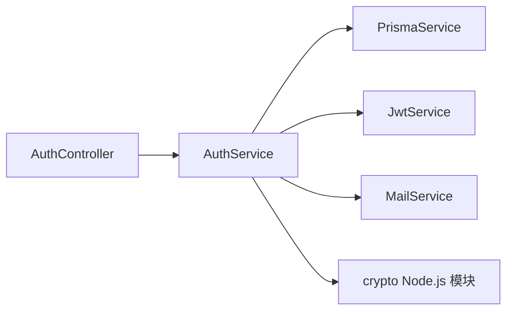

## 前端功能设计

### 页面路由设计

需要在路由配置中新增以下路由：

| 路径 | 名称 | 组件 | 元信息标题 | 说明 |
|------|------|------|-----------|------|
| /register | register | RegisterView | 注册 | 用户注册页面 |
| /forgot-password | forgot-password | ForgotPasswordView | 找回密码 | 找回密码请求页面 |
| /reset-password | reset-password | ResetPasswordView | 重置密码 | 重置密码执行页面 |

### 登录页面 (LoginView) 重构

**页面布局**

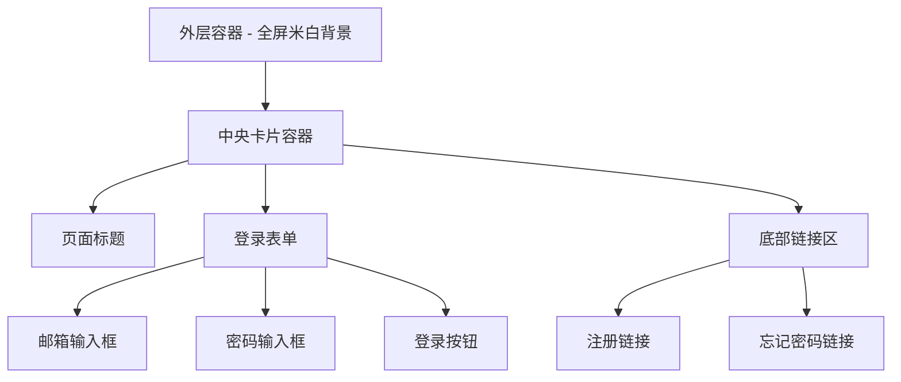

**表单字段**

| 字段名 | 标签文本 | 占位符 | 输入类型 | 验证规则 |
|-------|---------|--------|---------|---------|
| email | 邮箱地址 | 请输入您的邮箱 | email | emailSchema |
| password | 密码 | 请输入您的密码 | password | passwordSchema |

**交互元素**

| 元素 | 类型 | 文本/图标 | 功能 |
|------|------|----------|------|
| 登录按钮 | 主按钮 | 登录 | 提交表单 |
| 密码可见性切换 | 图标按钮 | Eye / EyeOff | 切换密码显示/隐藏 |
| 注册链接 | 文本链接 | 还没有账号？立即注册 | 跳转到注册页 |
| 忘记密码链接 | 文本链接 | 忘记密码？ | 跳转到找回密码页 |

**状态管理**

| 状态 | 类型 | 说明 |
|------|------|------|
| loading | boolean | 提交中状态 |
| error | string | null | 错误信息 |
| showPassword | boolean | 密码可见性状态 |

**动效设计**

- 页面加载: 卡片从下方淡入并上移 50px，持续 600ms
- 输入框聚焦: 边框颜色过渡到主色调，轻微缩放 1.02 倍
- 按钮悬停: 背景色加深，抬升阴影效果
- 错误提示: 淡入并轻微左右抖动

### 注册页面 (RegisterView)

**页面布局**

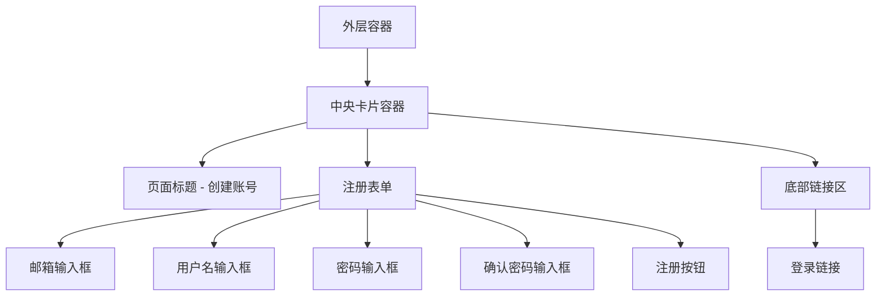

**表单字段**

| 字段名 | 标签文本 | 占位符 | 输入类型 | 验证规则 |
|-------|---------|--------|---------|---------|
| email | 邮箱地址 | 请输入您的邮箱 | email | emailSchema |
| name | 用户名 | 请输入用户名（2-50 个字符） | text | RegisterSchema.name |
| password | 密码 | 请输入密码（需包含字母和数字） | password | RegisterSchema.password |
| confirmPassword | 确认密码 | 请再次输入密码 | password | 必须与 password 一致 |

**密码强度指示器**

显示密码强度的视觉反馈：

| 强度级别 | 颜色 | 条件 |
|---------|------|------|
| 弱 | #D97757 (橙红) | 仅满足最小长度 |
| 中 | #D4A574 (暖金) | 包含字母和数字 |
| 强 | #90B494 (绿色) | 包含字母、数字和特殊字符，长度 >= 8 |

**交互元素**

| 元素 | 类型 | 文本/图标 | 功能 |
|------|------|----------|------|
| 注册按钮 | 主按钮 | 注册 | 提交表单 |
| 密码可见性切换 | 图标按钮 | Eye / EyeOff | 切换密码显示/隐藏 |
| 登录链接 | 文本链接 | 已有账号？立即登录 | 跳转到登录页 |

**注册成功流程**

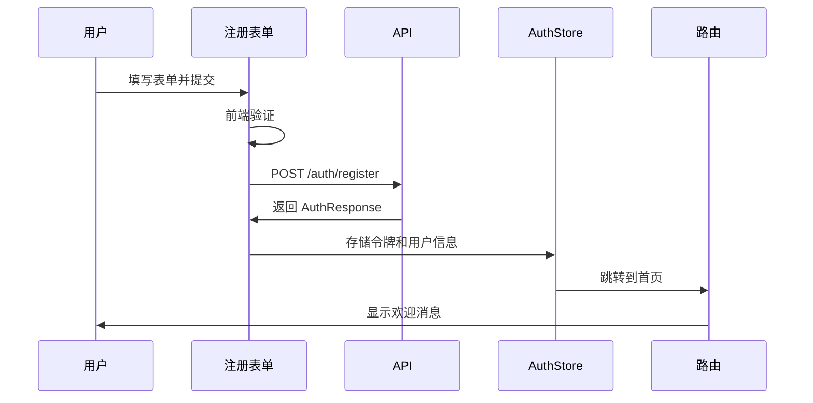

### 找回密码页面 (ForgotPasswordView)

**页面布局**

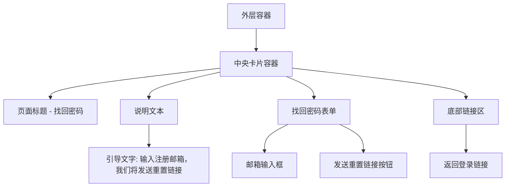

**表单字段**

| 字段名 | 标签文本 | 占位符 | 输入类型 | 验证规则 |
|-------|---------|--------|---------|---------|
| email | 邮箱地址 | 请输入您的注册邮箱 | email | emailSchema |

**交互元素**

| 元素 | 类型 | 文本 | 功能 |
|------|------|------|------|
| 发送按钮 | 主按钮 | 发送重置链接 | 提交邮箱 |
| 返回登录链接 | 文本链接 | 返回登录 | 跳转到登录页 |

**成功状态显示**

提交成功后显示成功提示卡片：

- 图标: 邮件发送成功图标
- 标题: '重置链接已发送'
- 描述: '如果该邮箱已注册，我们已将重置链接发送到您的邮箱，请查收'
- 提示: '未收到邮件？请检查垃圾邮件文件夹'
- 操作: 返回登录按钮

### 重置密码页面 (ResetPasswordView)

**页面布局**

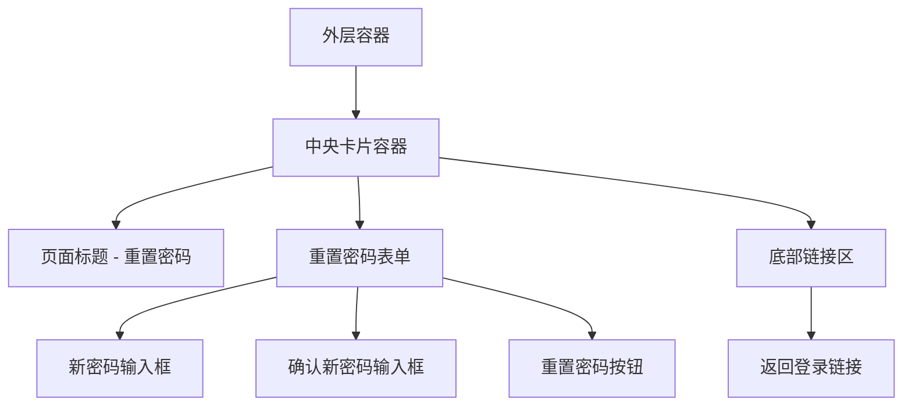

**表单字段**

| 字段名 | 标签文本 | 占位符 | 输入类型 | 验证规则 |
|-------|---------|--------|---------|---------|
| password | 新密码 | 请输入新密码 | password | RegisterSchema.password |
| confirmPassword | 确认新密码 | 请再次输入新密码 | password | 必须与 password 一致 |

**URL 参数处理**

从 URL query 参数中获取 token：
- 参数名: token
- 验证: 页面加载时检查 token 是否存在
- 错误处理: 如果 token 不存在或格式错误，显示错误提示并提供返回登录链接

**交互元素**

| 元素 | 类型 | 文本/图标 | 功能 |
|------|------|----------|------|
| 重置按钮 | 主按钮 | 重置密码 | 提交新密码 |
| 密码可见性切换 | 图标按钮 | Eye / EyeOff | 切换密码显示/隐藏 |
| 返回登录链接 | 文本链接 | 返回登录 | 跳转到登录页 |

**成功状态显示**

重置成功后显示成功提示卡片：

- 图标: 成功图标
- 标题: '密码重置成功'
- 描述: '您的密码已成功重置，请使用新密码登录'
- 操作: 前往登录按钮（3 秒后自动跳转）

### 前端组件复用设计

**AuthCard 基础卡片组件**

可复用的认证页面卡片容器：

| 属性 | 类型 | 说明 |
|------|------|------|
| title | string | 卡片标题 |
| description | string | 可选 | 卡片描述文字 |

样式特性：
- 背景: 纯白
- 圆角: 20px
- 内边距: 48px
- 阴影: 柔和阴影
- 最大宽度: 480px

**FormInput 表单输入组件**

统一的表单输入框组件：

| 属性 | 类型 | 说明 |
|------|------|------|
| modelValue | string | 双向绑定值 |
| label | string | 字段标签 |
| placeholder | string | 占位符 |
| type | 'text' \| 'email' \| 'password' | 输入类型 |
| error | string | 可选 | 错误信息 |
| disabled | boolean | 可选 | 禁用状态 |

样式特性：
- 圆角: 12px
- 边框: 1px solid #E8E4DD
- 聚焦边框: 1px solid #D4A574
- 聚焦时轻微缩放动效

**PrimaryButton 主按钮组件**

统一的主操作按钮：

| 属性 | 类型 | 说明 |
|------|------|------|
| loading | boolean | 可选 | 加载状态 |
| disabled | boolean | 可选 | 禁用状态 |
| fullWidth | boolean | 可选 | 全宽模式 |

样式特性：
- 背景: #D4A574
- 悬停背景: #C89454
- 圆角: 12px
- 内边距: 16px 32px
- 加载时显示 spinner

**PasswordInput 密码输入组件**

带可见性切换的密码输入框：

| 属性 | 类型 | 说明 |
|------|------|------|
| modelValue | string | 双向绑定值 |
| label | string | 字段标签 |
| placeholder | string | 占位符 |
| error | string | 可选 | 错误信息 |
| showStrength | boolean | 可选 | 显示密码强度 |

功能特性：
- 眼睛图标切换显示/隐藏
- 可选的密码强度指示器
- 继承 FormInput 的样式

### API 客户端扩展

在 api/index.ts 中新增以下接口方法：

| 方法名 | HTTP 方法 | 路径 | 参数 | 返回类型 |
|-------|----------|------|------|---------|
| register | POST | /auth/register | RegisterInput | Promise\<ApiResponse\<AuthResponse\>\> |
| forgotPassword | POST | /auth/forgot-password | { email: string } | Promise\<ApiResponse\<{ message: string }\>\> |
| resetPassword | POST | /auth/reset-password | { token: string, password: string } | Promise\<ApiResponse\<{ message: string }\>\> |

### 状态管理扩展

在 auth store 中新增以下 action：

| Action 名称 | 参数 | 返回值 | 说明 |
|------------|------|-------|------|
| register | RegisterInput | Promise\<boolean\> | 用户注册 |
| forgotPassword | email: string | Promise\<boolean\> | 请求密码重置 |
| resetPassword | token: string, password: string | Promise\<boolean\> | 重置密码 |

### 国际化文本

需要在 i18n 中新增以下翻译键：

**注册相关**
- register.title: '创建账号'
- register.name: '用户名'
- register.confirmPassword: '确认密码'
- register.submit: '注册'
- register.submitting: '注册中...'
- register.hasAccount: '已有账号？'
- register.loginLink: '立即登录'

**找回密码相关**
- forgotPassword.title: '找回密码'
- forgotPassword.description: '输入您的注册邮箱，我们将发送重置链接'
- forgotPassword.submit: '发送重置链接'
- forgotPassword.submitting: '发送中...'
- forgotPassword.successTitle: '重置链接已发送'
- forgotPassword.successMessage: '如果该邮箱已注册，我们已将重置链接发送到您的邮箱，请查收'
- forgotPassword.backToLogin: '返回登录'

**重置密码相关**
- resetPassword.title: '重置密码'
- resetPassword.newPassword: '新密码'
- resetPassword.confirmNewPassword: '确认新密码'
- resetPassword.submit: '重置密码'
- resetPassword.submitting: '重置中...'
- resetPassword.successTitle: '密码重置成功'
- resetPassword.successMessage: '您的密码已成功重置，请使用新密码登录'
- resetPassword.invalidToken: '重置链接无效或已过期'
- resetPassword.goToLogin: '前往登录'

**密码强度**
- password.strength.weak: '弱'
- password.strength.medium: '中'
- password.strength.strong: '强'

## 交互流程设计

### 用户注册流程

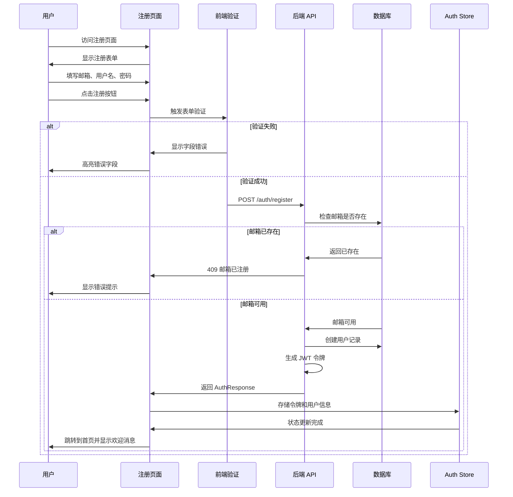

### 找回密码流程

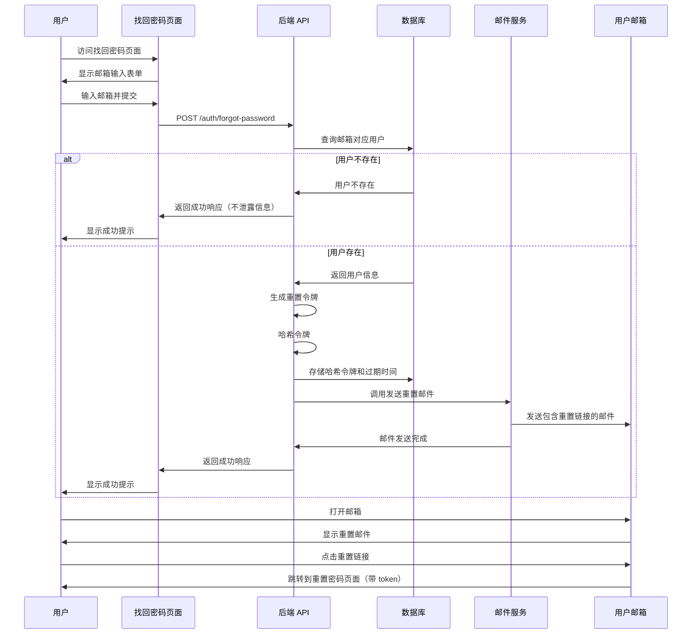

### 重置密码流程

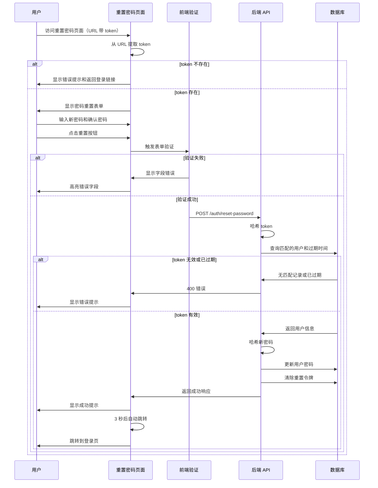

## 响应式设计

### 断点规范

| 断点名称 | 最小宽度 | 设计调整 |
|---------|---------|---------|
| 移动端 | < 640px | 卡片全屏显示，去除外边距，内边距减小到 24px |
| 平板 | 640px - 1024px | 卡片居中，最大宽度 480px |
| 桌面端 | >= 1024px | 卡片居中，最大宽度 480px，增加装饰元素 |

### 移动端优化

- 输入框高度增加到 48px，方便触摸
- 按钮高度增加到 48px
- 字体大小适当增大
- 移除悬停效果，优化触摸反馈
- 表单字段垂直排列

## 可访问性设计

### 语义化标记

- 使用 `<form>` 标签包裹表单
- 使用 `<label>` 标签关联输入框
- 使用 `role` 和 `aria-*` 属性增强可访问性

### 键盘导航

- 所有交互元素可通过 Tab 键访问
- Enter 键提交表单
- Esc 键清除错误提示

### 视觉可访问性

- 文本对比度符合 WCAG AA 标准（至少 4.5:1）
- 错误提示不仅依赖颜色，还包含图标和文字
- 聚焦状态有明显的视觉反馈

## 错误处理策略

### 前端错误处理

| 错误类型 | 处理方式 | 用户反馈 |
|---------|---------|---------|
| 表单验证错误 | 在对应字段下显示错误信息 | 红色文字提示，字段边框变红 |
| 网络错误 | 显示通用错误提示 | '网络连接失败，请检查网络后重试' |
| API 错误 (4xx) | 显示服务器返回的错误信息 | 在表单顶部显示错误提示框 |
| API 错误 (5xx) | 显示通用服务器错误 | '服务器错误，请稍后重试' |
| 超时错误 | 显示超时提示 | '请求超时，请重试' |

### 后端错误处理

所有接口统一通过全局异常过滤器处理，返回格式：

```
{
  success: false,
  message: '错误描述',
  timestamp: '2024-01-01T00:00:00.000Z',
  path: '/auth/register'
}
```

## 性能优化策略

### 前端性能优化

| 优化项 | 方案 | 预期效果 |
|-------|------|---------|
| 路由懒加载 | 使用动态 import | 减小初始包体积 |
| 组件懒加载 | 非关键组件延迟加载 | 加快首屏渲染 |
| 防抖处理 | 表单验证使用防抖 | 减少不必要的验证 |
| 请求缓存 | 相同请求复用结果 | 减少网络请求 |
| 图标优化 | 使用 SVG 图标 | 减小资源体积 |

### 后端性能优化

| 优化项 | 方案 | 预期效果 |
|-------|------|---------|
| 速率限制 | Throttler 守卫 | 防止滥用 |
| 密码哈希优化 | bcrypt 工作因子设为 10 | 平衡安全性和性能 |
| 数据库索引 | email 字段建立唯一索引 | 加快查询速度 |
| 邮件异步发送 | 使用 BullMQ 队列 | 避免阻塞请求 |

## 安全性设计

### 前端安全措施

| 安全项 | 实现方式 | 防御目标 |
|-------|---------|---------|
| XSS 防护 | Vue 自动转义 + CSP 头 | 防止脚本注入 |
| CSRF 防护 | XSRF-TOKEN 机制 | 防止跨站请求伪造 |
| 密码不可见 | 默认 type="password" | 防止肩窥攻击 |
| 敏感信息清理 | 不在控制台输出敏感信息 | 防止信息泄露 |

### 后端安全措施

| 安全项 | 实现方式 | 防御目标 |
|-------|---------|---------|
| 密码哈希 | bcrypt 加盐哈希 | 防止密码泄露 |
| 令牌哈希存储 | SHA-256 哈希 | 防止令牌泄露 |
| 速率限制 | 注册 3 次/分钟，找回密码 3 次/分钟 | 防止暴力攻击 |
| 用户枚举防护 | 统一错误提示 | 防止用户名枚举 |
| 输入验证 | Zod Schema 验证 | 防止注入攻击 |
| 输入清理 | SanitizeInterceptor | 防止恶意输入 |
| JWT 过期机制 | accessToken 15 分钟，refreshToken 7 天 | 限制令牌有效期 |
| HTTPS 强制 | 生产环境强制 HTTPS | 防止中间人攻击 |

## 测试策略

### 前端测试

**单元测试**

| 测试对象 | 测试用例 |
|---------|---------|
| 表单验证 | 邮箱格式验证、密码长度验证、密码一致性验证 |
| 组件渲染 | 各组件正确渲染、属性正确传递 |
| 状态管理 | register、forgotPassword、resetPassword action 正常工作 |

**集成测试**

| 测试场景 | 测试步骤 |
|---------|---------|
| 注册流程 | 填写表单 → 提交 → 验证响应 → 跳转首页 |
| 找回密码流程 | 输入邮箱 → 提交 → 显示成功提示 |
| 重置密码流程 | 输入新密码 → 提交 → 显示成功提示 → 跳转登录 |

### 后端测试

**单元测试**

| 测试对象 | 测试用例 |
|---------|---------|
| AuthService.register | 正常注册、邮箱已存在、密码哈希正确 |
| AuthService.requestPasswordReset | 生成令牌、发送邮件、用户不存在返回一致响应 |
| AuthService.resetPassword | 令牌有效、令牌过期、令牌无效、密码更新成功 |

**集成测试**

| 测试场景 | 测试步骤 |
|---------|---------|
| 注册接口 | POST /auth/register → 验证响应格式 → 验证数据库记录 |
| 找回密码接口 | POST /auth/forgot-password → 验证邮件发送 → 验证数据库令牌 |
| 重置密码接口 | POST /auth/reset-password → 验证密码更新 → 验证令牌清除 |

## 实施优先级

### P0 - 核心功能（必须实现）

1. 后端注册接口实现
2. 后端找回密码接口实现
3. 后端重置密码接口实现
4. 共享包 Schema 扩展
5. 注册页面和表单
6. 找回密码页面和表单
7. 重置密码页面和表单
8. 登录页面 UI 优化

### P1 - 重要功能（高优先级）

1. 密码可见性切换功能
2. 密码强度指示器
3. 页面动效实现
4. 错误处理完善
5. 响应式适配
6. 国际化文本补全

### P2 - 优化功能（中优先级）

1. 可复用组件封装
2. 可访问性优化
3. 单元测试
4. 集成测试

### P3 - 增强功能（低优先级）

1. 邮件队列异步发送
2. 登录页装饰元素
3. 骨架屏加载
4. 更丰富的动效

## 技术依赖

### 新增后端依赖

无需新增依赖，使用现有的：
- crypto (Node.js 内置)
- bcryptjs
- @nestjs/jwt
- nestjs-zod
- @nestjs-modules/mailer

### 新增前端依赖

无需新增依赖，使用现有的：
- vee-validate
- @vee-validate/zod
- vue-router
- pinia

### 共享包扩展

在 @my-app/shared 中扩展现有的 auth.schema.ts 文件

## 部署注意事项

### 环境变量配置

需要确保以下环境变量正确配置：

| 变量名 | 说明 | 示例值 |
|-------|------|--------|
| MAIL_HOST | SMTP 服务器地址 | smtp.gmail.com |
| MAIL_PORT | SMTP 端口 | 587 |
| MAIL_USER | SMTP 用户名 | your-email@gmail.com |
| MAIL_PASS | SMTP 密码或应用专用密码 | your-password |
| MAIL_FROM | 发件人地址 | noreply@yourdomain.com |
| FRONTEND_URL | 前端应用地址（用于构造重置链接） | https://yourdomain.com |

### 数据库迁移

部署前需要执行 Prisma 迁移以添加密码重置相关字段：

```
pnpm prisma migrate dev --name add-password-reset-fields
```

生产环境部署：

```
pnpm prisma migrate deploy
```

### SMTP 服务配置

- 开发环境：建议使用 Mailtrap 或 MailHog 进行邮件测试
- 生产环境：配置真实的 SMTP 服务（Gmail、SendGrid、AWS SES 等）
- 确保 SMTP 服务允许应用登录，可能需要启用"允许不够安全的应用"或使用应用专用密码

### 前端路由配置

确保生产环境的 Nginx 配置支持 Vue Router 的 History 模式，所有路由请求回退到 index.html

## 后续优化方向

### 功能增强

- 社交账号登录（Google、GitHub 等）
- 邮箱验证功能（注册后发送验证邮件）
- 两步验证（2FA）
- 记住我功能
- 单点登录（SSO）

### 体验优化

- 注册/登录页面背景装饰图案
- 更丰富的微交互动效
- 表单自动填充优化
- 密码管理器集成
- 深色模式支持

### 安全加固

- 验证码机制（防止机器注册）
- 设备指纹识别
- 异常登录提醒
- 登录历史记录
- IP 白名单/黑名单

统一的表单输入框组件：

| 属性 | 类型 | 说明 |
|------|------|------|
| modelValue | string | 双向绑定值 |
| label | string | 字段标签 |
| placeholder | string | 占位符 |
| type | 'text' \| 'email' \| 'password' | 输入类型 |
| error | string | 可选 | 错误信息 |
| disabled | boolean | 可选 | 禁用状态 |

样式特性：
- 圆角: 12px
- 边框: 1px solid #E8E4DD
- 聚焦边框: 1px solid #D4A574
- 聚焦时轻微缩放动效

**PrimaryButton 主按钮组件**

统一的主操作按钮：

| 属性 | 类型 | 说明 |
|------|------|------|
| loading | boolean | 可选 | 加载状态 |
| disabled | boolean | 可选 | 禁用状态 |
| fullWidth | boolean | 可选 | 全宽模式 |

样式特性：
- 背景: #D4A574
- 悬停背景: #C89454
- 圆角: 12px
- 内边距: 16px 32px
- 加载时显示 spinner

**PasswordInput 密码输入组件**

带可见性切换的密码输入框：

| 属性 | 类型 | 说明 |
|------|------|------|
| modelValue | string | 双向绑定值 |
| label | string | 字段标签 |
| placeholder | string | 占位符 |
| error | string | 可选 | 错误信息 |
| showStrength | boolean | 可选 | 显示密码强度 |

功能特性：
- 眼睛图标切换显示/隐藏
- 可选的密码强度指示器
- 继承 FormInput 的样式

### API 客户端扩展

在 api/index.ts 中新增以下接口方法：

| 方法名 | HTTP 方法 | 路径 | 参数 | 返回类型 |
|-------|----------|------|------|---------|
| register | POST | /auth/register | RegisterInput | Promise\<ApiResponse\<AuthResponse\>\> |
| forgotPassword | POST | /auth/forgot-password | { email: string } | Promise\<ApiResponse\<{ message: string }\>\> |
| resetPassword | POST | /auth/reset-password | { token: string, password: string } | Promise\<ApiResponse\<{ message: string }\>\> |

### 状态管理扩展

在 auth store 中新增以下 action：

| Action 名称 | 参数 | 返回值 | 说明 |
|------------|------|-------|------|
| register | RegisterInput | Promise\<boolean\> | 用户注册 |
| forgotPassword | email: string | Promise\<boolean\> | 请求密码重置 |
| resetPassword | token: string, password: string | Promise\<boolean\> | 重置密码 |

### 国际化文本

需要在 i18n 中新增以下翻译键：

**注册相关**
- register.title: '创建账号'
- register.name: '用户名'
- register.confirmPassword: '确认密码'
- register.submit: '注册'
- register.submitting: '注册中...'
- register.hasAccount: '已有账号？'
- register.loginLink: '立即登录'

**找回密码相关**
- forgotPassword.title: '找回密码'
- forgotPassword.description: '输入您的注册邮箱，我们将发送重置链接'
- forgotPassword.submit: '发送重置链接'
- forgotPassword.submitting: '发送中...'
- forgotPassword.successTitle: '重置链接已发送'
- forgotPassword.successMessage: '如果该邮箱已注册，我们已将重置链接发送到您的邮箱，请查收'
- forgotPassword.backToLogin: '返回登录'

**重置密码相关**
- resetPassword.title: '重置密码'
- resetPassword.newPassword: '新密码'
- resetPassword.confirmNewPassword: '确认新密码'
- resetPassword.submit: '重置密码'
- resetPassword.submitting: '重置中...'
- resetPassword.successTitle: '密码重置成功'
- resetPassword.successMessage: '您的密码已成功重置，请使用新密码登录'
- resetPassword.invalidToken: '重置链接无效或已过期'
- resetPassword.goToLogin: '前往登录'

**密码强度**
- password.strength.weak: '弱'
- password.strength.medium: '中'
- password.strength.strong: '强'

## 交互流程设计

### 用户注册流程


### 找回密码流程


### 重置密码流程


## 响应式设计

### 断点规范

| 断点名称 | 最小宽度 | 设计调整 |
|---------|---------|---------|
| 移动端 | < 640px | 卡片全屏显示，去除外边距，内边距减小到 24px |
| 平板 | 640px - 1024px | 卡片居中，最大宽度 480px |
| 桌面端 | >= 1024px | 卡片居中，最大宽度 480px，增加装饰元素 |

### 移动端优化

- 输入框高度增加到 48px，方便触摸
- 按钮高度增加到 48px
- 字体大小适当增大
- 移除悬停效果，优化触摸反馈
- 表单字段垂直排列

## 可访问性设计

### 语义化标记

- 使用 `<form>` 标签包裹表单
- 使用 `<label>` 标签关联输入框
- 使用 `role` 和 `aria-*` 属性增强可访问性

### 键盘导航

- 所有交互元素可通过 Tab 键访问
- Enter 键提交表单
- Esc 键清除错误提示

### 视觉可访问性

- 文本对比度符合 WCAG AA 标准（至少 4.5:1）
- 错误提示不仅依赖颜色，还包含图标和文字
- 聚焦状态有明显的视觉反馈

## 错误处理策略

### 前端错误处理

| 错误类型 | 处理方式 | 用户反馈 |
|---------|---------|---------|
| 表单验证错误 | 在对应字段下显示错误信息 | 红色文字提示，字段边框变红 |
| 网络错误 | 显示通用错误提示 | '网络连接失败，请检查网络后重试' |
| API 错误 (4xx) | 显示服务器返回的错误信息 | 在表单顶部显示错误提示框 |
| API 错误 (5xx) | 显示通用服务器错误 | '服务器错误，请稍后重试' |
| 超时错误 | 显示超时提示 | '请求超时，请重试' |

### 后端错误处理

所有接口统一通过全局异常过滤器处理，返回格式：

```
{
  success: false,
  message: '错误描述',
  timestamp: '2024-01-01T00:00:00.000Z',
  path: '/auth/register'
}
```

## 性能优化策略

### 前端性能优化

| 优化项 | 方案 | 预期效果 |
|-------|------|---------|
| 路由懒加载 | 使用动态 import | 减小初始包体积 |
| 组件懒加载 | 非关键组件延迟加载 | 加快首屏渲染 |
| 防抖处理 | 表单验证使用防抖 | 减少不必要的验证 |
| 请求缓存 | 相同请求复用结果 | 减少网络请求 |
| 图标优化 | 使用 SVG 图标 | 减小资源体积 |

### 后端性能优化

| 优化项 | 方案 | 预期效果 |
|-------|------|---------|
| 速率限制 | Throttler 守卫 | 防止滥用 |
| 密码哈希优化 | bcrypt 工作因子设为 10 | 平衡安全性和性能 |
| 数据库索引 | email 字段建立唯一索引 | 加快查询速度 |
| 邮件异步发送 | 使用 BullMQ 队列 | 避免阻塞请求 |

## 安全性设计

### 前端安全措施

| 安全项 | 实现方式 | 防御目标 |
|-------|---------|---------|
| XSS 防护 | Vue 自动转义 + CSP 头 | 防止脚本注入 |
| CSRF 防护 | XSRF-TOKEN 机制 | 防止跨站请求伪造 |
| 密码不可见 | 默认 type="password" | 防止肩窥攻击 |
| 敏感信息清理 | 不在控制台输出敏感信息 | 防止信息泄露 |

### 后端安全措施

| 安全项 | 实现方式 | 防御目标 |
|-------|---------|---------|
| 密码哈希 | bcrypt 加盐哈希 | 防止密码泄露 |
| 令牌哈希存储 | SHA-256 哈希 | 防止令牌泄露 |
| 速率限制 | 注册 3 次/分钟，找回密码 3 次/分钟 | 防止暴力攻击 |
| 用户枚举防护 | 统一错误提示 | 防止用户名枚举 |
| 输入验证 | Zod Schema 验证 | 防止注入攻击 |
| 输入清理 | SanitizeInterceptor | 防止恶意输入 |
| JWT 过期机制 | accessToken 15 分钟，refreshToken 7 天 | 限制令牌有效期 |
| HTTPS 强制 | 生产环境强制 HTTPS | 防止中间人攻击 |

## 测试策略

### 前端测试

**单元测试**

| 测试对象 | 测试用例 |
|---------|---------|
| 表单验证 | 邮箱格式验证、密码长度验证、密码一致性验证 |
| 组件渲染 | 各组件正确渲染、属性正确传递 |
| 状态管理 | register、forgotPassword、resetPassword action 正常工作 |

**集成测试**

| 测试场景 | 测试步骤 |
|---------|---------|
| 注册流程 | 填写表单 → 提交 → 验证响应 → 跳转首页 |
| 找回密码流程 | 输入邮箱 → 提交 → 显示成功提示 |
| 重置密码流程 | 输入新密码 → 提交 → 显示成功提示 → 跳转登录 |

### 后端测试

**单元测试**

| 测试对象 | 测试用例 |
|---------|---------|
| AuthService.register | 正常注册、邮箱已存在、密码哈希正确 |
| AuthService.requestPasswordReset | 生成令牌、发送邮件、用户不存在返回一致响应 |
| AuthService.resetPassword | 令牌有效、令牌过期、令牌无效、密码更新成功 |

**集成测试**

| 测试场景 | 测试步骤 |
|---------|---------|
| 注册接口 | POST /auth/register → 验证响应格式 → 验证数据库记录 |
| 找回密码接口 | POST /auth/forgot-password → 验证邮件发送 → 验证数据库令牌 |
| 重置密码接口 | POST /auth/reset-password → 验证密码更新 → 验证令牌清除 |

## 实施优先级

### P0 - 核心功能（必须实现）

1. 后端注册接口实现
2. 后端找回密码接口实现
3. 后端重置密码接口实现
4. 共享包 Schema 扩展
5. 注册页面和表单
6. 找回密码页面和表单
7. 重置密码页面和表单
8. 登录页面 UI 优化

### P1 - 重要功能（高优先级）

1. 密码可见性切换功能
2. 密码强度指示器
3. 页面动效实现
4. 错误处理完善
5. 响应式适配
6. 国际化文本补全

### P2 - 优化功能（中优先级）

1. 可复用组件封装
2. 可访问性优化
3. 单元测试
4. 集成测试

### P3 - 增强功能（低优先级）

1. 邮件队列异步发送
2. 登录页装饰元素
3. 骨架屏加载
4. 更丰富的动效

## 技术依赖

### 新增后端依赖

无需新增依赖，使用现有的：
- crypto (Node.js 内置)
- bcryptjs
- @nestjs/jwt
- nestjs-zod
- @nestjs-modules/mailer

### 新增前端依赖

无需新增依赖，使用现有的：
- vee-validate
- @vee-validate/zod
- vue-router
- pinia

### 共享包扩展

在 @my-app/shared 中扩展现有的 auth.schema.ts 文件

## 部署注意事项

### 环境变量配置

需要确保以下环境变量正确配置：

| 变量名 | 说明 | 示例值 |
|-------|------|--------|
| MAIL_HOST | SMTP 服务器地址 | smtp.gmail.com |
| MAIL_PORT | SMTP 端口 | 587 |
| MAIL_USER | SMTP 用户名 | your-email@gmail.com |
| MAIL_PASS | SMTP 密码或应用专用密码 | your-password |
| MAIL_FROM | 发件人地址 | noreply@yourdomain.com |
| FRONTEND_URL | 前端应用地址（用于构造重置链接） | https://yourdomain.com |

### 数据库迁移

部署前需要执行 Prisma 迁移以添加密码重置相关字段：

```
pnpm prisma migrate dev --name add-password-reset-fields
```

生产环境部署：

```
pnpm prisma migrate deploy
```

### SMTP 服务配置

- 开发环境：建议使用 Mailtrap 或 MailHog 进行邮件测试
- 生产环境：配置真实的 SMTP 服务（Gmail、SendGrid、AWS SES 等）
- 确保 SMTP 服务允许应用登录，可能需要启用"允许不够安全的应用"或使用应用专用密码

### 前端路由配置

确保生产环境的 Nginx 配置支持 Vue Router 的 History 模式，所有路由请求回退到 index.html

## 后续优化方向

### 功能增强

- 社交账号登录（Google、GitHub 等）
- 邮箱验证功能（注册后发送验证邮件）
- 两步验证（2FA）
- 记住我功能
- 单点登录（SSO）

### 体验优化

- 注册/登录页面背景装饰图案
- 更丰富的微交互动效
- 表单自动填充优化
- 密码管理器集成
- 深色模式支持

### 安全加固

- 验证码机制（防止机器注册）
- 设备指纹识别
- 异常登录提醒
- 登录历史记录
- IP 白名单/黑名单

统一的表单输入框组件：

| 属性 | 类型 | 说明 |
|------|------|------|
| modelValue | string | 双向绑定值 |
| label | string | 字段标签 |
| placeholder | string | 占位符 |
| type | 'text' \| 'email' \| 'password' | 输入类型 |
| error | string | 可选 | 错误信息 |
| disabled | boolean | 可选 | 禁用状态 |

样式特性：
- 圆角: 12px
- 边框: 1px solid #E8E4DD
- 聚焦边框: 1px solid #D4A574
- 聚焦时轻微缩放动效

**PrimaryButton 主按钮组件**

统一的主操作按钮：

| 属性 | 类型 | 说明 |
|------|------|------|
| loading | boolean | 可选 | 加载状态 |
| disabled | boolean | 可选 | 禁用状态 |
| fullWidth | boolean | 可选 | 全宽模式 |

样式特性：
- 背景: #D4A574
- 悬停背景: #C89454
- 圆角: 12px
- 内边距: 16px 32px
- 加载时显示 spinner

**PasswordInput 密码输入组件**

带可见性切换的密码输入框：

| 属性 | 类型 | 说明 |
|------|------|------|
| modelValue | string | 双向绑定值 |
| label | string | 字段标签 |
| placeholder | string | 占位符 |
| error | string | 可选 | 错误信息 |
| showStrength | boolean | 可选 | 显示密码强度 |

功能特性：
- 眼睛图标切换显示/隐藏
- 可选的密码强度指示器
- 继承 FormInput 的样式

### API 客户端扩展

在 api/index.ts 中新增以下接口方法：

| 方法名 | HTTP 方法 | 路径 | 参数 | 返回类型 |
|-------|----------|------|------|---------|
| register | POST | /auth/register | RegisterInput | Promise\<ApiResponse\<AuthResponse\>\> |
| forgotPassword | POST | /auth/forgot-password | { email: string } | Promise\<ApiResponse\<{ message: string }\>\> |
| resetPassword | POST | /auth/reset-password | { token: string, password: string } | Promise\<ApiResponse\<{ message: string }\>\> |

### 状态管理扩展

在 auth store 中新增以下 action：

| Action 名称 | 参数 | 返回值 | 说明 |
|------------|------|-------|------|
| register | RegisterInput | Promise\<boolean\> | 用户注册 |
| forgotPassword | email: string | Promise\<boolean\> | 请求密码重置 |
| resetPassword | token: string, password: string | Promise\<boolean\> | 重置密码 |

### 国际化文本

需要在 i18n 中新增以下翻译键：

**注册相关**
- register.title: '创建账号'
- register.name: '用户名'
- register.confirmPassword: '确认密码'
- register.submit: '注册'
- register.submitting: '注册中...'
- register.hasAccount: '已有账号？'
- register.loginLink: '立即登录'

**找回密码相关**
- forgotPassword.title: '找回密码'
- forgotPassword.description: '输入您的注册邮箱，我们将发送重置链接'
- forgotPassword.submit: '发送重置链接'
- forgotPassword.submitting: '发送中...'
- forgotPassword.successTitle: '重置链接已发送'
- forgotPassword.successMessage: '如果该邮箱已注册，我们已将重置链接发送到您的邮箱，请查收'
- forgotPassword.backToLogin: '返回登录'

**重置密码相关**
- resetPassword.title: '重置密码'
- resetPassword.newPassword: '新密码'
- resetPassword.confirmNewPassword: '确认新密码'
- resetPassword.submit: '重置密码'
- resetPassword.submitting: '重置中...'
- resetPassword.successTitle: '密码重置成功'
- resetPassword.successMessage: '您的密码已成功重置，请使用新密码登录'
- resetPassword.invalidToken: '重置链接无效或已过期'
- resetPassword.goToLogin: '前往登录'

**密码强度**
- password.strength.weak: '弱'
- password.strength.medium: '中'
- password.strength.strong: '强'

## 交互流程设计

### 用户注册流程


### 找回密码流程


### 重置密码流程


## 响应式设计

### 断点规范

| 断点名称 | 最小宽度 | 设计调整 |
|---------|---------|---------|
| 移动端 | < 640px | 卡片全屏显示，去除外边距，内边距减小到 24px |
| 平板 | 640px - 1024px | 卡片居中，最大宽度 480px |
| 桌面端 | >= 1024px | 卡片居中，最大宽度 480px，增加装饰元素 |

### 移动端优化

- 输入框高度增加到 48px，方便触摸
- 按钮高度增加到 48px
- 字体大小适当增大
- 移除悬停效果，优化触摸反馈
- 表单字段垂直排列

## 可访问性设计

### 语义化标记

- 使用 `<form>` 标签包裹表单
- 使用 `<label>` 标签关联输入框
- 使用 `role` 和 `aria-*` 属性增强可访问性

### 键盘导航

- 所有交互元素可通过 Tab 键访问
- Enter 键提交表单
- Esc 键清除错误提示

### 视觉可访问性

- 文本对比度符合 WCAG AA 标准（至少 4.5:1）
- 错误提示不仅依赖颜色，还包含图标和文字
- 聚焦状态有明显的视觉反馈

## 错误处理策略

### 前端错误处理

| 错误类型 | 处理方式 | 用户反馈 |
|---------|---------|---------|
| 表单验证错误 | 在对应字段下显示错误信息 | 红色文字提示，字段边框变红 |
| 网络错误 | 显示通用错误提示 | '网络连接失败，请检查网络后重试' |
| API 错误 (4xx) | 显示服务器返回的错误信息 | 在表单顶部显示错误提示框 |
| API 错误 (5xx) | 显示通用服务器错误 | '服务器错误，请稍后重试' |
| 超时错误 | 显示超时提示 | '请求超时，请重试' |

### 后端错误处理

所有接口统一通过全局异常过滤器处理，返回格式：

```
{
  success: false,
  message: '错误描述',
  timestamp: '2024-01-01T00:00:00.000Z',
  path: '/auth/register'
}
```

## 性能优化策略

### 前端性能优化

| 优化项 | 方案 | 预期效果 |
|-------|------|---------|
| 路由懒加载 | 使用动态 import | 减小初始包体积 |
| 组件懒加载 | 非关键组件延迟加载 | 加快首屏渲染 |
| 防抖处理 | 表单验证使用防抖 | 减少不必要的验证 |
| 请求缓存 | 相同请求复用结果 | 减少网络请求 |
| 图标优化 | 使用 SVG 图标 | 减小资源体积 |

### 后端性能优化

| 优化项 | 方案 | 预期效果 |
|-------|------|---------|
| 速率限制 | Throttler 守卫 | 防止滥用 |
| 密码哈希优化 | bcrypt 工作因子设为 10 | 平衡安全性和性能 |
| 数据库索引 | email 字段建立唯一索引 | 加快查询速度 |
| 邮件异步发送 | 使用 BullMQ 队列 | 避免阻塞请求 |

## 安全性设计

### 前端安全措施

| 安全项 | 实现方式 | 防御目标 |
|-------|---------|---------|
| XSS 防护 | Vue 自动转义 + CSP 头 | 防止脚本注入 |
| CSRF 防护 | XSRF-TOKEN 机制 | 防止跨站请求伪造 |
| 密码不可见 | 默认 type="password" | 防止肩窥攻击 |
| 敏感信息清理 | 不在控制台输出敏感信息 | 防止信息泄露 |

### 后端安全措施

| 安全项 | 实现方式 | 防御目标 |
|-------|---------|---------|
| 密码哈希 | bcrypt 加盐哈希 | 防止密码泄露 |
| 令牌哈希存储 | SHA-256 哈希 | 防止令牌泄露 |
| 速率限制 | 注册 3 次/分钟，找回密码 3 次/分钟 | 防止暴力攻击 |
| 用户枚举防护 | 统一错误提示 | 防止用户名枚举 |
| 输入验证 | Zod Schema 验证 | 防止注入攻击 |
| 输入清理 | SanitizeInterceptor | 防止恶意输入 |
| JWT 过期机制 | accessToken 15 分钟，refreshToken 7 天 | 限制令牌有效期 |
| HTTPS 强制 | 生产环境强制 HTTPS | 防止中间人攻击 |

## 测试策略

### 前端测试

**单元测试**

| 测试对象 | 测试用例 |
|---------|---------|
| 表单验证 | 邮箱格式验证、密码长度验证、密码一致性验证 |
| 组件渲染 | 各组件正确渲染、属性正确传递 |
| 状态管理 | register、forgotPassword、resetPassword action 正常工作 |

**集成测试**

| 测试场景 | 测试步骤 |
|---------|---------|
| 注册流程 | 填写表单 → 提交 → 验证响应 → 跳转首页 |
| 找回密码流程 | 输入邮箱 → 提交 → 显示成功提示 |
| 重置密码流程 | 输入新密码 → 提交 → 显示成功提示 → 跳转登录 |

### 后端测试

**单元测试**

| 测试对象 | 测试用例 |
|---------|---------|
| AuthService.register | 正常注册、邮箱已存在、密码哈希正确 |
| AuthService.requestPasswordReset | 生成令牌、发送邮件、用户不存在返回一致响应 |
| AuthService.resetPassword | 令牌有效、令牌过期、令牌无效、密码更新成功 |

**集成测试**

| 测试场景 | 测试步骤 |
|---------|---------|
| 注册接口 | POST /auth/register → 验证响应格式 → 验证数据库记录 |
| 找回密码接口 | POST /auth/forgot-password → 验证邮件发送 → 验证数据库令牌 |
| 重置密码接口 | POST /auth/reset-password → 验证密码更新 → 验证令牌清除 |

## 实施优先级

### P0 - 核心功能（必须实现）

1. 后端注册接口实现
2. 后端找回密码接口实现
3. 后端重置密码接口实现
4. 共享包 Schema 扩展
5. 注册页面和表单
6. 找回密码页面和表单
7. 重置密码页面和表单
8. 登录页面 UI 优化

### P1 - 重要功能（高优先级）

1. 密码可见性切换功能
2. 密码强度指示器
3. 页面动效实现
4. 错误处理完善
5. 响应式适配
6. 国际化文本补全

### P2 - 优化功能（中优先级）

1. 可复用组件封装
2. 可访问性优化
3. 单元测试
4. 集成测试

### P3 - 增强功能（低优先级）

1. 邮件队列异步发送
2. 登录页装饰元素
3. 骨架屏加载
4. 更丰富的动效

## 技术依赖

### 新增后端依赖

无需新增依赖，使用现有的：
- crypto (Node.js 内置)
- bcryptjs
- @nestjs/jwt
- nestjs-zod
- @nestjs-modules/mailer

### 新增前端依赖

无需新增依赖，使用现有的：
- vee-validate
- @vee-validate/zod
- vue-router
- pinia

### 共享包扩展

在 @my-app/shared 中扩展现有的 auth.schema.ts 文件

## 部署注意事项

### 环境变量配置

需要确保以下环境变量正确配置：

| 变量名 | 说明 | 示例值 |
|-------|------|--------|
| MAIL_HOST | SMTP 服务器地址 | smtp.gmail.com |
| MAIL_PORT | SMTP 端口 | 587 |
| MAIL_USER | SMTP 用户名 | your-email@gmail.com |
| MAIL_PASS | SMTP 密码或应用专用密码 | your-password |
| MAIL_FROM | 发件人地址 | noreply@yourdomain.com |
| FRONTEND_URL | 前端应用地址（用于构造重置链接） | https://yourdomain.com |

### 数据库迁移

部署前需要执行 Prisma 迁移以添加密码重置相关字段：

```
pnpm prisma migrate dev --name add-password-reset-fields
```

生产环境部署：

```
pnpm prisma migrate deploy
```

### SMTP 服务配置

- 开发环境：建议使用 Mailtrap 或 MailHog 进行邮件测试
- 生产环境：配置真实的 SMTP 服务（Gmail、SendGrid、AWS SES 等）
- 确保 SMTP 服务允许应用登录，可能需要启用"允许不够安全的应用"或使用应用专用密码

### 前端路由配置

确保生产环境的 Nginx 配置支持 Vue Router 的 History 模式，所有路由请求回退到 index.html

## 后续优化方向

### 功能增强

- 社交账号登录（Google、GitHub 等）
- 邮箱验证功能（注册后发送验证邮件）
- 两步验证（2FA）
- 记住我功能
- 单点登录（SSO）

### 体验优化

- 注册/登录页面背景装饰图案
- 更丰富的微交互动效
- 表单自动填充优化
- 密码管理器集成
- 深色模式支持

### 安全加固

- 验证码机制（防止机器注册）
- 设备指纹识别
- 异常登录提醒
- 登录历史记录
- IP 白名单/黑名单
