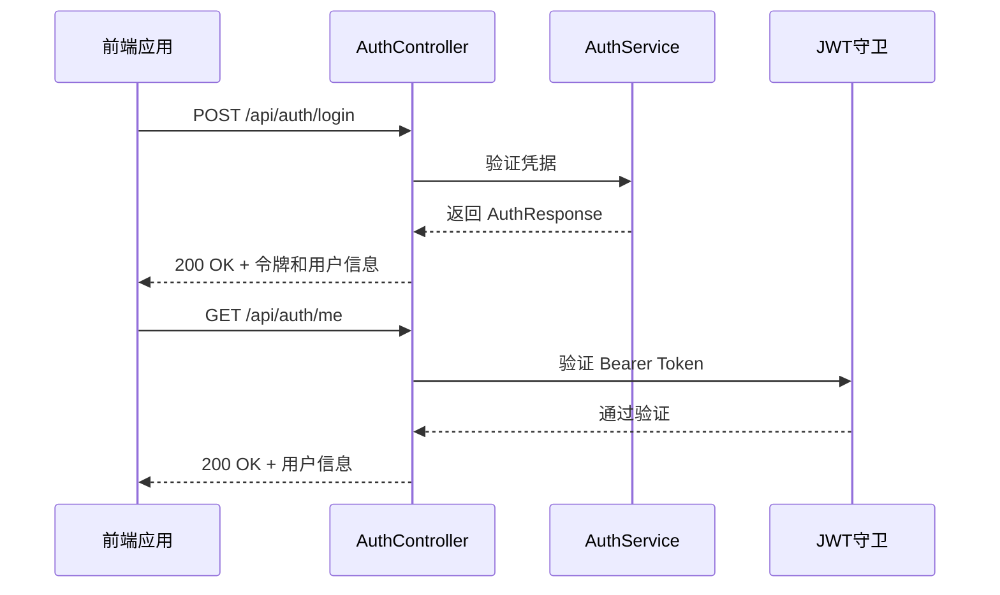

# API 参考

<cite>
**本文档中引用的文件**  
- [main.ts](file://apps/backend/src/main.ts)
- [app.module.ts](file://apps/backend/src/app.module.ts)
- [auth.controller.ts](file://apps/backend/src/auth/auth.controller.ts)
- [users.controller.ts](file://apps/backend/src/users/users.controller.ts)
- [upload.controller.ts](file://apps/backend/src/upload/upload.controller.ts)
- [health.controller.ts](file://apps/backend/src/health/health.controller.ts)
- [auth.dto.ts](file://apps/backend/src/auth/auth.dto.ts)
- [common.dto.ts](file://packages/shared/src/dto/common.dto.ts)
- [auth.schema.ts](file://packages/shared/src/schemas/auth.schema.ts)
- [index.ts](file://apps/frontend/src/api/index.ts)
- [all-exceptions.filter.ts](file://apps/backend/src/common/filters/all-exceptions.filter.ts)
- [transform.interceptor.ts](file://apps/backend/src/common/interceptors/transform.interceptor.ts)
</cite>

## 目录
1. [Swagger UI 使用指南](#swagger-ui-使用指南)
2. [API 响应格式](#api-响应格式)
3. [认证 API](#认证-api)
4. [用户 API](#用户-api)
5. [上传 API](#上传-api)
6. [健康检查 API](#健康检查-api)
7. [前端 API 客户端](#前端-api-客户端)
8. [错误码与异常处理](#错误码与异常处理)
9. [认证流程](#认证流程)

## Swagger UI 使用指南

本项目集成了 Swagger UI，用于可视化展示和测试所有 RESTful API 端点。开发者可以通过以下步骤访问和使用 Swagger UI：

1. 启动后端服务后，访问 `http://localhost:3000/api/docs`（端口可能根据配置不同而变化）。
2. Swagger UI 页面将展示所有已定义的 API 分组（如“认证”、“用户”、“上传”等）。
3. 每个 API 端点都详细列出了 HTTP 方法、URL 路径、请求头、请求体 Schema 和响应体 Schema。
4. 可以直接在页面上输入参数并点击“Try it out”按钮来测试 API，无需使用外部工具。

Swagger 文档由 `@nestjs/swagger` 装饰器（如 `@ApiTags`、`@ApiOperation`、`@ApiBody`）自动生成，并结合 Zod Schema 提供精确的请求/响应验证。

**Section sources**
- [main.ts](file://apps/backend/src/main.ts#L74-L83)
- [app.module.ts](file://apps/backend/src/app.module.ts)

## API 响应格式

所有 API 接口遵循统一的响应格式，确保前端能够一致地处理成功和错误响应。后端通过 `TransformInterceptor` 拦截器自动包装成功响应，通过 `AllExceptionsFilter` 过滤器处理异常响应。

### 成功响应格式
```json
{
  "success": true,
  "data": {},
  "message": "操作成功",
  "timestamp": "2023-12-01T10:00:00.000Z"
}
```

### 错误响应格式
```json
{
  "success": false,
  "data": null,
  "message": "错误描述",
  "statusCode": 400,
  "timestamp": "2023-12-01T10:00:00.000Z"
}
```

### 统一响应接口定义
后端和前端共享统一的 TypeScript 接口定义，位于 `packages/shared/src/dto/common.dto.ts`。

#### ApiResponse<T>
通用 API 响应格式接口，用于包装所有成功和失败的响应。

```typescript
/**
 * 通用 API 响应格式
 */
export interface ApiResponse<T = unknown> {
  /** 是否成功 */
  success: boolean
  /** 响应数据 */
  data: T
  /** 消息描述 */
  message?: string
  /** 时间戳 */
  timestamp: string
}
```

#### PaginatedResponse<T>
分页响应格式接口，用于包装分页查询结果。

```typescript
/**
 * 分页响应格式
 */
export interface PaginatedResponse<T> {
  /** 数据列表 */
  items: T[]
  /** 总数 */
  total: number
  /** 当前页码 */
  page: number
  /** 每页数量 */
  pageSize: number
  /** 总页数 */
  totalPages: number
}
```

#### PaginationQuery
分页查询参数接口，用于定义分页查询的输入参数。

```typescript
/**
 * 分页查询参数
 */
export interface PaginationQuery {
  /** 页码 */
  page?: number
  /** 每页数量 */
  pageSize?: number
}
```

#### 响应字段说明
| 字段名 | 类型 | 说明 |
|--------|------|------|
| `success` | boolean | 操作是否成功 |
| `data` | any | 响应数据，失败时为 `null` |
| `message` | string | 消息描述 |
| `timestamp` | string | 时间戳（ISO 8601 格式） |
| `statusCode` | number | HTTP 状态码（仅错误响应包含） |
| `items` | T[] | 数据列表（仅分页响应包含） |
| `total` | number | 总数（仅分页响应包含） |
| `page` | number | 当前页码（仅分页响应包含） |
| `pageSize` | number | 每页数量（仅分页响应包含） |
| `totalPages` | number | 总页数（仅分页响应包含） |

**Section sources**
- [common.dto.ts](file://packages/shared/src/dto/common.dto.ts#L4-L39)
- [transform.interceptor.ts](file://apps/backend/src/common/interceptors/transform.interceptor.ts#L8-L27)
- [all-exceptions.filter.ts](file://apps/backend/src/common/filters/all-exceptions.filter.ts#L22-L27)

## 认证 API

认证 API 提供用户登录、刷新令牌和获取当前用户信息的功能。所有需要认证的接口都需要在请求头中携带 `Authorization: Bearer <token>`。



**Diagram sources**
- [auth.controller.ts](file://apps/backend/src/auth/auth.controller.ts)
- [auth.service.ts](file://apps/backend/src/auth/auth.service.ts)
- [jwt-auth.guard.ts](file://apps/backend/src/auth/jwt-auth.guard.ts)

### 登录
- **HTTP 方法**: `POST`
- **URL 路径**: `/api/auth/login`
- **请求头**: `Content-Type: application/json`
- **请求体 Schema**:
  ```json
  {
    "email": "用户邮箱",
    "password": "用户密码"
  }
  ```
- **响应体 Schema**:
  ```json
  {
    "accessToken": "访问令牌",
    "refreshToken": "刷新令牌",
    "expiresIn": 3600,
    "user": {
      "id": 1,
      "email": "user@example.com",
      "name": "用户名",
      "avatar": null,
      "createdAt": "2023-12-01T10:00:00.000Z",
      "updatedAt": "2023-12-01T10:00:00.000Z"
    }
  }
  ```
- **速率限制**: 每分钟最多 5 次尝试

### 刷新令牌
- **HTTP 方法**: `POST`
- **URL 路径**: `/api/auth/refresh`
- **请求头**: `Content-Type: application/json`
- **请求体 Schema**:
  ```json
  {
    "refreshToken": "刷新令牌"
  }
  ```
- **响应体 Schema**: 同登录响应

### 获取当前用户信息
- **HTTP 方法**: `GET`
- **URL 路径**: `/api/auth/me`
- **请求头**: `Authorization: Bearer <token>`
- **响应体 Schema**: 用户信息对象（同登录响应中的 `user` 字段）

**Section sources**
- [auth.controller.ts](file://apps/backend/src/auth/auth.controller.ts)
- [auth.dto.ts](file://apps/backend/src/auth/auth.dto.ts)
- [auth.schema.ts](file://packages/shared/src/schemas/auth.schema.ts)

## 用户 API

用户 API 提供用户管理功能，包括获取用户列表、获取单个用户和创建用户。

### 获取所有用户
- **HTTP 方法**: `GET`
- **URL 路径**: `/api/users`
- **请求头**: `Authorization: Bearer <token>`
- **响应体 Schema**: `ApiResponse<User[]>`

### 获取单个用户
- **HTTP 方法**: `GET`
- **URL 路径**: `/api/users/:id`
- **请求头**: `Authorization: Bearer <token>`
- **响应体 Schema**: `ApiResponse<User>`

### 创建用户
- **HTTP 方法**: `POST`
- **URL 路径**: `/api/users`
- **请求头**: `Authorization: Bearer <token>`, `Content-Type: application/json`
- **请求体 Schema**:
  ```json
  {
    "email": "用户邮箱",
    "name": "用户名",
    "password": "用户密码"
  }
  ```
- **响应体 Schema**: `ApiResponse<User>`

**Section sources**
- [users.controller.ts](file://apps/backend/src/users/users.controller.ts)
- [users.service.ts](file://apps/backend/src/users/users.service.ts)

## 上传 API

上传 API 提供文件上传和删除功能，需要认证。

### 上传单个文件
- **HTTP 方法**: `POST`
- **URL 路径**: `/api/upload/single`
- **请求头**: `Authorization: Bearer <token>`
- **内容类型**: `multipart/form-data`
- **请求体**: `file` (binary)
- **响应体 Schema**: 上传结果对象

### 上传多个文件
- **HTTP 方法**: `POST`
- **URL 路径**: `/api/upload/multiple`
- **请求头**: `Authorization: Bearer <token>`
- **内容类型**: `multipart/form-data`
- **请求体**: `files` (array of binary, 最多 10 个)
- **响应体 Schema**: 上传结果对象数组

### 删除文件
- **HTTP 方法**: `DELETE`
- **URL 路径**: `/api/upload/:key`
- **请求头**: `Authorization: Bearer <token>`
- **响应体 Schema**: `{ success: boolean }`

**Section sources**
- [upload.controller.ts](file://apps/backend/src/upload/upload.controller.ts)
- [storage.service.ts](file://apps/backend/src/upload/storage.service.ts)

## 健康检查 API

健康检查 API 提供系统健康状态，用于监控和容器编排。

### 综合健康检查
- **HTTP 方法**: `GET`
- **URL 路径**: `/api/health`
- **响应体 Schema**: 包含数据库、Redis、内存和磁盘的健康状态

### 存活探针
- **HTTP 方法**: `GET`
- **URL 路径**: `/api/health/liveness`
- **响应体 Schema**: `{ status: 'ok', timestamp: string }`

### 就绪探针
- **HTTP 方法**: `GET`
- **URL 路径**: `/api/health/readiness`
- **响应体 Schema**: 包含数据库和 Redis 的健康状态

**Section sources**
- [health.controller.ts](file://apps/backend/src/health/health.controller.ts)
- [prisma.health.ts](file://apps/backend/src/health/prisma.health.ts)
- [redis.health.ts](file://apps/backend/src/redis/redis.health.ts)

## 前端 API 客户端

前端封装了 API 客户端，位于 `apps/frontend/src/api/index.ts`，提供类型安全的函数调用。

### 使用方法
```typescript
import { api } from '@/api'

// 获取用户列表
const response = await api.getUsers()
if (response.success) {
  console.log(response.data) // User[]
}

// 创建用户
const response = await api.createUser({
  email: 'user@example.com',
  name: '用户名',
  password: '密码'
})
```

### 客户端特性
- 自动在请求头中添加 `Authorization: Bearer <token>`（从 localStorage 读取）
- 非 GET 请求自动添加 CSRF token（从 cookie 读取）
- 响应拦截器自动处理 401 错误（清除 token）
- 基于 axios 的 HTTP 客户端，超时时间为 10 秒
- 使用 `ApiResponse<T>` 接口进行类型定义，确保类型安全

**Section sources**
- [index.ts](file://apps/frontend/src/api/index.ts)
- [auth.ts](file://apps/frontend/src/stores/auth.ts)

## 错误码与异常处理

系统使用全局异常过滤器统一处理所有异常，返回标准化的错误响应。

### 常见错误码
| 状态码 | 说明 |
|--------|------|
| 400 | 请求参数错误 |
| 401 | 未授权（Token 无效或过期） |
| 403 | 禁止访问 |
| 404 | 资源未找到 |
| 429 | 请求过于频繁（速率限制） |
| 500 | 服务器内部错误 |

### 异常处理流程
1. 当发生异常时，`AllExceptionsFilter` 捕获异常。
2. 根据异常类型确定 HTTP 状态码和错误消息。
3. 返回标准化的错误响应格式。

**Section sources**
- [all-exceptions.filter.ts](file://apps/backend/src/common/filters/all-exceptions.filter.ts)

## 认证流程

本系统采用 JWT（JSON Web Token）进行认证，流程如下：

1. 用户通过 `/api/auth/login` 接口登录，提供邮箱和密码。
2. 服务器验证凭据，生成访问令牌（access token）和刷新令牌（refresh token）。
3. 前端将访问令牌存储在 `localStorage` 中，并在后续请求的 `Authorization` 头中携带。
4. 当访问令牌过期时，前端使用刷新令牌调用 `/api/auth/refresh` 接口获取新的访问令牌。
5. 用户登出时，前端清除 `localStorage` 中的令牌。

**Section sources**
- [auth.controller.ts](file://apps/backend/src/auth/auth.controller.ts)
- [jwt.strategy.ts](file://apps/backend/src/auth/jwt.strategy.ts)
- [auth.ts](file://apps/frontend/src/stores/auth.ts)