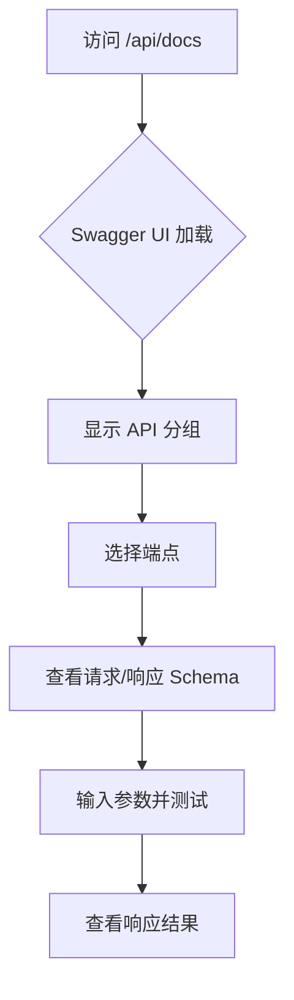
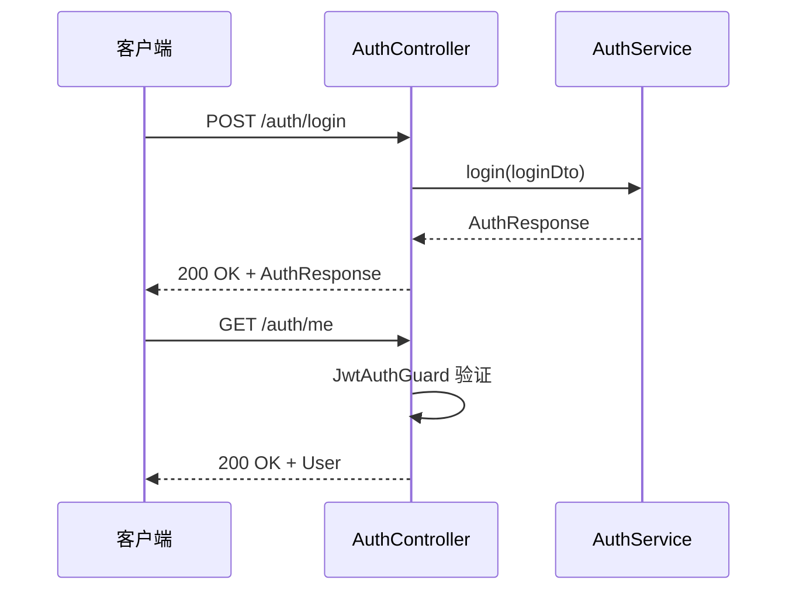
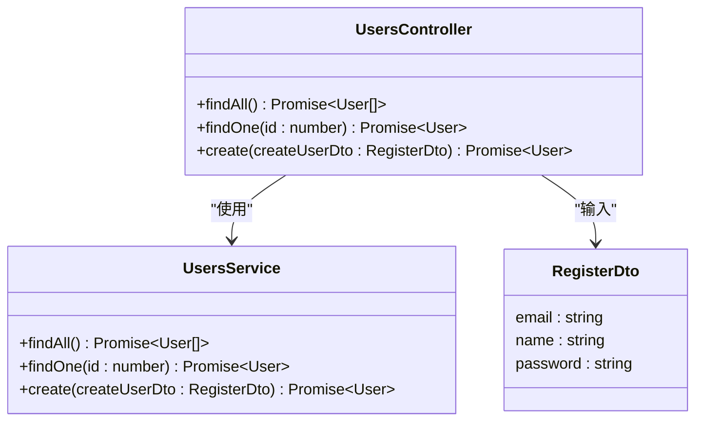
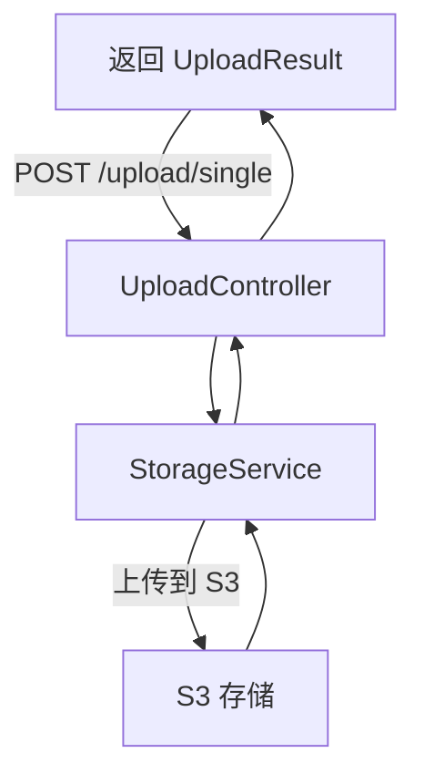
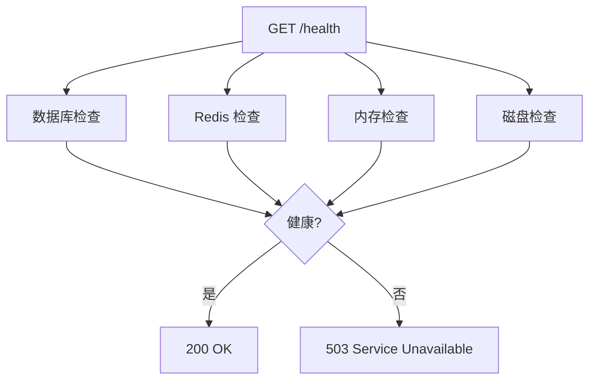
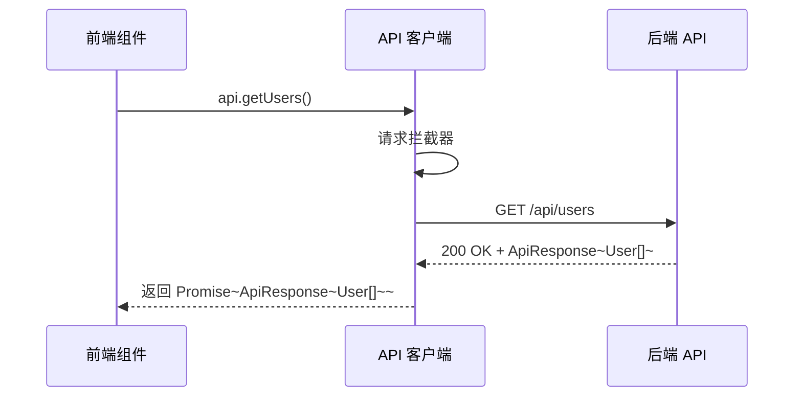
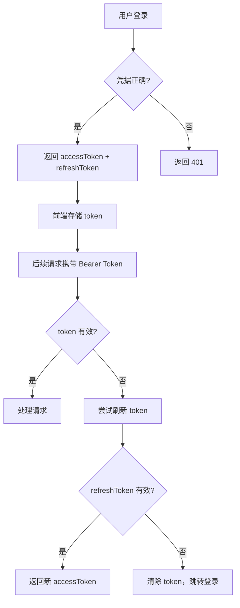

# RESTful API

<cite>
**本文档中引用的文件**  
- [auth.controller.ts](file://apps/backend/src/auth/auth.controller.ts)
- [users.controller.ts](file://apps/backend/src/users/users.controller.ts)
- [upload.controller.ts](file://apps/backend/src/upload/upload.controller.ts)
- [health.controller.ts](file://apps/backend/src/health/health.controller.ts)
- [index.ts](file://apps/frontend/src/api/index.ts)
- [auth.dto.ts](file://apps/backend/src/auth/auth.dto.ts)
- [auth.schema.ts](file://packages/shared/src/schemas/auth.schema.ts)
- [common.dto.ts](file://packages/shared/src/dto/common.dto.ts)
- [jwt-auth.guard.ts](file://apps/backend/src/auth/jwt-auth.guard.ts)
- [storage.service.ts](file://apps/backend/src/upload/storage.service.ts)
- [all-exceptions.filter.ts](file://apps/backend/src/common/filters/all-exceptions.filter.ts)
- [transform.interceptor.ts](file://apps/backend/src/common/interceptors/transform.interceptor.ts)
- [csrf.middleware.ts](file://apps/backend/src/common/middlewares/csrf.middleware.ts)
- [main.ts](file://apps/backend/src/main.ts)
</cite>

## 目录
1. [简介](#简介)
2. [Swagger UI 使用指南](#swagger-ui-使用指南)
3. [认证 API](#认证-api)
4. [用户管理 API](#用户管理-api)
5. [文件上传 API](#文件上传-api)
6. [健康检查 API](#健康检查-api)
7. [前端 API 客户端](#前端-api-客户端)
8. [错误码与认证流程](#错误码与认证流程)

## 简介
本项目提供一个基于 NestJS 和 Vue 的全栈模板，后端通过 RESTful API 提供服务，前端通过封装的 API 客户端进行调用。API 遵循统一的响应格式，使用 JWT 进行认证，并通过 Swagger 自动生成文档。所有接口均以 `/api` 为前缀，Swagger UI 文档位于 `/api/docs`。

## Swagger UI 使用指南
开发者可通过访问 `/api/docs` 来使用 Swagger UI 探索和测试所有 API 端点。Swagger UI 提供了交互式界面，允许用户查看每个端点的详细信息，包括 HTTP 方法、URL 路径、请求头、请求体 Schema 和响应体 Schema。

Swagger 文档在 `main.ts` 中配置，使用 `@nestjs/swagger` 模块生成。通过 `DocumentBuilder` 设置了 API 标题、描述、版本，并添加了 Bearer Token 认证支持。文档路径为 `/api/docs`，启动后可通过日志查看访问地址。

**Diagram sources**  
- [main.ts](file://apps/backend/src/main.ts#L74-L83)

**Section sources**  
- [main.ts](file://apps/backend/src/main.ts#L74-L83)

## 认证 API
认证 API 由 `AuthController` 实现，使用 `@ApiTags('认证')` 标记，包含登录、刷新令牌和获取当前用户信息等操作。所有需要认证的接口均使用 `JwtAuthGuard` 守卫，并通过 `@ApiBearerAuth()` 在 Swagger 中声明 Bearer Token 认证。

### 登录 (POST /auth/login)
用户通过邮箱和密码登录，成功后返回包含访问令牌和用户信息的响应。该接口有速率限制（每分钟最多 5 次尝试），防止暴力破解。

- **请求体 Schema**: `LoginSchema`
  - `email`: 字符串，必填，有效邮箱格式
  - `password`: 字符串，必填，至少 6 个字符
- **响应体 Schema**: `AuthResponseSchema`
  - `accessToken`: 访问令牌
  - `refreshToken`: 刷新令牌（可选）
  - `user`: 用户信息对象

### 刷新令牌 (POST /auth/refresh)
使用刷新令牌获取新的访问令牌，延长会话有效期。该接口也有速率限制（每分钟最多 10 次）。

- **请求体 Schema**: `RefreshTokenSchema`
  - `refreshToken`: 字符串，必填
- **响应体 Schema**: `AuthResponseSchema`

### 获取当前用户信息 (GET /auth/me)
获取当前认证用户的信息。该接口已通过 JWT 认证，因此跳过速率限制。

- **请求头**: `Authorization: Bearer <token>`
- **响应体 Schema**: `UserSchema`
  - `id`: 用户 ID
  - `email`: 邮箱
  - `name`: 用户名
  - `avatar`: 头像 URL（可选）

**Diagram sources**  
- [auth.controller.ts](file://apps/backend/src/auth/auth.controller.ts#L18-L49)
- [auth.dto.ts](file://apps/backend/src/auth/auth.dto.ts#L8-L18)
- [auth.schema.ts](file://packages/shared/src/schemas/auth.schema.ts#L24-L78)

**Section sources**  
- [auth.controller.ts](file://apps/backend/src/auth/auth.controller.ts#L13-L51)
- [auth.dto.ts](file://apps/backend/src/auth/auth.dto.ts#L8-L18)
- [auth.schema.ts](file://packages/shared/src/schemas/auth.schema.ts#L24-L94)
- [jwt-auth.guard.ts](file://apps/backend/src/auth/jwt-auth.guard.ts#L8-L10)

## 用户管理 API
用户管理 API 由 `UsersController` 实现，使用 `@ApiTags('用户')` 标记，包含获取用户列表、获取单个用户和创建用户等操作。所有操作均使用 Zod 验证和全局验证管道。

### 获取所有用户 (GET /users)
返回所有用户的信息列表。

- **响应体 Schema**: `User[]`

### 获取单个用户 (GET /users/:id)
根据用户 ID 获取单个用户的信息。

- **路径参数**: `id` (number)
- **响应体 Schema**: `User`

### 创建用户 (POST /users)
创建新用户（注册）。请求体基于 `RegisterSchema`，包含邮箱、用户名和密码。

- **请求体 Schema**: `RegisterSchema`
  - `email`: 邮箱
  - `name`: 用户名，2-50 字符
  - `password`: 密码，至少 6 字符，需包含字母和数字
- **响应体 Schema**: `User`

**Diagram sources**  
- [users.controller.ts](file://apps/backend/src/users/users.controller.ts#L11-L43)
- [auth.dto.ts](file://apps/backend/src/auth/auth.dto.ts#L13-L18)
- [auth.schema.ts](file://packages/shared/src/schemas/auth.schema.ts#L32-L42)

**Section sources**  
- [users.controller.ts](file://apps/backend/src/users/users.controller.ts#L11-L43)
- [auth.dto.ts](file://apps/backend/src/auth/auth.dto.ts#L13-L18)
- [auth.schema.ts](file://packages/shared/src/schemas/auth.schema.ts#L32-L94)

## 文件上传 API
文件上传 API 由 `UploadController` 实现，使用 `@ApiTags('上传')` 标记，支持单个和多个文件上传，以及文件删除。所有接口均需 JWT 认证。

### 上传单个文件 (POST /upload/single)
上传单个文件，使用 `multipart/form-data` 格式。

- **请求头**: `Authorization: Bearer <token>`
- **请求格式**: `multipart/form-data`
- **字段**: `file` (binary)
- **响应体 Schema**: `UploadResult`
  - `key`: 文件唯一键
  - `url`: 文件访问 URL
  - `bucket`: 存储桶名称
  - `size`: 文件大小
  - `mimetype`: MIME 类型

### 上传多个文件 (POST /upload/multiple)
上传多个文件（最多 10 个）。

- **字段**: `files` (array of binary)

### 删除文件 (DELETE /upload/:key)
根据文件 key 删除文件。

- **路径参数**: `key` (string)

文件存储由 `StorageService` 实现，支持 AWS S3 及兼容协议的存储服务（如阿里云 OSS、MinIO）。文件上传后返回公开访问 URL。

**Diagram sources**  
- [upload.controller.ts](file://apps/backend/src/upload/upload.controller.ts#L20-L84)
- [storage.service.ts](file://apps/backend/src/upload/storage.service.ts#L26-L124)

**Section sources**  
- [upload.controller.ts](file://apps/backend/src/upload/upload.controller.ts#L20-L84)
- [storage.service.ts](file://apps/backend/src/upload/storage.service.ts#L26-L124)

## 健康检查 API
健康检查 API 由 `HealthController` 实现，使用 `@nestjs/terminus` 提供全面的健康检查功能，用于系统监控和 Kubernetes 探针。

### 综合健康检查 (GET /health)
检查数据库、Redis、内存和磁盘状态。任何一项失败则整体状态为失败。

### 存活探针 (GET /health/liveness)
简单存活检查，用于 Kubernetes liveness probe，只要服务运行即返回成功。

### 就绪探针 (GET /health/readiness)
检查关键依赖（数据库和 Redis）是否就绪，用于 Kubernetes readiness probe。

**Diagram sources**  
- [health.controller.ts](file://apps/backend/src/health/health.controller.ts#L16-L77)

**Section sources**  
- [health.controller.ts](file://apps/backend/src/health/health.controller.ts#L16-L77)

## 前端 API 客户端
前端 API 客户端位于 `apps/frontend/src/api/index.ts`，使用 Axios 封装了所有 API 调用。客户端自动处理认证和 CSRF 保护。

### 客户端配置
- **基础 URL**: `/api`
- **超时时间**: 10 秒
- **请求拦截器**: 自动添加 `Authorization: Bearer <token>` 和 CSRF token
- **响应拦截器**: 处理 401 错误，自动清除 token

### 封装的 API 函数
- `getUsers()`: 获取用户列表
- `getUser(id)`: 获取单个用户
- `createUser(userData)`: 创建用户

所有响应均符合 `ApiResponse<T>` 格式，包含 `success`、`data`、`message` 和 `timestamp` 字段。

**Diagram sources**  
- [index.ts](file://apps/frontend/src/api/index.ts#L7-L92)

**Section sources**  
- [index.ts](file://apps/frontend/src/api/index.ts#L7-L92)
- [common.dto.ts](file://packages/shared/src/dto/common.dto.ts#L4-L13)

## 错误码与认证流程
### 常见错误码
- **401 未授权**: 认证失败或 token 过期
- **403 禁止访问**: 权限不足
- **429 速率限制**: 请求过于频繁
- **500 服务器内部错误**: 服务器异常

### 认证流程
1. 用户调用 `POST /auth/login` 进行登录
2. 服务器验证凭据，返回 `accessToken` 和 `refreshToken`
3. 前端将 `accessToken` 存入 `localStorage`，并在后续请求的 `Authorization` 头中携带
4. 当 `accessToken` 过期时，使用 `refreshToken` 调用 `POST /auth/refresh` 获取新 token
5. 若 `refreshToken` 也失效，则需重新登录

全局异常过滤器 `AllExceptionsFilter` 统一处理所有未捕获异常，返回标准化错误响应。响应转换拦截器 `TransformInterceptor` 将成功响应包装为 `ApiResponse` 格式。

**Diagram sources**  
- [all-exceptions.filter.ts](file://apps/backend/src/common/filters/all-exceptions.filter.ts#L8-L31)
- [transform.interceptor.ts](file://apps/backend/src/common/interceptors/transform.interceptor.ts#L18-L30)
- [csrf.middleware.ts](file://apps/backend/src/common/middlewares/csrf.middleware.ts#L15-L93)

**Section sources**  
- [all-exceptions.filter.ts](file://apps/backend/src/common/filters/all-exceptions.filter.ts#L8-L31)
- [transform.interceptor.ts](file://apps/backend/src/common/interceptors/transform.interceptor.ts#L18-L30)
- [csrf.middleware.ts](file://apps/backend/src/common/middlewares/csrf.middleware.ts#L15-L93)
- [main.ts](file://apps/backend/src/main.ts#L65-L73)