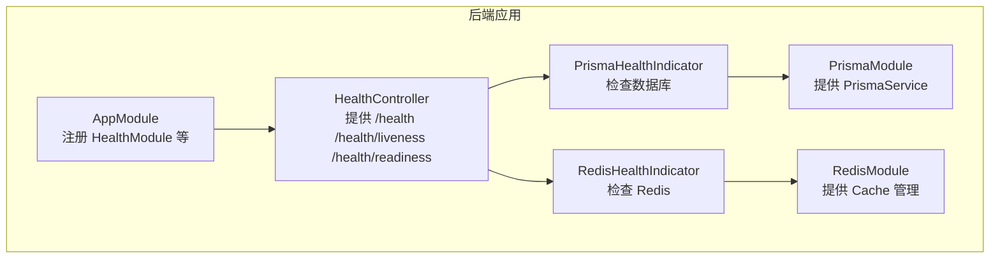
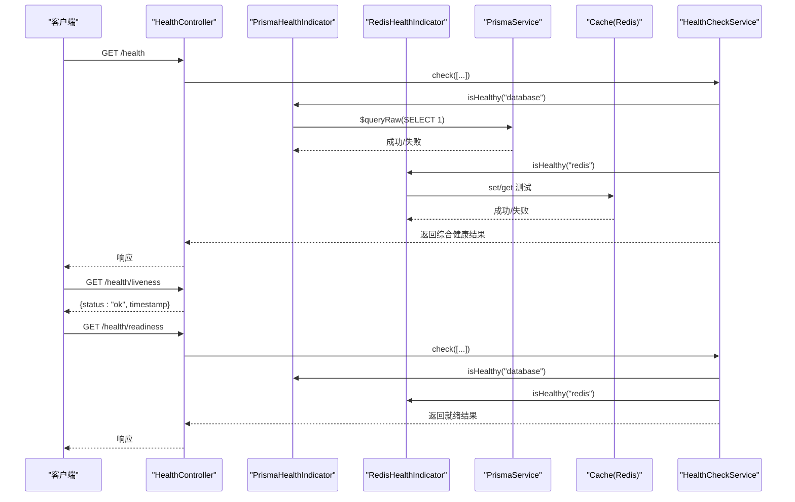
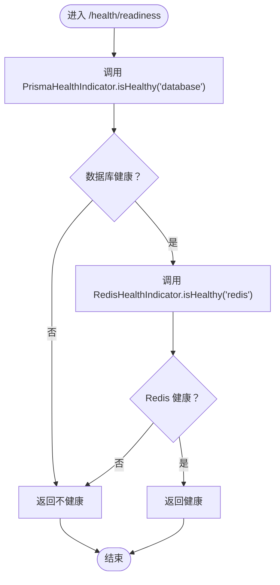
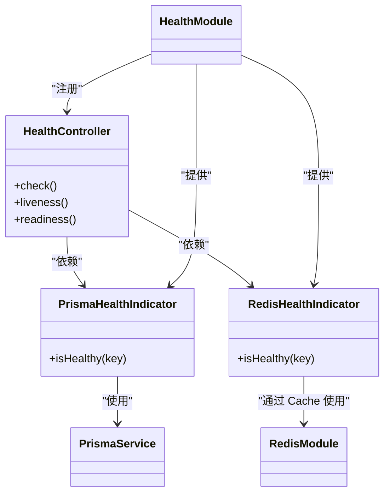

# 健康检查 API

<cite>
**本文引用的文件**
- [apps/backend/src/health/health.controller.ts](file://apps/backend/src/health/health.controller.ts)
- [apps/backend/src/health/health.module.ts](file://apps/backend/src/health/health.module.ts)
- [apps/backend/src/health/prisma.health.ts](file://apps/backend/src/health/prisma.health.ts)
- [apps/backend/src/redis/redis.health.ts](file://apps/backend/src/redis/redis.health.ts)
- [apps/backend/src/redis/redis.module.ts](file://apps/backend/src/redis/redis.module.ts)
- [apps/backend/src/prisma/prisma.module.ts](file://apps/backend/src/prisma/prisma.module.ts)
- [apps/backend/src/prisma/prisma.service.ts](file://apps/backend/src/prisma/prisma.service.ts)
- [apps/backend/src/app.module.ts](file://apps/backend/src/app.module.ts)
- [apps/backend/package.json](file://apps/backend/package.json)
- [docker-compose.yml](file://docker-compose.yml)
- [apps/backend/src/main.ts](file://apps/backend/src/main.ts)
</cite>

## 目录
1. [简介](#简介)
2. [项目结构](#项目结构)
3. [核心组件](#核心组件)
4. [架构总览](#架构总览)
5. [详细组件分析](#详细组件分析)
6. [依赖关系分析](#依赖关系分析)
7. [性能与稳定性考量](#性能与稳定性考量)
8. [故障排查指南](#故障排查指南)
9. [结论](#结论)
10. [附录](#附录)

## 简介
本文件系统性地介绍后端健康检查 API，覆盖以下三个核心端点：
- 综合健康检查：GET /health
- 存活探针：GET /health/liveness
- 就绪探针：GET /health/readiness

这些端点用于容器编排平台（如 Kubernetes、Docker Compose）进行健康监控与自动恢复。其中：
- liveness 探针用于判断应用进程是否仍在运行；
- readiness 探针用于判断应用是否已准备好接收流量，当前实现会检查数据库（PrismaHealthIndicator）与 Redis 缓存（RedisHealthIndicator）是否可用；
- 综合健康检查会同时检查数据库、Redis、内存与磁盘状态，便于一次性诊断。

该 API 无需认证，可公开访问；响应遵循 @nestjs/terminus 的标准格式，便于与监控系统对接。

## 项目结构
健康检查相关代码位于后端应用的 health 与 redis、prisma 模块中，整体组织如下：
- 控制器层：HealthController 提供三个端点
- 健康指示器：PrismaHealthIndicator、RedisHealthIndicator
- 模块装配：HealthModule、PrismaModule、RedisModule
- 应用入口：AppModule 引入 HealthModule 并排除健康检查端点的日志记录

图表来源
- [apps/backend/src/health/health.controller.ts](file://apps/backend/src/health/health.controller.ts#L1-L76)
- [apps/backend/src/health/health.module.ts](file://apps/backend/src/health/health.module.ts#L1-L13)
- [apps/backend/src/health/prisma.health.ts](file://apps/backend/src/health/prisma.health.ts#L1-L31)
- [apps/backend/src/redis/redis.health.ts](file://apps/backend/src/redis/redis.health.ts#L1-L42)
- [apps/backend/src/prisma/prisma.module.ts](file://apps/backend/src/prisma/prisma.module.ts#L1-L9)
- [apps/backend/src/redis/redis.module.ts](file://apps/backend/src/redis/redis.module.ts#L1-L84)
- [apps/backend/src/app.module.ts](file://apps/backend/src/app.module.ts#L1-L159)

章节来源
- [apps/backend/src/health/health.controller.ts](file://apps/backend/src/health/health.controller.ts#L1-L76)
- [apps/backend/src/health/health.module.ts](file://apps/backend/src/health/health.module.ts#L1-L13)
- [apps/backend/src/app.module.ts](file://apps/backend/src/app.module.ts#L1-L159)

## 核心组件
- HealthController：定义三个端点，分别对应综合健康检查、存活探针与就绪探针
- PrismaHealthIndicator：基于 PrismaService 执行轻量查询以判断数据库可用性
- RedisHealthIndicator：通过 Cache 管理器进行一次写入/读取操作以判断 Redis 可用性
- HealthModule：装配 TerminusModule、PrismaModule，并注册控制器与健康指示器
- RedisModule：提供全局缓存管理器（ioredis），供 RedisHealthIndicator 使用
- PrismaModule：提供 PrismaService，供 PrismaHealthIndicator 使用

章节来源
- [apps/backend/src/health/health.controller.ts](file://apps/backend/src/health/health.controller.ts#L1-L76)
- [apps/backend/src/health/prisma.health.ts](file://apps/backend/src/health/prisma.health.ts#L1-L31)
- [apps/backend/src/redis/redis.health.ts](file://apps/backend/src/redis/redis.health.ts#L1-L42)
- [apps/backend/src/health/health.module.ts](file://apps/backend/src/health/health.module.ts#L1-L13)
- [apps/backend/src/redis/redis.module.ts](file://apps/backend/src/redis/redis.module.ts#L1-L84)
- [apps/backend/src/prisma/prisma.module.ts](file://apps/backend/src/prisma/prisma.module.ts#L1-L9)

## 架构总览
下图展示了健康检查端点的调用链与依赖关系：

图表来源
- [apps/backend/src/health/health.controller.ts](file://apps/backend/src/health/health.controller.ts#L1-L76)
- [apps/backend/src/health/prisma.health.ts](file://apps/backend/src/health/prisma.health.ts#L1-L31)
- [apps/backend/src/redis/redis.health.ts](file://apps/backend/src/redis/redis.health.ts#L1-L42)
- [apps/backend/src/prisma/prisma.service.ts](file://apps/backend/src/prisma/prisma.service.ts#L1-L20)
- [apps/backend/src/redis/redis.module.ts](file://apps/backend/src/redis/redis.module.ts#L1-L84)

## 详细组件分析

### 综合健康检查：GET /health
- 功能：对数据库、Redis、内存与磁盘进行联合健康检查
- 关键逻辑：
  - 数据库：调用 PrismaHealthIndicator.isHealthy('database')
  - Redis：调用 RedisHealthIndicator.isHealthy('redis')
  - 内存：检查堆使用与 RSS，设置阈值
  - 磁盘：检查根分区使用率阈值
- 响应：由 @nestjs/terminus 统一返回健康状态，包含各子指标详情
- 适用场景：一次性全面诊断，适合手动巡检或非关键环境的健康评估

章节来源
- [apps/backend/src/health/health.controller.ts](file://apps/backend/src/health/health.controller.ts#L27-L51)
- [apps/backend/src/health/prisma.health.ts](file://apps/backend/src/health/prisma.health.ts#L1-L31)
- [apps/backend/src/redis/redis.health.ts](file://apps/backend/src/redis/redis.health.ts#L1-L42)

### 存活探针：GET /health/liveness
- 功能：最简存活探针，仅确认进程处于运行状态
- 关键逻辑：直接返回固定结构的健康对象
- 响应：包含状态与时间戳
- 适用场景：Kubernetes livenessProbe，快速判定进程是否存活

章节来源
- [apps/backend/src/health/health.controller.ts](file://apps/backend/src/health/health.controller.ts#L53-L61)

### 就绪探针：GET /health/readiness
- 功能：关键依赖就绪检查，当前实现检查数据库与 Redis
- 关键逻辑：调用 PrismaHealthIndicator 与 RedisHealthIndicator 的 isHealthy 方法
- 响应：由 @nestjs/terminus 统一返回健康状态
- 适用场景：Kubernetes readinessProbe，确保只有在数据库与 Redis 正常时才对外暴露流量

章节来源
- [apps/backend/src/health/health.controller.ts](file://apps/backend/src/health/health.controller.ts#L63-L75)
- [apps/backend/src/health/prisma.health.ts](file://apps/backend/src/health/prisma.health.ts#L1-L31)
- [apps/backend/src/redis/redis.health.ts](file://apps/backend/src/redis/redis.health.ts#L1-L42)

### PrismaHealthIndicator 实现要点
- 通过 PrismaService 执行一次轻量查询以验证数据库连通性
- 成功返回健康状态，异常则抛出 HealthCheckError，交由 @nestjs/terminus 统一处理

章节来源
- [apps/backend/src/health/prisma.health.ts](file://apps/backend/src/health/prisma.health.ts#L1-L31)
- [apps/backend/src/prisma/prisma.service.ts](file://apps/backend/src/prisma/prisma.service.ts#L1-L20)

### RedisHealthIndicator 实现要点
- 通过 Cache 管理器进行一次写入与读取测试，验证 Redis 连通性与基本读写能力
- 成功返回健康状态，异常则抛出 HealthCheckError，交由 @nestjs/terminus 统一处理

章节来源
- [apps/backend/src/redis/redis.health.ts](file://apps/backend/src/redis/redis.health.ts#L1-L42)
- [apps/backend/src/redis/redis.module.ts](file://apps/backend/src/redis/redis.module.ts#L1-L84)

### 健康检查流程图（就绪探针）

图表来源
- [apps/backend/src/health/health.controller.ts](file://apps/backend/src/health/health.controller.ts#L63-L75)
- [apps/backend/src/health/prisma.health.ts](file://apps/backend/src/health/prisma.health.ts#L1-L31)
- [apps/backend/src/redis/redis.health.ts](file://apps/backend/src/redis/redis.health.ts#L1-L42)

## 依赖关系分析
- HealthController 依赖 HealthCheckService、PrismaHealthIndicator、RedisHealthIndicator、MemoryHealthIndicator、DiskHealthIndicator
- PrismaHealthIndicator 依赖 PrismaService
- RedisHealthIndicator 依赖 Cache 管理器（由 RedisModule 注册）
- HealthModule 导入 TerminusModule、PrismaModule，并注册控制器与指示器
- AppModule 引入 HealthModule，并配置日志排除 /health 请求

图表来源
- [apps/backend/src/health/health.controller.ts](file://apps/backend/src/health/health.controller.ts#L1-L76)
- [apps/backend/src/health/prisma.health.ts](file://apps/backend/src/health/prisma.health.ts#L1-L31)
- [apps/backend/src/redis/redis.health.ts](file://apps/backend/src/redis/redis.health.ts#L1-L42)
- [apps/backend/src/prisma/prisma.service.ts](file://apps/backend/src/prisma/prisma.service.ts#L1-L20)
- [apps/backend/src/redis/redis.module.ts](file://apps/backend/src/redis/redis.module.ts#L1-L84)
- [apps/backend/src/health/health.module.ts](file://apps/backend/src/health/health.module.ts#L1-L13)

章节来源
- [apps/backend/src/app.module.ts](file://apps/backend/src/app.module.ts#L1-L159)
- [apps/backend/src/health/health.module.ts](file://apps/backend/src/health/health.module.ts#L1-L13)

## 性能与稳定性考量
- 探针开销极低：存活探针只做简单返回；就绪探针仅做数据库与 Redis 的轻量检查
- 终结者模块：统一健康检查结果与错误处理，避免重复逻辑
- 日志排除：应用层已配置自动忽略 /health 请求的日志输出，降低噪音
- 运行时资源：综合健康检查包含内存与磁盘检查，建议在生产环境中谨慎设置阈值，避免误报

章节来源
- [apps/backend/src/app.module.ts](file://apps/backend/src/app.module.ts#L77-L81)
- [apps/backend/src/health/health.controller.ts](file://apps/backend/src/health/health.controller.ts#L27-L51)

## 故障排查指南
- 数据库不可达
  - 现象：就绪探针与综合健康检查中的数据库项失败
  - 排查：确认数据库连接字符串、网络连通性、数据库服务状态
  - 参考实现位置：[apps/backend/src/health/prisma.health.ts](file://apps/backend/src/health/prisma.health.ts#L1-L31)、[apps/backend/src/prisma/prisma.service.ts](file://apps/backend/src/prisma/prisma.service.ts#L1-L20)
- Redis 不可用
  - 现象：就绪探针与综合健康检查中的 Redis 项失败
  - 排查：确认 Redis 地址、端口、密码、DB 索引、网络连通性；检查缓存模块初始化日志
  - 参考实现位置：[apps/backend/src/redis/redis.health.ts](file://apps/backend/src/redis/redis.health.ts#L1-L42)、[apps/backend/src/redis/redis.module.ts](file://apps/backend/src/redis/redis.module.ts#L1-L84)
- 探针频繁失败
  - 建议：调整探针探测间隔与超时参数；检查应用日志与数据库/Redis 侧慢查询
- 响应格式异常
  - 建议：确认 @nestjs/terminus 版本与依赖安装完整

章节来源
- [apps/backend/src/health/prisma.health.ts](file://apps/backend/src/health/prisma.health.ts#L1-L31)
- [apps/backend/src/redis/redis.health.ts](file://apps/backend/src/redis/redis.health.ts#L1-L42)
- [apps/backend/src/redis/redis.module.ts](file://apps/backend/src/redis/redis.module.ts#L1-L84)
- [apps/backend/src/prisma/prisma.service.ts](file://apps/backend/src/prisma/prisma.service.ts#L1-L20)

## 结论
本健康检查 API 以最小成本提供三类关键探针，满足容器编排平台的运行时保障需求。通过 @nestjs/terminus 统一健康检查框架，结合 Prisma 与 Redis 的轻量验证，既保证了准确性又兼顾了性能。建议在生产环境中合理配置探针参数与阈值，并结合日志与告警体系进行持续监控。

## 附录

### 端点与响应说明
- GET /health
  - 用途：综合健康检查，包含数据库、Redis、内存与磁盘检查
  - 响应：由 @nestjs/terminus 统一返回，包含各子指标状态
  - 适用：一次性全面诊断
- GET /health/liveness
  - 用途：存活探针，确认进程存活
  - 响应：包含状态与时间戳
  - 适用：Kubernetes livenessProbe
- GET /health/readiness
  - 用途：就绪探针，检查数据库与 Redis 是否可用
  - 响应：由 @nestjs/terminus 统一返回
  - 适用：Kubernetes readinessProbe

章节来源
- [apps/backend/src/health/health.controller.ts](file://apps/backend/src/health/health.controller.ts#L27-L75)

### 使用示例（curl）
- curl -s http://localhost:3000/health
- curl -s http://localhost:3000/health/liveness
- curl -s http://localhost:3000/health/readiness

章节来源
- [apps/backend/src/health/health.controller.ts](file://apps/backend/src/health/health.controller.ts#L27-L75)

### 在 Kubernetes 中的集成建议
- livenessProbe：使用 GET /health/liveness，探测间隔与超时按需调整
- readinessProbe：使用 GET /health/readiness，确保仅在数据库与 Redis 正常时对外暴露流量
- 建议：将探针超时时间设置为小于探测周期，避免并发探测导致的误判

章节来源
- [docker-compose.yml](file://docker-compose.yml#L69-L74)

### 在 Docker Compose 中的集成
- 后端服务已配置健康检查，使用 wget 访问 /health
- 前端服务同样配置了健康检查，可参考其模式

章节来源
- [docker-compose.yml](file://docker-compose.yml#L69-L74)
- [docker-compose.yml](file://docker-compose.yml#L92-L97)

### Prometheus 指标暴露可能性
- 当前实现未内置 Prometheus 指标导出；若需指标暴露，可在应用中引入 Prometheus 相关包并自定义指标
- 建议：将健康检查状态映射为指标（例如 up、health_status），并结合告警规则

章节来源
- [apps/backend/package.json](file://apps/backend/package.json#L21-L66)

### Swagger 文档与安全
- Swagger 文档已启用，但健康检查端点无需认证即可访问
- Swagger 文档地址：http://localhost:3000/api/docs

章节来源
- [apps/backend/src/main.ts](file://apps/backend/src/main.ts#L71-L93)