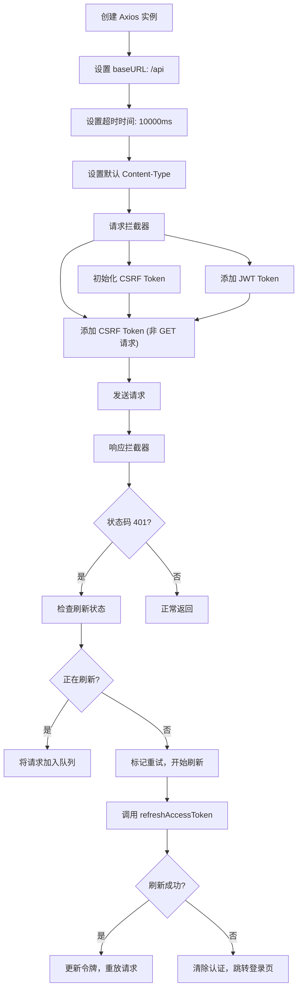
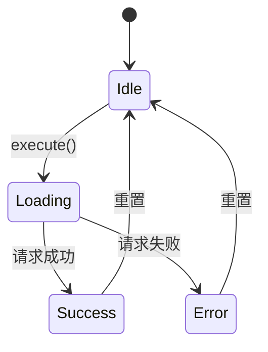
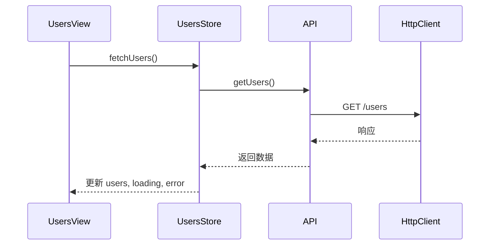
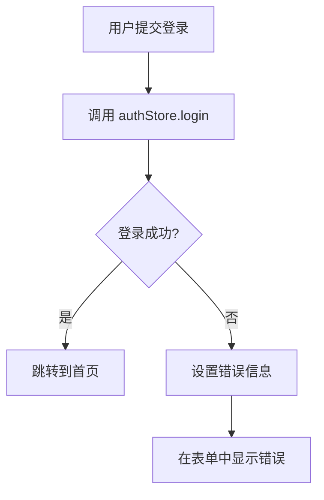

# 前端 API 客户端

<cite>
**本文档引用的文件**  
- [index.ts](file://apps/frontend/src/api/index.ts)
- [useRequest.ts](file://apps/frontend/src/composables/useRequest.ts)
- [auth.ts](file://apps/frontend/src/stores/auth.ts)
- [common.dto.ts](file://packages/shared/src/dto/common.dto.ts)
- [UsersView.vue](file://apps/frontend/src/views/UsersView.vue)
- [LoginForm.vue](file://apps/frontend/src/components/LoginForm.vue)
</cite>

## 目录
1. [简介](#简介)
2. [API 客户端实现](#api-客户端实现)
3. [核心 API 方法](#核心-api-方法)
4. [组合式函数 useRequest](#组合式函数-userequest)
5. [在 Vue 组件中的使用模式](#在-vue-组件中的使用模式)
6. [错误处理与状态管理](#错误处理与状态管理)
7. [与后端 RESTful API 的契约一致性](#与后端-restful-api-的契约一致性)

## 简介
本文档详细说明了前端项目中 API 客户端的实现与使用方式。重点介绍如何通过 Axios 封装统一的 HTTP 请求实例，处理基础 URL、超时、请求/响应拦截器（如自动添加 JWT Token），并结合组合式函数 `useRequest` 在 Vue 组件中进行调用。同时涵盖错误处理机制（如 token 过期自动跳转）和加载状态管理的最佳实践。

## API 客户端实现

前端 API 客户端基于 Axios 实现，封装在 `/src/api/index.ts` 文件中，提供统一的请求配置和拦截器处理。



**Diagram sources**  
- [index.ts](file://apps/frontend/src/api/index.ts#L7-L150)

**Section sources**  
- [index.ts](file://apps/frontend/src/api/index.ts#L1-L247)

### 请求拦截器
- **CSRF Token 初始化**：在首次请求前，自动调用 `initCsrfToken` 函数，通过向 `/health` 端点发起 GET 请求来获取并设置 CSRF token cookie，确保后续非 GET 请求的安全性。
- **JWT Token 添加**：自动从 `localStorage` 读取 `token`，并在请求头中添加 `Authorization: Bearer <token>`。
- **CSRF Token 添加**：对于非 `GET`、`HEAD`、`OPTIONS` 请求，从 cookie 中提取 `XSRF-TOKEN` 并设置 `X-XSRF-TOKEN` 请求头，防止 CSRF 攻击。

### 响应拦截器
更新了对 401 错误的处理机制，引入了令牌刷新和请求队列管理：
- **401 错误处理**：当收到 401 未授权响应时，启动令牌刷新流程。
- **令牌刷新队列**：使用 `isRefreshing` 标志防止并发刷新请求。当多个请求同时触发 401 时，后续请求会被加入队列，等待刷新完成。
- **请求重放**：成功刷新令牌后，通知队列中的所有等待请求，使用新令牌重新发送。
- **自动登出**：若刷新失败，则清除本地认证状态并重定向到登录页。

## 核心 API 方法

API 客户端通过 `api` 对象导出多个方法，均返回 `Promise<ApiResponse<T>>` 类型，符合统一响应格式。

| 方法名 | 参数 | 返回类型 | 说明 |
|--------|------|----------|------|
| `getUsers` | 无 | `Promise<ApiResponse<User[]>>` | 获取用户列表 |
| `getUser` | `id: number` | `Promise<ApiResponse<User>>` | 根据 ID 获取单个用户 |
| `createUser` | `userData: { email, name, password }` | `Promise<ApiResponse<User>>` | 创建新用户 |
| `login` | `credentials: LoginInput` | `Promise<ApiResponse<AuthResponse>>` | 用户登录 |
| `register` | `userData: RegisterInput` | `Promise<ApiResponse<AuthResponse>>` | 用户注册 |
| `refreshToken` | `refreshToken: string` | `Promise<ApiResponse<AuthResponse>>` | 刷新访问令牌 |

**Section sources**  
- [index.ts](file://apps/frontend/src/api/index.ts#L154-L243)
- [common.dto.ts](file://packages/shared/src/dto/common.dto.ts#L3-L12)

### 响应格式定义
所有 API 响应遵循 `ApiResponse<T>` 接口：

```typescript
interface ApiResponse<T> {
  success: boolean
  data: T
  message?: string
  timestamp: string
}
```

## 组合式函数 useRequest

`useRequest` 是一个通用的组合式函数，用于封装请求的加载状态、错误处理等逻辑。



**Diagram sources**  
- [useRequest.ts](file://apps/frontend/src/composables/useRequest.ts#L16-L43)

**Section sources**  
- [useRequest.ts](file://apps/frontend/src/composables/useRequest.ts#L1-L44)

### 功能特性
- 返回 `data`、`loading`、`error` 三个响应式状态。
- 提供 `execute` 方法手动触发请求。
- 自动处理异常并设置错误信息。

## 在 Vue 组件中的使用模式

API 客户端通常与 Pinia 状态管理结合使用，在组件中通过 `storeToRefs` 访问状态。

### 用户列表视图示例
在 `UsersView.vue` 中，通过 `useUsersStore` 调用 `fetchUsers` 方法获取数据，并在模板中展示加载、错误、空状态。



**Diagram sources**  
- [UsersView.vue](file://apps/frontend/src/views/UsersView.vue#L1-L67)
- [users.ts](file://apps/frontend/src/stores/users.ts#L1-L42)

**Section sources**  
- [UsersView.vue](file://apps/frontend/src/views/UsersView.vue#L1-L67)
- [users.ts](file://apps/frontend/src/stores/users.ts#L1-L42)

## 错误处理与状态管理

### Token 过期处理
当响应状态码为 401 时，响应拦截器会启动复杂的处理流程：
1. 检查是否已有刷新操作在进行。
2. 如果没有，则调用 `authStore.refreshAccessToken()` 方法尝试刷新令牌。
3. 如果有其他请求正在刷新，则将当前请求加入等待队列。
4. 刷新成功后，使用新令牌重放所有排队的请求。
5. 刷新失败则清除 `localStorage` 中的 `auth` 数据，并重定向到 `/login` 页面。

### 登录流程中的错误处理
在 `LoginForm.vue` 中，`authStore.login` 方法捕获登录失败错误，并将错误信息暴露给组件显示。



**Diagram sources**  
- [LoginForm.vue](file://apps/frontend/src/components/LoginForm.vue#L1-L99)
- [auth.ts](file://apps/frontend/src/stores/auth.ts#L1-L183)

**Section sources**  
- [LoginForm.vue](file://apps/frontend/src/components/LoginForm.vue#L1-L99)
- [auth.ts](file://apps/frontend/src/stores/auth.ts#L1-L183)

## 与后端 RESTful API 的契约一致性

前端 API 客户端与后端 NestJS 服务保持严格的契约一致性。

### 用户相关 API
| 前端方法 | 后端路由 | HTTP 方法 | 说明 |
|--------|----------|----------|------|
| `getUsers()` | `GET /users` | GET | 获取用户列表 |
| `getUser(id)` | `GET /users/:id` | GET | 获取单个用户 |
| `createUser(userData)` | `POST /users` | POST | 创建用户 |

### 认证相关 API
| 前端调用 | 后端路由 | HTTP 方法 | 说明 |
|--------|----------|----------|------|
| `httpClient.post('/auth/login')` | `POST /auth/login` | POST | 用户登录 |
| `httpClient.get('/auth/me')` | `GET /auth/me` | GET | 获取当前用户 |
| `httpClient.post('/auth/refresh')` | `POST /auth/refresh` | POST | 刷新访问令牌 |

**Section sources**  
- [users.controller.ts](file://apps/backend/src/users/users.controller.ts#L1-L43)
- [auth.controller.ts](file://apps/backend/src/auth/auth.controller.ts#L1-L51)
- [index.ts](file://apps/frontend/src/api/index.ts#L154-L243)
- [auth.ts](file://apps/frontend/src/stores/auth.ts#L1-L183)