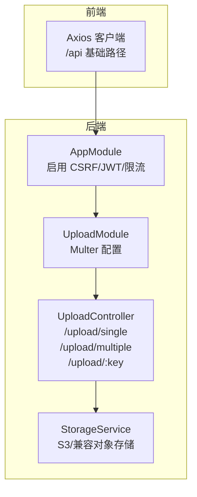
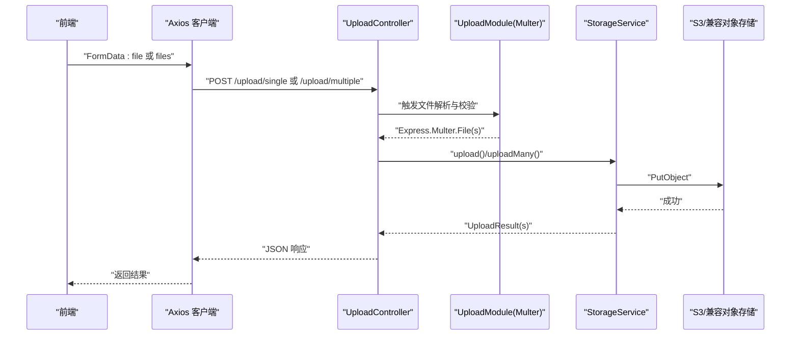
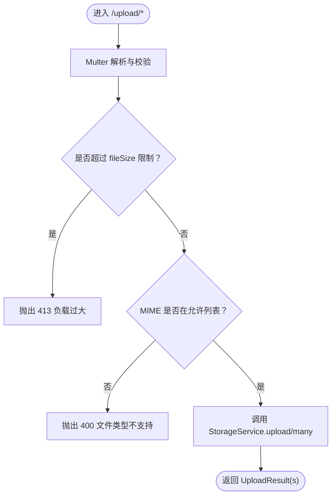
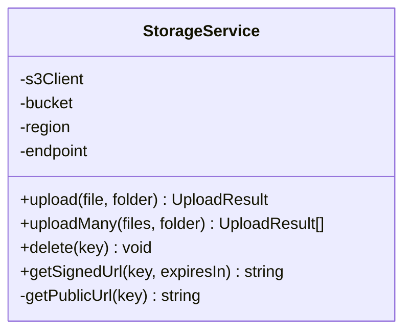
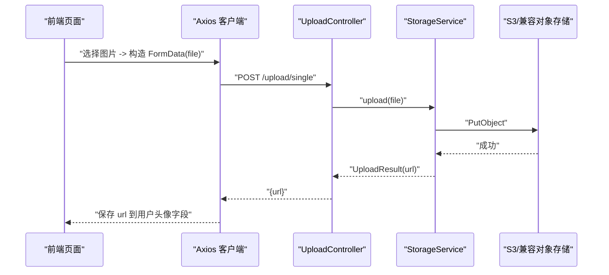
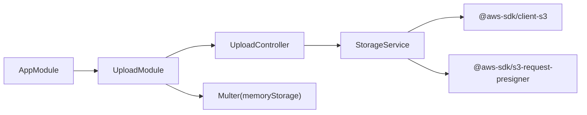

# 文件上传 API

<cite>
**本文引用的文件**
- [apps/backend/src/upload/upload.controller.ts](file://apps/backend/src/upload/upload.controller.ts)
- [apps/backend/src/upload/storage.service.ts](file://apps/backend/src/upload/storage.service.ts)
- [apps/backend/src/upload/upload.module.ts](file://apps/backend/src/upload/upload.module.ts)
- [.env.example](file://.env.example)
- [apps/backend/src/app.module.ts](file://apps/backend/src/app.module.ts)
- [apps/frontend/src/api/index.ts](file://apps/frontend/src/api/index.ts)
- [packages/shared/src/schemas/auth.schema.ts](file://packages/shared/src/schemas/auth.schema.ts)
- [apps/backend/src/upload/index.ts](file://apps/backend/src/upload/index.ts)
</cite>

## 目录
1. [简介](#简介)
2. [项目结构](#项目结构)
3. [核心组件](#核心组件)
4. [架构总览](#架构总览)
5. [详细组件分析](#详细组件分析)
6. [依赖关系分析](#依赖关系分析)
7. [性能与容量规划](#性能与容量规划)
8. [故障排除指南](#故障排除指南)
9. [结论](#结论)
10. [附录](#附录)

## 简介
本文件面向后端与前端开发者，系统性说明文件上传 API 的设计与实现，包括：
- 后端端点与请求格式：POST /upload/single 与 POST /upload/multiple 使用 multipart/form-data，字段分别为 file 与 files。
- 上传校验：文件大小限制、MIME 类型过滤、空文件校验。
- 返回结构：UploadResult，包含 key、url、bucket、size、mimetype。
- 存储适配：StorageService 支持 AWS S3 与兼容 S3 的对象存储（如 OSS、MinIO），并生成公开访问 URL 或预签名 URL。
- 前端集成：基于 Axios 的 FormData 示例，以及在用户头像上传场景中的集成方式。
- 错误码与安全：常见错误（如 413、400）、CSRF 与 JWT 保护、速率限制、以及防恶意文件上传建议。

## 项目结构
文件上传能力由后端 NestJS 模块提供，前端通过 Axios 发起请求。核心文件如下：
- 控制器：apps/backend/src/upload/upload.controller.ts
- 存储服务：apps/backend/src/upload/storage.service.ts
- 上传模块：apps/backend/src/upload/upload.module.ts
- 环境变量：.env.example（含 S3 与上传限制配置）
- 应用根模块：apps/backend/src/app.module.ts（启用 CSRF、JWT、限流）
- 前端 HTTP 客户端：apps/frontend/src/api/index.ts
- 用户头像字段定义：packages/shared/src/schemas/auth.schema.ts



图表来源
- [apps/backend/src/app.module.ts](file://apps/backend/src/app.module.ts#L1-L159)
- [apps/backend/src/upload/upload.module.ts](file://apps/backend/src/upload/upload.module.ts#L1-L49)
- [apps/backend/src/upload/upload.controller.ts](file://apps/backend/src/upload/upload.controller.ts#L1-L84)
- [apps/backend/src/upload/storage.service.ts](file://apps/backend/src/upload/storage.service.ts#L1-L124)
- [apps/frontend/src/api/index.ts](file://apps/frontend/src/api/index.ts#L1-L92)

章节来源
- [apps/backend/src/app.module.ts](file://apps/backend/src/app.module.ts#L1-L159)
- [apps/backend/src/upload/upload.module.ts](file://apps/backend/src/upload/upload.module.ts#L1-L49)
- [apps/backend/src/upload/upload.controller.ts](file://apps/backend/src/upload/upload.controller.ts#L1-L84)
- [apps/backend/src/upload/storage.service.ts](file://apps/backend/src/upload/storage.service.ts#L1-L124)
- [apps/frontend/src/api/index.ts](file://apps/frontend/src/api/index.ts#L1-L92)

## 核心组件
- UploadController
  - 提供 /upload/single（单文件）与 /upload/multiple（多文件，最多 10 个）两个端点。
  - 使用 JWT 守卫与 CSRF 中间件保护。
  - 对空文件进行显式校验，抛出 400。
- UploadModule
  - 使用 Multer 内存存储，随后上传至 S3。
  - 限制：单文件大小、文件数量。
  - MIME 类型过滤：仅允许图片与部分文档类型。
- StorageService
  - 初始化 S3 客户端，支持自定义 endpoint（兼容 OSS/MinIO）。
  - 上传返回 UploadResult；删除文件；生成公开 URL 或预签名 URL。
- 前端 HTTP 客户端
  - Axios 实例，自动注入 Authorization 与 CSRF Token。
  - 基于 /api 前缀访问后端。

章节来源
- [apps/backend/src/upload/upload.controller.ts](file://apps/backend/src/upload/upload.controller.ts#L1-L84)
- [apps/backend/src/upload/upload.module.ts](file://apps/backend/src/upload/upload.module.ts#L1-L49)
- [apps/backend/src/upload/storage.service.ts](file://apps/backend/src/upload/storage.service.ts#L1-L124)
- [apps/frontend/src/api/index.ts](file://apps/frontend/src/api/index.ts#L1-L92)

## 架构总览
下图展示从前端发起上传请求到后端存储服务的完整流程。



图表来源
- [apps/backend/src/upload/upload.controller.ts](file://apps/backend/src/upload/upload.controller.ts#L1-L84)
- [apps/backend/src/upload/upload.module.ts](file://apps/backend/src/upload/upload.module.ts#L1-L49)
- [apps/backend/src/upload/storage.service.ts](file://apps/backend/src/upload/storage.service.ts#L1-L124)

## 详细组件分析

### UploadController 组件
- 端点
  - POST /upload/single：接收字段 file（multipart/form-data）。
  - POST /upload/multiple：接收字段 files（数组，最多 10 个）。
  - DELETE /upload/:key：删除已上传对象。
- 安全与鉴权
  - 使用 JwtAuthGuard 与 ApiBearerAuth。
  - 应用层启用 CSRF 中间件。
- 校验逻辑
  - 空文件检测：若未选择文件则抛出 400。
  - 多文件：若数组为空则抛出 400。
- 返回结构
  - 单文件：UploadResult。
  - 多文件：UploadResult[]。

```mermaid
classDiagram
class UploadController {
+uploadSingle(file) UploadResult
+uploadMultiple(files) UploadResult[]
+delete(key) {success : boolean}
}
class StorageService {
+upload(file, folder) UploadResult
+uploadMany(files, folder) UploadResult[]
+delete(key) void
+getSignedUrl(key, expiresIn) string
}
UploadController --> StorageService : "调用"
```

图表来源
- [apps/backend/src/upload/upload.controller.ts](file://apps/backend/src/upload/upload.controller.ts#L1-L84)
- [apps/backend/src/upload/storage.service.ts](file://apps/backend/src/upload/storage.service.ts#L1-L124)

章节来源
- [apps/backend/src/upload/upload.controller.ts](file://apps/backend/src/upload/upload.controller.ts#L1-L84)

### UploadModule 与 Multer 配置
- 存储策略
  - memoryStorage：先将文件读入内存，再上传到 S3，避免磁盘 IO。
- 限制
  - fileSize：默认来自环境变量 UPLOAD_MAX_SIZE（字节）。
  - files：默认来自环境变量 UPLOAD_MAX_FILES（个数）。
- MIME 类型过滤
  - 仅允许 image/* 与若干文档类型（如 PDF、Word、Excel 等）。
  - 不支持的类型会触发 400。
- 异常传播
  - 文件大小超限与类型不支持会抛出异常，最终由全局异常过滤器统一处理。



图表来源
- [apps/backend/src/upload/upload.module.ts](file://apps/backend/src/upload/upload.module.ts#L1-L49)

章节来源
- [apps/backend/src/upload/upload.module.ts](file://apps/backend/src/upload/upload.module.ts#L1-L49)

### StorageService 组件
- 初始化
  - 从 ConfigService 读取 S3_BUCKET、S3_REGION、S3_ENDPOINT、S3_ACCESS_KEY_ID、S3_SECRET_ACCESS_KEY。
  - 若存在 endpoint，则以兼容 S3 的方式连接（forcePathStyle=true）。
- 上传
  - 生成随机 key（带扩展名），设置 Content-Type 为原文件 MIME。
  - 返回 UploadResult：包含 key、url、bucket、size、mimetype。
- URL 生成
  - 公开 URL：endpoint 存在时使用 endpoint/bucket/key；否则使用标准 S3 域名。
  - 预签名 URL：可按需生成临时访问链接。
- 删除
  - 通过 DeleteObject 清理对象。



图表来源
- [apps/backend/src/upload/storage.service.ts](file://apps/backend/src/upload/storage.service.ts#L1-L124)

章节来源
- [apps/backend/src/upload/storage.service.ts](file://apps/backend/src/upload/storage.service.ts#L1-L124)

### 前端集成与示例
- Axios 客户端
  - 自动注入 Authorization 与 CSRF Token。
  - 基础路径为 /api。
- 单文件上传（FormData）
  - 构造 FormData，字段名为 file。
  - 使用 POST /upload/single。
- 多文件上传（FormData）
  - 构造 FormData，字段名为 files（数组）。
  - 使用 POST /upload/multiple。
- 用户头像上传场景
  - 在更新用户资料接口中，将 avatar 字段设为上传返回的 url。
  - 用户头像字段定义见共享 Schema。



图表来源
- [apps/frontend/src/api/index.ts](file://apps/frontend/src/api/index.ts#L1-L92)
- [apps/backend/src/upload/upload.controller.ts](file://apps/backend/src/upload/upload.controller.ts#L1-L84)
- [apps/backend/src/upload/storage.service.ts](file://apps/backend/src/upload/storage.service.ts#L1-L124)
- [packages/shared/src/schemas/auth.schema.ts](file://packages/shared/src/schemas/auth.schema.ts#L1-L55)

章节来源
- [apps/frontend/src/api/index.ts](file://apps/frontend/src/api/index.ts#L1-L92)
- [packages/shared/src/schemas/auth.schema.ts](file://packages/shared/src/schemas/auth.schema.ts#L1-L55)

## 依赖关系分析
- 模块依赖
  - AppModule 导入 UploadModule，并启用 CSRF 中间件与 JWT 守卫。
  - UploadController 依赖 StorageService。
  - UploadModule 依赖 Multer 与 ConfigService。
- 外部依赖
  - @aws-sdk/client-s3：S3 客户端。
  - @aws-sdk/s3-request-presigner：生成预签名 URL。
  - @nestjs/platform-express：文件拦截器与 Multer 集成。
  - multer：内存存储与文件限制、过滤。



图表来源
- [apps/backend/src/app.module.ts](file://apps/backend/src/app.module.ts#L1-L159)
- [apps/backend/src/upload/upload.module.ts](file://apps/backend/src/upload/upload.module.ts#L1-L49)
- [apps/backend/src/upload/upload.controller.ts](file://apps/backend/src/upload/upload.controller.ts#L1-L84)
- [apps/backend/src/upload/storage.service.ts](file://apps/backend/src/upload/storage.service.ts#L1-L124)

章节来源
- [apps/backend/src/app.module.ts](file://apps/backend/src/app.module.ts#L1-L159)
- [apps/backend/src/upload/upload.module.ts](file://apps/backend/src/upload/upload.module.ts#L1-L49)

## 性能与容量规划
- 内存占用
  - 使用 memoryStorage，文件全部驻留内存，适合中小文件与高并发场景。
  - 建议合理设置 UPLOAD_MAX_SIZE，避免 OOM。
- 并发上传
  - uploadMany 采用 Promise.all 并行上传，提升吞吐。
- 存储成本
  - 选择就近区域 S3_REGION，降低网络与费用。
  - OSS/MinIO 可通过 endpoint 降低跨域与代理成本。
- CDN 加速
  - 公开 URL 可配合 CDN 提升访问速度与稳定性。

[本节为通用建议，无需列出具体文件来源]

## 故障排除指南
- 413 Payload Too Large
  - 触发条件：文件大小超过 UPLOAD_MAX_SIZE。
  - 排查：确认前端是否正确设置 FormData，后端环境变量是否生效。
- 400 Bad Request（文件类型不支持）
  - 触发条件：MIME 不在允许列表。
  - 排查：确认文件类型是否在允许列表中，必要时扩展白名单。
- 400 Bad Request（未选择文件）
  - 触发条件：单文件端点未传 file，或多文件端点未传 files。
  - 排查：确保前端字段名与后端一致。
- 401 Unauthorized
  - 触发条件：缺少或无效的 Bearer Token。
  - 排查：确认前端已正确设置 Authorization。
- 403 CSRF 验证失败
  - 触发条件：非 GET 请求缺少 XSRF-TOKEN。
  - 排查：确认前端已从 Cookie 读取并注入 X-XSRF-TOKEN。
- 500 服务器错误
  - 触发条件：S3 连接失败、凭证错误、网络异常。
  - 排查：核对 S3_ENDPOINT、S3_BUCKET、S3_REGION、密钥配置。

章节来源
- [apps/backend/src/upload/upload.module.ts](file://apps/backend/src/upload/upload.module.ts#L1-L49)
- [apps/backend/src/upload/upload.controller.ts](file://apps/backend/src/upload/upload.controller.ts#L1-L84)
- [apps/frontend/src/api/index.ts](file://apps/frontend/src/api/index.ts#L1-L92)
- [.env.example](file://.env.example#L1-L52)

## 结论
该上传方案以 NestJS + Multer + AWS SDK 为核心，具备清晰的安全边界（JWT + CSRF + 限流）与良好的扩展性（S3/兼容对象存储）。通过明确的文件大小与类型限制、标准化的响应结构与 URL 生成策略，能够满足大多数业务场景下的文件上传需求。建议结合 CDN 与合理的容量规划进一步优化性能与成本。

[本节为总结性内容，无需列出具体文件来源]

## 附录

### 端点与请求格式
- POST /upload/single
  - Content-Type: multipart/form-data
  - 字段: file（二进制）
- POST /upload/multiple
  - Content-Type: multipart/form-data
  - 字段: files[]（二进制数组，最多 10 个）
- DELETE /upload/:key
  - 路径参数: key（对象键）

章节来源
- [apps/backend/src/upload/upload.controller.ts](file://apps/backend/src/upload/upload.controller.ts#L1-L84)

### 返回结构 UploadResult
- key：对象键
- url：公开访问 URL 或预签名 URL
- bucket：桶名
- size：字节数
- mimetype：MIME 类型

章节来源
- [apps/backend/src/upload/storage.service.ts](file://apps/backend/src/upload/storage.service.ts#L1-L124)

### 环境变量与配置
- S3 相关
  - S3_BUCKET、S3_REGION、S3_ENDPOINT、S3_ACCESS_KEY_ID、S3_SECRET_ACCESS_KEY
- 上传限制
  - UPLOAD_MAX_SIZE（字节）、UPLOAD_MAX_FILES（个数）

章节来源
- [.env.example](file://.env.example#L1-L52)
- [apps/backend/src/upload/upload.module.ts](file://apps/backend/src/upload/upload.module.ts#L1-L49)

### 前端集成要点
- Axios 已注入 Authorization 与 CSRF Token。
- 基础路径为 /api。
- 用户头像字段可直接使用上传返回的 url。

章节来源
- [apps/frontend/src/api/index.ts](file://apps/frontend/src/api/index.ts#L1-L92)
- [packages/shared/src/schemas/auth.schema.ts](file://packages/shared/src/schemas/auth.schema.ts#L1-L55)

### 安全建议
- 仅允许必要的 MIME 类型，避免执行类文件。
- 对上传目录进行隔离（如 uploads/uuid/），避免路径穿越。
- 使用预签名 URL 时控制过期时间，避免长期有效链接泄露。
- 对敏感资源采用私有访问并通过后端代理下载。

[本节为通用建议，无需列出具体文件来源]