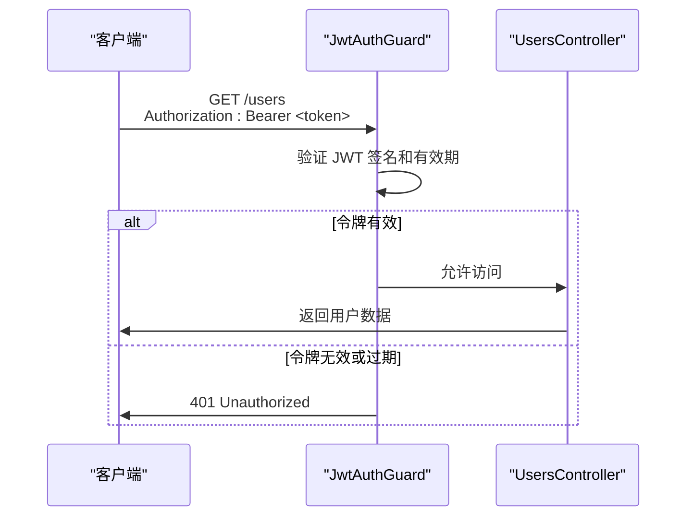
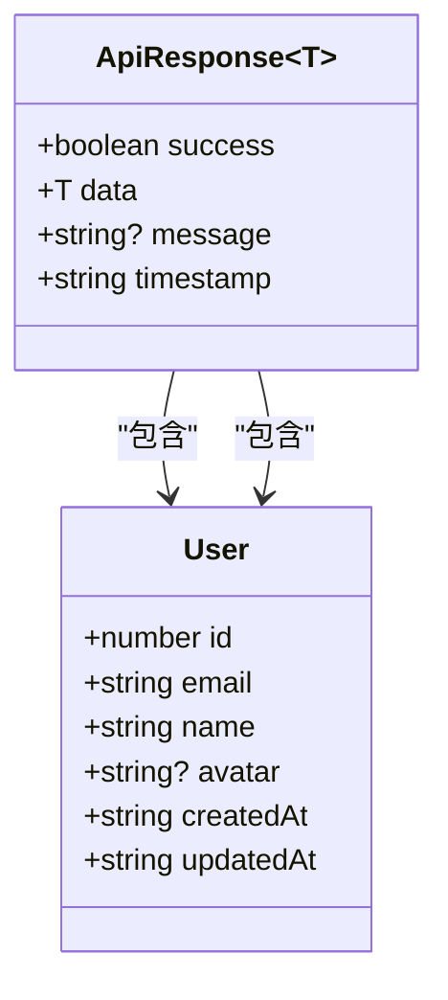
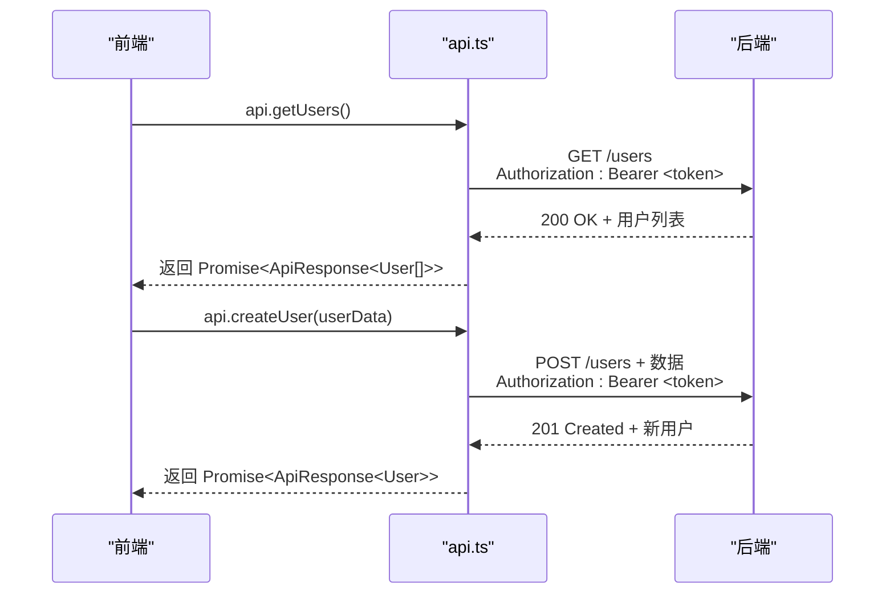
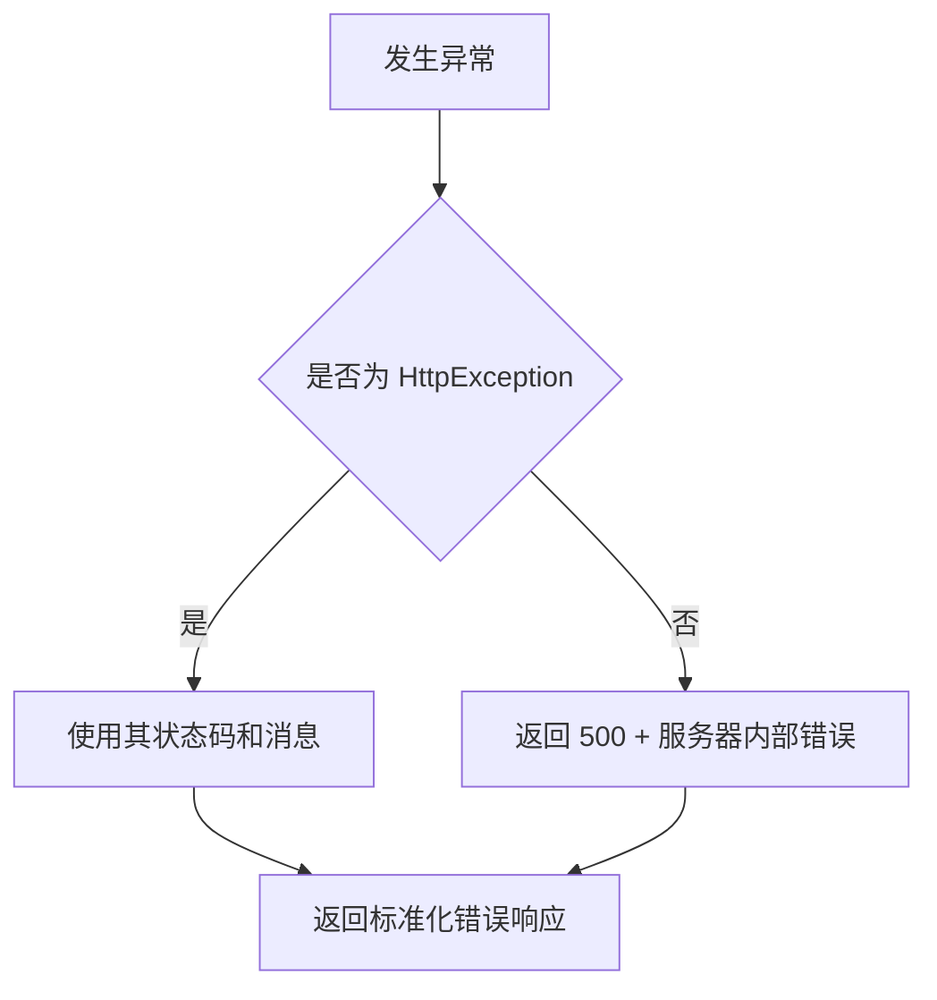

# 用户管理 API

<cite>
**本文档引用文件**  
- [users.controller.ts](file://apps/backend/src/users/users.controller.ts)
- [users.service.ts](file://apps/backend/src/users/users.service.ts)
- [schema.prisma](file://apps/backend/prisma/schema.prisma)
- [jwt-auth.guard.ts](file://apps/backend/src/auth/jwt-auth.guard.ts)
- [auth.service.ts](file://apps/backend/src/auth/auth.service.ts)
- [common.dto.ts](file://packages/shared/src/dto/common.dto.ts)
- [user.utils.ts](file://packages/shared/src/utils/user.utils.ts)
- [api.ts](file://apps/frontend/src/api/index.ts)
- [users.ts](file://apps/frontend/src/stores/users.ts)
</cite>

## 目录

1. [简介](#简介)
2. [API 端点概览](#api-端点概览)
3. [认证与权限控制](#认证与权限控制)
4. [请求与响应结构](#请求与响应结构)
5. [Prisma 模型与字段映射](#prisma-模型与字段映射)
6. [前端调用示例](#前端调用示例)
7. [错误处理策略](#错误处理策略)

## 简介

本 API 提供完整的用户管理功能，包括获取用户列表、获取单个用户、创建用户、更新用户和删除用户。所有端点均受 JWT 认证保护，确保只有经过身份验证的用户才能访问。部分操作（如创建和删除）进一步限制为管理员角色。

**Section sources**  
- [users.controller.ts](file://apps/backend/src/users/users.controller.ts#L1-L43)

## API 端点概览

| 方法 | 路径 | 描述 |
|------|------|------|
| `GET` | `/users` | 获取所有用户（支持分页） |
| `GET` | `/users/:id` | 根据 ID 获取单个用户 |
| `POST` | `/users` | 创建新用户（注册） |
| `PATCH` | `/users/:id` | 更新用户信息 |
| `DELETE` | `/users/:id` | 删除用户 |

> **注意**：当前实现中 `PATCH` 和 `DELETE` 方法尚未在控制器中定义，需后续扩展。

```mermaid
flowchart TD
A[客户端请求] --> B{请求方法}
B --> |GET /users| C[返回用户列表]
B --> |GET /users/:id| D[返回单个用户]
B --> |POST /users| E[创建新用户]
B --> |PATCH /users/:id| F[更新用户信息]
B --> |DELETE /users/:id| G[删除用户]
C --> H[返回 ApiResponse<User[]>]
D --> H
E --> H
F --> H
G --> H
```

**Diagram sources**  
- [users.controller.ts](file://apps/backend/src/users/users.controller.ts#L16-L42)

**Section sources**  
- [users.controller.ts](file://apps/backend/src/users/users.controller.ts#L16-L42)

## 认证与权限控制

所有用户管理端点均使用 `JwtAuthGuard` 进行保护，要求请求头中包含有效的 Bearer Token。



- **创建/删除权限**：当前逻辑未在控制器中显式检查角色，但可通过扩展 `@CurrentUser()` 装饰器实现管理员权限校验。
- **CSRF 保护**：非 GET 请求自动附加 CSRF Token（通过 Cookie 获取）。

**Diagram sources**  
- [jwt-auth.guard.ts](file://apps/backend/src/auth/jwt-auth.guard.ts#L1-L10)
- [auth.controller.ts](file://apps/backend/src/auth/auth.controller.ts#L42-L49)

**Section sources**  
- [jwt-auth.guard.ts](file://apps/backend/src/auth/jwt-auth.guard.ts#L1-L10)
- [auth.controller.ts](file://apps/backend/src/auth/auth.controller.ts#L42-L49)

## 请求与响应结构

### 请求参数

| 端点 | 参数类型 | 参数名 | 类型 | 必需 | 说明 |
|------|--------|--------|------|------|------|
| `GET /users` | 查询参数 | `page` | number | 否 | 页码（默认 1） |
| | | `pageSize` | number | 否 | 每页数量（默认 10） |
| `GET /users/:id` | 路径参数 | `id` | number | 是 | 用户 ID |
| `POST /users` | 请求体 | `email` | string | 是 | 用户邮箱 |
| | | `name` | string | 是 | 用户姓名 |
| | | `password` | string | 是 | 用户密码 |

### 响应格式

响应统一包装在 `ApiResponse<T>` 结构中：

```json
{
  "success": true,
  "data": {},
  "message": "操作成功",
  "timestamp": "2025-04-05T10:00:00.000Z"
}
```

- **用户列表响应**：`ApiResponse<User[]>`
- **单个用户响应**：`ApiResponse<User>`



**Diagram sources**  
- [common.dto.ts](file://packages/shared/src/dto/common.dto.ts#L4-L13)
- [user.utils.ts](file://packages/shared/src/utils/user.utils.ts#L19-L27)

**Section sources**  
- [common.dto.ts](file://packages/shared/src/dto/common.dto.ts#L4-L13)
- [user.utils.ts](file://packages/shared/src/utils/user.utils.ts#L19-L27)

## Prisma 模型与字段映射

Prisma 数据模型定义了用户在数据库中的结构，服务层通过 `formatUser` 工具函数将其转换为 API 响应格式。

```prisma
model User {
  id        Int      @id @default(autoincrement())
  email     String   @unique
  name      String
  password  String
  avatar    String?
  createdAt DateTime @default(now())
  updatedAt DateTime @updatedAt
}
```

| 数据库字段 | API 字段 | 类型 | 转换说明 |
|----------|---------|------|----------|
| `id` | `id` | number | 直接映射 |
| `email` | `email` | string | 直接映射 |
| `name` | `name` | string | 直接映射 |
| `avatar` | `avatar` | string? | 可为空 |
| `createdAt` | `createdAt` | string | `Date` → `toISOString()` |
| `updatedAt` | `updatedAt` | string | `Date` → `toISOString()` |

```mermaid
erDiagram
USER {
Int id PK
String email UK
String name
String password
String? avatar
DateTime createdAt
DateTime updatedAt
}
```

**Diagram sources**  
- [schema.prisma](file://apps/backend/prisma/schema.prisma#L9-L19)
- [user.utils.ts](file://packages/shared/src/utils/user.utils.ts#L19-L27)

**Section sources**  
- [schema.prisma](file://apps/backend/prisma/schema.prisma#L9-L19)
- [user.utils.ts](file://packages/shared/src/utils/user.utils.ts#L19-L27)

## 前端调用示例

前端通过 `api` 对象封装的 HTTP 客户端进行调用，自动处理认证头和错误响应。

### 获取用户列表

```typescript
import { api } from '@/api'

try {
  const response = await api.getUsers()
  console.log(response.data) // User[]
} catch (error) {
  console.error('获取用户失败:', error.message)
}
```

### 创建用户

```typescript
import { api } from '@/api'

try {
  const userData = {
    email: 'user@example.com',
    name: '张三',
    password: 'secure123'
  }
  const response = await api.createUser(userData)
  console.log('用户创建成功:', response.data)
} catch (error) {
  if (error.response?.status === 409) {
    alert('邮箱已被注册')
  }
}
```



**Diagram sources**  
- [api.ts](file://apps/frontend/src/api/index.ts#L65-L88)
- [users.ts](file://apps/frontend/src/stores/users.ts#L20-L32)

**Section sources**  
- [api.ts](file://apps/frontend/src/api/index.ts#L65-L88)
- [users.ts](file://apps/frontend/src/stores/users.ts#L20-L32)

## 错误处理策略

系统采用全局异常过滤器，统一返回标准化错误响应。

```json
{
  "success": false,
  "data": null,
  "message": "用户 ID 999 不存在",
  "statusCode": 404,
  "timestamp": "2025-04-05T10:00:00.000Z"
}
```

| HTTP 状态码 | 错误类型 | 触发条件 |
|------------|---------|---------|
| `401` | 未授权 | Token 缺失或无效 |
| `404` | 未找到 | 用户 ID 不存在 |
| `409` | 冲突 | 邮箱已被注册 |
| `500` | 服务器错误 | 未捕获异常 |

错误响应由 `AllExceptionsFilter` 统一处理，确保客户端始终收到一致格式。



**Diagram sources**  
- [all-exceptions.filter.ts](file://apps/backend/src/common/filters/all-exceptions.filter.ts#L1-L31)
- [users.service.ts](file://apps/backend/src/users/users.service.ts#L34-L36)

**Section sources**  
- [all-exceptions.filter.ts](file://apps/backend/src/common/filters/all-exceptions.filter.ts#L1-L31)
- [users.service.ts](file://apps/backend/src/users/users.service.ts#L34-L36)