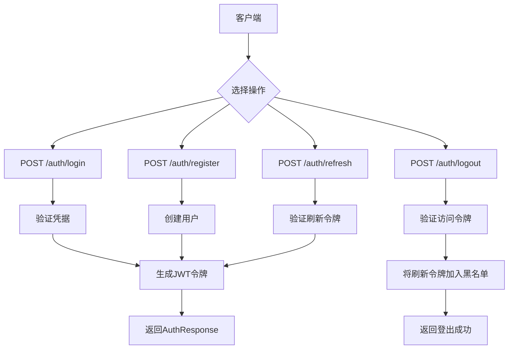
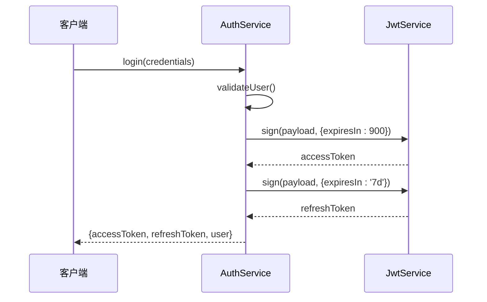
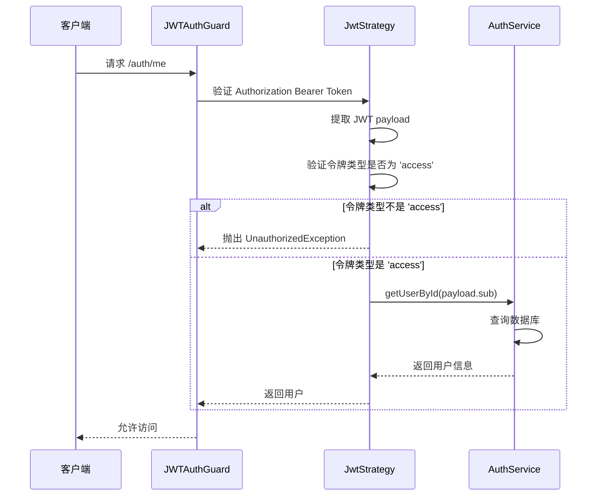
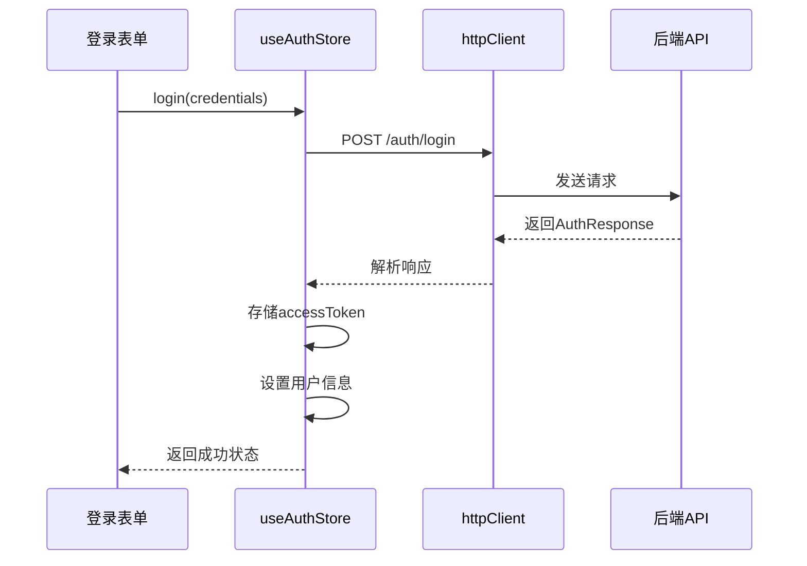
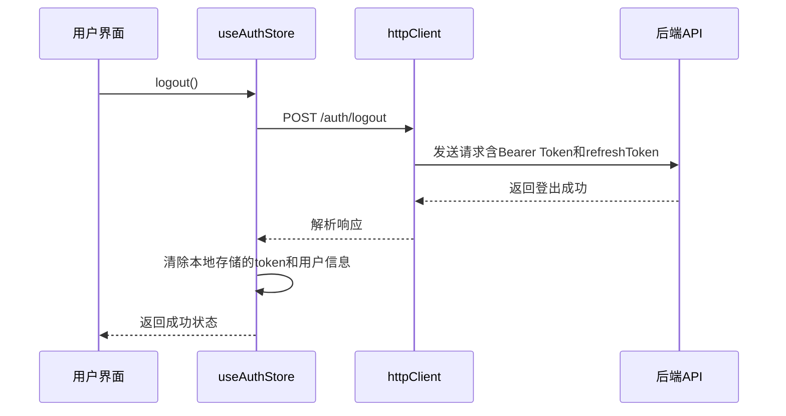
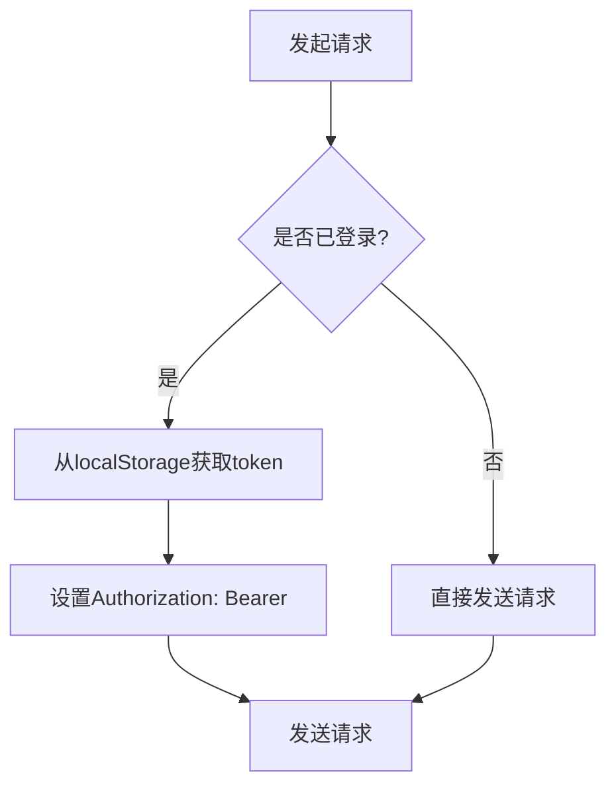

# 认证 API

<cite>
**本文档引用的文件**  
- [auth.controller.ts](file://apps/backend/src/auth/auth.controller.ts)
- [auth.dto.ts](file://apps/backend/src/auth/auth.dto.ts)
- [auth.service.ts](file://apps/backend/src/auth/auth.service.ts)
- [jwt-auth.guard.ts](file://apps/backend/src/auth/jwt-auth.guard.ts)
- [jwt.strategy.ts](file://apps/backend/src/auth/jwt.strategy.ts)
- [auth.schema.ts](file://packages/shared/src/schemas/auth.schema.ts)
- [common.dto.ts](file://packages/shared/src/dto/common.dto.ts)
- [current-user.decorator.ts](file://apps/backend/src/auth/current-user.decorator.ts)
- [index.ts](file://apps/frontend/src/api/index.ts)
- [auth.ts](file://apps/frontend/src/stores/auth.ts)
- [main.ts](file://apps/backend/src/main.ts)
- [auth.module.ts](file://apps/backend/src/auth/auth.module.ts)
</cite>

## 更新摘要
**已更新内容**
- 在“认证端点”部分新增了“登出”端点（POST /auth/logout）的详细说明，包括其受 Bearer 令牌保护和接收刷新令牌的请求体
- 在“JWT 令牌机制”部分更新了访问令牌和刷新令牌的过期时间说明，反映从配置文件中读取的 `JWT_ACCESS_EXPIRES_IN` 和 `JWT_REFRESH_EXPIRES_IN` 配置
- 在“前端调用流程”部分更新了登出流程的序列图和说明，确保与后端行为一致
- 在“常见问题”部分新增了关于登出后刷新令牌失效的说明

## 目录
1. [简介](#简介)
2. [认证端点](#认证端点)
3. [JWT 令牌机制](#jwt-令牌机制)
4. [认证守卫与受保护路由](#认证守卫与受保护路由)
5. [前端调用流程](#前端调用流程)
6. [错误响应](#错误响应)
7. [Swagger UI 测试指南](#swagger-ui-测试指南)
8. [常见问题](#常见问题)

## 简介
本 API 文档详细说明了基于 NestJS 的认证系统，涵盖登录、注册、令牌刷新和登出功能。所有端点均使用 `@ApiTags('认证')` 进行分组，并通过 Zod Schema 实现请求验证，响应统一遵循 `AuthResponseSchema` 格式。系统采用 JWT Bearer Token 进行身份验证，支持访问令牌与刷新令牌双机制，确保安全性与用户体验的平衡。

**Section sources**
- [auth.controller.ts](file://apps/backend/src/auth/auth.controller.ts#L1-L51)
- [main.ts](file://apps/backend/src/main.ts#L74-L83)

## 认证端点
### 登录 (POST /auth/login)
用户通过邮箱和密码进行身份验证。

- **请求体**: `LoginSchema`
- **响应**: `AuthResponseSchema`
- **速率限制**: 每分钟最多 5 次尝试

### 注册 (POST /auth/register)
创建新用户账户。

- **请求体**: `RegisterSchema`
- **响应**: `AuthResponseSchema`

### 刷新令牌 (POST /auth/refresh)
使用刷新令牌获取新的访问令牌。

- **请求体**: `RefreshTokenSchema`
- **响应**: `AuthResponseSchema`（包含新的访问令牌和刷新令牌）
- **速率限制**: 每分钟最多 10 次尝试

### 登出 (POST /auth/logout)
使当前用户的刷新令牌失效，实现安全登出。

- **认证**: 需要 Bearer 访问令牌（通过 `JWTAuthGuard` 保护）
- **请求体**: `LogoutDto`（包含需失效的刷新令牌）
- **响应**: 成功消息
- **实现**: 服务端将提供的刷新令牌加入 Redis 黑名单，使其在剩余有效期内无法使用



**Diagram sources**
- [auth.controller.ts](file://apps/backend/src/auth/auth.controller.ts#L18-L37)
- [auth.dto.ts](file://apps/backend/src/auth/auth.dto.ts#L8-L18)
- [auth.schema.ts](file://packages/shared/src/schemas/auth.schema.ts#L24-L85)
- [auth.controller.ts](file://apps/backend/src/auth/auth.controller.ts#L96-L105)

**Section sources**
- [auth.controller.ts](file://apps/backend/src/auth/auth.controller.ts#L18-L37)
- [auth.dto.ts](file://apps/backend/src/auth/auth.dto.ts#L8-L18)
- [auth.schema.ts](file://packages/shared/src/schemas/auth.schema.ts#L24-L85)
- [auth.controller.ts](file://apps/backend/src/auth/auth.controller.ts#L96-L105)
- [auth.service.ts](file://apps/backend/src/auth/auth.service.ts#L275-L297)

## JWT 令牌机制
系统采用双令牌机制以增强安全性：

| 令牌类型 | 过期时间 | 用途 | 存储位置 |
|--------|--------|------|--------|
| 访问令牌 (Access Token) | 由 `JWT_ACCESS_EXPIRES_IN` 配置，默认 900 秒（15 分钟） | 请求受保护资源 | `localStorage` |
| 刷新令牌 (Refresh Token) | 由 `JWT_REFRESH_EXPIRES_IN` 配置，默认 '7d'（7 天） | 获取新的访问令牌 | 响应体中一次性返回 |

### 令牌类型检查
系统在 `JwtStrategy` 中实现了严格的令牌类型检查机制。当验证 JWT payload 时，会检查 `type` 字段的值：

```typescript
async validate(payload: JwtPayload) {
  // 验证是否为访问令牌
  if (payload.type !== 'access') {
    throw new UnauthorizedException('无效的令牌类型')
  }
  // ...
}
```

只有 `type` 字段值为 `'access'` 的令牌才会被接受。任何其他类型的令牌（包括 `refresh` 类型）都将导致 `UnauthorizedException` 异常被抛出，返回 401 未授权错误。

### 令牌生成流程


**Diagram sources**
- [auth.service.ts](file://apps/backend/src/auth/auth.service.ts#L66-L75)
- [jwt.strategy.ts](file://apps/backend/src/auth/jwt.strategy.ts#L27-L31)
- [jwt.strategy.ts](file://apps/backend/src/auth/jwt.strategy.ts#L38-L41)

**Section sources**
- [auth.service.ts](file://apps/backend/src/auth/auth.service.ts#L22-L33)
- [auth.service.ts](file://apps/backend/src/auth/auth.service.ts#L111-L126)
- [jwt.strategy.ts](file://apps/backend/src/auth/jwt.strategy.ts#L38-L41)
- [.env.example](file://.env.example#L24-L25)
- [.env.docker.example](file://.env.docker.example#L35-L36)

## 认证守卫与受保护路由
`JWTAuthGuard` 用于保护需要身份验证的路由。

### 守卫工作流程


**Diagram sources**
- [jwt-auth.guard.ts](file://apps/backend/src/auth/jwt-auth.guard.ts#L8-L9)
- [jwt.strategy.ts](file://apps/backend/src/auth/jwt.strategy.ts#L37-L45)
- [current-user.decorator.ts](file://apps/backend/src/auth/current-user.decorator.ts#L8-L17)

**Section sources**
- [jwt-auth.guard.ts](file://apps/backend/src/auth/jwt-auth.guard.ts#L8-L9)
- [jwt.strategy.ts](file://apps/backend/src/auth/jwt.strategy.ts#L37-L45)
- [current-user.decorator.ts](file://apps/backend/src/auth/current-user.decorator.ts#L8-L17)

## 前端调用流程
### 登录调用流程


### 登出调用流程


### 请求拦截器
前端通过请求拦截器自动添加认证头：



**Section sources**
- [auth.ts](file://apps/frontend/src/stores/auth.ts#L25-L38)
- [index.ts](file://apps/frontend/src/api/index.ts#L24-L30)
- [auth.schema.ts](file://packages/shared/src/schemas/auth.schema.ts#L73-L78)
- [auth.ts](file://apps/frontend/src/stores/auth.ts#L142-L154)
- [index.ts](file://apps/frontend/src/api/index.ts#L249-L254)

## 错误响应
所有错误响应遵循统一格式：

```json
{
  "success": false,
  "data": null,
  "message": "错误描述",
  "statusCode": 401,
  "timestamp": "2024-01-01T00:00:00.000Z"
}
```

### 常见错误码
| 状态码 | 错误类型 | 原因 | 解决方案 |
|-------|--------|------|--------|
| 400 | 参数错误 | 请求体不符合 Zod Schema | 检查请求参数格式 |
| 401 | 未授权 | 令牌无效、过期或凭据错误 | 重新登录或刷新令牌 |
| 429 | 请求过多 | 超出速率限制 | 等待一段时间后重试 |

**Section sources**
- [all-exceptions.filter.ts](file://apps/backend/src/common/filters/all-exceptions.filter.ts#L8-L30)
- [auth.service.ts](file://apps/backend/src/auth/auth.service.ts#L63-L64)
- [auth.service.ts](file://apps/backend/src/auth/auth.service.ts#L104-L105)

## Swagger UI 测试指南
1. 启动应用后访问 `http://localhost:3000/api/docs`
2. 在 "认证" 分组下找到相应端点
3. 点击 "Try it out" 按钮
4. 输入请求参数（登录：邮箱和密码；刷新：刷新令牌；登出：刷新令牌）
5. 点击 "Execute" 执行请求
6. 查看响应结果和 HTTP 状态码
7. 对于受保护的端点（如 `/auth/me`），先执行登录获取令牌，然后在页面顶部的 "Authorize" 按钮中输入 `Bearer <accessToken>` 进行认证

**Section sources**
- [main.ts](file://apps/backend/src/main.ts#L75-L83)
- [auth.controller.ts](file://apps/backend/src/auth/auth.controller.ts#L44-L46)

## 常见问题
### 密码错误或账户不存在
- **现象**: 登录返回 401 错误
- **原因**: 邮箱或密码不正确
- **解决方案**: 检查输入的凭据，确认邮箱已注册

### 令牌过期
- **现象**: 请求受保护路由返回 401 错误
- **原因**: 访问令牌已过期（15分钟）
- **解决方案**: 使用刷新令牌调用 `/auth/refresh` 获取新的访问令牌

### 刷新令牌失效
- **现象**: 刷新令牌请求返回 401 错误
- **原因**: 刷新令牌已过期（7天）或被撤销
- **解决方案**: 用户需要重新登录，因为每次刷新操作都会返回新的刷新令牌，旧的刷新令牌将失效

### 无效的令牌类型
- **现象**: 请求受保护路由返回 401 错误，消息为"无效的令牌类型"
- **原因**: 使用了刷新令牌（refresh token）而非访问令牌（access token）进行认证
- **解决方案**: 确保在 Authorization 头中使用登录或刷新接口返回的 `accessToken`，而不是 `refreshToken`

### 登出后刷新令牌仍有效
- **现象**: 登出后，使用旧的刷新令牌仍能成功刷新访问令牌
- **原因**: 登出操作会将刷新令牌加入 Redis 黑名单，但该机制依赖于 Redis 的 TTL 与令牌剩余有效期同步。如果在令牌过期前尝试刷新，系统会先检查黑名单。
- **解决方案**: 确保后端 Redis 服务正常运行，登出操作会立即使刷新令牌失效。如果问题持续存在，请检查 Redis 连接配置和黑名单逻辑。

**Section sources**
- [auth.service.ts](file://apps/backend/src/auth/auth.service.ts#L62-L64)
- [auth.service.ts](file://apps/backend/src/auth/auth.service.ts#L103-L105)
- [auth.service.ts](file://apps/backend/src/auth/auth.service.ts#L91-L93)
- [jwt.strategy.ts](file://apps/backend/src/auth/jwt.strategy.ts#L39-L41)
- [auth.service.ts](file://apps/backend/src/auth/auth.service.ts#L275-L297)