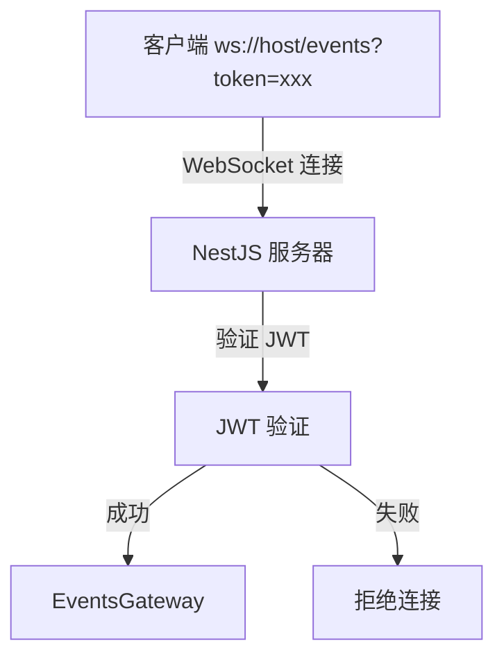
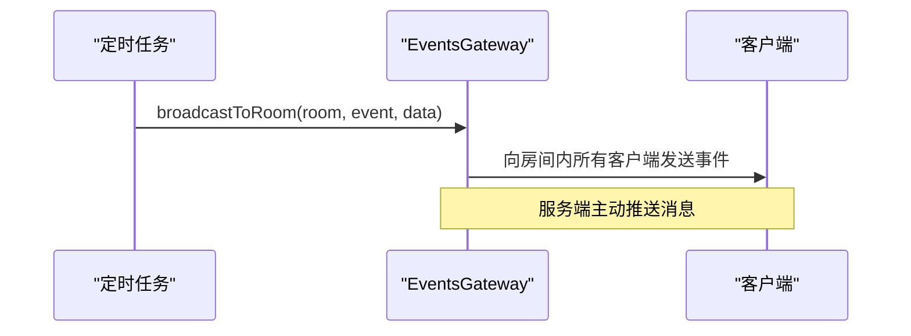
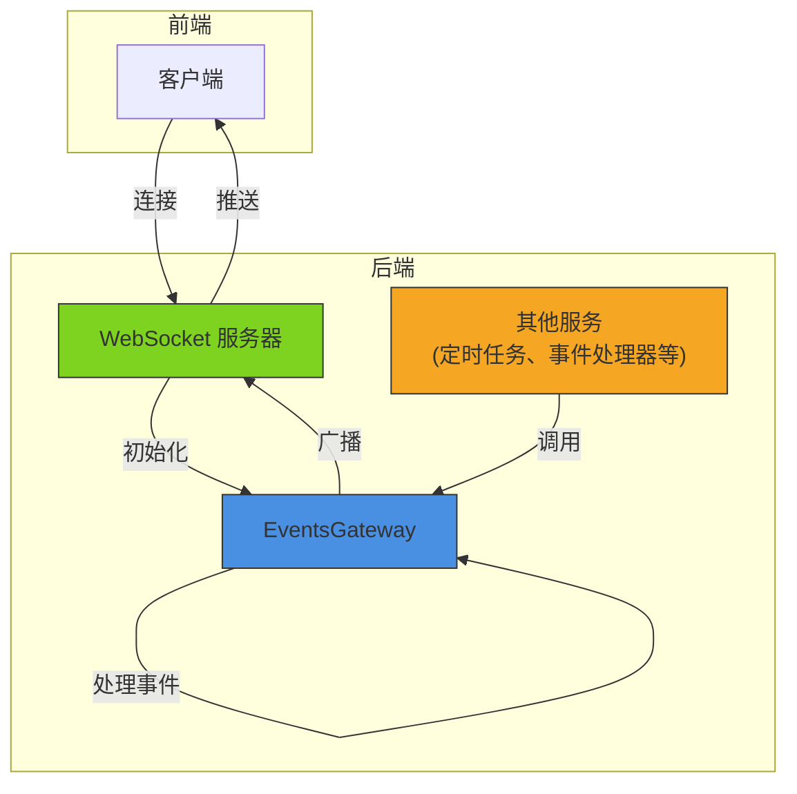

# WebSocket API

<cite>
**本文档引用的文件**  
- [events.gateway.ts](file://apps/backend/src/events/events.gateway.ts)
- [events.module.ts](file://apps/backend/src/events/events.module.ts)
- [main.ts](file://apps/backend/src/main.ts)
- [app.module.ts](file://apps/backend/src/app.module.ts)
- [api/index.ts](file://apps/frontend/src/api/index.ts)
</cite>

## 目录
1. [简介](#简介)
2. [连接建立](#连接建立)
3. [事件类型](#事件类型)
4. [EventsGateway 实现机制](#eventsgateway-实现机制)
5. [服务端消息推送](#服务端消息推送)
6. [前端连接示例](#前端连接示例)
7. [错误处理与重连机制](#错误处理与重连机制)
8. [安全考虑](#安全考虑)
9. [架构概览](#架构概览)

## 简介
本项目实现了基于 NestJS 的 WebSocket 服务，通过 `@nestjs/websockets` 模块提供实时通信能力。WebSocket 服务运行在 `/events` 命名空间下，支持 CORS 和 JWT 身份验证，可用于实现实时消息、房间广播、用户状态通知等功能。

## 连接建立
客户端通过 `ws://<host>/events` 地址建立 WebSocket 连接。连接支持 CORS 配置和 JWT 身份验证。

### 连接配置
- **连接地址**: `ws://<host>/events`
- **命名空间**: `/events`
- **CORS 支持**: 根据环境变量 `CORS_ORIGIN` 配置允许的来源，默认为 `http://localhost:5173`
- **身份验证**: 通过查询参数传递 JWT token，如 `ws://<host>/events?token=<jwt-token>`

### 服务端配置
WebSocket 网关通过 `@WebSocketGateway` 装饰器配置，启用了 CORS 支持并指定了命名空间。



**Diagram sources**
- [events.gateway.ts](file://apps/backend/src/events/events.gateway.ts#L18-L24)
- [main.ts](file://apps/backend/src/main.ts#L58-L63)

**Section sources**
- [events.gateway.ts](file://apps/backend/src/events/events.gateway.ts#L18-L24)
- [main.ts](file://apps/backend/src/main.ts#L58-L63)

## 事件类型
WebSocket 服务支持多种事件类型，包括消息收发、房间管理等。

### message 事件
用于客户端之间收发消息，支持全局广播和房间内广播。

#### 请求格式
```json
{
  "content": "消息内容",
  "room": "可选房间名称"
}
```

#### 响应格式
```json
{
  "senderId": "发送者ID",
  "content": "消息内容",
  "timestamp": "ISO 时间戳"
}
```

#### 广播逻辑
- **指定房间**: 消息发送到 `data.room` 指定的房间
- **全局广播**: 如果未指定房间，则广播给除发送者外的所有客户端

**Section sources**
- [events.gateway.ts](file://apps/backend/src/events/events.gateway.ts#L46-L70)

### join 事件
客户端通过此事件加入指定房间。

#### 请求格式
```json
{
  "room": "房间名称"
}
```

#### 服务端行为
1. 客户端加入指定房间
2. 向房间内其他成员广播 `user:joined` 事件
3. 返回加入结果

**Section sources**
- [events.gateway.ts](file://apps/backend/src/events/events.gateway.ts#L75-L87)

### leave 事件
客户端通过此事件离开指定房间。

#### 请求格式
```json
{
  "room": "房间名称"
}
```

#### 服务端行为
1. 客户端离开指定房间
2. 向房间内所有成员广播 `user:left` 事件
3. 返回离开结果

**Section sources**
- [events.gateway.ts](file://apps/backend/src/events/events.gateway.ts#L92-L104)

## EventsGateway 实现机制
`EventsGateway` 是 WebSocket 服务的核心实现，使用 NestJS 的 `@nestjs/websockets` 模块。

### 生命周期钩子
`EventsGateway` 实现了三个生命周期接口：

#### OnGatewayInit
网关初始化时调用，用于执行初始化逻辑。

```typescript
afterInit() {
  this.logger.log('WebSocket 网关已初始化')
}
```

#### OnGatewayConnection
客户端连接时调用，用于处理连接事件。

```typescript
handleConnection(client: Socket) {
  this.logger.log(`客户端连接: ${client.id}`)
}
```

#### OnGatewayDisconnect
客户端断开连接时调用，用于清理资源。

```typescript
handleDisconnect(client: Socket) {
  this.logger.log(`客户端断开: ${client.id}`)
}
```

**Section sources**
- [events.gateway.ts](file://apps/backend/src/events/events.gateway.ts#L31-L41)

### @SubscribeMessage 装饰器
用于订阅特定的 WebSocket 事件，将方法绑定到事件处理器。

```typescript
@SubscribeMessage('message')
handleMessage(@MessageBody() data: { content: string; room?: string }, @ConnectedSocket() client: Socket)
```

- `@MessageBody()`: 注入消息体数据
- `@ConnectedSocket()`: 注入连接的 Socket 实例

**Section sources**
- [events.gateway.ts](file://apps/backend/src/events/events.gateway.ts#L46-L104)

## 服务端消息推送
除了客户端触发的事件外，服务端还可以通过 `broadcastToRoom` 和 `broadcastToAll` 方法主动推送消息。

### broadcastToRoom
向指定房间内的所有客户端广播消息。

```typescript
broadcastToRoom(room: string, event: string, data: unknown)
```

#### 使用场景
- 定时任务向特定房间发送通知
- 事件处理器向相关房间广播状态变更

### broadcastToAll
向所有连接的客户端广播消息。

```typescript
broadcastToAll(event: string, data: unknown)
```

#### 使用场景
- 系统公告
- 全局状态更新
- 维护通知

### 服务间调用
其他服务（如定时任务处理器）可以通过依赖注入获取 `EventsGateway` 实例，调用广播方法。



**Diagram sources**
- [events.gateway.ts](file://apps/backend/src/events/events.gateway.ts#L109-L118)
- [scheduled-tasks.processor.ts](file://apps/backend/src/scheduled-tasks/scheduled-tasks.processor.ts)

**Section sources**
- [events.gateway.ts](file://apps/backend/src/events/events.gateway.ts#L109-L118)

## 前端连接示例
前端使用 `socket.io-client` 库连接 WebSocket 服务。

### 连接代码
```typescript
import { io } from 'socket.io-client'

// 从 localStorage 获取 JWT token
const token = localStorage.getItem('token')

// 建立连接
const socket = io('/events', {
  auth: {
    token
  },
  // 或者通过查询参数传递
  // query: {
  //   token
  // }
})

// 监听连接事件
socket.on('connect', () => {
  console.log('WebSocket 连接成功', socket.id)
})

// 监听断开连接事件
socket.on('disconnect', () => {
  console.log('WebSocket 连接断开')
})
```

### 事件监听与发送
```typescript
// 监听消息事件
socket.on('message', (data) => {
  console.log('收到消息:', data)
})

// 监听用户加入事件
socket.on('user:joined', (data) => {
  console.log(`${data.userId} 加入了房间 ${data.room}`)
})

// 发送消息
socket.emit('message', {
  content: 'Hello World',
  room: 'chat-room'
})

// 加入房间
socket.emit('join', {
  room: 'chat-room'
})

// 离开房间
socket.emit('leave', {
  room: 'chat-room'
})
```

**Section sources**
- [api/index.ts](file://apps/frontend/src/api/index.ts)

## 错误处理与重连机制
WebSocket 连接需要处理各种网络异常和错误情况。

### 错误处理
```typescript
// 监听连接错误
socket.on('connect_error', (error) => {
  console.error('连接错误:', error.message)
  // 根据错误类型进行处理
  if (error.message === 'invalid credentials') {
    // JWT 验证失败，重新登录
    handleReauthentication()
  }
})

// 监听通用错误
socket.on('error', (error) => {
  console.error('WebSocket 错误:', error)
})
```

### 重连机制
Socket.IO 客户端内置了自动重连机制，可通过配置调整：

```typescript
const socket = io('/events', {
  auth: { token },
  // 重连配置
  reconnection: true,
  reconnectionAttempts: 5,
  reconnectionDelay: 1000,
  reconnectionDelayMax: 5000,
  randomizationFactor: 0.5,
  // 超时设置
  timeout: 20000
})
```

### 连接超时
服务端和客户端都应设置合理的超时：

- **客户端**: 设置连接超时，避免长时间等待
- **服务端**: 配置心跳间隔和超时，及时清理断开的连接

**Section sources**
- [events.gateway.ts](file://apps/backend/src/events/events.gateway.ts)
- [api/index.ts](file://apps/frontend/src/api/index.ts)

## 安全考虑
WebSocket 服务的安全性至关重要，本项目实现了多层安全防护。

### 消息验证
在处理消息前应进行验证：

```typescript
// 示例：消息内容长度限制
if (data.content.length > 1000) {
  return { success: false, message: '消息过长' }
}

// 示例：内容过滤
if (containsProfanity(data.content)) {
  return { success: false, message: '包含不当内容' }
}
```

### 房间访问控制
应实现房间访问权限控制：

```typescript
// 示例：验证用户是否有权限加入房间
@SubscribeMessage('join')
handleJoin(@MessageBody() data: { room: string }, @ConnectedSocket() client: Socket) {
  // 验证用户权限（需要获取用户信息）
  if (!this.hasRoomAccess(client, data.room)) {
    return { success: false, message: '无权访问此房间' }
  }
  
  client.join(data.room)
  // ...
}
```

### JWT 身份验证
通过 JWT 验证客户端身份，确保只有授权用户才能建立连接。

### CORS 配置
合理配置 CORS 策略，只允许受信任的来源访问。

### 速率限制
防止滥用，可对消息发送频率进行限制。

**Section sources**
- [events.gateway.ts](file://apps/backend/src/events/events.gateway.ts)
- [main.ts](file://apps/backend/src/main.ts#L113-L134)

## 架构概览
WebSocket 服务是整个应用实时通信的核心组件。



**Diagram sources**
- [events.gateway.ts](file://apps/backend/src/events/events.gateway.ts)
- [events.module.ts](file://apps/backend/src/events/events.module.ts)
- [app.module.ts](file://apps/backend/src/app.module.ts)

**Section sources**
- [events.gateway.ts](file://apps/backend/src/events/events.gateway.ts)
- [events.module.ts](file://apps/backend/src/events/events.module.ts)
- [app.module.ts](file://apps/backend/src/app.module.ts)