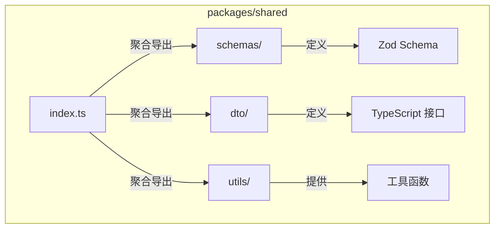
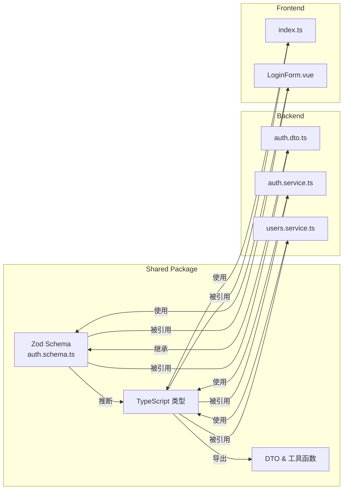
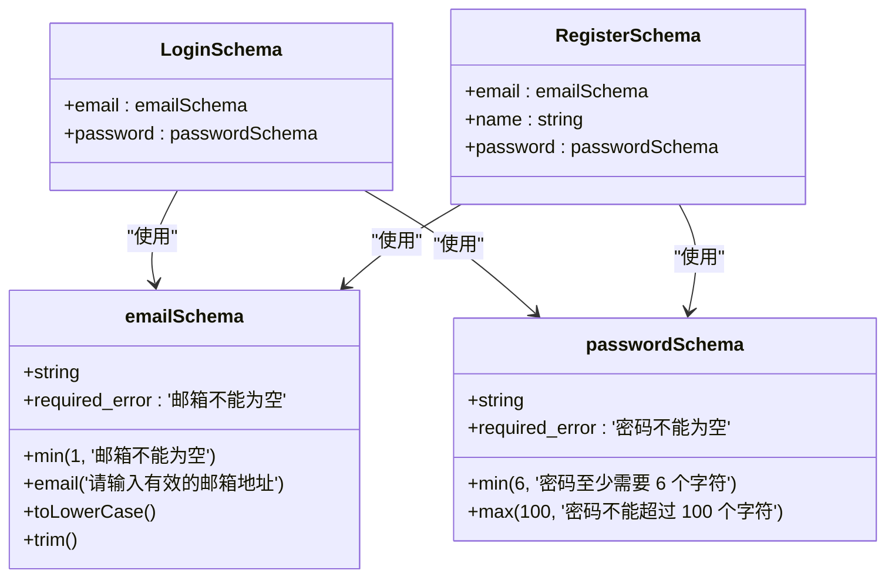
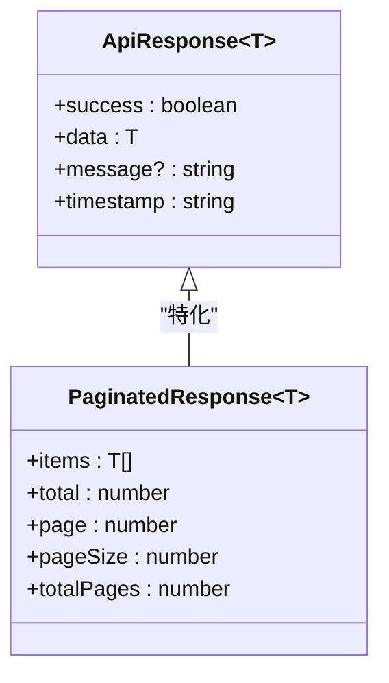
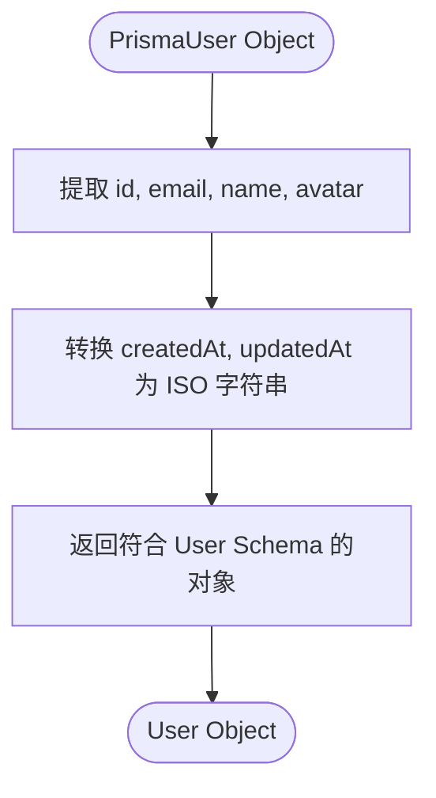
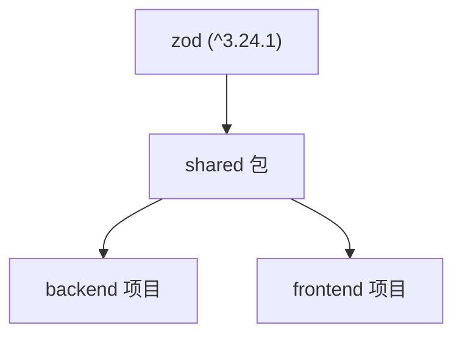

# 共享包

<cite>
**本文档中引用的文件**   
- [auth.schema.ts](file://packages/shared/src/schemas/auth.schema.ts)
- [common.dto.ts](file://packages/shared/src/dto/common.dto.ts)
- [user.utils.ts](file://packages/shared/src/utils/user.utils.ts)
- [index.ts](file://packages/shared/src/index.ts)
- [package.json](file://packages/shared/package.json)
- [auth.dto.ts](file://apps/backend/src/auth/auth.dto.ts)
- [index.ts](file://apps/frontend/src/api/index.ts)
- [LoginForm.vue](file://apps/frontend/src/components/LoginForm.vue)
- [auth.service.ts](file://apps/backend/src/auth/auth.service.ts)
- [users.service.ts](file://apps/backend/src/users/users.service.ts)
</cite>

## 目录
1. [简介](#简介)
2. [项目结构](#项目结构)
3. [核心组件](#核心组件)
4. [架构概述](#架构概述)
5. [详细组件分析](#详细组件分析)
6. [依赖分析](#依赖分析)
7. [性能考虑](#性能考虑)
8. [故障排除指南](#故障排除指南)
9. [结论](#结论)

## 简介
`shared` 包是本项目的核心基础设施，作为前后端共享类型和验证逻辑的“单一可信源”。它通过 Zod Schema 统一定义数据结构和验证规则，确保前后端在数据验证、类型定义和接口契约上完全一致，从而显著减少因类型不匹配或验证逻辑差异导致的错误。该包不仅包含用于表单和 API 请求/响应的 Zod Schema，还导出了通用的 DTO（如 `ApiResponse`）和实用工具函数（如 `formatUser`），为整个应用提供一致的基础支持。

## 项目结构
`shared` 包的结构清晰，按功能划分为 `schemas`、`dto` 和 `utils` 三个主要目录，并通过 `index.ts` 文件统一导出，方便其他模块导入。

**Diagram sources**
- [auth.schema.ts](file://packages/shared/src/schemas/auth.schema.ts)
- [common.dto.ts](file://packages/shared/src/dto/common.dto.ts)
- [user.utils.ts](file://packages/shared/src/utils/user.utils.ts)
- [index.ts](file://packages/shared/src/index.ts)

**Section sources**
- [auth.schema.ts](file://packages/shared/src/schemas/auth.schema.ts)
- [common.dto.ts](file://packages/shared/src/dto/common.dto.ts)
- [user.utils.ts](file://packages/shared/src/utils/user.utils.ts)
- [index.ts](file://packages/shared/src/index.ts)

## 核心组件
`shared` 包的核心是其 Zod Schema 定义。这些 Schema 位于 `packages/shared/src/schemas/` 目录下，是整个应用数据验证和类型推断的源头。通过 `z.infer<>`，可以自动从 Schema 推断出对应的 TypeScript 类型，避免了手动维护 `interface` 的繁琐和潜在的不一致。此外，`dto` 目录下的通用响应接口和 `utils` 目录下的数据格式化函数，共同构成了一个功能完备的共享库。

**Section sources**
- [auth.schema.ts](file://packages/shared/src/schemas/auth.schema.ts)
- [common.dto.ts](file://packages/shared/src/dto/common.dto.ts)
- [user.utils.ts](file://packages/shared/src/utils/user.utils.ts)

## 架构概述
`shared` 包的架构设计遵循“单一可信源”原则。所有与数据结构相关的定义都集中在此包中。前端和后端项目作为独立的 `workspace` 成员，通过 `@my-app/shared` 这一包名直接引用这些定义。这种设计实现了高度的解耦和一致性。

**Diagram sources**
- [auth.schema.ts](file://packages/shared/src/schemas/auth.schema.ts)
- [auth.dto.ts](file://apps/backend/src/auth/auth.dto.ts)
- [auth.service.ts](file://apps/backend/src/auth/auth.service.ts)
- [users.service.ts](file://apps/backend/src/users/users.service.ts)
- [index.ts](file://apps/frontend/src/api/index.ts)
- [LoginForm.vue](file://apps/frontend/src/components/LoginForm.vue)

## 详细组件分析
本节将深入分析 `shared` 包中的关键组件，展示其具体实现和在前后端的应用方式。

### Zod Schema 与类型推断分析
`auth.schema.ts` 文件是 `shared` 包的核心，它定义了所有与认证相关的数据结构和验证规则。

#### Schema 定义与复用
该文件首先定义了可复用的基础字段规则，如 `emailSchema` 和 `passwordSchema`。这些基础规则随后被组合成完整的对象 Schema，例如 `LoginSchema` 和 `RegisterSchema`。这种分层设计避免了重复代码，确保了验证逻辑的一致性。

**Diagram sources**
- [auth.schema.ts](file://packages/shared/src/schemas/auth.schema.ts#L6-L42)

#### 自动类型推断
文件末尾使用 `z.infer<typeof Schema>` 语法，从每个 Zod Schema 自动推断出对应的 TypeScript 类型。例如，`LoginInput` 类型就是从 `LoginSchema` 推断出来的。这消除了手动编写 `interface LoginInput { email: string; password: string }` 的需要，保证了类型定义与验证规则的绝对同步。

**Section sources**
- [auth.schema.ts](file://packages/shared/src/schemas/auth.schema.ts#L88-L93)

### 通用 DTO 分析
`common.dto.ts` 文件定义了应用中通用的 TypeScript 接口，为 API 响应提供标准化的格式。

#### 通用响应格式
`ApiResponse<T>` 接口定义了所有 API 响应的统一结构，包含 `success`、`data`、`message` 和 `timestamp` 字段。后端通过 `TransformInterceptor` 将成功响应包装成此格式，前端在调用 API 时可以直接使用此类型进行类型安全的解包。

**Diagram sources**
- [common.dto.ts](file://packages/shared/src/dto/common.dto.ts#L4-L29)

**Section sources**
- [common.dto.ts](file://packages/shared/src/dto/common.dto.ts#L4-L39)
- [transform.interceptor.ts](file://apps/backend/src/common/interceptors/transform.interceptor.ts#L8-L12)

### 工具函数分析
`user.utils.ts` 文件提供了用于数据转换的工具函数，主要用于将数据库（Prisma）返回的原始数据格式化为前端或 API 响应所需的格式。

#### 数据格式化流程
`formatUser` 函数接收一个来自 Prisma 的 `PrismaUser` 对象（包含 `Date` 类型的 `createdAt` 和 `updatedAt`），并返回一个符合 `User` Schema 的对象，其中时间字段被转换为 ISO 字符串。`formatUsers` 则是对 `formatUser` 的批量应用。

**Diagram sources**
- [user.utils.ts](file://packages/shared/src/utils/user.utils.ts#L19-L27)

**Section sources**
- [user.utils.ts](file://packages/shared/src/utils/user.utils.ts#L1-L35)
- [auth.service.ts](file://apps/backend/src/auth/auth.service.ts#L53)
- [users.service.ts](file://apps/backend/src/users/users.service.ts#L23)

## 依赖分析
`shared` 包的依赖关系简单而明确，其主要依赖是 `zod`，用于定义和验证 Schema。它本身不依赖于任何特定的框架（如 NestJS 或 Vue），这保证了其高度的通用性和可移植性。

**Diagram sources**
- [package.json](file://packages/shared/package.json#L26)

**Section sources**
- [package.json](file://packages/shared/package.json#L1-L32)

## 性能考虑
`shared` 包本身是一个纯类型和工具函数的集合，对运行时性能没有负面影响。其价值主要体现在开发效率和应用健壮性上。通过在编译时进行类型检查和在运行时进行统一的数据验证，它可以提前捕获大量潜在的错误，减少了生产环境中的调试成本和故障排查时间，从而间接提升了应用的整体性能和可靠性。

## 故障排除指南
当遇到与 `shared` 包相关的问题时，可以参考以下指南：

1.  **类型错误或导入失败**：首先检查 `package.json` 中 `@my-app/shared` 的版本是否正确（应为 `workspace:*`），并确保已运行 `pnpm install`。检查 `index.ts` 是否正确导出了所需的内容。
2.  **Zod 验证失败**：检查前端或后端使用的 Schema 是否与 `shared` 包中的定义一致。确认 `createZodDto` 或 `toTypedSchema` 是否正确地包装了共享的 Schema。
3.  **数据格式不匹配**：如果从后端获取的数据与 `User` 等类型定义不符，请检查 `formatUser` 等工具函数是否被正确调用，以及 `TransformInterceptor` 是否已全局注册。

**Section sources**
- [package.json](file://apps/backend/package.json#L23)
- [package.json](file://apps/frontend/package.json#L32)
- [auth.dto.ts](file://apps/backend/src/auth/auth.dto.ts)
- [LoginForm.vue](file://apps/frontend/src/components/LoginForm.vue)
- [user.utils.ts](file://packages/shared/src/utils/user.utils.ts)
- [transform.interceptor.ts](file://apps/backend/src/common/interceptors/transform.interceptor.ts)

## 结论
`shared` 包是本全栈应用成功的关键设计。它通过 Zod Schema 实现了“单一可信源”，将数据验证和类型定义从分散的状态集中管理，极大地提升了代码的一致性、可维护性和安全性。前后端共同引用同一套定义，不仅减少了重复工作，更从根本上杜绝了因类型不一致导致的运行时错误。结合通用 DTO 和工具函数，`shared` 包为整个项目提供了一个坚实、可靠且高效的基础。