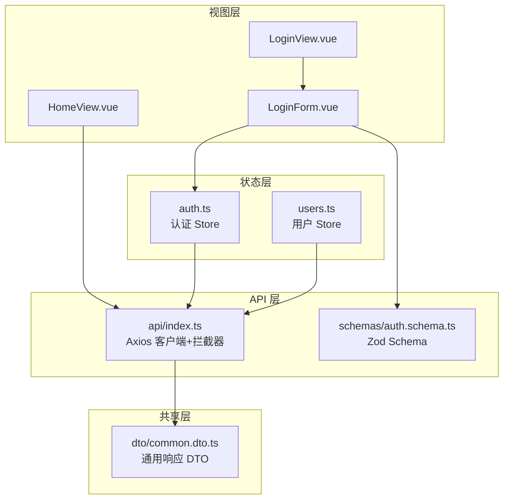
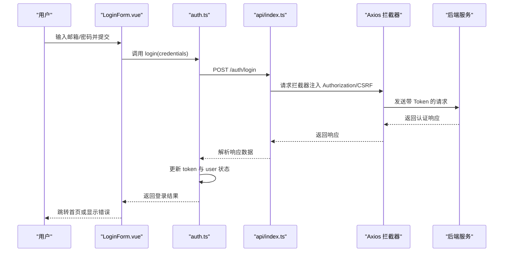
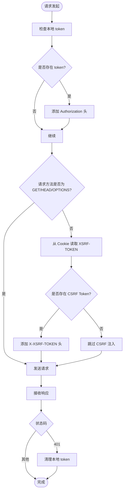
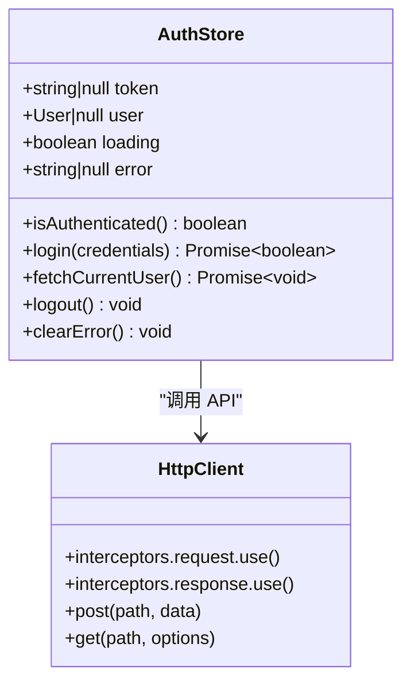
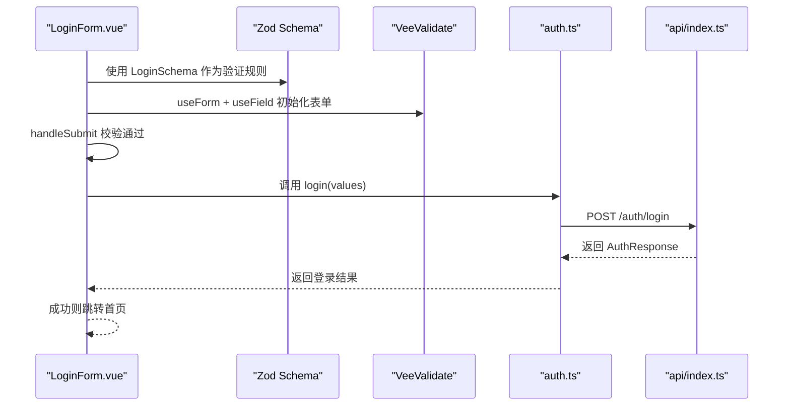
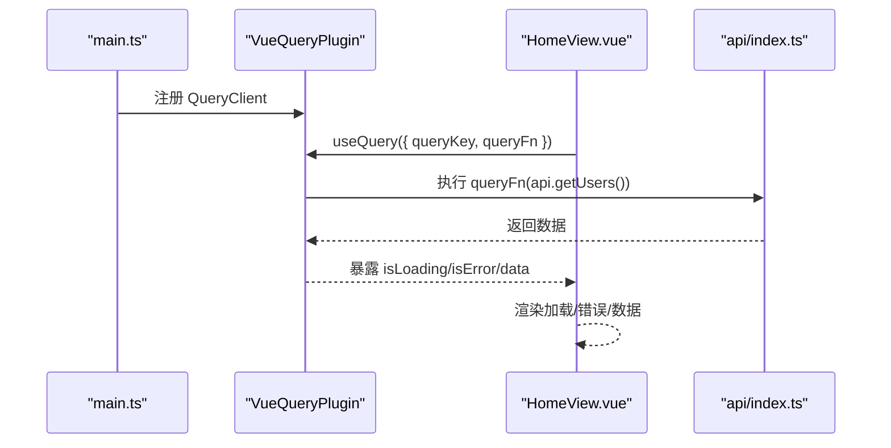
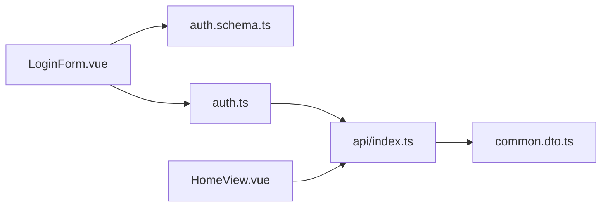

# API 客户端与数据交互

<cite>
**本文引用的文件**
- [apps/frontend/src/api/index.ts](file://apps/frontend/src/api/index.ts)
- [apps/frontend/src/stores/auth.ts](file://apps/frontend/src/stores/auth.ts)
- [apps/frontend/src/stores/users.ts](file://apps/frontend/src/stores/users.ts)
- [apps/frontend/src/composables/useRequest.ts](file://apps/frontend/src/composables/useRequest.ts)
- [apps/frontend/src/components/LoginForm.vue](file://apps/frontend/src/components/LoginForm.vue)
- [apps/frontend/src/views/LoginView.vue](file://apps/frontend/src/views/LoginView.vue)
- [apps/frontend/src/views/HomeView.vue](file://apps/frontend/src/views/HomeView.vue)
- [apps/frontend/src/main.ts](file://apps/frontend/src/main.ts)
- [packages/shared/src/schemas/auth.schema.ts](file://packages/shared/src/schemas/auth.schema.ts)
- [packages/shared/src/dto/common.dto.ts](file://packages/shared/src/dto/common.dto.ts)
- [apps/backend/src/auth/auth.dto.ts](file://apps/backend/src/auth/auth.dto.ts)
</cite>

## 目录
1. [简介](#简介)
2. [项目结构](#项目结构)
3. [核心组件](#核心组件)
4. [架构总览](#架构总览)
5. [详细组件分析](#详细组件分析)
6. [依赖关系分析](#依赖关系分析)
7. [性能考量](#性能考量)
8. [故障排查指南](#故障排查指南)
9. [结论](#结论)

## 简介
本文件面向前端开发者，系统性阐述本项目的 API 客户端设计与数据交互流程，重点包括：
- 基于 Axios 的统一 HTTP 请求封装与拦截器机制（JWT Token 注入、CSRF 保护、401 统一处理）
- 借助 Zod Schema 实现前后端一致的类型安全与表单校验
- 以登录流程为例，完整展示从前端表单提交到后端认证、响应解析、状态更新的数据流
- TanStack Query 在缓存管理、自动刷新与加载状态控制方面的集成与优势

## 项目结构
前端采用模块化组织，围绕“API 客户端 → 状态管理 → 视图组件”的分层设计：
- API 层：集中定义 Axios 实例、拦截器与业务接口
- 状态层：Pinia Store 管理认证与业务数据
- 视图层：Vue 组件负责渲染与交互，配合 Zod 表单校验
- 共享层：Zod Schema 与通用响应 DTO 提供跨包复用

图表来源
- [apps/frontend/src/views/LoginView.vue](file://apps/frontend/src/views/LoginView.vue#L1-L8)
- [apps/frontend/src/components/LoginForm.vue](file://apps/frontend/src/components/LoginForm.vue#L1-L99)
- [apps/frontend/src/stores/auth.ts](file://apps/frontend/src/stores/auth.ts#L1-L97)
- [apps/frontend/src/stores/users.ts](file://apps/frontend/src/stores/users.ts#L1-L42)
- [apps/frontend/src/api/index.ts](file://apps/frontend/src/api/index.ts#L1-L92)
- [packages/shared/src/schemas/auth.schema.ts](file://packages/shared/src/schemas/auth.schema.ts#L1-L94)
- [packages/shared/src/dto/common.dto.ts](file://packages/shared/src/dto/common.dto.ts#L1-L40)

章节来源
- [apps/frontend/src/views/LoginView.vue](file://apps/frontend/src/views/LoginView.vue#L1-L8)
- [apps/frontend/src/components/LoginForm.vue](file://apps/frontend/src/components/LoginForm.vue#L1-L99)
- [apps/frontend/src/stores/auth.ts](file://apps/frontend/src/stores/auth.ts#L1-L97)
- [apps/frontend/src/stores/users.ts](file://apps/frontend/src/stores/users.ts#L1-L42)
- [apps/frontend/src/api/index.ts](file://apps/frontend/src/api/index.ts#L1-L92)
- [packages/shared/src/schemas/auth.schema.ts](file://packages/shared/src/schemas/auth.schema.ts#L1-L94)
- [packages/shared/src/dto/common.dto.ts](file://packages/shared/src/dto/common.dto.ts#L1-L40)

## 核心组件
- Axios 统一客户端与拦截器
  - 基础配置：baseURL、超时、Content-Type
  - 请求拦截器：自动注入 Authorization Bearer Token；非 GET 请求注入 CSRF Token
  - 响应拦截器：统一处理 401 未授权并清理本地 token
  - 业务接口：用户列表、单个用户、创建用户等
- 认证状态管理（Pinia）
  - login：调用 API 登录，保存 token 与用户信息，处理错误与加载状态
  - fetchCurrentUser：基于已有 token 获取当前用户信息
  - logout：清空 token 与用户信息
- 通用请求 Hook（useRequest）
  - 封装加载、错误、执行函数，便于复用
- 共享 Schema 与 DTO
  - Zod：LoginSchema、UserSchema、AuthResponseSchema 等
  - DTO：ApiResponse、分页响应与查询参数
- TanStack Query 集成
  - 在应用入口初始化 QueryClient 并设置默认选项（staleTime、retry）
  - 在视图中使用 useQuery 进行数据拉取与状态管理

章节来源
- [apps/frontend/src/api/index.ts](file://apps/frontend/src/api/index.ts#L1-L92)
- [apps/frontend/src/stores/auth.ts](file://apps/frontend/src/stores/auth.ts#L1-L97)
- [apps/frontend/src/composables/useRequest.ts](file://apps/frontend/src/composables/useRequest.ts#L1-L44)
- [packages/shared/src/schemas/auth.schema.ts](file://packages/shared/src/schemas/auth.schema.ts#L1-L94)
- [packages/shared/src/dto/common.dto.ts](file://packages/shared/src/dto/common.dto.ts#L1-L40)
- [apps/frontend/src/main.ts](file://apps/frontend/src/main.ts#L1-L56)

## 架构总览
下图展示了从前端表单到 API 调用、状态更新与 UI 反馈的完整链路。

图表来源
- [apps/frontend/src/components/LoginForm.vue](file://apps/frontend/src/components/LoginForm.vue#L1-L99)
- [apps/frontend/src/stores/auth.ts](file://apps/frontend/src/stores/auth.ts#L1-L97)
- [apps/frontend/src/api/index.ts](file://apps/frontend/src/api/index.ts#L1-L92)

## 详细组件分析

### Axios 客户端与拦截器
- 基础配置
  - baseURL 设为 /api，统一路径前缀
  - 超时 10 秒，Content-Type 固定为 application/json
- 请求拦截器
  - 若本地存在 token，则在 Authorization 头部添加 Bearer Token
  - 对非 GET/HEAD/OPTIONS 请求，从 Cookie 中读取 XSRF-TOKEN 并写入 X-XSRF-TOKEN 头，增强 CSRF 保护
- 响应拦截器
  - 捕获 401 未授权错误，主动清理本地 token，避免后续请求继续携带无效 token
- 业务接口
  - 提供用户列表、单个用户、创建用户的 API 方法，返回统一的 ApiResponse 结构

图表来源
- [apps/frontend/src/api/index.ts](file://apps/frontend/src/api/index.ts#L1-L92)

章节来源
- [apps/frontend/src/api/index.ts](file://apps/frontend/src/api/index.ts#L1-L92)

### 认证状态管理（Pinia）
- 状态字段
  - token、user、loading、error
  - isAuthenticated 基于 token 计算
- 方法
  - login：调用 /auth/login，成功后保存 token 与 user，失败时设置错误消息
  - fetchCurrentUser：若存在 token，则请求 /auth/me 并更新 user；异常则触发 logout
  - logout：清空 token、user、error
  - clearError：重置错误
- 持久化
  - 使用 pinia-plugin-persistedstate，仅持久化 token 字段，减少存储体积与风险

图表来源
- [apps/frontend/src/stores/auth.ts](file://apps/frontend/src/stores/auth.ts#L1-L97)
- [apps/frontend/src/api/index.ts](file://apps/frontend/src/api/index.ts#L1-L92)

章节来源
- [apps/frontend/src/stores/auth.ts](file://apps/frontend/src/stores/auth.ts#L1-L97)

### 表单校验与登录流程（Zod + VeeValidate）
- 共享 Schema
  - LoginSchema：邮箱与密码的基础校验规则
  - UserSchema、AuthResponseSchema：用户与认证响应的类型推断
- 组件集成
  - LoginForm.vue 使用 toTypedSchema(LoginSchema) 将 Zod Schema 转换为 VeeValidate 验证规则
  - useForm + useField 管理表单字段与错误
  - handleSubmit 提交时调用 authStore.login，成功后路由跳转首页
- 后端 DTO
  - 后端使用 createZodDto(LoginDto) 将 LoginSchema 映射为 NestJS DTO，保证前后端一致的校验逻辑

图表来源
- [apps/frontend/src/components/LoginForm.vue](file://apps/frontend/src/components/LoginForm.vue#L1-L99)
- [packages/shared/src/schemas/auth.schema.ts](file://packages/shared/src/schemas/auth.schema.ts#L1-L94)
- [apps/backend/src/auth/auth.dto.ts](file://apps/backend/src/auth/auth.dto.ts#L1-L19)
- [apps/frontend/src/stores/auth.ts](file://apps/frontend/src/stores/auth.ts#L1-L97)
- [apps/frontend/src/api/index.ts](file://apps/frontend/src/api/index.ts#L1-L92)

章节来源
- [apps/frontend/src/components/LoginForm.vue](file://apps/frontend/src/components/LoginForm.vue#L1-L99)
- [packages/shared/src/schemas/auth.schema.ts](file://packages/shared/src/schemas/auth.schema.ts#L1-L94)
- [apps/backend/src/auth/auth.dto.ts](file://apps/backend/src/auth/auth.dto.ts#L1-L19)
- [apps/frontend/src/stores/auth.ts](file://apps/frontend/src/stores/auth.ts#L1-L97)
- [apps/frontend/src/api/index.ts](file://apps/frontend/src/api/index.ts#L1-L92)

### TanStack Query 集成与优势
- 应用入口初始化
  - 创建 QueryClient，设置 queries.staleTime 与 retry 默认值
  - 通过 VueQueryPlugin 注入全局
- 视图使用
  - 在 HomeView.vue 中使用 useQuery 拉取用户列表，利用 queryKey 缓存、自动去重与重试策略
  - 通过 isLoading/isError 等状态简化 UI 控制
- 优势
  - 缓存管理：相同 queryKey 自动复用缓存，避免重复请求
  - 自动刷新：页面可见时自动重新验证，保持数据新鲜度
  - 加载状态控制：无需手动维护 loading/error，Query 层提供统一状态
  - 重试与回退：内置重试策略，失败时可降级返回空数据

图表来源
- [apps/frontend/src/main.ts](file://apps/frontend/src/main.ts#L1-L56)
- [apps/frontend/src/views/HomeView.vue](file://apps/frontend/src/views/HomeView.vue#L110-L128)
- [apps/frontend/src/api/index.ts](file://apps/frontend/src/api/index.ts#L1-L92)

章节来源
- [apps/frontend/src/main.ts](file://apps/frontend/src/main.ts#L1-L56)
- [apps/frontend/src/views/HomeView.vue](file://apps/frontend/src/views/HomeView.vue#L110-L128)
- [apps/frontend/src/api/index.ts](file://apps/frontend/src/api/index.ts#L1-L92)

### 通用请求 Hook（useRequest）
- 功能
  - 封装执行函数 execute，内部统一处理 loading、error 与异常捕获
  - 返回 data、loading、error 与 execute，便于在组件中快速复用
- 适用场景
  - 简单的 CRUD 操作或一次性请求，无需 Query 层复杂缓存策略时

章节来源
- [apps/frontend/src/composables/useRequest.ts](file://apps/frontend/src/composables/useRequest.ts#L1-L44)

### 用户列表与通用响应
- 用户 Store
  - useUsersStore 调用 api.getUsers，解析 ApiResponse.data 并更新本地 users
  - 统一处理 loading 与 error
- 通用响应 DTO
  - ApiResponse<T>：success、data、message、timestamp
  - 分页响应与查询参数接口，便于扩展分页功能

章节来源
- [apps/frontend/src/stores/users.ts](file://apps/frontend/src/stores/users.ts#L1-L42)
- [packages/shared/src/dto/common.dto.ts](file://packages/shared/src/dto/common.dto.ts#L1-L40)

## 依赖关系分析
- 组件耦合
  - LoginForm.vue 依赖 Zod Schema 与 auth.ts；auth.ts 依赖 api/index.ts；api/index.ts 依赖 shared 的 DTO
  - HomeView.vue 依赖 TanStack Query 与 api/index.ts
- 外部依赖
  - Axios、Zod、VeeValidate、TanStack Query、Pinia、Vue Router、Vue I18n 等
- 循环依赖
  - 未发现直接循环依赖；各层职责清晰，通过共享包进行解耦

图表来源
- [apps/frontend/src/components/LoginForm.vue](file://apps/frontend/src/components/LoginForm.vue#L1-L99)
- [apps/frontend/src/stores/auth.ts](file://apps/frontend/src/stores/auth.ts#L1-L97)
- [apps/frontend/src/api/index.ts](file://apps/frontend/src/api/index.ts#L1-L92)
- [apps/frontend/src/views/HomeView.vue](file://apps/frontend/src/views/HomeView.vue#L110-L128)
- [packages/shared/src/schemas/auth.schema.ts](file://packages/shared/src/schemas/auth.schema.ts#L1-L94)
- [packages/shared/src/dto/common.dto.ts](file://packages/shared/src/dto/common.dto.ts#L1-L40)

章节来源
- [apps/frontend/src/components/LoginForm.vue](file://apps/frontend/src/components/LoginForm.vue#L1-L99)
- [apps/frontend/src/stores/auth.ts](file://apps/frontend/src/stores/auth.ts#L1-L97)
- [apps/frontend/src/api/index.ts](file://apps/frontend/src/api/index.ts#L1-L92)
- [apps/frontend/src/views/HomeView.vue](file://apps/frontend/src/views/HomeView.vue#L110-L128)
- [packages/shared/src/schemas/auth.schema.ts](file://packages/shared/src/schemas/auth.schema.ts#L1-L94)
- [packages/shared/src/dto/common.dto.ts](file://packages/shared/src/dto/common.dto.ts#L1-L40)

## 性能考量
- Axios
  - 合理设置超时与 Content-Type，避免不必要的重试与头部冲突
  - 请求拦截器仅做必要注入，避免对高频请求造成额外开销
- TanStack Query
  - staleTime 设置为 1 分钟，平衡新鲜度与性能
  - retry 次数建议按业务场景调整，避免对弱网环境造成压力
- Pinia
  - 仅持久化 token，降低存储压力与安全风险
- 前端渲染
  - 使用 computed 与响应式状态，避免不必要重渲染

## 故障排查指南
- 401 未授权
  - 现象：登录后立即被重定向或出现权限错误
  - 排查：确认请求拦截器是否正确注入 Authorization；检查响应拦截器是否清理了本地 token
  - 参考
    - [apps/frontend/src/api/index.ts](file://apps/frontend/src/api/index.ts#L45-L56)
- CSRF 校验失败
  - 现象：非 GET 请求返回 403 或 CSRF 校验错误
  - 排查：确认 Cookie 中存在 XSRF-TOKEN；请求拦截器是否正确注入 X-XSRF-TOKEN
  - 参考
    - [apps/frontend/src/api/index.ts](file://apps/frontend/src/api/index.ts#L23-L43)
- 登录失败
  - 现象：表单提交后无反应或显示错误信息
  - 排查：确认 LoginForm.vue 的 handleSubmit 是否调用 authStore.login；查看 auth.ts 的错误处理分支
  - 参考
    - [apps/frontend/src/components/LoginForm.vue](file://apps/frontend/src/components/LoginForm.vue#L23-L28)
    - [apps/frontend/src/stores/auth.ts](file://apps/frontend/src/stores/auth.ts#L25-L41)
- 查询失败
  - 现象：useQuery 报错或数据为空
  - 排查：检查 queryFn 是否抛出异常；确认 queryKey 唯一性；观察 retry 策略
  - 参考
    - [apps/frontend/src/views/HomeView.vue](file://apps/frontend/src/views/HomeView.vue#L116-L121)
    - [apps/frontend/src/main.ts](file://apps/frontend/src/main.ts#L39-L46)

章节来源
- [apps/frontend/src/api/index.ts](file://apps/frontend/src/api/index.ts#L23-L56)
- [apps/frontend/src/components/LoginForm.vue](file://apps/frontend/src/components/LoginForm.vue#L23-L28)
- [apps/frontend/src/stores/auth.ts](file://apps/frontend/src/stores/auth.ts#L25-L41)
- [apps/frontend/src/views/HomeView.vue](file://apps/frontend/src/views/HomeView.vue#L116-L121)
- [apps/frontend/src/main.ts](file://apps/frontend/src/main.ts#L39-L46)

## 结论
本项目通过 Axios 统一请求层、Zod Schema 实现前后端类型安全、Pinia 管理认证状态、以及 TanStack Query 的缓存与加载状态管理，形成了高内聚、低耦合且易于维护的数据交互体系。登录流程作为典型范例，展示了从前端表单校验、API 调用、响应解析到状态更新的完整闭环。建议在后续迭代中：
- 将更多业务接口迁移至 api/index.ts 并统一返回 ApiResponse
- 在复杂列表场景引入分页与查询参数的统一处理
- 结合 useQuery 的查询键策略优化缓存命中率