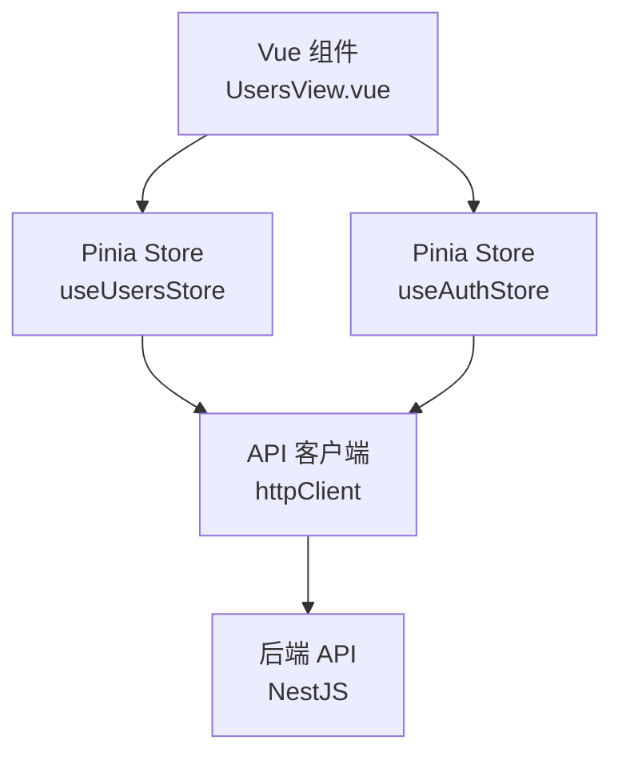
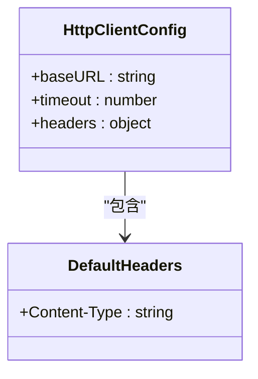
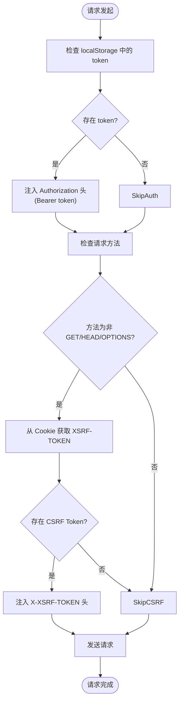
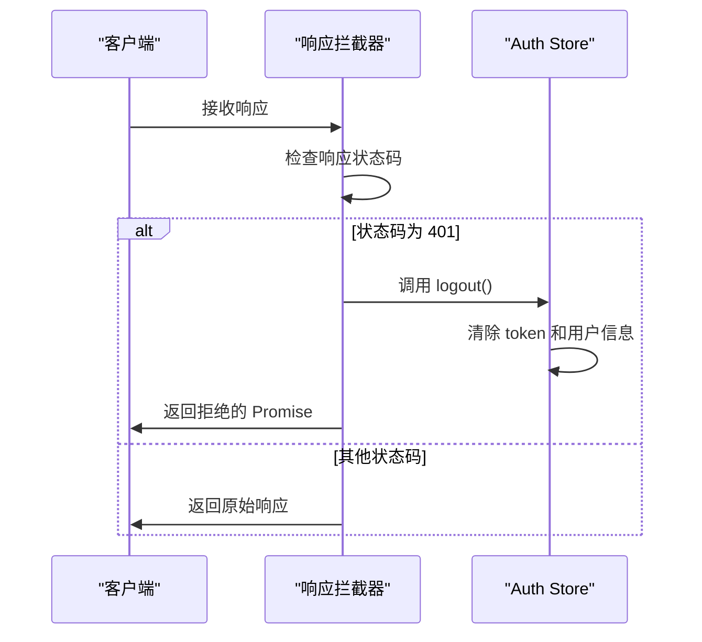
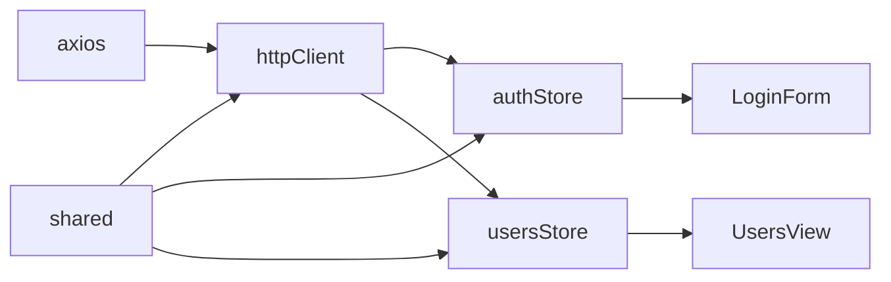

# API 客户端实现

<cite>
**本文档引用的文件**  
- [index.ts](file://apps/frontend/src/api/index.ts)
- [common.dto.ts](file://packages/shared/src/dto/common.dto.ts)
- [auth.schema.ts](file://packages/shared/src/schemas/auth.schema.ts)
- [user.utils.ts](file://packages/shared/src/utils/user.utils.ts)
- [auth.ts](file://apps/frontend/src/stores/auth.ts)
- [users.ts](file://apps/frontend/src/stores/users.ts)
- [UsersView.vue](file://apps/frontend/src/views/UsersView.vue)
- [LoginForm.vue](file://apps/frontend/src/components/LoginForm.vue)
- [auth.controller.ts](file://apps/backend/src/auth/auth.controller.ts)
- [users.controller.ts](file://apps/backend/src/users/users.controller.ts)
</cite>

## 目录
1. [简介](#简介)
2. [项目结构](#项目结构)
3. [核心组件](#核心组件)
4. [架构概述](#架构概述)
5. [详细组件分析](#详细组件分析)
6. [依赖分析](#依赖分析)
7. [性能考虑](#性能考虑)
8. [故障排除指南](#故障排除指南)
9. [结论](#结论)

## 简介
本文档详细说明了 NestJS + Vue 前后端分离应用中的 API 客户端实现。重点介绍基于 Axios 的 `httpClient` 实例配置，包括基础 URL、超时设置、请求/响应头管理，以及请求和响应拦截器的具体实现逻辑。文档还阐述了拦截器如何自动处理 JWT Token 和 CSRF Token，并在用户未授权时自动清除本地状态。通过实际调用示例展示 API 接口的使用方式，并解释其与共享类型定义的关联。

## 项目结构
前端 API 客户端实现在 `apps/frontend/src/api/index.ts` 文件中，作为全局 HTTP 客户端被整个应用使用。该客户端依赖于共享包 `@my-app/shared` 中定义的类型（如 `User` 和 `ApiResponse`），并与 Pinia 状态管理（`stores/auth.ts` 和 `stores/users.ts`）紧密集成。后端对应的 API 端点由 `auth.controller.ts` 和 `users.controller.ts` 提供。

```mermaid
graph TB
subgraph "前端 (Frontend)"
A[API 客户端<br/>httpClient] --> B[状态管理<br/>Pinia Store]
B --> C[视图组件<br/>Vue Components]
A --> D[共享类型<br/>@my-app/shared]
end
subgraph "后端 (Backend)"
E[认证控制器<br/>AuthController]
F[用户控制器<br/>UsersController]
end
A --> |HTTP 请求| E
A --> |HTTP 请求| F
```

**Diagram sources**
- [index.ts](file://apps/frontend/src/api/index.ts#L7-L92)
- [auth.controller.ts](file://apps/backend/src/auth/auth.controller.ts#L1-L51)
- [users.controller.ts](file://apps/backend/src/users/users.controller.ts#L1-L43)

**Section sources**
- [index.ts](file://apps/frontend/src/api/index.ts#L1-L92)
- [auth.controller.ts](file://apps/backend/src/auth/auth.controller.ts#L1-L51)
- [users.controller.ts](file://apps/backend/src/users/users.controller.ts#L1-L43)

## 核心组件
核心组件是位于 `apps/frontend/src/api/index.ts` 的 `httpClient` 实例。该实例通过 Axios 创建，配置了统一的基础路径、超时时间和默认请求头。其核心功能通过请求和响应拦截器实现，自动处理身份验证和错误状态，为上层应用提供简洁、安全的 API 调用接口。

**Section sources**
- [index.ts](file://apps/frontend/src/api/index.ts#L7-L92)

## 架构概述
API 客户端采用分层架构，`httpClient` 作为底层通信层，封装了所有 HTTP 细节。上层是业务逻辑层，由 Pinia Store（如 `useAuthStore` 和 `useUsersStore`）构成，它们使用 `httpClient` 来执行具体的业务操作。最上层是视图层，Vue 组件通过调用 Store 中的方法来触发数据获取和更新。



**Diagram sources**
- [UsersView.vue](file://apps/frontend/src/views/UsersView.vue#L1-L67)
- [users.ts](file://apps/frontend/src/stores/users.ts#L1-L42)
- [auth.ts](file://apps/frontend/src/stores/auth.ts#L1-L97)
- [index.ts](file://apps/frontend/src/api/index.ts#L7-L92)

## 详细组件分析

### Axios 实例配置分析
`httpClient` 实例通过 `axios.create()` 方法创建，其配置确保了应用内所有请求的一致性。

#### 配置详情


**Diagram sources**
- [index.ts](file://apps/frontend/src/api/index.ts#L7-L13)

**Section sources**
- [index.ts](file://apps/frontend/src/api/index.ts#L7-L13)

### 请求拦截器分析
请求拦截器在每个请求发送前执行，负责自动注入身份验证和安全令牌。

#### 拦截器逻辑流程


**Diagram sources**
- [index.ts](file://apps/frontend/src/api/index.ts#L23-L43)

**Section sources**
- [index.ts](file://apps/frontend/src/api/index.ts#L23-L43)

### 响应拦截器分析
响应拦截器处理服务器返回的响应，特别是对未授权状态进行全局处理。

#### 错误处理流程


**Diagram sources**
- [index.ts](file://apps/frontend/src/api/index.ts#L45-L55)
- [auth.ts](file://apps/frontend/src/stores/auth.ts#L63-L67)

**Section sources**
- [index.ts](file://apps/frontend/src/api/index.ts#L45-L55)

### API 接口集合分析
`api` 对象封装了应用中常用的业务 API，为上层组件提供类型安全的调用接口。

#### API 方法调用示例
```mermaid
flowchart LR
A[getUsers()] --> B[httpClient.get<ApiResponse<User[]>>]
C[getUser(id)] --> D[httpClient.get<ApiResponse<User>>]
E[createUser(data)] --> F[httpClient.post<ApiResponse<User>>]
```

**Diagram sources**
- [index.ts](file://apps/frontend/src/api/index.ts#L61-L88)

**Section sources**
- [index.ts](file://apps/frontend/src/api/index.ts#L61-L88)

## 依赖分析
API 客户端的实现依赖于多个关键模块和包。它直接依赖于 `axios` 库进行 HTTP 通信，并从 `@my-app/shared` 包中导入类型定义，确保前后端类型一致。在应用内部，它被 Pinia Store 模块所依赖，而这些 Store 又被 Vue 组件所使用。



**Diagram sources**
- [index.ts](file://apps/frontend/src/api/index.ts#L1-L2)
- [auth.schema.ts](file://packages/shared/src/schemas/auth.schema.ts#L88-L94)
- [auth.ts](file://apps/frontend/src/stores/auth.ts#L4)
- [users.ts](file://apps/frontend/src/stores/users.ts#L3)
- [LoginForm.vue](file://apps/frontend/src/components/LoginForm.vue#L6)
- [UsersView.vue](file://apps/frontend/src/views/UsersView.vue#L5)

**Section sources**
- [index.ts](file://apps/frontend/src/api/index.ts#L1-L92)
- [auth.schema.ts](file://packages/shared/src/schemas/auth.schema.ts#L1-L94)

## 性能考虑
`httpClient` 的配置中设置了 10 秒的超时时间，这有助于防止因网络问题导致的界面长时间无响应。通过在拦截器中集中处理 Token 注入，避免了在每个 API 调用中重复编写相同的逻辑，提高了代码效率。使用共享的类型定义减少了因类型不一致导致的运行时错误，间接提升了应用的稳定性和性能。

## 故障排除指南
当 API 调用失败时，应首先检查网络连接和后端服务状态。如果出现 401 错误，检查 `localStorage` 中的 `token` 是否存在且有效，以及后端 `/auth/me` 端点是否正常工作。对于 CSRF 相关的 403 错误，确认后端是否正确设置了 `XSRF-TOKEN` Cookie，并且前端请求拦截器成功读取并注入了该 Token。如果类型错误，检查 `@my-app/shared` 包的版本是否与前后端代码匹配。

**Section sources**
- [index.ts](file://apps/frontend/src/api/index.ts#L45-L55)
- [auth.ts](file://apps/frontend/src/stores/auth.ts#L54-L57)

## 结论
本文档详细解析了基于 Axios 的 API 客户端实现。通过精心配置的 `httpClient` 实例和强大的拦截器机制，该实现为应用提供了安全、高效且易于使用的网络通信层。它自动化了身份验证流程，统一了错误处理，并通过与 Pinia 和共享类型系统的集成，构建了一个健壮、可维护的前端架构。