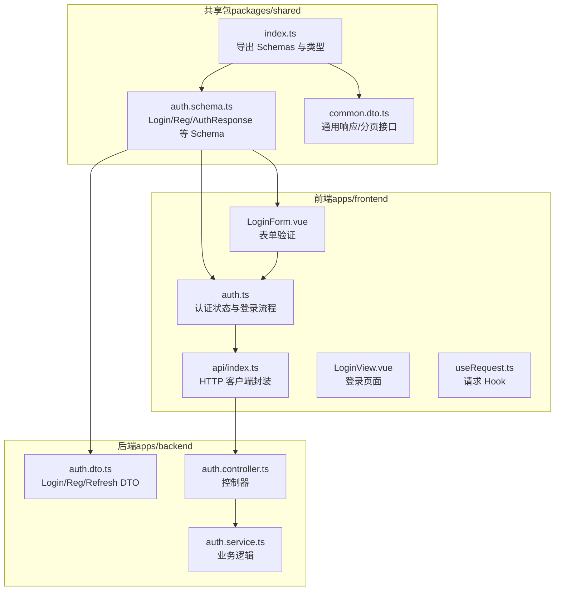
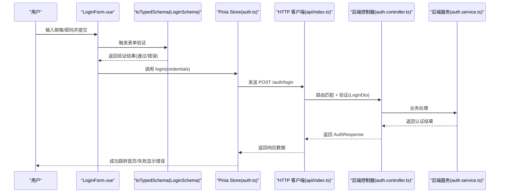
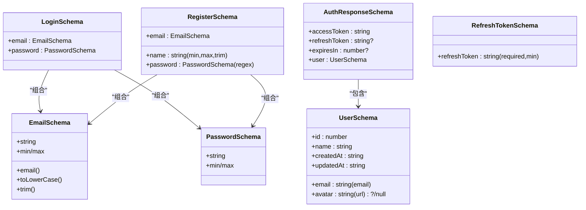
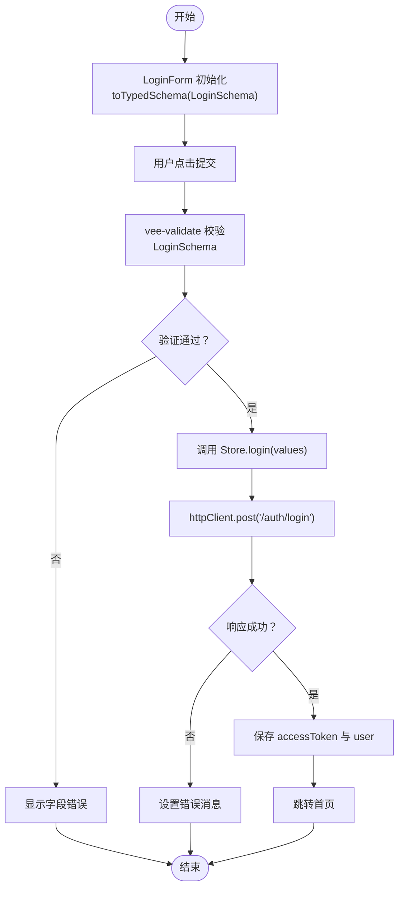
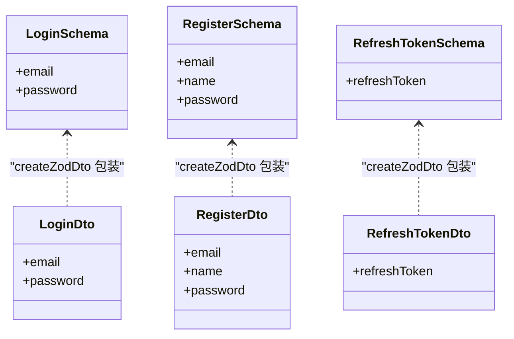
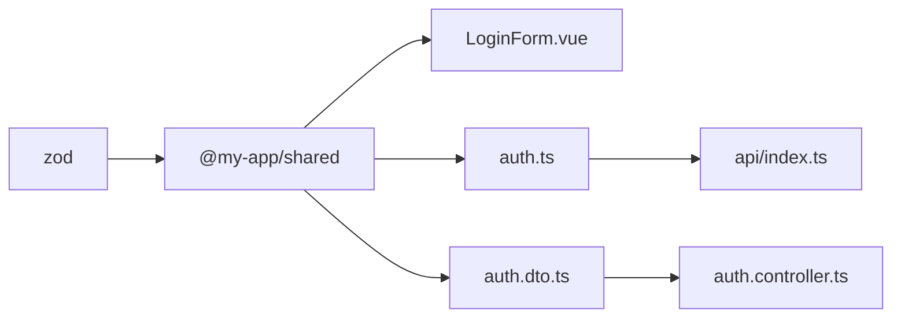

# 类型安全与数据验证

<cite>
**本文引用的文件**
- [auth.schema.ts](file://packages/shared/src/schemas/auth.schema.ts)
- [common.dto.ts](file://packages/shared/src/dto/common.dto.ts)
- [index.ts（共享包导出）](file://packages/shared/src/index.ts)
- [auth.dto.ts（后端 DTO）](file://apps/backend/src/auth/auth.dto.ts)
- [auth.ts（前端认证状态）](file://apps/frontend/src/stores/auth.ts)
- [index.ts（前端 API 客户端）](file://apps/frontend/src/api/index.ts)
- [LoginForm.vue（前端登录表单）](file://apps/frontend/src/components/LoginForm.vue)
- [LoginView.vue（登录视图）](file://apps/frontend/src/views/LoginView.vue)
- [useRequest.ts（前端请求 Hook）](file://apps/frontend/src/composables/useRequest.ts)
- [README（Zod 类型共享说明）](file://README.md)
</cite>

## 目录
1. [简介](#简介)
2. [项目结构](#项目结构)
3. [核心组件](#核心组件)
4. [架构总览](#架构总览)
5. [详细组件分析](#详细组件分析)
6. [依赖关系分析](#依赖关系分析)
7. [性能考量](#性能考量)
8. [故障排查指南](#故障排查指南)
9. [结论](#结论)
10. [附录](#附录)

## 简介
本文件围绕“前后端类型安全与数据验证”主题，系统阐述如何在本项目中利用 Zod Schema 实现强类型验证与类型推断，确保表单输入、API 请求与响应在编译期即可被严格约束，减少运行时类型错误，提升应用健壮性与开发效率。重点解析共享包中的认证相关 Schema（如 LoginSchema、RegisterSchema、AuthResponseSchema 等），以及它们如何通过 z.infer 推断出 LoginInput、AuthResponse 等精确 TypeScript 类型，并在前端表单与后端 DTO 中复用同一套验证规则。

## 项目结构
本项目采用“共享包 + 前端 + 后端”的分层设计：
- 共享包（packages/shared）：集中定义 Zod Schema 与通用响应类型，作为“单一可信来源”，前后端共享。
- 前端（apps/frontend）：使用 vee-validate + @vee-validate/zod 将共享 Schema 作为表单验证规则；Pinia 管理认证状态；Axios 封装 HTTP 客户端。
- 后端（apps/backend）：使用 nestjs-zod 将共享 Schema 包装为 DTO，自动生成 Swagger 文档并进行验证。

图表来源
- [index.ts（共享包导出）](file://packages/shared/src/index.ts#L1-L9)
- [auth.schema.ts](file://packages/shared/src/schemas/auth.schema.ts#L1-L94)
- [common.dto.ts](file://packages/shared/src/dto/common.dto.ts#L1-L40)
- [LoginForm.vue（前端登录表单）](file://apps/frontend/src/components/LoginForm.vue#L1-L99)
- [auth.ts（前端认证状态）](file://apps/frontend/src/stores/auth.ts#L1-L97)
- [index.ts（前端 API 客户端）](file://apps/frontend/src/api/index.ts#L1-L92)
- [auth.dto.ts（后端 DTO）](file://apps/backend/src/auth/auth.dto.ts#L1-L19)

章节来源
- [README（Zod 类型共享说明）](file://README.md#L267-L352)

## 核心组件
- 共享 Schema 与类型推断
  - 共享包导出统一入口，集中暴露认证相关 Schema 与类型推断结果，避免前后端重复维护。
  - 关键 Schema：emailSchema、passwordSchema、LoginSchema、RegisterSchema、AuthResponseSchema、UserSchema、RefreshTokenSchema。
  - 类型推断：LoginInput、RegisterInput、UpdateUserInput、User、AuthResponse、RefreshTokenInput。
- 前端表单与状态
  - LoginForm.vue 使用 toTypedSchema(LoginSchema) 将共享 Schema 转换为 vee-validate 的验证规则，实现表单提交前的即时校验。
  - Pinia Store 管理 token、用户信息、loading/error 状态，登录成功后将后端返回的 AuthResponse.user 写入状态。
- 后端 DTO 与验证
  - 后端 auth.dto.ts 使用 createZodDto(LoginSchema/ RegisterSchema/ RefreshTokenSchema) 将共享 Schema 包装为 NestJS DTO，自动具备 Swagger 文档与验证管道能力。

章节来源
- [auth.schema.ts](file://packages/shared/src/schemas/auth.schema.ts#L1-L94)
- [index.ts（共享包导出）](file://packages/shared/src/index.ts#L1-L9)
- [LoginForm.vue（前端登录表单）](file://apps/frontend/src/components/LoginForm.vue#L1-L99)
- [auth.ts（前端认证状态）](file://apps/frontend/src/stores/auth.ts#L1-L97)
- [auth.dto.ts（后端 DTO）](file://apps/backend/src/auth/auth.dto.ts#L1-L19)

## 架构总览
下图展示了从前端表单提交到后端控制器的端到端调用链路，以及类型安全贯穿始终的关键节点。

图表来源
- [LoginForm.vue（前端登录表单）](file://apps/frontend/src/components/LoginForm.vue#L1-L99)
- [auth.ts（前端认证状态）](file://apps/frontend/src/stores/auth.ts#L1-L97)
- [index.ts（前端 API 客户端）](file://apps/frontend/src/api/index.ts#L1-L92)
- [auth.dto.ts（后端 DTO）](file://apps/backend/src/auth/auth.dto.ts#L1-L19)

## 详细组件分析

### 共享 Schema 与类型推断
- 设计原则
  - 字段级可复用规则：emailSchema、passwordSchema 提供通用约束，避免重复。
  - 组合式 Schema：LoginSchema、RegisterSchema、AuthResponseSchema、UserSchema、RefreshTokenSchema 以对象形式组合字段规则。
  - 类型推断：通过 z.infer 将 Schema 映射为 TypeScript 类型，实现“声明一次，前后端共享”。
- 关键 Schema 解析
  - LoginSchema：要求 email 与 password，email 经过 trim+toLowerCase，password 最短长度约束。
  - RegisterSchema：在 LoginSchema 基础上增加 name 的长度与必填约束，并对 password 增加字母与数字的正则约束。
  - AuthResponseSchema：包含 accessToken、可选 refreshToken/expiresIn，以及 user 字段（UserSchema）。
  - UserSchema：包含 id、email、name、avatar（可空）、createdAt、updatedAt。
  - RefreshTokenSchema：要求 refreshToken 存在且非空。
- 类型推断
  - LoginInput、RegisterInput、UpdateUserInput、User、AuthResponse、RefreshTokenInput 由 z.infer 推断，直接用于前端/后端类型标注。

图表来源
- [auth.schema.ts](file://packages/shared/src/schemas/auth.schema.ts#L1-L94)

章节来源
- [auth.schema.ts](file://packages/shared/src/schemas/auth.schema.ts#L1-L94)
- [index.ts（共享包导出）](file://packages/shared/src/index.ts#L1-L9)

### 前端表单验证与提交流程
- 表单验证
  - LoginForm.vue 引入 LoginSchema，并通过 toTypedSchema(LoginSchema) 转换为 vee-validate 的验证规则，实现提交前即时校验。
  - 表单字段绑定 email/password，错误信息通过 formErrors 展示。
- 登录流程
  - handleSubmit 收集通过验证的 values，调用 Pinia Store 的 login(credentials)。
  - Store 调用 httpClient.post('/auth/login', credentials)，接收 AuthResponse 类型数据，成功后将 accessToken 与 user 写入状态。
- 错误处理
  - Store 捕获异常，提取后端返回的 message 并设置到 error，便于 UI 展示。
  - API 客户端在 401 时清理本地 token，避免无效请求。

图表来源
- [LoginForm.vue（前端登录表单）](file://apps/frontend/src/components/LoginForm.vue#L1-L99)
- [auth.ts（前端认证状态）](file://apps/frontend/src/stores/auth.ts#L1-L97)
- [index.ts（前端 API 客户端）](file://apps/frontend/src/api/index.ts#L1-L92)

章节来源
- [LoginForm.vue（前端登录表单）](file://apps/frontend/src/components/LoginForm.vue#L1-L99)
- [auth.ts（前端认证状态）](file://apps/frontend/src/stores/auth.ts#L1-L97)
- [index.ts（前端 API 客户端）](file://apps/frontend/src/api/index.ts#L1-L92)

### 后端 DTO 与验证
- DTO 包装
  - 后端 auth.dto.ts 使用 createZodDto 将 LoginSchema、RegisterSchema、RefreshTokenSchema 包装为 LoginDto、RegisterDto、RefreshTokenDto。
  - 该方式自动支持 Swagger 文档生成与验证管道，确保请求体严格遵循共享 Schema。
- 控制器与服务
  - 控制器方法签名使用 DTO 参数，NestJS 在进入业务逻辑前完成类型与结构校验。
  - 服务层专注于业务处理，返回结构化的响应（通常结合通用响应类型）。

图表来源
- [auth.dto.ts（后端 DTO）](file://apps/backend/src/auth/auth.dto.ts#L1-L19)
- [auth.schema.ts](file://packages/shared/src/schemas/auth.schema.ts#L1-L94)

章节来源
- [auth.dto.ts（后端 DTO）](file://apps/backend/src/auth/auth.dto.ts#L1-L19)
- [README（Zod 类型共享说明）](file://README.md#L267-L352)

### 通用响应类型与数据模型
- 通用响应
  - common.dto.ts 定义了 ApiResponse<T> 与分页响应接口，前后端统一响应结构，便于前端消费与错误处理。
- 用户模型
  - UserSchema 与 User 类型在前端 Store 与 API 响应中复用，保证类型一致性。

章节来源
- [common.dto.ts](file://packages/shared/src/dto/common.dto.ts#L1-L40)
- [auth.schema.ts](file://packages/shared/src/schemas/auth.schema.ts#L57-L78)
- [auth.ts（前端认证状态）](file://apps/frontend/src/stores/auth.ts#L1-L97)

## 依赖关系分析
- 共享包依赖
  - packages/shared 依赖 zod，导出 Schemas 与类型推断，作为“单一可信来源”。
- 前端依赖
  - 前端组件与 Store 依赖共享包提供的 Schemas 与类型；LoginForm.vue 依赖 @vee-validate/zod 将 Schema 转换为验证规则。
- 后端依赖
  - 后端模块依赖共享包的 Schemas，并通过 nestjs-zod 的 createZodDto 包装为 DTO。

图表来源
- [auth.schema.ts](file://packages/shared/src/schemas/auth.schema.ts#L1-L94)
- [index.ts（共享包导出）](file://packages/shared/src/index.ts#L1-L9)
- [LoginForm.vue（前端登录表单）](file://apps/frontend/src/components/LoginForm.vue#L1-L99)
- [auth.ts（前端认证状态）](file://apps/frontend/src/stores/auth.ts#L1-L97)
- [auth.dto.ts（后端 DTO）](file://apps/backend/src/auth/auth.dto.ts#L1-L19)

章节来源
- [README（Zod 类型共享说明）](file://README.md#L267-L352)

## 性能考量
- 验证开销
  - 前端表单验证在用户输入时即时触发，减少无效请求；后端验证在路由进入控制器前执行，避免无意义的业务处理。
- 缓存与重用
  - 共享 Schema 在前后端复用，避免重复定义带来的维护成本与潜在不一致。
- 类型推断
  - z.infer 自动生成类型，减少手写接口与泛型样板代码，降低编译期错误概率。

## 故障排查指南
- 表单无法提交
  - 检查 toTypedSchema(LoginSchema) 是否正确引入与初始化；确认 vee-validate 的 useForm/validationSchema 配置。
  - 查看 formErrors 中具体字段错误，定位是 email/emailSchema 还是 password/passwordSchema 的问题。
- 登录失败
  - Store 中捕获异常并设置 error，检查后端返回的 message 字段；若为 401，确认前端 API 客户端响应拦截器是否清理了本地 token。
- 类型不匹配
  - 确认共享包导出是否包含所需类型；前端/后端导入路径是否正确；z.infer 推断类型是否被正确使用。
- DTO 不生效
  - 检查后端 auth.dto.ts 是否使用 createZodDto 包装；Swagger 文档是否正确显示验证规则；控制器参数是否使用对应 DTO。

章节来源
- [LoginForm.vue（前端登录表单）](file://apps/frontend/src/components/LoginForm.vue#L1-L99)
- [auth.ts（前端认证状态）](file://apps/frontend/src/stores/auth.ts#L1-L97)
- [index.ts（前端 API 客户端）](file://apps/frontend/src/api/index.ts#L1-L92)
- [auth.dto.ts（后端 DTO）](file://apps/backend/src/auth/auth.dto.ts#L1-L19)

## 结论
通过共享包中的 Zod Schema 与 z.infer 类型推断，本项目实现了“声明一次、前后端共享”的强类型验证体系。前端使用 vee-validate 将共享 Schema 转换为表单验证规则，在提交前即时发现输入错误；后端使用 nestjs-zod 将 Schema 包装为 DTO，自动获得 Swagger 文档与验证管道。这种设计显著提升了类型安全性、开发效率与系统健壮性。

## 附录
- 实际示例：表单提交前验证
  - 在 LoginForm.vue 中，通过 toTypedSchema(LoginSchema) 将共享 Schema 应用于 vee-validate，实现邮箱与密码的即时校验与错误提示。
  - 提交时，handleSubmit 仅在通过验证后调用 Store.login(values)，随后 Store 通过 httpClient.post 发起登录请求并解析 AuthResponse。
- 命名与导出规范
  - 表单/请求体 Schema 命名为 XxxSchema；响应数据 Schema 命名为 XxxResponseSchema；可复用字段命名使用 xxxSchema；类型推断命名为 XxxInput/Xxx。
  - 共享包统一导出，前端/后端按需导入，避免重复定义。

章节来源
- [LoginForm.vue（前端登录表单）](file://apps/frontend/src/components/LoginForm.vue#L1-L99)
- [auth.ts（前端认证状态）](file://apps/frontend/src/stores/auth.ts#L1-L97)
- [auth.schema.ts](file://packages/shared/src/schemas/auth.schema.ts#L1-L94)
- [README（Zod 类型共享说明）](file://README.md#L267-L352)