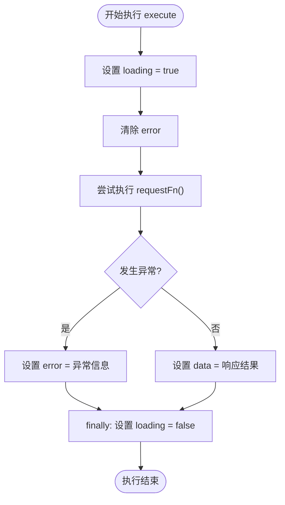
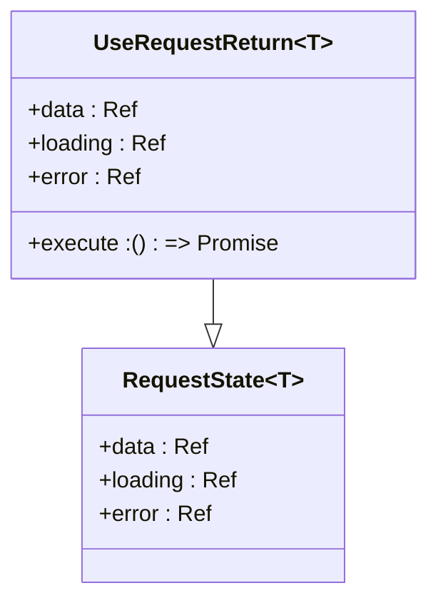
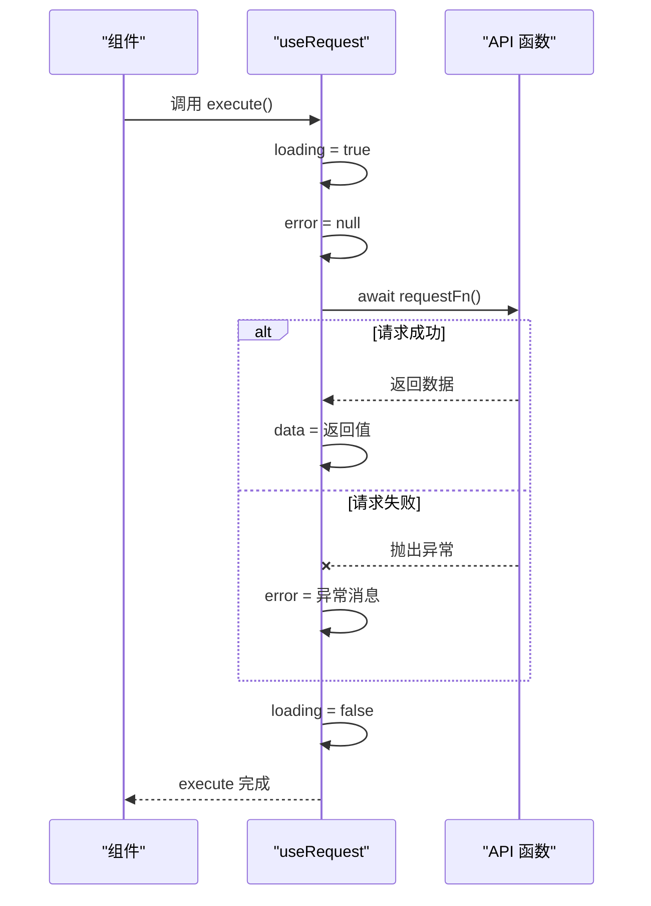
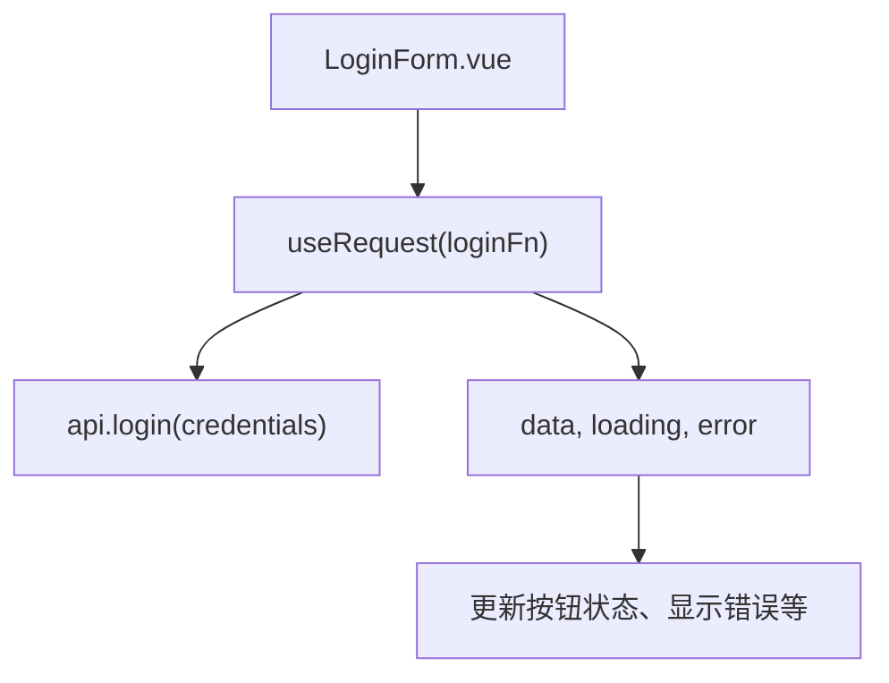
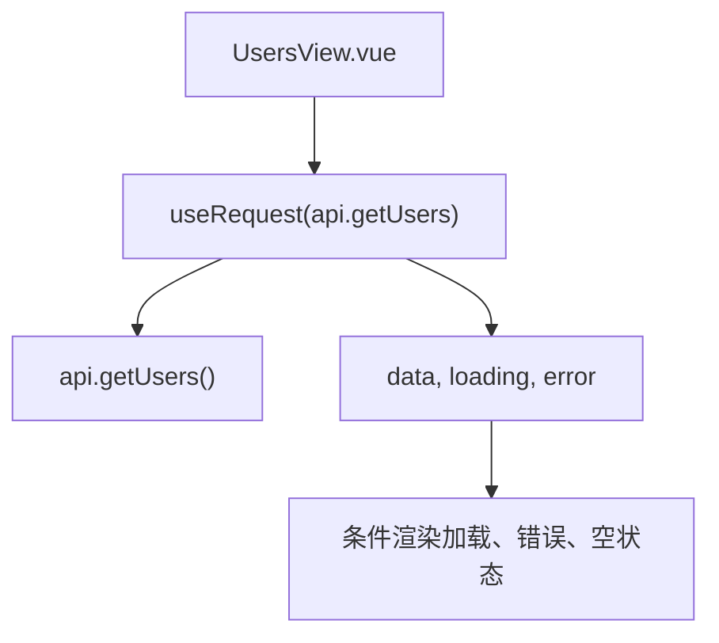
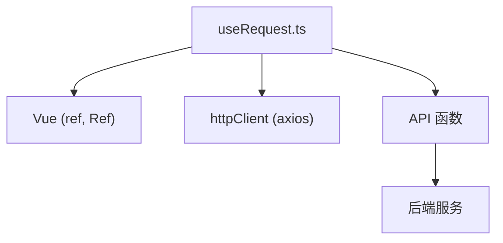

# 请求状态管理

<cite>
**本文档引用的文件**
- [useRequest.ts](file://apps/frontend/src/composables/useRequest.ts)
- [api.ts](file://apps/frontend/src/api/index.ts)
- [users.ts](file://apps/frontend/src/stores/users.ts)
- [LoginForm.vue](file://apps/frontend/src/components/LoginForm.vue)
- [UsersView.vue](file://apps/frontend/src/views/UsersView.vue)
</cite>

## 目录
1. [简介](#简介)
2. [核心组件](#核心组件)
3. [架构概述](#架构概述)
4. [详细组件分析](#详细组件分析)
5. [依赖分析](#依赖分析)
6. [性能考虑](#性能考虑)
7. [故障排除指南](#故障排除指南)
8. [结论](#结论)

## 简介
`useRequest` 是一个组合式函数（Composable），用于在 Vue 应用中统一管理异步请求的状态。它封装了常见的加载状态（loading）、响应数据（data）和错误信息（error）的响应式逻辑，使组件能够以声明式的方式处理 API 调用。该 Hook 特别适用于登录、用户创建等需要与后端交互的场景，通过将请求逻辑与 UI 逻辑分离，提升了代码的可维护性和用户体验的一致性。

## 核心组件

`useRequest` 组合式函数是前端应用中请求状态管理的核心。它接收一个返回 Promise 的异步函数作为参数，并返回包含 `data`、`loading`、`error` 状态以及 `execute` 执行方法的对象。这种设计使得任何 API 调用都可以被轻松地集成到组件中，而无需重复编写状态管理代码。

**Section sources**
- [useRequest.ts](file://apps/frontend/src/composables/useRequest.ts#L1-L43)

## 架构概述

`useRequest` 的设计遵循了 Vue 的组合式 API 原则，通过 `ref` 创建响应式状态，并利用 `async/await` 处理异步逻辑。其主要职责包括：
- 在请求开始时设置 `loading` 为 `true`
- 清除之前的错误信息
- 执行传入的请求函数并捕获结果或异常
- 将响应数据赋值给 `data`，或将错误信息赋值给 `error`
- 无论成功或失败，最终都将 `loading` 设置为 `false`

这一流程确保了 UI 能够准确反映请求的当前状态，从而提供良好的用户反馈。

**Diagram sources**
- [useRequest.ts](file://apps/frontend/src/composables/useRequest.ts#L23-L35)

## 详细组件分析

### useRequest 组合式函数分析

`useRequest` 是一个泛型函数，支持任意类型的响应数据。其返回的对象包含了四个关键属性：

- `data`: 响应数据的响应式引用，初始值为 `null`
- `loading`: 表示请求是否正在进行的布尔值
- `error`: 存储错误信息的字符串引用，初始为 `null`
- `execute`: 触发请求的异步函数

当调用 `execute` 时，会自动管理整个请求周期的状态变化，组件只需监听这些状态即可更新 UI。

#### 类型定义与接口

**Diagram sources**
- [useRequest.ts](file://apps/frontend/src/composables/useRequest.ts#L6-L10)

#### 请求执行流程

**Diagram sources**
- [useRequest.ts](file://apps/frontend/src/composables/useRequest.ts#L23-L35)

**Section sources**
- [useRequest.ts](file://apps/frontend/src/composables/useRequest.ts#L1-L43)

### 实际使用示例分析

虽然项目中目前主要使用 Pinia store 来管理状态（如 `useAuthStore` 和 `useUsersStore`），但 `useRequest` 提供了一种更灵活的请求管理模式，可用于替代或补充现有的状态管理方式。

#### 登录场景中的潜在应用
在 `LoginForm.vue` 中，当前通过 `authStore.login()` 直接处理登录逻辑。若采用 `useRequest`，可将登录请求解耦：

**Diagram sources**
- [LoginForm.vue](file://apps/frontend/src/components/LoginForm.vue#L23-L28)
- [auth.ts](file://apps/frontend/src/stores/auth.ts#L25-L40)

#### 用户列表加载场景
在 `UsersView.vue` 中，通过 `usersStore.fetchUsers()` 加载用户列表。使用 `useRequest` 可以简化 store 中的逻辑：

**Diagram sources**
- [UsersView.vue](file://apps/frontend/src/views/UsersView.vue#L13)
- [users.ts](file://apps/frontend/src/stores/users.ts#L20-L32)
- [api.ts](file://apps/frontend/src/api/index.ts#L65-L68)

**Section sources**
- [UsersView.vue](file://apps/frontend/src/views/UsersView.vue#L1-L67)
- [users.ts](file://apps/frontend/src/stores/users.ts#L1-L41)

## 依赖分析

`useRequest` 的实现依赖于 Vue 的响应式系统（`ref`），并可以与项目中的 `httpClient`（基于 Axios）无缝集成。它不依赖于特定的状态管理库（如 Pinia），因此具有很高的可复用性。

**Diagram sources**
- [useRequest.ts](file://apps/frontend/src/composables/useRequest.ts#L1)
- [api.ts](file://apps/frontend/src/api/index.ts#L7)

**Section sources**
- [useRequest.ts](file://apps/frontend/src/composables/useRequest.ts#L1-L43)
- [api.ts](file://apps/frontend/src/api/index.ts#L1-L91)

## 性能考虑

`useRequest` 通过封装重复的状态管理逻辑，减少了组件中的样板代码，提高了开发效率。由于其轻量级设计，不会引入额外的性能开销。建议在以下场景中使用以优化性能和可维护性：
- 避免重复请求：可在 `execute` 执行前检查 `loading` 状态
- 处理并发调用：可通过返回的 `execute` 函数控制请求的触发时机
- 统一错误处理：集中处理网络异常和业务错误，提升用户体验

## 故障排除指南

使用 `useRequest` 时可能遇到的问题及解决方案：

- **请求未触发**：确保调用了 `execute` 函数
- **状态未更新**：检查是否正确使用了响应式引用（`.value`）
- **错误信息不明确**：确认 API 函数抛出的错误为 `Error` 实例
- **类型推断失败**：显式指定泛型类型，如 `useRequest<User[]>(api.getUsers)`

**Section sources**
- [useRequest.ts](file://apps/frontend/src/composables/useRequest.ts#L27-L32)

## 结论

`useRequest` 是一个简洁而强大的组合式函数，有效解决了前端开发中异步请求状态管理的常见痛点。通过封装加载、数据和错误状态，它使组件逻辑更加清晰，提升了代码的可读性和可维护性。尽管当前项目主要依赖 Pinia 进行状态管理，但 `useRequest` 提供了一种更细粒度、更灵活的替代方案，特别适合于独立的、一次性的 API 调用场景。建议在新功能开发中推广使用该 Hook，以实现更一致的请求处理模式。