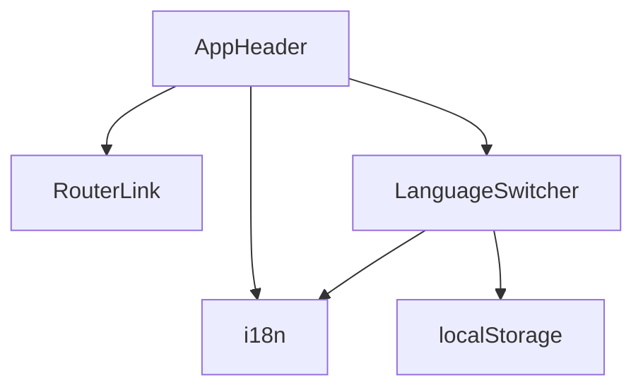
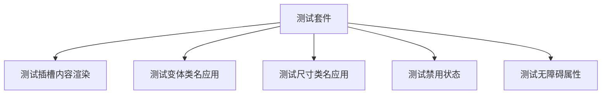

# UI 组件体系

<cite>
**本文档引用的文件**  
- [Button.vue](file://apps/frontend/src/components/ui/button/Button.vue)
- [index.ts](file://apps/frontend/src/components/ui/button/index.ts)
- [AppHeader.vue](file://apps/frontend/src/components/AppHeader.vue)
- [utils.ts](file://apps/frontend/src/lib/utils.ts)
- [components.json](file://apps/frontend/components.json)
- [tailwind.config.js](file://apps/frontend/tailwind.config.js)
- [main.css](file://apps/frontend/src/styles/main.css)
- [LanguageSwitcher.vue](file://apps/frontend/src/components/LanguageSwitcher.vue)
- [UserCard.vue](file://apps/frontend/src/components/UserCard.vue)
- [LoginForm.vue](file://apps/frontend/src/components/LoginForm.vue)
</cite>

## 目录
1. [简介](#简介)
2. [项目结构与组件系统](#项目结构与组件系统)
3. [shadcn-vue 组件库集成](#shadcn-vue-组件库集成)
4. [核心工具函数：cn()](#核心工具函数：cn)
5. [基础组件实现：Button](#基础组件实现：button)
6. [业务组件实现：AppHeader](#业务组件实现：appheader)
7. [组件开发规范](#组件开发规范)
8. [无障碍支持与响应式设计](#无障碍支持与响应式设计)
9. [主题与样式变量配置](#主题与样式变量配置)
10. [测试策略](#测试策略)

## 简介
本项目采用基于 shadcn-vue 的 UI 组件系统，构建了一套现代化、可复用的前端组件架构。系统结合了 Vue 3 的组合式 API、Tailwind CSS 实用类系统以及 shadcn-vue 的设计模式，实现了高度可定制且语义化的用户界面。本文档详细说明了组件系统的架构、开发规范和最佳实践。

## 项目结构与组件系统
项目采用分层的组件组织结构，将基础 UI 组件与业务组件分离，确保代码的可维护性和可复用性。

```mermaid
graph TD
A[组件系统] --> B[基础 UI 组件]
A --> C[业务组件]
B --> D[ui/目录]
D --> E[Button]
D --> F[Input]
D --> G[Card]
C --> H[AppHeader]
C --> I[UserCard]
C --> J[LoginForm]
A --> K[工具函数]
K --> L[cn()]
K --> M[cva]
```

**Diagram sources**  
- [components.json](file://apps/frontend/components.json#L1-L22)
- [project_structure](file://#L1-L200)

**Section sources**  
- [components.json](file://apps/frontend/components.json#L1-L22)

## shadcn-vue 组件库集成
项目通过 shadcn-vue 工具链集成了一套现代化的 UI 组件库，提供了开箱即用的可访问性、主题支持和响应式设计。

### 组件添加流程
使用 `npx shadcn-vue@latest add` 命令可以轻松添加新的 UI 组件：

```bash
npx shadcn-vue@latest add button
npx shadcn-vue@latest add input
npx shadcn-vue@latest add card
```

该命令会：
1. 自动安装所需的依赖包
2. 在 `ui/` 目录下创建组件文件
3. 配置正确的 TypeScript 类型
4. 设置与项目一致的样式变量

### 组件配置文件
`components.json` 文件定义了 shadcn-vue 的配置选项，包括样式主题、TypeScript 支持、Tailwind 配置等。

```json
{
  "$schema": "https://shadcn-vue.com/schema.json",
  "style": "new-york",
  "typescript": true,
  "tailwind": {
    "config": "tailwind.config.js",
    "css": "src/styles/main.css",
    "baseColor": "zinc",
    "cssVariables": true,
    "prefix": ""
  },
  "iconLibrary": "lucide",
  "aliases": {
    "components": "@/components",
    "utils": "@/lib/utils",
    "ui": "@/components/ui",
    "lib": "@/lib",
    "composables": "@/composables"
  }
}
```

**Section sources**  
- [components.json](file://apps/frontend/components.json#L1-L22)

## 核心工具函数：cn
`cn()` 函数是项目中用于合并和处理 Tailwind CSS 类名的核心工具函数，解决了类名冲突和条件渲染的问题。

### 实现原理
`cn()` 函数基于 `clsx` 和 `tailwind-merge` 两个库构建，提供了强大的类名处理能力。

```mermaid
flowchart TD
Start([cn() 调用]) --> ProcessInputs["处理输入参数<br/>(字符串、对象、数组)"]
ProcessInputs --> MergeClasses["使用 clsx 合并类名"]
MergeClasses --> ResolveConflicts["使用 tailwind-merge 解决冲突"]
ResolveConflicts --> ReturnResult["返回优化后的类名字符串"]
ReturnResult --> End([函数返回])
```

**Diagram sources**  
- [utils.ts](file://apps/frontend/src/lib/utils.ts#L1-L8)

### 功能特性
- **智能合并**：自动合并重复的实用类，保留最具体的规则
- **冲突解决**：当出现冲突的类名时（如 `px-2` 和 `px-4`），优先保留后面的值
- **条件支持**：支持布尔条件来动态包含或排除类名
- **类型安全**：提供完整的 TypeScript 类型定义

**Section sources**  
- [utils.ts](file://apps/frontend/src/lib/utils.ts#L1-L8)

## 基础组件实现：Button
Button 组件是项目中最基础的交互元素之一，展示了 shadcn-vue 组件的设计模式。

### 组件结构
```mermaid
classDiagram
class Button {
+variant : ButtonVariants['variant']
+size : ButtonVariants['size']
+class : HTMLAttributes['class']
+as : string
+asChild : boolean
}
class buttonVariants {
+cva()
+variants : {variant, size}
+defaultVariants : {variant, size}
}
Button --> buttonVariants : "使用变体"
Button --> cn : "合并类名"
Button --> Primitive : "渲染基础元素"
```

**Diagram sources**  
- [Button.vue](file://apps/frontend/src/components/ui/button/Button.vue#L1-L29)
- [index.ts](file://apps/frontend/src/components/ui/button/index.ts#L1-L37)

### 变体系统
通过 `class-variance-authority` (cva) 库定义了按钮的变体系统，支持多种样式组合。

```typescript
export const buttonVariants = cva(
  'inline-flex items-center justify-center gap-2 whitespace-nowrap rounded-md text-sm font-medium transition-colors focus-visible:outline-none focus-visible:ring-1 focus-visible:ring-ring disabled:pointer-events-none disabled:opacity-50 [&_svg]:pointer-events-none [&_svg]:size-4 [&_svg]:shrink-0',
  {
    variants: {
      variant: {
        default: 'bg-primary text-primary-foreground shadow hover:bg-primary/90',
        destructive: 'bg-destructive text-destructive-foreground shadow-sm hover:bg-destructive/90',
        outline: 'border border-input bg-background shadow-sm hover:bg-accent hover:text-accent-foreground',
        secondary: 'bg-secondary text-secondary-foreground shadow-sm hover:bg-secondary/80',
        ghost: 'hover:bg-accent hover:text-accent-foreground',
        link: 'text-primary underline-offset-4 hover:underline',
      },
      size: {
        default: 'h-9 px-4 py-2',
        xs: 'h-7 rounded px-2',
        sm: 'h-8 rounded-md px-3 text-xs',
        lg: 'h-10 rounded-md px-8',
        icon: 'h-9 w-9',
        'icon-sm': 'size-8',
        'icon-lg': 'size-10',
      },
    },
    defaultVariants: {
      variant: 'default',
      size: 'default',
    },
  },
)
```

**Section sources**  
- [index.ts](file://apps/frontend/src/components/ui/button/index.ts#L6-L37)
- [Button.vue](file://apps/frontend/src/components/ui/button/Button.vue#L1-L29)

## 业务组件实现：AppHeader
AppHeader 是一个典型的业务组件，展示了如何组合基础组件构建复杂的用户界面。

### 组件关系


**Diagram sources**  
- [AppHeader.vue](file://apps/frontend/src/components/AppHeader.vue#L1-L25)
- [LanguageSwitcher.vue](file://apps/frontend/src/components/LanguageSwitcher.vue#L1-L34)

### 实现细节
AppHeader 组件实现了以下功能：
- 导航链接使用 Vue Router 的 `RouterLink` 组件
- 国际化支持通过 `vue-i18n` 实现
- 语言切换器组件嵌入在头部
- 响应式设计适配不同屏幕尺寸

**Section sources**  
- [AppHeader.vue](file://apps/frontend/src/components/AppHeader.vue#L1-L25)
- [LanguageSwitcher.vue](file://apps/frontend/src/components/LanguageSwitcher.vue#L1-L34)

## 组件开发规范
项目遵循严格的组件开发规范，确保代码的一致性和可维护性。

### 目录结构规范
所有 UI 组件必须放置在 `ui/` 目录下，遵循以下结构：
```
components/
  ui/
    component-name/
      ComponentName.vue
      index.ts
      ComponentName.spec.ts
```

### 变体定义规范
使用 `cva` 函数定义组件变体，确保样式的一致性和可复用性。

### Props 定义规范
- 使用 TypeScript 接口定义 Props
- 提供合理的默认值
- 使用 `withDefaults` 函数设置默认属性

### 事件通信规范
- 基础组件通过插槽（slot）和属性传递数据
- 业务组件可以通过事件或状态管理进行通信
- 遵循单向数据流原则

**Section sources**  
- [Button.vue](file://apps/frontend/src/components/ui/button/Button.vue#L1-L29)
- [index.ts](file://apps/frontend/src/components/ui/button/index.ts#L1-L37)
- [AppHeader.vue](file://apps/frontend/src/components/AppHeader.vue#L1-L25)

## 无障碍支持与响应式设计
项目高度重视无障碍支持和响应式设计，确保应用在各种设备和使用场景下的可用性。

### 无障碍特性
- 所有交互元素都有适当的 ARIA 属性
- 表单元素包含正确的标签和错误信息
- 键盘导航支持完整
- 颜色对比度符合 WCAG 标准

### 响应式设计
- 使用 Tailwind CSS 的响应式前缀（sm, md, lg, xl）
- 移动优先的设计理念
- 弹性布局和网格系统
- 触摸友好的交互元素尺寸

**Section sources**  
- [LoginForm.vue](file://apps/frontend/src/components/LoginForm.vue#L1-L99)
- [AppHeader.vue](file://apps/frontend/src/components/AppHeader.vue#L1-L25)

## 主题与样式变量配置
项目通过 CSS 变量实现了灵活的主题系统，支持深色模式和自定义主题。

### 主题变量
在 `main.css` 文件中定义了完整的主题变量体系：

```css
:root {
  --background: 0 0% 100%;
  --foreground: 240 10% 3.9%;
  --primary: 240 5.9% 10%;
  --primary-foreground: 0 0% 98%;
  /* 其他变量... */
}

.dark {
  --background: 240 10% 3.9%;
  --foreground: 0 0% 98%;
  --primary: 0 0% 98%;
  --primary-foreground: 240 5.9% 10%;
  /* 深色模式变量... */
}
```

### Tailwind 配置
Tailwind CSS 配置文件将这些 CSS 变量映射到实用类中：

```javascript
theme: {
  extend: {
    colors: {
      primary: {
        DEFAULT: 'hsl(var(--primary))',
        foreground: 'hsl(var(--primary-foreground))',
      },
      // 其他颜色...
    }
  }
}
```

**Diagram sources**  
- [main.css](file://apps/frontend/src/styles/main.css#L1-L71)
- [tailwind.config.js](file://apps/frontend/tailwind.config.js#L1-L108)

**Section sources**  
- [main.css](file://apps/frontend/src/styles/main.css#L1-L71)
- [tailwind.config.js](file://apps/frontend/tailwind.config.js#L1-L108)

## 测试策略
项目为关键组件提供了全面的测试覆盖，确保组件的稳定性和可靠性。

### 单元测试
使用 Vitest 和 Vue Test Utils 进行组件测试：



**Diagram sources**  
- [Button.spec.ts](file://apps/frontend/src/components/ui/button/Button.spec.ts#L1-L39)
- [utils.spec.ts](file://apps/frontend/src/lib/utils.spec.ts#L1-L22)

### 测试覆盖范围
- Button 组件：验证插槽内容、变体应用、尺寸设置
- cn 工具函数：验证类名合并、条件处理、冲突解决
- 业务组件：验证数据绑定、事件处理、国际化支持

**Section sources**  
- [Button.spec.ts](file://apps/frontend/src/components/ui/button/Button.spec.ts#L1-L39)
- [utils.spec.ts](file://apps/frontend/src/lib/utils.spec.ts#L1-L22)
- [UserCard.vue](file://apps/frontend/src/components/UserCard.vue#L1-L54)