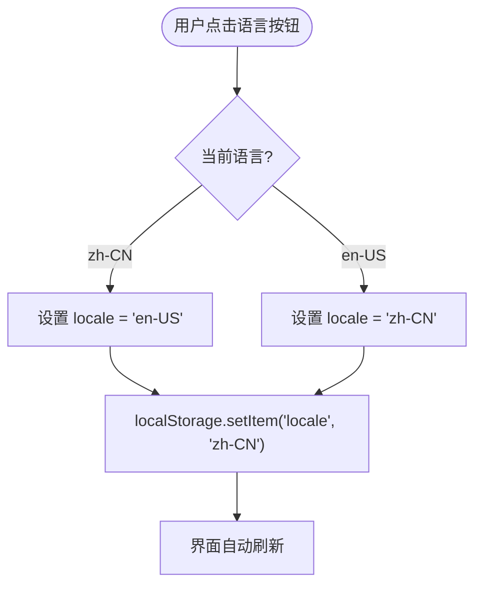

# 业务组件

<cite>
**本文档中引用的文件**  
- [AppHeader.vue](file://apps/frontend/src/components/AppHeader.vue)
- [LanguageSwitcher.vue](file://apps/frontend/src/components/LanguageSwitcher.vue)
- [UserCard.vue](file://apps/frontend/src/components/UserCard.vue)
- [LoginForm.vue](file://apps/frontend/src/components/LoginForm.vue)
- [auth.ts](file://apps/frontend/src/stores/auth.ts)
- [Button.vue](file://apps/frontend/src/components/ui/button/Button.vue)
- [i18n/index.ts](file://apps/frontend/src/i18n/index.ts)
- [locales/zh-CN.ts](file://apps/frontend/src/i18n/locales/zh-CN.ts)
- [locales/en-US.ts](file://apps/frontend/src/i18n/locales/en-US.ts)
- [api/index.ts](file://apps/frontend/src/api/index.ts)
- [auth.schema.ts](file://packages/shared/src/schemas/auth.schema.ts)
</cite>

## 目录
1. [介绍](#介绍)
2. [项目结构](#项目结构)
3. [核心业务组件](#核心业务组件)
4. [AppHeader 组件体系](#appheader-组件体系)
5. [用户状态与认证流程](#用户状态与认证流程)
6. [国际化支持机制](#国际化支持机制)
7. [组件通信与状态管理](#组件通信与状态管理)
8. [可访问性与响应式设计](#可访问性与响应式设计)
9. [组件复用与扩展原则](#组件复用与扩展原则)

## 介绍
本项目采用 Vue 3 + TypeScript + Vite 构建前端，结合 Pinia 状态管理、Vue I18n 国际化、Vue Router 路由等技术栈，实现了一套完整的业务组件体系。文档以 `AppHeader` 为核心示例，深入解析其如何组合基础 UI 组件构建复合界面，并展示组件间通信、状态管理、国际化、可访问性等关键设计模式。

**Section sources**
- [App.vue](file://apps/frontend/src/App.vue#L1-L14)
- [AppHeader.vue](file://apps/frontend/src/components/AppHeader.vue#L1-L25)

## 项目结构
项目采用 Monorepo 架构，包含前端、后端和共享模块。前端组件分为基础 UI 组件（位于 `ui/` 目录）和业务组件（位于 `components/` 根目录），通过模块化设计实现高内聚、低耦合。


**Diagram sources**
- [App.vue](file://apps/frontend/src/App.vue#L1-L14)
- [AppHeader.vue](file://apps/frontend/src/components/AppHeader.vue#L1-L25)
- [LoginForm.vue](file://apps/frontend/src/components/LoginForm.vue#L1-L99)
- [UserCard.vue](file://apps/frontend/src/components/UserCard.vue#L1-L54)

**Section sources**
- [App.vue](file://apps/frontend/src/App.vue#L1-L14)
- [AppHeader.vue](file://apps/frontend/src/components/AppHeader.vue#L1-L25)

## 核心业务组件
项目中的核心业务组件包括 `AppHeader`、`LoginForm` 和 `UserCard`，它们分别承担导航控制、用户认证和用户信息展示的职责。这些组件通过组合基础 UI 组件（如 `Button`）并集成状态管理与国际化能力，形成可复用的业务单元。

**Section sources**
- [AppHeader.vue](file://apps/frontend/src/components/AppHeader.vue#L1-L25)
- [LoginForm.vue](file://apps/frontend/src/components/LoginForm.vue#L1-L99)
- [UserCard.vue](file://apps/frontend/src/components/UserCard.vue#L1-L54)

## AppHeader 组件体系
`AppHeader` 是应用的全局导航组件，负责展示品牌标识、主导航链接和语言切换功能。它通过组合多个基础组件实现复合界面。

### 组件构成与职责划分
`AppHeader` 由以下部分构成：
- 品牌 Logo 与首页链接
- 主导航菜单（首页、用户列表）
- 语言切换器（LanguageSwitcher）

```mermaid
classDiagram
class AppHeader {
+RouterLink to="/"
+RouterLink to="/users"
+LanguageSwitcher
}
class LanguageSwitcher {
+Array languages
+Function switchLocale(code)
+localStorage.setItem('locale', code)
}
AppHeader --> LanguageSwitcher : 包含
LanguageSwitcher --> "vue-i18n" : 使用 locale
```

**Diagram sources**
- [AppHeader.vue](file://apps/frontend/src/components/AppHeader.vue#L1-L25)
- [LanguageSwitcher.vue](file://apps/frontend/src/components/LanguageSwitcher.vue#L1-L34)

### Props 数据传递与事件发射
`AppHeader` 本身不接收外部 Props，也不发射事件，作为顶层布局组件独立运作。其子组件 `LanguageSwitcher` 通过 `useI18n` 钩子直接操作全局语言状态，实现语言切换。

**Section sources**
- [AppHeader.vue](file://apps/frontend/src/components/AppHeader.vue#L1-L25)
- [LanguageSwitcher.vue](file://apps/frontend/src/components/LanguageSwitcher.vue#L1-L34)

### 导航逻辑实现
导航使用 Vue Router 的 `RouterLink` 组件实现声明式路由跳转。通过 `useI18n` 获取国际化文本，确保导航项显示语言与当前 locale 一致。


**Diagram sources**
- [AppHeader.vue](file://apps/frontend/src/components/AppHeader.vue#L1-L25)
- [router/index.ts](file://apps/frontend/src/router/index.ts#L1-L44)

## 用户状态与认证流程
用户认证流程由 `LoginForm` 组件发起，通过 Pinia Store 与 API 客户端协同完成。

### LoginForm 与 Pinia Store 协同
`LoginForm` 使用 `vee-validate` 进行表单验证，集成 `@vee-validate/zod` 以共享 `LoginSchema` 实现前后端统一验证规则。提交后调用 `useAuthStore().login()` 方法处理认证逻辑。


**Diagram sources**
- [LoginForm.vue](file://apps/frontend/src/components/LoginForm.vue#L1-L99)
- [auth.ts](file://apps/frontend/src/stores/auth.ts#L1-L97)
- [api/index.ts](file://apps/frontend/src/api/index.ts#L1-L92)

### 状态管理集成模式
`useAuthStore` 使用 Pinia 管理认证状态（token、user、loading、error），并通过 `persist` 配置持久化 token。组件通过 `useAuthStore()` 订阅状态变化，实现响应式更新。

**Section sources**
- [auth.ts](file://apps/frontend/src/stores/auth.ts#L1-L97)
- [LoginForm.vue](file://apps/frontend/src/components/LoginForm.vue#L1-L99)

## 国际化支持机制
项目使用 `vue-i18n` 实现多语言支持，语言偏好持久化至 `localStorage`，并根据浏览器语言自动选择默认语言。

### 语言切换实现
`LanguageSwitcher` 组件读取 `useI18n().locale` 值，提供中英文切换按钮。切换时更新 `locale.value` 并保存至 `localStorage`，触发全局界面语言更新。



**Diagram sources**
- [LanguageSwitcher.vue](file://apps/frontend/src/components/LanguageSwitcher.vue#L1-L34)
- [i18n/index.ts](file://apps/frontend/src/i18n/index.ts#L1-L28)

### 多语言资源配置
项目在 `i18n/locales/` 目录下定义 `zh-CN.ts` 和 `en-US.ts` 语言包，包含所有界面文本。通过 `createI18n` 注册多语言实例，支持动态加载与 fallback 机制。

**Section sources**
- [i18n/index.ts](file://apps/frontend/src/i18n/index.ts#L1-L28)
- [locales/zh-CN.ts](file://apps/frontend/src/i18n/locales/zh-CN.ts#L1-L42)
- [locales/en-US.ts](file://apps/frontend/src/i18n/locales/en-US.ts#L1-L42)

## 组件通信与状态管理
业务组件通过 Pinia Store 和 Composables 实现跨组件状态共享与通信，避免深层 prop 传递。

### 最佳实践
- 使用 Pinia Store 管理全局状态（如用户认证）
- 使用 Composables 封装可复用逻辑（如 `useRequest`）
- 通过事件总线或 emit 实现父子组件通信
- 利用 provide/inject 实现跨层级数据传递

**Section sources**
- [auth.ts](file://apps/frontend/src/stores/auth.ts#L1-L97)
- [useRequest.ts](file://apps/frontend/src/composables/useRequest.ts)
- [LoginForm.vue](file://apps/frontend/src/components/LoginForm.vue#L1-L99)

## 可访问性与响应式设计
所有组件均采用语义化 HTML 与 ARIA 标签提升可访问性，并使用 Tailwind CSS 实现响应式布局。

### 可访问性实现
- 表单字段使用 `<label for="">` 关联
- 按钮和交互元素提供键盘支持
- 错误信息通过 `aria-live` 区域播报
- 使用 `sr-only` 类隐藏仅视觉元素

### 响应式适配方案
- 使用 Tailwind 的 `sm:`, `md:`, `lg:` 断点类
- 容器采用 `container mx-auto px-4` 响应式宽度
- 导航栏在小屏下可折叠（当前未实现，但结构支持）

**Section sources**
- [LoginForm.vue](file://apps/frontend/src/components/LoginForm.vue#L1-L99)
- [AppHeader.vue](file://apps/frontend/src/components/AppHeader.vue#L1-L25)
- [tailwind.config.js](file://apps/frontend/tailwind.config.js)

## 组件复用与扩展原则
项目遵循组件设计最佳实践，确保高复用性与易扩展性。

### 复用指导
- 基础 UI 组件（如 Button）封装样式与交互，暴露 variant、size 等 Props
- 业务组件聚焦特定功能，通过 Props 接收数据，不直接依赖全局状态
- 使用 `defineProps` 明确接口契约，提升类型安全

### 扩展原则
- 通过插槽（slot）支持内容定制
- 组合优于继承，优先使用组件嵌套而非继承
- 共享 Schema（如 Zod）确保数据验证一致性
- 使用 Composables 抽离通用逻辑

**Section sources**
- [Button.vue](file://apps/frontend/src/components/ui/button/Button.vue#L1-L29)
- [LoginForm.vue](file://apps/frontend/src/components/LoginForm.vue#L1-L99)
- [auth.schema.ts](file://packages/shared/src/schemas/auth.schema.ts#L1-L94)