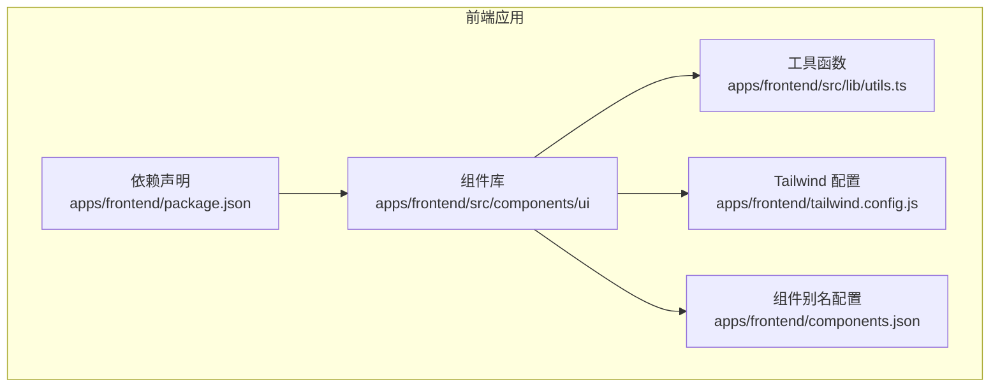
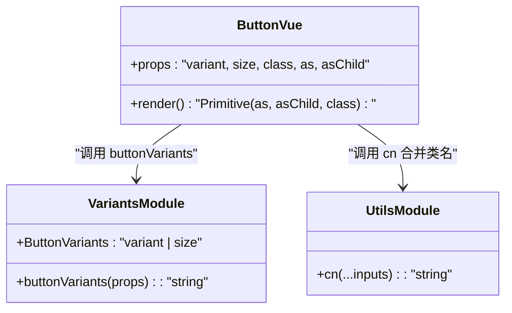
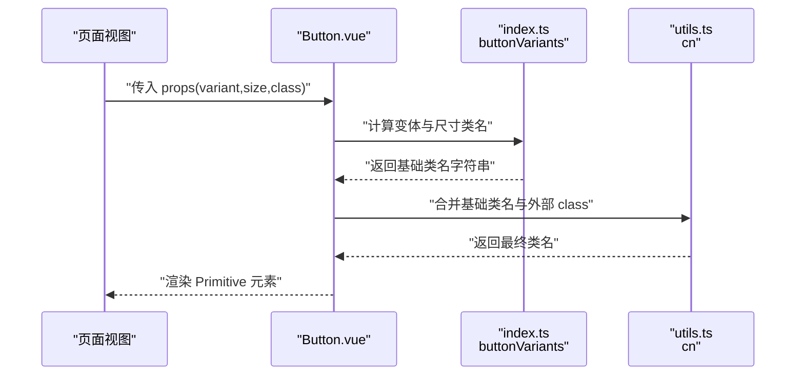
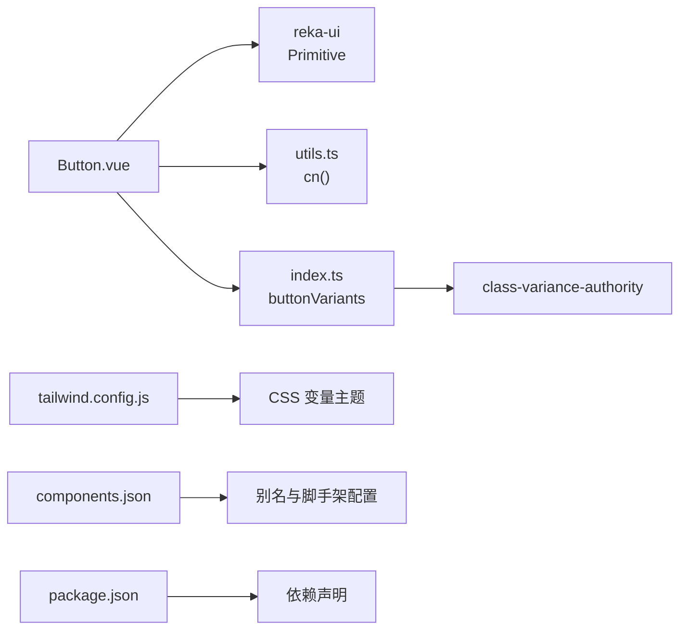

# 基础组件

<cite>
**本文引用的文件**
- [apps/frontend/src/components/ui/button/Button.vue](file://apps/frontend/src/components/ui/button/Button.vue)
- [apps/frontend/src/components/ui/button/index.ts](file://apps/frontend/src/components/ui/button/index.ts)
- [apps/frontend/src/components/ui/button/Button.spec.ts](file://apps/frontend/src/components/ui/button/Button.spec.ts)
- [apps/frontend/src/lib/utils.ts](file://apps/frontend/src/lib/utils.ts)
- [apps/frontend/tailwind.config.js](file://apps/frontend/tailwind.config.js)
- [apps/frontend/components.json](file://apps/frontend/components.json)
- [apps/frontend/package.json](file://apps/frontend/package.json)
- [apps/frontend/src/views/HomeView.vue](file://apps/frontend/src/views/HomeView.vue)
</cite>

## 目录
1. [简介](#简介)
2. [项目结构](#项目结构)
3. [核心组件](#核心组件)
4. [架构总览](#架构总览)
5. [详细组件分析](#详细组件分析)
6. [依赖关系分析](#依赖关系分析)
7. [性能考虑](#性能考虑)
8. [故障排查指南](#故障排查指南)
9. [结论](#结论)
10. [附录](#附录)

## 简介
本文件围绕基于 shadcn-vue 的基础 UI 组件实现进行系统化文档化，以 Button 组件为例，说明其如何通过 class-variance-authority 的 cva 定义样式变体，使用 cn() 工具函数合并 Tailwind CSS 类名，并支持无障碍属性（如 aria-*）与原生 HTML 属性透传。文档还覆盖组件目录结构规范（位于 ui/ 子目录）、TypeScript 类型定义、支持的尺寸（size）与变体（variant）等 Props 配置；提供使用 npx shadcn-vue@latest add button 添加新组件的完整流程；并说明如何自定义主题变量以适配项目设计系统；最后给出渲染性能优化建议与跨浏览器兼容性注意事项。

## 项目结构
前端工程采用多包工作区布局，UI 组件集中放置于 apps/frontend/src/components/ui 下，遵循“按功能域分层 + 组件库化”的组织方式：
- 组件统一置于 ui/ 子目录下，每个组件一个独立文件夹，包含组件实现、类型导出与测试用例
- 样式与主题变量由 Tailwind CSS 与 CSS 变量共同驱动
- 组件别名与工具函数在 components.json 中集中配置，便于脚手架工具生成与复用

图表来源
- [apps/frontend/src/components/ui/button/Button.vue](file://apps/frontend/src/components/ui/button/Button.vue#L1-L29)
- [apps/frontend/src/lib/utils.ts](file://apps/frontend/src/lib/utils.ts#L1-L8)
- [apps/frontend/tailwind.config.js](file://apps/frontend/tailwind.config.js#L1-L108)
- [apps/frontend/components.json](file://apps/frontend/components.json#L1-L22)
- [apps/frontend/package.json](file://apps/frontend/package.json#L1-L80)

章节来源
- [apps/frontend/src/components/ui/button/Button.vue](file://apps/frontend/src/components/ui/button/Button.vue#L1-L29)
- [apps/frontend/src/components/ui/button/index.ts](file://apps/frontend/src/components/ui/button/index.ts#L1-L37)
- [apps/frontend/src/lib/utils.ts](file://apps/frontend/src/lib/utils.ts#L1-L8)
- [apps/frontend/tailwind.config.js](file://apps/frontend/tailwind.config.js#L1-L108)
- [apps/frontend/components.json](file://apps/frontend/components.json#L1-L22)
- [apps/frontend/package.json](file://apps/frontend/package.json#L1-L80)

## 核心组件
本节聚焦 Button 组件的实现要点与使用方式，包括 Props 定义、变体与尺寸配置、类名合并策略以及无障碍与原生属性透传机制。

- Props 与类型
  - 继承自 reka-ui 的 PrimitiveProps，支持 as 与 as-child 等语义化标签映射
  - 支持 variant、size 与 class 等常用属性
  - 默认值：as 默认为 button，确保可点击元素的语义正确

- 样式变体与尺寸
  - 使用 cva 定义按钮变体与尺寸，提供默认变体与默认尺寸
  - 变体包括：default、destructive、outline、secondary、ghost、link
  - 尺寸包括：default、xs、sm、lg、icon、icon-sm、icon-lg

- 类名合并策略
  - 通过 cn() 合并 buttonVariants 计算出的基础类名与外部传入的 class
  - cn() 内部使用 clsx 与 tailwind-merge，避免重复与冲突类名

- 无障碍与原生属性透传
  - 组件内部使用 Primitive 元素，将 as/as-child 与所有原生属性透传到底层 DOM
  - 因此可直接使用 aria-*、data-* 等属性，无需额外封装

- 使用示例
  - 在页面中直接引入 Button 并设置 variant/size/class 等属性即可
  - 示例已在首页视图中展示多种变体的效果

章节来源
- [apps/frontend/src/components/ui/button/Button.vue](file://apps/frontend/src/components/ui/button/Button.vue#L1-L29)
- [apps/frontend/src/components/ui/button/index.ts](file://apps/frontend/src/components/ui/button/index.ts#L1-L37)
- [apps/frontend/src/lib/utils.ts](file://apps/frontend/src/lib/utils.ts#L1-L8)
- [apps/frontend/src/views/HomeView.vue](file://apps/frontend/src/views/HomeView.vue#L280-L306)

## 架构总览
下面的类图展示了 Button 组件与其样式变体定义之间的关系，以及工具函数在类名合并中的作用。

图表来源
- [apps/frontend/src/components/ui/button/Button.vue](file://apps/frontend/src/components/ui/button/Button.vue#L1-L29)
- [apps/frontend/src/components/ui/button/index.ts](file://apps/frontend/src/components/ui/button/index.ts#L1-L37)
- [apps/frontend/src/lib/utils.ts](file://apps/frontend/src/lib/utils.ts#L1-L8)

## 详细组件分析

### Button 组件实现与调用链
该流程展示了从组件渲染到最终类名合并的关键步骤。

图表来源
- [apps/frontend/src/components/ui/button/Button.vue](file://apps/frontend/src/components/ui/button/Button.vue#L1-L29)
- [apps/frontend/src/components/ui/button/index.ts](file://apps/frontend/src/components/ui/button/index.ts#L1-L37)
- [apps/frontend/src/lib/utils.ts](file://apps/frontend/src/lib/utils.ts#L1-L8)

章节来源
- [apps/frontend/src/components/ui/button/Button.vue](file://apps/frontend/src/components/ui/button/Button.vue#L1-L29)
- [apps/frontend/src/components/ui/button/index.ts](file://apps/frontend/src/components/ui/button/index.ts#L1-L37)
- [apps/frontend/src/lib/utils.ts](file://apps/frontend/src/lib/utils.ts#L1-L8)

### Props 与变体/尺寸配置
- Props
  - variant: 可选值来自 ButtonVariants，对应不同视觉风格
  - size: 可选值来自 ButtonVariants，对应不同尺寸规格
  - class: 外部传入的自定义类名，将与变体/尺寸类名合并
  - as/as-child: 由 PrimitiveProps 提供，用于语义化标签映射与子节点透传

- 变体与尺寸
  - 变体：default、destructive、outline、secondary、ghost、link
  - 尺寸：default、xs、sm、lg、icon、icon-sm、icon-lg
  - 默认值：variant/default，size/default

- 类名合并
  - 使用 cn() 对 buttonVariants 计算结果与外部 class 进行合并，避免冲突并保持简洁

章节来源
- [apps/frontend/src/components/ui/button/Button.vue](file://apps/frontend/src/components/ui/button/Button.vue#L1-L29)
- [apps/frontend/src/components/ui/button/index.ts](file://apps/frontend/src/components/ui/button/index.ts#L1-L37)
- [apps/frontend/src/lib/utils.ts](file://apps/frontend/src/lib/utils.ts#L1-L8)

### 目录结构规范与别名配置
- 目录规范
  - 所有 UI 组件位于 apps/frontend/src/components/ui/<组件名>/ 下
  - 每个组件包含：组件实现文件、类型导出文件、单元测试文件
  - 组件对外导出统一入口，便于按需引入与批量注册

- 别名与工具函数
  - components.json 中配置了 ui、utils、lib 等别名，便于脚手架工具生成代码时引用
  - utils.ts 中的 cn() 作为全局类名合并工具，贯穿所有组件

- 组件别名与工具函数
  - ui: "@/components/ui"
  - utils: "@/lib/utils"
  - components: "@/components"

章节来源
- [apps/frontend/src/components/ui/button/index.ts](file://apps/frontend/src/components/ui/button/index.ts#L1-L37)
- [apps/frontend/src/components/ui/button/Button.vue](file://apps/frontend/src/components/ui/button/Button.vue#L1-L29)
- [apps/frontend/components.json](file://apps/frontend/components.json#L1-L22)
- [apps/frontend/src/lib/utils.ts](file://apps/frontend/src/lib/utils.ts#L1-L8)

### 主题变量与 Tailwind 扩展
- 主题变量
  - Tailwind 配置中通过 CSS 变量扩展颜色、圆角等主题变量，组件样式通过 hsl(var(--xxx)) 引用
  - 组件变体中的颜色类名依赖这些变量，从而实现主题一致性

- 自定义主题
  - 可在 tailwind.config.js 中新增或修改颜色、圆角等变量，以适配项目设计系统
  - 组件无需改动即可受益于主题变更

章节来源
- [apps/frontend/tailwind.config.js](file://apps/frontend/tailwind.config.js#L1-L108)
- [apps/frontend/src/components/ui/button/index.ts](file://apps/frontend/src/components/ui/button/index.ts#L1-L37)

### 使用 npx shadcn-vue@latest add button 的完整流程
- 步骤概览
  - 在项目根目录执行添加命令，脚手架根据 components.json 的配置生成组件文件
  - 自动生成的文件将位于 apps/frontend/src/components/ui/button/ 下
  - 生成后可在业务组件中直接按需引入 Button 并使用

- 关键配置
  - components.json 中的 aliases、tailwind 配置与 iconLibrary 等字段决定生成行为与样式来源
  - 脚手架会读取这些配置，确保生成的组件与现有工具链一致

章节来源
- [apps/frontend/components.json](file://apps/frontend/components.json#L1-L22)
- [apps/frontend/package.json](file://apps/frontend/package.json#L1-L80)

### 无障碍与原生属性透传
- 无障碍属性
  - 通过 Primitive 元素透传 aria-*、data-* 等原生属性，无需额外封装
  - 组件默认 as='button'，确保可访问性语义正确

- 原生属性透传
  - as 与 as-child 支持语义化标签映射与子节点透传
  - 其他原生属性（如 type、disabled、formAction 等）可直接传递到底层 DOM

章节来源
- [apps/frontend/src/components/ui/button/Button.vue](file://apps/frontend/src/components/ui/button/Button.vue#L1-L29)

### 渲染性能与跨浏览器兼容性
- 性能优化建议
  - 合理使用变体与尺寸，避免在同一页面大量动态切换导致重排
  - 通过 cn() 合并类名，减少不必要的类名冲突与重复计算
  - 将 Button 作为组合基元使用，尽量避免在高频渲染场景中创建过多实例

- 跨浏览器兼容性
  - 组件依赖现代浏览器对 CSS 变量与类名合并的支持
  - 如需兼容旧版浏览器，建议在构建阶段启用 polyfill 或降级方案

章节来源
- [apps/frontend/src/lib/utils.ts](file://apps/frontend/src/lib/utils.ts#L1-L8)
- [apps/frontend/package.json](file://apps/frontend/package.json#L1-L80)

## 依赖关系分析
- 组件依赖
  - Button.vue 依赖 reka-ui 的 Primitive 用于语义化标签与属性透传
  - Button.vue 依赖 cn() 工具函数进行类名合并
  - index.ts 通过 cva 定义变体与尺寸，导出 ButtonVariants 类型

- 工具与配置
  - utils.ts 提供 cn()，内部使用 clsx 与 tailwind-merge
  - tailwind.config.js 通过 CSS 变量扩展主题
  - components.json 提供别名与脚手架配置

图表来源
- [apps/frontend/src/components/ui/button/Button.vue](file://apps/frontend/src/components/ui/button/Button.vue#L1-L29)
- [apps/frontend/src/components/ui/button/index.ts](file://apps/frontend/src/components/ui/button/index.ts#L1-L37)
- [apps/frontend/src/lib/utils.ts](file://apps/frontend/src/lib/utils.ts#L1-L8)
- [apps/frontend/tailwind.config.js](file://apps/frontend/tailwind.config.js#L1-L108)
- [apps/frontend/components.json](file://apps/frontend/components.json#L1-L22)
- [apps/frontend/package.json](file://apps/frontend/package.json#L1-L80)

章节来源
- [apps/frontend/src/components/ui/button/Button.vue](file://apps/frontend/src/components/ui/button/Button.vue#L1-L29)
- [apps/frontend/src/components/ui/button/index.ts](file://apps/frontend/src/components/ui/button/index.ts#L1-L37)
- [apps/frontend/src/lib/utils.ts](file://apps/frontend/src/lib/utils.ts#L1-L8)
- [apps/frontend/tailwind.config.js](file://apps/frontend/tailwind.config.js#L1-L108)
- [apps/frontend/components.json](file://apps/frontend/components.json#L1-L22)
- [apps/frontend/package.json](file://apps/frontend/package.json#L1-L80)

## 性能考虑
- 类名合并成本
  - cn() 使用 clsx 与 tailwind-merge，避免重复与冲突类名，降低运行时开销
- 变体与尺寸选择
  - 在同一页面中尽量复用相同变体/尺寸，减少样式切换带来的重绘
- 渲染策略
  - 将 Button 作为轻量级基元使用，避免在高频交互中频繁创建新实例
- 构建与打包
  - 通过按需引入与 Tree Shaking，减少未使用组件的体积

## 故障排查指南
- 测试用例参考
  - 插槽内容渲染：验证默认插槽是否正确显示
  - 变体类名应用：验证 variant 属性是否正确附加对应类名
  - 尺寸类名应用：验证 size 属性是否正确附加对应类名

- 常见问题定位
  - 类名冲突：检查是否同时传入了与变体冲突的 class
  - 样式不生效：确认 tailwind.config.js 中的主题变量是否正确配置
  - 无障碍属性无效：确认是否通过 Primitive 透传 aria-* 属性

章节来源
- [apps/frontend/src/components/ui/button/Button.spec.ts](file://apps/frontend/src/components/ui/button/Button.spec.ts#L1-L39)

## 结论
Button 组件通过 cva 定义清晰的样式变体与尺寸体系，结合 cn() 工具函数实现安全的类名合并，并借助 Primitive 实现无障碍与原生属性透传。其目录结构与别名配置遵循统一规范，便于脚手架工具生成与维护。通过合理使用主题变量与 Tailwind 扩展，可快速适配项目设计系统。在性能方面，建议控制变体/尺寸的多样性与实例数量，以获得更佳的渲染表现。

## 附录
- 组件别名与工具函数
  - ui: "@/components/ui"
  - utils: "@/lib/utils"
  - components: "@/components"
- 依赖项
  - class-variance-authority、clsx、tailwind-merge、reka-ui 等

章节来源
- [apps/frontend/components.json](file://apps/frontend/components.json#L1-L22)
- [apps/frontend/package.json](file://apps/frontend/package.json#L1-L80)