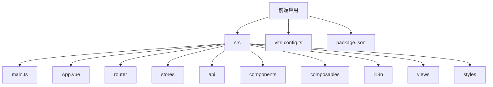
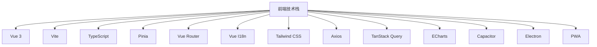
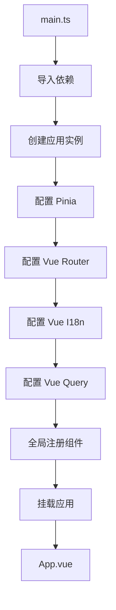
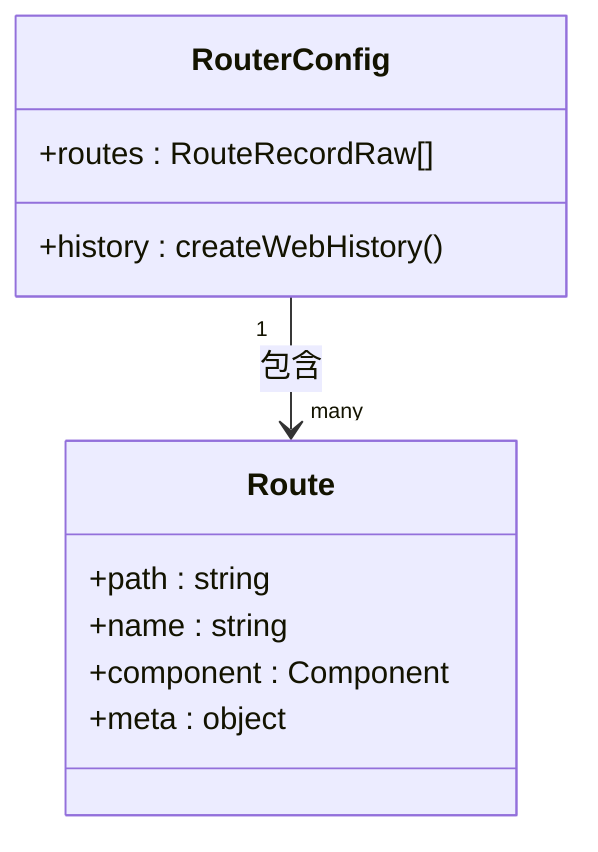
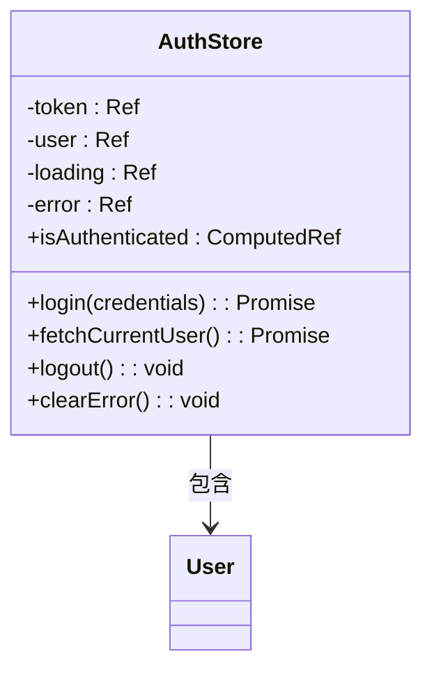
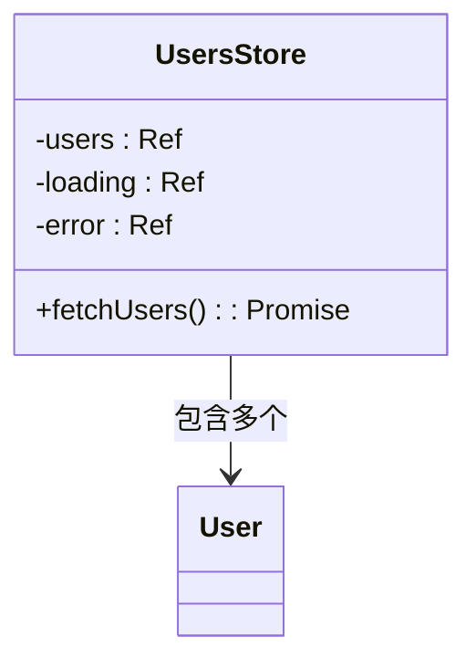
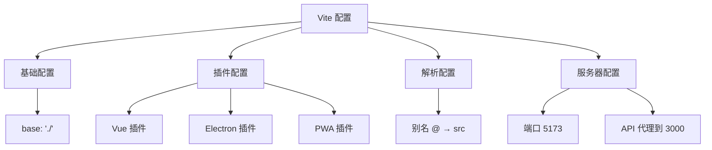
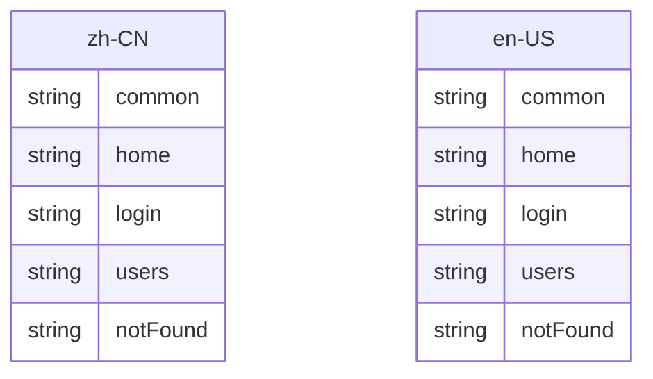
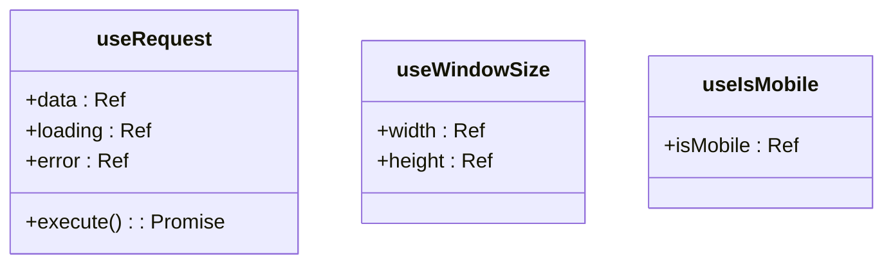
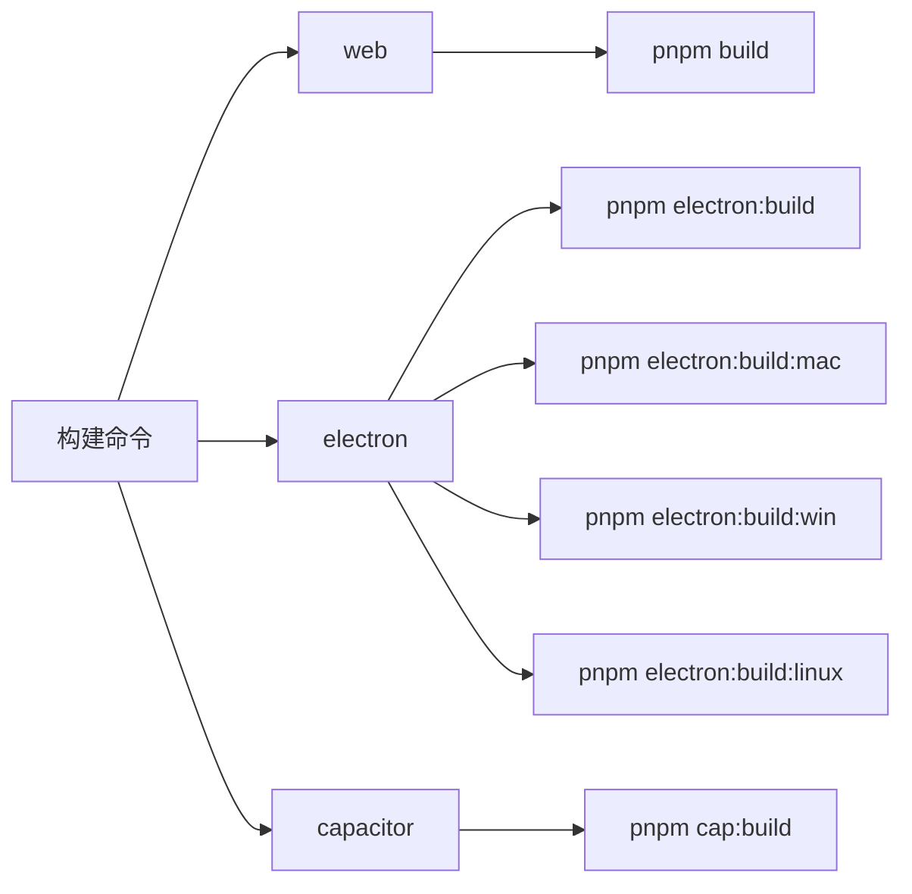

# 前端应用

<cite>
**本文档中引用的文件**  
- [main.ts](file://apps/frontend/src/main.ts)
- [App.vue](file://apps/frontend/src/App.vue)
- [vite.config.ts](file://apps/frontend/vite.config.ts)
- [router/index.ts](file://apps/frontend/src/router/index.ts)
- [stores/auth.ts](file://apps/frontend/src/stores/auth.ts)
- [stores/users.ts](file://apps/frontend/src/stores/users.ts)
- [i18n/index.ts](file://apps/frontend/src/i18n/index.ts)
- [api/index.ts](file://apps/frontend/src/api/index.ts)
- [package.json](file://apps/frontend/package.json)
</cite>

## 目录
1. [简介](#简介)
2. [项目结构](#项目结构)
3. [技术栈概述](#技术栈概述)
4. [应用启动流程](#应用启动流程)
5. [路由系统](#路由系统)
6. [状态管理](#状态管理)
7. [Vite 配置与开发特性](#vite-配置与开发特性)
8. [API 与请求处理](#api-与请求处理)
9. [国际化支持](#国际化支持)
10. [组合式 API 与可组合函数](#组合式-api-与可组合函数)
11. [构建与部署](#构建与部署)

## 简介

本项目是一个基于 Vue 3 和 Vite 构建的现代化前端应用，作为全栈 Monorepo 的一部分，集成了 Pinia 状态管理、Vue Router 路由系统、Vue I18n 国际化、TanStack Query 数据获取、ECharts 可视化等核心功能。项目支持多平台部署，包括 Web、PWA、Electron 桌面应用以及 Capacitor 移动应用。

**Section sources**
- [main.ts](file://apps/frontend/src/main.ts#L1-L57)
- [package.json](file://apps/frontend/package.json#L1-L80)

## 项目结构

前端项目位于 `apps/frontend` 目录下，采用模块化组织方式：

- `src/`：源代码目录
  - `api/`：API 接口定义与 HTTP 客户端
  - `components/`：UI 组件
  - `composables/`：可组合函数（Composables）
  - `i18n/`：国际化配置与语言包
  - `router/`：路由配置
  - `stores/`：Pinia 状态管理
  - `styles/`：全局样式
  - `views/`：页面视图组件
  - `main.ts`：应用入口
  - `App.vue`：根组件
- `vite.config.ts`：Vite 构建配置
- `package.json`：项目依赖与脚本



**Diagram sources**
- [main.ts](file://apps/frontend/src/main.ts#L1-L57)
- [vite.config.ts](file://apps/frontend/vite.config.ts#L1-L124)

**Section sources**
- [main.ts](file://apps/frontend/src/main.ts#L1-L57)
- [vite.config.ts](file://apps/frontend/vite.config.ts#L1-L124)

## 技术栈概述

本项目采用现代化的前端技术栈，核心包括：

- **Vue 3**：使用 Composition API 和 `<script setup>` 语法糖
- **Vite**：极速的开发服务器与构建工具
- **TypeScript**：提供类型安全
- **Pinia**：官方状态管理库，支持持久化
- **Vue Router**：路由管理
- **Vue I18n**：国际化支持
- **Tailwind CSS**：实用优先的 CSS 框架
- **Axios**：HTTP 客户端
- **TanStack Query**：服务端状态管理
- **ECharts**：数据可视化
- **Capacitor**：跨平台移动应用开发
- **Electron**：桌面应用开发
- **PWA**：渐进式 Web 应用支持



**Diagram sources**
- [package.json](file://apps/frontend/package.json#L29-L52)
- [vite.config.ts](file://apps/frontend/vite.config.ts#L1-L124)

**Section sources**
- [package.json](file://apps/frontend/package.json#L29-L52)

## 应用启动流程

应用的启动流程从 `main.ts` 入口文件开始，逐步初始化核心依赖并挂载到 DOM。

### 启动流程图



### 详细流程

1. **导入核心依赖**：导入 Vue、Pinia、Vue Router、Vue I18n 等核心库
2. **创建应用实例**：使用 `createApp(App)` 创建 Vue 应用实例
3. **配置状态管理**：创建 Pinia 实例并应用持久化插件
4. **配置路由**：安装 Vue Router
5. **配置国际化**：安装 Vue I18n
6. **配置查询管理**：配置 TanStack Query 客户端
7. **全局注册组件**：注册 ECharts 组件 `VChart`
8. **挂载应用**：调用 `app.mount('#app')` 将应用挂载到 DOM

**Section sources**
- [main.ts](file://apps/frontend/src/main.ts#L1-L57)

## 路由系统

路由系统由 Vue Router 驱动，定义了应用的主要导航路径。

### 路由配置



### 路由定义

- `/`：首页，同步加载 `HomeView.vue`
- `/login`：登录页，异步加载 `LoginView.vue`
- `/users`：用户列表页，异步加载 `UsersView.vue`
- `/:pathMatch(.*)*`：404 页面，异步加载 `NotFoundView.vue`

### 导航守卫

实现了全局前置守卫，用于自动更新页面标题：

```typescript
router.beforeEach((to) => {
  const title = to.meta.title as string
  document.title = title ? `${title} - My App` : 'My App'
})
```

**Section sources**
- [router/index.ts](file://apps/frontend/src/router/index.ts#L1-L44)
- [App.vue](file://apps/frontend/src/App.vue#L1-L14)

## 状态管理

状态管理采用 Pinia，定义了 `auth` 和 `users` 两个核心 store。

### 认证状态管理 (auth.ts)



**Diagram sources**
- [stores/auth.ts](file://apps/frontend/src/stores/auth.ts#L1-L97)

### 用户状态管理 (users.ts)



**Diagram sources**
- [stores/users.ts](file://apps/frontend/src/stores/users.ts#L1-L42)

### 持久化配置

`auth` store 使用 `pinia-plugin-persistedstate` 插件，仅持久化 `token` 字段：

```typescript
{
  persist: {
    paths: ['token']
  }
}
```

**Section sources**
- [stores/auth.ts](file://apps/frontend/src/stores/auth.ts#L1-L97)
- [stores/users.ts](file://apps/frontend/src/stores/users.ts#L1-L42)
- [main.ts](file://apps/frontend/src/main.ts#L34-L36)

## Vite 配置与开发特性

Vite 配置文件 `vite.config.ts` 提供了丰富的开发和构建功能。

### 核心配置



### 开发特性

- **开发服务器**：运行在 5173 端口
- **API 代理**：将 `/api` 请求代理到后端 `http://localhost:3000`
- **路径别名**：`@` 指向 `src` 目录
- **Electron 支持**：通过 `ELECTRON=true` 环境变量启用
- **PWA 支持**：集成 `vite-plugin-pwa`，支持离线访问和缓存
- **资源基础路径**：设置为 `./` 以支持 Capacitor 移动应用

**Section sources**
- [vite.config.ts](file://apps/frontend/vite.config.ts#L1-L124)
- [package.json](file://apps/frontend/package.json#L23-L27)

## API 与请求处理

API 层封装了与后端的通信逻辑。

### HTTP 客户端配置

```mermaid
classDiagram
class HttpClient {
+baseURL : '/api'
+timeout : 10000
+headers : {'Content-Type' : 'application/json'}
}
HttpClient --> RequestInterceptor : 拥有
HttpClient --> ResponseInterceptor : 拥有
```

### 请求拦截器

- **认证头**：自动添加 `Authorization` 头（来自 localStorage）
- **CSRF 保护**：为非 GET 请求添加 `X-XSRF-TOKEN` 头（来自 cookie）

### 响应拦截器

- **401 处理**：自动清除本地 token
- **错误传播**：统一处理后继续抛出

### API 接口

通过 `api` 对象暴露高层接口：

- `getUsers()`: 获取用户列表
- `getUser(id)`: 获取单个用户
- `createUser(userData)`: 创建用户

**Section sources**
- [api/index.ts](file://apps/frontend/src/api/index.ts#L1-L92)
- [stores/auth.ts](file://apps/frontend/src/stores/auth.ts#L3-L4)

## 国际化支持

国际化由 Vue I18n 驱动，支持中文和英文。

### 语言包结构



### 语言选择逻辑

1. 优先使用 `localStorage` 中存储的语言偏好
2. 其次根据浏览器语言判断（`zh` 开头为中文）
3. 默认为英文 (`en-US`)

**Section sources**
- [i18n/index.ts](file://apps/frontend/src/i18n/index.ts#L1-L28)
- [i18n/locales/zh-CN.ts](file://apps/frontend/src/i18n/locales/zh-CN.ts#L1-L42)
- [i18n/locales/en-US.ts](file://apps/frontend/src/i18n/locales/en-US.ts#L1-L42)

## 组合式 API 与可组合函数

项目充分利用 Vue 3 的组合式 API 和自定义可组合函数。

### 核心可组合函数



### 使用示例

- `useRequest`：封装通用的请求加载状态逻辑
- `useWindowSize`：响应式获取窗口尺寸
- `useIsMobile`：判断是否为移动设备

这些可组合函数提高了代码的复用性和可维护性。

**Section sources**
- [composables/useRequest.ts](file://apps/frontend/src/composables/useRequest.ts#L1-L44)
- [composables/useWindowSize.ts](file://apps/frontend/src/composables/useWindowSize.ts#L1-L35)

## 构建与部署

项目提供了完整的构建和部署脚本。

### 构建脚本



### 部署目标

- **Web**：标准的静态网站部署
- **PWA**：支持离线功能的渐进式 Web 应用
- **Electron**：跨平台桌面应用（macOS, Windows, Linux）
- **Capacitor**：iOS 和 Android 移动应用

**Section sources**
- [package.json](file://apps/frontend/package.json#L8-L27)
- [vite.config.ts](file://apps/frontend/vite.config.ts#L8-L124)