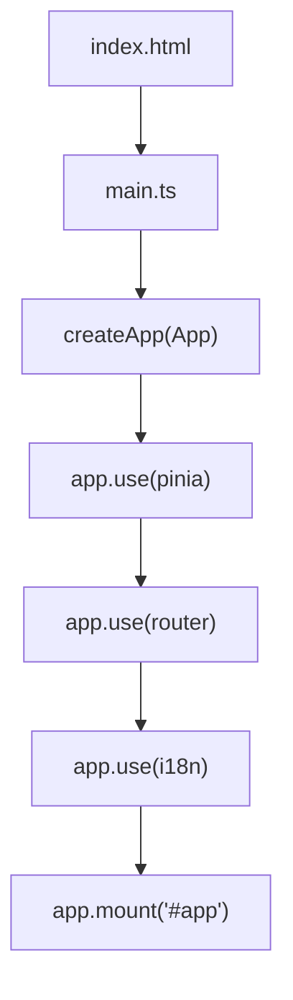
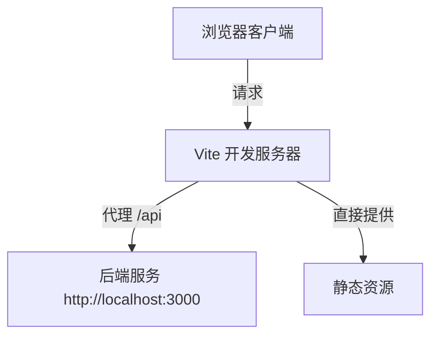
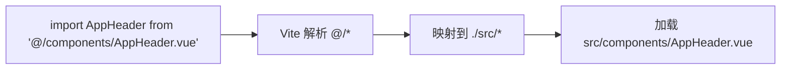
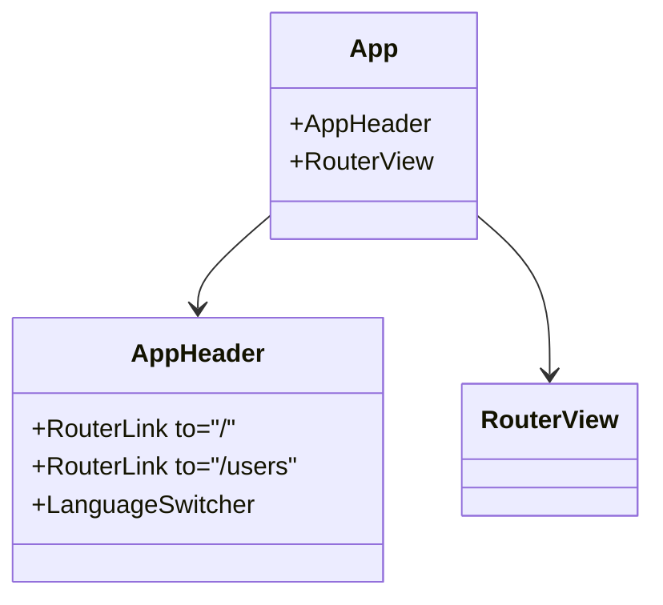
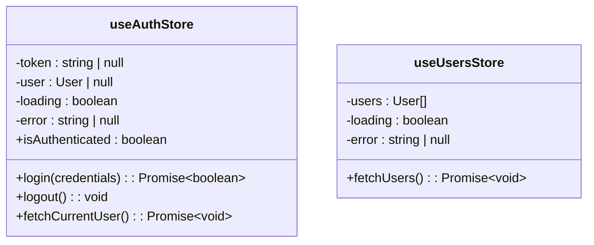
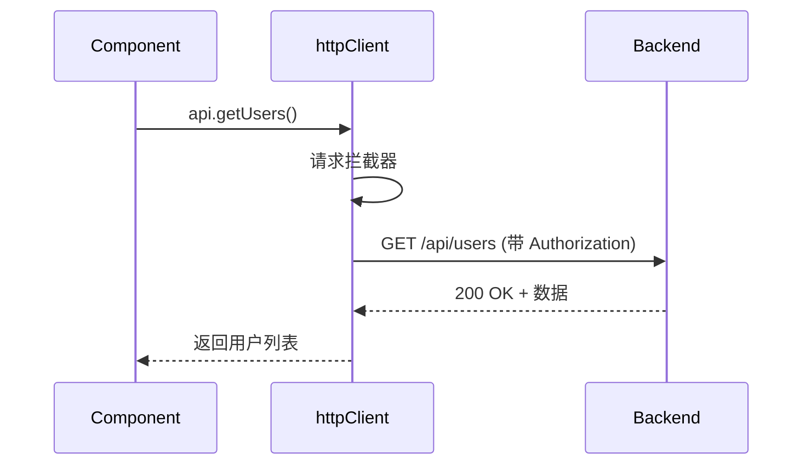

# 前端架构概览

<cite>
**本文档引用文件**  
- [index.html](file://apps/frontend/index.html)
- [main.ts](file://apps/frontend/src/main.ts)
- [App.vue](file://apps/frontend/src/App.vue)
- [vite.config.ts](file://apps/frontend/vite.config.ts)
- [router/index.ts](file://apps/frontend/src/router/index.ts)
- [stores/auth.ts](file://apps/frontend/src/stores/auth.ts)
- [api/index.ts](file://apps/frontend/src/api/index.ts)
- [components/AppHeader.vue](file://apps/frontend/src/components/AppHeader.vue)
- [i18n/index.ts](file://apps/frontend/src/i18n/index.ts)
- [tsconfig.json](file://apps/frontend/tsconfig.json)
</cite>

## 目录
1. [项目结构](#项目结构)
2. [应用启动流程](#应用启动流程)
3. [Vite 构建与开发服务器配置](#vite-构建与开发服务器配置)
4. [模块解析别名配置](#模块解析别名配置)
5. [整体布局与组件结构](#整体布局与组件结构)
6. [路由系统与视图渲染](#路由系统与视图渲染)
7. [状态管理与 Pinia](#状态管理与-pinia)
8. [API 调用与后端集成](#api-调用与后端集成)
9. [国际化支持](#国际化支持)

## 项目结构

前端项目位于 `apps/frontend` 目录下，采用基于 Vue 3 的组合式 API 架构，结合 Vite 作为构建工具和开发服务器，Pinia 作为状态管理库。主要目录结构如下：

- `src/`：源代码主目录
  - `api/`：API 客户端与接口定义
  - `components/`：可复用 UI 组件
  - `composables/`：自定义组合式函数
  - `i18n/`：国际化配置与语言包
  - `lib/`：工具函数库
  - `router/`：路由配置
  - `stores/`：Pinia 状态管理模块
  - `styles/`：全局样式
  - `views/`：页面级组件
- `index.html`：应用入口 HTML 文件
- `vite.config.ts`：Vite 构建配置
- `tsconfig.json`：TypeScript 配置

**Section sources**
- [index.html](file://apps/frontend/index.html)
- [vite.config.ts](file://apps/frontend/vite.config.ts)
- [tsconfig.json](file://apps/frontend/tsconfig.json)

## 应用启动流程

应用的启动从 `index.html` 开始，通过 `<script type="module" src="/src/main.ts"></script>` 加载入口模块。`main.ts` 文件负责创建 Vue 应用实例并挂载到 DOM。



**Diagram sources**
- [index.html](file://apps/frontend/index.html#L15)
- [main.ts](file://apps/frontend/src/main.ts#L32-L56)

**Section sources**
- [index.html](file://apps/frontend/index.html#L1-L18)
- [main.ts](file://apps/frontend/src/main.ts#L1-L57)

## Vite 构建与开发服务器配置

Vite 配置文件 `vite.config.ts` 定义了开发服务器和构建行为。开发服务器通过 `server.proxy` 将 `/api` 请求代理到后端服务（`http://localhost:3000`），解决了开发环境下的跨域问题。

此外，Vite 配置中集成了 PWA 插件（`vite-plugin-pwa`），支持离线访问和缓存策略，并为 Electron 桌面应用提供了构建支持。



**Diagram sources**
- [vite.config.ts](file://apps/frontend/vite.config.ts#L114-L121)

**Section sources**
- [vite.config.ts](file://apps/frontend/vite.config.ts#L1-L124)

## 模块解析别名配置

项目通过 Vite 和 TypeScript 配置实现了模块路径别名，提升代码可读性和维护性。核心别名 `@` 指向 `src` 目录，允许使用 `@/components/AppHeader.vue` 等相对路径导入。

- **Vite 配置**：在 `vite.config.ts` 中通过 `resolve.alias` 定义
- **TypeScript 配置**：在 `tsconfig.json` 中通过 `paths` 支持类型解析



**Diagram sources**
- [vite.config.ts](file://apps/frontend/vite.config.ts#L109-L112)
- [tsconfig.json](file://apps/frontend/tsconfig.json#L8-L9)

**Section sources**
- [vite.config.ts](file://apps/frontend/vite.config.ts#L109-L113)
- [tsconfig.json](file://apps/frontend/tsconfig.json#L8-L10)

## 整体布局与组件结构

应用采用标准的单页应用布局结构，由 `App.vue` 作为根组件，包含全局导航头 `AppHeader` 和动态内容区域。

- `AppHeader`：位于页面顶部，提供全局导航链接和语言切换功能
- `RouterView`：渲染当前路由匹配的视图组件
- 响应式布局：使用 Tailwind CSS 实现移动端适配



**Diagram sources**
- [App.vue](file://apps/frontend/src/App.vue#L1-L14)
- [AppHeader.vue](file://apps/frontend/src/components/AppHeader.vue#L1-L25)

**Section sources**
- [App.vue](file://apps/frontend/src/App.vue#L1-L14)
- [components/AppHeader.vue](file://apps/frontend/src/components/AppHeader.vue#L1-L25)

## 路由系统与视图渲染

路由系统由 `vue-router` 实现，配置文件位于 `src/router/index.ts`。应用定义了以下路由：

- `/`：首页（`HomeView.vue`）
- `/login`：登录页（懒加载）
- `/users`：用户列表页（懒加载）
- `/:pathMatch(.*)*`：404 页面（懒加载）

路由守卫在每次导航时更新页面标题，增强用户体验。

```mermaid
flowchart LR
A[/] --> B[HomeView]
C[/login] --> D[LoginView]
E[/users] --> F[UsersView]
G[/*] --> H[NotFoundView]
```

**Diagram sources**
- [router/index.ts](file://apps/frontend/src/router/index.ts#L7-L34)

**Section sources**
- [router/index.ts](file://apps/frontend/src/router/index.ts#L1-L44)

## 状态管理与 Pinia

项目使用 Pinia 进行状态管理，核心 store 包括：

- `auth.ts`：认证状态（token、用户信息），使用 `pinia-plugin-persistedstate` 持久化 token
- `users.ts`：用户列表状态，管理用户数据的获取与展示

状态管理遵循清晰的模式：定义状态、计算属性和操作方法，确保逻辑集中且可测试。



**Diagram sources**
- [stores/auth.ts](file://apps/frontend/src/stores/auth.ts#L10-L96)
- [stores/users.ts](file://apps/frontend/src/stores/users.ts#L9-L41)

**Section sources**
- [stores/auth.ts](file://apps/frontend/src/stores/auth.ts#L1-L97)
- [stores/users.ts](file://apps/frontend/src/stores/users.ts#L1-L42)

## API 调用与后端集成

API 集成通过 `axios` 实现，配置了统一的请求客户端和拦截器：

- **请求拦截器**：
  - 自动添加 JWT token 到 `Authorization` 头
  - 为非 GET 请求添加 CSRF token（从 cookie 读取）
- **响应拦截器**：
  - 401 响应时自动清除本地 token
- **API 模块**：封装具体业务接口，如获取用户列表、创建用户等



**Diagram sources**
- [api/index.ts](file://apps/frontend/src/api/index.ts#L7-L56)

**Section sources**
- [api/index.ts](file://apps/frontend/src/api/index.ts#L1-L92)

## 国际化支持

国际化通过 `vue-i18n` 实现，支持中英文切换：

- 语言包位于 `src/i18n/locales/`
- 默认语言根据浏览器语言或本地存储决定
- 语言偏好持久化到 `localStorage`

组件通过 `useI18n()` 获取翻译函数 `t()`，实现动态文本渲染。

```mermaid
flowchart TD
A[localStorage.getItem('locale')] --> |存在| B[使用存储语言]
C[navigator.language] --> |以 zh 开头| D[zh-CN]
C --> |否则| E[en-US]
B --> F[createI18n()]
D --> F
E --> F
```

**Diagram sources**
- [i18n/index.ts](file://apps/frontend/src/i18n/index.ts#L7-L14)

**Section sources**
- [i18n/index.ts](file://apps/frontend/src/i18n/index.ts#L1-L28)