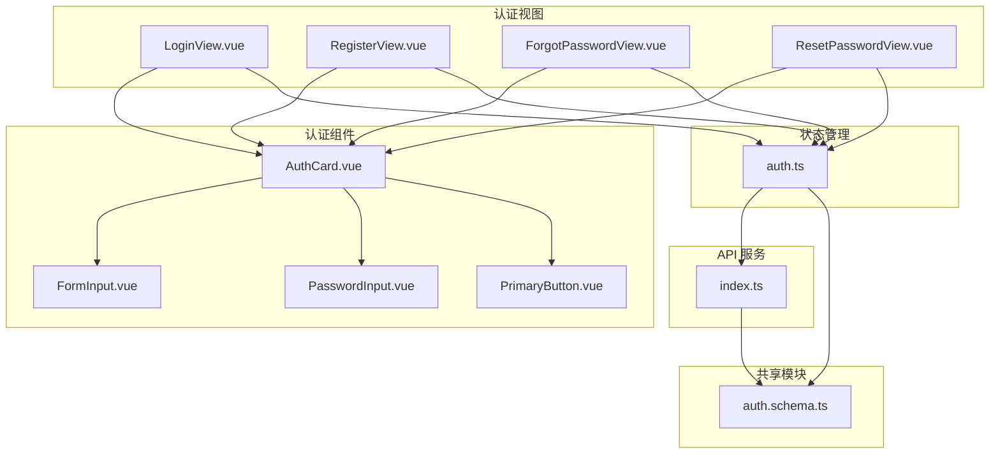
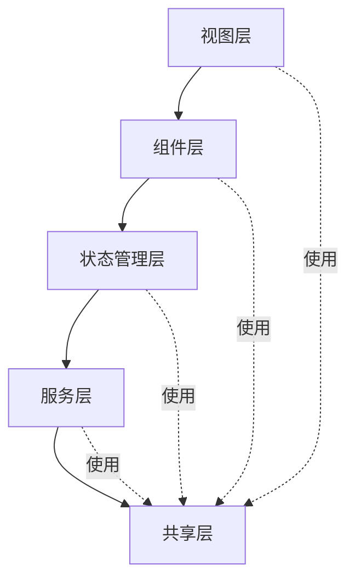
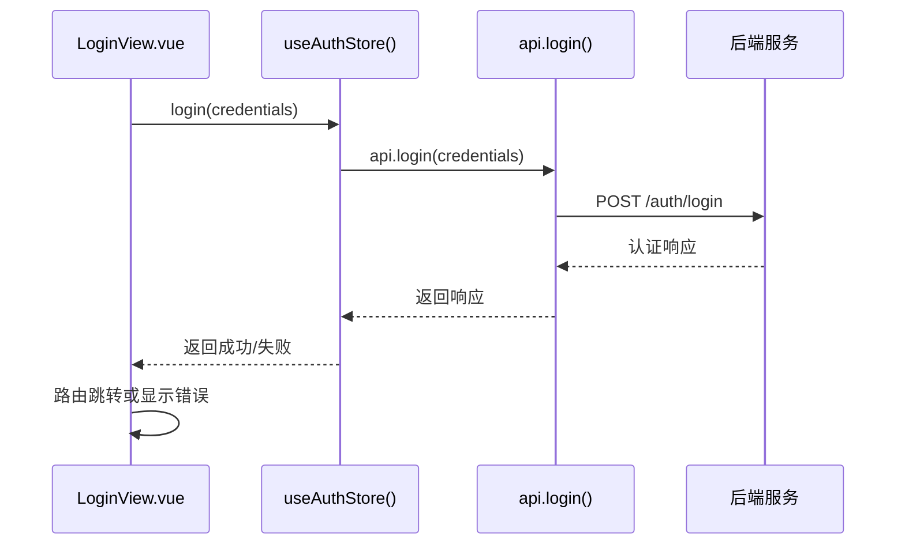
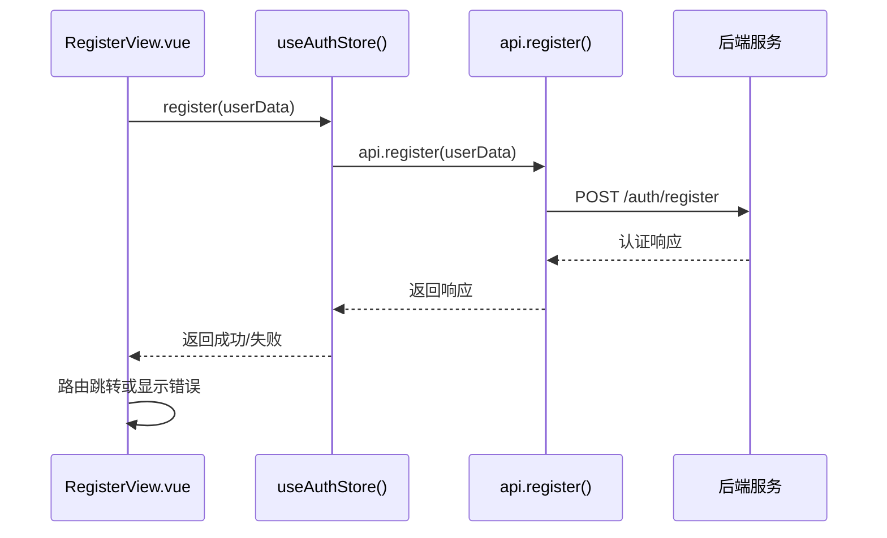
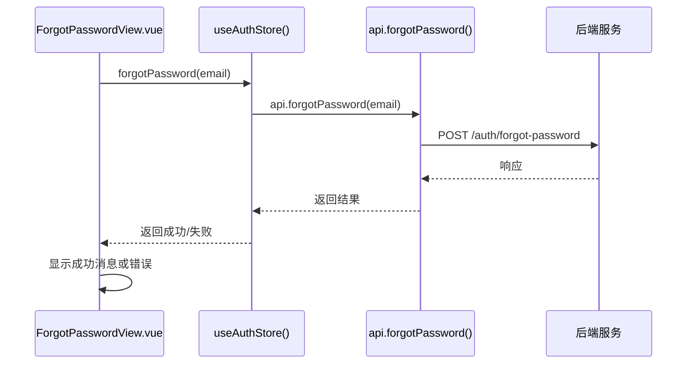
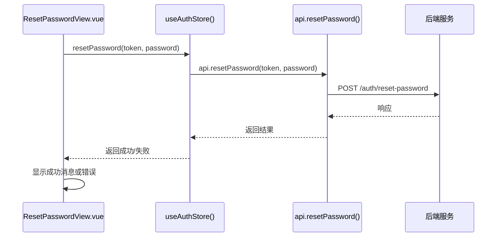
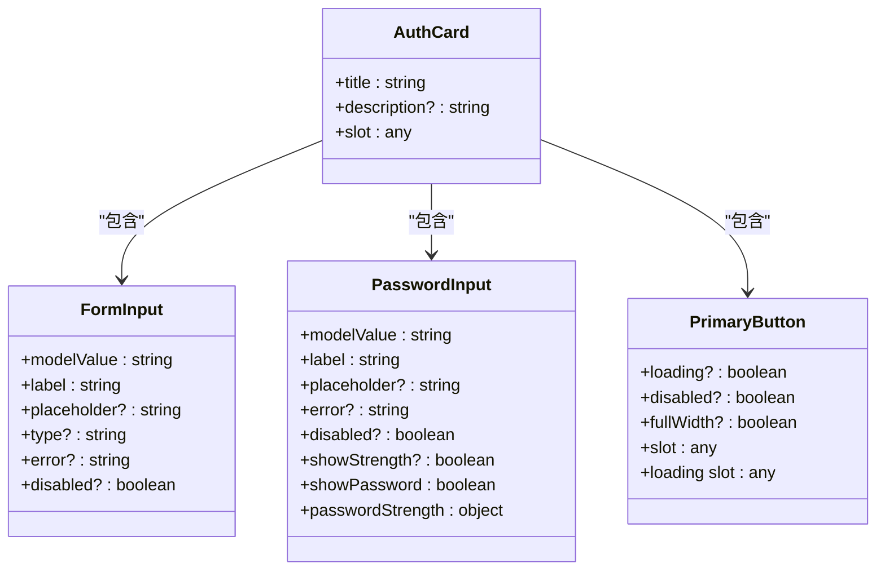
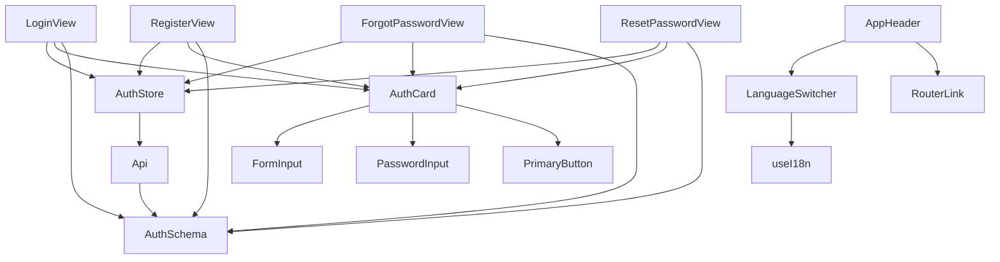

# 前端认证视图

<cite>
**本文档中引用的文件**  
- [LoginView.vue](file://apps/frontend/src/views/LoginView.vue)
- [RegisterView.vue](file://apps/frontend/src/views/RegisterView.vue)
- [ForgotPasswordView.vue](file://apps/frontend/src/views/ForgotPasswordView.vue)
- [ResetPasswordView.vue](file://apps/frontend/src/views/ResetPasswordView.vue)
- [auth.ts](file://apps/frontend/src/stores/auth.ts)
- [index.ts](file://apps/frontend/src/api/index.ts)
- [AuthCard.vue](file://apps/frontend/src/components/auth/AuthCard.vue)
- [FormInput.vue](file://apps/frontend/src/components/auth/FormInput.vue)
- [PasswordInput.vue](file://apps/frontend/src/components/auth/PasswordInput.vue)
- [PrimaryButton.vue](file://apps/frontend/src/components/auth/PrimaryButton.vue)
- [auth.schema.ts](file://packages/shared/src/schemas/auth.schema.ts)
- [router/index.ts](file://apps/frontend/src/router/index.ts)
- [en-US.ts](file://apps/frontend/src/i18n/locales/en-US.ts)
- [zh-CN.ts](file://apps/frontend/src/i18n/locales/zh-CN.ts)
</cite>

## 更新摘要
**已做更改**  
- 更新了登录、注册、找回密码和重置密码视图的实现细节
- 详细描述了各视图组件与状态管理 store 的交互流程
- 补充了表单验证规则的具体实现来源
- 更新了序列图以准确反映最新的组件调用链

## 目录
1. [简介](#简介)
2. [项目结构](#项目结构)
3. [核心组件](#核心组件)
4. [架构概览](#架构概览)
5. [详细组件分析](#详细组件分析)
6. [依赖分析](#依赖分析)
7. [性能考虑](#性能考虑)
8. [故障排除指南](#故障排除指南)
9. [结论](#结论)

## 简介
本项目是一个基于 Vue 3 和 NestJS 的全栈单体仓库模板，前端部分实现了完整的用户认证流程，包括登录、注册、找回密码和重置密码等功能。认证视图采用现代化的前端技术栈，包括 Vite、TypeScript、Tailwind CSS、Pinia 和 Vue Router，提供了良好的用户体验和可维护性。

## 项目结构
前端认证相关功能主要集中在 `apps/frontend/src/views` 和 `apps/frontend/src/components/auth` 目录下，通过 Pinia 状态管理实现认证逻辑的集中管理，并利用共享包 `@my-app/shared` 统一前后端的类型定义和验证规则。

**图示来源**
- [LoginView.vue](file://apps/frontend/src/views/LoginView.vue)
- [RegisterView.vue](file://apps/frontend/src/views/RegisterView.vue)
- [ForgotPasswordView.vue](file://apps/frontend/src/views/ForgotPasswordView.vue)
- [ResetPasswordView.vue](file://apps/frontend/src/views/ResetPasswordView.vue)
- [auth.ts](file://apps/frontend/src/stores/auth.ts)
- [index.ts](file://apps/frontend/src/api/index.ts)
- [AuthCard.vue](file://apps/frontend/src/components/auth/AuthCard.vue)
- [FormInput.vue](file://apps/frontend/src/components/auth/FormInput.vue)
- [PasswordInput.vue](file://apps/frontend/src/components/auth/PasswordInput.vue)
- [PrimaryButton.vue](file://apps/frontend/src/components/auth/PrimaryButton.vue)
- [auth.schema.ts](file://packages/shared/src/schemas/auth.schema.ts)

**本节来源**
- [apps/frontend/src/views/LoginView.vue](file://apps/frontend/src/views/LoginView.vue)
- [apps/frontend/src/views/RegisterView.vue](file://apps/frontend/src/views/RegisterView.vue)
- [apps/frontend/src/views/ForgotPasswordView.vue](file://apps/frontend/src/views/ForgotPasswordView.vue)
- [apps/frontend/src/views/ResetPasswordView.vue](file://apps/frontend/src/views/ResetPasswordView.vue)
- [apps/frontend/src/components/auth/AuthCard.vue](file://apps/frontend/src/components/auth/AuthCard.vue)

## 核心组件
前端认证系统的核心组件包括认证视图、认证组件、状态管理、API 服务和共享验证规则。这些组件协同工作，实现了完整的用户认证流程。

**本节来源**
- [LoginView.vue](file://apps/frontend/src/views/LoginView.vue)
- [RegisterView.vue](file://apps/frontend/src/views/RegisterView.vue)
- [ForgotPasswordView.vue](file://apps/frontend/src/views/ForgotPasswordView.vue)
- [ResetPasswordView.vue](file://apps/frontend/src/views/ResetPasswordView.vue)
- [auth.ts](file://apps/frontend/src/stores/auth.ts)

## 架构概览
前端认证系统采用分层架构，从上到下分为视图层、组件层、状态管理层、服务层和共享层。视图层负责展示认证界面，组件层提供可复用的 UI 组件，状态管理层管理认证状态，服务层处理 API 调用，共享层提供统一的类型定义和验证规则。

**图示来源**
- [LoginView.vue](file://apps/frontend/src/views/LoginView.vue)
- [RegisterView.vue](file://apps/frontend/src/views/RegisterView.vue)
- [ForgotPasswordView.vue](file://apps/frontend/src/views/ForgotPasswordView.vue)
- [ResetPasswordView.vue](file://apps/frontend/src/views/ResetPasswordView.vue)
- [auth.ts](file://apps/frontend/src/stores/auth.ts)
- [index.ts](file://apps/frontend/src/api/index.ts)
- [auth.schema.ts](file://packages/shared/src/schemas/auth.schema.ts)

## 详细组件分析
### 登录视图分析
登录视图实现了用户登录功能，通过表单验证、状态管理和 API 调用完成登录流程。

**图示来源**
- [LoginView.vue](file://apps/frontend/src/views/LoginView.vue)
- [auth.ts](file://apps/frontend/src/stores/auth.ts)
- [index.ts](file://apps/frontend/src/api/index.ts)

**本节来源**
- [LoginView.vue](file://apps/frontend/src/views/LoginView.vue)
- [auth.ts](file://apps/frontend/src/stores/auth.ts)

### 注册视图分析
注册视图实现了用户注册功能，包含密码确认验证和注册流程管理。

**图示来源**
- [RegisterView.vue](file://apps/frontend/src/views/RegisterView.vue)
- [auth.ts](file://apps/frontend/src/stores/auth.ts)
- [index.ts](file://apps/frontend/src/api/index.ts)

**本节来源**
- [RegisterView.vue](file://apps/frontend/src/views/RegisterView.vue)
- [auth.ts](file://apps/frontend/src/stores/auth.ts)

### 找回密码视图分析
找回密码视图实现了密码重置请求功能，用户输入邮箱后发送重置链接。

**图示来源**
- [ForgotPasswordView.vue](file://apps/frontend/src/views/ForgotPasswordView.vue)
- [auth.ts](file://apps/frontend/src/stores/auth.ts)
- [index.ts](file://apps/frontend/src/api/index.ts)

**本节来源**
- [ForgotPasswordView.vue](file://apps/frontend/src/views/ForgotPasswordView.vue)
- [auth.ts](file://apps/frontend/src/stores/auth.ts)

### 重置密码视图分析
重置密码视图实现了密码重置功能，通过令牌验证用户身份并更新密码。

**图示来源**
- [ResetPasswordView.vue](file://apps/frontend/src/views/ResetPasswordView.vue)
- [auth.ts](file://apps/frontend/src/stores/auth.ts)
- [index.ts](file://apps/frontend/src/api/index.ts)

**本节来源**
- [ResetPasswordView.vue](file://apps/frontend/src/views/ResetPasswordView.vue)
- [auth.ts](file://apps/frontend/src/stores/auth.ts)

### 认证组件分析
认证组件提供了可复用的 UI 元素，包括表单输入、密码输入和主按钮。

**图示来源**
- [AuthCard.vue](file://apps/frontend/src/components/auth/AuthCard.vue)
- [FormInput.vue](file://apps/frontend/src/components/auth/FormInput.vue)
- [PasswordInput.vue](file://apps/frontend/src/components/auth/PasswordInput.vue)
- [PrimaryButton.vue](file://apps/frontend/src/components/auth/PrimaryButton.vue)

**本节来源**
- [AuthCard.vue](file://apps/frontend/src/components/auth/AuthCard.vue)
- [FormInput.vue](file://apps/frontend/src/components/auth/FormInput.vue)
- [PasswordInput.vue](file://apps/frontend/src/components/auth/PasswordInput.vue)
- [PrimaryButton.vue](file://apps/frontend/src/components/auth/PrimaryButton.vue)

## 依赖分析
前端认证系统依赖于多个内部和外部模块，形成了清晰的依赖关系。

**图示来源**
- [LoginView.vue](file://apps/frontend/src/views/LoginView.vue)
- [RegisterView.vue](file://apps/frontend/src/views/RegisterView.vue)
- [ForgotPasswordView.vue](file://apps/frontend/src/views/ForgotPasswordView.vue)
- [ResetPasswordView.vue](file://apps/frontend/src/views/ResetPasswordView.vue)
- [auth.ts](file://apps/frontend/src/stores/auth.ts)
- [index.ts](file://apps/frontend/src/api/index.ts)
- [AuthCard.vue](file://apps/frontend/src/components/auth/AuthCard.vue)
- [FormInput.vue](file://apps/frontend/src/components/auth/FormInput.vue)
- [PasswordInput.vue](file://apps/frontend/src/components/auth/PasswordInput.vue)
- [PrimaryButton.vue](file://apps/frontend/src/components/auth/PrimaryButton.vue)
- [auth.schema.ts](file://packages/shared/src/schemas/auth.schema.ts)
- [AppHeader.vue](file://apps/frontend/src/components/AppHeader.vue)
- [LanguageSwitcher.vue](file://apps/frontend/src/components/LanguageSwitcher.vue)

**本节来源**
- [LoginView.vue](file://apps/frontend/src/views/LoginView.vue)
- [RegisterView.vue](file://apps/frontend/src/views/RegisterView.vue)
- [ForgotPasswordView.vue](file://apps/frontend/src/views/ForgotPasswordView.vue)
- [ResetPasswordView.vue](file://apps/frontend/src/views/ResetPasswordView.vue)
- [auth.ts](file://apps/frontend/src/stores/auth.ts)
- [index.ts](file://apps/frontend/src/api/index.ts)
- [AuthCard.vue](file://apps/frontend/src/components/auth/AuthCard.vue)
- [FormInput.vue](file://apps/frontend/src/components/auth/FormInput.vue)
- [PasswordInput.vue](file://apps/frontend/src/components/auth/PasswordInput.vue)
- [PrimaryButton.vue](file://apps/frontend/src/components/auth/PrimaryButton.vue)
- [auth.schema.ts](file://packages/shared/src/schemas/auth.schema.ts)
- [AppHeader.vue](file://apps/frontend/src/components/AppHeader.vue)
- [LanguageSwitcher.vue](file://apps/frontend/src/components/LanguageSwitcher.vue)

## 性能考虑
前端认证系统在性能方面做了以下优化：
- 使用 Pinia 持久化插件保存认证令牌，避免重复登录
- 采用懒加载方式加载视图组件，减少初始加载时间
- 使用 Axios 拦截器统一处理认证头和 CSRF 令牌
- 利用 Vue 3 的响应式系统高效更新 UI 状态
- 通过 vee-validate 和 zod 实现高效的表单验证

## 故障排除指南
### 常见问题及解决方案
1. **登录失败**
   - 检查网络连接
   - 确认邮箱和密码正确
   - 检查后端服务是否正常运行

2. **注册失败**
   - 确认邮箱格式正确
   - 检查用户名长度（2-50 个字符）
   - 确认密码符合要求（至少 6 个字符，包含字母和数字）

3. **密码重置链接无效**
   - 确认链接未过期
   - 检查邮箱是否正确注册
   - 重新发送重置链接

4. **国际化显示异常**
   - 检查语言包文件是否完整
   - 确认 i18n 配置正确
   - 检查浏览器语言设置

**本节来源**
- [auth.ts](file://apps/frontend/src/stores/auth.ts)
- [index.ts](file://apps/frontend/src/api/index.ts)
- [en-US.ts](file://apps/frontend/src/i18n/locales/en-US.ts)
- [zh-CN.ts](file://apps/frontend/src/i18n/locales/zh-CN.ts)

## 结论
前端认证视图实现了完整的用户认证流程，采用现代化的技术栈和良好的架构设计，具有以下特点：
- 清晰的分层架构，便于维护和扩展
- 统一的类型定义和验证规则，确保前后端一致性
- 友好的用户界面和交互体验
- 完善的错误处理和用户反馈机制
- 支持多语言国际化
- 高效的状态管理和 API 调用

该认证系统为应用程序提供了安全可靠的用户认证基础，可以作为其他类似项目的参考实现。