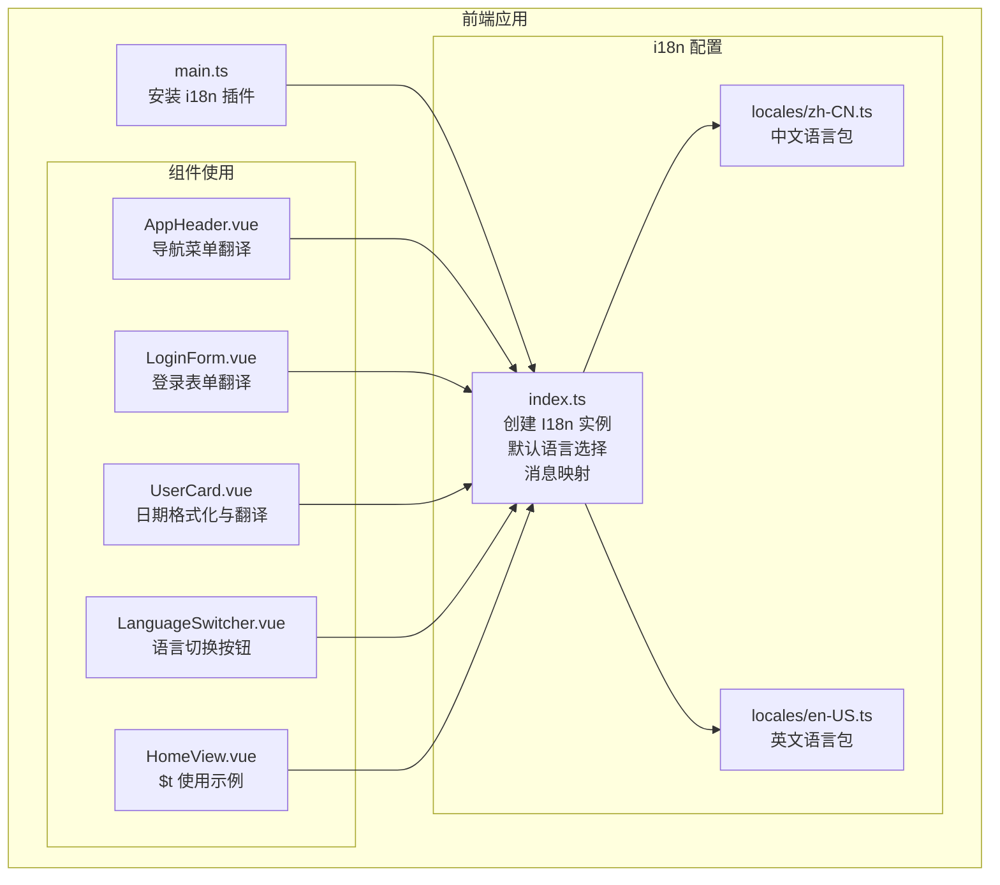
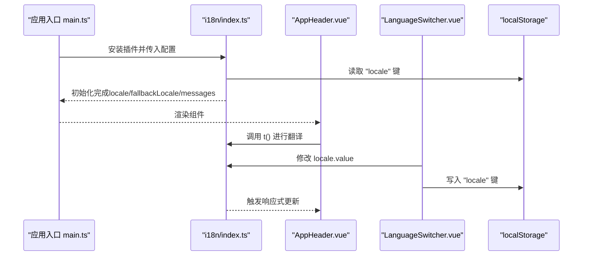
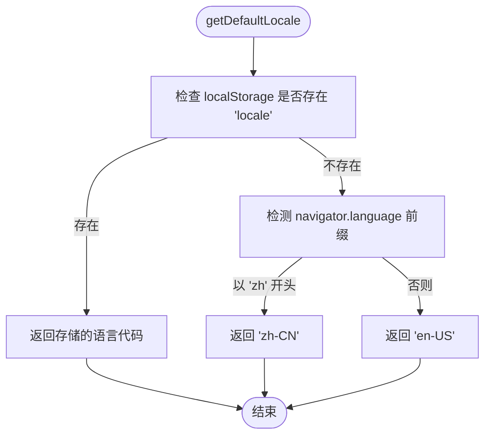
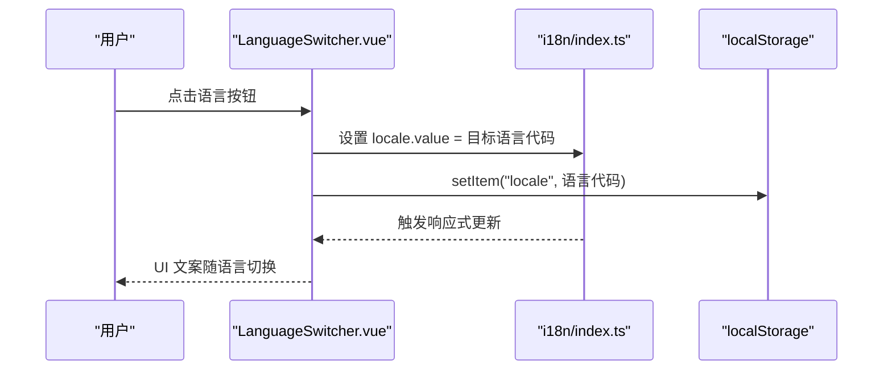
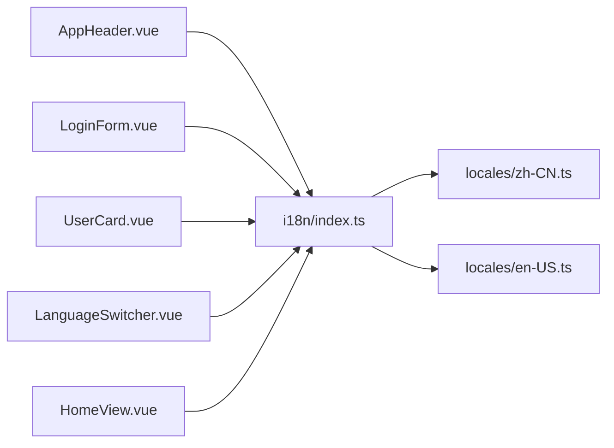

# 国际化支持

<cite>
**本文引用的文件**
- [apps/frontend/src/i18n/index.ts](file://apps/frontend/src/i18n/index.ts)
- [apps/frontend/src/i18n/locales/zh-CN.ts](file://apps/frontend/src/i18n/locales/zh-CN.ts)
- [apps/frontend/src/i18n/locales/en-US.ts](file://apps/frontend/src/i18n/locales/en-US.ts)
- [apps/frontend/src/components/LanguageSwitcher.vue](file://apps/frontend/src/components/LanguageSwitcher.vue)
- [apps/frontend/src/components/AppHeader.vue](file://apps/frontend/src/components/AppHeader.vue)
- [apps/frontend/src/components/LoginForm.vue](file://apps/frontend/src/components/LoginForm.vue)
- [apps/frontend/src/components/UserCard.vue](file://apps/frontend/src/components/UserCard.vue)
- [apps/frontend/src/views/HomeView.vue](file://apps/frontend/src/views/HomeView.vue)
- [apps/frontend/src/main.ts](file://apps/frontend/src/main.ts)
- [apps/frontend/package.json](file://apps/frontend/package.json)
</cite>

## 目录
1. [简介](#简介)
2. [项目结构](#项目结构)
3. [核心组件](#核心组件)
4. [架构总览](#架构总览)
5. [详细组件分析](#详细组件分析)
6. [依赖关系分析](#依赖关系分析)
7. [性能考量](#性能考量)
8. [故障排查指南](#故障排查指南)
9. [结论](#结论)
10. [附录：最佳实践与示例路径](#附录最佳实践与示例路径)

## 简介
本文件系统性文档化前端应用中的国际化（i18n）配置与使用方式，涵盖以下要点：
- 语言包组织结构（zh-CN 与 en-US）
- 翻译键命名规范与分层策略
- 在组件中使用 $t 文本翻译的方法
- 通过 LanguageSwitcher 组件实现语言切换
- 语言切换的持久化机制（localStorage）
- 动态加载语言包的可能性与建议
- 在模板与脚本中正确使用国际化 API 的最佳实践

## 项目结构
国际化相关代码集中在前端应用的 i18n 目录，并在应用入口处完成安装。语言包按区域划分，采用扁平与分层结合的键命名策略，便于维护与扩展。

图表来源
- [apps/frontend/src/main.ts](file://apps/frontend/src/main.ts#L1-L57)
- [apps/frontend/src/i18n/index.ts](file://apps/frontend/src/i18n/index.ts#L1-L28)
- [apps/frontend/src/i18n/locales/zh-CN.ts](file://apps/frontend/src/i18n/locales/zh-CN.ts#L1-L42)
- [apps/frontend/src/i18n/locales/en-US.ts](file://apps/frontend/src/i18n/locales/en-US.ts#L1-L42)
- [apps/frontend/src/components/AppHeader.vue](file://apps/frontend/src/components/AppHeader.vue#L1-L25)
- [apps/frontend/src/components/LoginForm.vue](file://apps/frontend/src/components/LoginForm.vue#L1-L99)
- [apps/frontend/src/components/UserCard.vue](file://apps/frontend/src/components/UserCard.vue#L1-L53)
- [apps/frontend/src/components/LanguageSwitcher.vue](file://apps/frontend/src/components/LanguageSwitcher.vue#L1-L34)
- [apps/frontend/src/views/HomeView.vue](file://apps/frontend/src/views/HomeView.vue#L1-L307)

章节来源
- [apps/frontend/src/i18n/index.ts](file://apps/frontend/src/i18n/index.ts#L1-L28)
- [apps/frontend/src/i18n/locales/zh-CN.ts](file://apps/frontend/src/i18n/locales/zh-CN.ts#L1-L42)
- [apps/frontend/src/i18n/locales/en-US.ts](file://apps/frontend/src/i18n/locales/en-US.ts#L1-L42)
- [apps/frontend/src/main.ts](file://apps/frontend/src/main.ts#L1-L57)

## 核心组件
- i18n 配置与默认语言选择
  - 在配置文件中创建 I18n 实例，设置默认语言、回退语言与消息映射。
  - 默认语言优先从 localStorage 读取；若无则根据浏览器语言自动判断；否则回退到英文。
- 语言包组织
  - 中文与英文语言包分别位于独立文件，采用分层命名（如 common、home、login、users、notFound），便于按功能域管理。
- 语言切换组件
  - LanguageSwitcher 组件通过修改 i18n 的 locale 值实现切换，并将新语言写入 localStorage 以持久化。
- 组件内翻译
  - 多个组件通过 useI18n 获取 t 与 locale，用于模板与脚本中的文本翻译与日期格式化等。

章节来源
- [apps/frontend/src/i18n/index.ts](file://apps/frontend/src/i18n/index.ts#L1-L28)
- [apps/frontend/src/i18n/locales/zh-CN.ts](file://apps/frontend/src/i18n/locales/zh-CN.ts#L1-L42)
- [apps/frontend/src/i18n/locales/en-US.ts](file://apps/frontend/src/i18n/locales/en-US.ts#L1-L42)
- [apps/frontend/src/components/LanguageSwitcher.vue](file://apps/frontend/src/components/LanguageSwitcher.vue#L1-L34)
- [apps/frontend/src/components/AppHeader.vue](file://apps/frontend/src/components/AppHeader.vue#L1-L25)
- [apps/frontend/src/components/LoginForm.vue](file://apps/frontend/src/components/LoginForm.vue#L1-L99)
- [apps/frontend/src/components/UserCard.vue](file://apps/frontend/src/components/UserCard.vue#L1-L53)
- [apps/frontend/src/views/HomeView.vue](file://apps/frontend/src/views/HomeView.vue#L1-L307)

## 架构总览
下图展示了应用启动时 i18n 的安装流程与运行期语言切换的关键交互。

图表来源
- [apps/frontend/src/main.ts](file://apps/frontend/src/main.ts#L1-L57)
- [apps/frontend/src/i18n/index.ts](file://apps/frontend/src/i18n/index.ts#L1-L28)
- [apps/frontend/src/components/AppHeader.vue](file://apps/frontend/src/components/AppHeader.vue#L1-L25)
- [apps/frontend/src/components/LanguageSwitcher.vue](file://apps/frontend/src/components/LanguageSwitcher.vue#L1-L34)

## 详细组件分析

### i18n 配置与默认语言选择
- 创建 I18n 实例时的关键点
  - legacy: false，启用组合式 API。
  - locale: 由 getDefaultLocale 决定，优先读取 localStorage，其次根据 navigator.language 判断，最后回退到 en-US。
  - fallbackLocale: en-US，确保缺失翻译时有兜底文案。
  - messages: 同步挂载 zh-CN 与 en-US 两个语言包。
- 类型安全
  - 通过 MessageSchema 与泛型约束，使翻译键具备类型推断能力，减少拼写错误风险。

图表来源
- [apps/frontend/src/i18n/index.ts](file://apps/frontend/src/i18n/index.ts#L1-L28)

章节来源
- [apps/frontend/src/i18n/index.ts](file://apps/frontend/src/i18n/index.ts#L1-L28)

### 语言包组织与翻译键命名规范
- 组织结构
  - 语言包按功能域分层：common、home、login、users、notFound 等。
  - 每个键对应具体文案，便于按页面或模块检索与维护。
- 命名规范建议
  - 使用小驼峰或点号分隔的层级命名，避免重复与歧义。
  - 保持键名稳定，遵循“页面/模块.语义”的约定，便于后续迁移与重构。
  - 对于复数、性别、数量等场景，可在键名中体现上下文，或通过参数化处理。

章节来源
- [apps/frontend/src/i18n/locales/zh-CN.ts](file://apps/frontend/src/i18n/locales/zh-CN.ts#L1-L42)
- [apps/frontend/src/i18n/locales/en-US.ts](file://apps/frontend/src/i18n/locales/en-US.ts#L1-L42)

### 在组件中使用 $t 进行文本翻译
- 模板中使用
  - 通过 useI18n 获取 t，直接在模板中调用 t('模块.键')。
  - 示例：导航项标题、表单项标签与占位符、按钮文案等。
- 脚本中使用
  - 在逻辑中调用 t 获取翻译字符串，用于动态文案或条件渲染。
  - 示例：HomeView 中对 Vue I18n 的简单自检与展示。
- 日期与本地化
  - 可结合 locale 值与本地化 API 进行日期格式化，保证显示符合当前语言环境。

章节来源
- [apps/frontend/src/components/AppHeader.vue](file://apps/frontend/src/components/AppHeader.vue#L1-L25)
- [apps/frontend/src/components/LoginForm.vue](file://apps/frontend/src/components/LoginForm.vue#L1-L99)
- [apps/frontend/src/views/HomeView.vue](file://apps/frontend/src/views/HomeView.vue#L1-L307)
- [apps/frontend/src/components/UserCard.vue](file://apps/frontend/src/components/UserCard.vue#L1-L53)

### LanguageSwitcher 组件：语言切换功能
- 功能概述
  - 提供中英两种语言切换按钮，点击后更新 i18n 的 locale，并将新语言写入 localStorage。
- 关键行为
  - 读取当前 locale 并高亮选中项。
  - 写入 localStorage 以持久化用户偏好。
- 与主应用集成
  - 在 AppHeader 中引入并渲染，便于全局访问。

图表来源
- [apps/frontend/src/components/LanguageSwitcher.vue](file://apps/frontend/src/components/LanguageSwitcher.vue#L1-L34)
- [apps/frontend/src/i18n/index.ts](file://apps/frontend/src/i18n/index.ts#L1-L28)

章节来源
- [apps/frontend/src/components/LanguageSwitcher.vue](file://apps/frontend/src/components/LanguageSwitcher.vue#L1-L34)

### 应用入口安装与依赖
- 在 main.ts 中安装 i18n 插件，确保所有组件可使用 $t 与 locale。
- 依赖版本
  - vue-i18n 版本在 package.json 中声明，确保与组合式 API 兼容。

章节来源
- [apps/frontend/src/main.ts](file://apps/frontend/src/main.ts#L1-L57)
- [apps/frontend/package.json](file://apps/frontend/package.json#L1-L80)

## 依赖关系分析
- 组件与 i18n 的耦合
  - AppHeader、LoginForm、UserCard、LanguageSwitcher、HomeView 等组件均通过 useI18n 访问 t 与 locale。
- 语言包与配置
  - index.ts 将 zh-CN 与 en-US 语言包注入到 i18n 实例，形成静态消息映射。
- 持久化与回退
  - localStorage 用于持久化用户选择；fallbackLocale 保障缺失翻译时的可用性。

图表来源
- [apps/frontend/src/i18n/index.ts](file://apps/frontend/src/i18n/index.ts#L1-L28)
- [apps/frontend/src/i18n/locales/zh-CN.ts](file://apps/frontend/src/i18n/locales/zh-CN.ts#L1-L42)
- [apps/frontend/src/i18n/locales/en-US.ts](file://apps/frontend/src/i18n/locales/en-US.ts#L1-L42)
- [apps/frontend/src/components/AppHeader.vue](file://apps/frontend/src/components/AppHeader.vue#L1-L25)
- [apps/frontend/src/components/LoginForm.vue](file://apps/frontend/src/components/LoginForm.vue#L1-L99)
- [apps/frontend/src/components/UserCard.vue](file://apps/frontend/src/components/UserCard.vue#L1-L53)
- [apps/frontend/src/components/LanguageSwitcher.vue](file://apps/frontend/src/components/LanguageSwitcher.vue#L1-L34)
- [apps/frontend/src/views/HomeView.vue](file://apps/frontend/src/views/HomeView.vue#L1-L307)

章节来源
- [apps/frontend/src/i18n/index.ts](file://apps/frontend/src/i18n/index.ts#L1-L28)
- [apps/frontend/src/components/AppHeader.vue](file://apps/frontend/src/components/AppHeader.vue#L1-L25)
- [apps/frontend/src/components/LoginForm.vue](file://apps/frontend/src/components/LoginForm.vue#L1-L99)
- [apps/frontend/src/components/UserCard.vue](file://apps/frontend/src/components/UserCard.vue#L1-L53)
- [apps/frontend/src/components/LanguageSwitcher.vue](file://apps/frontend/src/components/LanguageSwitcher.vue#L1-L34)
- [apps/frontend/src/views/HomeView.vue](file://apps/frontend/src/views/HomeView.vue#L1-L307)

## 性能考量
- 语言包体积控制
  - 当前为静态打包，语言包较小，无需额外优化。
  - 若未来语言包增大，可考虑按需动态加载语言包，减少首屏体积。
- 响应式更新范围
  - 通过修改 locale.value 触发响应式更新，仅影响使用 t 的组件，整体开销可控。
- 回退策略
  - fallbackLocale 为 en-US，可避免因缺失翻译导致的空白或异常。

[本节为通用指导，不涉及具体文件分析]

## 故障排查指南
- 症状：切换语言后文案未更新
  - 检查 LanguageSwitcher 是否正确设置 locale.value 并写入 localStorage。
  - 确认组件中使用的是 t('模块.键')，且键存在于当前语言包。
- 症状：出现英文兜底文案
  - 检查对应语言包中是否存在该键；若缺失，确认 fallbackLocale 配置。
- 症状：默认语言不符合预期
  - 检查 localStorage 中 'locale' 键值；若为空，确认浏览器语言是否以 'zh' 开头。
- 症状：日期格式不符合语言习惯
  - 在需要本地化日期的组件中，结合 locale 值与本地化 API 进行格式化。

章节来源
- [apps/frontend/src/components/LanguageSwitcher.vue](file://apps/frontend/src/components/LanguageSwitcher.vue#L1-L34)
- [apps/frontend/src/i18n/index.ts](file://apps/frontend/src/i18n/index.ts#L1-L28)
- [apps/frontend/src/components/UserCard.vue](file://apps/frontend/src/components/UserCard.vue#L1-L53)

## 结论
本项目采用简洁清晰的国际化方案：静态语言包、组合式 API、localStorage 持久化与明确的回退策略。通过分层命名与类型约束，既保证了易维护性，也提升了开发体验。未来可根据业务增长引入动态加载语言包等高级特性，但当前实现已满足大多数场景需求。

[本节为总结性内容，不涉及具体文件分析]

## 附录：最佳实践与示例路径
- 在模板中使用翻译键
  - 导航项与页面标题：参考 [apps/frontend/src/components/AppHeader.vue](file://apps/frontend/src/components/AppHeader.vue#L1-L25)
  - 登录表单标签与按钮文案：参考 [apps/frontend/src/components/LoginForm.vue](file://apps/frontend/src/components/LoginForm.vue#L1-L99)
  - 用户卡片中的“加入于”等文案：参考 [apps/frontend/src/components/UserCard.vue](file://apps/frontend/src/components/UserCard.vue#L1-L53)
- 在脚本中使用翻译键
  - 在 HomeView 中对 Vue I18n 的简单自检与展示：参考 [apps/frontend/src/views/HomeView.vue](file://apps/frontend/src/views/HomeView.vue#L1-L307)
- 语言切换与持久化
  - LanguageSwitcher 组件的切换与存储逻辑：参考 [apps/frontend/src/components/LanguageSwitcher.vue](file://apps/frontend/src/components/LanguageSwitcher.vue#L1-L34)
- i18n 配置与默认语言选择
  - 默认语言选择与消息映射：参考 [apps/frontend/src/i18n/index.ts](file://apps/frontend/src/i18n/index.ts#L1-L28)
- 应用入口安装
  - 在 main.ts 中安装 i18n 插件：参考 [apps/frontend/src/main.ts](file://apps/frontend/src/main.ts#L1-L57)