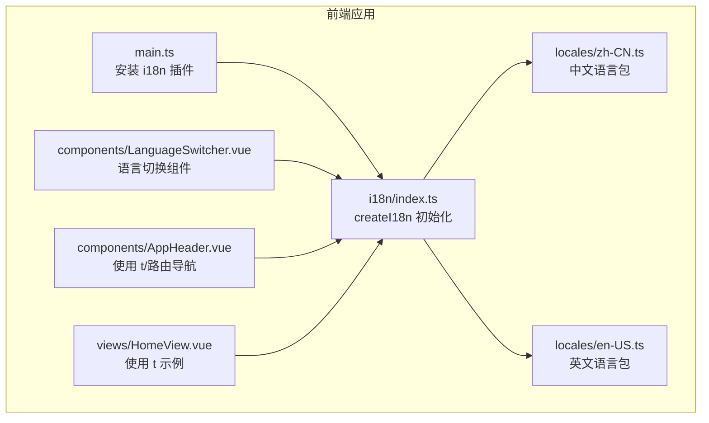
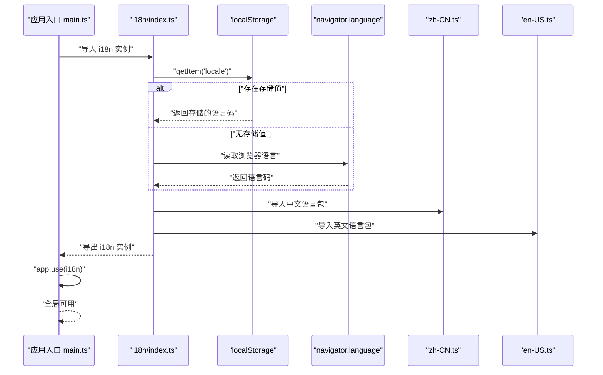
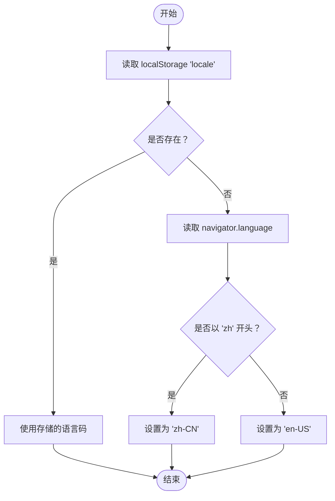
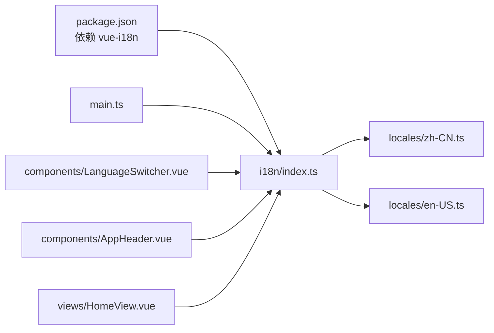

# 国际化配置

<cite>
**本文引用的文件**
- [apps/frontend/src/i18n/index.ts](file://apps/frontend/src/i18n/index.ts)
- [apps/frontend/src/i18n/locales/zh-CN.ts](file://apps/frontend/src/i18n/locales/zh-CN.ts)
- [apps/frontend/src/i18n/locales/en-US.ts](file://apps/frontend/src/i18n/locales/en-US.ts)
- [apps/frontend/src/main.ts](file://apps/frontend/src/main.ts)
- [apps/frontend/src/components/LanguageSwitcher.vue](file://apps/frontend/src/components/LanguageSwitcher.vue)
- [apps/frontend/src/components/AppHeader.vue](file://apps/frontend/src/components/AppHeader.vue)
- [apps/frontend/src/views/HomeView.vue](file://apps/frontend/src/views/HomeView.vue)
- [apps/frontend/package.json](file://apps/frontend/package.json)
</cite>

## 目录
1. [简介](#简介)
2. [项目结构](#项目结构)
3. [核心组件](#核心组件)
4. [架构总览](#架构总览)
5. [详细组件分析](#详细组件分析)
6. [依赖关系分析](#依赖关系分析)
7. [性能考量](#性能考量)
8. [故障排查指南](#故障排查指南)
9. [结论](#结论)
10. [附录](#附录)

## 简介
本文件系统性说明 Vue I18n 在该前端工程中的初始化配置流程，包括：
- createI18n 的关键参数（legacy、locale、fallbackLocale、messages）及其作用
- 默认语言选择策略：优先从 localStorage 获取，其次依据浏览器语言自动判断（zh-CN 或 en-US）
- 语言包（zh-CN 与 en-US）的导入与注册方式
- 在 main.ts 中 app.use(i18n) 的安装时机与全局可用性
- 多语言包扩展建议与类型安全最佳实践

## 项目结构
国际化相关代码集中在前端应用的 i18n 目录，并在应用入口处完成安装。关键文件如下：
- i18n 初始化与默认语言选择：apps/frontend/src/i18n/index.ts
- 语言包定义：apps/frontend/src/i18n/locales/zh-CN.ts、apps/frontend/src/i18n/locales/en-US.ts
- 应用入口安装插件：apps/frontend/src/main.ts
- 语言切换组件：apps/frontend/src/components/LanguageSwitcher.vue
- 使用翻译与语言切换的示例：apps/frontend/src/components/AppHeader.vue、apps/frontend/src/views/HomeView.vue
- 依赖声明：apps/frontend/package.json

图表来源
- [apps/frontend/src/main.ts](file://apps/frontend/src/main.ts#L1-L57)
- [apps/frontend/src/i18n/index.ts](file://apps/frontend/src/i18n/index.ts#L1-L28)
- [apps/frontend/src/i18n/locales/zh-CN.ts](file://apps/frontend/src/i18n/locales/zh-CN.ts#L1-L42)
- [apps/frontend/src/i18n/locales/en-US.ts](file://apps/frontend/src/i18n/locales/en-US.ts#L1-L42)
- [apps/frontend/src/components/LanguageSwitcher.vue](file://apps/frontend/src/components/LanguageSwitcher.vue#L1-L34)
- [apps/frontend/src/components/AppHeader.vue](file://apps/frontend/src/components/AppHeader.vue#L1-L24)
- [apps/frontend/src/views/HomeView.vue](file://apps/frontend/src/views/HomeView.vue#L1-L307)

章节来源
- [apps/frontend/src/i18n/index.ts](file://apps/frontend/src/i18n/index.ts#L1-L28)
- [apps/frontend/src/i18n/locales/zh-CN.ts](file://apps/frontend/src/i18n/locales/zh-CN.ts#L1-L42)
- [apps/frontend/src/i18n/locales/en-US.ts](file://apps/frontend/src/i18n/locales/en-US.ts#L1-L42)
- [apps/frontend/src/main.ts](file://apps/frontend/src/main.ts#L1-L57)

## 核心组件
- i18n 初始化与默认语言选择
  - 通过 createI18n 创建实例，传入 legacy、locale、fallbackLocale、messages 等参数
  - 默认语言选择逻辑：优先读取 localStorage 中的 'locale' 键；若不存在则根据 navigator.language 前缀判断 zh-CN 或 en-US
- 语言包注册
  - 将 zh-CN.ts 与 en-US.ts 作为独立模块导入，并注册到 messages 对象中
- 应用安装与全局可用性
  - 在 main.ts 中通过 app.use(i18n) 安装插件，使 t、tc、te、tm、locale、availableLocales 等 API 在全局可使用

章节来源
- [apps/frontend/src/i18n/index.ts](file://apps/frontend/src/i18n/index.ts#L1-L28)
- [apps/frontend/src/main.ts](file://apps/frontend/src/main.ts#L1-L57)

## 架构总览
下图展示了 i18n 初始化、默认语言选择、语言包注册以及应用安装的整体流程。

图表来源
- [apps/frontend/src/i18n/index.ts](file://apps/frontend/src/i18n/index.ts#L1-L28)
- [apps/frontend/src/main.ts](file://apps/frontend/src/main.ts#L1-L57)

## 详细组件分析

### i18n 初始化与 createI18n 参数
- 关键参数说明
  - legacy: 设为 false，启用组合式 API（推荐用于 Vue 3）
  - locale: 默认语言码，由 getDefaultLocale 决定
  - fallbackLocale: 回退语言码，当目标语言缺失键时回退至 en-US
  - messages: 语言包映射，包含 'zh-CN' 与 'en-US' 两条键
- 类型安全
  - 通过 MessageSchema 与泛型约束，确保 messages 结构与类型一致，避免运行期键错误

图表来源
- [apps/frontend/src/i18n/index.ts](file://apps/frontend/src/i18n/index.ts#L1-L28)

章节来源
- [apps/frontend/src/i18n/index.ts](file://apps/frontend/src/i18n/index.ts#L1-L28)

### 默认语言选择函数 getDefaultLocale
- 优先级
  - 本地存储：优先从 localStorage.getItem('locale') 获取
  - 浏览器语言：若无存储值，则根据 navigator.language 判断 zh-CN 或 en-US
- 返回值
  - 字符串形式的语言码，如 'zh-CN' 或 'en-US'

章节来源
- [apps/frontend/src/i18n/index.ts](file://apps/frontend/src/i18n/index.ts#L1-L28)

### 语言包导入与注册
- 语言包文件
  - zh-CN.ts：中文语言包，包含 common、home、login、users、notFound 等命名空间
  - en-US.ts：英文语言包，内容与 zh-CN.ts 对应
- 注册方式
  - 在 i18n/index.ts 中分别导入 zh-CN.ts 与 en-US.ts，并将其注册到 messages 对象中，键分别为 'zh-CN' 与 'en-US'

章节来源
- [apps/frontend/src/i18n/locales/zh-CN.ts](file://apps/frontend/src/i18n/locales/zh-CN.ts#L1-L42)
- [apps/frontend/src/i18n/locales/en-US.ts](file://apps/frontend/src/i18n/locales/en-US.ts#L1-L42)
- [apps/frontend/src/i18n/index.ts](file://apps/frontend/src/i18n/index.ts#L1-L28)

### 应用安装时机与全局可用性
- 安装时机
  - 在 main.ts 中，应用创建后立即安装 i18n 插件：app.use(i18n)
- 全局可用性
  - 安装完成后，可在任意组件中通过 useI18n 获取 t、locale 等 API，并在模板中直接使用翻译键

章节来源
- [apps/frontend/src/main.ts](file://apps/frontend/src/main.ts#L1-L57)

### 语言切换组件 LanguageSwitcher
- 功能
  - 提供中英两种语言切换按钮
  - 点击后将 locale.value 设置为目标语言码，并同步写入 localStorage('locale')
- 交互
  - 通过 useI18n 获取 locale 响应式变量，实现即时切换

章节来源
- [apps/frontend/src/components/LanguageSwitcher.vue](file://apps/frontend/src/components/LanguageSwitcher.vue#L1-L34)

### 使用翻译与语言切换的示例
- AppHeader
  - 在导航中使用 t('common.home')、t('common.users') 进行文本翻译
- HomeView
  - 在模板中使用 t('home.viewUsersDemo') 展示动态文案
  - 同时在脚本中对 t('home.title') 进行了功能测试，验证翻译可用性

章节来源
- [apps/frontend/src/components/AppHeader.vue](file://apps/frontend/src/components/AppHeader.vue#L1-L24)
- [apps/frontend/src/views/HomeView.vue](file://apps/frontend/src/views/HomeView.vue#L1-L307)

## 依赖关系分析
- 外部依赖
  - vue-i18n：版本在 package.json 中声明，用于提供国际化能力
- 内部依赖
  - i18n/index.ts 依赖 zh-CN.ts 与 en-US.ts
  - main.ts 依赖 i18n/index.ts 并安装插件
  - LanguageSwitcher.vue、AppHeader.vue、HomeView.vue 等组件依赖 useI18n API

图表来源
- [apps/frontend/package.json](file://apps/frontend/package.json#L1-L80)
- [apps/frontend/src/i18n/index.ts](file://apps/frontend/src/i18n/index.ts#L1-L28)
- [apps/frontend/src/i18n/locales/zh-CN.ts](file://apps/frontend/src/i18n/locales/zh-CN.ts#L1-L42)
- [apps/frontend/src/i18n/locales/en-US.ts](file://apps/frontend/src/i18n/locales/en-US.ts#L1-L42)
- [apps/frontend/src/main.ts](file://apps/frontend/src/main.ts#L1-L57)
- [apps/frontend/src/components/LanguageSwitcher.vue](file://apps/frontend/src/components/LanguageSwitcher.vue#L1-L34)
- [apps/frontend/src/components/AppHeader.vue](file://apps/frontend/src/components/AppHeader.vue#L1-L24)
- [apps/frontend/src/views/HomeView.vue](file://apps/frontend/src/views/HomeView.vue#L1-L307)

章节来源
- [apps/frontend/package.json](file://apps/frontend/package.json#L1-L80)
- [apps/frontend/src/i18n/index.ts](file://apps/frontend/src/i18n/index.ts#L1-L28)
- [apps/frontend/src/main.ts](file://apps/frontend/src/main.ts#L1-L57)

## 性能考量
- 语言包体积控制
  - 将语言包拆分为多个命名空间（common、home、login、users、notFound），便于按需维护与加载
- 默认语言选择
  - 本地存储读取为 O(1)，浏览器语言判断为 O(1)，整体开销极低
- 回退机制
  - fallbackLocale 为 en-US，可减少缺失键导致的渲染异常，提升稳定性

## 故障排查指南
- 无法切换语言
  - 检查 LanguageSwitcher 是否正确设置 locale.value 并写入 localStorage('locale')
  - 确认 main.ts 中已执行 app.use(i18n)
- 翻译键无效
  - 确认键名与语言包结构一致（例如 common.home、home.title 等）
  - 若键缺失，将回退到 fallbackLocale（en-US）
- 默认语言不正确
  - 检查 localStorage('locale') 是否存在；若不存在，确认 navigator.language 前缀是否为 zh

章节来源
- [apps/frontend/src/components/LanguageSwitcher.vue](file://apps/frontend/src/components/LanguageSwitcher.vue#L1-L34)
- [apps/frontend/src/main.ts](file://apps/frontend/src/main.ts#L1-L57)
- [apps/frontend/src/i18n/index.ts](file://apps/frontend/src/i18n/index.ts#L1-L28)

## 结论
该工程采用现代 Vue 3 的组合式国际化方案，通过 createI18n 的合理参数配置与清晰的默认语言选择策略，实现了稳定且可扩展的多语言支持。语言包以模块化方式组织，配合类型约束保证了开发期与运行期的安全性。应用入口统一安装插件，使翻译能力在全局范围内可用，语言切换组件提供了直观的用户交互。

## 附录

### 扩展建议
- 新增语言包
  - 在 locales 目录新增对应语言文件（如 ja-JP.ts），并在 i18n/index.ts 的 messages 中注册
  - 在 LanguageSwitcher.vue 中添加新语言选项，并更新默认语言选择逻辑
- 动态加载语言包
  - 可考虑按需异步加载语言包，减少初始包体积
- 命名空间规范化
  - 统一命名空间与键名规范，便于维护与自动化校验

### 类型安全最佳实践
- 使用 MessageSchema 与泛型约束，确保 messages 结构与类型一致
- 在组件中优先使用 useI18n 的类型感知 API，减少字符串拼写错误
- 为常用翻译键建立类型别名或常量，提升可读性与可维护性

章节来源
- [apps/frontend/src/i18n/index.ts](file://apps/frontend/src/i18n/index.ts#L1-L28)
- [apps/frontend/src/i18n/locales/zh-CN.ts](file://apps/frontend/src/i18n/locales/zh-CN.ts#L1-L42)
- [apps/frontend/src/i18n/locales/en-US.ts](file://apps/frontend/src/i18n/locales/en-US.ts#L1-L42)