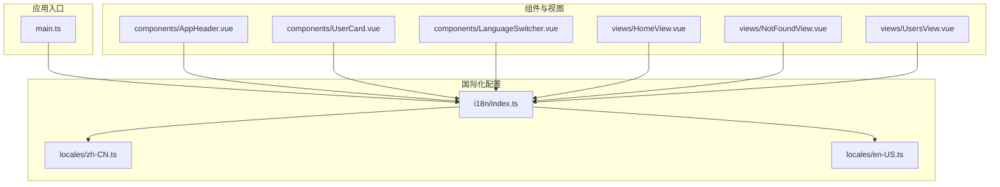
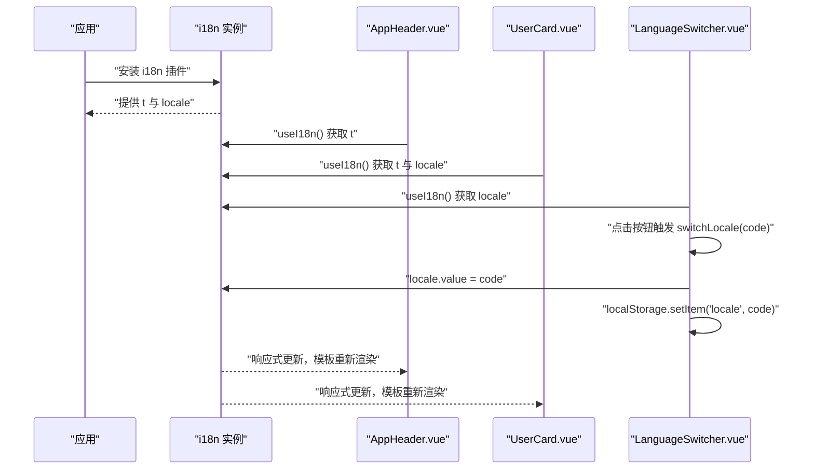
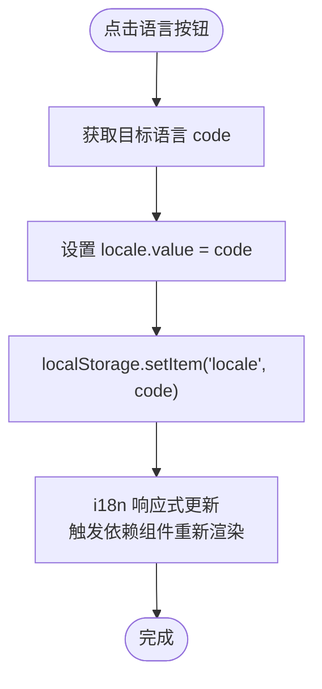
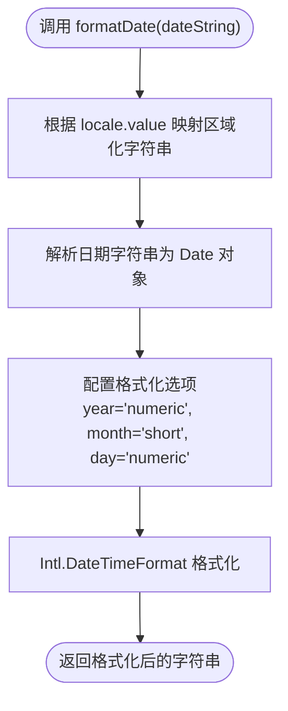
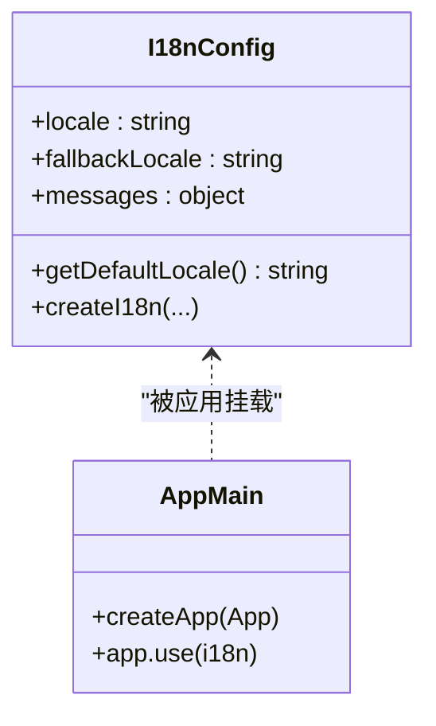
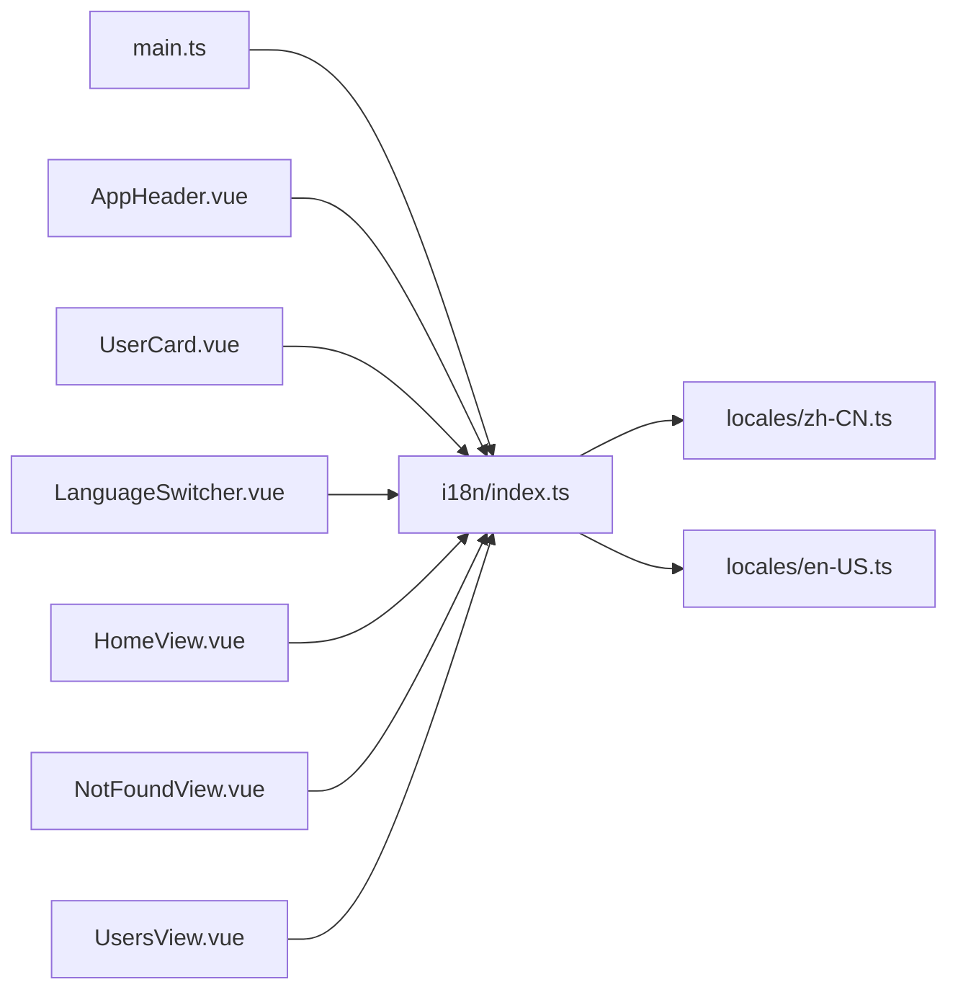

# 翻译使用与语言切换

<cite>
**本文引用的文件**
- [apps/frontend/src/i18n/index.ts](file://apps/frontend/src/i18n/index.ts)
- [apps/frontend/src/i18n/locales/en-US.ts](file://apps/frontend/src/i18n/locales/en-US.ts)
- [apps/frontend/src/i18n/locales/zh-CN.ts](file://apps/frontend/src/i18n/locales/zh-CN.ts)
- [apps/frontend/src/main.ts](file://apps/frontend/src/main.ts)
- [apps/frontend/src/components/AppHeader.vue](file://apps/frontend/src/components/AppHeader.vue)
- [apps/frontend/src/components/UserCard.vue](file://apps/frontend/src/components/UserCard.vue)
- [apps/frontend/src/components/LanguageSwitcher.vue](file://apps/frontend/src/components/LanguageSwitcher.vue)
- [apps/frontend/src/views/HomeView.vue](file://apps/frontend/src/views/HomeView.vue)
- [apps/frontend/src/views/NotFoundView.vue](file://apps/frontend/src/views/NotFoundView.vue)
- [apps/frontend/src/views/UsersView.vue](file://apps/frontend/src/views/UsersView.vue)
</cite>

## 目录
1. [简介](#简介)
2. [项目结构](#项目结构)
3. [核心组件](#核心组件)
4. [架构总览](#架构总览)
5. [详细组件分析](#详细组件分析)
6. [依赖关系分析](#依赖关系分析)
7. [性能考虑](#性能考虑)
8. [故障排查指南](#故障排查指南)
9. [结论](#结论)
10. [附录](#附录)

## 简介
本文件围绕 Vue 3 前端中的国际化实践展开，重点讲解如何在组件中使用 useI18n() 获取 $t 函数进行文本翻译，并结合模板语法直接使用 t('key') 的方式；同时深入解析 LanguageSwitcher.vue 的实现，包括如何通过 v-for 渲染语言选项、绑定点击事件调用 switchLocale 函数，以及该函数如何同步更新 locale.value 与 localStorage，从而实现语言切换的响应式与持久化。此外，文档还展示了在脚本中动态格式化日期等本地化内容的实践（如 UserCard.vue 中的 formatDate 函数），并提供处理动态参数、复数形式和嵌套键的最佳实践建议。

## 项目结构
国际化相关代码主要分布在以下位置：
- 国际化配置与消息源：apps/frontend/src/i18n/index.ts、apps/frontend/src/i18n/locales/en-US.ts、apps/frontend/src/i18n/locales/zh-CN.ts
- 应用入口：apps/frontend/src/main.ts
- 使用翻译的组件：apps/frontend/src/components/AppHeader.vue、apps/frontend/src/components/UserCard.vue、apps/frontend/src/components/LanguageSwitcher.vue
- 视图层示例：apps/frontend/src/views/HomeView.vue、apps/frontend/src/views/NotFoundView.vue、apps/frontend/src/views/UsersView.vue

图表来源
- [apps/frontend/src/i18n/index.ts](file://apps/frontend/src/i18n/index.ts#L1-L27)
- [apps/frontend/src/i18n/locales/en-US.ts](file://apps/frontend/src/i18n/locales/en-US.ts#L1-L42)
- [apps/frontend/src/i18n/locales/zh-CN.ts](file://apps/frontend/src/i18n/locales/zh-CN.ts#L1-L42)
- [apps/frontend/src/main.ts](file://apps/frontend/src/main.ts#L1-L57)
- [apps/frontend/src/components/AppHeader.vue](file://apps/frontend/src/components/AppHeader.vue#L1-L24)
- [apps/frontend/src/components/UserCard.vue](file://apps/frontend/src/components/UserCard.vue#L1-L54)
- [apps/frontend/src/components/LanguageSwitcher.vue](file://apps/frontend/src/components/LanguageSwitcher.vue#L1-L34)
- [apps/frontend/src/views/HomeView.vue](file://apps/frontend/src/views/HomeView.vue#L1-L307)
- [apps/frontend/src/views/NotFoundView.vue](file://apps/frontend/src/views/NotFoundView.vue#L1-L20)
- [apps/frontend/src/views/UsersView.vue](file://apps/frontend/src/views/UsersView.vue#L1-L41)

章节来源
- [apps/frontend/src/i18n/index.ts](file://apps/frontend/src/i18n/index.ts#L1-L27)
- [apps/frontend/src/main.ts](file://apps/frontend/src/main.ts#L1-L57)

## 核心组件
- 国际化配置与默认语言选择：i18n/index.ts 负责创建 i18n 实例、设置默认语言、回退语言与消息源，并导出实例供应用挂载。
- 语言切换器：LanguageSwitcher.vue 通过 useI18n() 获取 locale 并提供按钮列表，点击后更新 locale.value 与 localStorage，实现响应式与持久化。
- 模板中使用翻译：AppHeader.vue、UserCard.vue、HomeView.vue、NotFoundView.vue、UsersView.vue 展示了在模板中直接使用 t('key') 的方式。
- 动态本地化内容：UserCard.vue 在脚本中使用 locale 与原生 Intl.DateTimeFormat 进行日期格式化，确保按当前语言显示。

章节来源
- [apps/frontend/src/i18n/index.ts](file://apps/frontend/src/i18n/index.ts#L1-L27)
- [apps/frontend/src/components/LanguageSwitcher.vue](file://apps/frontend/src/components/LanguageSwitcher.vue#L1-L34)
- [apps/frontend/src/components/AppHeader.vue](file://apps/frontend/src/components/AppHeader.vue#L1-L24)
- [apps/frontend/src/components/UserCard.vue](file://apps/frontend/src/components/UserCard.vue#L1-L54)
- [apps/frontend/src/views/HomeView.vue](file://apps/frontend/src/views/HomeView.vue#L1-L307)
- [apps/frontend/src/views/NotFoundView.vue](file://apps/frontend/src/views/NotFoundView.vue#L1-L20)
- [apps/frontend/src/views/UsersView.vue](file://apps/frontend/src/views/UsersView.vue#L1-L41)

## 架构总览
下图展示了国际化在应用中的装配与使用流程：应用启动时挂载 i18n 实例，组件通过 useI18n() 获取 t 与 locale，模板中直接使用 t('key')，语言切换器通过更新 locale.value 与 localStorage 实现响应式与持久化。

图表来源
- [apps/frontend/src/main.ts](file://apps/frontend/src/main.ts#L1-L57)
- [apps/frontend/src/i18n/index.ts](file://apps/frontend/src/i18n/index.ts#L1-L27)
- [apps/frontend/src/components/AppHeader.vue](file://apps/frontend/src/components/AppHeader.vue#L1-L24)
- [apps/frontend/src/components/UserCard.vue](file://apps/frontend/src/components/UserCard.vue#L1-L54)
- [apps/frontend/src/components/LanguageSwitcher.vue](file://apps/frontend/src/components/LanguageSwitcher.vue#L1-L34)

## 详细组件分析

### useI18n() 在模板中使用 t('key')
- AppHeader.vue：在导航链接中直接使用 t('common.home') 与 t('common.users')，展示基础文本翻译。
- HomeView.vue：在路由链接中使用 t('home.viewUsersDemo')，并在测试逻辑中调用 t('home.title') 验证翻译可用性。
- NotFoundView.vue：在 404 页面中使用 t('notFound.title') 与 t('notFound.description')，并使用 t('common.backToHome') 返回按钮文案。
- UsersView.vue：在标题与按钮文案中使用 t('users.title') 与 t('common.loading')/t('common.refresh')，展示列表加载状态下的动态文案。

这些示例体现了在模板中直接使用 t('key') 的简洁方式，无需额外变量或计算属性即可完成翻译。

章节来源
- [apps/frontend/src/components/AppHeader.vue](file://apps/frontend/src/components/AppHeader.vue#L1-L24)
- [apps/frontend/src/views/HomeView.vue](file://apps/frontend/src/views/HomeView.vue#L1-L307)
- [apps/frontend/src/views/NotFoundView.vue](file://apps/frontend/src/views/NotFoundView.vue#L1-L20)
- [apps/frontend/src/views/UsersView.vue](file://apps/frontend/src/views/UsersView.vue#L1-L41)

### LanguageSwitcher.vue：语言切换实现与响应式机制
- 数据与状态
  - 通过 useI18n() 获取 locale，作为当前语言的响应式引用。
  - 定义语言选项数组 languages，包含 code 与 label 字段。
- 渲染与交互
  - 使用 v-for 遍历 languages，为每个语言生成按钮。
  - 通过绑定类名根据 locale 是否等于当前语言决定样式，实现“选中态”视觉反馈。
  - @click 绑定到 switchLocale 方法，传入目标语言 code。
- 切换逻辑
  - switchLocale(code) 内部：
    - 将 locale.value 设置为目标语言 code，触发响应式更新。
    - 同步写入 localStorage.setItem('locale', code)，实现持久化。
- 响应式与持久化
  - locale.value 是响应式引用，任何依赖它的组件（如 AppHeader.vue、UserCard.vue）都会自动重新渲染。
  - localStorage 的写入保证刷新后仍保持上次选择的语言。

图表来源
- [apps/frontend/src/components/LanguageSwitcher.vue](file://apps/frontend/src/components/LanguageSwitcher.vue#L1-L34)
- [apps/frontend/src/i18n/index.ts](file://apps/frontend/src/i18n/index.ts#L1-L27)

章节来源
- [apps/frontend/src/components/LanguageSwitcher.vue](file://apps/frontend/src/components/LanguageSwitcher.vue#L1-L34)
- [apps/frontend/src/i18n/index.ts](file://apps/frontend/src/i18n/index.ts#L1-L27)

### UserCard.vue：脚本中动态格式化日期的本地化实践
- 获取 t 与 locale：通过 useI18n() 同时解构 t 与 locale，用于文本翻译与日期格式化。
- formatDate 函数：
  - 接收 dateString 参数，基于 locale.value 选择合适的区域化字符串映射。
  - 使用原生 Intl.DateTimeFormat 对日期进行格式化，指定 year、month、day 等选项，确保输出符合当前语言习惯。
  - 当 locale 不在支持列表时，回退到 'en-US'，保证健壮性。
- 模板使用：在模板中将 t('users.joined') 与 formatDate(user.createdAt) 组合，展示“加入于”与对应日期。

图表来源
- [apps/frontend/src/components/UserCard.vue](file://apps/frontend/src/components/UserCard.vue#L1-L54)

章节来源
- [apps/frontend/src/components/UserCard.vue](file://apps/frontend/src/components/UserCard.vue#L1-L54)

### 国际化配置与默认语言策略
- 默认语言选择：getDefaultLocale() 优先读取 localStorage('locale')，若不存在则根据 navigator.language 判断 zh 开头为 'zh-CN'，否则为 'en-US'。
- i18n 实例：createI18n() 创建实例，legacy:false，locale 由 getDefaultLocale() 初始化，fallbackLocale 设为 'en-US'，messages 包含 zh-CN 与 en-US 两条消息源。
- 应用挂载：main.ts 中 app.use(i18n) 安装插件，使全局可使用 t 与 locale。

图表来源
- [apps/frontend/src/i18n/index.ts](file://apps/frontend/src/i18n/index.ts#L1-L27)
- [apps/frontend/src/main.ts](file://apps/frontend/src/main.ts#L1-L57)

章节来源
- [apps/frontend/src/i18n/index.ts](file://apps/frontend/src/i18n/index.ts#L1-L27)
- [apps/frontend/src/main.ts](file://apps/frontend/src/main.ts#L1-L57)

## 依赖关系分析
- 组件对 i18n 的依赖
  - AppHeader.vue、UserCard.vue、LanguageSwitcher.vue、HomeView.vue、NotFoundView.vue、UsersView.vue 均通过 useI18n() 获取 t 与 locale。
- i18n 配置对消息源的依赖
  - i18n/index.ts 引入 zh-CN 与 en-US 两条消息源，并以对象形式注入 messages。
- 应用入口对 i18n 的依赖
  - main.ts 通过 app.use(i18n) 安装插件，使全局生效。

图表来源
- [apps/frontend/src/main.ts](file://apps/frontend/src/main.ts#L1-L57)
- [apps/frontend/src/i18n/index.ts](file://apps/frontend/src/i18n/index.ts#L1-L27)
- [apps/frontend/src/i18n/locales/en-US.ts](file://apps/frontend/src/i18n/locales/en-US.ts#L1-L42)
- [apps/frontend/src/i18n/locales/zh-CN.ts](file://apps/frontend/src/i18n/locales/zh-CN.ts#L1-L42)
- [apps/frontend/src/components/AppHeader.vue](file://apps/frontend/src/components/AppHeader.vue#L1-L24)
- [apps/frontend/src/components/UserCard.vue](file://apps/frontend/src/components/UserCard.vue#L1-L54)
- [apps/frontend/src/components/LanguageSwitcher.vue](file://apps/frontend/src/components/LanguageSwitcher.vue#L1-L34)
- [apps/frontend/src/views/HomeView.vue](file://apps/frontend/src/views/HomeView.vue#L1-L307)
- [apps/frontend/src/views/NotFoundView.vue](file://apps/frontend/src/views/NotFoundView.vue#L1-L20)
- [apps/frontend/src/views/UsersView.vue](file://apps/frontend/src/views/UsersView.vue#L1-L41)

章节来源
- [apps/frontend/src/main.ts](file://apps/frontend/src/main.ts#L1-L57)
- [apps/frontend/src/i18n/index.ts](file://apps/frontend/src/i18n/index.ts#L1-L27)

## 性能考虑
- 响应式更新成本低：locale.value 是响应式引用，仅影响依赖它的组件，避免全量重渲染。
- 消息源按需加载：当前实现将 zh-CN 与 en-US 作为静态导入，适合小型项目；若消息体量较大，可考虑按需异步加载或拆分模块。
- localStorage 访问：语言切换写入 localStorage 为 O(1) 操作，开销极小；注意避免频繁写入导致主线程阻塞。
- 日期格式化：Intl.DateTimeFormat 由浏览器实现，性能稳定；若需要大量格式化，可考虑缓存常用格式化器或使用更高效的库（如 dayjs）。

## 故障排查指南
- 翻译缺失或为空
  - 检查 key 是否存在于当前语言的消息源中；例如 common.home、users.joined、notFound.title 等。
  - 若 key 不存在，fallbackLocale 会回退到 'en-US'，但可能仍为空，需补充对应键值。
- 语言切换无效
  - 确认 LanguageSwitcher.vue 中 switchLocale 是否被调用，且 locale.value 是否成功赋值。
  - 检查 localStorage 是否写入成功，若未写入，刷新后语言会恢复默认。
- 日期格式不符合预期
  - 确认 locale.value 是否为受支持的区域化字符串（'zh-CN' 或 'en-US'），否则会回退到 'en-US'。
  - 如需自定义格式，可在 formatDate 中调整 Intl 选项或引入第三方库。
- 模板中 t('key') 报错
  - 确保组件内已通过 useI18n() 解构 t，且在 <script setup> 中正确使用。
  - 避免在模板中拼接错误的键路径，建议统一在 locales 中维护键结构。

章节来源
- [apps/frontend/src/components/LanguageSwitcher.vue](file://apps/frontend/src/components/LanguageSwitcher.vue#L1-L34)
- [apps/frontend/src/components/UserCard.vue](file://apps/frontend/src/components/UserCard.vue#L1-L54)
- [apps/frontend/src/i18n/index.ts](file://apps/frontend/src/i18n/index.ts#L1-L27)

## 结论
本项目通过 i18n/index.ts 提供清晰的国际化配置与默认语言策略，配合 main.ts 的插件安装，使得各组件可以便捷地使用 useI18n() 获取 t 与 locale。LanguageSwitcher.vue 以最小实现完成语言切换的响应式与持久化，UserCard.vue 展示了在脚本中进行本地化日期格式化的实践。模板中直接使用 t('key') 的方式简洁直观，适合大多数场景。对于更复杂的本地化需求（如动态参数、复数形式、嵌套键），建议在现有基础上扩展消息源结构与工具函数，以提升可维护性与一致性。

## 附录

### 处理动态参数、复数形式与嵌套键的最佳实践
- 动态参数
  - 在消息源中使用占位符，模板中通过 t('key', { param }) 传参；或在脚本中先获取翻译字符串再自行替换。
- 复数形式
  - 对于简单复数，可在消息源中提供多个键（如 users.count_one/users.count_other），根据数量选择对应键；复杂复数规则可借助 ICU 消息格式或第三方库。
- 嵌套键
  - 采用层级命名（如 users.list.empty）或分组组织（如 users:{ list:{ empty:'...' } }），保持键路径清晰，便于查找与维护。
- 可访问性
  - 为关键文案提供语境注释，避免仅凭上下文理解含义；确保翻译覆盖所有用户可见文本。