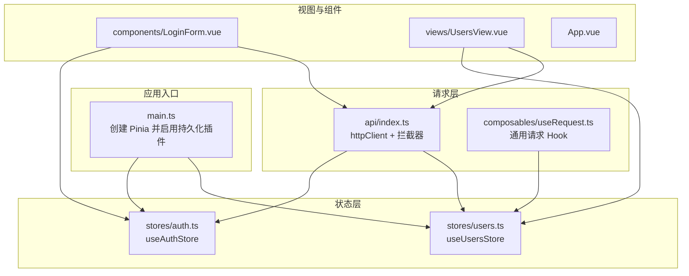
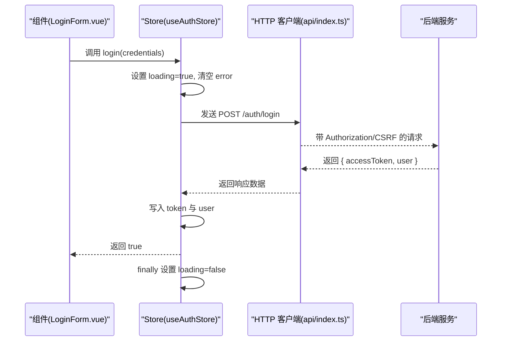
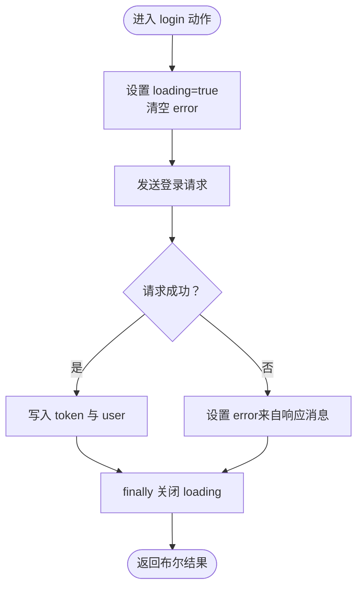
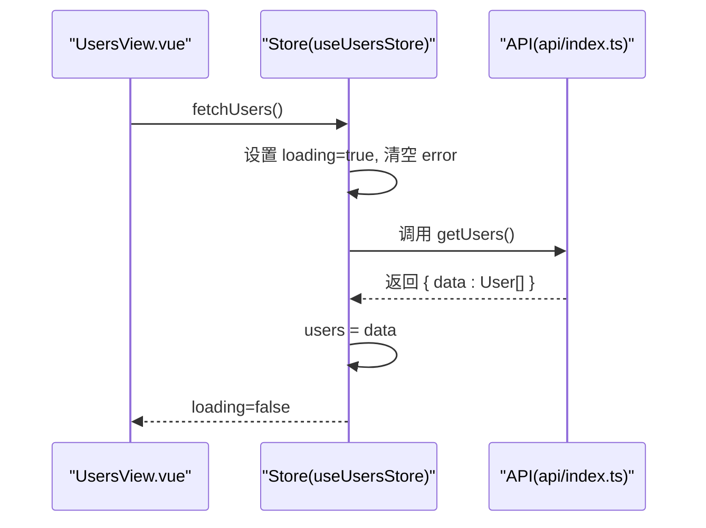
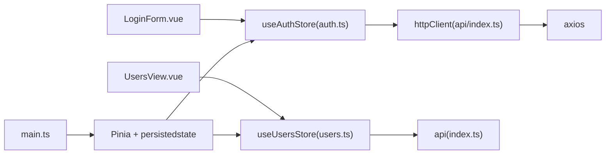

# 状态管理

<cite>
**本文引用的文件**
- [apps/frontend/src/stores/auth.ts](file://apps/frontend/src/stores/auth.ts)
- [apps/frontend/src/stores/users.ts](file://apps/frontend/src/stores/users.ts)
- [apps/frontend/src/api/index.ts](file://apps/frontend/src/api/index.ts)
- [apps/frontend/src/composables/useRequest.ts](file://apps/frontend/src/composables/useRequest.ts)
- [apps/frontend/src/main.ts](file://apps/frontend/src/main.ts)
- [apps/frontend/src/components/LoginForm.vue](file://apps/frontend/src/components/LoginForm.vue)
- [apps/frontend/src/views/UsersView.vue](file://apps/frontend/src/views/UsersView.vue)
- [apps/frontend/src/App.vue](file://apps/frontend/src/App.vue)
</cite>

## 目录
1. [简介](#简介)
2. [项目结构](#项目结构)
3. [核心组件](#核心组件)
4. [架构总览](#架构总览)
5. [详细组件分析](#详细组件分析)
6. [依赖关系分析](#依赖关系分析)
7. [性能考量](#性能考量)
8. [故障排查指南](#故障排查指南)
9. [结论](#结论)
10. [附录](#附录)

## 简介
本文件系统性地文档化了基于 Pinia 的前端状态管理模式，重点解析认证与用户两个 Store 的设计结构与使用方式，涵盖 state、actions、getters 的定义与典型使用场景；说明如何在组件中通过组合式函数安全访问状态；阐述持久化策略（localStorage 与 Pinia 插件持久化）；梳理状态变更流程控制、异步操作处理（登录、用户数据加载）以及错误状态管理；最后结合自定义 useRequest 组合式函数，展示请求封装与状态同步的最佳实践。

## 项目结构
本项目的前端采用组合式 API 与 Pinia 进行状态管理，核心文件分布如下：
- 状态层：apps/frontend/src/stores 下的 auth.ts 与 users.ts
- 请求层：apps/frontend/src/api/index.ts 提供统一的 HTTP 客户端与拦截器
- 组合式工具：apps/frontend/src/composables/useRequest.ts 封装通用请求状态
- 应用入口：apps/frontend/src/main.ts 配置 Pinia、持久化插件与 Vue Query
- 视图与组件：apps/frontend/src/views 与 apps/frontend/src/components 中的视图与表单组件

图表来源
- [apps/frontend/src/main.ts](file://apps/frontend/src/main.ts#L1-L56)
- [apps/frontend/src/stores/auth.ts](file://apps/frontend/src/stores/auth.ts#L1-L96)
- [apps/frontend/src/stores/users.ts](file://apps/frontend/src/stores/users.ts#L1-L41)
- [apps/frontend/src/api/index.ts](file://apps/frontend/src/api/index.ts#L1-L92)
- [apps/frontend/src/composables/useRequest.ts](file://apps/frontend/src/composables/useRequest.ts#L1-L43)
- [apps/frontend/src/components/LoginForm.vue](file://apps/frontend/src/components/LoginForm.vue#L1-L98)
- [apps/frontend/src/views/UsersView.vue](file://apps/frontend/src/views/UsersView.vue#L1-L66)
- [apps/frontend/src/App.vue](file://apps/frontend/src/App.vue#L1-L13)

章节来源
- [apps/frontend/src/main.ts](file://apps/frontend/src/main.ts#L1-L56)

## 核心组件
- 认证 Store（useAuthStore）
  - 状态：token、user、loading、error
  - 计算属性：isAuthenticated
  - 动作：login、logout、fetchCurrentUser、clearError
  - 持久化：仅持久化 token 字段
- 用户 Store（useUsersStore）
  - 状态：users、loading、error
  - 动作：fetchUsers
- 请求 Hook（useRequest）
  - 封装 data、loading、error 三态与 execute 执行器
- HTTP 客户端（httpClient）
  - 请求拦截器：自动注入 Authorization 与 CSRF Token
  - 响应拦截器：401 自动清理本地 token

章节来源
- [apps/frontend/src/stores/auth.ts](file://apps/frontend/src/stores/auth.ts#L1-L96)
- [apps/frontend/src/stores/users.ts](file://apps/frontend/src/stores/users.ts#L1-L41)
- [apps/frontend/src/composables/useRequest.ts](file://apps/frontend/src/composables/useRequest.ts#L1-L43)
- [apps/frontend/src/api/index.ts](file://apps/frontend/src/api/index.ts#L1-L92)

## 架构总览
下图展示了从组件到 Store、再到 API 层的整体调用链路与数据流向。

图表来源
- [apps/frontend/src/components/LoginForm.vue](file://apps/frontend/src/components/LoginForm.vue#L1-L98)
- [apps/frontend/src/stores/auth.ts](file://apps/frontend/src/stores/auth.ts#L1-L96)
- [apps/frontend/src/api/index.ts](file://apps/frontend/src/api/index.ts#L1-L92)

## 详细组件分析

### 认证 Store（useAuthStore）
- 设计要点
  - 使用 defineStore 定义组合式 Store，返回响应式状态与动作
  - 计算属性 isAuthenticated 基于 token 判断登录态
  - login 动作负责发起登录请求、设置 token 与 user，并处理错误与加载态
  - fetchCurrentUser 在有 token 时拉取当前用户信息，异常时触发 logout
  - logout 清空 token、user、error
  - clearError 用于清空全局错误
  - 持久化配置仅持久化 token 字段，避免敏感信息落盘
- 数据流与控制
  - 登录成功后，token 与 user 写入 Store，后续请求由 httpClient 自动携带 Authorization
  - 响应拦截器对 401 做兜底清理，确保前后端一致的未授权行为
- 错误处理
  - login 捕获异常并设置 error，finally 统一关闭 loading
  - fetchCurrentUser 异常时自动登出，避免脏状态
- 最佳实践
  - 在路由守卫或页面挂载时调用 fetchCurrentUser，以恢复登录态
  - 使用 isAuthenticated 控制导航与权限显示

图表来源
- [apps/frontend/src/stores/auth.ts](file://apps/frontend/src/stores/auth.ts#L1-L96)

章节来源
- [apps/frontend/src/stores/auth.ts](file://apps/frontend/src/stores/auth.ts#L1-L96)
- [apps/frontend/src/api/index.ts](file://apps/frontend/src/api/index.ts#L1-L92)

### 用户 Store（useUsersStore）
- 设计要点
  - 状态 users、loading、error
  - fetchUsers 通过 api.getUsers 拉取用户列表，统一处理加载态与错误
- 使用场景
  - UsersView 在挂载时调用 fetchUsers，支持手动刷新
  - 通过 storeToRefs 将响应式状态解构到模板，实现自动更新
- 错误与加载
  - 成功后直接赋值 users.data
  - 失败时记录 error 并输出日志，finally 关闭 loading

图表来源
- [apps/frontend/src/views/UsersView.vue](file://apps/frontend/src/views/UsersView.vue#L1-L66)
- [apps/frontend/src/stores/users.ts](file://apps/frontend/src/stores/users.ts#L1-L41)
- [apps/frontend/src/api/index.ts](file://apps/frontend/src/api/index.ts#L1-L92)

章节来源
- [apps/frontend/src/stores/users.ts](file://apps/frontend/src/stores/users.ts#L1-L41)
- [apps/frontend/src/views/UsersView.vue](file://apps/frontend/src/views/UsersView.vue#L1-L66)

### 组件中的安全访问与交互
- LoginForm.vue
  - 通过 useAuthStore 调用 login，绑定表单字段与错误提示
  - 使用 loading 禁用提交按钮，避免重复提交
  - 登录成功后跳转首页
- UsersView.vue
  - 通过 storeToRefs 解构 users、loading、error，实现响应式渲染
  - 支持点击刷新与挂载时自动加载
  - 对 error 与 loading 做 UI 层兜底展示

章节来源
- [apps/frontend/src/components/LoginForm.vue](file://apps/frontend/src/components/LoginForm.vue#L1-L98)
- [apps/frontend/src/views/UsersView.vue](file://apps/frontend/src/views/UsersView.vue#L1-L66)

### 请求封装与状态同步（useRequest）
- 设计目标
  - 封装通用的请求三态（data、loading、error）与执行器 execute
  - 统一错误处理与 finally 关闭 loading 的模式
- 适用场景
  - 适合需要独立封装某次请求的场景，或与 Pinia Store 解耦的纯请求逻辑
  - 当需要在组件内快速声明一个“只关心请求本身”的 Hook 时尤为方便
- 与 Pinia Store 的关系
  - 与 useUsersStore 的 fetchUsers 不冲突，二者可并存
  - 若需要与 Store 同步，可在 execute 内部更新 Store 的状态

章节来源
- [apps/frontend/src/composables/useRequest.ts](file://apps/frontend/src/composables/useRequest.ts#L1-L43)

### 持久化策略
- Pinia 持久化（插件）
  - 在 main.ts 中启用 pinia-plugin-persistedstate
  - useAuthStore 配置 persist.paths 仅持久化 token，降低风险
- 本地存储（localStorage）
  - api/index.ts 的请求拦截器从 localStorage 读取 token 并注入 Authorization
  - 响应拦截器对 401 做清理，保证本地与远端一致
- 最佳实践
  - 仅持久化必要且低敏感字段（如 token）
  - 在应用启动时优先恢复 Store 状态，再决定是否拉取用户信息

章节来源
- [apps/frontend/src/main.ts](file://apps/frontend/src/main.ts#L1-L56)
- [apps/frontend/src/stores/auth.ts](file://apps/frontend/src/stores/auth.ts#L1-L96)
- [apps/frontend/src/api/index.ts](file://apps/frontend/src/api/index.ts#L1-L92)

## 依赖关系分析
- 组件依赖 Store：LoginForm.vue 依赖 useAuthStore；UsersView.vue 依赖 useUsersStore
- Store 依赖 API：useAuthStore 使用 httpClient；useUsersStore 使用 api
- API 依赖 Axios：api/index.ts 基于 axios 创建 httpClient，并配置拦截器
- 应用入口依赖 Pinia：main.ts 创建 Pinia 并启用持久化插件

图表来源
- [apps/frontend/src/components/LoginForm.vue](file://apps/frontend/src/components/LoginForm.vue#L1-L98)
- [apps/frontend/src/views/UsersView.vue](file://apps/frontend/src/views/UsersView.vue#L1-L66)
- [apps/frontend/src/stores/auth.ts](file://apps/frontend/src/stores/auth.ts#L1-L96)
- [apps/frontend/src/stores/users.ts](file://apps/frontend/src/stores/users.ts#L1-L41)
- [apps/frontend/src/api/index.ts](file://apps/frontend/src/api/index.ts#L1-L92)
- [apps/frontend/src/main.ts](file://apps/frontend/src/main.ts#L1-L56)

章节来源
- [apps/frontend/src/components/LoginForm.vue](file://apps/frontend/src/components/LoginForm.vue#L1-L98)
- [apps/frontend/src/views/UsersView.vue](file://apps/frontend/src/views/UsersView.vue#L1-L66)
- [apps/frontend/src/stores/auth.ts](file://apps/frontend/src/stores/auth.ts#L1-L96)
- [apps/frontend/src/stores/users.ts](file://apps/frontend/src/stores/users.ts#L1-L41)
- [apps/frontend/src/api/index.ts](file://apps/frontend/src/api/index.ts#L1-L92)
- [apps/frontend/src/main.ts](file://apps/frontend/src/main.ts#L1-L56)

## 性能考量
- 请求去抖与并发控制
  - 对高频刷新（如 UsersView 刷新按钮）建议在组件侧做防抖或互斥控制，避免重复请求
- 缓存与重试
  - 已启用 Vue Query，默认查询缓存与重试策略，可按需调整 staleTime 与 retry
- 状态粒度
  - 将 token 单独持久化，避免 Store 过大导致序列化开销
- 渲染优化
  - 使用 storeToRefs 将响应式状态解构，减少不必要的响应式包裹
  - 在列表渲染中使用 v-if/v-else 分支，避免空列表与加载态同时渲染

## 故障排查指南
- 登录失败
  - 检查 login 动作是否正确设置 loading 与 error
  - 查看响应拦截器是否抛出 401 并清理了本地 token
- 401 未授权
  - 确认请求拦截器是否正确注入 Authorization
  - 确认响应拦截器是否移除了本地 token
- 用户列表为空
  - 检查 fetchUsers 是否被调用（挂载或点击刷新）
  - 确认 error 是否被正确捕获与显示
- 页面刷新后未保持登录
  - 确认 Pinia 持久化插件已启用且仅持久化 token
  - 确认 main.ts 中已调用 pinia.use(piniaPluginPersistedstate)

章节来源
- [apps/frontend/src/stores/auth.ts](file://apps/frontend/src/stores/auth.ts#L1-L96)
- [apps/frontend/src/stores/users.ts](file://apps/frontend/src/stores/users.ts#L1-L41)
- [apps/frontend/src/api/index.ts](file://apps/frontend/src/api/index.ts#L1-L92)
- [apps/frontend/src/main.ts](file://apps/frontend/src/main.ts#L1-L56)

## 结论
本项目采用 Pinia 组合式 Store 实现清晰的状态管理，配合 axios 拦截器与 Vue Query，构建了可靠的认证与用户数据加载流程。通过仅持久化 token 的策略与统一的错误处理机制，既保障了用户体验，也提升了安全性与可维护性。建议在后续迭代中进一步完善路由守卫与权限控制，并根据业务需求扩展 Store 的 getters 与 actions，以提升代码复用与可测试性。

## 附录
- 组件与 Store 的典型交互路径
  - 登录：LoginForm.vue -> useAuthStore.login -> httpClient -> 后端
  - 用户列表：UsersView.vue -> useUsersStore.fetchUsers -> api -> httpClient -> 后端
- 开发建议
  - 在 Store 中增加 getters 以派生常用计算值（如用户角色、权限标识）
  - 对高频请求引入 Vue Query 的查询键与缓存策略
  - 在组件中统一使用 loading/disabled 状态，避免重复提交