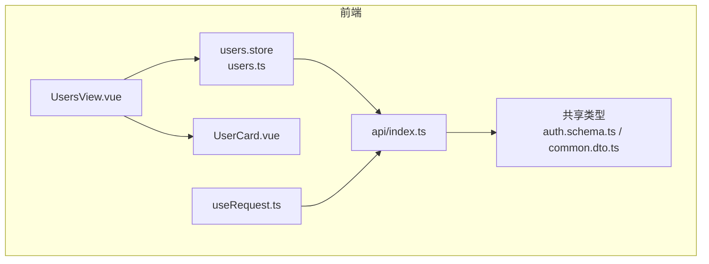
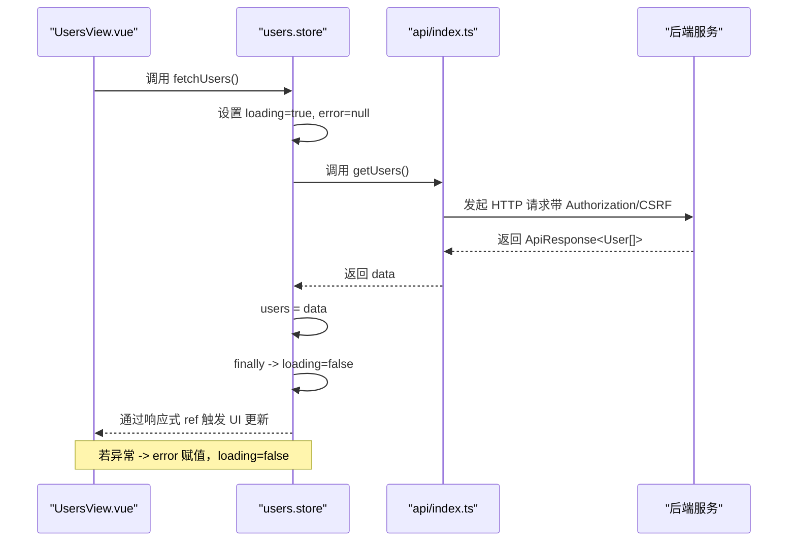
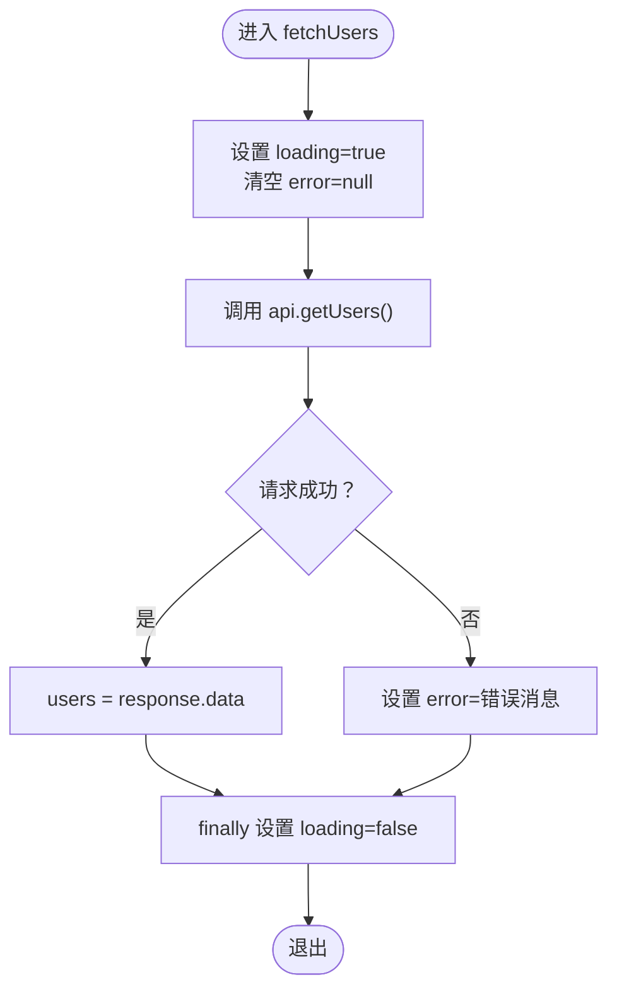
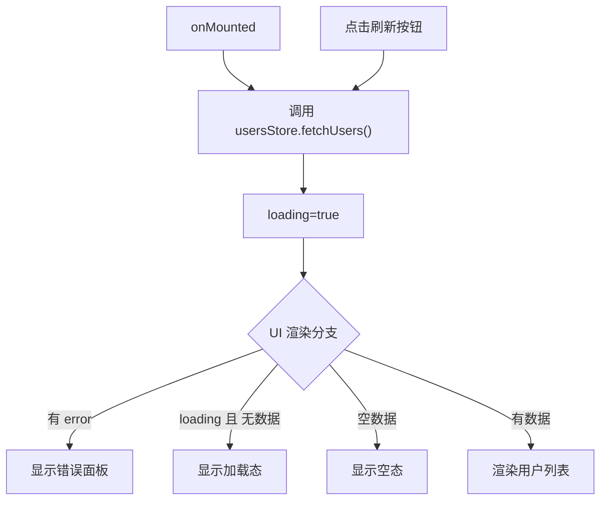
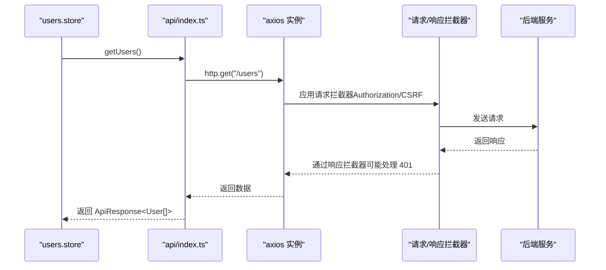
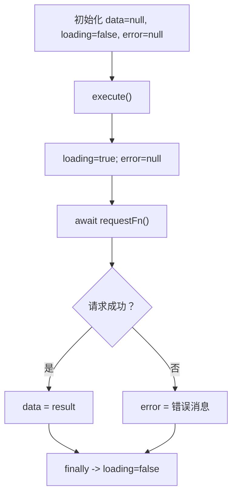
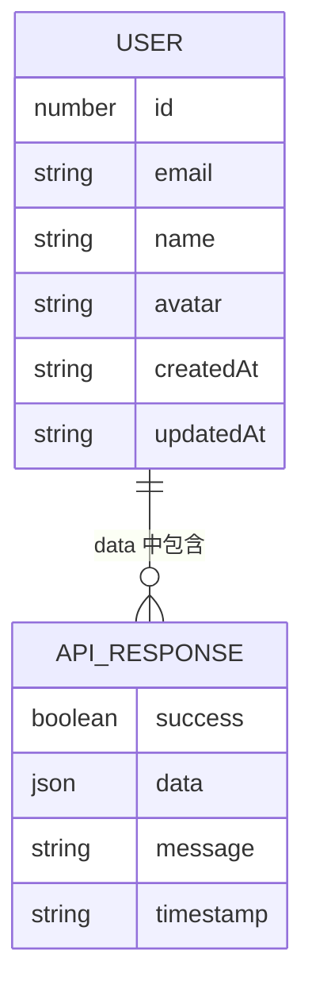
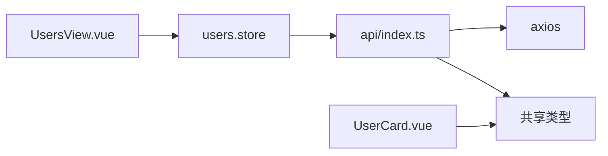

# 用户数据状态管理

<cite>
**本文引用的文件**
- [apps/frontend/src/stores/users.ts](file://apps/frontend/src/stores/users.ts)
- [apps/frontend/src/views/UsersView.vue](file://apps/frontend/src/views/UsersView.vue)
- [apps/frontend/src/composables/useRequest.ts](file://apps/frontend/src/composables/useRequest.ts)
- [apps/frontend/src/api/index.ts](file://apps/frontend/src/api/index.ts)
- [packages/shared/src/schemas/auth.schema.ts](file://packages/shared/src/schemas/auth.schema.ts)
- [packages/shared/src/dto/common.dto.ts](file://packages/shared/src/dto/common.dto.ts)
- [apps/frontend/src/components/UserCard.vue](file://apps/frontend/src/components/UserCard.vue)
- [apps/frontend/src/i18n/locales/zh-CN.ts](file://apps/frontend/src/i18n/locales/zh-CN.ts)
- [apps/frontend/src/i18n/locales/en-US.ts](file://apps/frontend/src/i18n/locales/en-US.ts)
</cite>

## 目录
1. [简介](#简介)
2. [项目结构](#项目结构)
3. [核心组件](#核心组件)
4. [架构总览](#架构总览)
5. [详细组件分析](#详细组件分析)
6. [依赖分析](#依赖分析)
7. [性能考虑](#性能考虑)
8. [故障排查指南](#故障排查指南)
9. [结论](#结论)
10. [附录](#附录)

## 简介
本文件系统性地文档化前端用户数据状态管理的设计与实现，重点围绕 Pinia Store 中的 users、loading、error 三个状态字段及其响应式更新机制；深入解析 fetchUsers 方法的调用链路、与 api 模块的协作、成功/失败分支处理以及加载状态管理；阐明该 store 与用户列表视图 UsersView.vue 的依赖关系与数据绑定方式；说明错误状态在 UI 中的传递与展示策略；结合 useRequest 组合式函数探讨请求抽象与状态管理的协同模式，并给出性能优化建议（缓存策略、防抖加载、错误重试等）。

## 项目结构
本项目的前端采用 Pinia 进行状态管理，用户数据通过独立的 users store 管理；UI 层由 UsersView.vue 负责渲染用户列表、加载态与空态；请求抽象通过 useRequest 组合式函数封装；HTTP 通信通过 api 模块完成，统一注入认证与 CSRF 令牌；共享类型定义来自 packages/shared 包。

图表来源
- [apps/frontend/src/views/UsersView.vue](file://apps/frontend/src/views/UsersView.vue#L1-L67)
- [apps/frontend/src/stores/users.ts](file://apps/frontend/src/stores/users.ts#L1-L42)
- [apps/frontend/src/composables/useRequest.ts](file://apps/frontend/src/composables/useRequest.ts#L1-L44)
- [apps/frontend/src/api/index.ts](file://apps/frontend/src/api/index.ts#L1-L92)
- [packages/shared/src/schemas/auth.schema.ts](file://packages/shared/src/schemas/auth.schema.ts#L57-L94)
- [packages/shared/src/dto/common.dto.ts](file://packages/shared/src/dto/common.dto.ts#L1-L40)

章节来源
- [apps/frontend/src/stores/users.ts](file://apps/frontend/src/stores/users.ts#L1-L42)
- [apps/frontend/src/views/UsersView.vue](file://apps/frontend/src/views/UsersView.vue#L1-L67)
- [apps/frontend/src/composables/useRequest.ts](file://apps/frontend/src/composables/useRequest.ts#L1-L44)
- [apps/frontend/src/api/index.ts](file://apps/frontend/src/api/index.ts#L1-L92)
- [packages/shared/src/schemas/auth.schema.ts](file://packages/shared/src/schemas/auth.schema.ts#L57-L94)
- [packages/shared/src/dto/common.dto.ts](file://packages/shared/src/dto/common.dto.ts#L1-L40)

## 核心组件
- users.store（users.ts）
  - 状态字段：users（用户数组）、loading（布尔加载标志）、error（字符串或 null 的错误信息）
  - 方法：fetchUsers（异步获取用户列表），内部通过 api 模块发起请求，成功时写入 users，失败时设置 error，并在 finally 中关闭 loading
- UsersView.vue
  - 通过 Pinia 的 storeToRefs 解构 users、loading、error，挂载时触发 fetchUsers；按钮点击也触发刷新；根据 loading、error、users.length 渲染不同 UI 状态
- useRequest.ts
  - 通用请求 Hook，封装 data、loading、error 三态与 execute 执行器，统一处理加载与错误
- api/index.ts
  - 基于 axios 的 HTTP 客户端，内置请求/响应拦截器（鉴权头、CSRF、401 处理），提供 getUsers 等 API 方法
- 共享类型
  - User 接口、ApiResponse 泛型、分页响应与查询参数等类型定义，确保前后端一致

章节来源
- [apps/frontend/src/stores/users.ts](file://apps/frontend/src/stores/users.ts#L1-L42)
- [apps/frontend/src/views/UsersView.vue](file://apps/frontend/src/views/UsersView.vue#L1-L67)
- [apps/frontend/src/composables/useRequest.ts](file://apps/frontend/src/composables/useRequest.ts#L1-L44)
- [apps/frontend/src/api/index.ts](file://apps/frontend/src/api/index.ts#L1-L92)
- [packages/shared/src/schemas/auth.schema.ts](file://packages/shared/src/schemas/auth.schema.ts#L57-L94)
- [packages/shared/src/dto/common.dto.ts](file://packages/shared/src/dto/common.dto.ts#L1-L40)

## 架构总览
用户数据从后端 API 返回，经 api 模块封装，进入 users.store 的 fetchUsers 流程，最终驱动 UsersView.vue 的渲染。useRequest 提供了可复用的请求抽象能力，可在其他场景中替代 store 内部的同步状态管理。

图表来源
- [apps/frontend/src/views/UsersView.vue](file://apps/frontend/src/views/UsersView.vue#L1-L67)
- [apps/frontend/src/stores/users.ts](file://apps/frontend/src/stores/users.ts#L1-L42)
- [apps/frontend/src/api/index.ts](file://apps/frontend/src/api/index.ts#L1-L92)

## 详细组件分析

### users.store 设计与实现
- 状态字段
  - users：ref<User[]>([])，存储用户列表
  - loading：ref(false)，控制加载态
  - error：ref<string|null>(null)，保存错误信息
- fetchUsers 实现要点
  - 进入时将 loading 置为 true，error 置为 null
  - 调用 api.getUsers() 获取数据
  - 成功：将 response.data 赋给 users
  - 异常：捕获错误，设置 error 为错误消息或默认提示，并打印日志
  - finally：无论成功与否，都将 loading 置为 false
- 返回值：导出 users、loading、error、fetchUsers，便于在组件中直接使用

图表来源
- [apps/frontend/src/stores/users.ts](file://apps/frontend/src/stores/users.ts#L1-L42)

章节来源
- [apps/frontend/src/stores/users.ts](file://apps/frontend/src/stores/users.ts#L1-L42)

### UsersView.vue 与 store 的绑定关系
- 依赖注入
  - 引入 useUsersStore 并通过 storeToRefs 解构 users、loading、error
  - 引入 UserCard 子组件用于逐项渲染
- 生命周期与交互
  - onMounted 时自动拉取用户列表
  - 顶部按钮点击时再次触发 fetchUsers；按钮 disabled 绑定 loading
- UI 状态分支
  - error 存在时显示红色错误面板
  - loading 且 users 为空时显示加载动画与文案
  - users 为空时显示空态占位
  - 否则按网格渲染 UserCard 列表

图表来源
- [apps/frontend/src/views/UsersView.vue](file://apps/frontend/src/views/UsersView.vue#L1-L67)
- [apps/frontend/src/components/UserCard.vue](file://apps/frontend/src/components/UserCard.vue#L1-L54)

章节来源
- [apps/frontend/src/views/UsersView.vue](file://apps/frontend/src/views/UsersView.vue#L1-L67)
- [apps/frontend/src/components/UserCard.vue](file://apps/frontend/src/components/UserCard.vue#L1-L54)

### api 模块与后端接口协作
- HTTP 客户端
  - baseURL 为 /api，超时 10 秒，JSON 默认头
- 请求拦截器
  - 自动注入 Authorization: Bearer token（localStorage）
  - 非 GET 请求注入 X-XSRF-TOKEN（cookie）
- 响应拦截器
  - 401 时清理本地 token，便于统一处理未授权
- API 方法
  - getUsers：GET /users，返回 ApiResponse<User[]>
  - getUser：GET /users/:id
  - createUser：POST /users

图表来源
- [apps/frontend/src/api/index.ts](file://apps/frontend/src/api/index.ts#L1-L92)

章节来源
- [apps/frontend/src/api/index.ts](file://apps/frontend/src/api/index.ts#L1-L92)

### useRequest 组合式函数与请求抽象
- 能力概述
  - 提供 data、loading、error 三态 ref
  - execute 函数统一处理加载与错误，finally 关闭 loading
- 适用场景
  - 可用于替代 store 内部的同步状态管理，将“请求抽象”与“状态管理”解耦
  - 适合一次性请求或非持久化状态的场景
- 与 users.store 的关系
  - users.store 的 fetchUsers 是“持久化状态 + 业务流程”的实现
  - useRequest 更偏向“请求封装 + UI 状态”，两者互补

图表来源
- [apps/frontend/src/composables/useRequest.ts](file://apps/frontend/src/composables/useRequest.ts#L1-L44)

章节来源
- [apps/frontend/src/composables/useRequest.ts](file://apps/frontend/src/composables/useRequest.ts#L1-L44)

### 类型与数据模型
- User 类型
  - 来源于共享包的 UserSchema，包含 id、email、name、avatar、createdAt、updatedAt
- ApiResponse 泛型
  - 通用响应结构：success、data、message、timestamp
- 分页与查询
  - 提供 PaginatedResponse 与 PaginationQuery 类型，便于扩展分页场景

图表来源
- [packages/shared/src/schemas/auth.schema.ts](file://packages/shared/src/schemas/auth.schema.ts#L57-L94)
- [packages/shared/src/dto/common.dto.ts](file://packages/shared/src/dto/common.dto.ts#L1-L40)

章节来源
- [packages/shared/src/schemas/auth.schema.ts](file://packages/shared/src/schemas/auth.schema.ts#L57-L94)
- [packages/shared/src/dto/common.dto.ts](file://packages/shared/src/dto/common.dto.ts#L1-L40)

## 依赖分析
- 组件耦合
  - UsersView.vue 依赖 users.store 的 users、loading、error 与 fetchUsers
  - UserCard.vue 依赖 User 类型进行渲染
- 状态管理
  - users.store 与 UsersView.vue 之间通过 Pinia 响应式绑定，实现单向数据流
- 请求层
  - api/index.ts 对 axios 进行统一封装，集中处理鉴权与 CSRF
- 类型一致性
  - 共享类型保证前后端对 User、ApiResponse 的理解一致

图表来源
- [apps/frontend/src/views/UsersView.vue](file://apps/frontend/src/views/UsersView.vue#L1-L67)
- [apps/frontend/src/stores/users.ts](file://apps/frontend/src/stores/users.ts#L1-L42)
- [apps/frontend/src/api/index.ts](file://apps/frontend/src/api/index.ts#L1-L92)
- [apps/frontend/src/components/UserCard.vue](file://apps/frontend/src/components/UserCard.vue#L1-L54)
- [packages/shared/src/schemas/auth.schema.ts](file://packages/shared/src/schemas/auth.schema.ts#L57-L94)

章节来源
- [apps/frontend/src/views/UsersView.vue](file://apps/frontend/src/views/UsersView.vue#L1-L67)
- [apps/frontend/src/stores/users.ts](file://apps/frontend/src/stores/users.ts#L1-L42)
- [apps/frontend/src/api/index.ts](file://apps/frontend/src/api/index.ts#L1-L92)
- [apps/frontend/src/components/UserCard.vue](file://apps/frontend/src/components/UserCard.vue#L1-L54)
- [packages/shared/src/schemas/auth.schema.ts](file://packages/shared/src/schemas/auth.schema.ts#L57-L94)

## 性能考虑
- 数据缓存策略
  - 在 users.store 中增加缓存：当 users 非空且未过期时直接返回，避免重复请求
  - 可引入 TTL 或基于版本号的缓存失效机制
- 防抖加载
  - 在高频触发的刷新场景（如快速点击按钮）使用防抖，减少不必要的网络请求
- 错误重试机制
  - 对幂等请求（如 GET）在特定错误码下自动重试，配合指数退避
- UI 体验
  - 加载态与骨架屏结合，提升感知性能
  - 长列表虚拟滚动（如后续扩展）

[本节为通用性能建议，不直接分析具体文件，故无章节来源]

## 故障排查指南
- 常见问题定位
  - 401 未授权：响应拦截器会清理本地 token，检查登录状态与后端鉴权
  - CSRF 校验失败：确认 cookie 中 XSRF-TOKEN 是否存在，且非 GET 请求已注入
  - 网络超时/连接失败：检查 baseURL 与后端连通性
- UI 展示策略
  - UsersView.vue 在 error 存在时显示红色错误面板；loading 且无数据时显示加载动画；空数据时显示空态
  - 国际化文案来自 zh-CN.ts 与 en-US.ts，确保多语言一致
- 日志与调试
  - users.store 在 catch 分支会输出错误日志，便于定位异常

章节来源
- [apps/frontend/src/api/index.ts](file://apps/frontend/src/api/index.ts#L1-L92)
- [apps/frontend/src/views/UsersView.vue](file://apps/frontend/src/views/UsersView.vue#L1-L67)
- [apps/frontend/src/i18n/locales/zh-CN.ts](file://apps/frontend/src/i18n/locales/zh-CN.ts#L1-L42)
- [apps/frontend/src/i18n/locales/en-US.ts](file://apps/frontend/src/i18n/locales/en-US.ts#L1-L42)

## 结论
users.store 以简洁的状态字段与明确的生命周期管理实现了用户列表的数据流控制；fetchUsers 通过 api 模块与后端交互，统一处理成功与失败分支，并在 finally 中确保 loading 状态正确收尾。UsersView.vue 通过响应式绑定与多态 UI 展示，提供了良好的用户体验。useRequest 为请求抽象提供了可复用的模式，可在不同场景下与 Pinia 状态管理协同工作。未来可在缓存、防抖与重试等方面进一步优化，以提升性能与稳定性。

[本节为总结性内容，不直接分析具体文件，故无章节来源]

## 附录
- 相关文件路径参考
  - [users.store](file://apps/frontend/src/stores/users.ts#L1-L42)
  - [UsersView.vue](file://apps/frontend/src/views/UsersView.vue#L1-L67)
  - [useRequest.ts](file://apps/frontend/src/composables/useRequest.ts#L1-L44)
  - [api/index.ts](file://apps/frontend/src/api/index.ts#L1-L92)
  - [User 类型定义](file://packages/shared/src/schemas/auth.schema.ts#L57-L94)
  - [ApiResponse 类型定义](file://packages/shared/src/dto/common.dto.ts#L1-L40)
  - [UserCard.vue](file://apps/frontend/src/components/UserCard.vue#L1-L54)
  - [中文文案](file://apps/frontend/src/i18n/locales/zh-CN.ts#L1-L42)
  - [英文文案](file://apps/frontend/src/i18n/locales/en-US.ts#L1-L42)

[本节为索引性内容，不直接分析具体文件，故无章节来源]