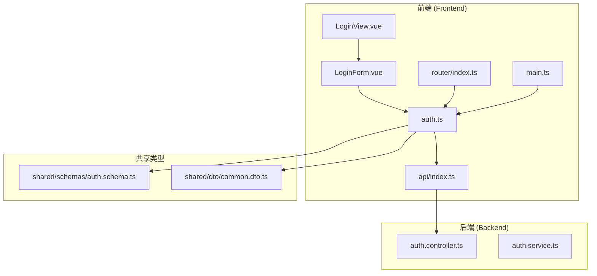
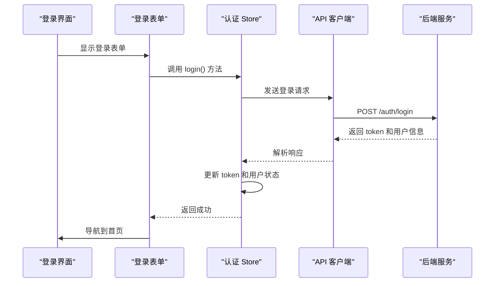
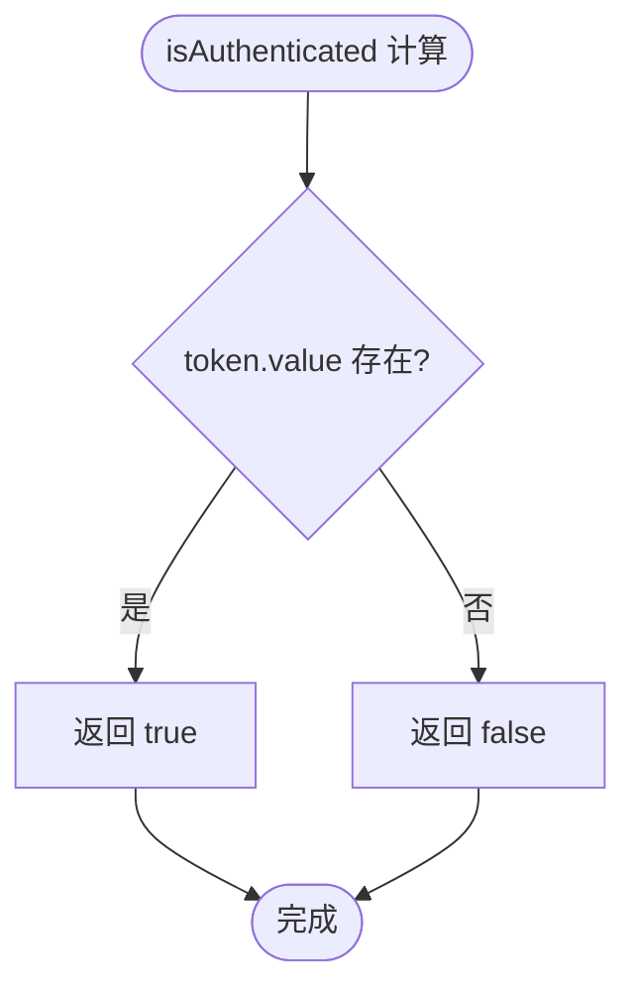
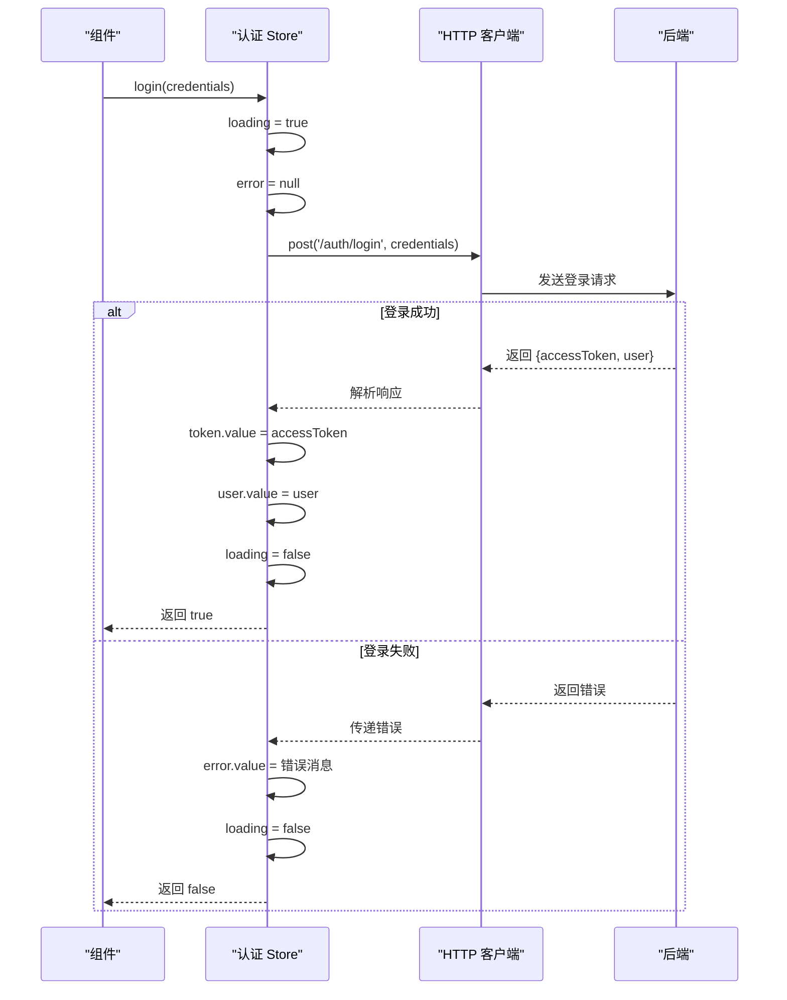
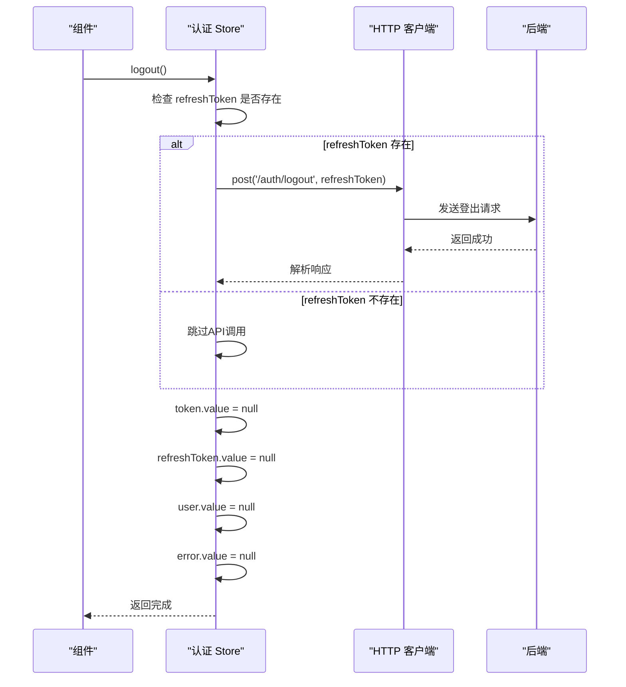
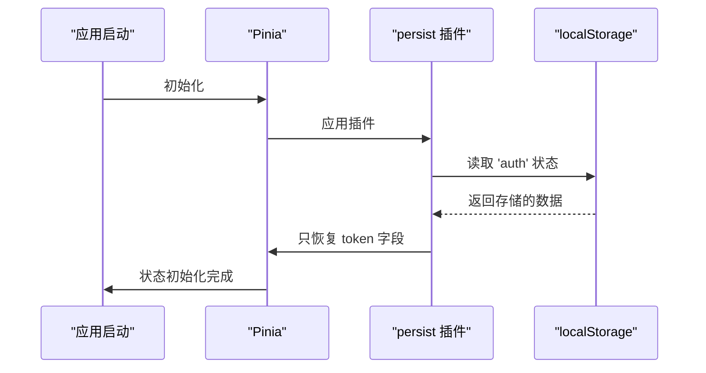
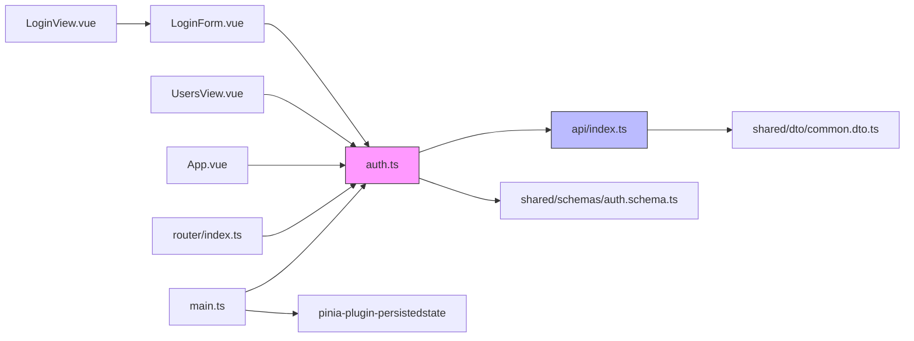
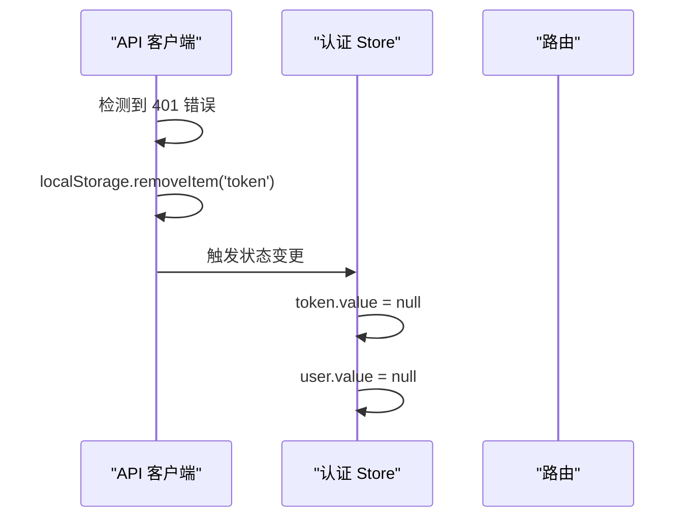
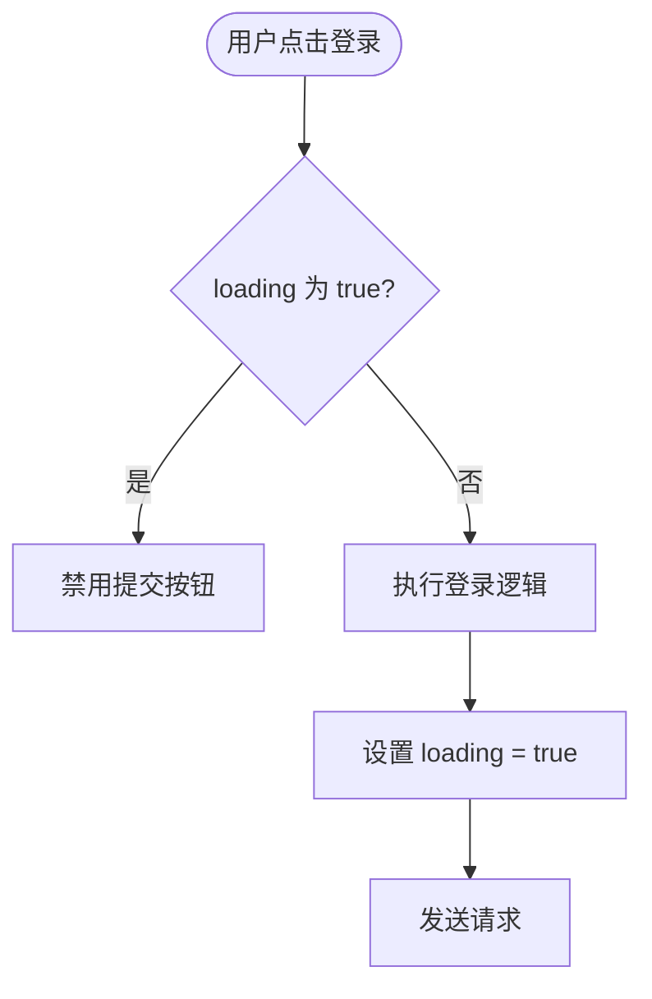

# 认证状态管理

<cite>
**本文档引用的文件**
- [auth.ts](file://apps/frontend/src/stores/auth.ts)
- [api/index.ts](file://apps/frontend/src/api/index.ts)
- [main.ts](file://apps/frontend/src/main.ts)
- [LoginForm.vue](file://apps/frontend/src/components/LoginForm.vue)
- [LoginView.vue](file://apps/frontend/src/views/LoginView.vue)
- [router/index.ts](file://apps/frontend/src/router/index.ts)
- [common.dto.ts](file://packages/shared/src/dto/common.dto.ts)
- [auth.schema.ts](file://packages/shared/src/schemas/auth.schema.ts)
- [auth.controller.ts](file://apps/backend/src/auth/auth.controller.ts)
- [auth.service.ts](file://apps/backend/src/auth/auth.service.ts)
</cite>

## 更新摘要
**已做更改**
- 更新了 `logout` 方法的文档，说明其已从同步操作改为异步操作
- 增加了对后端登出API调用及刷新令牌吊销机制的说明
- 更新了登出流程的序列图以反映异步行为
- 补充了登出操作中“最佳努力”原则和静默错误处理的说明

## 目录

1. [项目结构](#项目结构)
2. [核心组件](#核心组件)
3. [架构概述](#架构概述)
4. [详细组件分析](#详细组件分析)
5. [依赖分析](#依赖分析)
6. [性能考虑](#性能考虑)
7. [故障排除指南](#故障排除指南)
8. [结论](#结论)

## 项目结构

项目采用前后端分离架构，前端使用 Vue 3 + Pinia 实现状态管理，后端使用 NestJS 提供 RESTful API。认证状态管理主要集中在前端 `stores` 模块中。



**图示来源**
- [auth.ts](file://apps/frontend/src/stores/auth.ts)
- [api/index.ts](file://apps/frontend/src/api/index.ts)
- [router/index.ts](file://apps/frontend/src/router/index.ts)
- [auth.schema.ts](file://packages/shared/src/schemas/auth.schema.ts)

**本节来源**
- [auth.ts](file://apps/frontend/src/stores/auth.ts)
- [api/index.ts](file://apps/frontend/src/api/index.ts)

## 核心组件

认证状态管理的核心是 `useAuthStore`，它使用 Pinia 管理用户认证相关的状态，包括 token、用户信息、加载状态和错误信息。该 store 实现了完整的登录、登出、获取当前用户等业务逻辑，并通过 Pinia 持久化插件实现 token 的本地存储。

**本节来源**
- [auth.ts](file://apps/frontend/src/stores/auth.ts#L1-L97)

## 架构概述

系统采用分层架构，从用户界面到持久化存储形成完整的认证管理闭环。认证状态在组件、store、API 客户端和服务器之间流动，确保状态的一致性和安全性。



**图示来源**
- [LoginForm.vue](file://apps/frontend/src/components/LoginForm.vue#L1-L99)
- [auth.ts](file://apps/frontend/src/stores/auth.ts#L25-L40)
- [api/index.ts](file://apps/frontend/src/api/index.ts#L7-L13)

## 详细组件分析

### 认证 Store 分析

`useAuthStore` 是应用认证系统的核心，负责管理所有与用户认证相关的状态和行为。

#### 状态字段定义

认证 store 定义了四个核心状态字段，每个字段都有明确的业务含义和响应式特性：

```mermaid
classDiagram
class AuthStore {
+token : Ref<string | null>
+user : Ref<User | null>
+loading : Ref<boolean>
+error : Ref<string | null>
+isAuthenticated : ComputedRef<boolean>
+login(credentials) : Promise<boolean>
+logout() : void
+fetchCurrentUser() : Promise<void>
+clearError() : void
}
note right of AuthStore : : token
存储 JWT 访问令牌
初始值为 null
通过持久化插件保存到 localStorage
end note
note right of AuthStore : : user
存储当前用户信息
初始值为 null
登录成功后填充
end note
note right of AuthStore : : loading
表示异步操作进行中
在登录、获取用户信息时设置为 true
使用 finally 确保最终重置
end note
note right of AuthStore : : error
存储错误消息
初始值为 null
操作失败时设置，可被 clearError 清除
end note
```

**图示来源**
- [auth.ts](file://apps/frontend/src/stores/auth.ts#L14-L17)

**本节来源**
- [auth.ts](file://apps/frontend/src/stores/auth.ts#L14-L17)

#### 计算属性分析

`isAuthenticated` 计算属性是判断用户登录状态的关键指标，它基于 token 的存在性进行计算。



**图示来源**
- [auth.ts](file://apps/frontend/src/stores/auth.ts#L20)

**本节来源**
- [auth.ts](file://apps/frontend/src/stores/auth.ts#L20)

### 核心方法执行流程

#### 登录方法流程

`login` 方法处理用户登录的完整流程，包括请求发送、状态更新和错误处理。



**图示来源**
- [auth.ts](file://apps/frontend/src/stores/auth.ts#L25-L40)
- [api/index.ts](file://apps/frontend/src/api/index.ts#L7-L13)

#### 获取当前用户流程

`fetchCurrentUser` 方法用于在应用初始化时获取当前用户信息，处理 token 失效的情况。**更新说明：该方法现在正确处理 API 响应对象，先获取完整响应再提取数据**。

```mermaid
flowchart TD
A([开始]) --> B{"token 存在?"}
B --> |否| C([直接返回])
B --> |是| D[发送 GET /auth/me 请求]
D --> E{"请求成功?"}
E --> |是| F[更新 user.value]
E --> |否| G[调用 logout()]
F --> H([结束])
G --> H
```

**图示来源**
- [auth.ts](file://apps/frontend/src/stores/auth.ts#L46-L57)
- [api/index.ts](file://apps/frontend/src/api/index.ts#L187-L189)

**本节来源**
- [auth.ts](file://apps/frontend/src/stores/auth.ts#L25-L67)
- [api/index.ts](file://apps/frontend/src/api/index.ts#L187-L189)

#### 登出方法流程

`logout` 方法已从同步操作改为异步操作，现在会尝试调用后端的退出登录API以吊销刷新令牌，采用'最佳努力'方式并静默处理网络错误。



**图示来源**
- [auth.ts](file://apps/frontend/src/stores/auth.ts#L141-L154)
- [api/index.ts](file://apps/frontend/src/api/index.ts#L246-L254)
- [auth.controller.ts](file://apps/backend/src/auth/auth.controller.ts#L99-L105)
- [auth.service.ts](file://apps/backend/src/auth/auth.service.ts#L278-L297)

**本节来源**
- [auth.ts](file://apps/frontend/src/stores/auth.ts#L141-L154)
- [api/index.ts](file://apps/frontend/src/api/index.ts#L246-L254)
- [auth.controller.ts](file://apps/backend/src/auth/auth.controller.ts#L99-L105)
- [auth.service.ts](file://apps/backend/src/auth/auth.service.ts#L278-L297)

### 持久化机制分析

Pinia persist 插件实现了 token 的持久化存储，确保用户刷新页面后仍保持登录状态。



**图示来源**
- [auth.ts](file://apps/frontend/src/stores/auth.ts#L91-L94)
- [main.ts](file://apps/frontend/src/main.ts#L34-L36)

**本节来源**
- [auth.ts](file://apps/frontend/src/stores/auth.ts#L91-L94)
- [main.ts](file://apps/frontend/src/main.ts#L34-L36)

## 依赖分析

认证系统与其他模块存在明确的依赖关系，形成清晰的调用链路。



**图示来源**
- [auth.ts](file://apps/frontend/src/stores/auth.ts)
- [main.ts](file://apps/frontend/src/main.ts)
- [LoginForm.vue](file://apps/frontend/src/components/LoginForm.vue)

**本节来源**
- [auth.ts](file://apps/frontend/src/stores/auth.ts)
- [main.ts](file://apps/frontend/src/main.ts)

## 性能考虑

认证系统的性能主要体现在响应速度、内存使用和网络优化三个方面。通过合理的状态管理和错误处理机制，系统能够在保证安全性的同时提供良好的用户体验。

## 故障排除指南

### Token 过期自动清理

当 API 返回 401 未授权错误时，系统会自动清理 token 并重定向到登录页面：



**本节来源**
- [api/index.ts](file://apps/frontend/src/api/index.ts#L46-L55)

### 重复登录请求处理

系统通过 loading 状态防止重复提交，确保同一时间只有一个登录请求在进行：



**本节来源**
- [LoginForm.vue](file://apps/frontend/src/components/LoginForm.vue#L88)
- [auth.ts](file://apps/frontend/src/stores/auth.ts#L26)

### 状态初始化异常

应用启动时，持久化插件会自动从 localStorage 恢复 token 状态，但不会恢复其他敏感信息：

```mermaid
flowchart TD
A([应用启动]) --> B[Pinia 初始化]
B --> C[persist 插件读取存储]
C --> D[只恢复 token 字段]
D --> E[其他状态保持初始值]
E --> F[调用 fetchCurrentUser()]
F --> G{"token 有效?"}
G --> |是| H[填充用户信息]
G --> |否| I[保持未登录状态]
```

**本节来源**
- [auth.ts](file://apps/frontend/src/stores/auth.ts#L91-L94)
- [main.ts](file://apps/frontend/src/main.ts#L34-L36)

## 结论

认证状态管理系统通过 Pinia 提供了响应式的状态管理能力，结合持久化插件实现了安全的 token 存储。系统设计考虑了用户体验和安全性，通过合理的状态字段划分、错误处理机制和持久化策略，构建了一个健壮的认证解决方案。各组件之间的职责清晰，依赖关系明确，便于维护和扩展。