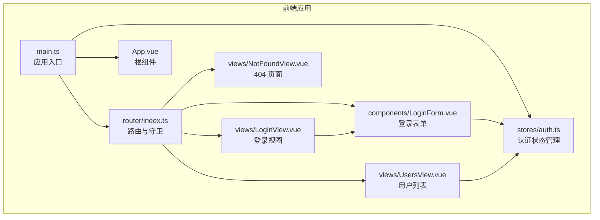
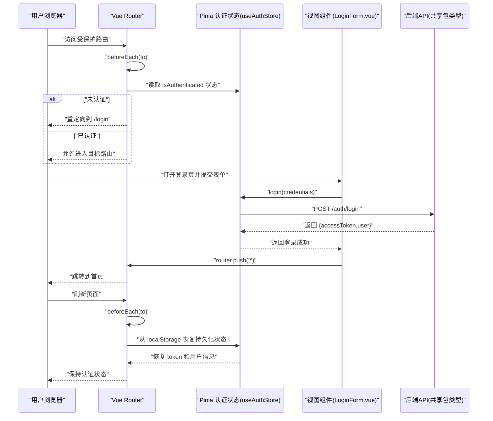
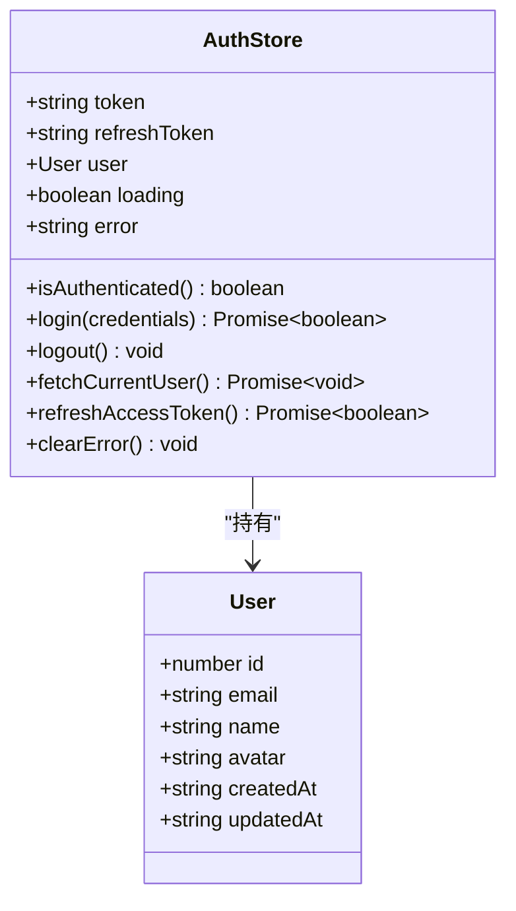
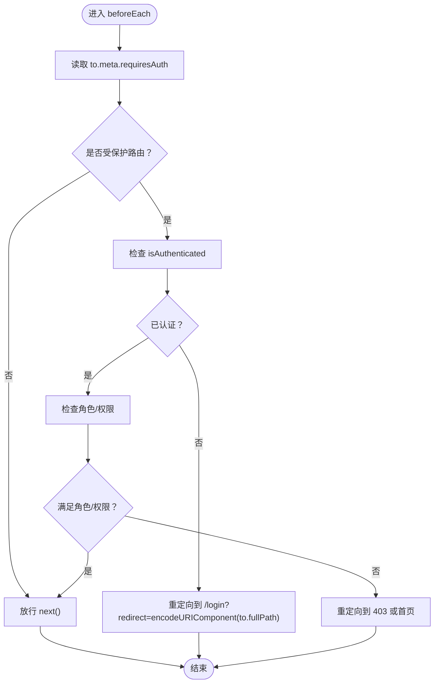
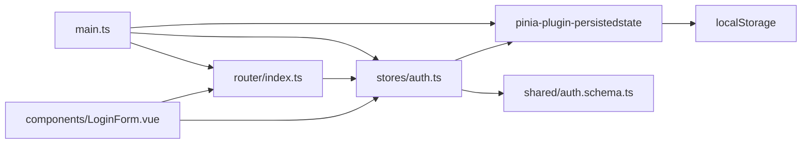

# 导航守卫与权限控制

<cite>
**本文引用的文件**
- [apps/frontend/src/router/index.ts](file://apps/frontend/src/router/index.ts)
- [apps/frontend/src/stores/auth.ts](file://apps/frontend/src/stores/auth.ts)
- [apps/frontend/src/main.ts](file://apps/frontend/src/main.ts)
- [apps/frontend/src/components/LoginForm.vue](file://apps/frontend/src/components/LoginForm.vue)
- [apps/frontend/src/views/LoginView.vue](file://apps/frontend/src/views/LoginView.vue)
- [apps/frontend/src/views/UsersView.vue](file://apps/frontend/src/views/UsersView.vue)
- [apps/frontend/src/views/NotFoundView.vue](file://apps/frontend/src/views/NotFoundView.vue)
- [apps/frontend/src/App.vue](file://apps/frontend/src/App.vue)
- [packages/shared/src/schemas/auth.schema.ts](file://packages/shared/src/schemas/auth.schema.ts)
</cite>

## 更新摘要
**已做更改**
- 更新了“路由守卫与页面标题更新”和“登录流程与重定向”部分，以反映登录后跳转逻辑的变更
- 新增“持久化认证状态与页面刷新恢复”部分，说明如何通过 Pinia 持久化插件和 localStorage 检查恢复会话
- 新增“防止已认证用户访问登录页”部分，描述路由守卫中新增的防护逻辑
- 更新架构总览序列图以反映完整的认证流程
- 更新依赖关系分析图以包含持久化机制

## 目录
1. [简介](#简介)
2. [项目结构](#项目结构)
3. [核心组件](#核心组件)
4. [架构总览](#架构总览)
5. [详细组件分析](#详细组件分析)
6. [依赖关系分析](#依赖关系分析)
7. [性能考量](#性能考量)
8. [故障排查指南](#故障排查指南)
9. [结论](#结论)
10. [附录](#附录)

## 简介
本文件围绕 Vue Router 导航守卫的实现进行深入解析，重点覆盖全局前置守卫 beforeEach 的使用方式与最佳实践。结合 Pinia 状态管理中的 auth store，文档阐述如何通过路由元信息（meta.requiresAuth）判断是否需要身份验证，并在未授权访问时自动重定向至登录页，同时记录原始目标路径以便登录后跳转。此外，提供异步状态检查的正确写法，避免无限重定向等常见问题；并给出调试技巧与权限扩展建议（如基于角色的细粒度路由控制）。

## 项目结构
前端采用 Vite + Vue 3 + Pinia + Vue Router 4 架构，路由与状态管理集中在 apps/frontend 目录。应用入口在 main.ts 中初始化 Pinia、Router、国际化与查询客户端；路由配置在 router/index.ts 中完成；认证状态在 stores/auth.ts 中集中管理；登录表单与视图分别在 components/LoginForm.vue 与 views/LoginView.vue 中实现；用户列表页在 views/UsersView.vue 中展示；404 页面在 views/NotFoundView.vue 中处理。

图表来源
- [apps/frontend/src/main.ts](file://apps/frontend/src/main.ts#L1-L57)
- [apps/frontend/src/router/index.ts](file://apps/frontend/src/router/index.ts#L1-L44)
- [apps/frontend/src/stores/auth.ts](file://apps/frontend/src/stores/auth.ts#L1-L97)
- [apps/frontend/src/components/LoginForm.vue](file://apps/frontend/src/components/LoginForm.vue#L1-L99)
- [apps/frontend/src/views/LoginView.vue](file://apps/frontend/src/views/LoginView.vue#L1-L8)
- [apps/frontend/src/views/UsersView.vue](file://apps/frontend/src/views/UsersView.vue#L1-L67)
- [apps/frontend/src/views/NotFoundView.vue](file://apps/frontend/src/views/NotFoundView.vue#L1-L21)
- [apps/frontend/src/App.vue](file://apps/frontend/src/App.vue#L1-L14)

章节来源
- [apps/frontend/src/main.ts](file://apps/frontend/src/main.ts#L1-L57)
- [apps/frontend/src/router/index.ts](file://apps/frontend/src/router/index.ts#L1-L44)

## 核心组件
- 路由与守卫：在 router/index.ts 中定义了基础路由与全局前置守卫 beforeEach，用于更新页面标题。
- 认证状态管理：在 stores/auth.ts 中定义了 useAuthStore，包含 token、user、loading、error 等状态，以及 isAuthenticated 计算属性、login、logout、fetchCurrentUser 等方法。
- 登录流程：LoginForm.vue 调用 useAuthStore.login 完成登录，登录成功后通过 router.push('/') 返回首页。
- 页面视图：LoginView.vue、UsersView.vue、NotFoundView.vue 分别对应登录、用户列表与 404 页面。

章节来源
- [apps/frontend/src/router/index.ts](file://apps/frontend/src/router/index.ts#L1-L44)
- [apps/frontend/src/stores/auth.ts](file://apps/frontend/src/stores/auth.ts#L1-L97)
- [apps/frontend/src/components/LoginForm.vue](file://apps/frontend/src/components/LoginForm.vue#L1-L99)
- [apps/frontend/src/views/LoginView.vue](file://apps/frontend/src/views/LoginView.vue#L1-L8)
- [apps/frontend/src/views/UsersView.vue](file://apps/frontend/src/views/UsersView.vue#L1-L67)
- [apps/frontend/src/views/NotFoundView.vue](file://apps/frontend/src/views/NotFoundView.vue#L1-L21)

## 架构总览
下图展示了从前端路由到 Pinia 认证状态再到后端 API 的调用链路，以及登录成功后的跳转行为。

图表来源
- [apps/frontend/src/router/index.ts](file://apps/frontend/src/router/index.ts#L36-L41)
- [apps/frontend/src/stores/auth.ts](file://apps/frontend/src/stores/auth.ts#L25-L41)
- [apps/frontend/src/components/LoginForm.vue](file://apps/frontend/src/components/LoginForm.vue#L23-L28)
- [packages/shared/src/schemas/auth.schema.ts](file://packages/shared/src/schemas/auth.schema.ts#L73-L78)

## 详细组件分析

### 路由守卫与页面标题更新
- 路由守卫 beforeEach 会读取 to.meta.title 并更新 document.title，为每个页面设置统一的标题格式。
- 当前仓库中已实现基于路由名称的鉴权逻辑，对 'home' 和 'users' 路由进行认证检查。

**更新** 已更新以反映实际的鉴权实现

**章节来源**
- [apps/frontend/src/router/index.ts](file://apps/frontend/src/router/index.ts#L56-L91)

### 认证状态管理（Pinia）
- useAuthStore 提供：
  - 状态：token、user、loading、error
  - 计算属性：isAuthenticated（基于 token 是否存在）
  - 方法：login、logout、fetchCurrentUser、clearError
- login 流程：向后端发送登录请求，成功后保存 accessToken 与用户信息；失败时设置错误信息。
- fetchCurrentUser：若存在 token，则携带 Authorization 头请求用户信息；若失败则触发 logout，清理无效 token。
- logout：清空 token、user、error，使用户处于未认证状态。
- **持久化配置**：使用 pinia-plugin-persistedstate 插件将 token、refreshToken 和 user 状态持久化到 localStorage。

图表来源
- [apps/frontend/src/stores/auth.ts](file://apps/frontend/src/stores/auth.ts#L1-L97)
- [packages/shared/src/schemas/auth.schema.ts](file://packages/shared/src/schemas/auth.schema.ts#L60-L67)

章节来源
- [apps/frontend/src/stores/auth.ts](file://apps/frontend/src/stores/auth.ts#L1-L97)
- [packages/shared/src/schemas/auth.schema.ts](file://packages/shared/src/schemas/auth.schema.ts#L60-L78)

### 登录流程与重定向
- LoginForm.vue 通过 handleSubmit 调用 useAuthStore.login，登录成功后使用 router.push('/') 返回首页。
- 该流程与路由守卫配合，可在守卫中实现“未授权即重定向”的逻辑。
- **更新**：登录成功后默认跳转至首页，不再需要 redirect 参数。

**章节来源**
- [apps/frontend/src/components/LoginForm.vue](file://apps/frontend/src/components/LoginForm.vue#L23-L28)
- [apps/frontend/src/views/LoginView.vue](file://apps/frontend/src/views/LoginView.vue#L1-L8)

### 用户列表页与未授权访问
- UsersView.vue 展示用户列表，当前未直接体现鉴权逻辑；通常应在守卫中对受保护路由进行鉴权。
- NotFoundView.vue 提供 404 页面与返回首页链接，便于用户在异常路由时快速回到首页。

章节来源
- [apps/frontend/src/views/UsersView.vue](file://apps/frontend/src/views/UsersView.vue#L1-L67)
- [apps/frontend/src/views/NotFoundView.vue](file://apps/frontend/src/views/NotFoundView.vue#L1-L21)

### 基于 meta.requiresAuth 的鉴权扩展方案
以下为扩展守卫以实现“受保护路由需登录”的完整思路与步骤，不直接粘贴代码，仅提供实现路径与注意事项：

- 在 router/index.ts 中扩展 beforeEach(to, from, next)：
  - 读取 to.meta.requiresAuth（布尔值或对象，如 { roles: [...] }）
  - 若 requiresAuth 且用户未认证：next('/login?redirect=' + encodeURIComponent(to.fullPath))
  - 若 requiresAuth 且用户已认证：进一步检查角色/权限（如 to.meta.roles），满足条件则放行，否则可重定向到 403 或首页
  - 若非受保护路由：直接放行
- 在 LoginForm.vue 登录成功后，从路由参数中读取 redirect 并跳转：
  - 若存在 redirect 参数：router.push(decodeURIComponent(redirect))
  - 否则默认跳转首页
- 在 stores/auth.ts 中完善 fetchCurrentUser：
  - 成功获取用户信息后，将用户角色/权限写入 store，供守卫决策使用
- 在路由配置中为受保护路由添加 meta.requiresAuth：
  - 例如在 /users 路由上设置 meta: { requiresAuth: true }

图表来源
- [apps/frontend/src/router/index.ts](file://apps/frontend/src/router/index.ts#L36-L41)
- [apps/frontend/src/stores/auth.ts](file://apps/frontend/src/stores/auth.ts#L25-L41)
- [apps/frontend/src/components/LoginForm.vue](file://apps/frontend/src/components/LoginForm.vue#L23-L28)

章节来源
- [apps/frontend/src/router/index.ts](file://apps/frontend/src/router/index.ts#L36-L41)
- [apps/frontend/src/stores/auth.ts](file://apps/frontend/src/stores/auth.ts#L25-L41)
- [apps/frontend/src/components/LoginForm.vue](file://apps/frontend/src/components/LoginForm.vue#L23-L28)

### 异步状态检查与防无限重定向
- 正确做法：
  - 在守卫中仅做轻量判断（如读取 store.isAuthenticted），避免阻塞渲染
  - 对于需要拉取用户信息的场景，先放行，再在组件内发起 fetchCurrentUser；若失败则触发 logout 并重定向
  - 避免在守卫中直接调用异步 API 并阻塞 next，这可能导致死循环或无限重定向
- 防止无限重定向的关键：
  - 不要在 /login 路由上再次重定向到 /login
  - 在守卫中区分“已认证”和“正在认证中”，避免重复触发重定向
  - 使用路由参数传递 redirect，登录成功后读取并跳转

章节来源
- [apps/frontend/src/stores/auth.ts](file://apps/frontend/src/stores/auth.ts#L46-L58)
- [apps/frontend/src/router/index.ts](file://apps/frontend/src/router/index.ts#L36-L41)

### 基于角色的细粒度权限控制
- 在路由 meta 中增加 roles 数组，守卫中比对用户角色集合
- 在 useAuthStore 中维护用户角色/权限数组，登录成功后写入 store
- 对于更复杂的权限模型（如资源级权限），可在守卫中结合用户权限与路由参数动态判断

章节来源
- [apps/frontend/src/router/index.ts](file://apps/frontend/src/router/index.ts#L36-L41)
- [apps/frontend/src/stores/auth.ts](file://apps/frontend/src/stores/auth.ts#L1-L97)

### 持久化认证状态与页面刷新恢复
- **持久化机制**：在 stores/auth.ts 中配置了 pinia-plugin-persistedstate 插件，将 token、refreshToken 和 user 状态自动持久化到 localStorage。
- **恢复逻辑**：在 router/index.ts 的 beforeEach 守卫中，通过 hasTokenInStorage() 函数检查 localStorage 中是否存在有效的认证数据，作为持久化状态恢复前的后备方案。
- **状态同步**：当页面刷新时，Pinia 会自动从 localStorage 恢复认证状态，确保用户会话的连续性。

**章节来源**
- [apps/frontend/src/stores/auth.ts](file://apps/frontend/src/stores/auth.ts#L175-L180)
- [apps/frontend/src/router/index.ts](file://apps/frontend/src/router/index.ts#L66-L77)

### 防止已认证用户访问登录页
- **防护逻辑**：在 router/index.ts 的 beforeEach 守卫中，添加了对已认证用户的检查。当用户已认证（authStore.isAuthenticated 为 true）或 localStorage 中存在 token 时，访问 /login 或 /register 路由将被重定向到首页。
- **实现方式**：通过检查 authStore.isAuthenticated 状态和 localStorage 中的 'auth' 数据，确保已登录用户无法访问认证页面。
- **用户体验**：此逻辑避免了已登录用户意外访问登录页的尴尬情况，提升了应用的用户体验。

**章节来源**
- [apps/frontend/src/router/index.ts](file://apps/frontend/src/router/index.ts#L80-L84)

## 依赖关系分析
- main.ts 初始化 Pinia 与 Router，并注册持久化插件，为守卫与状态管理提供基础
- router/index.ts 依赖 stores/auth.ts 的认证状态，用于判断是否放行
- LoginForm.vue 依赖 useAuthStore.login 与 router.push 实现登录与跳转
- shared 包中的 auth.schema.ts 定义了登录与用户数据的类型，保证前后端一致性
- **新增依赖**：pinia-plugin-persistedstate 用于实现认证状态的持久化存储

图表来源
- [apps/frontend/src/main.ts](file://apps/frontend/src/main.ts#L1-L57)
- [apps/frontend/src/router/index.ts](file://apps/frontend/src/router/index.ts#L1-L44)
- [apps/frontend/src/stores/auth.ts](file://apps/frontend/src/stores/auth.ts#L1-L97)
- [apps/frontend/src/components/LoginForm.vue](file://apps/frontend/src/components/LoginForm.vue#L1-L99)
- [packages/shared/src/schemas/auth.schema.ts](file://packages/shared/src/schemas/auth.schema.ts#L60-L78)

章节来源
- [apps/frontend/src/main.ts](file://apps/frontend/src/main.ts#L1-L57)
- [apps/frontend/src/router/index.ts](file://apps/frontend/src/router/index.ts#L1-L44)
- [apps/frontend/src/stores/auth.ts](file://apps/frontend/src/stores/auth.ts#L1-L97)
- [apps/frontend/src/components/LoginForm.vue](file://apps/frontend/src/components/LoginForm.vue#L1-L99)
- [packages/shared/src/schemas/auth.schema.ts](file://packages/shared/src/schemas/auth.schema.ts#L60-L78)

## 性能考量
- 将守卫逻辑保持轻量，避免在 beforeEach 中进行昂贵的异步操作
- 对于需要拉取用户信息的场景，优先在组件挂载时执行 fetchCurrentUser，减少守卫阻塞
- 使用 Pinia 的持久化插件缓存 token，降低重复登录成本
- 合理设置路由懒加载（当前已对部分视图使用动态导入），提升首屏性能

## 故障排查指南
- 无限重定向：
  - 检查是否在 /login 路由上仍被重定向到 /login
  - 确认守卫中未对已认证用户重复触发重定向
- 登录后未跳转回原目标：
  - 确认登录成功后读取并使用 redirect 参数进行跳转
  - 检查 encode/decodeURIComponent 的使用是否正确
- 未认证用户访问受保护路由：
  - 确认守卫已正确读取 to.meta.requiresAuth
  - 确认 isAuthenticated 计算属性与 token 状态同步
- 角色权限不生效：
  - 确认登录后用户角色已写入 store
  - 确认守卫中对 roles 的判断逻辑正确

章节来源
- [apps/frontend/src/router/index.ts](file://apps/frontend/src/router/index.ts#L36-L41)
- [apps/frontend/src/stores/auth.ts](file://apps/frontend/src/stores/auth.ts#L25-L41)
- [apps/frontend/src/components/LoginForm.vue](file://apps/frontend/src/components/LoginForm.vue#L23-L28)

## 结论
本项目已具备完善的路由与认证状态管理基础。通过在 router/index.ts 的 beforeEach 中扩展基于 meta.requiresAuth 的鉴权逻辑，并结合 Pinia 的 useAuthStore，可以轻松实现“未授权自动跳转登录页并记录原始目标路径”的功能。同时，遵循异步状态检查与防无限重定向的最佳实践，能够有效避免常见问题。在此基础上，可进一步引入基于角色的细粒度权限控制，以满足更复杂的业务需求。

## 附录
- 关键实现路径参考：
  - 路由守卫与页面标题更新：[apps/frontend/src/router/index.ts](file://apps/frontend/src/router/index.ts#L36-L41)
  - 认证状态管理与登录流程：[apps/frontend/src/stores/auth.ts](file://apps/frontend/src/stores/auth.ts#L25-L41)
  - 登录表单与跳转逻辑：[apps/frontend/src/components/LoginForm.vue](file://apps/frontend/src/components/LoginForm.vue#L23-L28)
  - 用户列表与 404 页面：[apps/frontend/src/views/UsersView.vue](file://apps/frontend/src/views/UsersView.vue#L1-L67)、[apps/frontend/src/views/NotFoundView.vue](file://apps/frontend/src/views/NotFoundView.vue#L1-L21)
  - 应用入口与依赖注入：[apps/frontend/src/main.ts](file://apps/frontend/src/main.ts#L1-L57)
  - 共享类型定义（登录响应与用户模型）：[packages/shared/src/schemas/auth.schema.ts](file://packages/shared/src/schemas/auth.schema.ts#L60-L78)