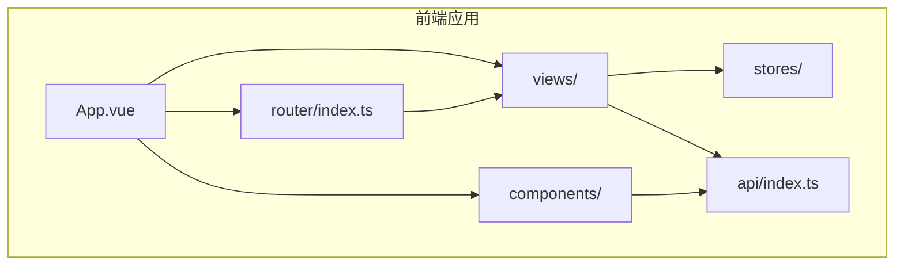
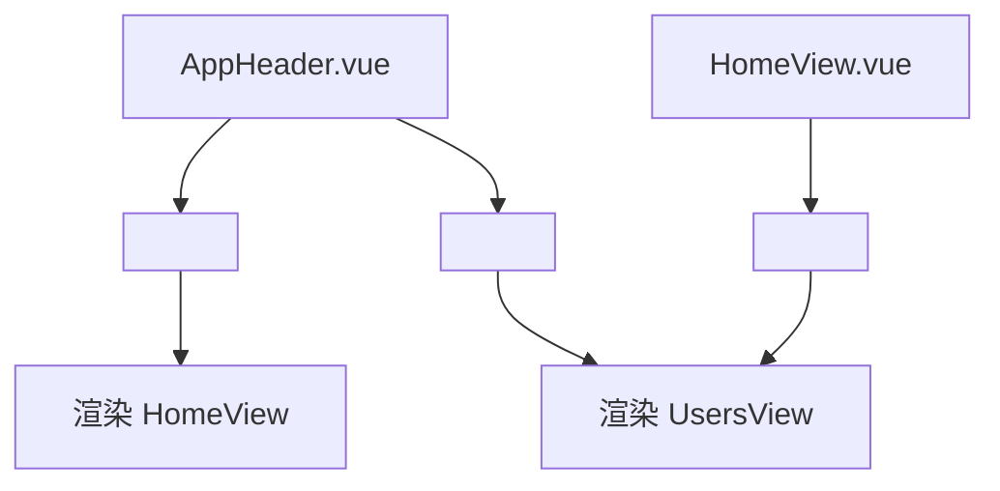
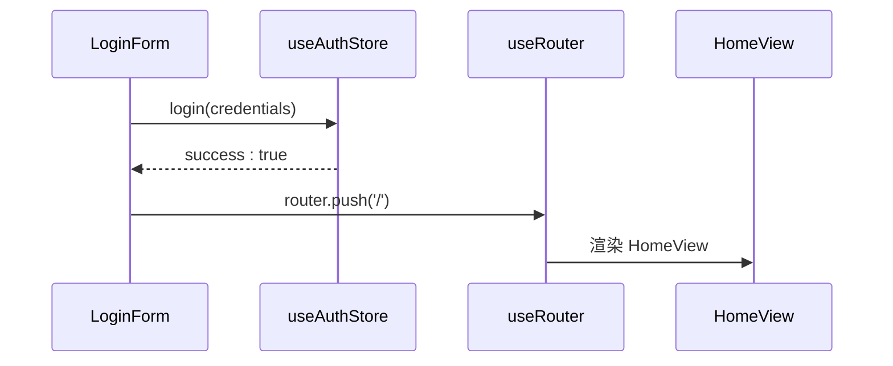
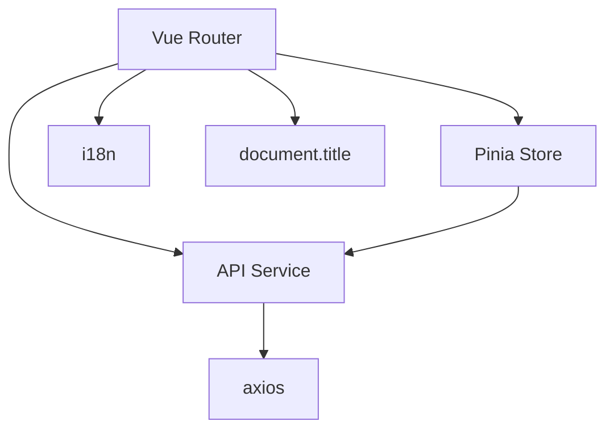

# 路由使用与视图集成

<cite>
**本文档引用文件**  
- [router/index.ts](file://apps/frontend/src/router/index.ts)
- [App.vue](file://apps/frontend/src/App.vue)
- [HomeView.vue](file://apps/frontend/src/views/HomeView.vue)
- [LoginView.vue](file://apps/frontend/src/views/LoginView.vue)
- [UsersView.vue](file://apps/frontend/src/views/UsersView.vue)
- [AppHeader.vue](file://apps/frontend/src/components/AppHeader.vue)
- [LoginForm.vue](file://apps/frontend/src/components/LoginForm.vue)
- [users.ts](file://apps/frontend/src/stores/users.ts)
- [auth.ts](file://apps/frontend/src/stores/auth.ts)
- [index.ts](file://apps/frontend/src/api/index.ts)
</cite>

## 目录
1. [简介](#简介)
2. [项目结构](#项目结构)
3. [核心组件](#核心组件)
4. [架构概览](#架构概览)
5. [详细组件分析](#详细组件分析)
6. [依赖分析](#依赖分析)
7. [性能考虑](#性能考虑)
8. [故障排除指南](#故障排除指南)
9. [结论](#结论)

## 简介
本文档旨在通过实际视图组件演示 Vue Router 的使用场景。重点说明如何在模板中使用 `<router-link>` 实现声明式导航，以及在脚本中调用 `router.push()` 实现编程式导航。同时详细描述路由参数（params）和查询参数（query）的获取方式，并结合 HomeView、LoginView 和 UsersView 展示不同路由场景下的最佳实践。

**Section sources**
- [router/index.ts](file://apps/frontend/src/router/index.ts#L1-L43)
- [App.vue](file://apps/frontend/src/App.vue#L1-L14)

## 项目结构
项目采用前后端分离架构，前端位于 `apps/frontend` 目录下，使用 Vue 3 + TypeScript + Vite 构建。路由配置集中于 `src/router/index.ts`，视图组件存放在 `src/views/` 目录中，包括 HomeView、LoginView、UsersView 和 NotFoundView。组件通过 `App.vue` 中的 `<RouterView />` 进行渲染，路由跳转由 `<RouterLink>` 或编程式导航触发。



**Diagram sources**
- [App.vue](file://apps/frontend/src/App.vue#L1-L14)
- [router/index.ts](file://apps/frontend/src/router/index.ts#L1-L43)

**Section sources**
- [App.vue](file://apps/frontend/src/App.vue#L1-L14)
- [router/index.ts](file://apps/frontend/src/router/index.ts#L1-L43)

## 核心组件
核心视图组件包括 HomeView、LoginView 和 UsersView，分别对应首页、登录页和用户列表页。路由通过 `createRouter` 配置，使用 `createWebHistory` 模式，支持静态路由和动态匹配（如 404 页面）。每个路由可携带 meta 信息用于页面标题设置。

**Section sources**
- [router/index.ts](file://apps/frontend/src/router/index.ts#L1-L43)
- [HomeView.vue](file://apps/frontend/src/views/HomeView.vue#L1-L307)
- [LoginView.vue](file://apps/frontend/src/views/LoginView.vue#L1-L8)
- [UsersView.vue](file://apps/frontend/src/views/UsersView.vue#L1-L67)

## 架构概览
Vue Router 作为核心导航机制，与 Pinia 状态管理、Axios API 调用深度集成。应用启动时在 `main.ts` 中注册路由，通过 `<RouterView />` 动态渲染匹配的视图组件。导航分为声明式（`<RouterLink>`）和编程式（`router.push()`）两种方式，适用于不同交互场景。

```mermaid
graph TD
A[用户交互] --> B{导航类型}
B --> |点击链接| C[<RouterLink to="/users">]
B --> |表单提交| D[router.push('/')]
C --> E[路由匹配]
D --> E
E --> F[渲染对应视图]
F --> G[HomeView/LoginView/UsersView]
G --> H[调用API或读取状态]
H --> I[更新UI]
```

**Diagram sources**
- [router/index.ts](file://apps/frontend/src/router/index.ts#L1-L43)
- [App.vue](file://apps/frontend/src/App.vue#L1-L14)
- [LoginForm.vue](file://apps/frontend/src/components/LoginForm.vue#L1-L99)

## 详细组件分析

### 声明式导航：HomeView 与 AppHeader
在 `HomeView.vue` 和 `AppHeader.vue` 中，使用 `<RouterLink>` 实现页面跳转。例如从首页导航至用户列表页，通过 `to="/users"` 指定目标路径。这种方式适用于静态链接，语义清晰且易于维护。



**Diagram sources**
- [AppHeader.vue](file://apps/frontend/src/components/AppHeader.vue#L1-L25)
- [HomeView.vue](file://apps/frontend/src/views/HomeView.vue#L1-L307)

**Section sources**
- [AppHeader.vue](file://apps/frontend/src/components/AppHeader.vue#L1-L25)
- [HomeView.vue](file://apps/frontend/src/views/HomeView.vue#L1-L307)

### 编程式导航：LoginView
在 `LoginForm.vue` 中，登录成功后通过编程式导航跳转。使用 `useRouter()` 获取路由实例，并在 `onSubmit` 回调中调用 `router.push('/')` 实现跳转。这种方式适用于条件性导航，如登录成功后跳转首页。



**Diagram sources**
- [LoginForm.vue](file://apps/frontend/src/components/LoginForm.vue#L1-L99)
- [auth.ts](file://apps/frontend/src/stores/auth.ts#L1-L97)

**Section sources**
- [LoginForm.vue](file://apps/frontend/src/components/LoginForm.vue#L1-L99)
- [auth.ts](file://apps/frontend/src/stores/auth.ts#L1-L97)

### 路由参数与数据获取：UsersView
虽然当前路由配置中未显式定义带参数的路径（如 `/users/:id`），但 `UsersView.vue` 通过 Pinia store (`useUsersStore`) 在 `onMounted` 钩子中调用 `fetchUsers()` 获取用户列表数据。该模式符合路由匹配后触发数据加载的最佳实践。

```mermaid
flowchart TD
A[访问 /users] --> B[UsersView mounted]
B --> C[调用 usersStore.fetchUsers()]
C --> D[api.getUsers()]
D --> E[更新 users store]
E --> F[视图重新渲染]
```

**Diagram sources**
- [UsersView.vue](file://apps/frontend/src/views/UsersView.vue#L1-L67)
- [users.ts](file://apps/frontend/src/stores/users.ts#L1-L42)
- [index.ts](file://apps/frontend/src/api/index.ts#L1-L92)

**Section sources**
- [UsersView.vue](file://apps/frontend/src/views/UsersView.vue#L1-L67)
- [users.ts](file://apps/frontend/src/stores/users.ts#L1-L42)

## 依赖分析
Vue Router 与多个核心模块存在依赖关系：
- 与 Pinia 协同管理状态（如认证状态、用户数据）
- 与 Axios 封装的 API 模块配合实现数据获取
- 通过路由守卫（`beforeEach`）实现页面标题动态更新
- 与国际化（i18n）结合实现多语言路由文本



**Diagram sources**
- [router/index.ts](file://apps/frontend/src/router/index.ts#L1-L43)
- [users.ts](file://apps/frontend/src/stores/users.ts#L1-L42)
- [index.ts](file://apps/frontend/src/api/index.ts#L1-L92)

**Section sources**
- [router/index.ts](file://apps/frontend/src/router/index.ts#L1-L43)
- [users.ts](file://apps/frontend/src/stores/users.ts#L1-L42)
- [index.ts](file://apps/frontend/src/api/index.ts#L1-L92)

## 性能考虑
- 路由组件采用懒加载（`import()` 语法），提升首屏加载速度
- 路由守卫轻量，仅更新页面标题，不影响导航性能
- 数据获取与组件挂载分离，避免阻塞渲染
- 使用 `v-if` 条件渲染不同状态（加载、错误、空数据），优化 DOM 结构

## 故障排除指南
- **页面未跳转**：检查路由路径是否正确，确认 `router.push()` 是否在异步操作后正确调用
- **数据未加载**：确保 `onMounted` 或 `watch` 正确监听路由变化并触发 API 调用
- **404 错误**：检查路由顺序，确保通配符路由 `/:pathMatch(.*)*` 位于最后
- **状态丢失**：若需跨页面保留状态，应使用 Pinia 而非组件本地状态
- **认证失效跳转**：在 API 响应拦截器中处理 401 状态，清除 token 并重定向至登录页

**Section sources**
- [auth.ts](file://apps/frontend/src/stores/auth.ts#L1-L97)
- [index.ts](file://apps/frontend/src/api/index.ts#L1-L92)
- [router/index.ts](file://apps/frontend/src/router/index.ts#L1-L43)

## 结论
本项目展示了 Vue Router 在实际应用中的典型用法：通过 `<RouterLink>` 实现声明式导航，通过 `router.push()` 实现编程式导航，并结合 Pinia 和 API 模块完成数据获取与状态管理。路由配置清晰，支持懒加载和元信息管理，配合路由守卫实现了页面标题的动态更新。建议未来扩展动态路由（如 `/users/:id`）以展示更完整的参数处理能力。