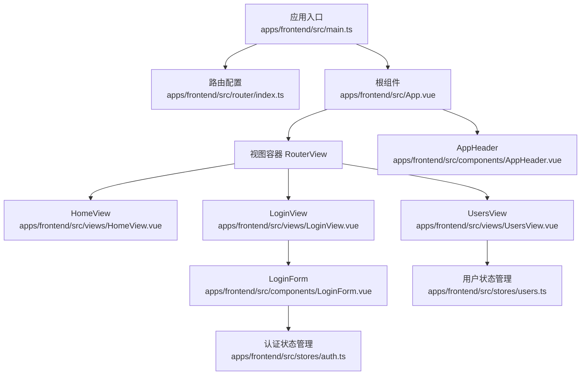
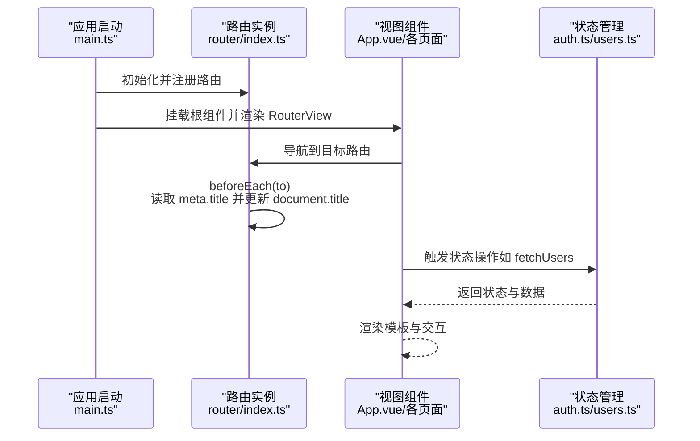
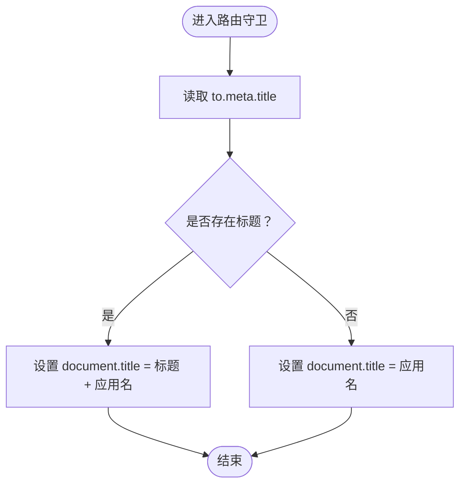
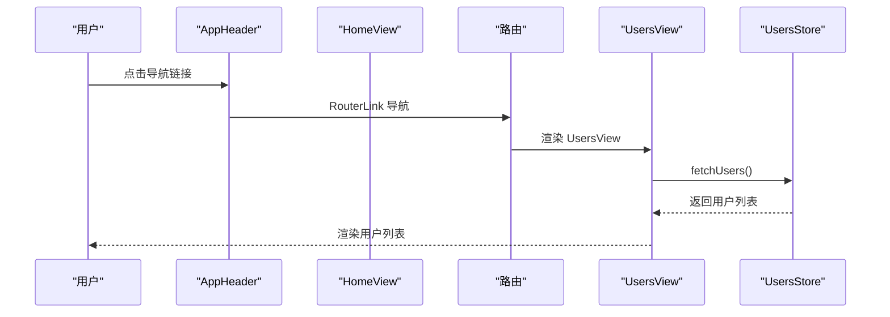
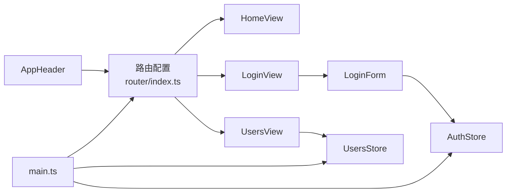

# 路由系统

<cite>
**本文引用的文件**
- [apps/frontend/src/router/index.ts](file://apps/frontend/src/router/index.ts)
- [apps/frontend/src/App.vue](file://apps/frontend/src/App.vue)
- [apps/frontend/src/main.ts](file://apps/frontend/src/main.ts)
- [apps/frontend/src/views/HomeView.vue](file://apps/frontend/src/views/HomeView.vue)
- [apps/frontend/src/views/LoginView.vue](file://apps/frontend/src/views/LoginView.vue)
- [apps/frontend/src/views/UsersView.vue](file://apps/frontend/src/views/UsersView.vue)
- [apps/frontend/src/components/LoginForm.vue](file://apps/frontend/src/components/LoginForm.vue)
- [apps/frontend/src/components/AppHeader.vue](file://apps/frontend/src/components/AppHeader.vue)
- [apps/frontend/src/stores/auth.ts](file://apps/frontend/src/stores/auth.ts)
- [apps/frontend/src/stores/users.ts](file://apps/frontend/src/stores/users.ts)
- [packages/shared/src/schemas/auth.schema.ts](file://packages/shared/src/schemas/auth.schema.ts)
</cite>

## 目录
1. [简介](#简介)
2. [项目结构](#项目结构)
3. [核心组件](#核心组件)
4. [架构总览](#架构总览)
5. [详细组件分析](#详细组件分析)
6. [依赖关系分析](#依赖关系分析)
7. [性能考虑](#性能考虑)
8. [故障排查指南](#故障排查指南)
9. [结论](#结论)

## 简介
本文件系统性地文档化前端路由系统的配置与使用，覆盖以下要点：
- 路由定义：Home、Login、Users 等页面的路由配置与懒加载策略
- 导航守卫：页面标题更新的实现逻辑
- 路由元信息（meta fields）：页面标题等元数据的使用
- 视图组件实践：LoginView 与 UsersView 中的编程式导航、查询参数处理与路由参数获取
- 权限控制：基于认证状态的权限控制与未登录用户重定向至登录页的实现思路

## 项目结构
前端路由位于应用入口处集中配置，配合视图组件与状态管理共同完成页面渲染与导航流程。关键文件如下：
- 路由配置：apps/frontend/src/router/index.ts
- 应用根组件：apps/frontend/src/App.vue
- 应用入口：apps/frontend/src/main.ts
- 视图组件：HomeView、LoginView、UsersView
- 表单与导航：LoginForm、AppHeader
- 状态管理：auth.ts（认证）、users.ts（用户列表）

图表来源
- [apps/frontend/src/main.ts](file://apps/frontend/src/main.ts#L1-L57)
- [apps/frontend/src/router/index.ts](file://apps/frontend/src/router/index.ts#L1-L44)
- [apps/frontend/src/App.vue](file://apps/frontend/src/App.vue#L1-L14)
- [apps/frontend/src/views/HomeView.vue](file://apps/frontend/src/views/HomeView.vue#L1-L307)
- [apps/frontend/src/views/LoginView.vue](file://apps/frontend/src/views/LoginView.vue#L1-L8)
- [apps/frontend/src/views/UsersView.vue](file://apps/frontend/src/views/UsersView.vue#L1-L67)
- [apps/frontend/src/components/LoginForm.vue](file://apps/frontend/src/components/LoginForm.vue#L1-L99)
- [apps/frontend/src/components/AppHeader.vue](file://apps/frontend/src/components/AppHeader.vue#L1-L25)
- [apps/frontend/src/stores/auth.ts](file://apps/frontend/src/stores/auth.ts#L1-L97)
- [apps/frontend/src/stores/users.ts](file://apps/frontend/src/stores/users.ts#L1-L42)

章节来源
- [apps/frontend/src/router/index.ts](file://apps/frontend/src/router/index.ts#L1-L44)
- [apps/frontend/src/App.vue](file://apps/frontend/src/App.vue#L1-L14)
- [apps/frontend/src/main.ts](file://apps/frontend/src/main.ts#L1-L57)

## 核心组件
- 路由配置与懒加载
  - 路由采用 createRouter + createWebHistory 创建，routes 定义了首页、登录页、用户列表页以及通配页。
  - 登录页与用户列表页采用动态导入实现懒加载，提升首屏性能。
  - 通配页用于兜底未匹配路由。
- 导航守卫
  - beforeEach 中读取路由元信息中的 title 字段，动态设置 document.title。
- 视图组件
  - HomeView：展示导航到用户列表的 RouterLink。
  - LoginView：承载 LoginForm。
  - UsersView：在挂载时拉取用户列表，展示加载、空态与错误状态。
- 状态管理
  - 认证状态管理：提供登录、登出、获取当前用户等方法，并持久化 token。
  - 用户状态管理：提供获取用户列表的方法与状态。

章节来源
- [apps/frontend/src/router/index.ts](file://apps/frontend/src/router/index.ts#L1-L44)
- [apps/frontend/src/views/HomeView.vue](file://apps/frontend/src/views/HomeView.vue#L1-L307)
- [apps/frontend/src/views/LoginView.vue](file://apps/frontend/src/views/LoginView.vue#L1-L8)
- [apps/frontend/src/views/UsersView.vue](file://apps/frontend/src/views/UsersView.vue#L1-L67)
- [apps/frontend/src/stores/auth.ts](file://apps/frontend/src/stores/auth.ts#L1-L97)
- [apps/frontend/src/stores/users.ts](file://apps/frontend/src/stores/users.ts#L1-L42)

## 架构总览
下图展示了从应用启动到路由渲染的关键交互路径，以及导航守卫对页面标题的影响。

图表来源
- [apps/frontend/src/main.ts](file://apps/frontend/src/main.ts#L1-L57)
- [apps/frontend/src/router/index.ts](file://apps/frontend/src/router/index.ts#L1-L44)
- [apps/frontend/src/App.vue](file://apps/frontend/src/App.vue#L1-L14)
- [apps/frontend/src/stores/auth.ts](file://apps/frontend/src/stores/auth.ts#L1-L97)
- [apps/frontend/src/stores/users.ts](file://apps/frontend/src/stores/users.ts#L1-L42)

## 详细组件分析

### 路由配置与懒加载
- 路由定义
  - 首页：路径“/”，名称“home”，组件为 HomeView，meta 包含标题“首页”。
  - 登录页：路径“/login”，名称“login”，组件为 LoginView，采用动态导入实现懒加载，meta 包含标题“登录”。
  - 用户列表：路径“/users”，名称“users”，组件为 UsersView，采用动态导入实现懒加载，meta 包含标题“用户列表”。
  - 通配页：路径“/:pathMatch(.*)*”，名称“not-found”，组件为 NotFoundView，meta 包含标题“页面未找到”。
- 导航守卫
  - beforeEach 钩子读取 to.meta.title，设置 document.title；若无标题则回退为默认标题。
- 懒加载策略
  - 登录页与用户列表页通过动态导入减少初始包体积，提升首屏加载速度。

章节来源
- [apps/frontend/src/router/index.ts](file://apps/frontend/src/router/index.ts#L1-L44)

### 导航守卫与页面标题更新
- 实现逻辑
  - 在 beforeEach 中读取 to.meta.title，拼接应用名后设置为 document.title。
  - 该逻辑确保每个页面的浏览器标签页标题与页面内容一致，提升用户体验。
- 适用范围
  - 对所有路由生效，包括首页、登录页、用户列表页与通配页。

图表来源
- [apps/frontend/src/router/index.ts](file://apps/frontend/src/router/index.ts#L37-L41)

章节来源
- [apps/frontend/src/router/index.ts](file://apps/frontend/src/router/index.ts#L37-L41)

### 视图组件与编程式导航
- LoginView 与 LoginForm
  - LoginView 仅承载 LoginForm，LoginForm 内部使用 useRouter 进行编程式导航。
  - 提交成功后调用 router.push('/') 返回首页。
  - 表单验证使用共享的 Zod Schema，保证前后端一致的校验规则。
- HomeView
  - 通过 RouterLink 导航到用户列表页，便于用户点击跳转。
- UsersView
  - 在 onMounted 生命周期中调用用户状态管理的 fetchUsers 方法拉取数据。
  - 展示加载、空态与错误状态，增强用户体验。

图表来源
- [apps/frontend/src/components/AppHeader.vue](file://apps/frontend/src/components/AppHeader.vue#L1-L25)
- [apps/frontend/src/views/HomeView.vue](file://apps/frontend/src/views/HomeView.vue#L294-L304)
- [apps/frontend/src/views/UsersView.vue](file://apps/frontend/src/views/UsersView.vue#L12-L14)
- [apps/frontend/src/stores/users.ts](file://apps/frontend/src/stores/users.ts#L20-L40)

章节来源
- [apps/frontend/src/views/LoginView.vue](file://apps/frontend/src/views/LoginView.vue#L1-L8)
- [apps/frontend/src/components/LoginForm.vue](file://apps/frontend/src/components/LoginForm.vue#L1-L99)
- [apps/frontend/src/views/HomeView.vue](file://apps/frontend/src/views/HomeView.vue#L294-L304)
- [apps/frontend/src/views/UsersView.vue](file://apps/frontend/src/views/UsersView.vue#L12-L14)
- [apps/frontend/src/stores/users.ts](file://apps/frontend/src/stores/users.ts#L1-L42)

### 权限控制与未登录重定向
- 当前实现
  - 路由层未配置全局前置守卫进行权限拦截。
  - 认证状态管理提供 isAuthenticated 计算属性，可用于组件内自行判断。
- 实现建议
  - 在 beforeEach 中根据 to.meta.requiresAuth 或类似字段判断是否需要登录。
  - 若未登录且访问受保护路由，重定向至登录页。
  - 登录成功后，可结合 router.replace 或 router.go 返回原目标路由。
- 注意事项
  - 需要在 meta 中为受保护路由添加权限标识。
  - 登录成功后的重定向需避免循环跳转，可记录来源路由或使用 query 参数传递目标地址。

章节来源
- [apps/frontend/src/router/index.ts](file://apps/frontend/src/router/index.ts#L37-L41)
- [apps/frontend/src/stores/auth.ts](file://apps/frontend/src/stores/auth.ts#L1-L97)

### 路由元信息（meta fields）
- 使用场景
  - 页面标题：通过 meta.title 动态设置 document.title。
  - 权限标识：可在 meta 中扩展 requiresAuth 等字段以支持权限控制。
- 扩展建议
  - 可增加面包屑、页面描述、图标等元信息字段，统一在导航守卫或布局组件中消费。

章节来源
- [apps/frontend/src/router/index.ts](file://apps/frontend/src/router/index.ts#L10-L33)

### 路由参数与查询参数处理
- 路由参数
  - 当前路由未使用动态段参数（如 :id），因此不涉及路由参数获取。
- 查询参数
  - 当前路由未使用查询参数，因此不涉及查询参数处理。
- 实践建议
  - 若后续引入带参数的路由，可在组件中通过 $route.params/$route.query 获取。
  - 对于复杂查询参数，可结合 URLSearchParams 或第三方库进行序列化/反序列化。

章节来源
- [apps/frontend/src/router/index.ts](file://apps/frontend/src/router/index.ts#L1-L44)

## 依赖关系分析
- 组件耦合
  - App.vue 通过 RouterView 渲染当前路由组件，与路由配置强耦合。
  - AppHeader 通过 RouterLink 导航到首页与用户列表，依赖路由名称。
  - LoginView 依赖 LoginForm，LoginForm 依赖 useRouter 与 useAuthStore。
  - UsersView 依赖 useUsersStore，fetchUsers 会发起网络请求。
- 外部依赖
  - vue-router：路由定义与导航。
  - pinia：状态管理（认证与用户列表）。
  - @tanstack/vue-query：数据请求缓存（在 main.ts 中配置）。
  - vee-validate + zod：表单验证（LoginView 与 LoginForm）。

图表来源
- [apps/frontend/src/router/index.ts](file://apps/frontend/src/router/index.ts#L1-L44)
- [apps/frontend/src/App.vue](file://apps/frontend/src/App.vue#L1-L14)
- [apps/frontend/src/components/AppHeader.vue](file://apps/frontend/src/components/AppHeader.vue#L1-L25)
- [apps/frontend/src/views/LoginView.vue](file://apps/frontend/src/views/LoginView.vue#L1-L8)
- [apps/frontend/src/components/LoginForm.vue](file://apps/frontend/src/components/LoginForm.vue#L1-L99)
- [apps/frontend/src/views/UsersView.vue](file://apps/frontend/src/views/UsersView.vue#L1-L67)
- [apps/frontend/src/stores/auth.ts](file://apps/frontend/src/stores/auth.ts#L1-L97)
- [apps/frontend/src/stores/users.ts](file://apps/frontend/src/stores/users.ts#L1-L42)
- [apps/frontend/src/main.ts](file://apps/frontend/src/main.ts#L1-L57)

章节来源
- [apps/frontend/src/main.ts](file://apps/frontend/src/main.ts#L1-L57)
- [apps/frontend/src/router/index.ts](file://apps/frontend/src/router/index.ts#L1-L44)

## 性能考虑
- 懒加载
  - 登录页与用户列表页采用动态导入，减少初始包体积，提升首屏加载速度。
- 缓存策略
  - main.ts 中配置了 @tanstack/vue-query 的默认缓存策略（staleTime、retry），有助于减少重复请求与提升响应速度。
- 路由守卫开销
  - beforeEach 仅读取 meta 并更新标题，开销极小，不会影响导航性能。

章节来源
- [apps/frontend/src/router/index.ts](file://apps/frontend/src/router/index.ts#L16-L33)
- [apps/frontend/src/main.ts](file://apps/frontend/src/main.ts#L39-L46)

## 故障排查指南
- 页面标题未更新
  - 检查路由 meta 中是否设置了 title。
  - 确认 beforeEach 是否被调用。
- 登录后未跳转
  - 检查 LoginForm 中的 router.push 调用是否执行。
  - 确认登录成功标志位与错误状态是否正确。
- 用户列表未显示
  - 检查 UsersView 是否在 onMounted 中调用了 fetchUsers。
  - 确认 UsersStore 的 loading、error、users 状态是否按预期更新。
- 未登录访问受保护路由
  - 当前未实现全局守卫，可在 beforeEach 中增加权限判断与重定向逻辑。

章节来源
- [apps/frontend/src/router/index.ts](file://apps/frontend/src/router/index.ts#L37-L41)
- [apps/frontend/src/components/LoginForm.vue](file://apps/frontend/src/components/LoginForm.vue#L23-L28)
- [apps/frontend/src/views/UsersView.vue](file://apps/frontend/src/views/UsersView.vue#L12-L14)
- [apps/frontend/src/stores/auth.ts](file://apps/frontend/src/stores/auth.ts#L1-L97)
- [apps/frontend/src/stores/users.ts](file://apps/frontend/src/stores/users.ts#L1-L42)

## 结论
本路由系统以简洁清晰的方式实现了基础页面导航与懒加载，配合 meta 标题与状态管理，提供了良好的用户体验。当前未实现全局权限守卫，建议在 meta 中扩展权限标识并在 beforeEach 中实现未登录重定向逻辑。未来可进一步引入嵌套路由、动态路由参数与查询参数处理，以满足更复杂的业务场景。