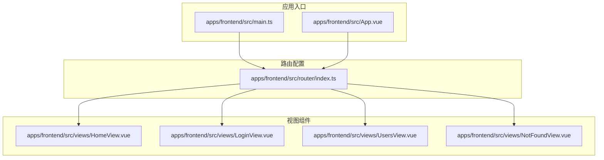
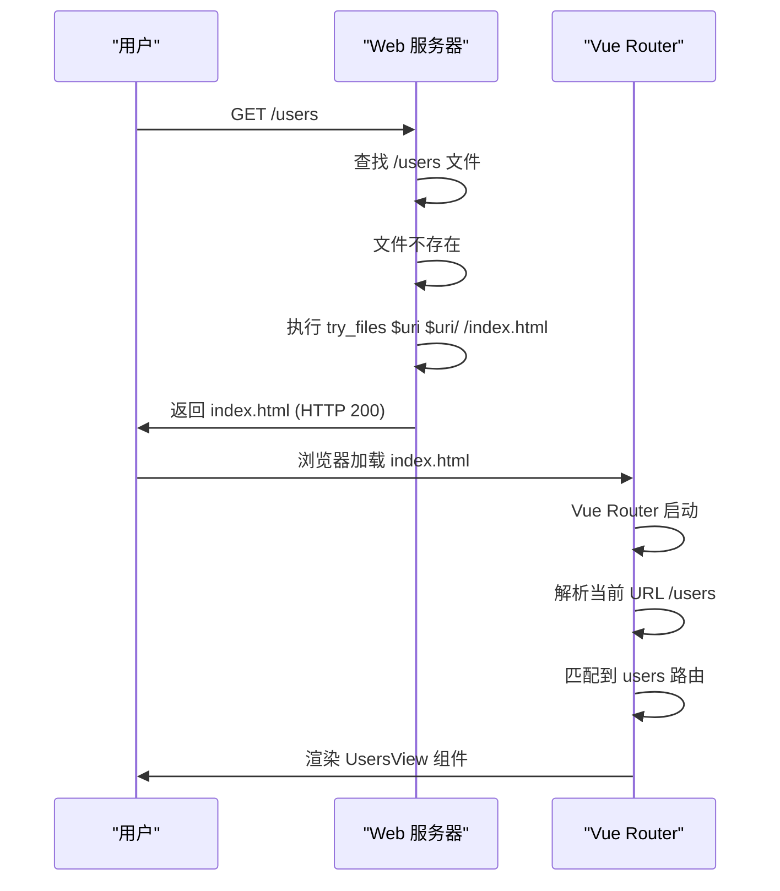
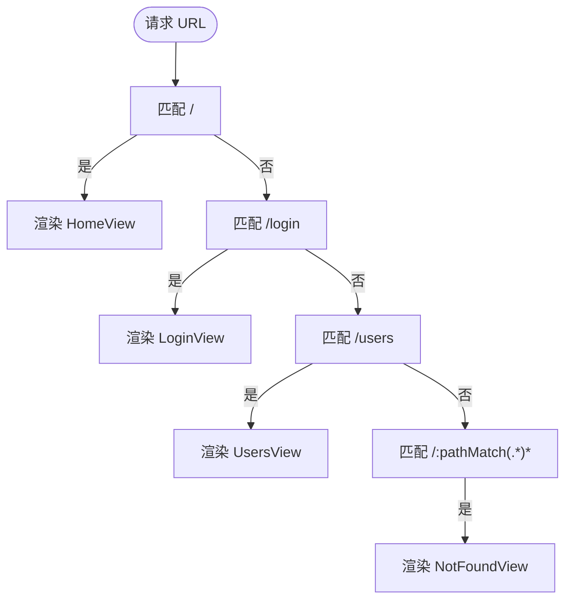
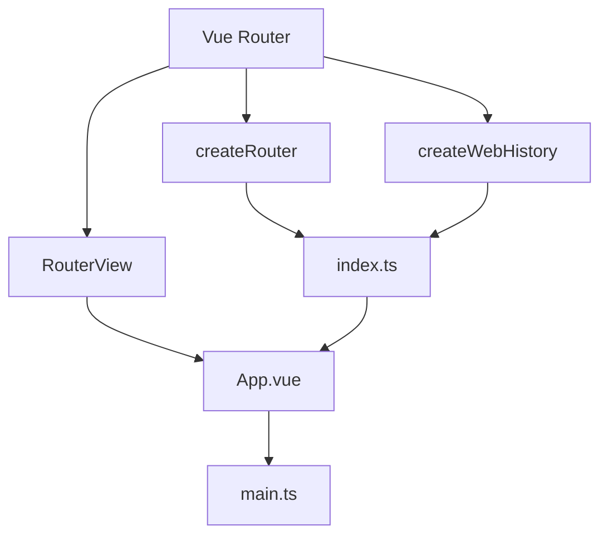

# 路由配置

<cite>
**本文档引用的文件**   
- [index.ts](file://apps/frontend/src/router/index.ts)
- [HomeView.vue](file://apps/frontend/src/views/HomeView.vue)
- [LoginView.vue](file://apps/frontend/src/views/LoginView.vue)
- [UsersView.vue](file://apps/frontend/src/views/UsersView.vue)
- [NotFoundView.vue](file://apps/frontend/src/views/NotFoundView.vue)
- [main.ts](file://apps/frontend/src/main.ts)
- [App.vue](file://apps/frontend/src/App.vue)
- [nginx.conf](file://apps/frontend/nginx.conf)
</cite>

## 目录
1. [项目结构](#项目结构)
2. [核心组件](#核心组件)
3. [架构概述](#架构概述)
4. [详细组件分析](#详细组件分析)
5. [依赖分析](#依赖分析)
6. [性能考虑](#性能考虑)
7. [故障排除指南](#故障排除指南)

## 项目结构

项目中的路由配置位于 `apps/frontend/src/router/index.ts` 文件中，该文件定义了应用的路由表，包括路径、名称和组件的映射关系。视图组件存放在 `apps/frontend/src/views/` 目录下，每个视图对应一个路由。主应用入口 `main.ts` 注册了路由实例，而 `App.vue` 使用 `<RouterView />` 来渲染当前路由匹配的组件。



**Diagram sources**
- [index.ts](file://apps/frontend/src/router/index.ts)
- [HomeView.vue](file://apps/frontend/src/views/HomeView.vue)
- [main.ts](file://apps/frontend/src/main.ts)
- [App.vue](file://apps/frontend/src/App.vue)

**Section sources**
- [index.ts](file://apps/frontend/src/router/index.ts)
- [HomeView.vue](file://apps/frontend/src/views/HomeView.vue)
- [main.ts](file://apps/frontend/src/main.ts)
- [App.vue](file://apps/frontend/src/App.vue)

## 核心组件

路由配置的核心是 `createRouter` 函数的调用，它接收一个包含 `history` 和 `routes` 的配置对象。`routes` 数组定义了路径、名称、组件和元数据之间的映射关系。其中，`HomeView` 组件使用静态导入，而其他视图组件使用动态导入实现懒加载。路由守卫 `beforeEach` 用于在路由切换时更新页面标题。

**Section sources**
- [index.ts](file://apps/frontend/src/router/index.ts#L7-L43)

## 架构概述

应用采用 Vue 3 的组合式 API 和 Vue Router 4 进行路由管理。路由模式为 history 模式，通过 `createWebHistory()` 创建。应用在 `main.ts` 中创建 Vue 实例并使用 `app.use(router)` 安装路由插件。`App.vue` 作为根组件，包含一个 `<RouterView />` 插槽，用于渲染匹配的视图组件。这种架构实现了组件的按需加载和单页应用的无缝导航体验。

```mermaid
graph TD
A[用户访问 URL] --> B{Vue Router}
B --> C[/ 匹配路由]
C --> D[加载组件]
D --> E[渲染到 <RouterView />]
E --> F[更新页面标题]
F --> G[用户看到新页面]
subgraph "Vue 应用"
B
E
end
subgraph "浏览器"
A
G
end
```

**Diagram sources**
- [index.ts](file://apps/frontend/src/router/index.ts)
- [main.ts](file://apps/frontend/src/main.ts)
- [App.vue](file://apps/frontend/src/App.vue)

## 详细组件分析

### 路由表定义分析

路由表是一个对象数组，每个对象代表一个路由记录。`path` 定义了 URL 路径，`name` 是路由的唯一名称，`component` 指向要渲染的组件，`meta` 可以附加额外信息如页面标题。

#### 路由映射关系
```mermaid
classDiagram
class Route {
+string path
+string name
+Component component
+object meta
}
class HomeRoute {
+path : "/"
+name : "home"
+component : HomeView
+meta : {title : "首页"}
}
class LoginRoute {
+path : "/login"
+name : "login"
+component : () => import('@/views/LoginView.vue')
+meta : {title : "登录"}
}
class UsersRoute {
+path : "/users"
+name : "users"
+component : () => import('@/views/UsersView.vue')
+meta : {title : "用户列表"}
}
class NotFoundRoute {
+path : "/ : pathMatch(.*)*"
+name : "not-found"
+component : () => import('@/views/NotFoundView.vue')
+meta : {title : "页面未找到"}
}
Route <|-- HomeRoute
Route <|-- LoginRoute
Route <|-- UsersRoute
Route <|-- NotFoundRoute
```

**Diagram sources**
- [index.ts](file://apps/frontend/src/router/index.ts#L10-L33)

### 懒加载机制分析

懒加载通过动态 `import()` 语法实现，它返回一个 Promise，Webpack 会将被导入的模块打包成单独的代码块（chunk）。当用户导航到该路由时，才加载对应的代码块，从而减少首屏加载时间。

#### 懒加载实现流程
```mermaid
flowchart TD
A[用户点击导航到 /login] --> B{Vue Router 匹配路由}
B --> C[/login 路由配置]
C --> D[执行 component: () => import('@/views/LoginView.vue')]
D --> E[发起网络请求加载 LoginView 组件代码块]
E --> F[组件代码块加载完成]
F --> G[创建 LoginView 组件实例]
G --> H[渲染到页面]
```

**Diagram sources**
- [index.ts](file://apps/frontend/src/router/index.ts#L19-L31)

### 路由模式与部署分析

应用使用 history 模式，这使得 URL 看起来更干净（如 `/users` 而不是 `/#/users`），对 SEO 更友好。但这也要求服务器配置支持，当用户直接访问 `/users` 时，服务器必须返回 `index.html` 文件，让 Vue Router 来处理路由。

#### History 模式服务器配置


**Diagram sources**
- [index.ts](file://apps/frontend/src/router/index.ts#L8)
- [nginx.conf](file://apps/frontend/nginx.conf#L28-L30)

### 路由别名、重定向与默认路由

当前配置中使用了通配符路由 `/ :pathMatch(.*)*` 作为默认路由，用于捕获所有未匹配的路径并显示 404 页面。虽然没有显式使用 `alias` 或 `redirect` 属性，但通配符路由起到了默认路由的作用。

#### 通配符路由匹配


**Diagram sources**
- [index.ts](file://apps/frontend/src/router/index.ts#L29-L32)

## 依赖分析

路由系统依赖于 Vue Router 库，通过 `createRouter` 和 `createWebHistory` 函数创建路由实例。视图组件依赖于 Vue 的组合式 API (`<script setup>`)。`App.vue` 依赖于 `RouterView` 组件来渲染路由内容。`main.ts` 作为应用入口，依赖并注册了路由插件。



**Diagram sources**
- [index.ts](file://apps/frontend/src/router/index.ts)
- [App.vue](file://apps/frontend/src/App.vue)
- [main.ts](file://apps/frontend/src/main.ts)

## 性能考虑

使用懒加载显著提升了首屏性能，因为 `HomeView` 是唯一在初始加载时获取的视图组件。其他视图（如 `LoginView` 和 `UsersView`）的代码块只有在用户导航到相应路由时才会加载。路由守卫中更新页面标题的操作非常轻量，不会对性能造成影响。

## 故障排除指南

### 路径匹配失败
- **问题**: 访问 `/users` 显示 404 页面。
- **排查**: 检查 `index.ts` 中 `routes` 数组是否包含 `path: '/users'` 的路由记录。确认路径拼写和大小写是否正确。

### 组件未加载
- **问题**: 路由匹配成功，但页面空白。
- **排查**: 检查组件路径是否正确，如 `@/views/UsersView.vue` 是否存在。确认 `App.vue` 中是否包含 `<RouterView />` 组件。

### History 模式 404 错误
- **问题**: 刷新 `/users` 页面时，服务器返回 404。
- **解决方案**: 配置 Web 服务器（如 Nginx）的 `try_files` 指令，确保所有未知路径都返回 `index.html`。参考 `nginx.conf` 文件中的配置。

**Section sources**
- [index.ts](file://apps/frontend/src/router/index.ts)
- [App.vue](file://apps/frontend/src/App.vue)
- [nginx.conf](file://apps/frontend/nginx.conf)