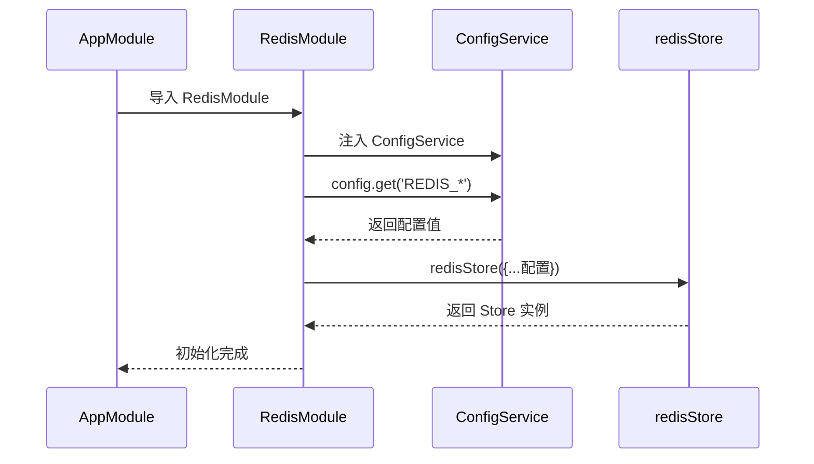
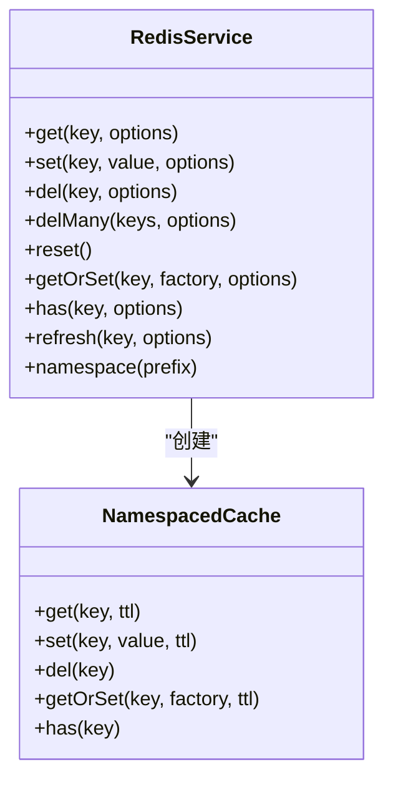
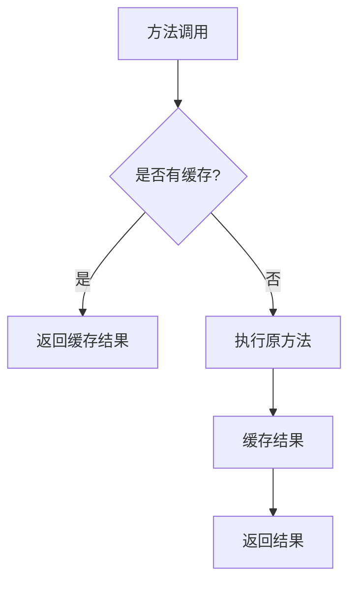
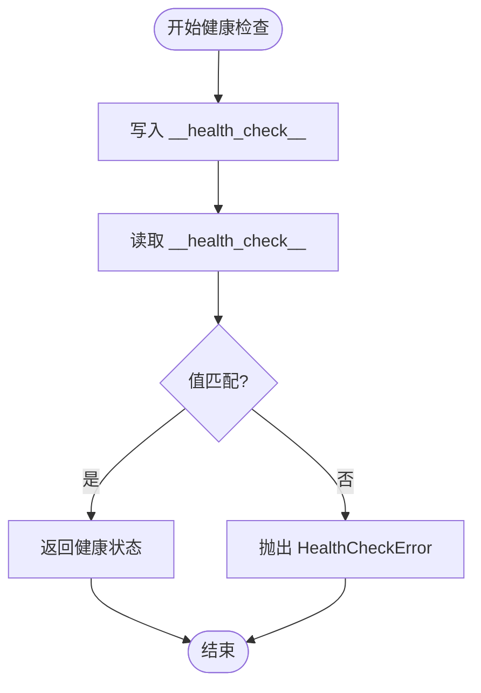

# Redis缓存与消息服务

<cite>
**本文档引用文件**   
- [redis.module.ts](file://apps/backend/src/redis/redis.module.ts)
- [redis.service.ts](file://apps/backend/src/redis/redis.service.ts)
- [cache.decorator.ts](file://apps/backend/src/redis/cache.decorator.ts)
- [redis.health.ts](file://apps/backend/src/redis/redis.health.ts)
- [app.module.ts](file://apps/backend/src/app.module.ts)
- [.env.example](file://.env.example)
</cite>

## 目录
1. [简介](#简介)
2. [Redis模块异步配置](#redis模块异步配置)
3. [Redis服务核心方法](#redis服务核心方法)
4. [方法级缓存装饰器](#方法级缓存装饰器)
5. [健康检查机制](#健康检查机制)
6. [缓存问题解决方案](#缓存问题解决方案)
7. [最佳实践](#最佳实践)
8. [结论](#结论)

## 简介
本项目通过 `@nestjs/cache-manager` 和 `cache-manager-ioredis-yet` 实现了基于 Redis 的缓存与消息队列功能。Redis 被用于缓存数据、支持 BullMQ 队列系统，并提供健康检查机制。系统通过环境变量进行灵活配置，支持缓存穿透保护、命名空间隔离和 AOP 缓存装饰器。

## Redis模块异步配置

Redis 模块通过 `CacheModule.registerAsync` 实现异步配置，从 `ConfigService` 读取连接参数并建立连接。



**图示来源**
- [redis.module.ts](file://apps/backend/src/redis/redis.module.ts#L29-L77)
- [app.module.ts](file://apps/backend/src/app.module.ts#L9-L136)

**本节来源**
- [redis.module.ts](file://apps/backend/src/redis/redis.module.ts#L1-L83)
- [.env.example](file://.env.example#L5-L10)

## Redis服务核心方法

`RedisService` 封装了常用的 Redis 操作方法，支持前缀管理、TTL 控制和命名空间隔离。

### 核心操作方法
- `get(key, options)`：获取缓存值
- `set(key, value, options)`：设置缓存值
- `del(key, options)`：删除缓存
- `delMany(keys, options)`：批量删除
- `reset()`：清空所有缓存
- `getOrSet(key, factory, options)`：缓存穿透保护
- `has(key, options)`：检查键是否存在
- `refresh(key, options)`：刷新缓存 TTL

### 命名空间支持
通过 `namespace(prefix)` 方法创建带前缀的缓存实例，实现逻辑隔离。



**图示来源**
- [redis.service.ts](file://apps/backend/src/redis/redis.service.ts#L51-L231)

**本节来源**
- [redis.service.ts](file://apps/backend/src/redis/redis.service.ts#L1-L232)

## 方法级缓存装饰器

`cache.decorator.ts` 提供了基于 AOP 的方法级缓存能力，通过拦截器自动处理缓存逻辑。

### Cacheable 装饰器
使用 `@Cacheable()` 可自动缓存方法返回值：

```typescript
@Cacheable({ key: 'users:list', ttl: 300000 })
async findAll() {
  return this.usersService.findAll();
}
```

### 实现机制
1. 使用 `UseInterceptors(CacheInterceptor)` 启用缓存拦截
2. 通过 `CacheKey` 和 `CacheTTL` 设置键和过期时间
3. 利用元数据存储自定义选项



**图示来源**
- [cache.decorator.ts](file://apps/backend/src/redis/cache.decorator.ts#L42-L58)

**本节来源**
- [cache.decorator.ts](file://apps/backend/src/redis/cache.decorator.ts#L1-L88)

## 健康检查机制

Redis 健康检查通过写入和读取测试键来验证连接状态。

### 实现逻辑
1. 写入测试键 `__health_check__` 带 1 秒 TTL
2. 立即读取该键
3. 验证读写一致性
4. 返回健康状态或抛出异常



**图示来源**
- [redis.health.ts](file://apps/backend/src/redis/redis.health.ts#L20-L41)

**本节来源**
- [redis.health.ts](file://apps/backend/src/redis/redis.health.ts#L1-L43)

## 缓存问题解决方案

### 缓存穿透
使用 `getOrSet` 方法结合空值缓存：

```typescript
async getUser(id: string) {
  return this.redisService.getOrSet(`user:${id}`, async () => {
    const user = await this.prisma.user.findUnique({ where: { id } });
    return user || null; // 显式缓存 null 值
  }, { ttl: 60 });
}
```

### 缓存雪崩
采用差异化 TTL 策略：
- 基础 TTL + 随机偏移量
- 关键数据设置永久缓存（配合主动更新）

### 缓存击穿
使用互斥锁模式（本项目可通过 `getOrSet` 配合外部锁实现）：

```typescript
// 伪代码示例
async getWithLock(key, factory, ttl) {
  const lock = await this.acquireLock(key);
  if (lock) {
    try {
      return await factory();
    } finally {
      await this.releaseLock(key);
    }
  }
  return this.get(key);
}
```

**本节来源**
- [redis.service.ts](file://apps/backend/src/redis/redis.service.ts#L149-L159)

## 最佳实践

### 序列化策略
- 使用 JSON 序列化复杂对象
- 简单类型直接存储
- 大对象考虑压缩或拆分

### 键命名规范
| 前缀 | 用途 | 示例 |
|------|------|------|
| user: | 用户数据 | user:123 |
| session: | 会话信息 | session:abc |
| auth: | 认证相关 | auth:token:xyz |
| rate_limit: | 限流计数 | rate_limit:ip:192.168.1.1 |

### 内存管理
- 设置合理的 TTL 避免内存泄漏
- 使用 `delMany` 批量清理过期数据
- 监控内存使用情况
- 关键服务实现优雅关闭（`onModuleDestroy`）

**本节来源**
- [redis.service.ts](file://apps/backend/src/redis/redis.service.ts#L8-L15)
- [redis.module.ts](file://apps/backend/src/redis/redis.module.ts#L39-L40)

## 结论
本项目实现了完整的 Redis 缓存与消息队列解决方案，具备以下特点：
- 通过异步配置实现灵活的连接管理
- 提供丰富的封装方法支持多种使用场景
- 利用 AOP 实现无侵入式方法缓存
- 健全的健康检查保障系统稳定性
- 完善的错误处理和资源清理机制

建议在实际使用中结合业务特点选择合适的缓存策略，并定期监控 Redis 性能指标。