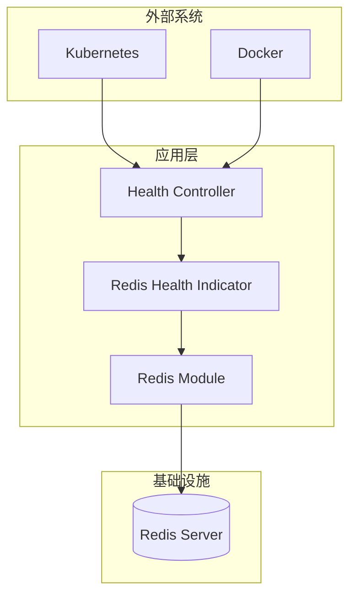
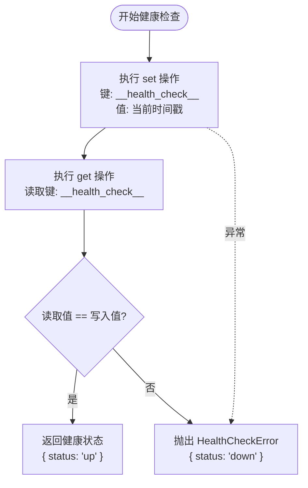
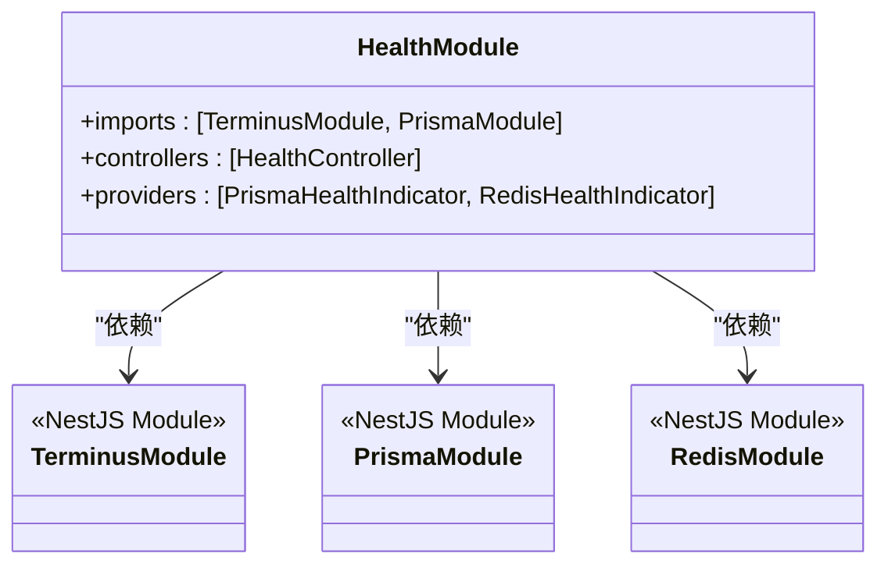

# 健康检查机制

<cite>
**本文档引用文件**  
- [redis.health.ts](file://apps/backend/src/redis/redis.health.ts)
- [health.controller.ts](file://apps/backend/src/health/health.controller.ts)
- [health.module.ts](file://apps/backend/src/health/health.module.ts)
- [redis.module.ts](file://apps/backend/src/redis/redis.module.ts)
- [redis.service.ts](file://apps/backend/src/redis/redis.service.ts)
- [Dockerfile](file://apps/backend/Dockerfile)
- [docker-compose.yml](file://docker-compose.yml)
- [app.module.ts](file://apps/backend/src/app.module.ts)
</cite>

## 目录
1. [简介](#简介)
2. [项目结构](#项目结构)
3. [核心组件](#核心组件)
4. [架构概述](#架构概述)
5. [详细组件分析](#详细组件分析)
6. [依赖分析](#依赖分析)
7. [性能考虑](#性能考虑)
8. [故障排查指南](#故障排查指南)
9. [结论](#结论)

## 简介
本专项文档详细阐述了基于NestJS框架的Redis健康检查机制实现原理与集成方案。系统采用`@nestjs/terminus`作为健康检查核心库，通过自定义`RedisHealthIndicator`类实现对Redis服务的连接状态检测。健康检查机制不仅用于实时监控，还深度集成到容器化部署的生命周期管理中，为系统的稳定性与可观测性提供保障。

## 项目结构
该项目采用NestJS单体架构，健康检查相关代码集中于`apps/backend/src/health`和`apps/backend/src/redis`目录。`health`模块负责提供健康检查端点，而`redis`模块则封装了Redis缓存服务及其健康检测逻辑。整体结构清晰，职责分离明确。

```mermaid
graph TD
A[Health Module] --> B[Health Controller]
A --> C[Health Indicators]
D[Redis Module] --> E[Redis Service]
D --> F[Redis Health Indicator]
B --> G[/health]
B --> H[/health/liveness]
B --> I[/health/readiness]
C --> J[PrismaHealthIndicator]
C --> F
F --> E
```

**图示来源**  
- [health.module.ts](file://apps/backend/src/health/health.module.ts#L8-L13)
- [redis.module.ts](file://apps/backend/src/redis/redis.module.ts#L27-L83)

**本节来源**  
- [apps/backend/src/health](file://apps/backend/src/health)
- [apps/backend/src/redis](file://apps/backend/src/redis)

## 核心组件
核心组件包括`RedisHealthIndicator`、`HealthController`以及`RedisModule`。`RedisHealthIndicator`负责执行具体的健康检查逻辑；`HealthController`对外暴露标准化的健康检查端点；`RedisModule`则负责Redis服务的初始化与配置，为健康检查提供底层支持。

**本节来源**  
- [redis.health.ts](file://apps/backend/src/redis/redis.health.ts#L10-L42)
- [health.controller.ts](file://apps/backend/src/health/health.controller.ts#L18-L76)
- [redis.module.ts](file://apps/backend/src/redis/redis.module.ts#L26-L83)

## 架构概述
系统健康检查架构采用分层设计。最底层是Redis服务，通过`cache-manager`与应用连接。中间层是`RedisHealthIndicator`，它利用注入的`CACHE_MANAGER`执行读写测试。最上层是`HealthController`，它协调多个健康指示器（如数据库、内存、磁盘）并聚合结果，通过REST API对外提供统一的健康状态视图。



**图示来源**  
- [redis.module.ts](file://apps/backend/src/redis/redis.module.ts#L29-L78)
- [redis.health.ts](file://apps/backend/src/redis/redis.health.ts#L12-L27)
- [health.controller.ts](file://apps/backend/src/health/health.controller.ts#L19-L75)

## 详细组件分析

### Redis健康检查器分析
`RedisHealthIndicator`是实现Redis健康检查的核心类。它通过执行一个完整的写入-读取-验证周期来检测Redis服务的可用性。

#### 实现逻辑


**图示来源**  
- [redis.health.ts](file://apps/backend/src/redis/redis.health.ts#L20-L41)

**本节来源**  
- [redis.health.ts](file://apps/backend/src/redis/redis.health.ts#L10-L42)

### 健康检查控制器分析
`HealthController`提供了多个端点，以满足不同场景下的健康检查需求。

#### 端点功能分析
| 端点 | HTTP方法 | 用途 | 检查项 |
| :--- | :--- | :--- | :--- |
| `/health` | GET | 综合健康检查 | 数据库、Redis、内存、磁盘 |
| `/health/liveness` | GET | 存活探针 | 服务进程是否存活 |
| `/health/readiness` | GET | 就绪探针 | 数据库、Redis |

**表来源**  
- [health.controller.ts](file://apps/backend/src/health/health.controller.ts#L31-L75)

**本节来源**  
- [health.controller.ts](file://apps/backend/src/health/health.controller.ts#L18-L76)

## 依赖分析
健康检查机制依赖于多个NestJS模块和外部库。`TerminusModule`提供了健康检查的基础框架，`RedisModule`提供了Redis连接，`PrismaModule`提供了数据库连接。这些模块通过依赖注入系统在`HealthModule`中被整合。



**图示来源**  
- [health.module.ts](file://apps/backend/src/health/health.module.ts#L8-L13)
- [app.module.ts](file://apps/backend/src/app.module.ts#L22-L144)

**本节来源**  
- [health.module.ts](file://apps/backend/src/health/health.module.ts#L8-L13)
- [app.module.ts](file://apps/backend/src/app.module.ts#L22-L144)

## 性能考虑
Redis健康检查本身开销极小，因为它只执行一次简单的set/get操作。然而，频繁的健康检查可能会对Redis造成不必要的负载。在本项目中，通过Docker和Kubernetes的配置，将检查间隔设置为30秒，平衡了监控的实时性与系统开销。此外，健康检查端点的日志被明确排除，避免了日志文件的过度增长。

## 故障排查指南
当Redis服务不可用时，系统会通过健康检查端点返回503状态码。运维人员应首先检查Redis服务容器状态，然后查看应用日志中关于Redis连接的错误信息。在Kubernetes环境中，就绪探针失败会导致流量被自动切断，防止故障扩散。建议配置外部监控系统（如Prometheus）定期抓取`/health`端点，并在状态异常时触发告警。

**本节来源**  
- [redis.health.ts](file://apps/backend/src/redis/redis.health.ts#L35-L39)
- [Dockerfile](file://apps/backend/Dockerfile#L76-L77)
- [docker-compose.yml](file://docker-compose.yml#L69-L74)

## 结论
本项目的Redis健康检查机制设计合理，实现了从代码实现到生产部署的全链路集成。通过`RedisHealthIndicator`的精准检测和`HealthController`的灵活端点设计，系统能够准确反映其运行状态。结合Docker和Kubernetes的探针配置，该机制有效保障了应用的稳定性和可维护性，是现代云原生应用不可或缺的一部分。