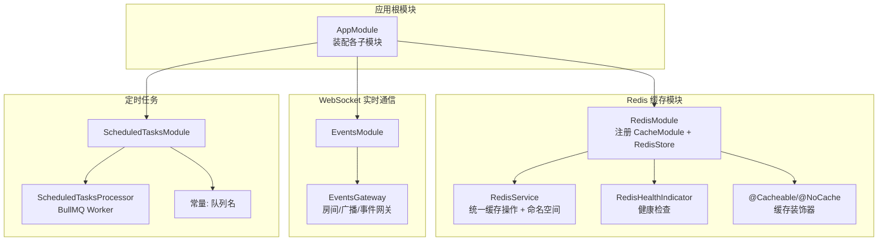
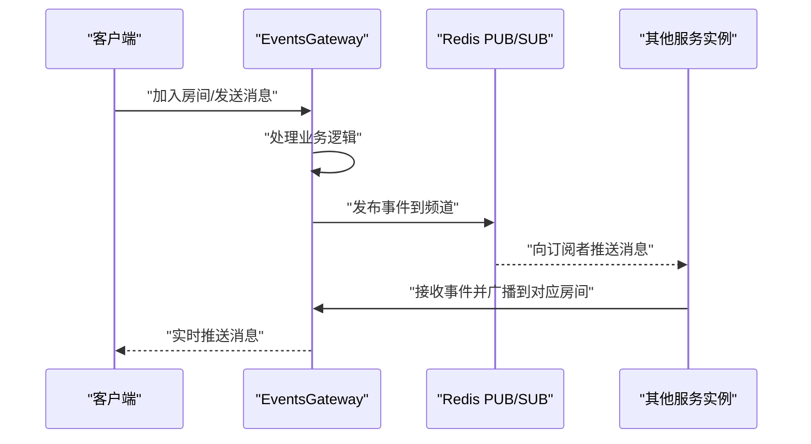
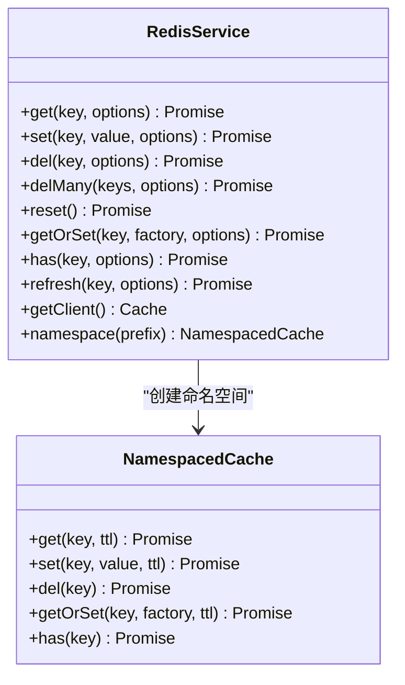
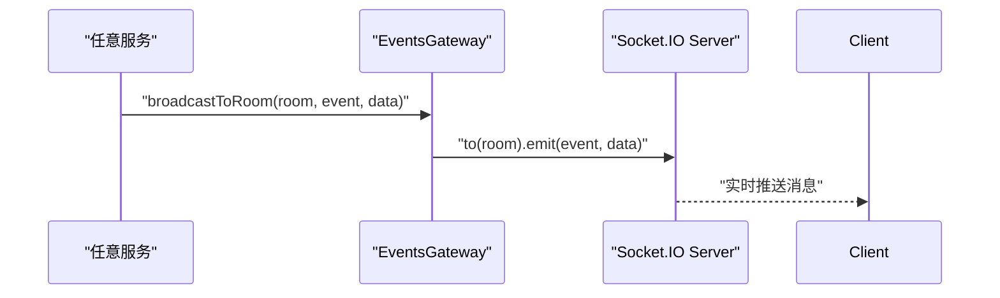
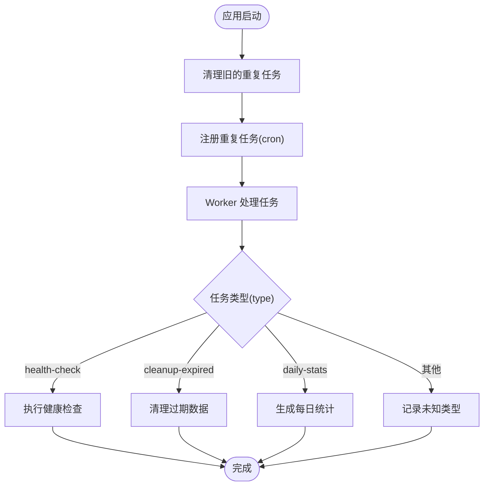
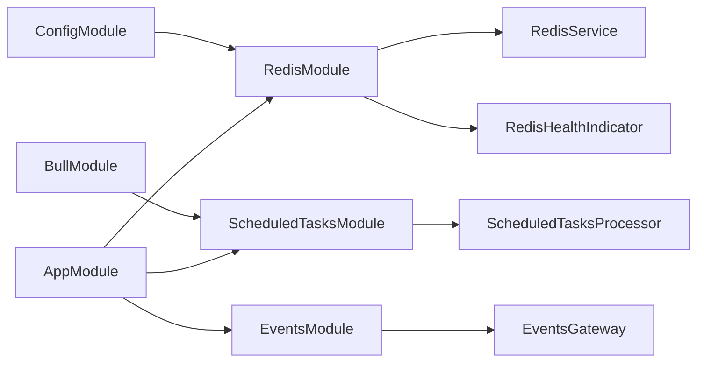

# 消息服务

<cite>
**本文引用的文件**
- [apps/backend/src/app.module.ts](file://apps/backend/src/app.module.ts)
- [apps/backend/src/redis/redis.module.ts](file://apps/backend/src/redis/redis.module.ts)
- [apps/backend/src/redis/redis.service.ts](file://apps/backend/src/redis/redis.service.ts)
- [apps/backend/src/redis/redis.health.ts](file://apps/backend/src/redis/redis.health.ts)
- [apps/backend/src/redis/cache.decorator.ts](file://apps/backend/src/redis/cache.decorator.ts)
- [apps/backend/src/events/events.module.ts](file://apps/backend/src/events/events.module.ts)
- [apps/backend/src/events/events.gateway.ts](file://apps/backend/src/events/events.gateway.ts)
- [apps/backend/src/scheduled-tasks/scheduled-tasks.module.ts](file://apps/backend/src/scheduled-tasks/scheduled-tasks.module.ts)
- [apps/backend/src/scheduled-tasks/scheduled-tasks.processor.ts](file://apps/backend/src/scheduled-tasks/scheduled-tasks.processor.ts)
- [apps/backend/src/scheduled-tasks/constants.ts](file://apps/backend/src/scheduled-tasks/constants.ts)
</cite>

## 目录
1. [简介](#简介)
2. [项目结构](#项目结构)
3. [核心组件](#核心组件)
4. [架构总览](#架构总览)
5. [详细组件分析](#详细组件分析)
6. [依赖关系分析](#依赖关系分析)
7. [性能考量](#性能考量)
8. [故障排查指南](#故障排查指南)
9. [结论](#结论)
10. [附录](#附录)

## 简介
本文件围绕 Redis 消息队列与发布/订阅能力展开，重点说明 RedisService 如何基于底层 cache-manager 实例实现消息发布与订阅机制；Redis 在 WebSocket 实时通信中的角色；以及如何通过 Redis 的 PUB/SUB 模式实现跨服务实例的事件通知，支持水平扩展。同时，文档覆盖消息序列化格式、频道命名规范、错误处理机制、可靠性保障（重试机制）、离线消息处理策略、性能优化建议，并结合定时任务与用户状态同步等业务场景给出使用示例与最佳实践。

## 项目结构
本项目采用多模块架构，Redis 相关能力集中在 redis 子模块，WebSocket 实时通信集中在 events 子模块，后台任务调度集中在 scheduled-tasks 子模块。应用根模块负责装配这些子模块并统一配置 Redis 连接与队列参数。

图表来源
- [apps/backend/src/app.module.ts](file://apps/backend/src/app.module.ts#L1-L159)
- [apps/backend/src/redis/redis.module.ts](file://apps/backend/src/redis/redis.module.ts#L1-L84)
- [apps/backend/src/redis/redis.service.ts](file://apps/backend/src/redis/redis.service.ts#L1-L232)
- [apps/backend/src/redis/redis.health.ts](file://apps/backend/src/redis/redis.health.ts#L1-L42)
- [apps/backend/src/redis/cache.decorator.ts](file://apps/backend/src/redis/cache.decorator.ts#L1-L88)
- [apps/backend/src/events/events.module.ts](file://apps/backend/src/events/events.module.ts#L1-L13)
- [apps/backend/src/events/events.gateway.ts](file://apps/backend/src/events/events.gateway.ts#L1-L120)
- [apps/backend/src/scheduled-tasks/scheduled-tasks.module.ts](file://apps/backend/src/scheduled-tasks/scheduled-tasks.module.ts#L1-L78)
- [apps/backend/src/scheduled-tasks/scheduled-tasks.processor.ts](file://apps/backend/src/scheduled-tasks/scheduled-tasks.processor.ts#L1-L74)
- [apps/backend/src/scheduled-tasks/constants.ts](file://apps/backend/src/scheduled-tasks/constants.ts#L1-L5)

章节来源
- [apps/backend/src/app.module.ts](file://apps/backend/src/app.module.ts#L1-L159)
- [apps/backend/src/redis/redis.module.ts](file://apps/backend/src/redis/redis.module.ts#L1-L84)

## 核心组件
- RedisModule：通过异步工厂注册 CacheModule，并注入 redisStore，提供全局可用的 Redis 连接与 TTL 配置。
- RedisService：封装统一的缓存操作接口，支持键前缀、命名空间、批量删除、刷新 TTL 等能力，并暴露底层 cache-manager 实例。
- RedisHealthIndicator：通过 set/get 验证 Redis 连接与读写能力，用于健康检查。
- Cacheable/NoCache：方法级缓存装饰器，配合 @nestjs/cache-manager 的 CacheInterceptor 实现缓存命中与失效。
- EventsGateway：WebSocket 事件网关，支持房间、广播、事件派发，便于跨实例事件通知。
- ScheduledTasksModule/ScheduledTasksProcessor：基于 BullMQ 的定时任务模块，支持重复任务与失败重试，适合周期性事件处理。

章节来源
- [apps/backend/src/redis/redis.module.ts](file://apps/backend/src/redis/redis.module.ts#L1-L84)
- [apps/backend/src/redis/redis.service.ts](file://apps/backend/src/redis/redis.service.ts#L1-L232)
- [apps/backend/src/redis/redis.health.ts](file://apps/backend/src/redis/redis.health.ts#L1-L42)
- [apps/backend/src/redis/cache.decorator.ts](file://apps/backend/src/redis/cache.decorator.ts#L1-L88)
- [apps/backend/src/events/events.gateway.ts](file://apps/backend/src/events/events.gateway.ts#L1-L120)
- [apps/backend/src/scheduled-tasks/scheduled-tasks.module.ts](file://apps/backend/src/scheduled-tasks/scheduled-tasks.module.ts#L1-L78)
- [apps/backend/src/scheduled-tasks/scheduled-tasks.processor.ts](file://apps/backend/src/scheduled-tasks/scheduled-tasks.processor.ts#L1-L74)

## 架构总览
Redis 在本项目中承担两类角色：
- 缓存中间件：通过 RedisService 统一管理键空间、TTL、批量操作与健康检查。
- 消息中间件：通过 Redis 的 PUB/SUB 模式实现跨服务实例的事件通知，结合 WebSocket 的房间广播，形成“分布式事件总线”。

图表来源
- [apps/backend/src/events/events.gateway.ts](file://apps/backend/src/events/events.gateway.ts#L1-L120)
- [apps/backend/src/redis/redis.module.ts](file://apps/backend/src/redis/redis.module.ts#L1-L84)

## 详细组件分析

### RedisService：缓存与底层客户端访问
RedisService 提供统一的缓存操作接口，内部通过 cache-manager 的 Cache 实例进行读写。其关键特性包括：
- 键前缀管理：通过 buildKey 与 namespace 方法实现键空间隔离，避免冲突。
- TTL 控制：支持默认 TTL 与按键自定义 TTL；refresh 可延长过期时间。
- 批量操作：delMany 支持并发删除多个键。
- 健壮性：onModuleDestroy 中优雅关闭底层连接；异常捕获与日志记录。
- 底层访问：getClient 返回底层 Cache 实例，便于直接调用 Redis 命令（如发布/订阅）。

图表来源
- [apps/backend/src/redis/redis.service.ts](file://apps/backend/src/redis/redis.service.ts#L1-L232)

章节来源
- [apps/backend/src/redis/redis.service.ts](file://apps/backend/src/redis/redis.service.ts#L1-L232)

### RedisModule：连接配置与 TTL 策略
RedisModule 通过 CacheModule.registerAsync 注册 RedisStore，具备以下能力：
- 异步工厂从 ConfigService 读取 REDIS_* 环境变量，构建连接参数。
- keyPrefix 与默认 TTL 注入到 cache-manager。
- 连接重试策略：指数退避，最大重试次数与延迟上限可控。
- 成功/失败日志输出，便于运维监控。

章节来源
- [apps/backend/src/redis/redis.module.ts](file://apps/backend/src/redis/redis.module.ts#L1-L84)

### Redis 健康检查：RedisHealthIndicator
通过 set/get 测试键验证 Redis 连接与读写一致性，异常时抛出 HealthCheckError，便于集成健康检查端点。

章节来源
- [apps/backend/src/redis/redis.health.ts](file://apps/backend/src/redis/redis.health.ts#L1-L42)

### 缓存装饰器：@Cacheable 与 @NoCache
- @Cacheable：对方法启用缓存拦截，可自定义缓存键与 TTL。
- @NoCache：禁用缓存拦截。
- 与 RedisService 的键前缀策略配合，可实现细粒度的缓存控制。

章节来源
- [apps/backend/src/redis/cache.decorator.ts](file://apps/backend/src/redis/cache.decorator.ts#L1-L88)

### WebSocket 事件网关：EventsGateway
EventsGateway 提供：
- 房间 join/leave 与消息广播。
- 对外暴露 broadcastToRoom/broadcastToAll，供其他服务调用。
- 与 Redis 的 PUB/SUB 结合，可在多实例间转发事件。

图表来源
- [apps/backend/src/events/events.gateway.ts](file://apps/backend/src/events/events.gateway.ts#L1-L120)

章节来源
- [apps/backend/src/events/events.gateway.ts](file://apps/backend/src/events/events.gateway.ts#L1-L120)
- [apps/backend/src/events/events.module.ts](file://apps/backend/src/events/events.module.ts#L1-L13)

### 定时任务：BullMQ 与 ScheduledTasks
- ScheduledTasksModule：注册队列并清理旧的重复任务，再按 cron 表达式注册新的重复任务。
- ScheduledTasksProcessor：根据 job.data.type 分发处理不同任务类型，包含健康检查、清理过期数据、每日统计等。
- BullModule 全局配置了默认重试次数与指数退避策略，保证任务可靠性。

图表来源
- [apps/backend/src/scheduled-tasks/scheduled-tasks.module.ts](file://apps/backend/src/scheduled-tasks/scheduled-tasks.module.ts#L1-L78)
- [apps/backend/src/scheduled-tasks/scheduled-tasks.processor.ts](file://apps/backend/src/scheduled-tasks/scheduled-tasks.processor.ts#L1-L74)
- [apps/backend/src/scheduled-tasks/constants.ts](file://apps/backend/src/scheduled-tasks/constants.ts#L1-L5)
- [apps/backend/src/app.module.ts](file://apps/backend/src/app.module.ts#L93-L111)

章节来源
- [apps/backend/src/scheduled-tasks/scheduled-tasks.module.ts](file://apps/backend/src/scheduled-tasks/scheduled-tasks.module.ts#L1-L78)
- [apps/backend/src/scheduled-tasks/scheduled-tasks.processor.ts](file://apps/backend/src/scheduled-tasks/scheduled-tasks.processor.ts#L1-L74)
- [apps/backend/src/scheduled-tasks/constants.ts](file://apps/backend/src/scheduled-tasks/constants.ts#L1-L5)
- [apps/backend/src/app.module.ts](file://apps/backend/src/app.module.ts#L93-L111)

## 依赖关系分析
- RedisModule 依赖 ConfigModule 与 redisStore，向外导出 CacheModule 与 RedisService。
- RedisService 依赖 CACHE_MANAGER 注入的 Cache 实例。
- EventsModule 导出 EventsGateway，供应用模块装配。
- ScheduledTasksModule 依赖 BullModule，向外导出队列。
- 应用根模块统一装配以上模块，并配置 BullMQ 默认重试与退避策略。

图表来源
- [apps/backend/src/app.module.ts](file://apps/backend/src/app.module.ts#L1-L159)
- [apps/backend/src/redis/redis.module.ts](file://apps/backend/src/redis/redis.module.ts#L1-L84)
- [apps/backend/src/events/events.module.ts](file://apps/backend/src/events/events.module.ts#L1-L13)
- [apps/backend/src/scheduled-tasks/scheduled-tasks.module.ts](file://apps/backend/src/scheduled-tasks/scheduled-tasks.module.ts#L1-L78)

章节来源
- [apps/backend/src/app.module.ts](file://apps/backend/src/app.module.ts#L1-L159)
- [apps/backend/src/redis/redis.module.ts](file://apps/backend/src/redis/redis.module.ts#L1-L84)
- [apps/backend/src/events/events.module.ts](file://apps/backend/src/events/events.module.ts#L1-L13)
- [apps/backend/src/scheduled-tasks/scheduled-tasks.module.ts](file://apps/backend/src/scheduled-tasks/scheduled-tasks.module.ts#L1-L78)

## 性能考量
- 连接与重试：RedisModule 的连接重试策略与最大重试次数可降低瞬时故障影响；合理设置 keyPrefix 与 TTL，避免键空间膨胀。
- 批量操作：优先使用 delMany 并发删除，减少网络往返。
- 命名空间：通过 RedisService.namespace 与 CachePrefix 隔离键空间，提升查找效率与可维护性。
- 缓存命中：结合 @Cacheable 与合理的 TTL，减少热点数据的重复计算与数据库压力。
- WebSocket 广播：EventsGateway 的房间模型天然支持按需广播，避免全量广播带来的网络压力。
- 定时任务：BullMQ 的指数退避与默认重试次数，确保任务在分布式环境下稳定执行。

[本节为通用性能建议，无需特定文件来源]

## 故障排查指南
- Redis 连接失败：检查 REDIS_HOST/PORT/PASSWORD/DB 等环境变量；关注 RedisModule 的重试日志与错误堆栈。
- 健康检查失败：使用 RedisHealthIndicator 的 isHealthy 方法定位读写问题；确认 keyPrefix 与 TTL 配置。
- 缓存异常：RedisService 的 get/set/del 等方法均包含 try/catch 与日志记录，可通过日志定位具体键与错误原因。
- WebSocket 广播无效：确认 EventsGateway 的房间 join/leave 与广播调用路径；核对客户端是否正确加入房间。
- 定时任务未执行：检查 ScheduledTasksModule 的重复任务清理与注册逻辑；核对 cron 表达式与队列名称。

章节来源
- [apps/backend/src/redis/redis.module.ts](file://apps/backend/src/redis/redis.module.ts#L1-L84)
- [apps/backend/src/redis/redis.health.ts](file://apps/backend/src/redis/redis.health.ts#L1-L42)
- [apps/backend/src/redis/redis.service.ts](file://apps/backend/src/redis/redis.service.ts#L1-L232)
- [apps/backend/src/events/events.gateway.ts](file://apps/backend/src/events/events.gateway.ts#L1-L120)
- [apps/backend/src/scheduled-tasks/scheduled-tasks.module.ts](file://apps/backend/src/scheduled-tasks/scheduled-tasks.module.ts#L1-L78)

## 结论
本项目通过 RedisModule 与 RedisService 提供了可靠的缓存能力，并结合 EventsGateway 的房间广播与 BullMQ 的定时任务，形成了可扩展的实时通信与事件处理体系。Redis 的 PUB/SUB 模式可进一步用于跨实例事件通知，实现水平扩展下的事件总线。建议在生产环境中完善频道命名规范、消息序列化策略与重试/幂等设计，以提升系统稳定性与可观测性。

[本节为总结性内容，无需特定文件来源]

## 附录

### Redis 作为消息中间件与 WebSocket 的协作
- Redis PUB/SUB：用于跨实例事件通知，典型场景包括用户状态变更、系统告警、跨服务事件分发。
- WebSocket 房间广播：用于同一实例内的实时消息分发，典型场景包括聊天室、在线协作、实时通知。
- 协作方式：上游服务通过 Redis 发布事件，其他实例的服务通过 Redis 订阅事件后，调用 EventsGateway 的广播接口，将消息推送到对应房间或全局。

[本节为概念性说明，无需特定文件来源]

### 消息序列化格式与频道命名规范
- 序列化格式：建议统一使用 JSON 序列化，字段包含事件类型、数据体、时间戳、来源实例标识等，便于下游解析与审计。
- 频道命名规范：建议采用“命名空间:事件类型”或“命名空间:业务域:事件类型”的层级命名，结合 RedisService.namespace 与 CachePrefix 实现键空间隔离。

[本节为通用规范建议，无需特定文件来源]

### 可靠性保障与离线消息处理
- 可靠性：BullMQ 的默认重试与指数退避策略可满足大多数后台任务的可靠性需求；Redis 连接重试策略可降低瞬时故障影响。
- 离线消息：WebSocket 层面可结合房间模型与用户状态同步，实现离线期间的消息聚合与补发；Redis 可作为消息持久化的补充方案（如引入队列存储），但需注意与现有架构的权衡。

[本节为通用可靠性建议，无需特定文件来源]

### 使用示例与最佳实践（结合业务场景）
- 用户状态同步：当用户状态发生变更时，服务端通过 Redis 发布事件，其他实例订阅后调用 EventsGateway 的广播接口，将状态变更推送到该用户的房间或全局。
- 定时任务：使用 ScheduledTasksModule 注册周期性任务，如每小时清理过期数据、每天凌晨生成统计报表；任务失败自动重试，完成后可选择保留或清理。

章节来源
- [apps/backend/src/scheduled-tasks/scheduled-tasks.module.ts](file://apps/backend/src/scheduled-tasks/scheduled-tasks.module.ts#L1-L78)
- [apps/backend/src/scheduled-tasks/scheduled-tasks.processor.ts](file://apps/backend/src/scheduled-tasks/scheduled-tasks.processor.ts#L1-L74)
- [apps/backend/src/events/events.gateway.ts](file://apps/backend/src/events/events.gateway.ts#L1-L120)