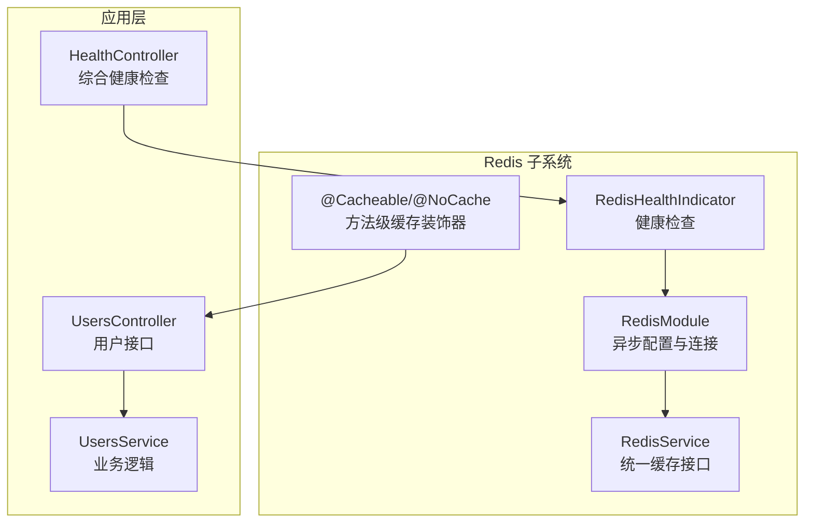
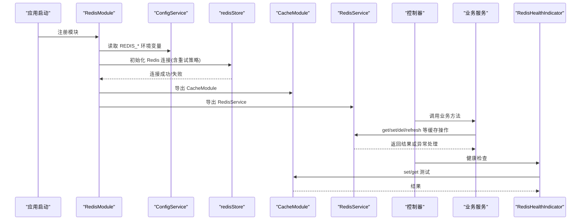
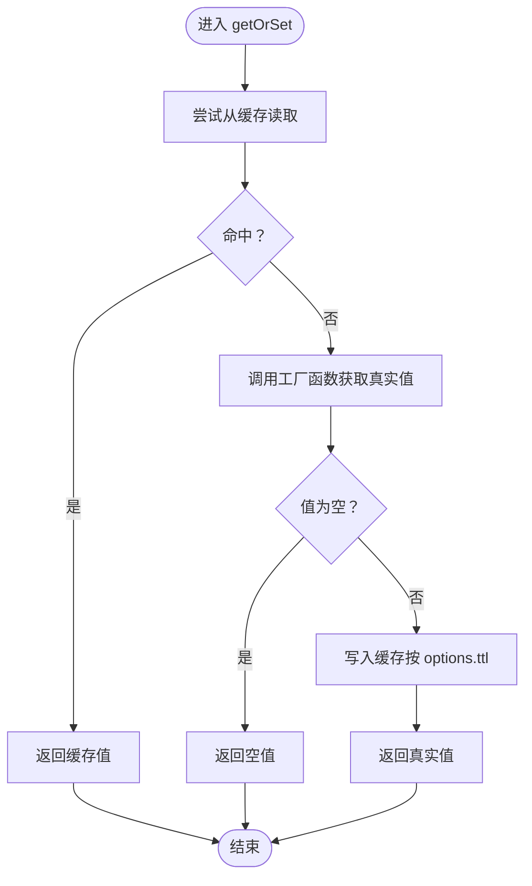
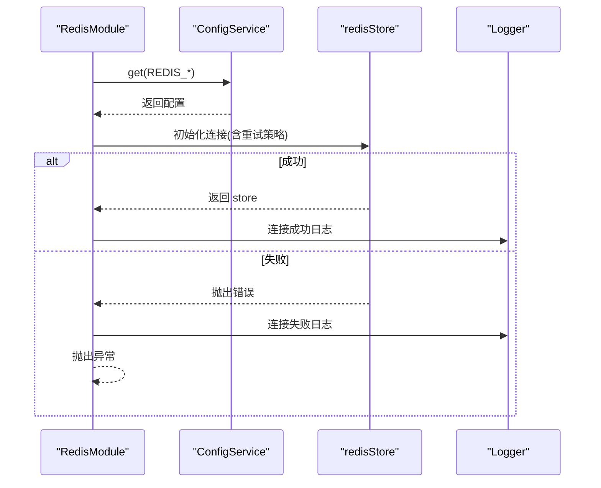
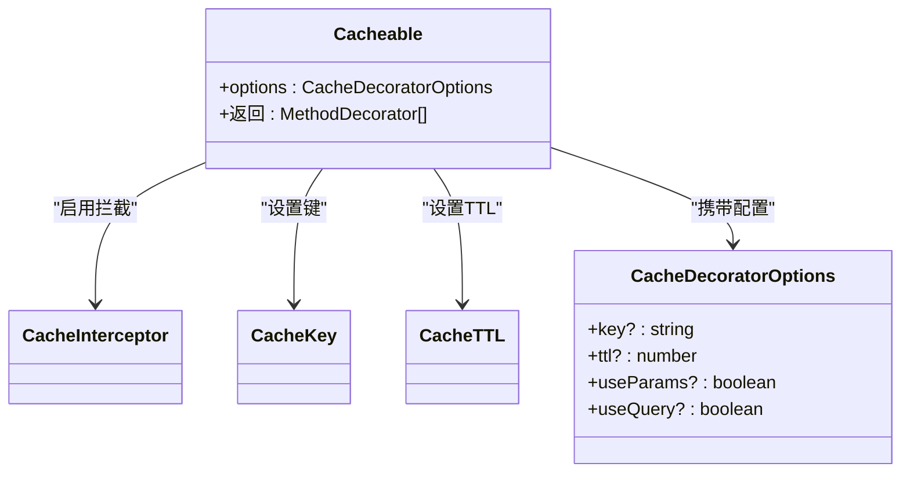
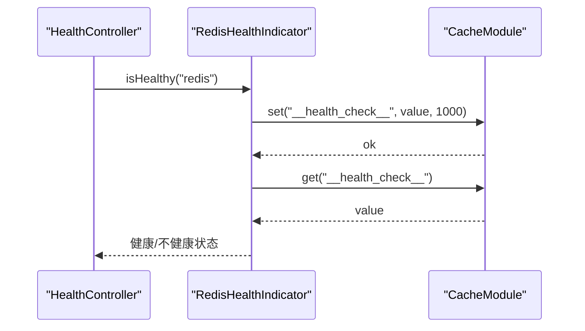
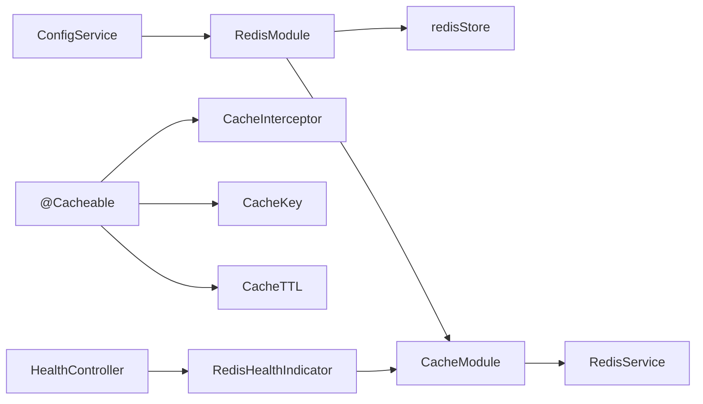

# 缓存服务

<cite>
**本文引用的文件列表**
- [redis.service.ts](file://apps/backend/src/redis/redis.service.ts)
- [cache.decorator.ts](file://apps/backend/src/redis/cache.decorator.ts)
- [redis.module.ts](file://apps/backend/src/redis/redis.module.ts)
- [redis.health.ts](file://apps/backend/src/redis/redis.health.ts)
- [index.ts](file://apps/backend/src/redis/index.ts)
- [health.controller.ts](file://apps/backend/src/health/health.controller.ts)
- [users.controller.ts](file://apps/backend/src/users/users.controller.ts)
- [users.service.ts](file://apps/backend/src/users/users.service.ts)
</cite>

## 目录
1. [简介](#简介)
2. [项目结构](#项目结构)
3. [核心组件](#核心组件)
4. [架构总览](#架构总览)
5. [详细组件分析](#详细组件分析)
6. [依赖关系分析](#依赖关系分析)
7. [性能考量](#性能考量)
8. [故障排查指南](#故障排查指南)
9. [结论](#结论)
10. [附录](#附录)

## 简介
本文件系统性梳理后端缓存子系统的实现与最佳实践，重点覆盖以下方面：
- RedisService 的核心方法（get/set/del/has/refresh/reset/namespace/getOrSet）的实现机制与异常处理策略
- RedisModule 如何通过异步配置从 ConfigService 加载 Redis 连接参数，并实现自动重连与错误重试
- cache.decorator.ts 中 @Cacheable、@CacheKey、@CacheTTL 等装饰器的工作原理，展示如何通过 AOP 方式实现方法级缓存
- getOrSet 方法防止缓存穿透的实现细节（空值缓存与随机 TTL 策略）
- 键命名规范（前缀隔离命名空间）与序列化方案
- 在用户服务与健康检查等场景中的应用示例
- 缓存雪崩、击穿问题的应对方案与监控建议

## 项目结构
缓存相关代码集中在 apps/backend/src/redis 目录，包含：
- RedisModule：全局缓存模块，负责异步加载配置并建立 Redis 连接
- RedisService：统一的缓存操作接口，提供键前缀、命名空间、批量操作、穿透防护等能力
- Cacheable 装饰器：基于 NestJS CacheInterceptor 的方法级缓存装饰器
- RedisHealthIndicator：基于 cache-manager 的健康检查指标
- 导出入口 index.ts：集中导出模块、服务、健康检查与装饰器

图表来源
- [redis.module.ts](file://apps/backend/src/redis/redis.module.ts#L1-L84)
- [redis.service.ts](file://apps/backend/src/redis/redis.service.ts#L1-L232)
- [cache.decorator.ts](file://apps/backend/src/redis/cache.decorator.ts#L1-L88)
- [redis.health.ts](file://apps/backend/src/redis/redis.health.ts#L1-L43)
- [health.controller.ts](file://apps/backend/src/health/health.controller.ts#L1-L77)
- [users.controller.ts](file://apps/backend/src/users/users.controller.ts#L1-L43)
- [users.service.ts](file://apps/backend/src/users/users.service.ts#L1-L66)

章节来源
- [redis.module.ts](file://apps/backend/src/redis/redis.module.ts#L1-L84)
- [redis.service.ts](file://apps/backend/src/redis/redis.service.ts#L1-L232)
- [cache.decorator.ts](file://apps/backend/src/redis/cache.decorator.ts#L1-L88)
- [redis.health.ts](file://apps/backend/src/redis/redis.health.ts#L1-L43)
- [health.controller.ts](file://apps/backend/src/health/health.controller.ts#L1-L77)
- [users.controller.ts](file://apps/backend/src/users/users.controller.ts#L1-L43)
- [users.service.ts](file://apps/backend/src/users/users.service.ts#L1-L66)

## 核心组件
- RedisModule：通过 CacheModule.registerAsync 异步加载配置，使用 redisStore 建立 Redis 连接，内置自动重连与错误重试策略，并导出 CacheModule 与 RedisService
- RedisService：提供 get/set/del/has/refresh/reset/namespace/getOrSet 等方法；内置日志记录与异常捕获；支持键前缀与命名空间隔离
- Cacheable 装饰器：基于 NestJS CacheInterceptor，支持自定义缓存键与 TTL，同时可禁用缓存
- RedisHealthIndicator：通过 cache-manager 的 set/get 验证连接可用性，作为健康检查指标

章节来源
- [redis.module.ts](file://apps/backend/src/redis/redis.module.ts#L1-L84)
- [redis.service.ts](file://apps/backend/src/redis/redis.service.ts#L1-L232)
- [cache.decorator.ts](file://apps/backend/src/redis/cache.decorator.ts#L1-L88)
- [redis.health.ts](file://apps/backend/src/redis/redis.health.ts#L1-L43)

## 架构总览
下图展示了 RedisModule 初始化、RedisService 使用、装饰器拦截与健康检查的整体流程。

图表来源
- [redis.module.ts](file://apps/backend/src/redis/redis.module.ts#L1-L84)
- [redis.service.ts](file://apps/backend/src/redis/redis.service.ts#L1-L232)
- [redis.health.ts](file://apps/backend/src/redis/redis.health.ts#L1-L43)

## 详细组件分析

### RedisService：统一缓存接口与异常处理
- 键前缀与命名空间
  - 通过 buildKey(key, prefix) 统一拼接前缀，避免键冲突
  - namespace(prefix) 返回 NamespacedCache，自动为每个操作加上前缀
- 核心方法
  - get(key, options?)：获取缓存值，异常捕获并返回 undefined
  - set(key, value, options?)：设置缓存值，TTL 单位转换为毫秒
  - del(key, options?)：删除缓存
  - delMany(keys, options?)：批量删除，内部并行执行
  - reset()：清空缓存（谨慎使用），记录警告日志
  - has(key, options?)：判断键是否存在
  - refresh(key, options?)：重新设置 TTL，返回布尔值
  - getClient()：暴露底层 cache-manager 实例
- 异常处理
  - 所有操作均 try/catch 包裹，记录错误日志并返回安全默认值（如 undefined/false）
  - onModuleDestroy() 关闭底层连接，避免资源泄漏
- getOrSet：防穿透策略
  - 若缓存命中则直接返回
  - 若未命中，调用 factory 获取真实值；仅当值非空时写入缓存
  - 注意：当前实现未包含“空值缓存 + 随机 TTL”策略，建议在业务侧补充以进一步降低击穿风险

图表来源
- [redis.service.ts](file://apps/backend/src/redis/redis.service.ts#L145-L160)

章节来源
- [redis.service.ts](file://apps/backend/src/redis/redis.service.ts#L1-L232)

### RedisModule：异步配置、自动重连与错误重试
- 配置来源
  - 通过 ConfigService 读取 REDIS_HOST、REDIS_PORT、REDIS_PASSWORD、REDIS_DB、REDIS_KEY_PREFIX、REDIS_DEFAULT_TTL 等环境变量
  - 默认 keyPrefix 为 app:，默认 TTL 为 300 秒（转换为毫秒）
- 连接与重试
  - 使用 redisStore 初始化连接，启用 ready 检测
  - retryStrategy：最多 10 次重试，延迟按 times*100 递增但不超过 3000ms
  - maxRetriesPerRequest：请求最大重试次数为 3
  - 连接成功/失败均有日志输出
- 导出
  - 导出 CacheModule 与 RedisService，供全局使用

图表来源
- [redis.module.ts](file://apps/backend/src/redis/redis.module.ts#L1-L84)

章节来源
- [redis.module.ts](file://apps/backend/src/redis/redis.module.ts#L1-L84)

### Cacheable 装饰器：方法级缓存的 AOP 实现
- 工作原理
  - @Cacheable(options) 返回多个装饰器组合：
    - UseInterceptors(CacheInterceptor)：启用缓存拦截
    - CacheKey(options.key)：自定义缓存键（支持占位符）
    - CacheTTL(options.ttl)：自定义 TTL（毫秒）
    - SetMetadata(CACHE_OPTIONS_KEY, options)：附加元数据，便于后续处理
  - @NoCache() 设置 metadata 标记，禁用缓存
- 使用场景
  - 对高频读取且相对稳定的接口（如用户列表、静态配置）进行缓存
  - 通过 key 参数区分不同请求维度（如用户 ID、查询条件）

图表来源
- [cache.decorator.ts](file://apps/backend/src/redis/cache.decorator.ts#L1-L88)

章节来源
- [cache.decorator.ts](file://apps/backend/src/redis/cache.decorator.ts#L1-L88)

### 健康检查：RedisHealthIndicator
- 通过 cache-manager 的 set/get 执行一次写入与读取，验证连接可用性
- 返回健康状态与错误信息，便于集成到 HealthController 的综合健康检查

图表来源
- [redis.health.ts](file://apps/backend/src/redis/redis.health.ts#L1-L43)
- [health.controller.ts](file://apps/backend/src/health/health.controller.ts#L1-L77)

章节来源
- [redis.health.ts](file://apps/backend/src/redis/redis.health.ts#L1-L43)
- [health.controller.ts](file://apps/backend/src/health/health.controller.ts#L1-L77)

### 键命名规范与序列化
- 键命名规范
  - 使用 CachePrefix 枚举与自定义前缀隔离命名空间，避免键冲突
  - 通过 RedisService.namespace(prefix) 或 options.prefix 统一加前缀
- 序列化方案
  - 使用 cache-manager 的默认序列化策略；对于复杂对象，建议在业务层进行显式序列化/反序列化，确保跨语言兼容与类型安全

章节来源
- [redis.service.ts](file://apps/backend/src/redis/redis.service.ts#L1-L232)

### 实际应用示例

#### 用户服务中的方法级缓存
- 在用户控制器或服务中对高频读取接口使用 @Cacheable 装饰器，例如：
  - @Cacheable({ key: 'users:list', ttl: 300000 }) 用于用户列表
  - @Cacheable({ key: 'user:profile:${id}', ttl: 1800000 }) 用于用户详情
- 通过 CacheKey 动态占位符生成唯一键，避免缓存污染

章节来源
- [users.controller.ts](file://apps/backend/src/users/users.controller.ts#L1-L43)
- [users.service.ts](file://apps/backend/src/users/users.service.ts#L1-L66)
- [cache.decorator.ts](file://apps/backend/src/redis/cache.decorator.ts#L1-L88)

#### 健康检查场景
- HealthController 集成 RedisHealthIndicator，定期检查 Redis 连接与读写能力
- 与数据库、内存、磁盘健康检查共同组成综合健康检查端点

章节来源
- [health.controller.ts](file://apps/backend/src/health/health.controller.ts#L1-L77)
- [redis.health.ts](file://apps/backend/src/redis/redis.health.ts#L1-L43)

## 依赖关系分析
- RedisModule 依赖 ConfigService 与 redisStore，向全局导出 CacheModule 与 RedisService
- RedisService 依赖 @nestjs/cache-manager 的 Cache 接口
- Cacheable 装饰器依赖 NestJS 的 CacheInterceptor、CacheKey、CacheTTL
- HealthController 依赖 RedisHealthIndicator 与 @nestjs/terminus

图表来源
- [redis.module.ts](file://apps/backend/src/redis/redis.module.ts#L1-L84)
- [redis.service.ts](file://apps/backend/src/redis/redis.service.ts#L1-L232)
- [cache.decorator.ts](file://apps/backend/src/redis/cache.decorator.ts#L1-L88)
- [redis.health.ts](file://apps/backend/src/redis/redis.health.ts#L1-L43)
- [health.controller.ts](file://apps/backend/src/health/health.controller.ts#L1-L77)

章节来源
- [redis.module.ts](file://apps/backend/src/redis/redis.module.ts#L1-L84)
- [redis.service.ts](file://apps/backend/src/redis/redis.service.ts#L1-L232)
- [cache.decorator.ts](file://apps/backend/src/redis/cache.decorator.ts#L1-L88)
- [redis.health.ts](file://apps/backend/src/redis/redis.health.ts#L1-L43)
- [health.controller.ts](file://apps/backend/src/health/health.controller.ts#L1-L77)

## 性能考量
- TTL 设计
  - 对热点数据设置较短 TTL，降低雪崩概率
  - 对冷数据设置较长 TTL，减少数据库压力
- 并发与批量
  - delMany 使用 Promise.all 并行删除，提升批量操作效率
- 命名空间与键设计
  - 使用前缀隔离不同业务域，避免键冲突与误删
- 序列化开销
  - 复杂对象建议显式序列化，减少 cache-manager 默认序列化的不确定性
- 缓存穿透与击穿
  - getOrSet 已具备基本的空值判定；建议补充“空值缓存 + 随机 TTL”策略，进一步降低击穿风险

[本节为通用指导，无需列出具体文件来源]

## 故障排查指南
- Redis 连接失败
  - 检查 REDIS_HOST/REDIS_PORT/REDIS_PASSWORD/REDIS_DB 等环境变量
  - 查看 RedisModule 日志，确认重试次数与延迟策略
- 缓存异常
  - RedisService 的所有操作均捕获异常并记录日志；若出现缓存不可用，应优先检查连接状态
- 健康检查失败
  - RedisHealthIndicator 会抛出 HealthCheckError，检查 set/get 测试是否成功
- 控制台输出
  - 使用 HealthController 的 /health、/health/readiness、/health/liveness 端点快速定位问题

章节来源
- [redis.module.ts](file://apps/backend/src/redis/redis.module.ts#L1-L84)
- [redis.service.ts](file://apps/backend/src/redis/redis.service.ts#L1-L232)
- [redis.health.ts](file://apps/backend/src/redis/redis.health.ts#L1-L43)
- [health.controller.ts](file://apps/backend/src/health/health.controller.ts#L1-L77)

## 结论
本缓存子系统通过 RedisModule 的异步配置与自动重连、RedisService 的统一接口与异常处理、Cacheable 装饰器的方法级缓存，以及 RedisHealthIndicator 的健康检查，形成了稳定高效的缓存基础设施。建议在现有 getOrSet 基础上增加“空值缓存 + 随机 TTL”，并结合合理的 TTL 设计与命名空间策略，有效缓解缓存雪崩与击穿问题，提升系统整体稳定性与性能。

[本节为总结性内容，无需列出具体文件来源]

## 附录

### 缓存穿透与击穿的应对方案
- 缓存穿透
  - getOrSet 已在命中空值时不写入缓存；建议在业务层对空值也写入短 TTL 的占位缓存，并引入随机抖动 TTL，避免同时过期
- 缓存击穿
  - 对热点键设置互斥锁或分布式锁，确保同一时间只有一个请求回源并写入缓存
- 缓存雪崩
  - 为不同键设置随机偏移 TTL，避免大量键在同一时间过期；对热点键采用多副本或预热策略

[本节为通用指导，无需列出具体文件来源]

### 监控建议
- 指标采集
  - 连接数、命中率、过期键数量、命令耗时分布
- 告警阈值
  - 连接失败率、命中率骤降、平均响应时间超阈、内存使用率过高
- 健康检查
  - 定期执行 HealthController 的 /health 端点，纳入运维告警

[本节为通用指导，无需列出具体文件来源]