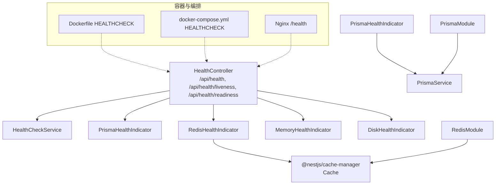
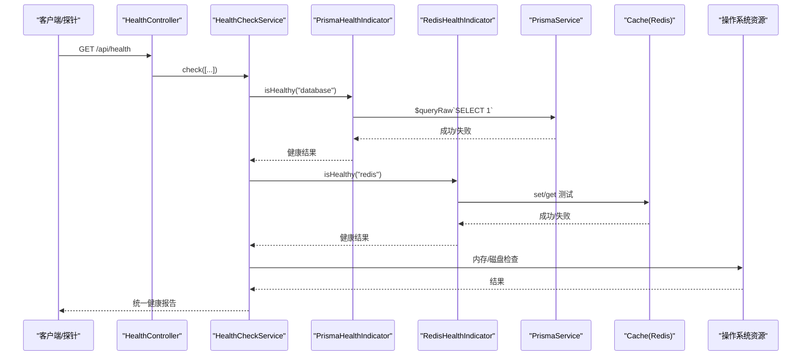
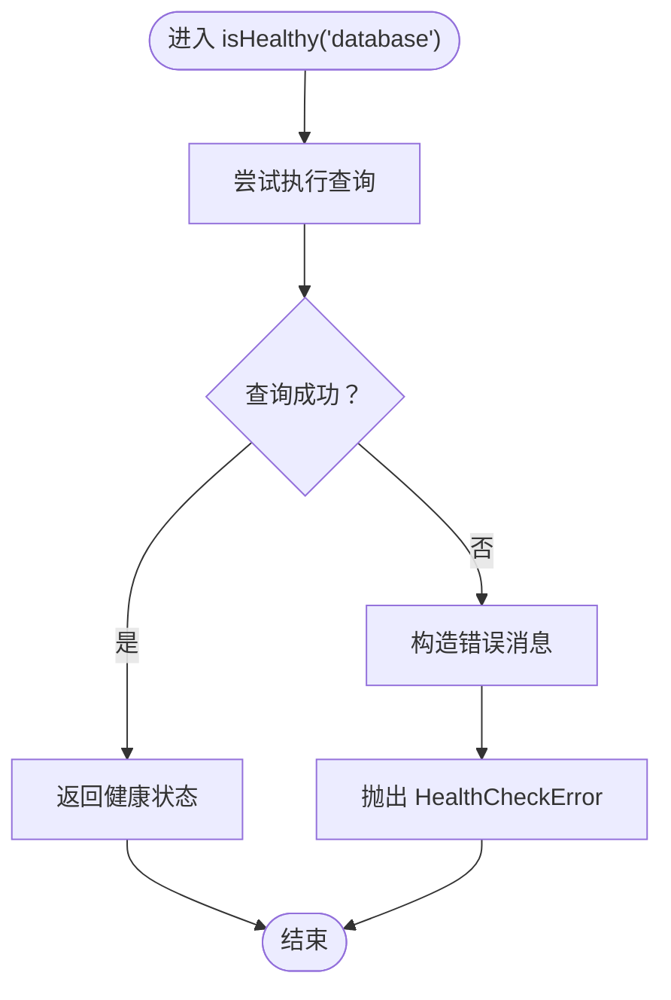
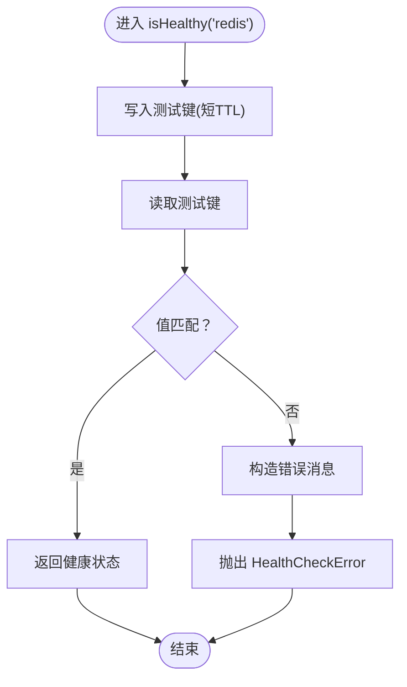
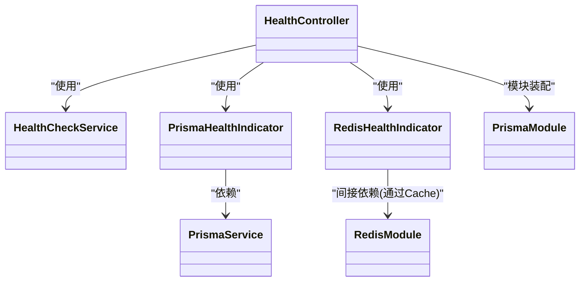

# 健康检查服务

<cite>
**本文引用的文件**
- [apps/backend/src/health/health.controller.ts](file://apps/backend/src/health/health.controller.ts)
- [apps/backend/Dockerfile](file://apps/backend/Dockerfile)
- [docker-compose.yml](file://docker-compose.yml)
- [apps/frontend/nginx.conf](file://apps/frontend/nginx.conf)
</cite>

## 更新摘要
**已更改内容**
- 更新了所有相关配置文件中的健康检查路径，从 `/health` 改为 `/api/health` 以匹配 API 路由结构。
- 修正了文档中关于健康检查端点路径的描述。

## 目录
1. [简介](#简介)
2. [项目结构](#项目结构)
3. [核心组件](#核心组件)
4. [架构总览](#架构总览)
5. [详细组件分析](#详细组件分析)
6. [依赖关系分析](#依赖关系分析)
7. [性能与缓存策略](#性能与缓存策略)
8. [故障排查指南](#故障排查指南)
9. [结论](#结论)
10. [附录：扩展与最佳实践](#附录扩展与最佳实践)

## 简介
本文件面向健康检查服务的使用者与维护者，系统化说明后端健康检查能力的实现与部署方式。内容涵盖：
- HealthController 暴露的 /api/health、/api/health/liveness、/api/health/readiness 端点及响应语义
- PrismaHealthIndicator 与 RedisHealthIndicator 的连通性检测机制
- 在 Docker 容器与 Kubernetes 环境中的健康检查配置与探针使用
- 如何扩展自定义健康检查指标（如外部 API、磁盘空间等）
- 响应缓存策略与探测频率优化建议

## 项目结构
健康检查相关代码集中在后端应用的 health 与 redis、prisma 子模块中，并通过 Terminus 框架统一编排。

图表来源
- [apps/backend/src/health/health.controller.ts](file://apps/backend/src/health/health.controller.ts#L1-L76)
- [apps/backend/Dockerfile](file://apps/backend/Dockerfile#L92-L93)
- [docker-compose.yml](file://docker-compose.yml#L122-L126)
- [apps/frontend/nginx.conf](file://apps/frontend/nginx.conf#L72-L75)

章节来源
- [apps/backend/src/health/health.controller.ts](file://apps/backend/src/health/health.controller.ts#L1-L76)

## 核心组件
- HealthController：提供统一的健康检查入口，组合多个健康指示器进行综合评估；同时提供存活探针与就绪探针端点。
- PrismaHealthIndicator：基于 PrismaService 执行轻量查询，判断数据库连通性。
- RedisHealthIndicator：通过 cache-manager 的 set/get 操作验证 Redis 连通性与读写一致性。
- HealthModule：注册 Terminus 模块、PrismaModule，并注入 HealthController 与两个健康指示器。
- RedisModule/PrismaModule：分别负责 Redis 连接池与 Prisma 客户端生命周期管理。

章节来源
- [apps/backend/src/health/health.controller.ts](file://apps/backend/src/health/health.controller.ts#L1-L76)

## 架构总览
下图展示健康检查端点到各依赖组件的调用链路与职责边界：

图表来源
- [apps/backend/src/health/health.controller.ts](file://apps/backend/src/health/health.controller.ts#L27-L51)
- [apps/backend/src/health/prisma.health.ts](file://apps/backend/src/health/prisma.health.ts#L19-L31)
- [apps/backend/src/redis/redis.health.ts](file://apps/backend/src/redis/redis.health.ts#L20-L42)
- [apps/backend/src/prisma/prisma.service.ts](file://apps/backend/src/prisma/prisma.service.ts#L1-L20)
- [apps/backend/src/redis/redis.module.ts](file://apps/backend/src/redis/redis.module.ts#L29-L84)

## 详细组件分析

### HealthController：端点与响应
- /api/health：综合健康检查，包含数据库、Redis、内存堆与 RSS、磁盘使用率等维度。
- /api/health/liveness：简单存活探针，返回固定结构，便于容器运行时快速判定进程存活。
- /api/health/readiness：就绪探针，仅检查数据库与 Redis，确保业务流量只在关键依赖可用时进入。

响应格式要点（以实际实现为准）：
- 综合健康检查成功时返回统一的健康报告对象（由 Terminus 生成），包含各子指标的状态与元信息。
- 存活探针返回包含状态与时间戳的对象。
- 就绪探针返回与综合健康检查相同的结构，但仅包含数据库与 Redis 两项。

章节来源
- [apps/backend/src/health/health.controller.ts](file://apps/backend/src/health/health.controller.ts#L27-L75)

### PrismaHealthIndicator：数据库连通性检测
- 通过 PrismaService 执行一次轻量 SQL 查询，验证数据库连接可用。
- 成功则返回健康状态；异常时抛出 HealthCheckError，由 Terminus 捕获并纳入整体健康报告。

图表来源
- [apps/backend/src/health/prisma.health.ts](file://apps/backend/src/health/prisma.health.ts#L19-L31)
- [apps/backend/src/prisma/prisma.service.ts](file://apps/backend/src/prisma/prisma.service.ts#L1-L20)

章节来源
- [apps/backend/src/health/prisma.health.ts](file://apps/backend/src/health/prisma.health.ts#L1-L31)
- [apps/backend/src/prisma/prisma.service.ts](file://apps/backend/src/prisma/prisma.service.ts#L1-L20)

### RedisHealthIndicator：Redis 连通性与读写一致性检测
- 使用 cache-manager 的 set/get 对测试键进行写入与读取，验证 Redis 连接与基本读写能力。
- 测试键具有极短 TTL，避免污染线上数据。
- 读取值不匹配或异常时，抛出 HealthCheckError，标记为不健康。

图表来源
- [apps/backend/src/redis/redis.health.ts](file://apps/backend/src/redis/redis.health.ts#L20-L42)
- [apps/backend/src/redis/redis.module.ts](file://apps/backend/src/redis/redis.module.ts#L29-L84)

章节来源
- [apps/backend/src/redis/redis.health.ts](file://apps/backend/src/redis/redis.health.ts#L1-L42)
- [apps/backend/src/redis/redis.module.ts](file://apps/backend/src/redis/redis.module.ts#L1-L84)

### HealthModule：模块装配与依赖注入
- 引入 TerminusModule 与 PrismaModule。
- 注册 HealthController，并注入 PrismaHealthIndicator 与 RedisHealthIndicator。

章节来源
- [apps/backend/src/health/health.module.ts](file://apps/backend/src/health/health.module.ts#L1-L13)

### RedisModule 与 PrismaModule：连接与生命周期
- RedisModule：通过异步工厂从配置注入 Redis 连接参数，启用 ready 检测与重试策略，导出 CacheModule 与 RedisService。
- PrismaModule：全局导出 PrismaService，负责 PrismaClient 的连接与断开。

章节来源
- [apps/backend/src/redis/redis.module.ts](file://apps/backend/src/redis/redis.module.ts#L1-L84)
- [apps/backend/src/prisma/prisma.module.ts](file://apps/backend/src/prisma/prisma.module.ts#L1-L10)
- [apps/backend/src/prisma/prisma.service.ts](file://apps/backend/src/prisma/prisma.service.ts#L1-L20)

## 依赖关系分析
- HealthController 依赖 HealthCheckService、PrismaHealthIndicator、RedisHealthIndicator、MemoryHealthIndicator、DiskHealthIndicator。
- PrismaHealthIndicator 依赖 PrismaService。
- RedisHealthIndicator 依赖 cache-manager 的 Cache 实例（由 RedisModule 注入）。
- HealthModule 同时引入 TerminusModule 与 PrismaModule，保证健康检查框架与数据库模块可用。

图表来源
- [apps/backend/src/health/health.controller.ts](file://apps/backend/src/health/health.controller.ts#L1-L76)
- [apps/backend/src/health/health.module.ts](file://apps/backend/src/health/health.module.ts#L1-L13)
- [apps/backend/src/health/prisma.health.ts](file://apps/backend/src/health/prisma.health.ts#L1-L31)
- [apps/backend/src/redis/redis.health.ts](file://apps/backend/src/redis/redis.health.ts#L1-L42)
- [apps/backend/src/prisma/prisma.module.ts](file://apps/backend/src/prisma/prisma.module.ts#L1-L10)
- [apps/backend/src/redis/redis.module.ts](file://apps/backend/src/redis/redis.module.ts#L1-L84)

## 性能与缓存策略
当前实现采用“即时探测”模式，每次请求都会触发数据库与 Redis 的实际连通性检查。对于高并发场景，建议：
- 降低探测频率：在容器健康检查或探针配置中适当增大间隔与超时，避免对后端造成压力。
- 适度缓存健康状态：可在应用层引入短期缓存（例如 10-30 秒），并在异常时立即失效，从而减少重复探测。
- 分层探测：将 /api/health 作为周期性探测端点，将 /api/health/readiness 用于就绪判断，避免在热路径上频繁全量检查。

[本节为通用建议，不直接分析具体文件]

## 故障排查指南
- 数据库不可达
  - 现象：/api/health 或 /api/health/readiness 返回数据库不健康。
  - 排查：确认 DATABASE_URL、网络连通性、PostgreSQL 服务状态；查看 PrismaHealthIndicator 抛出的错误消息。
- Redis 不可用
  - 现象：/api/health 或 /api/health/readiness 返回 Redis 不健康。
  - 排查：确认 REDIS_HOST/PORT/PASSWORD/DB 等配置；查看 RedisModule 的连接日志与重试策略；验证短 TTL 测试键是否可写可读。
- 内存/磁盘阈值告警
  - 现象：/api/health 中内存或磁盘指标触发不健康。
  - 排查：检查宿主机内存与磁盘使用情况，调整阈值或释放资源。
- 探针失败
  - Docker：检查 HEALTHCHECK 命令与端口映射。
  - docker-compose：确认 depends_on 条件与健康检查间隔。
  - Nginx：前端静态页的 /health 仅返回文本，不影响后端探针。

章节来源
- [apps/backend/src/health/health.controller.ts](file://apps/backend/src/health/health.controller.ts#L27-L75)
- [apps/backend/src/health/prisma.health.ts](file://apps/backend/src/health/prisma.health.ts#L19-L31)
- [apps/backend/src/redis/redis.health.ts](file://apps/backend/src/redis/redis.health.ts#L20-L42)
- [apps/backend/src/redis/redis.module.ts](file://apps/backend/src/redis/redis.module.ts#L29-L84)
- [apps/backend/Dockerfile](file://apps/backend/Dockerfile#L92-L93)
- [docker-compose.yml](file://docker-compose.yml#L122-L126)
- [apps/frontend/nginx.conf](file://apps/frontend/nginx.conf#L72-L75)

## 结论
该健康检查服务通过 Terminus 框架整合数据库、Redis、内存与磁盘等关键指标，提供统一的健康报告与两类探针端点，满足容器与编排平台的运行时需求。结合合理的探测频率与可选的短期缓存策略，可在保障可观测性的同时降低对后端的压力。

[本节为总结性内容，无需列出章节来源]

## 附录：扩展与最佳实践

### 在 Docker 容器中的应用
- 容器镜像内置 HEALTHCHECK，使用 wget 访问 /api/health，失败即退出容器重启。
- docker-compose 中为 backend 与 redis/postgres 配置了健康检查，确保依赖可用后再启动上游服务。

章节来源
- [apps/backend/Dockerfile](file://apps/backend/Dockerfile#L92-L93)
- [docker-compose.yml](file://docker-compose.yml#L17-L22)
- [docker-compose.yml](file://docker-compose.yml#L37-L41)
- [docker-compose.yml](file://docker-compose.yml#L122-L126)

### 在 Kubernetes 环境中的探针配置
- 存活探针（livenessProbe）：建议使用 /api/health/liveness，返回固定结构，快速判定进程存活。
- 就绪探针（readinessProbe）：建议使用 /api/health/readiness，仅检查数据库与 Redis，避免在依赖未就绪时接收流量。
- 建议参数示例（请根据实际环境调整）：
  - initialDelaySeconds：10-30
  - periodSeconds：30-60
  - timeoutSeconds：5-10
  - failureThreshold：2-3
  - successThreshold：1

[本小节为通用配置建议，不直接分析具体文件]

### 扩展自定义健康检查指标
- 外部 API 依赖：可仿照 PrismaHealthIndicator/RedisHealthIndicator 的模式，编写自定义 HealthIndicator，通过 HTTP 请求或 SDK 调用外部服务，捕获异常并返回健康状态。
- 磁盘空间监控：可复用 Terminus 的 DiskHealthIndicator，或自定义 HealthIndicator，读取文件系统使用率并设定阈值。
- CPU/负载：可结合系统指标采集工具（如 Prometheus Node Exporter）在外部进行观测，健康检查端点保留关键依赖即可。

[本小节为通用扩展指导，不直接分析具体文件]

### 响应缓存策略（建议）
- 对于 /api/health：若需要降低对数据库与 Redis 的压力，可在应用层对健康状态进行短期缓存（例如 10-30 秒），异常时立即失效。
- 对于 /api/health/liveness：由于返回固定结构，通常无需缓存。
- 对于 /api/health/readiness：建议保持实时性，避免误判依赖恢复时机。

[本小节为通用建议，不直接分析具体文件]