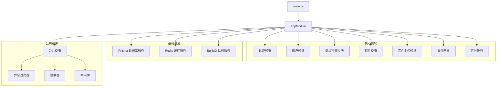
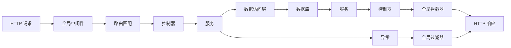
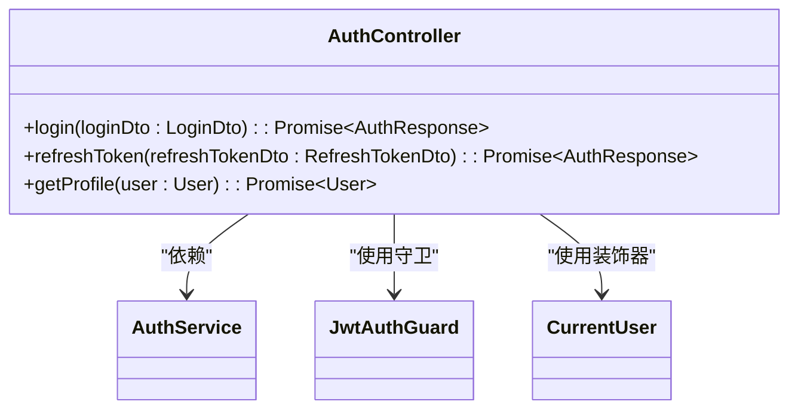
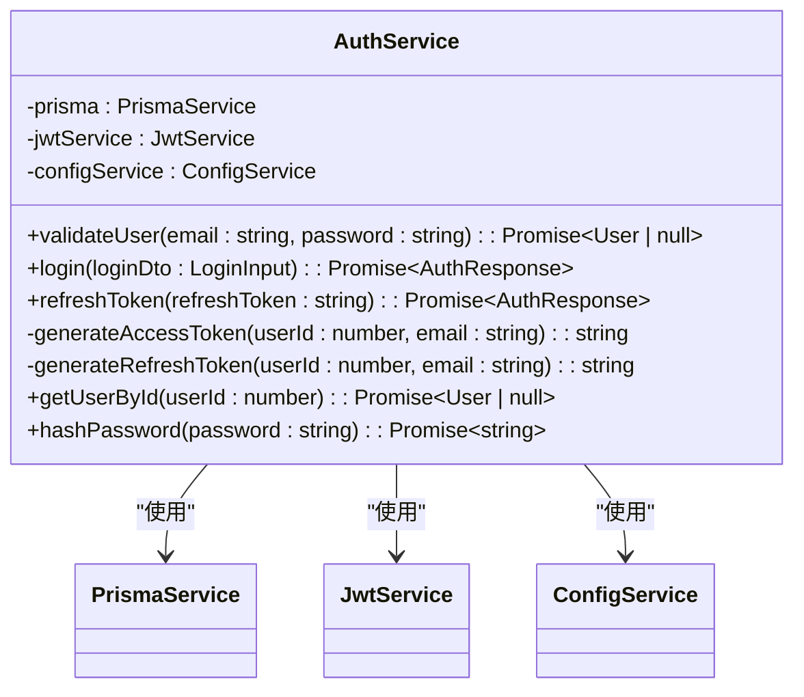
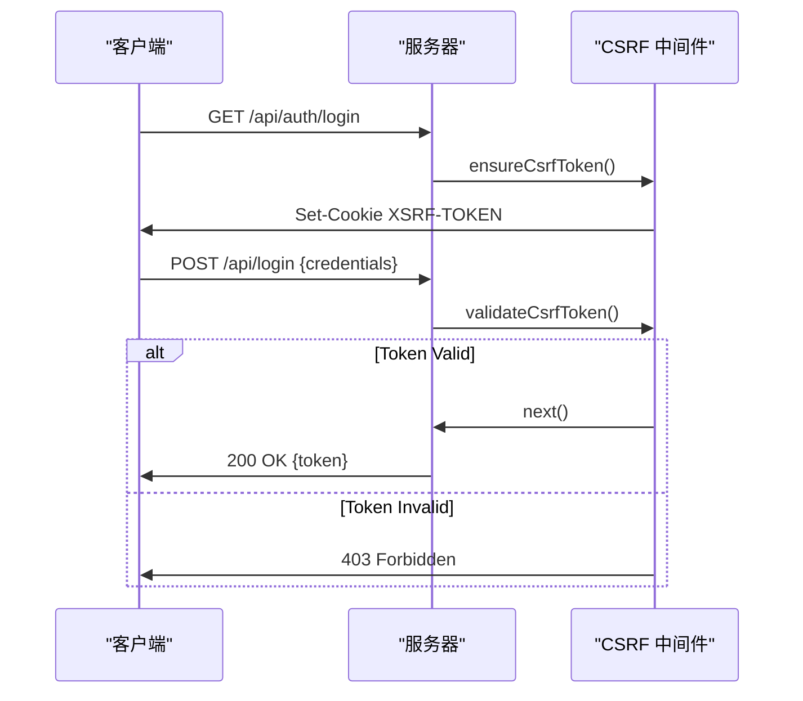
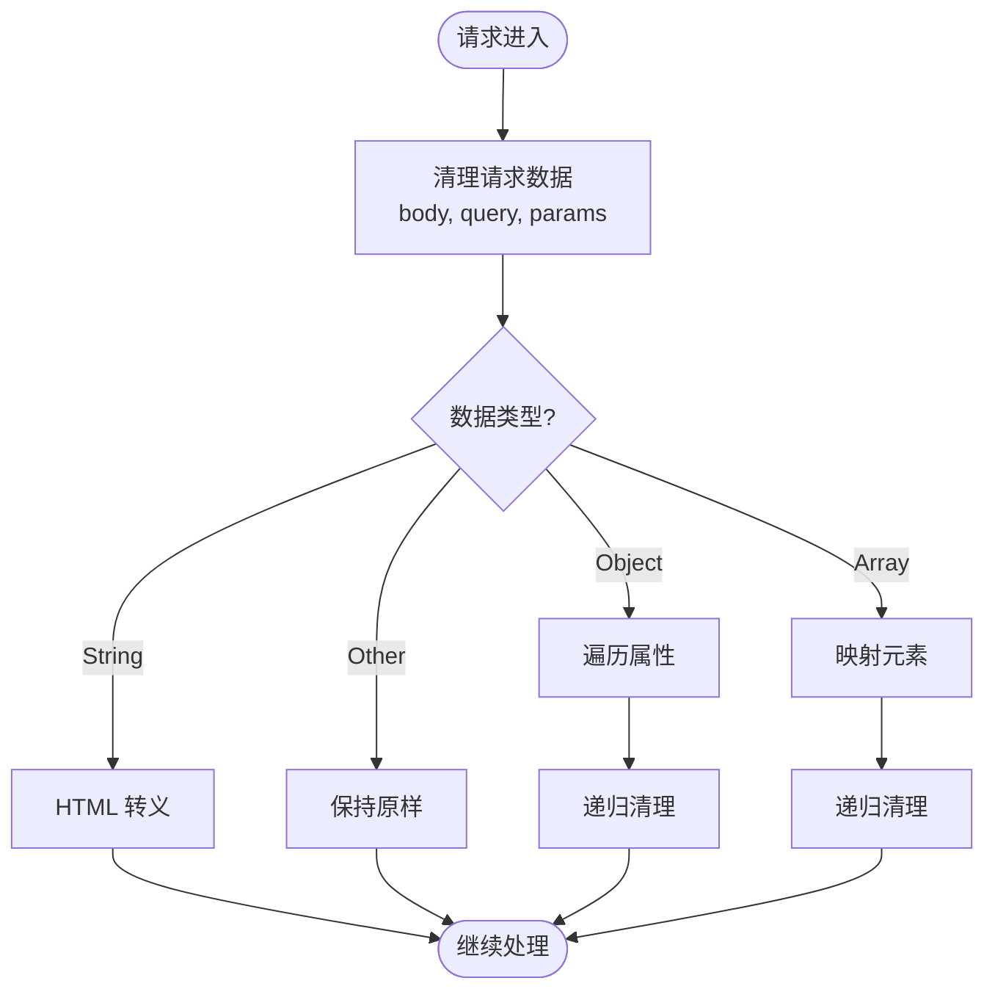
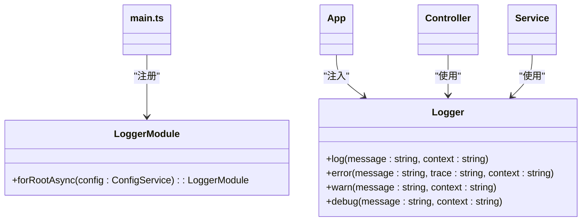
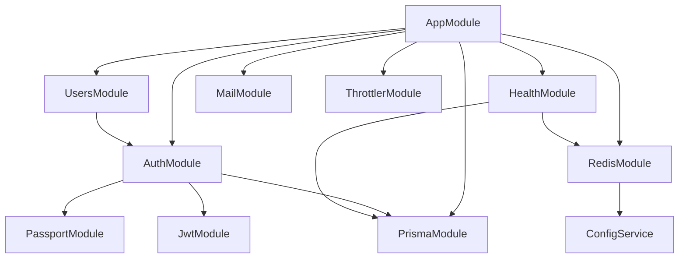

# 后端服务

<cite>
**本文档中引用的文件**  
- [main.ts](file://apps/backend/src/main.ts)
- [app.module.ts](file://apps/backend/src/app.module.ts)
- [auth.module.ts](file://apps/backend/src/auth/auth.module.ts)
- [auth.controller.ts](file://apps/backend/src/auth/auth.controller.ts)
- [auth.service.ts](file://apps/backend/src/auth/auth.service.ts)
- [csrf.middleware.ts](file://apps/backend/src/common/middlewares/csrf.middleware.ts)
- [sanitize.interceptor.ts](file://apps/backend/src/common/interceptors/sanitize.interceptor.ts)
- [all-exceptions.filter.ts](file://apps/backend/src/common/filters/all-exceptions.filter.ts)
- [transform.interceptor.ts](file://apps/backend/src/common/interceptors/transform.interceptor.ts)
- [prisma.service.ts](file://apps/backend/src/prisma/prisma.service.ts)
- [redis.module.ts](file://apps/backend/src/redis/redis.module.ts)
- [health.module.ts](file://apps/backend/src/health/health.module.ts)
- [users.module.ts](file://apps/backend/src/users/users.module.ts)
</cite>

## 目录
1. [简介](#简介)
2. [项目结构](#项目结构)
3. [核心组件](#核心组件)
4. [架构概述](#架构概述)
5. [详细组件分析](#详细组件分析)
6. [依赖分析](#依赖分析)
7. [性能考虑](#性能考虑)
8. [故障排除指南](#故障排除指南)
9. [结论](#结论)

## 简介
本项目是一个基于 NestJS 框架的后端服务，采用模块化、分层的 MVC 变体架构。系统通过依赖注入（DI）实现组件解耦，结合模块（Module）、控制器（Controller）、服务（Service）和提供者（Provider）的职责划分，构建了一个可扩展、高内聚、低耦合的后端应用。项目集成了全面的安全机制，包括 Helmet 安全头、CSRF 中间件、全局 XSS 清理拦截器和速率限制（Throttler），并使用 nestjs-pino 进行日志记录。API 文档通过 Swagger 自动生成，配置通过 ConfigService 统一管理。

## 项目结构
项目采用 NestJS 标准的模块化结构，主要功能按领域划分到独立模块中。核心模块包括认证（auth）、用户（users）、健康检查（health）、邮件（mail）、文件上传（upload）等。公共功能如异常处理、拦截器、中间件统一放置在 common 目录下。数据库访问通过 Prisma 实现，缓存和队列使用 Redis。配置通过 ConfigModule 集中管理，日志使用 nestjs-pino。

**Diagram sources**
- [app.module.ts](file://apps/backend/src/app.module.ts#L22-L144)
- [main.ts](file://apps/backend/src/main.ts#L14-L94)

**Section sources**
- [app.module.ts](file://apps/backend/src/app.module.ts#L1-L159)
- [main.ts](file://apps/backend/src/main.ts#L1-L94)

## 核心组件
后端服务的核心组件遵循 NestJS 的设计模式，包括控制器（Controller）处理 HTTP 请求，服务（Service）封装业务逻辑，模块（Module）组织功能单元，以及提供者（Provider）注入依赖。依赖注入系统贯穿整个应用，确保组件间的松耦合。全局配置通过 ConfigService 注入，安全特性通过中间件、守卫和拦截器实现。

**Section sources**
- [app.module.ts](file://apps/backend/src/app.module.ts#L1-L159)
- [main.ts](file://apps/backend/src/main.ts#L1-L94)

## 架构概述
系统采用分层架构，从上至下依次为：入口层（main.ts）、模块层（Module）、控制器层（Controller）、服务层（Service）和数据访问层（Prisma）。请求流程为：HTTP 请求 → 全局中间件（Helmet、CSRF、压缩等）→ 路由 → 控制器 → 服务 → 数据库。响应流程则通过全局拦截器（TransformInterceptor）进行标准化包装。异常由全局过滤器（AllExceptionsFilter）统一处理。

**Diagram sources**
- [main.ts](file://apps/backend/src/main.ts#L14-L94)
- [app.module.ts](file://apps/backend/src/app.module.ts#L22-L144)

## 详细组件分析
### 认证模块分析
认证模块负责用户的身份验证和授权，包含控制器、服务、策略和守卫。使用 JWT 进行无状态认证，支持访问令牌和刷新令牌机制。

#### 认证控制器

**Diagram sources**
- [auth.controller.ts](file://apps/backend/src/auth/auth.controller.ts#L13-L51)
- [auth.service.ts](file://apps/backend/src/auth/auth.service.ts#L21-L150)

#### 认证服务

**Diagram sources**
- [auth.service.ts](file://apps/backend/src/auth/auth.service.ts#L21-L150)
- [prisma.service.ts](file://apps/backend/src/prisma/prisma.service.ts#L5-L20)

### 安全特性分析
系统实现了多层次的安全防护机制。

#### CSRF 中间件

**Diagram sources**
- [csrf.middleware.ts](file://apps/backend/src/common/middlewares/csrf.middleware.ts#L14-L93)

#### XSS 清理拦截器

**Diagram sources**
- [sanitize.interceptor.ts](file://apps/backend/src/common/interceptors/sanitize.interceptor.ts#L10-L61)

**Section sources**
- [csrf.middleware.ts](file://apps/backend/src/common/middlewares/csrf.middleware.ts#L1-L93)
- [sanitize.interceptor.ts](file://apps/backend/src/common/interceptors/sanitize.interceptor.ts#L1-L61)
- [all-exceptions.filter.ts](file://apps/backend/src/common/filters/all-exceptions.filter.ts#L1-L31)
- [transform.interceptor.ts](file://apps/backend/src/common/interceptors/transform.interceptor.ts#L1-L30)

### 日志系统分析
日志系统使用 nestjs-pino，支持结构化日志输出，可根据环境配置不同格式。

**Diagram sources**
- [app.module.ts](file://apps/backend/src/app.module.ts#L30-L84)
- [main.ts](file://apps/backend/src/main.ts#L4-L5)

## 依赖分析
系统通过依赖注入实现组件解耦。AppModule 作为根模块导入所有功能模块，并通过 providers 配置全局守卫。各模块通过 imports 导入所需依赖，如 AuthModule 导入 PrismaModule 和 PassportModule。服务通过构造函数注入依赖，如 AuthService 注入 PrismaService、JwtService 和 ConfigService。

**Diagram sources**
- [app.module.ts](file://apps/backend/src/app.module.ts#L22-L144)
- [auth.module.ts](file://apps/backend/src/auth/auth.module.ts#L13-L32)
- [users.module.ts](file://apps/backend/src/users/users.module.ts#L6-L12)
- [health.module.ts](file://apps/backend/src/health/health.module.ts#L8-L13)
- [redis.module.ts](file://apps/backend/src/redis/redis.module.ts#L27-L84)

**Section sources**
- [app.module.ts](file://apps/backend/src/app.module.ts#L1-L159)
- [auth.module.ts](file://apps/backend/src/auth/auth.module.ts#L1-L32)
- [users.module.ts](file://apps/backend/src/users/users.module.ts#L1-L13)
- [health.module.ts](file://apps/backend/src/health/health.module.ts#L1-L14)
- [redis.module.ts](file://apps/backend/src/redis/redis.module.ts#L1-L84)

## 性能考虑
系统在性能方面进行了多项优化：使用 compression 中间件对响应进行 Gzip 压缩；通过 Redis 缓存频繁访问的数据；使用 BullMQ 处理耗时任务以避免阻塞主线程；配置了合理的数据库连接池和查询优化。日志系统在生产环境使用 JSON 格式，便于日志收集和分析。

## 故障排除指南
常见问题包括：数据库连接失败、Redis 连接超时、JWT 令牌验证失败、CSRF 验证失败等。排查时应首先检查环境变量配置是否正确，然后查看日志输出定位具体错误。对于认证问题，检查 JWT 密钥和过期时间设置；对于 CSRF 问题，确保客户端正确传递 X-XSRF-TOKEN 头。

**Section sources**
- [prisma.service.ts](file://apps/backend/src/prisma/prisma.service.ts#L5-L20)
- [redis.module.ts](file://apps/backend/src/redis/redis.module.ts#L32-L78)
- [auth.service.ts](file://apps/backend/src/auth/auth.service.ts#L25-L34)
- [csrf.middleware.ts](file://apps/backend/src/common/middlewares/csrf.middleware.ts#L56-L68)

## 结论
该后端服务采用现代化的 NestJS 架构，具备良好的可维护性和扩展性。通过模块化设计和依赖注入实现了高内聚低耦合，集成了全面的安全防护和日志监控机制。系统架构清晰，职责分明，为前端应用提供了稳定可靠的 API 支持。