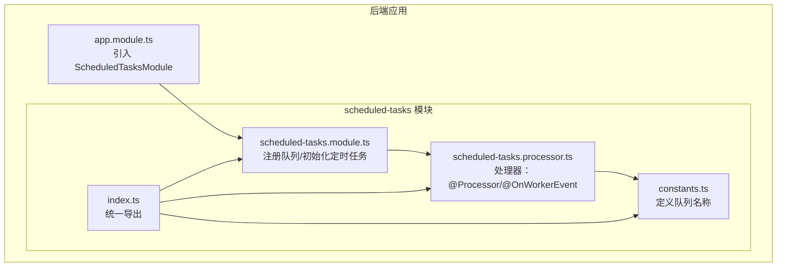
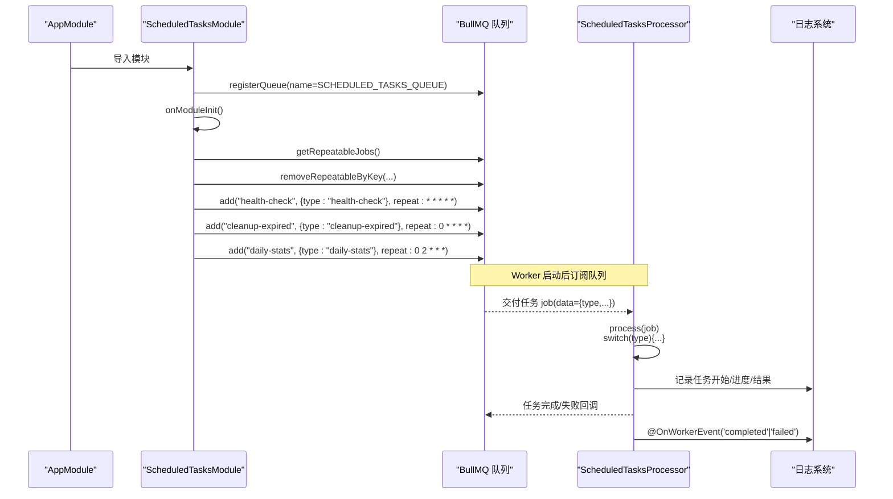
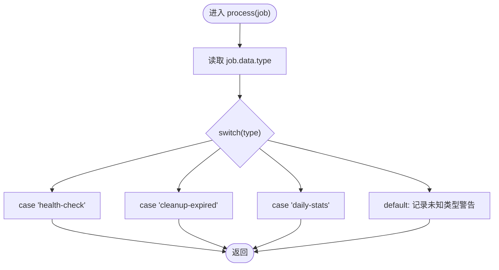
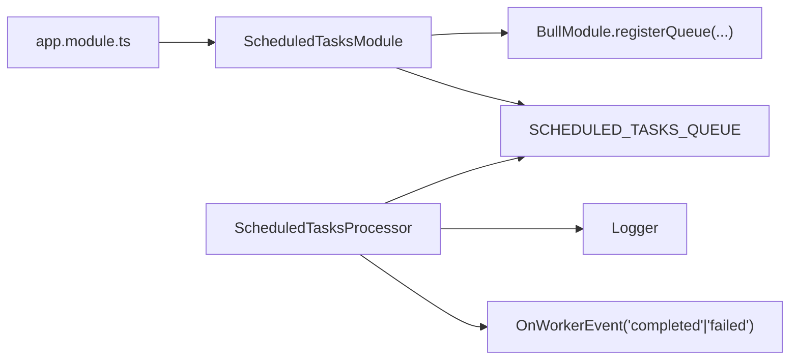

# 任务处理逻辑

<cite>
**本文引用的文件**
- [scheduled-tasks.processor.ts](file://apps/backend/src/scheduled-tasks/scheduled-tasks.processor.ts)
- [constants.ts](file://apps/backend/src/scheduled-tasks/constants.ts)
- [scheduled-tasks.module.ts](file://apps/backend/src/scheduled-tasks/scheduled-tasks.module.ts)
- [index.ts](file://apps/backend/src/scheduled-tasks/index.ts)
- [app.module.ts](file://apps/backend/src/app.module.ts)
</cite>

## 目录
1. [简介](#简介)
2. [项目结构](#项目结构)
3. [核心组件](#核心组件)
4. [架构总览](#架构总览)
5. [详细组件分析](#详细组件分析)
6. [依赖关系分析](#依赖关系分析)
7. [性能考量](#性能考量)
8. [故障排查指南](#故障排查指南)
9. [结论](#结论)
10. [附录：扩展新任务类型模板](#附录扩展新任务类型模板)

## 简介
本文件围绕 ScheduledTasksProcessor 的任务处理机制展开，重点解释：
- @Processor 装饰器如何将处理器绑定到 SCHEDULED_TASKS_QUEUE 队列；
- process 方法如何基于 job.data.type 实现任务分发；
- switch-case 对三类任务（health-check、cleanup-expired、daily-stats）的路由逻辑；
- handleHealthCheck、handleCleanupExpired、handleDailyStats 三个私有方法的业务实现要点（日志级别、异步执行、错误边界）；
- @OnWorkerEvent 事件监听器在任务完成/失败时的日志追踪；
- 如何结合外部监控系统进行告警；
- 扩展新任务类型的类型安全模板。

## 项目结构
定时任务相关代码集中在 backend 应用的 scheduled-tasks 子模块中，主要文件如下：
- constants.ts：定义队列名称常量；
- scheduled-tasks.module.ts：注册队列并初始化定时任务；
- scheduled-tasks.processor.ts：处理器实现，负责任务分发与事件监听；
- index.ts：统一导出，便于模块间引用。

图表来源
- [scheduled-tasks.module.ts](file://apps/backend/src/scheduled-tasks/scheduled-tasks.module.ts#L1-L78)
- [scheduled-tasks.processor.ts](file://apps/backend/src/scheduled-tasks/scheduled-tasks.processor.ts#L1-L74)
- [constants.ts](file://apps/backend/src/scheduled-tasks/constants.ts#L1-L5)
- [index.ts](file://apps/backend/src/scheduled-tasks/index.ts#L1-L4)
- [app.module.ts](file://apps/backend/src/app.module.ts#L1-L159)

章节来源
- [scheduled-tasks.module.ts](file://apps/backend/src/scheduled-tasks/scheduled-tasks.module.ts#L1-L78)
- [scheduled-tasks.processor.ts](file://apps/backend/src/scheduled-tasks/scheduled-tasks.processor.ts#L1-L74)
- [constants.ts](file://apps/backend/src/scheduled-tasks/constants.ts#L1-L5)
- [index.ts](file://apps/backend/src/scheduled-tasks/index.ts#L1-L4)
- [app.module.ts](file://apps/backend/src/app.module.ts#L1-L159)

## 核心组件
- 队列名称常量：SCHEDULED_TASKS_QUEUE，用于标识定时任务队列；
- 定时任务模块：通过 BullModule.registerQueue 注册队列，并在 onModuleInit 中清理旧的重复任务，再按 cron 规则注册三类定时任务；
- 处理器：@Processor(SCHEDULED_TASKS_QUEUE) 将处理器绑定到指定队列；process(job) 根据 job.data.type 分发到对应处理函数；@OnWorkerEvent('completed'|'failed') 记录完成/失败日志。

章节来源
- [constants.ts](file://apps/backend/src/scheduled-tasks/constants.ts#L1-L5)
- [scheduled-tasks.module.ts](file://apps/backend/src/scheduled-tasks/scheduled-tasks.module.ts#L1-L78)
- [scheduled-tasks.processor.ts](file://apps/backend/src/scheduled-tasks/scheduled-tasks.processor.ts#L1-L74)

## 架构总览
下面的序列图展示了从模块初始化到任务执行与事件监听的关键流程。

图表来源
- [scheduled-tasks.module.ts](file://apps/backend/src/scheduled-tasks/scheduled-tasks.module.ts#L23-L78)
- [scheduled-tasks.processor.ts](file://apps/backend/src/scheduled-tasks/scheduled-tasks.processor.ts#L19-L73)
- [app.module.ts](file://apps/backend/src/app.module.ts#L92-L111)

## 详细组件分析

### 处理器：@Processor 绑定与任务分发
- @Processor(SCHEDULED_TASKS_QUEUE) 将处理器与队列名称绑定，使 WorkerHost 能够接收该队列的任务；
- process(job) 读取 job.data.type 并通过 switch-case 路由到具体处理函数；
- 默认分支记录未知类型警告，避免静默失败；
- 三个处理函数均为异步实现，便于执行 I/O 或外部调用；
- 错误边界：未在处理器内部显式 try/catch，但默认作业配置启用失败重试与保留失败作业，有助于后续排查。

图表来源
- [scheduled-tasks.processor.ts](file://apps/backend/src/scheduled-tasks/scheduled-tasks.processor.ts#L19-L35)

章节来源
- [scheduled-tasks.processor.ts](file://apps/backend/src/scheduled-tasks/scheduled-tasks.processor.ts#L1-L74)

### 任务类型与路由逻辑
- health-check：每分钟执行一次；
- cleanup-expired：每小时整点执行一次；
- daily-stats：每天凌晨两点执行一次；
- 以上均通过 repeat.pattern 设置 cron 表达式，并在注册时配置 removeOnComplete/removeOnFail。

章节来源
- [scheduled-tasks.module.ts](file://apps/backend/src/scheduled-tasks/scheduled-tasks.module.ts#L37-L76)

### 业务处理函数详解
以下为三个私有处理函数的职责与实现要点（不展示具体代码内容）：
- handleHealthCheck(job)
  - 日志级别：调试级别，便于高频任务的可观测性；
  - 异步执行：支持数据库、缓存、外部服务等健康探测；
  - 错误边界：建议在函数内部捕获异常并记录错误，避免影响队列整体稳定性。
- handleCleanupExpired(job)
  - 日志级别：信息级别，记录清理范围与结果；
  - 异步执行：删除过期会话、清理临时文件等；
  - 错误边界：建议幂等设计，失败重试与去重，必要时回滚或补偿。
- handleDailyStats(job)
  - 日志级别：信息级别，记录统计维度与产出；
  - 异步执行：生成报表、发送邮件、写入统计表等；
  - 错误边界：建议拆分为子步骤，失败时记录失败项以便重放。

章节来源
- [scheduled-tasks.processor.ts](file://apps/backend/src/scheduled-tasks/scheduled-tasks.processor.ts#L40-L62)

### 事件监听与日志追踪
- @OnWorkerEvent('completed')(job)：记录任务完成信息，包含任务名与 ID；
- @OnWorkerEvent('failed')(job, error)：记录失败信息，包含任务名、ID 与错误消息；
- 结合全局日志配置（Pino），可输出结构化日志，便于接入外部监控系统（如 ELK、Prometheus/Grafana）。

章节来源
- [scheduled-tasks.processor.ts](file://apps/backend/src/scheduled-tasks/scheduled-tasks.processor.ts#L64-L73)
- [app.module.ts](file://apps/backend/src/app.module.ts#L29-L84)

## 依赖关系分析
- ScheduledTasksModule 依赖 BullModule 注册队列，并在模块初始化阶段注册定时任务；
- ScheduledTasksProcessor 依赖 Logger 与 @Processor/@OnWorkerEvent；
- app.module.ts 引入 ScheduledTasksModule，确保模块被正确加载；
- index.ts 提供统一导出，便于上层模块按需引用。

图表来源
- [app.module.ts](file://apps/backend/src/app.module.ts#L135-L143)
- [scheduled-tasks.module.ts](file://apps/backend/src/scheduled-tasks/scheduled-tasks.module.ts#L14-L23)
- [scheduled-tasks.processor.ts](file://apps/backend/src/scheduled-tasks/scheduled-tasks.processor.ts#L1-L18)

章节来源
- [app.module.ts](file://apps/backend/src/app.module.ts#L135-L143)
- [scheduled-tasks.module.ts](file://apps/backend/src/scheduled-tasks/scheduled-tasks.module.ts#L14-L23)
- [scheduled-tasks.processor.ts](file://apps/backend/src/scheduled-tasks/scheduled-tasks.processor.ts#L1-L18)

## 性能考量
- 高频任务（health-check）建议：
  - 控制单次执行耗时，避免阻塞队列；
  - 使用轻量探测，必要时并发化多个子探测；
  - 结合指数退避策略与失败重试，降低瞬时峰值。
- 低频任务（daily-stats）建议：
  - 预分配资源，避免在高峰期执行；
  - 分批处理大数据集，减少一次性内存占用；
  - 记录执行耗时与数据量，形成性能基线。
- 通用建议：
  - 合理设置 removeOnComplete/removeOnFail，平衡可观测性与存储成本；
  - 使用结构化日志，便于聚合与查询。

## 故障排查指南
- 任务未触发
  - 检查 ScheduledTasksModule 是否在 onModuleInit 中成功注册 repeatable 任务；
  - 确认 cron 表达式是否符合预期；
  - 核对 Redis 连接配置与队列状态。
- 任务执行失败
  - 查看 @OnWorkerEvent('failed') 输出的错误消息；
  - 检查默认作业配置（attempts/backoff）是否满足重试需求；
  - 在处理函数内部补充 try/catch 与更详细的上下文日志。
- 日志与告警
  - 结合全局日志配置输出结构化日志；
  - 将日志接入外部监控系统，针对 failed 事件设置告警规则；
  - 对高频任务设置延迟与成功率阈值告警。

章节来源
- [scheduled-tasks.module.ts](file://apps/backend/src/scheduled-tasks/scheduled-tasks.module.ts#L23-L78)
- [scheduled-tasks.processor.ts](file://apps/backend/src/scheduled-tasks/scheduled-tasks.processor.ts#L64-L73)
- [app.module.ts](file://apps/backend/src/app.module.ts#L92-L111)

## 结论
本机制通过 BullMQ 的队列与 WorkerHost，实现了稳定、可扩展的定时任务处理框架。@Processor 将处理器与队列绑定，process 方法以类型路由为核心，配合 @OnWorkerEvent 提供了清晰的生命周期日志。默认的失败重试与保留策略为问题排查提供了保障。通过合理的日志与监控集成，可进一步提升系统的可观测性与可靠性。

## 附录：扩展新任务类型模板
为新增任务类型提供类型安全与可维护性的模板步骤：
1. 在 constants.ts 中声明新任务类型字符串常量；
2. 在 scheduled-tasks.module.ts 的 registerScheduledJobs 中添加 add 调用，设置 name、data.type 与 repeat.pattern；
3. 在 scheduled-tasks.processor.ts 的 process 中增加对应的 switch-case 分支；
4. 新增对应的 handleXxx(job) 私有方法，选择合适的日志级别，实现异步处理与错误边界；
5. 在 @OnWorkerEvent('completed'|'failed') 中补充必要的日志或上报逻辑；
6. 如需对外部系统告警，可在处理函数中集成告警通道（例如发送通知、写入指标）。

章节来源
- [constants.ts](file://apps/backend/src/scheduled-tasks/constants.ts#L1-L5)
- [scheduled-tasks.module.ts](file://apps/backend/src/scheduled-tasks/scheduled-tasks.module.ts#L37-L76)
- [scheduled-tasks.processor.ts](file://apps/backend/src/scheduled-tasks/scheduled-tasks.processor.ts#L19-L73)