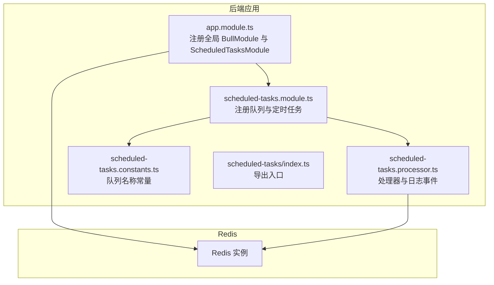
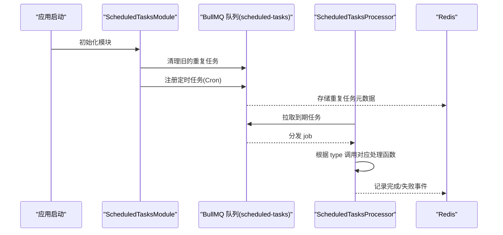
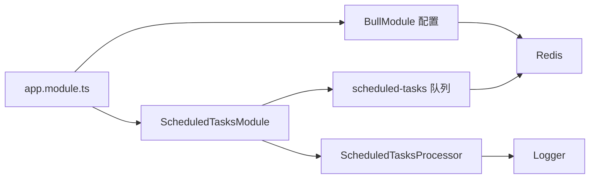

# 定时任务处理

<cite>
**本文引用的文件**
- [apps/backend/src/scheduled-tasks/scheduled-tasks.module.ts](file://apps/backend/src/scheduled-tasks/scheduled-tasks.module.ts)
- [apps/backend/src/scheduled-tasks/scheduled-tasks.processor.ts](file://apps/backend/src/scheduled-tasks/scheduled-tasks.processor.ts)
- [apps/backend/src/scheduled-tasks/constants.ts](file://apps/backend/src/scheduled-tasks/constants.ts)
- [apps/backend/src/scheduled-tasks/index.ts](file://apps/backend/src/scheduled-tasks/index.ts)
- [apps/backend/src/app.module.ts](file://apps/backend/src/app.module.ts)
- [apps/backend/src/redis/redis.module.ts](file://apps/backend/src/redis/redis.module.ts)
- [apps/backend/src/redis/redis.service.ts](file://apps/backend/src/redis/redis.service.ts)
- [docker-compose.yml](file://docker-compose.yml)
- [README.md](file://README.md)
</cite>

## 目录
1. [简介](#简介)
2. [项目结构](#项目结构)
3. [核心组件](#核心组件)
4. [架构总览](#架构总览)
5. [详细组件分析](#详细组件分析)
6. [依赖关系分析](#依赖关系分析)
7. [性能考量](#性能考量)
8. [故障排查指南](#故障排查指南)
9. [结论](#结论)
10. [附录](#附录)

## 简介
本文件面向开发与运维人员，系统性说明基于 BullMQ 的定时任务系统设计与实现，重点覆盖：
- ScheduledTasksModule 如何注册队列与定时任务，以及与 Redis 的连接方式
- ScheduledTasksProcessor 中的定时作业定义、Cron 表达式、执行逻辑与日志策略
- 任务状态监控、失败重试与日志记录策略
- 如何创建自定义定时任务（定义处理器与注册到模块）
- 性能与可靠性考量（并发控制、资源隔离、执行时间监控）
- 常见问题与高可用部署建议（任务堆积、时区配置、单点故障）

## 项目结构
定时任务相关代码集中在后端应用的 scheduled-tasks 目录，并由根模块统一装配。Redis 作为 BullMQ 的持久化与集群协调介质，在根模块中集中配置。

图表来源
- [apps/backend/src/app.module.ts](file://apps/backend/src/app.module.ts#L92-L111)
- [apps/backend/src/scheduled-tasks/scheduled-tasks.module.ts](file://apps/backend/src/scheduled-tasks/scheduled-tasks.module.ts#L14-L22)
- [apps/backend/src/scheduled-tasks/scheduled-tasks.processor.ts](file://apps/backend/src/scheduled-tasks/scheduled-tasks.processor.ts#L15-L18)
- [apps/backend/src/scheduled-tasks/constants.ts](file://apps/backend/src/scheduled-tasks/constants.ts#L1-L5)

章节来源
- [apps/backend/src/scheduled-tasks/scheduled-tasks.module.ts](file://apps/backend/src/scheduled-tasks/scheduled-tasks.module.ts#L1-L78)
- [apps/backend/src/scheduled-tasks/scheduled-tasks.processor.ts](file://apps/backend/src/scheduled-tasks/scheduled-tasks.processor.ts#L1-L74)
- [apps/backend/src/scheduled-tasks/constants.ts](file://apps/backend/src/scheduled-tasks/constants.ts#L1-L5)
- [apps/backend/src/scheduled-tasks/index.ts](file://apps/backend/src/scheduled-tasks/index.ts#L1-L4)
- [apps/backend/src/app.module.ts](file://apps/backend/src/app.module.ts#L92-L111)

## 核心组件
- 队列与模块
  - 队列名称：scheduled-tasks
  - 模块职责：注册队列、清理旧重复任务、按 Cron 规则注册定时任务
- 处理器
  - 通过队列名称注册处理器
  - 根据 job.data.type 分发到不同处理函数
  - 提供任务完成/失败事件日志
- Redis 连接
  - 根模块集中配置连接参数（主机、端口、密码）
  - 默认作业选项：完成自动清理、失败保留、指数退避重试

章节来源
- [apps/backend/src/scheduled-tasks/constants.ts](file://apps/backend/src/scheduled-tasks/constants.ts#L1-L5)
- [apps/backend/src/scheduled-tasks/scheduled-tasks.module.ts](file://apps/backend/src/scheduled-tasks/scheduled-tasks.module.ts#L14-L78)
- [apps/backend/src/scheduled-tasks/scheduled-tasks.processor.ts](file://apps/backend/src/scheduled-tasks/scheduled-tasks.processor.ts#L15-L74)
- [apps/backend/src/app.module.ts](file://apps/backend/src/app.module.ts#L92-L111)

## 架构总览
定时任务系统采用“队列 + 工作进程”的模式，BullMQ 将 Cron 任务持久化到 Redis，工作进程从队列拉取并执行。模块初始化阶段会清理旧的重复任务，确保配置变更生效。

图表来源
- [apps/backend/src/scheduled-tasks/scheduled-tasks.module.ts](file://apps/backend/src/scheduled-tasks/scheduled-tasks.module.ts#L24-L78)
- [apps/backend/src/scheduled-tasks/scheduled-tasks.processor.ts](file://apps/backend/src/scheduled-tasks/scheduled-tasks.processor.ts#L19-L35)
- [apps/backend/src/app.module.ts](file://apps/backend/src/app.module.ts#L92-L111)

## 详细组件分析

### ScheduledTasksModule：队列与定时任务注册
- 队列注册
  - 使用 BullModule.registerQueue 按名称注册队列
- 模块生命周期
  - onModuleInit 中先清理旧的重复任务，再重新注册
- 定时任务注册
  - 使用 queue.add 添加重复任务，repeat.pattern 为 Cron 表达式
  - 示例任务：
    - 每分钟健康检查
    - 每小时清理过期数据
    - 每天凌晨两点统计
  - 作业选项：
    - removeOnComplete：完成后自动清理
    - removeOnFail：失败后保留便于排查
    - 通过模块默认选项配置了重试与退避策略

章节来源
- [apps/backend/src/scheduled-tasks/scheduled-tasks.module.ts](file://apps/backend/src/scheduled-tasks/scheduled-tasks.module.ts#L14-L78)

### ScheduledTasksProcessor：处理器与日志事件
- 处理流程
  - 读取 job.data.type，分发到 handleHealthCheck、handleCleanupExpired、handleDailyStats
  - 未知类型记录告警日志
- 日志事件
  - completed：记录任务完成
  - failed：记录任务失败及错误信息
- 依赖注入
  - 通过 @Processor(SCHEDULED_TASKS_QUEUE) 与队列绑定
  - 使用 Logger 输出调试/信息/错误日志

章节来源
- [apps/backend/src/scheduled-tasks/scheduled-tasks.processor.ts](file://apps/backend/src/scheduled-tasks/scheduled-tasks.processor.ts#L15-L74)
- [apps/backend/src/scheduled-tasks/constants.ts](file://apps/backend/src/scheduled-tasks/constants.ts#L1-L5)

### Redis 连接与默认作业配置
- 连接配置
  - 通过 ConfigService 读取 REDIS_HOST、REDIS_PORT、REDIS_PASSWORD
  - 默认连接参数：host、port、password
- 默认作业选项
  - removeOnComplete：true
  - removeOnFail：false
  - attempts：3
  - backoff：指数退避，初始延迟 1 秒

章节来源
- [apps/backend/src/app.module.ts](file://apps/backend/src/app.module.ts#L92-L111)

### Cron 表达式与执行逻辑
- Cron 表达式
  - 每分钟：* * * * *
  - 每小时：0 * * * *
  - 每天 02:00：0 2 * * *
- 执行逻辑
  - 处理器中预留了各任务的处理函数位置，可在其中编写具体业务逻辑（如健康检查、清理过期数据、每日统计）
  - 任务执行期间可通过日志观察进度与异常

章节来源
- [apps/backend/src/scheduled-tasks/scheduled-tasks.module.ts](file://apps/backend/src/scheduled-tasks/scheduled-tasks.module.ts#L37-L76)
- [apps/backend/src/scheduled-tasks/scheduled-tasks.processor.ts](file://apps/backend/src/scheduled-tasks/scheduled-tasks.processor.ts#L37-L62)

### 任务状态监控、失败重试与日志记录
- 状态监控
  - completed/failure 事件日志：便于追踪任务生命周期
- 失败重试
  - 默认 attempts=3，backoff=指数退避
  - 失败后保留任务，便于人工排查
- 日志记录
  - 使用 @nestjs/common 的 Logger，输出调试、信息、错误级别日志

章节来源
- [apps/backend/src/scheduled-tasks/scheduled-tasks.processor.ts](file://apps/backend/src/scheduled-tasks/scheduled-tasks.processor.ts#L64-L73)
- [apps/backend/src/app.module.ts](file://apps/backend/src/app.module.ts#L92-L111)

### 创建自定义定时任务的步骤
- 步骤一：在处理器中新增处理函数
  - 在 ScheduledTasksProcessor 中添加新的私有处理函数，并在 process 中增加对应的 type 分支
- 步骤二：在模块中注册定时任务
  - 在 ScheduledTasksModule.registerScheduledJobs 中调用 queue.add，设置 repeat.pattern 与作业选项
- 步骤三：导出与引入
  - 若新增文件，确保通过 index.ts 导出并在根模块中引入

章节来源
- [apps/backend/src/scheduled-tasks/scheduled-tasks.processor.ts](file://apps/backend/src/scheduled-tasks/scheduled-tasks.processor.ts#L19-L35)
- [apps/backend/src/scheduled-tasks/scheduled-tasks.module.ts](file://apps/backend/src/scheduled-tasks/scheduled-tasks.module.ts#L37-L76)
- [apps/backend/src/scheduled-tasks/index.ts](file://apps/backend/src/scheduled-tasks/index.ts#L1-L4)

### 依赖注入与服务使用
- 当前处理器未直接注入其他服务，但可按需注入服务（如数据库、邮件、缓存等），以实现业务逻辑
- Redis 服务（RedisService）位于独立模块中，可用于缓存或命名空间操作，便于与定时任务配合

章节来源
- [apps/backend/src/redis/redis.service.ts](file://apps/backend/src/redis/redis.service.ts#L1-L231)
- [apps/backend/src/redis/redis.module.ts](file://apps/backend/src/redis/redis.module.ts#L1-L83)

## 依赖关系分析
- 模块耦合
  - ScheduledTasksModule 依赖 BullModule 与队列名称常量
  - ScheduledTasksProcessor 依赖队列名称常量与 Logger
  - 根模块负责全局 Redis 连接与默认作业配置
- 外部依赖
  - BullMQ 与 Redis：任务持久化与分布式协调
  - cache-manager 与 ioredis：Redis 缓存与连接池能力（与定时任务解耦）

图表来源
- [apps/backend/src/app.module.ts](file://apps/backend/src/app.module.ts#L92-L111)
- [apps/backend/src/scheduled-tasks/scheduled-tasks.module.ts](file://apps/backend/src/scheduled-tasks/scheduled-tasks.module.ts#L14-L22)
- [apps/backend/src/scheduled-tasks/scheduled-tasks.processor.ts](file://apps/backend/src/scheduled-tasks/scheduled-tasks.processor.ts#L15-L18)

章节来源
- [apps/backend/src/app.module.ts](file://apps/backend/src/app.module.ts#L92-L111)
- [apps/backend/src/scheduled-tasks/scheduled-tasks.module.ts](file://apps/backend/src/scheduled-tasks/scheduled-tasks.module.ts#L14-L22)
- [apps/backend/src/scheduled-tasks/scheduled-tasks.processor.ts](file://apps/backend/src/scheduled-tasks/scheduled-tasks.processor.ts#L15-L18)

## 性能考量
- 并发控制
  - BullMQ 工作进程数量与队列并发度相关；可通过部署多个实例实现水平扩展
- 资源隔离
  - 将耗时任务拆分为独立队列或模块，避免阻塞关键路径
- 执行时间监控
  - 建议在处理函数中埋点，记录开始/结束时间与耗时，结合日志进行分析
- 重试与退避
  - 默认指数退避可缓解瞬时故障；若任务对一致性要求高，可考虑幂等设计与去重键

[本节为通用指导，不直接分析具体文件]

## 故障排查指南
- 任务堆积
  - 现象：任务积压、执行延迟
  - 排查：检查处理器是否阻塞、Redis 是否可用、工作进程数量是否足够
- 时区配置错误
  - Cron 由 BullMQ 解析，注意服务器时区与期望时区一致
- 单点故障
  - 建议部署多个工作进程实例，利用 Redis 实现分布式协调
- 日志定位
  - 关注 completed/failure 事件日志，结合任务 ID 快速定位

章节来源
- [apps/backend/src/scheduled-tasks/scheduled-tasks.processor.ts](file://apps/backend/src/scheduled-tasks/scheduled-tasks.processor.ts#L64-L73)
- [apps/backend/src/app.module.ts](file://apps/backend/src/app.module.ts#L92-L111)

## 结论
该定时任务系统以 BullMQ 为核心，借助 Redis 实现分布式、可靠的重复任务调度。模块化设计使队列与处理器职责清晰，日志与重试策略完善，适合在生产环境中稳定运行。通过合理的并发与资源隔离策略，可进一步提升吞吐与稳定性。

[本节为总结性内容，不直接分析具体文件]

## 附录

### 高可用部署建议
- 多实例部署
  - 启动多个后端容器实例，共享同一 Redis，BullMQ 保证任务只执行一次
- Docker Compose
  - 项目已提供 Redis 与后端服务编排，后端通过环境变量指向 Redis
- 环境变量
  - 生产环境需配置数据库、Redis、JWT 等关键变量

章节来源
- [docker-compose.yml](file://docker-compose.yml#L48-L75)
- [README.md](file://README.md#L381-L404)

### Cron 表达式参考
- 每分钟：* * * * *
- 每小时：0 * * * *
- 每天 02:00：0 2 * * *

章节来源
- [apps/backend/src/scheduled-tasks/scheduled-tasks.module.ts](file://apps/backend/src/scheduled-tasks/scheduled-tasks.module.ts#L37-L76)