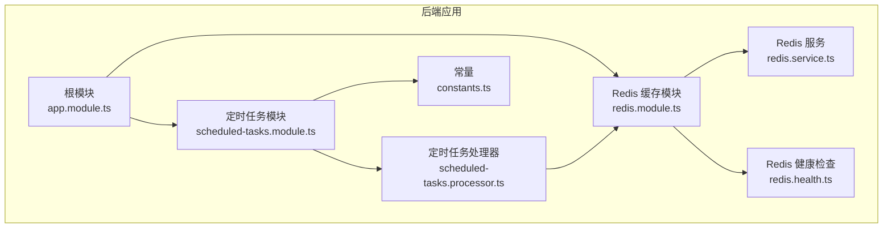
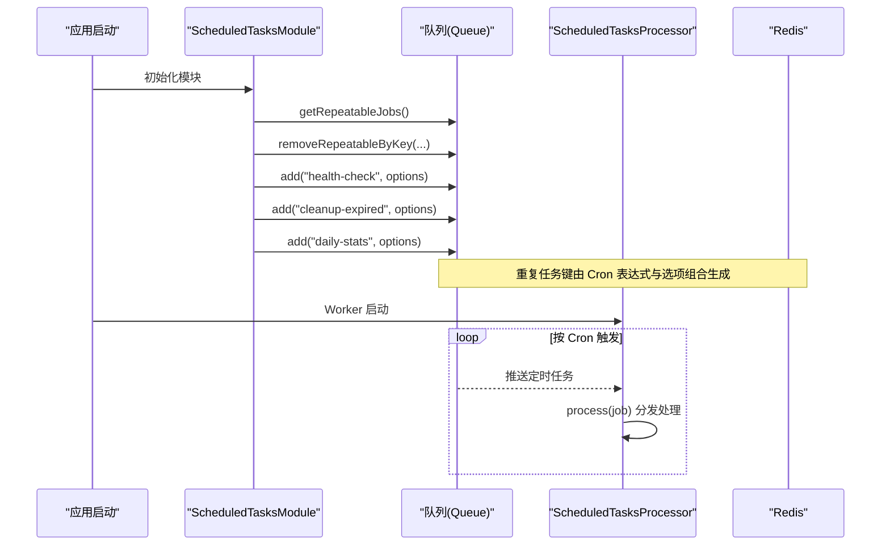
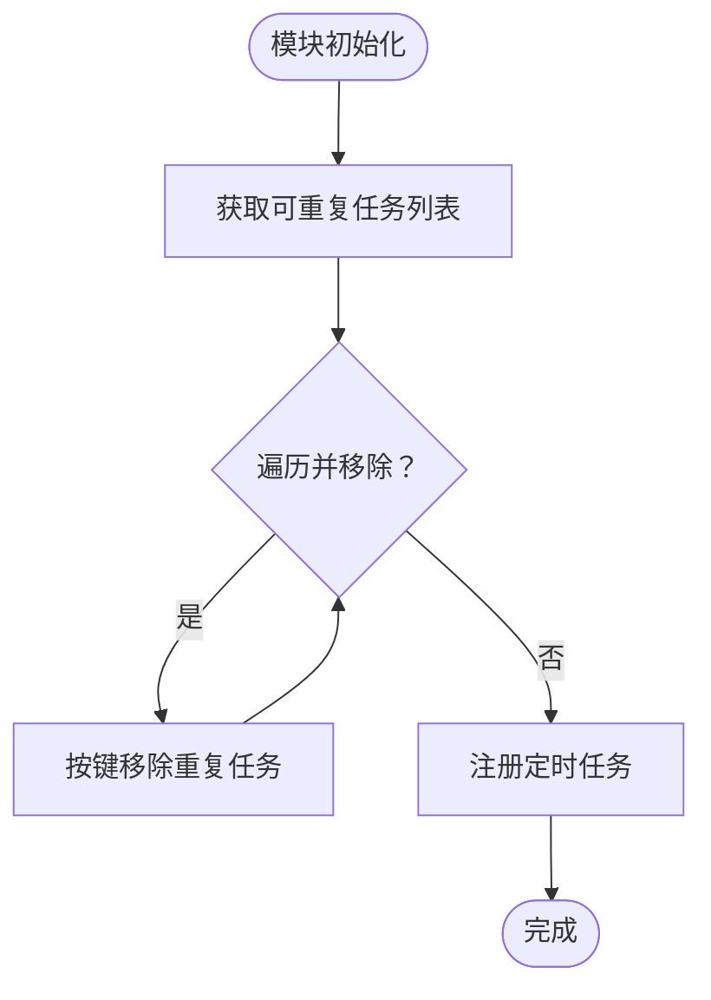
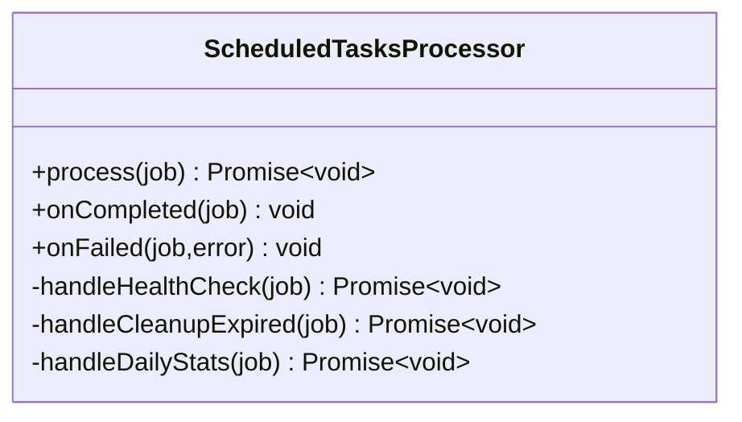
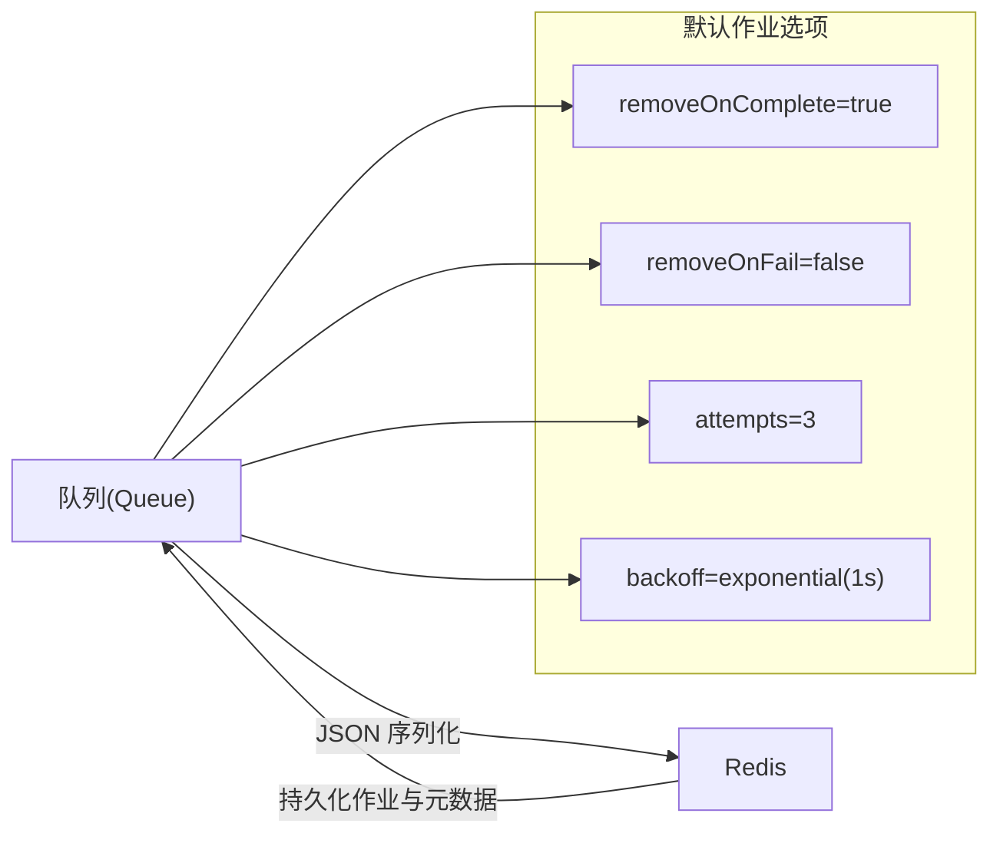
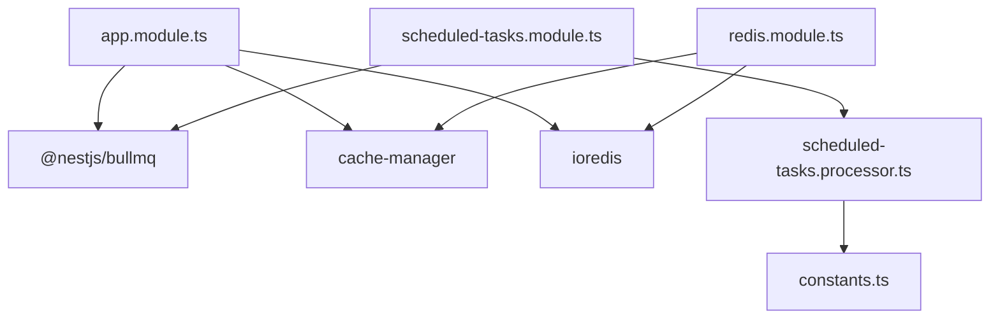

# 定时任务配置

<cite>
**本文引用的文件**
- [apps/backend/src/scheduled-tasks/scheduled-tasks.module.ts](file://apps/backend/src/scheduled-tasks/scheduled-tasks.module.ts)
- [apps/backend/src/scheduled-tasks/scheduled-tasks.processor.ts](file://apps/backend/src/scheduled-tasks/scheduled-tasks.processor.ts)
- [apps/backend/src/scheduled-tasks/constants.ts](file://apps/backend/src/scheduled-tasks/constants.ts)
- [apps/backend/src/app.module.ts](file://apps/backend/src/app.module.ts)
- [apps/backend/src/redis/redis.module.ts](file://apps/backend/src/redis/redis.module.ts)
- [apps/backend/src/redis/redis.service.ts](file://apps/backend/src/redis/redis.service.ts)
- [apps/backend/src/redis/redis.health.ts](file://apps/backend/src/redis/redis.health.ts)
- [.env.example](file://.env.example)
</cite>

## 目录
1. [简介](#简介)
2. [项目结构](#项目结构)
3. [核心组件](#核心组件)
4. [架构总览](#架构总览)
5. [详细组件分析](#详细组件分析)
6. [依赖关系分析](#依赖关系分析)
7. [性能与稳定性考量](#性能与稳定性考量)
8. [故障排查指南](#故障排查指南)
9. [结论](#结论)
10. [附录](#附录)

## 简介
本文件围绕定时任务模块的配置进行深入说明，重点涵盖以下内容：
- ScheduledTasksModule 如何通过 BullModule.registerQueue 注册名为 SCHEDULED_TASKS_QUEUE 的任务队列；
- 模块初始化时 onModuleInit 生命周期钩子中清理旧重复任务的逻辑，确保配置更新生效；
- registerScheduledJobs 方法中定义的三个核心定时任务（健康检查、过期数据清理、每日统计）的 Cron 表达式、执行频率与任务选项（removeOnComplete、removeOnFail）；
- 队列与 Redis 的集成方式，包括连接管理、序列化机制与消息持久化策略；
- 自定义队列选项的配置示例（重试策略、并发控制、优先级设置），并说明其对系统稳定性的影响。

## 项目结构
定时任务相关的核心文件位于 backend 应用的 scheduled-tasks 目录，同时在根模块中通过 BullModule.forRootAsync 配置了全局 Redis 连接与默认作业选项；Redis 缓存模块位于 redis 目录，提供独立的 Redis 连接与缓存能力。

图表来源
- [apps/backend/src/app.module.ts](file://apps/backend/src/app.module.ts#L92-L111)
- [apps/backend/src/scheduled-tasks/scheduled-tasks.module.ts](file://apps/backend/src/scheduled-tasks/scheduled-tasks.module.ts#L14-L22)
- [apps/backend/src/scheduled-tasks/scheduled-tasks.processor.ts](file://apps/backend/src/scheduled-tasks/scheduled-tasks.processor.ts#L15-L16)
- [apps/backend/src/scheduled-tasks/constants.ts](file://apps/backend/src/scheduled-tasks/constants.ts#L4-L4)
- [apps/backend/src/redis/redis.module.ts](file://apps/backend/src/redis/redis.module.ts#L26-L83)
- [apps/backend/src/redis/redis.service.ts](file://apps/backend/src/redis/redis.service.ts#L51-L73)
- [apps/backend/src/redis/redis.health.ts](file://apps/backend/src/redis/redis.health.ts#L10-L43)

章节来源
- [apps/backend/src/scheduled-tasks/scheduled-tasks.module.ts](file://apps/backend/src/scheduled-tasks/scheduled-tasks.module.ts#L14-L22)
- [apps/backend/src/app.module.ts](file://apps/backend/src/app.module.ts#L92-L111)

## 核心组件
- 定时任务模块（ScheduledTasksModule）
  - 通过 BullModule.registerQueue 注册名为 SCHEDULED_TASKS_QUEUE 的队列；
  - 在 onModuleInit 中清理旧的重复任务，再注册新的定时任务，保证配置更新生效；
  - 定义三个定时任务：健康检查、过期数据清理、每日统计，均使用 repeat.pattern 指定 Cron 表达式。
- 定时任务处理器（ScheduledTasksProcessor）
  - 作为 WorkerHost 处理队列中的定时任务，按 job.data.type 分发到对应处理函数；
  - 记录完成与失败事件日志，便于监控与排障。
- 常量（constants.ts）
  - 统一导出队列名称 SCHEDULED_TASKS_QUEUE，避免硬编码。
- 根模块（app.module.ts）
  - 通过 BullModule.forRootAsync 配置 Redis 连接与默认作业选项（removeOnComplete、removeOnFail、attempts、backoff）；
  - 该默认配置对所有队列生效，包括 SCHEDULED_TASKS_QUEUE。
- Redis 缓存模块（redis.module.ts、redis.service.ts、redis.health.ts）
  - 提供独立的 Redis 连接与缓存能力，包含连接重试策略、键前缀与 TTL 管理；
  - 提供健康检查指示器，验证 Redis 连接与读写能力。

章节来源
- [apps/backend/src/scheduled-tasks/scheduled-tasks.module.ts](file://apps/backend/src/scheduled-tasks/scheduled-tasks.module.ts#L14-L22)
- [apps/backend/src/scheduled-tasks/scheduled-tasks.processor.ts](file://apps/backend/src/scheduled-tasks/scheduled-tasks.processor.ts#L15-L35)
- [apps/backend/src/scheduled-tasks/constants.ts](file://apps/backend/src/scheduled-tasks/constants.ts#L4-L4)
- [apps/backend/src/app.module.ts](file://apps/backend/src/app.module.ts#L92-L111)
- [apps/backend/src/redis/redis.module.ts](file://apps/backend/src/redis/redis.module.ts#L26-L83)
- [apps/backend/src/redis/redis.service.ts](file://apps/backend/src/redis/redis.service.ts#L51-L73)
- [apps/backend/src/redis/redis.health.ts](file://apps/backend/src/redis/redis.health.ts#L10-L43)

## 架构总览
定时任务模块基于 BullMQ 的 repeat 功能实现分布式定时任务，结合 Redis 实现任务持久化与去重。根模块集中配置 Redis 连接与默认作业选项，定时任务模块在启动时清理旧重复任务并注册新任务。

图表来源
- [apps/backend/src/scheduled-tasks/scheduled-tasks.module.ts](file://apps/backend/src/scheduled-tasks/scheduled-tasks.module.ts#L26-L77)
- [apps/backend/src/scheduled-tasks/scheduled-tasks.processor.ts](file://apps/backend/src/scheduled-tasks/scheduled-tasks.processor.ts#L19-L35)
- [apps/backend/src/app.module.ts](file://apps/backend/src/app.module.ts#L92-L111)

## 详细组件分析

### ScheduledTasksModule：队列注册与初始化
- 队列注册
  - 通过 BullModule.registerQueue({ name: SCHEDULED_TASKS_QUEUE }) 注册名为 scheduled-tasks 的队列。
- 初始化清理与注册
  - onModuleInit 中先获取当前所有可重复任务，逐个按键移除，确保旧配置被完全替换；
  - 随后调用 registerScheduledJobs 注册三个定时任务，每个任务都包含 repeat.pattern 与 removeOnComplete/removeOnFail 选项。
- 三个定时任务的 Cron 表达式与执行频率
  - 健康检查：每分钟执行（Cron: * * * * *）
  - 过期数据清理：每小时整点执行（Cron: 0 * * * *）
  - 每日统计：每天凌晨 02:00 执行（Cron: 0 2 * * *）

图表来源
- [apps/backend/src/scheduled-tasks/scheduled-tasks.module.ts](file://apps/backend/src/scheduled-tasks/scheduled-tasks.module.ts#L26-L77)

章节来源
- [apps/backend/src/scheduled-tasks/scheduled-tasks.module.ts](file://apps/backend/src/scheduled-tasks/scheduled-tasks.module.ts#L14-L22)
- [apps/backend/src/scheduled-tasks/scheduled-tasks.module.ts](file://apps/backend/src/scheduled-tasks/scheduled-tasks.module.ts#L26-L77)

### ScheduledTasksProcessor：任务分发与日志
- 任务分发
  - 根据 job.data.type 将任务分发至 handleHealthCheck、handleCleanupExpired、handleDailyStats；
  - 对未知类型输出警告日志。
- 事件监听
  - completed/failed 事件记录日志，便于监控与排障。

图表来源
- [apps/backend/src/scheduled-tasks/scheduled-tasks.processor.ts](file://apps/backend/src/scheduled-tasks/scheduled-tasks.processor.ts#L15-L74)

章节来源
- [apps/backend/src/scheduled-tasks/scheduled-tasks.processor.ts](file://apps/backend/src/scheduled-tasks/scheduled-tasks.processor.ts#L15-L74)

### 队列与 Redis 集成
- Redis 连接管理
  - 根模块通过 BullModule.forRootAsync 配置 Redis 主机、端口与密码；
  - Redis 缓存模块提供独立的连接工厂，包含重试策略、键前缀与 TTL 管理。
- 序列化机制
  - BullMQ 默认使用 JSON 序列化作业数据，确保跨进程传输安全；
  - 任务数据结构为 { type: string, ... }，其中 type 用于处理器分发。
- 消息持久化策略
  - 通过 removeOnComplete/removeOnFail 控制已完成/失败作业的持久化；
  - 根模块默认 removeOnComplete=true、removeOnFail=false，减少历史堆积；
  - 任务重试采用指数退避策略，初始延迟 1 秒，最多重试 3 次。

图表来源
- [apps/backend/src/app.module.ts](file://apps/backend/src/app.module.ts#L92-L111)
- [apps/backend/src/scheduled-tasks/scheduled-tasks.module.ts](file://apps/backend/src/scheduled-tasks/scheduled-tasks.module.ts#L38-L77)

章节来源
- [apps/backend/src/app.module.ts](file://apps/backend/src/app.module.ts#L92-L111)
- [apps/backend/src/redis/redis.module.ts](file://apps/backend/src/redis/redis.module.ts#L26-L83)
- [apps/backend/src/redis/redis.service.ts](file://apps/backend/src/redis/redis.service.ts#L51-L73)

### 自定义队列选项与稳定性影响
- 重试策略
  - 通过 defaultJobOptions.attempts 与 backoff.type/delay 控制失败重试次数与退避策略；
  - 建议对关键任务适当提高 attempts 并使用指数退避，降低瞬时故障影响。
- 并发控制
  - 可通过 Worker 并发度（在处理器侧配置）控制同一队列的并发执行数量，避免资源争用；
  - 建议将高频任务（如健康检查）与低频任务（如每日统计）分离到不同队列或 Worker 组。
- 优先级设置
  - BullMQ 支持优先级队列，可在 add 时传入 priority 字段，确保高优任务优先执行；
  - 对于定时任务，建议通过队列拆分与 Worker 分组实现逻辑优先级。
- 稳定性影响
  - 合理的 removeOnComplete/removeOnFail 可减少历史作业堆积，降低内存与磁盘压力；
  - 适度的重试与退避能提升系统韧性，但需避免过度重试导致雪崩效应。

章节来源
- [apps/backend/src/app.module.ts](file://apps/backend/src/app.module.ts#L92-L111)
- [apps/backend/src/scheduled-tasks/scheduled-tasks.module.ts](file://apps/backend/src/scheduled-tasks/scheduled-tasks.module.ts#L38-L77)

## 依赖关系分析
- 模块耦合
  - ScheduledTasksModule 依赖 BullModule 与 ScheduledTasksProcessor；
  - ScheduledTasksProcessor 依赖常量 SCHEDULED_TASKS_QUEUE；
  - 根模块集中提供 Redis 连接与默认作业选项，影响所有队列。
- 外部依赖
  - BullMQ 与 ioredis 提供队列与 Redis 连接能力；
  - cache-manager 与 cache-manager-ioredis-yet 提供独立 Redis 缓存能力。

图表来源
- [apps/backend/src/app.module.ts](file://apps/backend/src/app.module.ts#L92-L111)
- [apps/backend/src/scheduled-tasks/scheduled-tasks.module.ts](file://apps/backend/src/scheduled-tasks/scheduled-tasks.module.ts#L14-L22)
- [apps/backend/src/scheduled-tasks/scheduled-tasks.processor.ts](file://apps/backend/src/scheduled-tasks/scheduled-tasks.processor.ts#L15-L16)
- [apps/backend/src/scheduled-tasks/constants.ts](file://apps/backend/src/scheduled-tasks/constants.ts#L4-L4)
- [apps/backend/src/redis/redis.module.ts](file://apps/backend/src/redis/redis.module.ts#L26-L83)

章节来源
- [apps/backend/src/app.module.ts](file://apps/backend/src/app.module.ts#L92-L111)
- [apps/backend/src/scheduled-tasks/scheduled-tasks.module.ts](file://apps/backend/src/scheduled-tasks/scheduled-tasks.module.ts#L14-L22)
- [apps/backend/src/scheduled-tasks/scheduled-tasks.processor.ts](file://apps/backend/src/scheduled-tasks/scheduled-tasks.processor.ts#L15-L16)
- [apps/backend/src/scheduled-tasks/constants.ts](file://apps/backend/src/scheduled-tasks/constants.ts#L4-L4)
- [apps/backend/src/redis/redis.module.ts](file://apps/backend/src/redis/redis.module.ts#L26-L83)

## 性能与稳定性考量
- 任务粒度与频率
  - 健康检查每分钟执行，建议保持轻量逻辑，避免对下游造成压力；
  - 过期数据清理与每日统计属于周期性维护任务，建议在业务低峰执行。
- 资源隔离
  - 将高频任务与低频任务拆分到不同队列或 Worker 组，避免相互干扰；
  - 对关键任务启用更高的重试次数与更稳健的退避策略。
- 监控与告警
  - 利用 completed/failed 事件日志构建监控指标；
  - 结合 Redis 健康检查指示器，定期验证连接与读写能力。

[本节为通用指导，不直接分析具体文件]

## 故障排查指南
- 任务未按预期执行
  - 检查 onModuleInit 是否正确清理旧重复任务并重新注册；
  - 确认 Cron 表达式与服务器时区一致。
- 任务频繁失败
  - 查看 failed 事件日志定位异常；
  - 调整 defaultJobOptions.attempts/backoff 或单个任务的重试配置。
- Redis 连接问题
  - 根模块与 Redis 缓存模块分别提供连接配置，确认 REDIS_HOST/PORT/PASSWORD；
  - 使用 Redis 健康检查指示器验证连接与读写。
- 作业堆积
  - 检查 removeOnComplete/removeOnFail 设置；
  - 评估 Worker 并发度与任务耗时，必要时拆分队列或限流。

章节来源
- [apps/backend/src/scheduled-tasks/scheduled-tasks.module.ts](file://apps/backend/src/scheduled-tasks/scheduled-tasks.module.ts#L26-L77)
- [apps/backend/src/scheduled-tasks/scheduled-tasks.processor.ts](file://apps/backend/src/scheduled-tasks/scheduled-tasks.processor.ts#L64-L74)
- [apps/backend/src/app.module.ts](file://apps/backend/src/app.module.ts#L92-L111)
- [apps/backend/src/redis/redis.health.ts](file://apps/backend/src/redis/redis.health.ts#L10-L43)

## 结论
本定时任务模块通过 BullMQ 的 repeat 功能与 Redis 持久化，实现了稳定可靠的分布式定时任务体系。模块初始化阶段的重复任务清理确保配置更新即时生效；根模块的默认作业选项提供了统一的重试与持久化策略。通过合理的 Cron 频率、并发控制与优先级设置，可在保证系统稳定性的同时满足日常运维需求。

[本节为总结性内容，不直接分析具体文件]

## 附录
- 环境变量参考
  - REDIS_HOST、REDIS_PORT、REDIS_PASSWORD、REDIS_DB、REDIS_KEY_PREFIX、REDIS_DEFAULT_TTL 等；
  - 详见示例文件路径：[apps/backend/.env.example](file://.env.example#L1-L52)

章节来源
- [.env.example](file://.env.example#L1-L52)