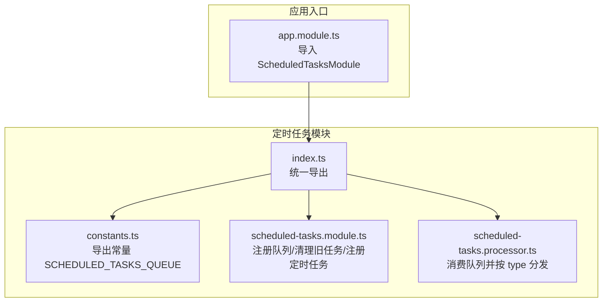
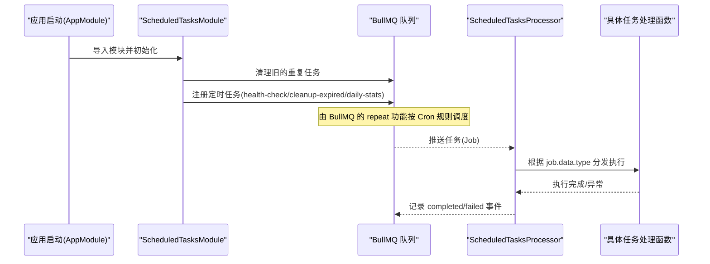
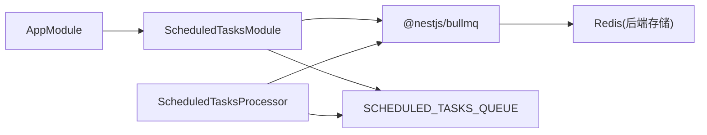

# 常量与数据结构

<cite>
**本文引用的文件**
- [apps/backend/src/scheduled-tasks/constants.ts](file://apps/backend/src/scheduled-tasks/constants.ts)
- [apps/backend/src/scheduled-tasks/scheduled-tasks.module.ts](file://apps/backend/src/scheduled-tasks/scheduled-tasks.module.ts)
- [apps/backend/src/scheduled-tasks/scheduled-tasks.processor.ts](file://apps/backend/src/scheduled-tasks/scheduled-tasks.processor.ts)
- [apps/backend/src/scheduled-tasks/index.ts](file://apps/backend/src/scheduled-tasks/index.ts)
- [apps/backend/src/app.module.ts](file://apps/backend/src/app.module.ts)
- [apps/backend/package.json](file://apps/backend/package.json)
</cite>

## 目录
1. [简介](#简介)
2. [项目结构](#项目结构)
3. [核心组件](#核心组件)
4. [架构总览](#架构总览)
5. [详细组件分析](#详细组件分析)
6. [依赖关系分析](#依赖关系分析)
7. [性能考量](#性能考量)
8. [故障排查指南](#故障排查指南)
9. [结论](#结论)
10. [附录](#附录)

## 简介
本文件聚焦于定时任务系统中的“常量与数据结构”，目标如下：
- 明确常量 SCHEDULED_TASKS_QUEUE 的命名规范与其在模块间的共享作用
- 详细描述 ScheduledJobData 接口的数据结构，包括 type 字段的枚举值及其对应的负载数据格式
- 说明任务元数据（如 job.id、job.name）的使用场景与调试价值
- 解释 Cron 表达式模式（'* * * * *', '0 * * * *', '0 2 * * *'）的时间含义与配置注意事项，特别是时区设置对定时精度的影响
- 提供类型安全的常量管理最佳实践，如使用 TypeScript 枚举或字符串字面量类型

## 项目结构
定时任务系统位于后端应用的 scheduled-tasks 子目录中，采用 BullMQ 的 repeat 功能实现定时任务。核心文件包括：
- constants.ts：导出队列名称常量
- scheduled-tasks.module.ts：注册队列、清理旧任务、注册定时任务
- scheduled-tasks.processor.ts：消费队列并按 type 分发执行
- index.ts：统一导出模块、常量与处理器，便于上层模块引入

图表来源
- [apps/backend/src/scheduled-tasks/constants.ts](file://apps/backend/src/scheduled-tasks/constants.ts#L1-L5)
- [apps/backend/src/scheduled-tasks/scheduled-tasks.module.ts](file://apps/backend/src/scheduled-tasks/scheduled-tasks.module.ts#L1-L78)
- [apps/backend/src/scheduled-tasks/scheduled-tasks.processor.ts](file://apps/backend/src/scheduled-tasks/scheduled-tasks.processor.ts#L1-L74)
- [apps/backend/src/scheduled-tasks/index.ts](file://apps/backend/src/scheduled-tasks/index.ts#L1-L3)
- [apps/backend/src/app.module.ts](file://apps/backend/src/app.module.ts#L140-L144)

章节来源
- [apps/backend/src/scheduled-tasks/constants.ts](file://apps/backend/src/scheduled-tasks/constants.ts#L1-L5)
- [apps/backend/src/scheduled-tasks/scheduled-tasks.module.ts](file://apps/backend/src/scheduled-tasks/scheduled-tasks.module.ts#L1-L78)
- [apps/backend/src/scheduled-tasks/scheduled-tasks.processor.ts](file://apps/backend/src/scheduled-tasks/scheduled-tasks.processor.ts#L1-L74)
- [apps/backend/src/scheduled-tasks/index.ts](file://apps/backend/src/scheduled-tasks/index.ts#L1-L3)
- [apps/backend/src/app.module.ts](file://apps/backend/src/app.module.ts#L140-L144)

## 核心组件
- SCHEDULED_TASKS_QUEUE：定时任务队列名称常量，用于统一标识队列，避免硬编码散落各处，提升可维护性与一致性
- ScheduledTasksModule：负责注册队列、清理历史重复任务、注册新的定时任务
- ScheduledTasksProcessor：消费队列任务，按 job.data.type 分发到不同处理函数，并记录完成/失败事件
- ScheduledJobData：任务负载接口，包含 type 字段与扩展负载

章节来源
- [apps/backend/src/scheduled-tasks/constants.ts](file://apps/backend/src/scheduled-tasks/constants.ts#L1-L5)
- [apps/backend/src/scheduled-tasks/scheduled-tasks.module.ts](file://apps/backend/src/scheduled-tasks/scheduled-tasks.module.ts#L1-L78)
- [apps/backend/src/scheduled-tasks/scheduled-tasks.processor.ts](file://apps/backend/src/scheduled-tasks/scheduled-tasks.processor.ts#L1-L74)

## 架构总览
定时任务从注册到执行的关键流程如下：

图表来源
- [apps/backend/src/app.module.ts](file://apps/backend/src/app.module.ts#L140-L144)
- [apps/backend/src/scheduled-tasks/scheduled-tasks.module.ts](file://apps/backend/src/scheduled-tasks/scheduled-tasks.module.ts#L23-L77)
- [apps/backend/src/scheduled-tasks/scheduled-tasks.processor.ts](file://apps/backend/src/scheduled-tasks/scheduled-tasks.processor.ts#L15-L73)

## 详细组件分析

### 常量：SCHEDULED_TASKS_QUEUE
- 命名规范
  - 使用全大写加下划线风格，语义明确，便于全局检索与替换
  - 作为队列唯一标识，贯穿模块导入、队列注册、任务推送与消费
- 模块间共享作用
  - 统一常量来源，避免多处硬编码导致的不一致
  - 通过 index.ts 统一导出，上层模块仅需 import { SCHEDULED_TASKS_QUEUE } 即可复用
- 建议
  - 若未来扩展多个队列，建议将常量集中在一个 constants 目录下，按业务域分文件组织

章节来源
- [apps/backend/src/scheduled-tasks/constants.ts](file://apps/backend/src/scheduled-tasks/constants.ts#L1-L5)
- [apps/backend/src/scheduled-tasks/index.ts](file://apps/backend/src/scheduled-tasks/index.ts#L1-L3)

### 数据结构：ScheduledJobData
- 结构定义
  - type: string（枚举值见下节）
  - [key: string]: unknown（允许扩展负载）
- 类型安全建议
  - 使用 TypeScript 枚举或联合类型限定 type 值，避免运行时错误
  - 为不同 type 定义专用的负载接口，提升可读性与可维护性
- 负载数据格式
  - 当前实现未对 type 对应的扩展负载做严格约束，建议后续为每种 type 定义独立的接口，例如：
    - health-check：可能包含检查项列表、超时阈值等
    - cleanup-expired：可能包含过期时间阈值、清理范围等
    - daily-stats：可能包含统计日期、报表模板等

章节来源
- [apps/backend/src/scheduled-tasks/scheduled-tasks.processor.ts](file://apps/backend/src/scheduled-tasks/scheduled-tasks.processor.ts#L6-L9)

### 任务元数据：job.id 与 job.name
- job.id
  - 任务唯一标识，可用于日志追踪、去重、幂等控制
  - 在处理器中可用于记录完成/失败事件，便于问题定位
- job.name
  - 任务名称，用于区分不同类型的定时任务
  - 在处理器中可用于日志输出，增强可观测性
- 调试价值
  - 结合日志级别与结构化日志，可快速定位某次任务的执行状态与耗时
  - 在失败事件中打印 job.name 与 job.id，有助于快速复现与回溯

章节来源
- [apps/backend/src/scheduled-tasks/scheduled-tasks.module.ts](file://apps/backend/src/scheduled-tasks/scheduled-tasks.module.ts#L39-L49)
- [apps/backend/src/scheduled-tasks/scheduled-tasks.module.ts](file://apps/backend/src/scheduled-tasks/scheduled-tasks.module.ts#L65-L75)
- [apps/backend/src/scheduled-tasks/scheduled-tasks.processor.ts](file://apps/backend/src/scheduled-tasks/scheduled-tasks.processor.ts#L40-L73)

### Cron 表达式与时间含义
- '* * * * *'
  - 每分钟触发一次
  - 适合高频监控类任务（如健康检查）
- '0 * * * *'
  - 每小时整点触发一次
  - 适合周期性清理类任务（如过期数据清理）
- '0 2 * * *'
  - 每天凌晨 2 点触发一次
  - 适合低峰时段的统计类任务（如每日统计）
- 配置注意事项
  - 时区设置：BullMQ 的 repeat 使用的是服务器本地时区；若需跨时区一致性，建议统一设置服务器时区或在代码中显式转换
  - 精度与漂移：Cron 仅保证“大致”在指定时刻执行，实际执行时间可能受系统负载影响；对于强一致需求，建议结合数据库时间戳与补偿机制
  - 任务并发：默认单实例执行，避免分布式重复执行；如需多实例并行，需评估任务幂等性与冲突处理

章节来源
- [apps/backend/src/scheduled-tasks/scheduled-tasks.module.ts](file://apps/backend/src/scheduled-tasks/scheduled-tasks.module.ts#L42-L48)
- [apps/backend/src/scheduled-tasks/scheduled-tasks.module.ts](file://apps/backend/src/scheduled-tasks/scheduled-tasks.module.ts#L55-L61)
- [apps/backend/src/scheduled-tasks/scheduled-tasks.module.ts](file://apps/backend/src/scheduled-tasks/scheduled-tasks.module.ts#L68-L74)

### 类型安全常量管理最佳实践
- 使用枚举或联合类型约束枚举值
  - 示例思路：定义枚举或联合类型，确保 type 字段只能取预设值
- 为每种 type 定义专用负载接口
  - 将通用字段与特定字段分离，提升可读性与可维护性
- 使用索引文件统一导出
  - 保持模块间引用的一致性，减少耦合
- 与构建工具配合
  - 在 CI 中加入类型检查，确保新增任务类型符合约定

章节来源
- [apps/backend/src/scheduled-tasks/index.ts](file://apps/backend/src/scheduled-tasks/index.ts#L1-L3)

## 依赖关系分析
- 模块依赖
  - AppModule 导入 ScheduledTasksModule，从而启用定时任务功能
  - ScheduledTasksModule 依赖 BullModule 注册队列
  - ScheduledTasksProcessor 依赖常量 SCHEDULED_TASKS_QUEUE 与 BullMQ Job 类型
- 外部依赖
  - @nestjs/bullmq 与 bullmq：提供队列与重复任务能力
  - Redis：BullMQ 的存储后端，需正确配置连接参数

图表来源
- [apps/backend/src/app.module.ts](file://apps/backend/src/app.module.ts#L140-L144)
- [apps/backend/src/scheduled-tasks/scheduled-tasks.module.ts](file://apps/backend/src/scheduled-tasks/scheduled-tasks.module.ts#L14-L21)
- [apps/backend/src/scheduled-tasks/scheduled-tasks.processor.ts](file://apps/backend/src/scheduled-tasks/scheduled-tasks.processor.ts#L1-L10)
- [apps/backend/package.json](file://apps/backend/package.json#L26-L43)

章节来源
- [apps/backend/src/app.module.ts](file://apps/backend/src/app.module.ts#L140-L144)
- [apps/backend/src/scheduled-tasks/scheduled-tasks.module.ts](file://apps/backend/src/scheduled-tasks/scheduled-tasks.module.ts#L14-L21)
- [apps/backend/src/scheduled-tasks/scheduled-tasks.processor.ts](file://apps/backend/src/scheduled-tasks/scheduled-tasks.processor.ts#L1-L10)
- [apps/backend/package.json](file://apps/backend/package.json#L26-L43)

## 性能考量
- 任务粒度与频率
  - 高频任务（每分钟）应尽量轻量化，避免阻塞队列
  - 低峰任务（每日 2 点）可承担较重计算，但仍需考虑执行时长与资源占用
- 幂等性与去重
  - 对外调用需具备幂等性，避免重复执行造成副作用
  - 可基于 job.id 或业务键进行去重
- 日志与可观测性
  - 使用结构化日志记录 job.name 与 job.id，便于链路追踪
  - 对失败任务保留以便排查，但需控制保留数量与生命周期

## 故障排查指南
- 常见问题
  - 任务未触发：检查 Cron 表达式是否正确、服务器时区是否一致
  - 任务重复执行：确认是否有多实例同时消费，或重复注册了相同任务
  - 任务失败堆积：查看失败保留策略与重试次数，必要时清理失败队列
- 排查步骤
  - 查看处理器日志：completed/failed 事件会输出 job.name 与 job.id
  - 检查队列状态：获取重复任务列表，确认是否有多余任务
  - 核对 Redis 连接：确保 BullMQ 后端连接正常

章节来源
- [apps/backend/src/scheduled-tasks/scheduled-tasks.module.ts](file://apps/backend/src/scheduled-tasks/scheduled-tasks.module.ts#L23-L35)
- [apps/backend/src/scheduled-tasks/scheduled-tasks.module.ts](file://apps/backend/src/scheduled-tasks/scheduled-tasks.module.ts#L39-L75)
- [apps/backend/src/scheduled-tasks/scheduled-tasks.processor.ts](file://apps/backend/src/scheduled-tasks/scheduled-tasks.processor.ts#L64-L73)

## 结论
- SCHEDULED_TASKS_QUEUE 作为统一的队列标识，有效提升了模块间的一致性与可维护性
- ScheduledJobData 的设计当前较为宽松，建议通过枚举与专用接口增强类型安全
- Cron 表达式与服务器时区密切相关，部署时需统一时区配置以确保定时精度
- 建议在现有基础上进一步完善类型约束、日志结构化与可观测性，以支撑更复杂的定时任务场景

## 附录

### Cron 表达式速查
- '* * * * *'：每分钟
- '0 * * * *'：每小时整点
- '0 2 * * *'：每天 02:00

章节来源
- [apps/backend/src/scheduled-tasks/scheduled-tasks.module.ts](file://apps/backend/src/scheduled-tasks/scheduled-tasks.module.ts#L42-L48)
- [apps/backend/src/scheduled-tasks/scheduled-tasks.module.ts](file://apps/backend/src/scheduled-tasks/scheduled-tasks.module.ts#L55-L61)
- [apps/backend/src/scheduled-tasks/scheduled-tasks.module.ts](file://apps/backend/src/scheduled-tasks/scheduled-tasks.module.ts#L68-L74)