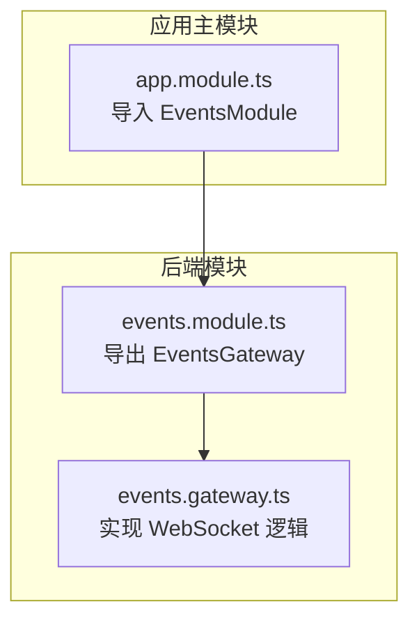
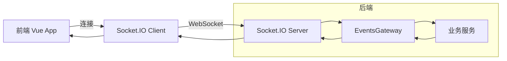
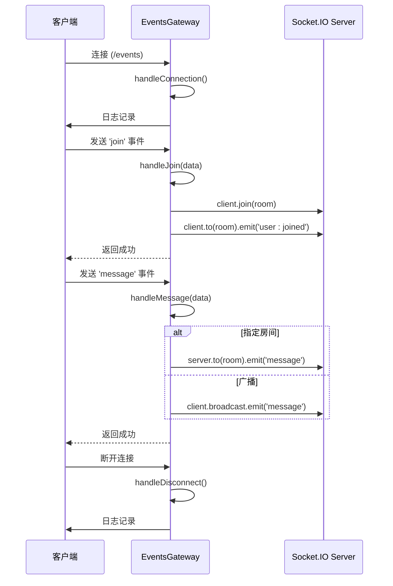
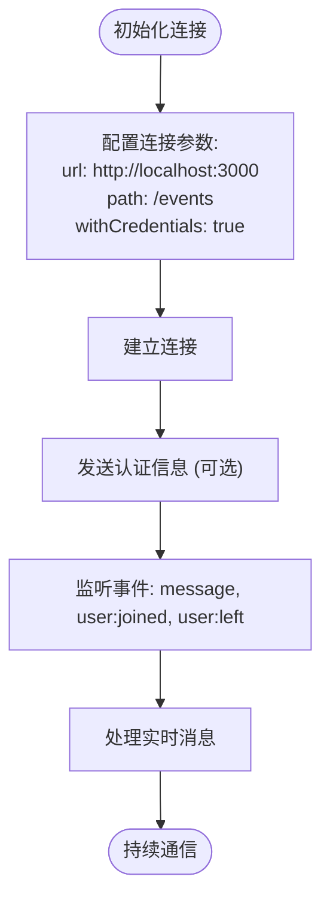
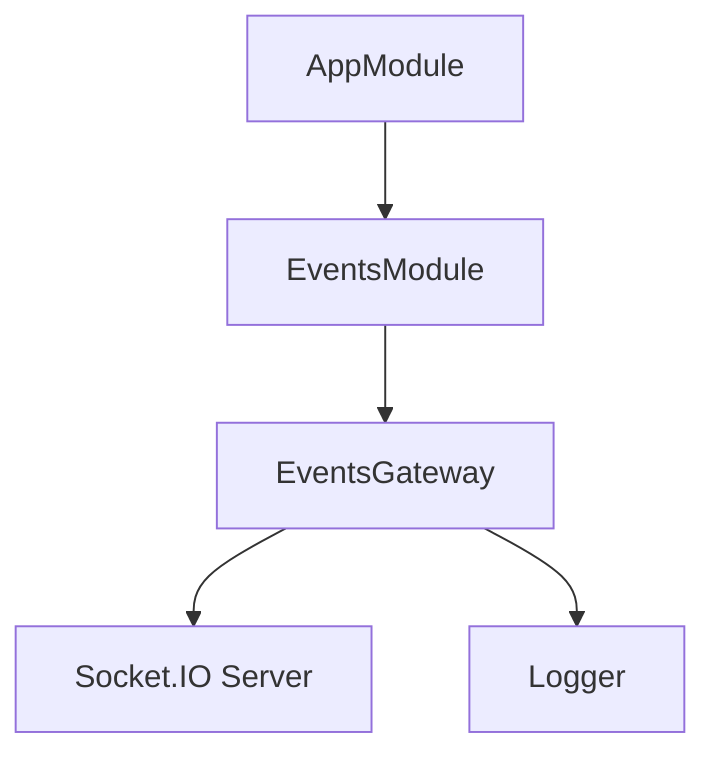

# 实时通信（WebSocket）

<cite>
**本文档引用的文件**  
- [events.gateway.ts](file://apps/backend/src/events/events.gateway.ts)
- [events.module.ts](file://apps/backend/src/events/events.module.ts)
- [app.module.ts](file://apps/backend/src/app.module.ts)
</cite>

## 目录
1. [简介](#简介)
2. [项目结构](#项目结构)
3. [核心组件](#核心组件)
4. [架构概述](#架构概述)
5. [详细组件分析](#详细组件分析)
6. [依赖分析](#依赖分析)
7. [性能考虑](#性能考虑)
8. [故障排除指南](#故障排除指南)
9. [结论](#结论)

## 简介
本项目实现了基于NestJS的WebSocket实时通信系统，核心为EventsGateway，用于处理客户端连接、消息广播和房间管理。系统支持实时通知、聊天功能和状态同步等场景，并通过Socket.IO提供可靠的双向通信。后端使用NestJS的@nestjs/websockets模块，前端通过Vue集成Socket.IO客户端，实现跨平台实时交互。

## 项目结构
实时通信功能位于后端`apps/backend/src/events/`目录下，包含网关、模块和索引文件。EventsGateway是核心实现，负责处理所有WebSocket事件。该模块在AppModule中被导入并启用，确保WebSocket服务随应用启动而初始化。

**图示来源**  
- [events.module.ts](file://apps/backend/src/events/events.module.ts#L8-L11)
- [app.module.ts](file://apps/backend/src/app.module.ts#L141)

## 核心组件
EventsGateway实现了客户端连接、断开、消息处理和房间管理功能。通过`@SubscribeMessage`装饰器监听特定事件，如`message`、`join`和`leave`。网关支持向指定房间或所有客户端广播消息，适用于通知、聊天和状态同步等场景。`broadcastToRoom`和`broadcastToAll`方法允许其他服务主动推送事件。

**章节来源**  
- [events.gateway.ts](file://apps/backend/src/events/events.gateway.ts#L25-L118)

## 架构概述
系统采用NestJS WebSocket网关模式，基于Socket.IO实现双向通信。客户端通过`/events`命名空间连接，服务端通过EventsGateway处理连接生命周期和消息路由。网关支持房间（Room）机制，允许多用户加入同一频道进行通信。跨服务通信可通过注入EventsGateway实例实现消息广播。

**图示来源**  
- [events.gateway.ts](file://apps/backend/src/events/events.gateway.ts#L18-L24)
- [app.module.ts](file://apps/backend/src/app.module.ts#L141)

## 详细组件分析

### EventsGateway 分析
EventsGateway是WebSocket通信的核心处理器，实现了连接管理、消息广播和房间操作。通过实现`OnGatewayInit`、`OnGatewayConnection`和`OnGatewayDisconnect`接口，网关能够响应连接生命周期事件。

#### 事件处理机制

**图示来源**  
- [events.gateway.ts](file://apps/backend/src/events/events.gateway.ts#L35-L41)
- [events.gateway.ts](file://apps/backend/src/events/events.gateway.ts#L75-L87)
- [events.gateway.ts](file://apps/backend/src/events/events.gateway.ts#L46-L70)

#### 消息负载结构
网关定义了标准化的消息结构，确保前后端通信一致性：

| 事件类型 | 请求负载 | 响应负载 | 广播消息结构 |
|--------|--------|--------|------------|
| `message` | `{ content: string, room?: string }` | `{ success: boolean }` | `{ senderId: string, content: string, timestamp: string }` |
| `join` | `{ room: string }` | `{ success: boolean, room: string }` | `{ userId: string, room: string }` |
| `leave` | `{ room: string }` | `{ success: boolean }` | `{ userId: string, room: string }` |

**章节来源**  
- [events.gateway.ts](file://apps/backend/src/events/events.gateway.ts#L48-L50)
- [events.gateway.ts](file://apps/backend/src/events/events.gateway.ts#L76-L77)
- [events.gateway.ts](file://apps/backend/src/events/events.gateway.ts#L93-L94)

### 前端连接配置
前端通过Socket.IO客户端连接到`/events`命名空间。连接配置需匹配后端CORS设置，支持凭证传输。认证可通过query参数或header传递JWT令牌。

**章节来源**  
- [events.gateway.ts](file://apps/backend/src/events/events.gateway.ts#L19-L22)

## 依赖分析
EventsGateway依赖Socket.IO库处理底层WebSocket通信，通过`@WebSocketServer()`装饰器注入Server实例。EventsModule将网关作为provider提供，并导出供其他模块使用。AppModule导入EventsModule，确保网关被正确初始化。

**图示来源**  
- [events.gateway.ts](file://apps/backend/src/events/events.gateway.ts#L26-L27)
- [events.module.ts](file://apps/backend/src/events/events.module.ts#L9-L10)
- [app.module.ts](file://apps/backend/src/app.module.ts#L141)

## 性能考虑
网关通过`client.broadcast.emit()`避免回传消息给发送者，减少网络开销。房间机制使用Socket.IO内置的房间系统，支持高效的组播通信。建议在高并发场景下结合Redis Adapter实现集群部署，确保消息跨实例广播。

## 故障排除指南
常见问题包括连接失败、消息丢失和跨域错误。连接失败通常由CORS配置不匹配或命名空间错误引起。消息丢失可能因客户端未正确监听事件或网络中断导致。调试时应检查服务端日志，确认`handleConnection`和`handleMessage`是否被调用。使用浏览器开发者工具的Network面板可监控WebSocket帧。

**章节来源**  
- [events.gateway.ts](file://apps/backend/src/events/events.gateway.ts#L35-L41)
- [events.gateway.ts](file://apps/backend/src/events/events.gateway.ts#L51)

## 结论
EventsGateway提供了完整的WebSocket实时通信解决方案，支持连接管理、消息广播和房间功能。通过标准化的事件命名和消息结构，系统易于扩展和维护。结合前端Socket.IO客户端，可实现高效的实时通知、聊天和状态同步功能。在生产环境中，建议配置心跳机制和集群适配器以提升稳定性和可扩展性。