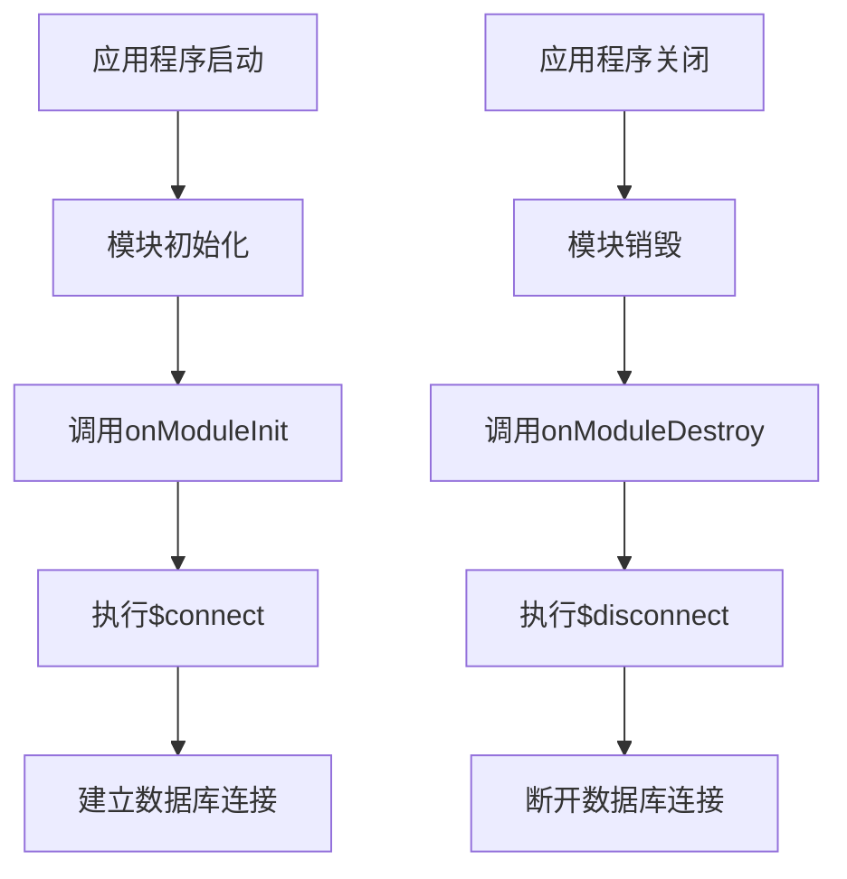
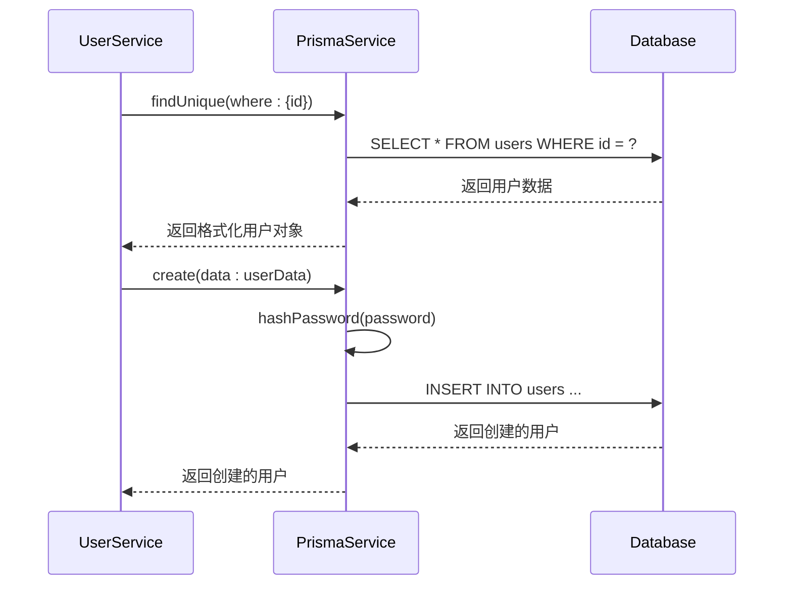

# Prisma服务实现

<cite>
**本文档引用的文件**
- [prisma.service.ts](file://apps/backend/src/prisma/prisma.service.ts)
- [prisma.module.ts](file://apps/backend/src/prisma/prisma.module.ts)
- [prisma.config.ts](file://apps/backend/prisma/prisma.config.ts)
- [schema.prisma](file://apps/backend/prisma/schema.prisma)
- [prisma.health.ts](file://apps/backend/src/health/prisma.health.ts)
- [users.service.ts](file://apps/backend/src/users/users.service.ts)
</cite>

## 目录
1. [PrismaService类设计原理](#prismaservice类设计原理)
2. [构造函数与环境变量注入](#构造函数与环境变量注入)
3. [连接管理流程](#连接管理流程)
4. [数据库操作实践](#数据库操作实践)
5. [连接池与性能监控](#连接池与性能监控)
6. [异常处理与解决方案](#异常处理与解决方案)

## PrismaService类设计原理

PrismaService类通过继承PrismaClient并实现NestJS生命周期钩子接口，实现了数据库连接的自动化管理。该类被装饰为@Injectable()，使其成为NestJS依赖注入系统中的可注入服务。通过实现OnModuleInit和OnModuleDestroy接口，PrismaService能够在模块初始化和销毁时执行相应的数据库连接和断开操作，确保了数据库连接的生命周期与应用程序的生命周期同步。

**Section sources**
- [prisma.service.ts](file://apps/backend/src/prisma/prisma.service.ts#L1-L19)

## 构造函数与环境变量注入

PrismaService的构造函数通过super()调用父类构造函数，并传入包含datasourceUrl配置的对象。该URL从process.env.DATABASE_URL环境变量中获取，实现了数据库连接配置的外部化管理。这种设计使得应用程序可以在不同环境（开发、测试、生产）中使用不同的数据库配置，而无需修改代码。环境变量的使用也符合12-factor应用原则，提高了应用的可移植性和安全性。

**Section sources**
- [prisma.service.ts](file://apps/backend/src/prisma/prisma.service.ts#L6-L10)
- [prisma.config.ts](file://apps/backend/prisma/prisma.config.ts#L10-L13)

## 连接管理流程

PrismaService通过实现NestJS的生命周期钩子来管理数据库连接。在onModuleInit方法中，调用this.$connect()方法建立数据库连接，确保在应用程序启动时数据库连接已准备就绪。在onModuleDestroy方法中，调用this.$disconnect()方法优雅地断开数据库连接，确保在应用程序关闭时正确释放数据库资源。这种自动化的连接管理机制减少了手动管理连接的复杂性，降低了资源泄漏的风险。

**Diagram sources**
- [prisma.service.ts](file://apps/backend/src/prisma/prisma.service.ts#L12-L18)

**Section sources**
- [prisma.service.ts](file://apps/backend/src/prisma/prisma.service.ts#L12-L18)

## 数据库操作实践

PrismaService提供了丰富的数据库操作方法，包括事务处理和批量操作。事务处理通过$transaction方法实现，确保多个数据库操作的原子性。批量操作可通过$executeRaw方法执行原生SQL语句，提高数据处理效率。在实际应用中，如用户服务（UsersService）中，通过PrismaService的user模型进行数据查询、创建和更新操作，展示了Prisma与NestJS的无缝集成。

**Diagram sources**
- [prisma.service.ts](file://apps/backend/src/prisma/prisma.service.ts#L2-L19)
- [users.service.ts](file://apps/backend/src/users/users.service.ts#L22-L63)

**Section sources**
- [prisma.service.ts](file://apps/backend/src/prisma/prisma.service.ts#L2-L19)
- [users.service.ts](file://apps/backend/src/users/users.service.ts#L22-L63)

## 连接池与性能监控

Prisma配置文件（prisma.config.ts）中定义了迁移适配器，使用pg库的Pool创建连接池，提高了数据库连接的复用性和性能。连接池配置包括连接超时、最大连接数等参数，可根据应用负载进行优化。性能监控可通过Prisma内置的日志功能和外部监控工具实现，记录查询执行时间、连接状态等关键指标。健康检查模块（PrismaHealthIndicator）定期检测数据库连接状态，确保服务的可用性。

**Section sources**
- [prisma.config.ts](file://apps/backend/prisma/prisma.config.ts#L8-L20)
- [prisma.health.ts](file://apps/backend/src/health/prisma.health.ts#L1-L31)

## 异常处理与解决方案

常见的数据库连接异常包括连接超时和认证失败。连接超时通常是由于网络问题或数据库服务器负载过高导致，可通过增加连接超时时间、优化查询性能或扩展数据库资源来解决。认证失败多由错误的数据库凭证引起，应检查环境变量中的DATABASE_URL配置是否正确。在代码层面，通过try-catch块捕获并处理数据库操作异常，提供有意义的错误信息，便于问题诊断和修复。

**Section sources**
- [prisma.health.ts](file://apps/backend/src/health/prisma.health.ts#L20-L29)
- [prisma.config.ts](file://apps/backend/prisma/prisma.config.ts#L11-L13)