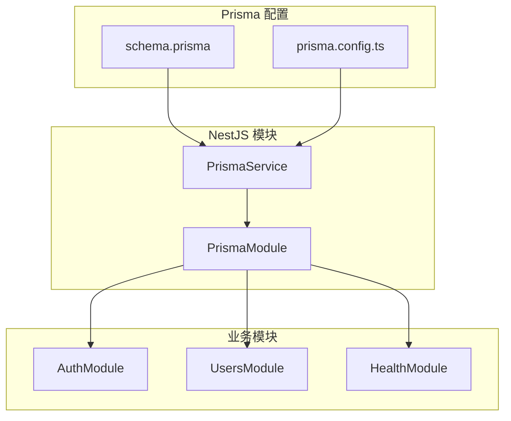
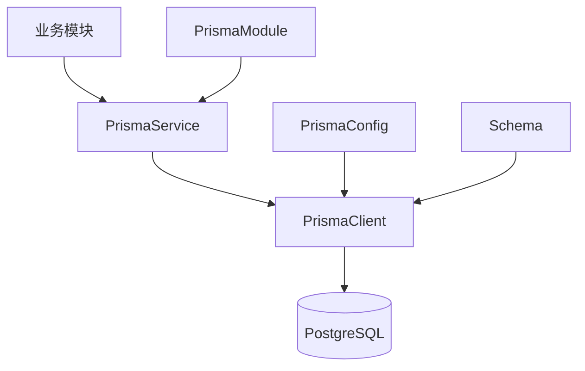
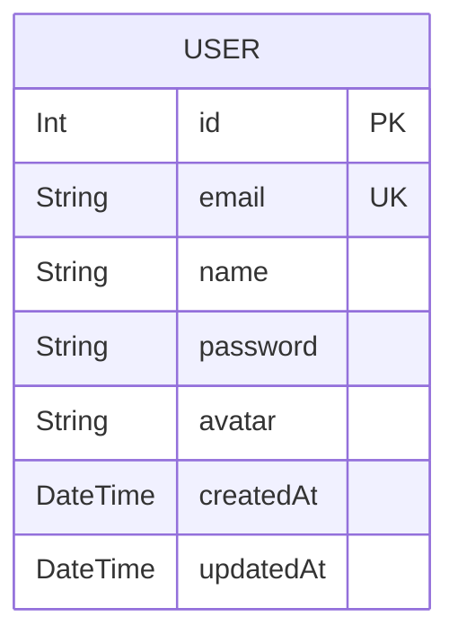
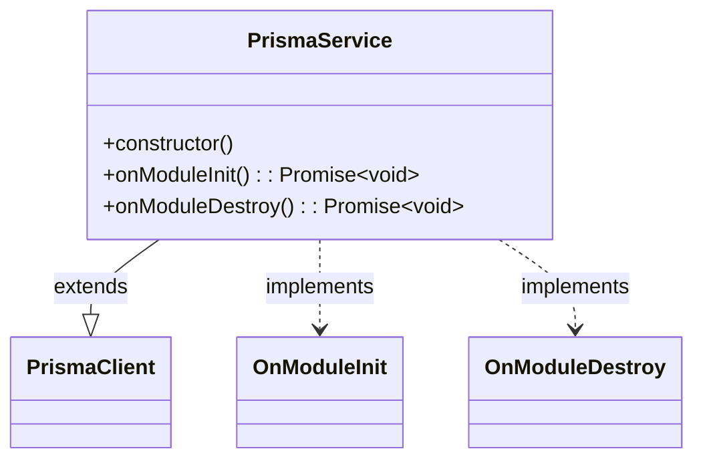
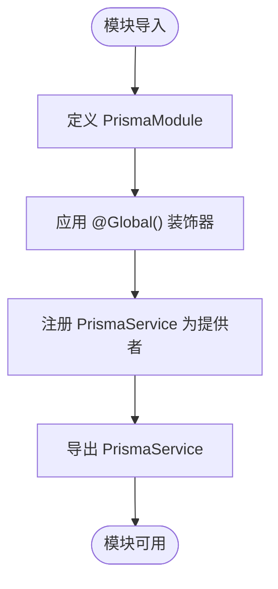
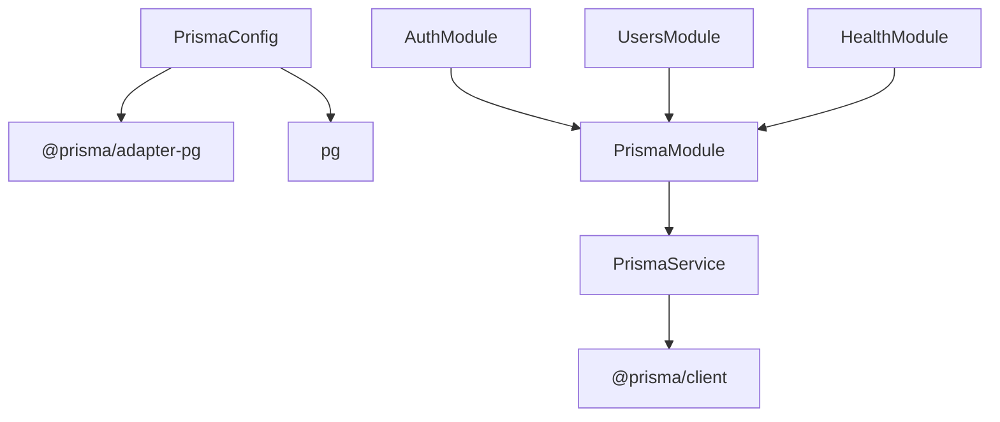

# 数据库访问层

<cite>
**本文档中引用的文件**  
- [schema.prisma](file://apps/backend/prisma/schema.prisma)
- [prisma.service.ts](file://apps/backend/src/prisma/prisma.service.ts)
- [prisma.module.ts](file://apps/backend/src/prisma/prisma.module.ts)
- [prisma.config.ts](file://apps/backend/prisma/prisma.config.ts)
- [users.service.ts](file://apps/backend/src/users/users.service.ts)
- [auth.service.ts](file://apps/backend/src/auth/auth.service.ts)
- [app.module.ts](file://apps/backend/src/app.module.ts)
- [health.module.ts](file://apps/backend/src/health/health.module.ts)
- [prisma.health.ts](file://apps/backend/src/health/prisma.health.ts)
</cite>

## 目录
1. [简介](#简介)
2. [项目结构](#项目结构)
3. [核心组件](#核心组件)
4. [架构概述](#架构概述)
5. [详细组件分析](#详细组件分析)
6. [依赖分析](#依赖分析)
7. [性能考虑](#性能考虑)
8. [故障排除指南](#故障排除指南)
9. [结论](#结论)

## 简介
本文档详细描述了 Nest.js 后端应用中数据库访问层的设计与实现，重点围绕 Prisma ORM 的集成与配置。涵盖数据模型定义、连接管理、事务处理、异常转换、依赖注入机制及复杂查询实践。同时讨论连接池、性能监控和安全最佳实践，并提供常见问题的诊断与解决方案。

## 项目结构
数据库访问层主要位于 `apps/backend/prisma/` 和 `apps/backend/src/prisma/` 目录下，采用分层架构设计，将数据访问逻辑与业务逻辑分离。

**Diagram sources**
- [schema.prisma](file://apps/backend/prisma/schema.prisma)
- [prisma.config.ts](file://apps/backend/prisma/prisma.config.ts)
- [prisma.service.ts](file://apps/backend/src/prisma/prisma.service.ts)
- [prisma.module.ts](file://apps/backend/src/prisma/prisma.module.ts)

**Section sources**
- [schema.prisma](file://apps/backend/prisma/schema.prisma)
- [prisma.config.ts](file://apps/backend/prisma/prisma.config.ts)

## 核心组件
数据库访问层的核心组件包括 Prisma 数据模型、PrismaService 服务类和 PrismaModule 模块。PrismaService 作为全局提供者，封装了数据库连接、事务管理和异常处理逻辑，为上层业务模块提供统一的数据访问接口。

**Section sources**
- [prisma.service.ts](file://apps/backend/src/prisma/prisma.service.ts)
- [prisma.module.ts](file://apps/backend/src/prisma/prisma.module.ts)
- [schema.prisma](file://apps/backend/prisma/schema.prisma)

## 架构概述
数据库访问层采用 Prisma ORM 作为底层数据访问工具，通过 NestJS 的依赖注入系统进行集成。PrismaModule 将 PrismaService 注册为全局提供者，使得所有业务模块均可直接注入并使用。PrismaService 继承自 PrismaClient，实现了连接生命周期管理，并通过 `@prisma/client` 提供类型安全的数据库操作。

**Diagram sources**
- [prisma.service.ts](file://apps/backend/src/prisma/prisma.service.ts)
- [prisma.module.ts](file://apps/backend/src/prisma/prisma.module.ts)
- [schema.prisma](file://apps/backend/prisma/schema.prisma)

## 详细组件分析

### Prisma 数据模型分析
`schema.prisma` 文件定义了应用的数据模型，当前仅包含 `User` 模型，映射到数据库中的 `users` 表。模型字段包括主键 `id`、唯一邮箱 `email`、用户名 `name`、密码 `password`、头像 `avatar`（可选）以及时间戳 `createdAt` 和 `updatedAt`。

**Diagram sources**
- [schema.prisma](file://apps/backend/prisma/schema.prisma#L9-L19)

### PrismaService 实现分析
`PrismaService` 是数据库访问的核心服务类，继承自 `PrismaClient` 并实现了 `OnModuleInit` 和 `OnModuleDestroy` 接口，确保模块初始化时自动建立数据库连接，模块销毁时正确断开连接。构造函数中通过 `datasourceUrl` 从环境变量 `DATABASE_URL` 获取数据库连接字符串。

**Diagram sources**
- [prisma.service.ts](file://apps/backend/src/prisma/prisma.service.ts#L5-L19)

### PrismaModule 配置分析
`PrismaModule` 使用 `@Global()` 装饰器声明为全局模块，将 `PrismaService` 作为提供者注册并导出，使得其他模块无需重复导入即可直接注入使用。这种设计简化了依赖管理，确保整个应用使用单一的数据库连接实例。

**Diagram sources**
- [prisma.module.ts](file://apps/backend/src/prisma/prisma.module.ts#L4-L8)

### 复杂查询示例分析
在 `UsersService` 和 `AuthService` 中展示了 Prisma 的典型查询用法。`UsersService.findAll()` 使用 `findMany()` 获取所有用户；`findOne()` 使用 `findUnique()` 按 ID 查询单个用户；`create()` 在创建前通过 `findUnique()` 检查邮箱唯一性。`AuthService.validateUser()` 同样使用 `findUnique()` 验证用户凭据。

**Section sources**
- [users.service.ts](file://apps/backend/src/users/users.service.ts#L21-L63)
- [auth.service.ts](file://apps/backend/src/auth/auth.service.ts#L39-L53)

## 依赖分析
数据库访问层与其他模块存在明确的依赖关系。`AuthModule`、`UsersModule` 和 `HealthModule` 均依赖 `PrismaModule` 以获取 `PrismaService`。`PrismaService` 本身依赖 `@prisma/client` 和环境变量 `DATABASE_URL`。`prisma.config.ts` 配置文件依赖 `@prisma/adapter-pg` 和 `pg` 库实现迁移适配。

**Diagram sources**
- [prisma.config.ts](file://apps/backend/prisma/prisma.config.ts#L15-L16)
- [prisma.service.ts](file://apps/backend/src/prisma/prisma.service.ts#L2)
- [prisma.module.ts](file://apps/backend/src/prisma/prisma.module.ts#L2)
- [auth.module.ts](file://apps/backend/src/auth/auth.module.ts#L8)
- [users.module.ts](file://apps/backend/src/users/users.module.ts)
- [health.module.ts](file://apps/backend/src/health/health.module.ts#L3)

**Section sources**
- [prisma.config.ts](file://apps/backend/prisma/prisma.config.ts)
- [prisma.service.ts](file://apps/backend/src/prisma/prisma.service.ts)
- [prisma.module.ts](file://apps/backend/src/prisma/prisma.module.ts)
- [auth.module.ts](file://apps/backend/src/auth/auth.module.ts)
- [users.module.ts](file://apps/backend/src/users/users.module.ts)
- [health.module.ts](file://apps/backend/src/health/health.module.ts)

## 性能考虑
- **连接池**：通过 `pg` 库的 `Pool` 实现连接池，`prisma.config.ts` 中配置了迁移适配器，有效管理数据库连接。
- **健康检查**：`PrismaHealthIndicator` 使用 `$queryRaw` 执行轻量级 SQL 查询 `SELECT 1` 来检测数据库连通性，避免了复杂的 ORM 操作。
- **安全实践**：密码通过 `bcrypt` 哈希存储，防止明文泄露；环境变量 `DATABASE_URL` 在配置中进行空值检查，避免运行时错误。

**Section sources**
- [prisma.config.ts](file://apps/backend/prisma/prisma.config.ts#L18)
- [prisma.health.ts](file://apps/backend/src/health/prisma.health.ts#L21)
- [auth.service.ts](file://apps/backend/src/auth/auth.service.ts#L146)

## 故障排除指南
- **N+1 查询问题**：确保在需要关联数据时使用 Prisma 的 `include` 或 `select` 选项进行预加载，避免在循环中执行数据库查询。
- **迁移冲突**：多人协作时，确保在执行 `prisma migrate dev` 前同步最新代码，避免生成冲突的迁移文件。
- **类型生成失败**：检查 `schema.prisma` 语法是否正确，确保 `prisma generate` 命令能成功执行，必要时清除 `node_modules/.prisma` 目录后重试。

**Section sources**
- [schema.prisma](file://apps/backend/prisma/schema.prisma)
- [prisma.service.ts](file://apps/backend/src/prisma/prisma.service.ts)
- [prisma.config.ts](file://apps/backend/prisma/prisma.config.ts)

## 结论
本数据库访问层设计合理，基于 Prisma ORM 实现了类型安全、高效且易于维护的数据访问。通过 NestJS 的依赖注入和全局模块机制，实现了服务的集中管理和便捷使用。建议持续关注 Prisma 的新特性，如更精细的连接池配置和性能监控工具，以进一步提升系统的稳定性和可观察性。