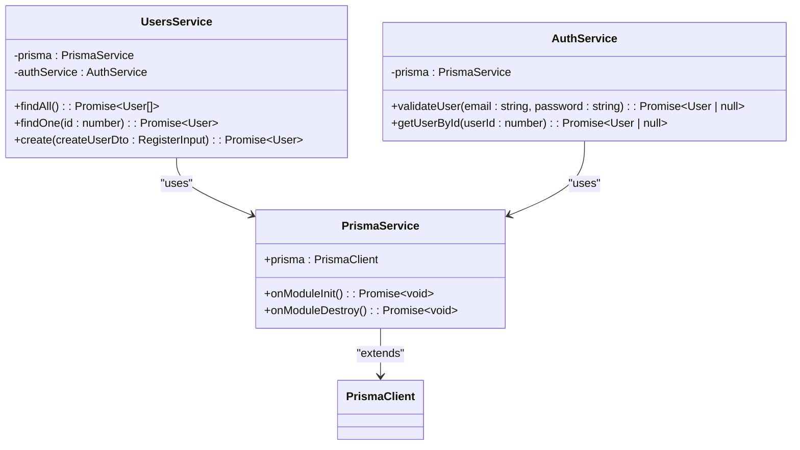
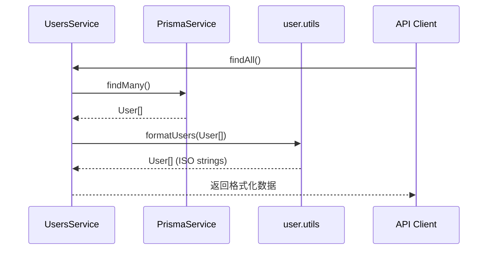
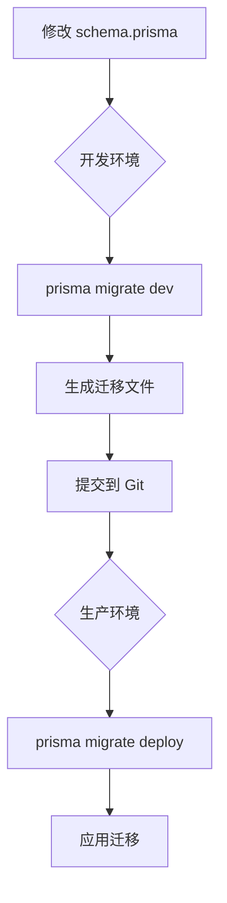

# 数据模型设计

<cite>
**本文档引用的文件**   
- [schema.prisma](file://apps/backend/prisma/schema.prisma)
- [prisma.service.ts](file://apps/backend/src/prisma/prisma.service.ts)
- [prisma.module.ts](file://apps/backend/src/prisma/prisma.module.ts)
- [prisma.config.ts](file://apps/backend/prisma/prisma.config.ts)
- [users.service.ts](file://apps/backend/src/users/users.service.ts)
- [auth.service.ts](file://apps/backend/src/auth/auth.service.ts)
- [user.utils.ts](file://packages/shared/src/utils/user.utils.ts)
- [auth.schema.ts](file://packages/shared/src/schemas/auth.schema.ts)
</cite>

## 目录
1. [简介](#简介)
2. [Prisma 数据模型定义](#prisma-数据模型定义)
3. [字段类型与约束配置](#字段类型与约束配置)
4. [Prisma Client 类型使用](#prisma-client-类型使用)
5. [数据查询与关系操作](#数据查询与关系操作)
6. [Prisma Migrate 迁移机制](#prisma-migrate-迁移机制)
7. [常见问题排查](#常见问题排查)
8. [总结](#总结)

## 简介
本项目采用 Prisma 作为 ORM 工具，用于管理 PostgreSQL 数据库的模式定义与数据访问。核心数据模型定义在 `schema.prisma` 文件中，通过 Prisma Client 生成类型安全的数据库访问接口。本文档详细解析数据模型结构、字段配置、服务层集成、迁移策略及常见问题处理方法。

## Prisma 数据模型定义

当前系统仅定义了一个核心实体模型 `User`，用于存储用户基本信息。该模型映射到数据库中的 `users` 表，通过 `@@map("users")` 指令实现模型名与表名的显式映射。

```mermaid
erDiagram
USER {
Int id PK
String email UK
String name
String password
String? avatar
DateTime createdAt
DateTime updatedAt
}
```

**图示来源**
- [schema.prisma](file://apps/backend/prisma/schema.prisma#L9-L19)

**本节来源**
- [schema.prisma](file://apps/backend/prisma/schema.prisma#L1-L19)

## 字段类型与约束配置

`User` 模型包含以下字段及其约束：

| 字段名 | 类型 | 约束 | 说明 |
|-------|------|------|------|
| id | Int | `@id @default(autoincrement())` | 主键，自增整数 |
| email | String | `@unique` | 唯一邮箱地址 |
| name | String | 无 | 用户名 |
| password | String | 无 | 加密后的密码 |
| avatar | String? | 可为空 | 头像 URL |
| createdAt | DateTime | `@default(now())` | 创建时间戳 |
| updatedAt | DateTime | `@updatedAt` | 更新时间戳 |

其中：
- `@default(now())` 自动填充创建时间
- `@updatedAt` 在记录更新时自动更新时间戳
- `String?` 表示该字段可为空（nullable）

**本节来源**
- [schema.prisma](file://apps/backend/prisma/schema.prisma#L10-L18)

## Prisma Client 类型使用

Prisma Client 类型在 NestJS 服务层中通过依赖注入方式使用。`PrismaService` 继承自 `PrismaClient`，实现了模块生命周期钩子，确保连接的正确初始化与销毁。



**图示来源**
- [prisma.service.ts](file://apps/backend/src/prisma/prisma.service.ts#L5-L19)
- [users.service.ts](file://apps/backend/src/users/users.service.ts#L12-L64)
- [auth.service.ts](file://apps/backend/src/auth/auth.service.ts#L21-L150)

**本节来源**
- [prisma.service.ts](file://apps/backend/src/prisma/prisma.service.ts#L1-L19)
- [prisma.module.ts](file://apps/backend/src/prisma/prisma.module.ts#L1-L9)

## 数据查询与关系操作

尽管当前模型未定义显式关系字段，但已在服务层中广泛使用 Prisma Client 的查询方法。以下是主要查询模式：

### 查询所有用户
```typescript
this.prisma.user.findMany()
```

### 根据 ID 查询用户
```typescript
this.prisma.user.findUnique({ where: { id } })
```

### 根据邮箱查询用户
```typescript
this.prisma.user.findUnique({ where: { email } })
```

### 创建用户
```typescript
this.prisma.user.create({ data: { ... } })
```

所有返回的 Prisma 用户对象均通过 `formatUser` 工具函数处理，将 `Date` 类型转换为 ISO 字符串格式，以确保 API 响应的一致性。



**图示来源**
- [users.service.ts](file://apps/backend/src/users/users.service.ts#L21-L24)
- [user.utils.ts](file://packages/shared/src/utils/user.utils.ts#L19-L35)

**本节来源**
- [users.service.ts](file://apps/backend/src/users/users.service.ts#L21-L64)
- [auth.service.ts](file://apps/backend/src/auth/auth.service.ts#L39-L42)
- [user.utils.ts](file://packages/shared/src/utils/user.utils.ts#L1-L35)

## Prisma Migrate 迁移机制

Prisma Migrate 用于管理数据库模式的版本控制。项目通过 `prisma.config.ts` 配置迁移适配器，支持在开发和生产环境中安全地应用模式变更。

关键配置如下：
- 使用 `@prisma/adapter-pg` 与 PostgreSQL 连接池集成
- 通过 `DATABASE_URL` 环境变量配置数据库连接
- 启用早期访问功能（earlyAccess: true）

迁移流程：
1. 修改 `schema.prisma` 文件
2. 运行 `npx prisma migrate dev` 生成并应用迁移
3. 提交迁移文件至版本控制
4. 在生产环境运行 `npx prisma migrate deploy`



**图示来源**
- [prisma.config.ts](file://apps/backend/prisma/prisma.config.ts#L8-L21)

**本节来源**
- [prisma.config.ts](file://apps/backend/prisma/prisma.config.ts#L1-L22)

## 常见问题排查

### 模型同步失败
**现象**：Prisma Client 报错 "Model not found" 或字段不匹配  
**解决方案**：
1. 确保运行 `npx prisma generate` 重新生成客户端
2. 检查 `schema.prisma` 语法是否正确
3. 验证数据库连接 URL 是否正确

### 字段命名冲突
**现象**：数据库字段与 Prisma 模型字段不一致  
**解决方案**：
- 使用 `@map` 属性显式映射字段名，例如：
```prisma
model User {
  id   Int    @id @default(autoincrement())
  name String @map("full_name")
  
  @@map("users")
}
```

### 关系配置错误
**现象**：关联查询返回空或数据不一致  
**解决方案**：
1. 检查外键约束是否正确设置
2. 确保关系字段在模型中正确定义
3. 使用 `include` 或 `select` 正确加载关联数据

### 迁移冲突
**现象**：多人开发时迁移历史冲突  
**解决方案**：
1. 在开发前同步最新迁移文件
2. 避免同时修改同一模型
3. 使用 `prisma migrate resolve` 标记已应用的迁移

**本节来源**
- [schema.prisma](file://apps/backend/prisma/schema.prisma#L1-L19)
- [prisma.config.ts](file://apps/backend/prisma/prisma.config.ts#L1-L22)

## 总结
本项目通过 Prisma 实现了类型安全的数据访问层，`User` 模型具备完整的字段约束与时间戳管理。Prisma Client 与 NestJS 服务层无缝集成，通过共享类型确保前后端一致性。迁移配置支持安全的数据库模式演进。未来可扩展模型关系（如用户角色、权限等）以支持更复杂的业务场景。