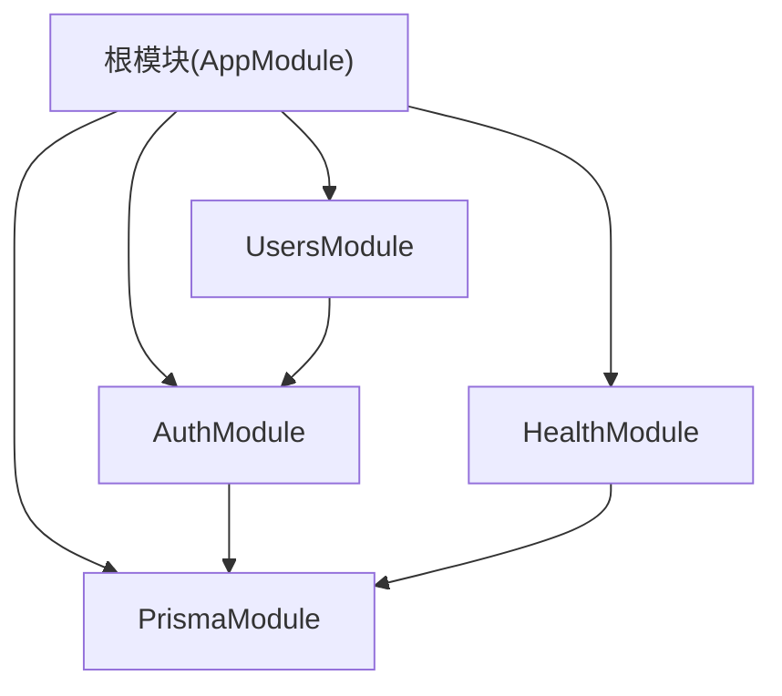
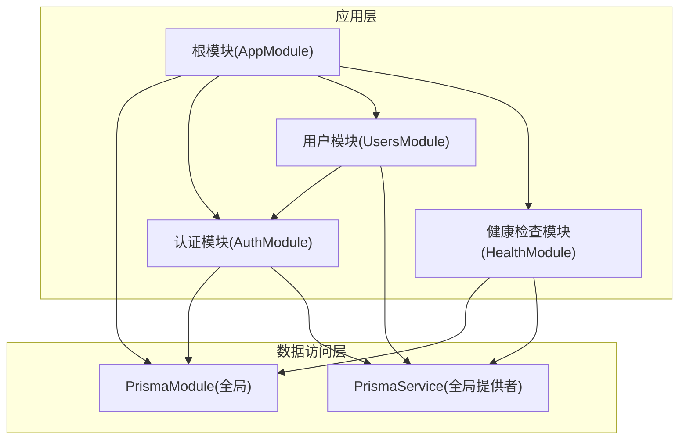
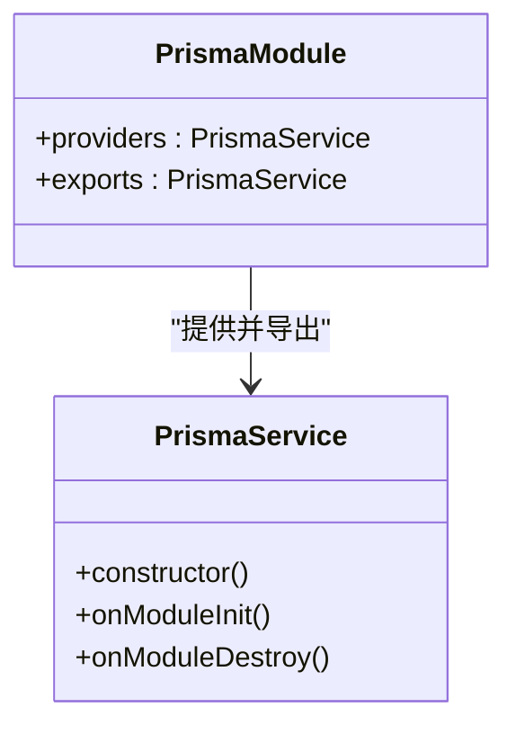
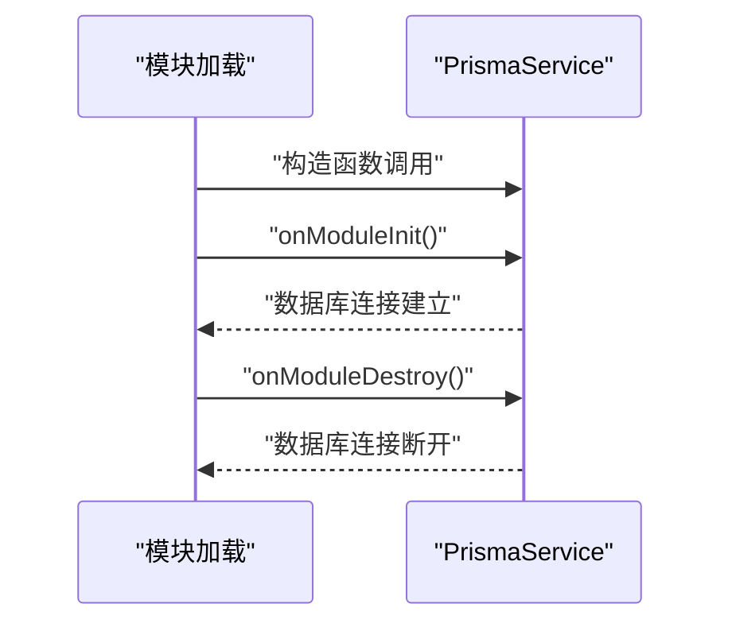
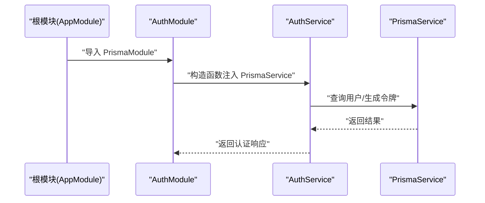
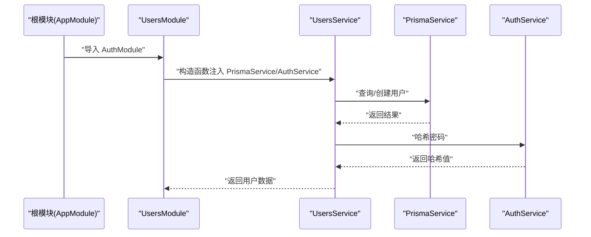
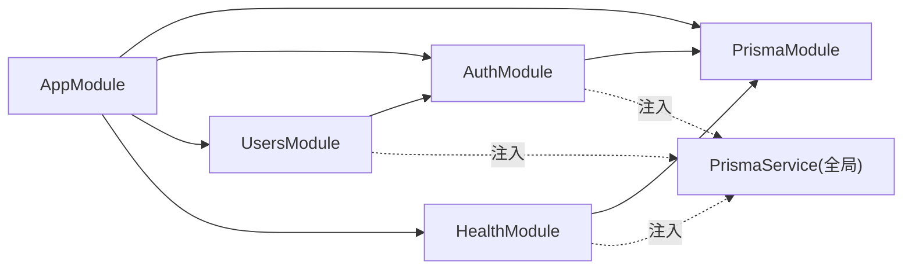

# 模块集成与依赖注入

<cite>
**本文引用的文件**
- [apps/backend/src/prisma/prisma.module.ts](file://apps/backend/src/prisma/prisma.module.ts)
- [apps/backend/src/prisma/prisma.service.ts](file://apps/backend/src/prisma/prisma.service.ts)
- [apps/backend/src/auth/auth.module.ts](file://apps/backend/src/auth/auth.module.ts)
- [apps/backend/src/auth/auth.service.ts](file://apps/backend/src/auth/auth.service.ts)
- [apps/backend/src/users/users.module.ts](file://apps/backend/src/users/users.module.ts)
- [apps/backend/src/users/users.service.ts](file://apps/backend/src/users/users.service.ts)
- [apps/backend/src/health/health.module.ts](file://apps/backend/src/health/health.module.ts)
- [apps/backend/src/health/prisma.health.ts](file://apps/backend/src/health/prisma.health.ts)
- [apps/backend/src/app.module.ts](file://apps/backend/src/app.module.ts)
- [apps/backend/src/users/users.controller.ts](file://apps/backend/src/users/users.controller.ts)
- [apps/backend/src/auth/auth.controller.ts](file://apps/backend/src/auth/auth.controller.ts)
- [apps/backend/src/users/users.service.spec.ts](file://apps/backend/src/users/users.service.spec.ts)
</cite>

## 目录
1. [简介](#简介)
2. [项目结构](#项目结构)
3. [核心组件](#核心组件)
4. [架构总览](#架构总览)
5. [详细组件分析](#详细组件分析)
6. [依赖关系分析](#依赖关系分析)
7. [性能考量](#性能考量)
8. [故障排查指南](#故障排查指南)
9. [结论](#结论)
10. [附录](#附录)

## 简介
本文件围绕 PrismaModule 的模块化设计展开，重点阐释以下主题：
- @Global() 装饰器的作用及其作为全局提供者的角色
- 模块元数据中 providers 与 exports 数组的配置意义
- 通过依赖注入机制在其他模块（如 UsersModule、AuthService）中安全使用 PrismaService
- 在控制器和服务中注入 PrismaService 的代码示例路径
- 模块导入顺序、循环依赖风险及测试环境中的模块替换策略
- 因模块未正确导入导致的“Nest can't resolve dependencies”错误的诊断步骤

## 项目结构
该后端采用多模块架构，根模块集中导入各子模块；PrismaModule 以全局方式提供 PrismaService，供任意模块按需注入使用。关键模块包括：
- 根模块：集中导入 PrismaModule、AuthModule、UsersModule 等
- 认证模块：依赖 PrismaModule，提供认证相关服务与控制器
- 用户模块：依赖认证模块，提供用户相关服务与控制器
- 健康检查模块：依赖 PrismaModule，提供数据库健康检查能力

图表来源
- [apps/backend/src/app.module.ts](file://apps/backend/src/app.module.ts#L1-L159)
- [apps/backend/src/prisma/prisma.module.ts](file://apps/backend/src/prisma/prisma.module.ts#L1-L10)
- [apps/backend/src/auth/auth.module.ts](file://apps/backend/src/auth/auth.module.ts#L1-L32)
- [apps/backend/src/users/users.module.ts](file://apps/backend/src/users/users.module.ts#L1-L13)
- [apps/backend/src/health/health.module.ts](file://apps/backend/src/health/health.module.ts#L1-L13)

章节来源
- [apps/backend/src/app.module.ts](file://apps/backend/src/app.module.ts#L1-L159)

## 核心组件
- PrismaModule：通过 @Global() 将 PrismaService 注册为全局提供者，并将其导出，使其他模块无需显式导入即可注入使用。
- PrismaService：继承 PrismaClient，实现 OnModuleInit/OnModuleDestroy 生命周期钩子，负责数据库连接与断开。
- AuthModule：导入 PrismaModule，注入 PrismaService 以完成用户认证与令牌签发等逻辑。
- UsersModule：导入 AuthModule，注入 PrismaService 以完成用户查询与创建等逻辑。
- HealthModule：导入 PrismaModule，注入 PrismaService 以执行数据库健康检查。

章节来源
- [apps/backend/src/prisma/prisma.module.ts](file://apps/backend/src/prisma/prisma.module.ts#L1-L10)
- [apps/backend/src/prisma/prisma.service.ts](file://apps/backend/src/prisma/prisma.service.ts#L1-L20)
- [apps/backend/src/auth/auth.module.ts](file://apps/backend/src/auth/auth.module.ts#L1-L32)
- [apps/backend/src/users/users.module.ts](file://apps/backend/src/users/users.module.ts#L1-L13)
- [apps/backend/src/health/health.module.ts](file://apps/backend/src/health/health.module.ts#L1-L13)

## 架构总览
下图展示了 PrismaModule 作为全局提供者在整个应用中的位置与交互关系。

图表来源
- [apps/backend/src/app.module.ts](file://apps/backend/src/app.module.ts#L1-L159)
- [apps/backend/src/prisma/prisma.module.ts](file://apps/backend/src/prisma/prisma.module.ts#L1-L10)
- [apps/backend/src/auth/auth.module.ts](file://apps/backend/src/auth/auth.module.ts#L1-L32)
- [apps/backend/src/users/users.module.ts](file://apps/backend/src/users/users.module.ts#L1-L13)
- [apps/backend/src/health/health.module.ts](file://apps/backend/src/health/health.module.ts#L1-L13)

## 详细组件分析

### PrismaModule 的全局提供者角色与元数据配置
- @Global() 装饰器的作用
  - 将 PrismaService 注册为全局提供者，使得在应用的任何模块中都可以直接注入 PrismaService，而无需在 imports 中再次显式导入 PrismaModule。
  - 与非全局模块相比，全局模块的提供者会自动对整个应用可见，简化了跨模块依赖的管理。
- providers 数组
  - 在 PrismaModule 中仅提供 PrismaService，意味着该模块只负责创建并暴露一个可复用的数据访问客户端实例。
- exports 数组
  - 导出 PrismaService，确保其他模块在导入 PrismaModule 后可以直接使用该服务；即使 PrismaModule 本身未被显式导入，由于其全局性，其他模块仍可注入。

图表来源
- [apps/backend/src/prisma/prisma.module.ts](file://apps/backend/src/prisma/prisma.module.ts#L1-L10)
- [apps/backend/src/prisma/prisma.service.ts](file://apps/backend/src/prisma/prisma.service.ts#L1-L20)

章节来源
- [apps/backend/src/prisma/prisma.module.ts](file://apps/backend/src/prisma/prisma.module.ts#L1-L10)

### PrismaService 的生命周期与数据库连接
- 继承 PrismaClient 并实现 OnModuleInit/OnModuleDestroy
  - 在模块初始化阶段建立数据库连接，在模块销毁阶段断开连接，保证资源的正确释放。
- 数据源配置
  - 通过环境变量 DATABASE_URL 初始化 Prisma 客户端，确保不同环境下的数据源可配置。

图表来源
- [apps/backend/src/prisma/prisma.service.ts](file://apps/backend/src/prisma/prisma.service.ts#L1-L20)

章节来源
- [apps/backend/src/prisma/prisma.service.ts](file://apps/backend/src/prisma/prisma.service.ts#L1-L20)

### 在 AuthModule 中安全使用 PrismaService
- AuthModule 导入 PrismaModule，从而获得全局可用的 PrismaService
- AuthService 构造函数注入 PrismaService，用于用户查询、令牌签发等操作
- 通过 JwtService 与 ConfigService 实现 JWT 令牌生成与配置读取

图表来源
- [apps/backend/src/auth/auth.module.ts](file://apps/backend/src/auth/auth.module.ts#L1-L32)
- [apps/backend/src/auth/auth.service.ts](file://apps/backend/src/auth/auth.service.ts#L1-L150)
- [apps/backend/src/prisma/prisma.module.ts](file://apps/backend/src/prisma/prisma.module.ts#L1-L10)

章节来源
- [apps/backend/src/auth/auth.module.ts](file://apps/backend/src/auth/auth.module.ts#L1-L32)
- [apps/backend/src/auth/auth.service.ts](file://apps/backend/src/auth/auth.service.ts#L1-L150)

### 在 UsersModule 中安全使用 PrismaService
- UsersModule 导入 AuthModule，间接获得 PrismaService 的可用性
- UsersService 构造函数注入 PrismaService，用于用户列表查询、单个用户查询与创建等操作
- UsersService 同时注入 AuthService，用于密码哈希等业务流程

图表来源
- [apps/backend/src/users/users.module.ts](file://apps/backend/src/users/users.module.ts#L1-L13)
- [apps/backend/src/users/users.service.ts](file://apps/backend/src/users/users.service.ts#L1-L66)
- [apps/backend/src/auth/auth.service.ts](file://apps/backend/src/auth/auth.service.ts#L1-L150)
- [apps/backend/src/prisma/prisma.module.ts](file://apps/backend/src/prisma/prisma.module.ts#L1-L10)

章节来源
- [apps/backend/src/users/users.module.ts](file://apps/backend/src/users/users.module.ts#L1-L13)
- [apps/backend/src/users/users.service.ts](file://apps/backend/src/users/users.service.ts#L1-L66)

### 控制器中注入 PrismaService 的使用路径
- 控制器通过服务层使用 PrismaService，避免在控制器中直接操作底层数据访问细节
- UsersController 注入 UsersService，间接使用 PrismaService
- AuthController 注入 AuthService，间接使用 PrismaService

章节来源
- [apps/backend/src/users/users.controller.ts](file://apps/backend/src/users/users.controller.ts#L1-L43)
- [apps/backend/src/auth/auth.controller.ts](file://apps/backend/src/auth/auth.controller.ts#L1-L51)
- [apps/backend/src/users/users.service.ts](file://apps/backend/src/users/users.service.ts#L1-L66)
- [apps/backend/src/auth/auth.service.ts](file://apps/backend/src/auth/auth.service.ts#L1-L150)

### 健康检查模块中的 PrismaService 使用
- HealthModule 导入 PrismaModule，注入 PrismaService 执行数据库健康检查
- 通过原生 SQL 查询验证数据库连通性

章节来源
- [apps/backend/src/health/health.module.ts](file://apps/backend/src/health/health.module.ts#L1-L13)
- [apps/backend/src/health/prisma.health.ts](file://apps/backend/src/health/prisma.health.ts#L1-L31)

## 依赖关系分析
- 模块导入顺序
  - 根模块先导入 PrismaModule，再导入 AuthModule、UsersModule 等，确保全局提供者在子模块导入前已就绪
  - UsersModule 依赖 AuthModule，形成自上而下的依赖链
- 循环依赖风险
  - 当前结构未见直接循环依赖：AppModule -> PrismaModule/Modules；UsersModule -> AuthModule
  - 若在 UsersModule 与 AuthModule 之间引入双向导入，可能引发循环依赖问题
- 依赖注入链路
  - PrismaModule 提供 PrismaService（全局）
  - AuthModule/HealthModule/UsersModule 通过构造函数注入 PrismaService
  - 控制器通过服务层间接使用 PrismaService

图表来源
- [apps/backend/src/app.module.ts](file://apps/backend/src/app.module.ts#L1-L159)
- [apps/backend/src/prisma/prisma.module.ts](file://apps/backend/src/prisma/prisma.module.ts#L1-L10)
- [apps/backend/src/auth/auth.module.ts](file://apps/backend/src/auth/auth.module.ts#L1-L32)
- [apps/backend/src/users/users.module.ts](file://apps/backend/src/users/users.module.ts#L1-L13)
- [apps/backend/src/health/health.module.ts](file://apps/backend/src/health/health.module.ts#L1-L13)

章节来源
- [apps/backend/src/app.module.ts](file://apps/backend/src/app.module.ts#L1-L159)
- [apps/backend/src/auth/auth.module.ts](file://apps/backend/src/auth/auth.module.ts#L1-L32)
- [apps/backend/src/users/users.module.ts](file://apps/backend/src/users/users.module.ts#L1-L13)

## 性能考量
- 全局提供者的优势
  - 减少重复实例化，降低内存占用与初始化成本
  - 统一数据库连接池管理，便于监控与优化
- 生命周期管理
  - onModuleInit/onModuleDestroy 确保连接在应用启动/关闭时正确建立/断开
- 测试环境中的替代策略
  - 使用测试替身（Mock）或内存数据库，避免真实数据库影响测试稳定性
  - 在测试中通过依赖注入容器替换 PrismaService，以隔离外部依赖

[本节为通用指导，不直接分析具体文件]

## 故障排查指南

### Nest can't resolve dependencies 错误的诊断步骤
- 症状
  - 启动时抛出“Nest can't resolve dependencies”异常，通常由构造函数参数无法解析引起
- 常见原因
  - 未在根模块导入 PrismaModule，导致 PrismaService 未注册为全局提供者
  - 子模块未导入 PrismaModule 或 AuthModule 未导入 PrismaModule
  - 存在循环依赖，导致注入顺序失败
- 诊断步骤
  1. 检查根模块是否导入 PrismaModule
     - 参考路径：[apps/backend/src/app.module.ts](file://apps/backend/src/app.module.ts#L1-L159)
  2. 检查依赖模块是否导入 PrismaModule 或其上游模块
     - AuthModule 与 HealthModule 需要 PrismaModule
     - 参考路径：[apps/backend/src/auth/auth.module.ts](file://apps/backend/src/auth/auth.module.ts#L1-L32)，[apps/backend/src/health/health.module.ts](file://apps/backend/src/health/health.module.ts#L1-L13)
  3. 检查是否存在循环依赖
     - UsersModule 依赖 AuthModule；若 AuthModule 反向依赖 UsersModule，将产生循环依赖
     - 参考路径：[apps/backend/src/users/users.module.ts](file://apps/backend/src/users/users.module.ts#L1-L13)，[apps/backend/src/auth/auth.module.ts](file://apps/backend/src/auth/auth.module.ts#L1-L32)
  4. 确认构造函数参数类型与注入令牌一致
     - 参考路径：[apps/backend/src/auth/auth.service.ts](file://apps/backend/src/auth/auth.service.ts#L1-L150)，[apps/backend/src/users/users.service.ts](file://apps/backend/src/users/users.service.ts#L1-L66)
  5. 在测试环境中使用替身对象进行隔离
     - 参考路径：[apps/backend/src/users/users.service.spec.ts](file://apps/backend/src/users/users.service.spec.ts#L1-L114)

章节来源
- [apps/backend/src/app.module.ts](file://apps/backend/src/app.module.ts#L1-L159)
- [apps/backend/src/auth/auth.module.ts](file://apps/backend/src/auth/auth.module.ts#L1-L32)
- [apps/backend/src/users/users.module.ts](file://apps/backend/src/users/users.module.ts#L1-L13)
- [apps/backend/src/auth/auth.service.ts](file://apps/backend/src/auth/auth.service.ts#L1-L150)
- [apps/backend/src/users/users.service.ts](file://apps/backend/src/users/users.service.ts#L1-L66)
- [apps/backend/src/users/users.service.spec.ts](file://apps/backend/src/users/users.service.spec.ts#L1-L114)

## 结论
- PrismaModule 通过 @Global() 将 PrismaService 注册为全局提供者，配合 exports 数组，实现了跨模块的无缝依赖注入
- 在 AuthModule 与 UsersModule 中，PrismaService 以构造函数注入的方式被安全使用，避免了重复实例化与连接管理复杂度
- 健康检查模块通过 PrismaService 提供数据库连通性保障
- 正确的模块导入顺序与避免循环依赖是稳定运行的关键
- 测试环境可通过替身对象替换 PrismaService，提升测试效率与稳定性

[本节为总结性内容，不直接分析具体文件]

## 附录

### 在控制器和服务中注入 PrismaService 的代码示例路径
- 控制器注入服务（间接使用 PrismaService）
  - 用户控制器：[apps/backend/src/users/users.controller.ts](file://apps/backend/src/users/users.controller.ts#L1-L43)
  - 认证控制器：[apps/backend/src/auth/auth.controller.ts](file://apps/backend/src/auth/auth.controller.ts#L1-L51)
- 服务注入 PrismaService
  - 用户服务：[apps/backend/src/users/users.service.ts](file://apps/backend/src/users/users.service.ts#L1-L66)
  - 认证服务：[apps/backend/src/auth/auth.service.ts](file://apps/backend/src/auth/auth.service.ts#L1-L150)

### 测试环境中的模块替换策略
- 使用替身对象（Mock）模拟 PrismaService 行为，避免真实数据库访问
  - 示例参考：[apps/backend/src/users/users.service.spec.ts](file://apps/backend/src/users/users.service.spec.ts#L1-L114)

[本节为补充说明，不直接分析具体文件]