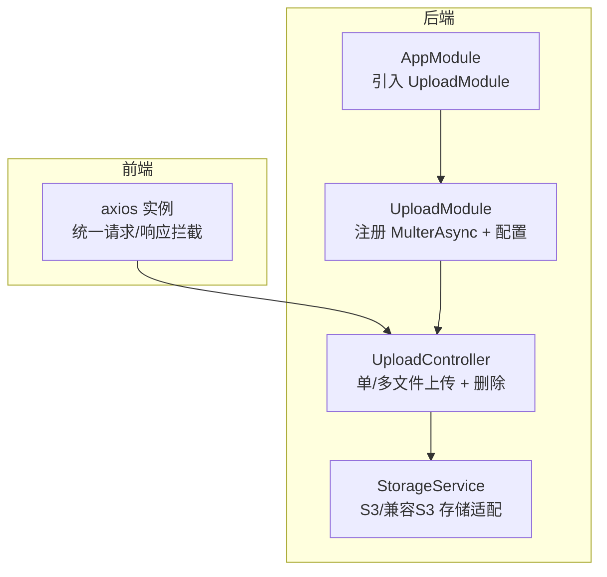
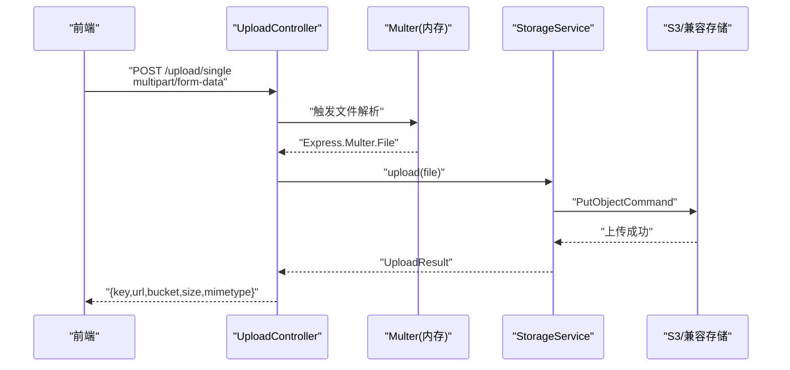
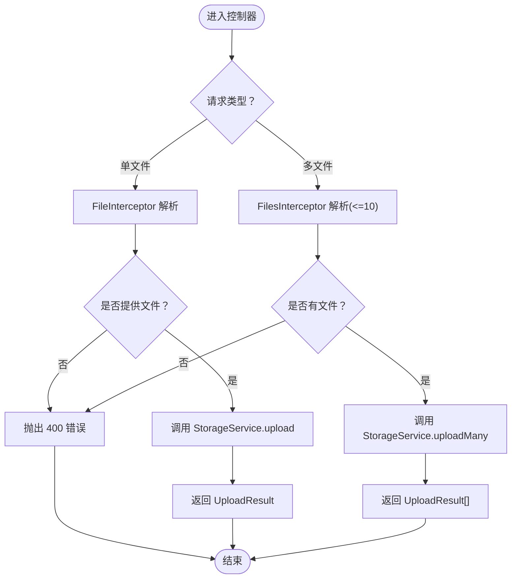
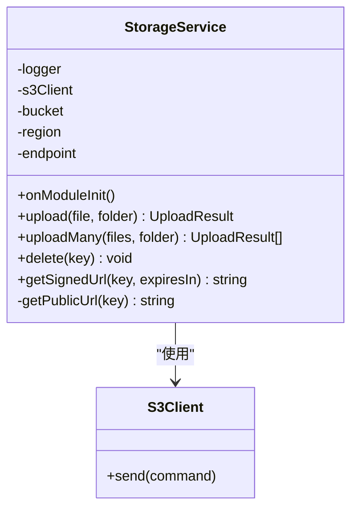
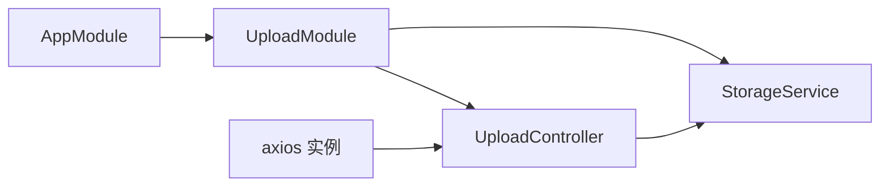

# 文件上传服务

<cite>
**本文引用的文件**
- [apps/backend/src/upload/upload.controller.ts](file://apps/backend/src/upload/upload.controller.ts)
- [apps/backend/src/upload/storage.service.ts](file://apps/backend/src/upload/storage.service.ts)
- [apps/backend/src/upload/upload.module.ts](file://apps/backend/src/upload/upload.module.ts)
- [apps/backend/src/app.module.ts](file://apps/backend/src/app.module.ts)
- [apps/backend/src/common/filters/all-exceptions.filter.ts](file://apps/backend/src/common/filters/all-exceptions.filter.ts)
- [.env.example](file://.env.example)
- [apps/frontend/src/api/index.ts](file://apps/frontend/src/api/index.ts)
</cite>

## 目录
1. [简介](#简介)
2. [项目结构](#项目结构)
3. [核心组件](#核心组件)
4. [架构总览](#架构总览)
5. [详细组件分析](#详细组件分析)
6. [依赖关系分析](#依赖关系分析)
7. [性能考量](#性能考量)
8. [故障排查指南](#故障排查指南)
9. [结论](#结论)
10. [附录](#附录)

## 简介
本文件上传服务基于 NestJS 的上传模块与 S3 兼容存储实现，提供统一的文件上传、删除与访问能力。后端通过 UploadController 接收前端上传请求，利用 Multer 将文件暂存至内存，随后交由 StorageService 上传至 S3 或兼容 S3 的对象存储（如 MinIO、阿里云 OSS）。该设计既保证了上传过程的安全性与可控性，又便于扩展到其他存储后端。

## 项目结构
- 后端上传模块位于 apps/backend/src/upload，包含控制器、服务与模块注册。
- 应用根模块在 apps/backend/src/app.module.ts 中引入 UploadModule，使上传功能全局可用。
- 异常统一由全局异常过滤器处理，确保错误响应格式一致。
- 前端通过 axios 实例发起上传请求，使用标准的 multipart/form-data 编码。

图表来源
- [apps/backend/src/app.module.ts](file://apps/backend/src/app.module.ts#L135-L144)
- [apps/backend/src/upload/upload.module.ts](file://apps/backend/src/upload/upload.module.ts#L12-L49)
- [apps/backend/src/upload/upload.controller.ts](file://apps/backend/src/upload/upload.controller.ts#L23-L83)
- [apps/backend/src/upload/storage.service.ts](file://apps/backend/src/upload/storage.service.ts#L25-L124)
- [apps/frontend/src/api/index.ts](file://apps/frontend/src/api/index.ts#L1-L56)

章节来源
- [apps/backend/src/app.module.ts](file://apps/backend/src/app.module.ts#L135-L144)
- [apps/backend/src/upload/upload.module.ts](file://apps/backend/src/upload/upload.module.ts#L12-L49)
- [apps/frontend/src/api/index.ts](file://apps/frontend/src/api/index.ts#L1-L56)

## 核心组件
- UploadController：暴露 /upload/single、/upload/multiple、/upload/:key 端点，负责接收文件、参数校验与调用存储服务。
- StorageService：封装 S3 客户端，提供上传、批量上传、删除与预签名 URL 获取能力；支持自定义 endpoint 以适配 OSS/MinIO。
- UploadModule：通过 MulterModule.registerAsync 注册内存存储与上传限制、文件类型过滤规则，并注入 StorageService。

章节来源
- [apps/backend/src/upload/upload.controller.ts](file://apps/backend/src/upload/upload.controller.ts#L23-L83)
- [apps/backend/src/upload/storage.service.ts](file://apps/backend/src/upload/storage.service.ts#L25-L124)
- [apps/backend/src/upload/upload.module.ts](file://apps/backend/src/upload/upload.module.ts#L12-L49)

## 架构总览
后端采用“控制器-服务”分层，控制器仅负责请求接入与参数校验，业务逻辑集中在服务层。上传流程先经 Multer 内存存储，再由 StorageService 发送到 S3/兼容存储，最终返回统一的上传结果结构。

图表来源
- [apps/backend/src/upload/upload.controller.ts](file://apps/backend/src/upload/upload.controller.ts#L30-L47)
- [apps/backend/src/upload/storage.service.ts](file://apps/backend/src/upload/storage.service.ts#L56-L78)
- [apps/backend/src/upload/upload.module.ts](file://apps/backend/src/upload/upload.module.ts#L14-L43)

## 详细组件分析

### UploadController：请求接入与流程编排
- 单文件上传：使用 FileInterceptor('file') 解析单文件，若未提供文件则抛出 400 错误；随后调用 StorageService.upload。
- 多文件上传：使用 FilesInterceptor('files', 10) 限制最多 10 个文件，同样进行非空校验后调用 StorageService.uploadMany。
- 删除文件：DELETE /upload/:key，调用 StorageService.delete 并返回 { success: true }。
- 安全与鉴权：使用 JwtAuthGuard 与 ApiBearerAuth，确保上传操作受 JWT 保护。

图表来源
- [apps/backend/src/upload/upload.controller.ts](file://apps/backend/src/upload/upload.controller.ts#L30-L83)

章节来源
- [apps/backend/src/upload/upload.controller.ts](file://apps/backend/src/upload/upload.controller.ts#L23-L83)

### StorageService：存储适配器与 S3 操作
- 初始化：读取 S3_BUCKET、S3_REGION、S3_ENDPOINT、S3_ACCESS_KEY_ID、S3_SECRET_ACCESS_KEY 等配置；当存在 endpoint 时启用 forcePathStyle 以适配 OSS/MinIO。
- 上传：生成带扩展名的随机 key（uploads/<uuid>.ext），将文件 buffer 上传至 S3；返回 UploadResult（包含 key、url、bucket、size、mimetype）。
- 批量上传：并发执行多个上传任务，提升吞吐。
- 删除：根据 key 删除对象。
- 预签名 URL：为私有文件生成限时可访问链接，便于临时分享或下载。
- 公开 URL：根据是否存在 endpoint 判断返回 OSS/MinIO 或 AWS S3 的公开访问地址。

图表来源
- [apps/backend/src/upload/storage.service.ts](file://apps/backend/src/upload/storage.service.ts#L25-L124)

章节来源
- [apps/backend/src/upload/storage.service.ts](file://apps/backend/src/upload/storage.service.ts#L25-L124)

### UploadModule：Multer 配置与文件过滤
- 存储策略：memoryStorage，将文件暂存于内存，避免磁盘 IO 开销，适合上传后立即发送到 S3。
- 上传限制：
  - 单文件大小：默认 10MB，可通过 UPLOAD_MAX_SIZE 覆盖。
  - 文件数量：默认最多 10 个，可通过 UPLOAD_MAX_FILES 覆盖。
- 文件类型过滤：仅允许图片与部分办公文档类型，拒绝其他 MIME 类型。
- 服务导出：将 StorageService 作为可注入服务导出，供控制器使用。

章节来源
- [apps/backend/src/upload/upload.module.ts](file://apps/backend/src/upload/upload.module.ts#L12-L49)

### 异常处理与统一响应
- 全局异常过滤器：捕获所有未处理异常，按 HTTP 状态码返回统一的错误响应结构（包含 success、data、message、statusCode、timestamp）。
- 上传控制器中的 BadRequestException：对缺失文件等场景返回明确的错误信息。

章节来源
- [apps/backend/src/common/filters/all-exceptions.filter.ts](file://apps/backend/src/common/filters/all-exceptions.filter.ts#L1-L31)
- [apps/backend/src/upload/upload.controller.ts](file://apps/backend/src/upload/upload.controller.ts#L43-L45)

## 依赖关系分析
- UploadController 依赖 StorageService 进行实际存储操作。
- UploadModule 依赖 MulterModule.registerAsync 提供的内存存储与限制配置，并注入 StorageService。
- AppModule 引入 UploadModule，使上传功能在整个应用中生效。
- 前端 axios 实例统一处理请求头（Authorization、CSRF）、超时与错误处理，配合后端的 JWT 与 CSRF 中间件。

图表来源
- [apps/backend/src/app.module.ts](file://apps/backend/src/app.module.ts#L135-L144)
- [apps/backend/src/upload/upload.module.ts](file://apps/backend/src/upload/upload.module.ts#L12-L49)
- [apps/backend/src/upload/upload.controller.ts](file://apps/backend/src/upload/upload.controller.ts#L23-L83)
- [apps/frontend/src/api/index.ts](file://apps/frontend/src/api/index.ts#L1-L56)

章节来源
- [apps/backend/src/app.module.ts](file://apps/backend/src/app.module.ts#L135-L144)
- [apps/backend/src/upload/upload.module.ts](file://apps/backend/src/upload/upload.module.ts#L12-L49)
- [apps/frontend/src/api/index.ts](file://apps/frontend/src/api/index.ts#L1-L56)

## 性能考量
- 内存上传：使用 memoryStorage 可减少磁盘 IO，但会占用服务器内存；建议结合合理的文件大小限制与并发控制。
- 并发上传：StorageService.uploadMany 使用 Promise.all 并发上传，提高吞吐；注意 S3/兼容存储的并发连接上限与网络带宽。
- CDN 集成：StorageService.getPublicUrl 返回公开 URL，可直接对接 CDN；对于私有资源，使用 StorageService.getSignedUrl 生成限时链接。
- 大文件优化：当前实现将文件载入内存，不适合超大文件；建议采用分片上传（客户端分片 + 服务端聚合）或直传（前端直连 S3/兼容存储）以降低后端压力。

[本节为通用性能建议，不直接分析具体文件]

## 故障排查指南
- 400 错误（缺少文件）：检查前端是否正确设置 multipart/form-data 且字段名为 file 或 files。
- 413/415 错误：检查 UPLOAD_MAX_SIZE、UPLOAD_MAX_FILES 与文件类型过滤规则是否符合预期。
- 401/403：确认 JWT 令牌有效且已通过 JwtAuthGuard；前端需携带 Authorization 头。
- 500 错误：查看全局异常过滤器返回的统一错误结构，定位具体异常原因。
- S3 连接失败：核对 S3_ENDPOINT、S3_REGION、S3_ACCESS_KEY_ID、S3_SECRET_ACCESS_KEY 是否正确配置。

章节来源
- [apps/backend/src/upload/upload.controller.ts](file://apps/backend/src/upload/upload.controller.ts#L43-L45)
- [apps/backend/src/upload/upload.module.ts](file://apps/backend/src/upload/upload.module.ts#L18-L41)
- [apps/backend/src/common/filters/all-exceptions.filter.ts](file://apps/backend/src/common/filters/all-exceptions.filter.ts#L1-L31)
- [.env.example](file://.env.example#L43-L52)

## 结论
该文件上传服务通过清晰的分层设计与统一的存储适配器，实现了对本地与 S3 兼容存储的抽象。Multer 的内存存储策略与严格的文件类型/大小限制，保障了上传过程的安全与可控。结合 JWT 与 CSRF 保护，以及统一的异常处理，整体具备良好的工程实践性。针对大文件与高并发场景，建议进一步引入分片上传或直传方案以优化性能与稳定性。

[本节为总结性内容，不直接分析具体文件]

## 附录

### 环境变量与配置要点
- 云存储配置：S3_BUCKET、S3_REGION、S3_ENDPOINT（可选，用于 OSS/MinIO）、S3_ACCESS_KEY_ID、S3_SECRET_ACCESS_KEY。
- 上传限制：UPLOAD_MAX_SIZE（字节，默认 10MB）、UPLOAD_MAX_FILES（默认 10）。
- 前端 axios：统一设置 baseURL、超时、Authorization 与 CSRF 头。

章节来源
- [.env.example](file://.env.example#L43-L52)
- [apps/frontend/src/api/index.ts](file://apps/frontend/src/api/index.ts#L1-L56)

### 前端集成要点（不含代码示例）
- 表单编码类型：使用 multipart/form-data。
- 字段命名：单文件使用 file，多文件使用 files[]。
- 进度监控：可在前端使用 XMLHttpRequest 或 axios 的上传进度回调（具体实现请参考前端框架与 axios 的进度事件）。
- 安全头：确保 Authorization 与 CSRF Token 正确传递。

章节来源
- [apps/backend/src/upload/upload.controller.ts](file://apps/backend/src/upload/upload.controller.ts#L30-L66)
- [apps/frontend/src/api/index.ts](file://apps/frontend/src/api/index.ts#L1-L56)