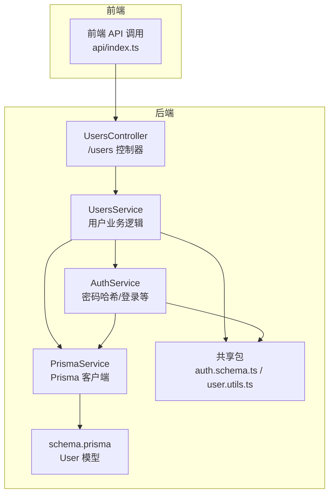
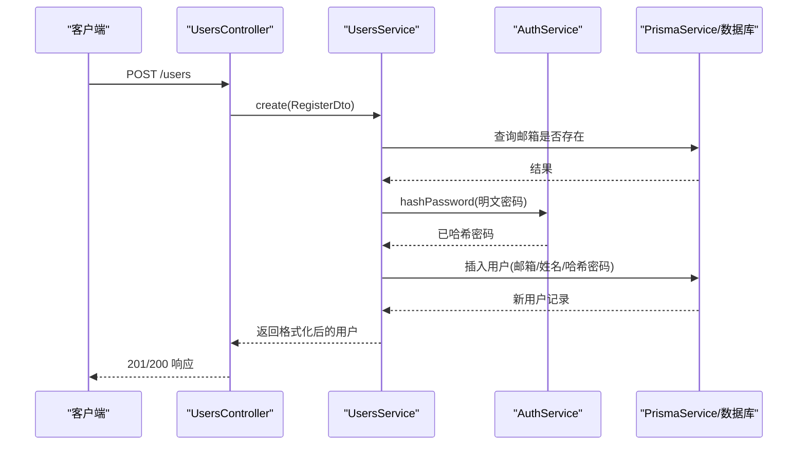
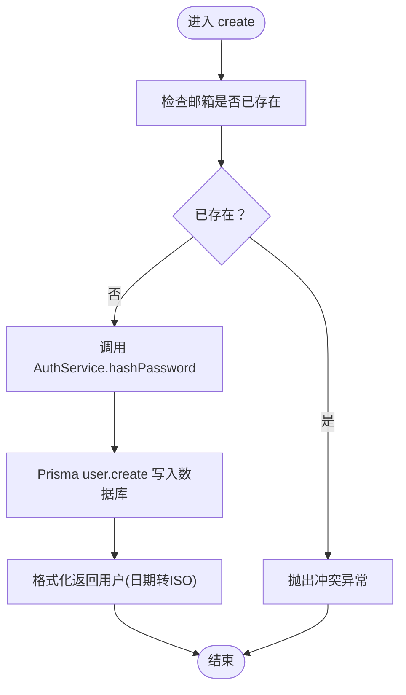
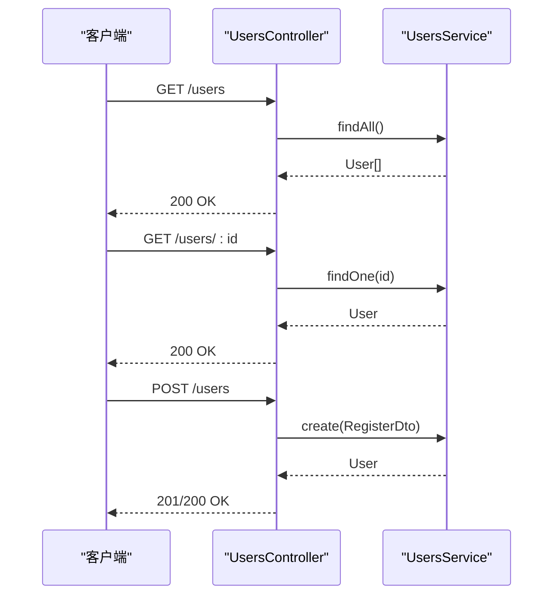
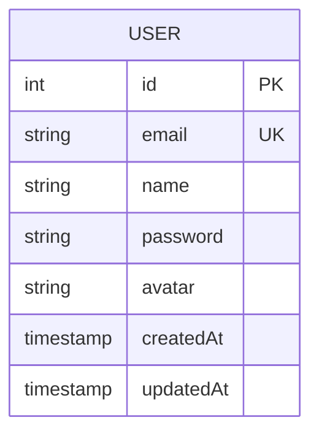
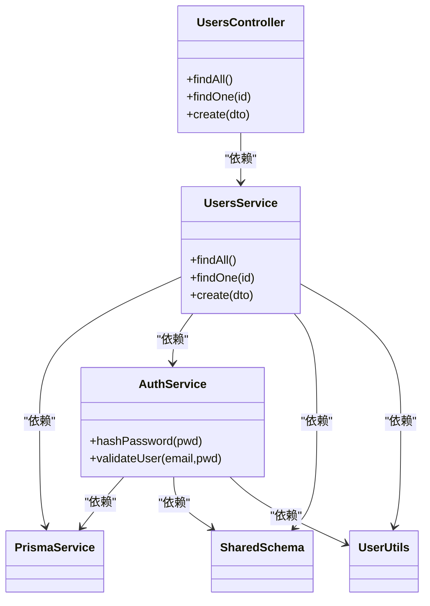

# 用户管理模块

<cite>
**本文引用的文件**
- [apps/backend/src/users/users.controller.ts](file://apps/backend/src/users/users.controller.ts)
- [apps/backend/src/users/users.service.ts](file://apps/backend/src/users/users.service.ts)
- [apps/backend/src/auth/auth.service.ts](file://apps/backend/src/auth/auth.service.ts)
- [apps/backend/src/auth/auth.dto.ts](file://apps/backend/src/auth/auth.dto.ts)
- [apps/backend/src/prisma/prisma.service.ts](file://apps/backend/src/prisma/prisma.service.ts)
- [apps/backend/prisma/schema.prisma](file://apps/backend/prisma/schema.prisma)
- [packages/shared/src/schemas/auth.schema.ts](file://packages/shared/src/schemas/auth.schema.ts)
- [packages/shared/src/utils/user.utils.ts](file://packages/shared/src/utils/user.utils.ts)
- [apps/frontend/src/api/index.ts](file://apps/frontend/src/api/index.ts)
</cite>

## 目录
1. [简介](#简介)
2. [项目结构](#项目结构)
3. [核心组件](#核心组件)
4. [架构总览](#架构总览)
5. [详细组件分析](#详细组件分析)
6. [依赖分析](#依赖分析)
7. [性能考虑](#性能考虑)
8. [故障排查指南](#故障排查指南)
9. [结论](#结论)
10. [附录](#附录)

## 简介
本文件系统性梳理用户管理模块的实现，覆盖用户实体的CRUD能力、UsersService通过PrismaService与数据库交互的流程、用户创建时的密码哈希处理、查询过滤与更新逻辑，以及UsersController暴露的RESTful端点、请求验证、权限控制与响应格式。同时结合Prisma Schema定义解释用户数据模型字段含义、约束条件与关系，并提供分页查询、条件搜索与软删除的使用建议。最后总结性能优化策略与常见问题的最佳实践。

## 项目结构
用户管理模块位于后端应用中，采用NestJS典型分层：控制器（Controller）、服务（Service）、认证（Auth）、Prisma客户端封装（PrismaService），以及共享包中的Schema与工具函数。前端通过统一API接口调用后端/users端点。

图表来源
- [apps/backend/src/users/users.controller.ts](file://apps/backend/src/users/users.controller.ts#L1-L43)
- [apps/backend/src/users/users.service.ts](file://apps/backend/src/users/users.service.ts#L1-L66)
- [apps/backend/src/auth/auth.service.ts](file://apps/backend/src/auth/auth.service.ts#L1-L150)
- [apps/backend/src/prisma/prisma.service.ts](file://apps/backend/src/prisma/prisma.service.ts#L1-L20)
- [apps/backend/prisma/schema.prisma](file://apps/backend/prisma/schema.prisma#L1-L20)
- [packages/shared/src/schemas/auth.schema.ts](file://packages/shared/src/schemas/auth.schema.ts#L1-L94)
- [packages/shared/src/utils/user.utils.ts](file://packages/shared/src/utils/user.utils.ts#L1-L36)
- [apps/frontend/src/api/index.ts](file://apps/frontend/src/api/index.ts#L58-L91)

章节来源
- [apps/backend/src/users/users.controller.ts](file://apps/backend/src/users/users.controller.ts#L1-L43)
- [apps/backend/src/users/users.service.ts](file://apps/backend/src/users/users.service.ts#L1-L66)
- [apps/backend/src/auth/auth.service.ts](file://apps/backend/src/auth/auth.service.ts#L1-L150)
- [apps/backend/src/prisma/prisma.service.ts](file://apps/backend/src/prisma/prisma.service.ts#L1-L20)
- [apps/backend/prisma/schema.prisma](file://apps/backend/prisma/schema.prisma#L1-L20)
- [packages/shared/src/schemas/auth.schema.ts](file://packages/shared/src/schemas/auth.schema.ts#L1-L94)
- [packages/shared/src/utils/user.utils.ts](file://packages/shared/src/utils/user.utils.ts#L1-L36)
- [apps/frontend/src/api/index.ts](file://apps/frontend/src/api/index.ts#L58-L91)

## 核心组件
- UsersController：暴露/users的GET（全部/单个）与POST（创建）端点，负责请求路由与Swagger标注。
- UsersService：实现用户查询与创建的核心业务逻辑，调用PrismaService进行数据库操作，并在创建时委托AuthService完成密码哈希。
- AuthService：提供密码哈希、用户校验、JWT签发等能力；在UsersService创建用户时被复用。
- PrismaService：继承PrismaClient并注入DATABASE_URL，负责连接数据库并在模块生命周期内建立/断开连接。
- Prisma Schema：定义User模型及唯一索引、默认值、映射等约束。
- 共享Schema与工具：提供注册/更新输入校验、用户输出格式化（日期转ISO字符串）等。

章节来源
- [apps/backend/src/users/users.controller.ts](file://apps/backend/src/users/users.controller.ts#L1-L43)
- [apps/backend/src/users/users.service.ts](file://apps/backend/src/users/users.service.ts#L1-L66)
- [apps/backend/src/auth/auth.service.ts](file://apps/backend/src/auth/auth.service.ts#L1-L150)
- [apps/backend/src/prisma/prisma.service.ts](file://apps/backend/src/prisma/prisma.service.ts#L1-L20)
- [apps/backend/prisma/schema.prisma](file://apps/backend/prisma/schema.prisma#L1-L20)
- [packages/shared/src/schemas/auth.schema.ts](file://packages/shared/src/schemas/auth.schema.ts#L1-L94)
- [packages/shared/src/utils/user.utils.ts](file://packages/shared/src/utils/user.utils.ts#L1-L36)

## 架构总览
用户管理模块遵循“控制器-服务-数据访问”的分层设计，控制器只做路由与参数校验，服务承担业务逻辑，PrismaService抽象数据库访问细节。注册流程中，UsersService先检查邮箱唯一性，再由AuthService对密码进行哈希，最后写入数据库并格式化返回。

图表来源
- [apps/backend/src/users/users.controller.ts](file://apps/backend/src/users/users.controller.ts#L1-L43)
- [apps/backend/src/users/users.service.ts](file://apps/backend/src/users/users.service.ts#L1-L66)
- [apps/backend/src/auth/auth.service.ts](file://apps/backend/src/auth/auth.service.ts#L1-L150)
- [apps/backend/src/prisma/prisma.service.ts](file://apps/backend/src/prisma/prisma.service.ts#L1-L20)

## 详细组件分析

### UsersService 组件分析
- 查询全部用户：调用PrismaService的findMany，随后通过共享工具将Date字段格式化为ISO字符串。
- 查询单个用户：findUnique按主键查询，未找到时抛出404异常。
- 创建用户：
  - 邮箱唯一性检查：findUnique(email)若存在则抛出409冲突。
  - 密码哈希：调用AuthService.hashPassword对明文密码进行哈希。
  - 写入数据库：create(data)插入邮箱、姓名、哈希密码。
  - 返回格式化用户对象。

图表来源
- [apps/backend/src/users/users.service.ts](file://apps/backend/src/users/users.service.ts#L1-L66)
- [apps/backend/src/auth/auth.service.ts](file://apps/backend/src/auth/auth.service.ts#L1-L150)
- [packages/shared/src/utils/user.utils.ts](file://packages/shared/src/utils/user.utils.ts#L1-L36)

章节来源
- [apps/backend/src/users/users.service.ts](file://apps/backend/src/users/users.service.ts#L1-L66)
- [packages/shared/src/utils/user.utils.ts](file://packages/shared/src/utils/user.utils.ts#L1-L36)

### UsersController 组件分析
- GET /users：返回所有用户数组，调用UsersService.findAll。
- GET /users/:id：路径参数解析为整数，调用UsersService.findOne。
- POST /users：请求体使用RegisterDto进行Zod校验，调用UsersService.create。

图表来源
- [apps/backend/src/users/users.controller.ts](file://apps/backend/src/users/users.controller.ts#L1-L43)
- [apps/backend/src/users/users.service.ts](file://apps/backend/src/users/users.service.ts#L1-L66)

章节来源
- [apps/backend/src/users/users.controller.ts](file://apps/backend/src/users/users.controller.ts#L1-L43)
- [apps/frontend/src/api/index.ts](file://apps/frontend/src/api/index.ts#L58-L91)

### PrismaService 与 schema.prisma
- PrismaService：构造函数注入DATABASE_URL，模块初始化时连接，销毁时断开。
- schema.prisma：
  - User模型包含：id（自增主键）、email（唯一）、name、password、avatar（可空）、createdAt/updatedAt（默认值）。
  - 映射到数据库表名为users。

图表来源
- [apps/backend/src/prisma/prisma.service.ts](file://apps/backend/src/prisma/prisma.service.ts#L1-L20)
- [apps/backend/prisma/schema.prisma](file://apps/backend/prisma/schema.prisma#L1-L20)

章节来源
- [apps/backend/src/prisma/prisma.service.ts](file://apps/backend/src/prisma/prisma.service.ts#L1-L20)
- [apps/backend/prisma/schema.prisma](file://apps/backend/prisma/schema.prisma#L1-L20)

### 请求验证与响应格式
- 请求验证：RegisterDto基于共享Schema进行Zod校验，确保邮箱、用户名长度、密码强度等。
- 响应格式：共享包提供通用响应结构与分页结构，当前UsersController直接返回User/User[]，未包裹通用响应结构。
- 前端调用：前端api封装了/users相关接口，便于统一调用。

章节来源
- [apps/backend/src/auth/auth.dto.ts](file://apps/backend/src/auth/auth.dto.ts#L1-L19)
- [packages/shared/src/schemas/auth.schema.ts](file://packages/shared/src/schemas/auth.schema.ts#L1-L94)
- [packages/shared/src/dto/common.dto.ts](file://packages/shared/src/dto/common.dto.ts#L1-L40)
- [apps/frontend/src/api/index.ts](file://apps/frontend/src/api/index.ts#L58-L91)

### 查询过滤、分页与条件搜索
- 当前实现：UsersService仅提供全量查询与单条查询，未内置分页与条件过滤。
- 建议实现方式：
  - 分页：在UsersService新增方法，接收page/pageSize参数，使用Prisma的skip/take与count统计总数。
  - 条件搜索：在Prisma查询中加入where条件（如email模糊匹配、name过滤、createdAt范围等）。
  - 软删除：在User模型增加deletedAt/isActive等字段，查询时默认过滤deletedAt非空的记录；更新时使用软删除标记而非物理删除。

[本节为概念性建议，不直接分析具体文件，故无章节来源]

### 更新与删除逻辑
- 当前实现：UsersController未暴露PUT/PATCH/DELETE端点；UsersService未实现update/remove。
- 建议实现方式：
  - 更新：基于Prisma.update，结合UpdateUserSchema进行输入校验，注意避免暴露敏感字段。
  - 删除：优先软删除（设置deletedAt），或在严格场景下执行物理删除并清理关联数据。

[本节为概念性建议，不直接分析具体文件，故无章节来源]

## 依赖分析
- 控制器依赖服务：UsersController依赖UsersService。
- 服务依赖Prisma与认证：UsersService依赖PrismaService与AuthService。
- 认证依赖Prisma：AuthService依赖PrismaService进行用户查询与JWT签发。
- 共享依赖：UsersService/AuthService依赖共享Schema与格式化工具。

图表来源
- [apps/backend/src/users/users.controller.ts](file://apps/backend/src/users/users.controller.ts#L1-L43)
- [apps/backend/src/users/users.service.ts](file://apps/backend/src/users/users.service.ts#L1-L66)
- [apps/backend/src/auth/auth.service.ts](file://apps/backend/src/auth/auth.service.ts#L1-L150)
- [apps/backend/src/prisma/prisma.service.ts](file://apps/backend/src/prisma/prisma.service.ts#L1-L20)
- [packages/shared/src/schemas/auth.schema.ts](file://packages/shared/src/schemas/auth.schema.ts#L1-L94)
- [packages/shared/src/utils/user.utils.ts](file://packages/shared/src/utils/user.utils.ts#L1-L36)

章节来源
- [apps/backend/src/users/users.controller.ts](file://apps/backend/src/users/users.controller.ts#L1-L43)
- [apps/backend/src/users/users.service.ts](file://apps/backend/src/users/users.service.ts#L1-L66)
- [apps/backend/src/auth/auth.service.ts](file://apps/backend/src/auth/auth.service.ts#L1-L150)
- [apps/backend/src/prisma/prisma.service.ts](file://apps/backend/src/prisma/prisma.service.ts#L1-L20)
- [packages/shared/src/schemas/auth.schema.ts](file://packages/shared/src/schemas/auth.schema.ts#L1-L94)
- [packages/shared/src/utils/user.utils.ts](file://packages/shared/src/utils/user.utils.ts#L1-L36)

## 性能考虑
- 数据库索引与约束
  - email为唯一索引，建议在高频查询字段上建立复合索引（如email+createdAt）以提升排序与筛选性能。
  - 对于分页查询，尽量使用基于游标或基于索引的排序字段，避免全表扫描。
- 缓存策略
  - 对热点用户数据（如最近活跃用户列表）使用Redis缓存，设置合理TTL；写操作后主动失效相关缓存。
  - 对只读列表（如用户列表）可采用多级缓存（本地+分布式）。
- 批量操作
  - 批量创建/更新时使用事务与批量API，减少网络往返；对大列表分批处理并限制并发。
- 并发与一致性
  - 使用数据库层面的唯一约束与事务隔离级别，避免重复注册与脏写。
  - 对高并发场景下的更新冲突，采用乐观锁（版本号）或CAS（Compare-And-Swap）策略。
- 密码哈希成本
  - bcrypt成本因子建议在安全与性能间平衡（如10-12），避免过高导致拒绝服务。

[本节为通用性能建议，不直接分析具体文件，故无章节来源]

## 故障排查指南
- 常见异常与定位
  - 404未找到：当findOne传入不存在的id时触发；检查路由参数与数据库数据。
  - 409冲突：注册时邮箱已存在；检查唯一索引与输入校验。
  - 401未授权：登录失败或JWT无效；检查邮箱/密码与令牌签名。
- 敏感信息泄露
  - 不在响应体中返回password字段；当前格式化工具已将Date转为字符串，但需确保未误暴露其他敏感字段。
- 批量操作性能瓶颈
  - 大批量导入/更新时启用事务与批量API；监控数据库慢查询日志。
- 并发更新冲突
  - 使用数据库唯一约束与事务；对关键更新引入乐观锁或重试机制。
- 日志与监控
  - 在UsersService/AuthService的关键路径添加结构化日志；对异常与耗时进行埋点。

章节来源
- [apps/backend/src/users/users.service.ts](file://apps/backend/src/users/users.service.ts#L1-L66)
- [apps/backend/src/auth/auth.service.ts](file://apps/backend/src/auth/auth.service.ts#L1-L150)

## 结论
当前用户管理模块实现了最小可用的CRUD能力：查询全部、查询单个与创建用户。UsersService通过PrismaService与数据库交互，创建时借助AuthService完成密码哈希，返回数据经共享工具格式化。后续可在保持现有职责边界的前提下扩展分页、条件搜索、软删除与更新/删除端点，并完善权限控制与响应包装，以满足更复杂的业务需求。

[本节为总结性内容，不直接分析具体文件，故无章节来源]

## 附录

### RESTful端点一览
- GET /users：获取所有用户
- GET /users/:id：根据ID获取单个用户
- POST /users：创建新用户（注册）

章节来源
- [apps/backend/src/users/users.controller.ts](file://apps/backend/src/users/users.controller.ts#L1-L43)
- [apps/frontend/src/api/index.ts](file://apps/frontend/src/api/index.ts#L58-L91)

### Prisma Schema 字段说明
- id：整型自增主键
- email：字符串，唯一索引
- name：字符串
- password：字符串
- avatar：字符串（可空）
- createdAt/updatedAt：时间戳，默认值为当前时间

章节来源
- [apps/backend/prisma/schema.prisma](file://apps/backend/prisma/schema.prisma#L1-L20)

### 请求与响应类型参考
- RegisterDto：注册输入校验（邮箱、用户名、密码）
- User：用户输出类型（含格式化后的日期字符串）
- ApiResponse/PaginatedResponse：通用响应与分页结构（当前控制器未使用）

章节来源
- [apps/backend/src/auth/auth.dto.ts](file://apps/backend/src/auth/auth.dto.ts#L1-L19)
- [packages/shared/src/schemas/auth.schema.ts](file://packages/shared/src/schemas/auth.schema.ts#L1-L94)
- [packages/shared/src/dto/common.dto.ts](file://packages/shared/src/dto/common.dto.ts#L1-L40)