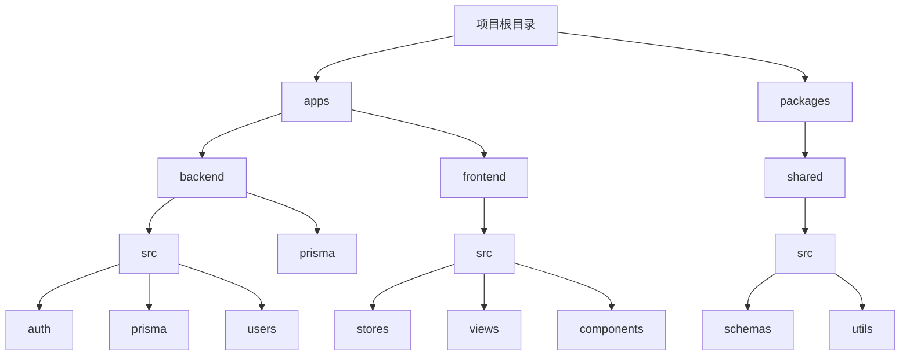
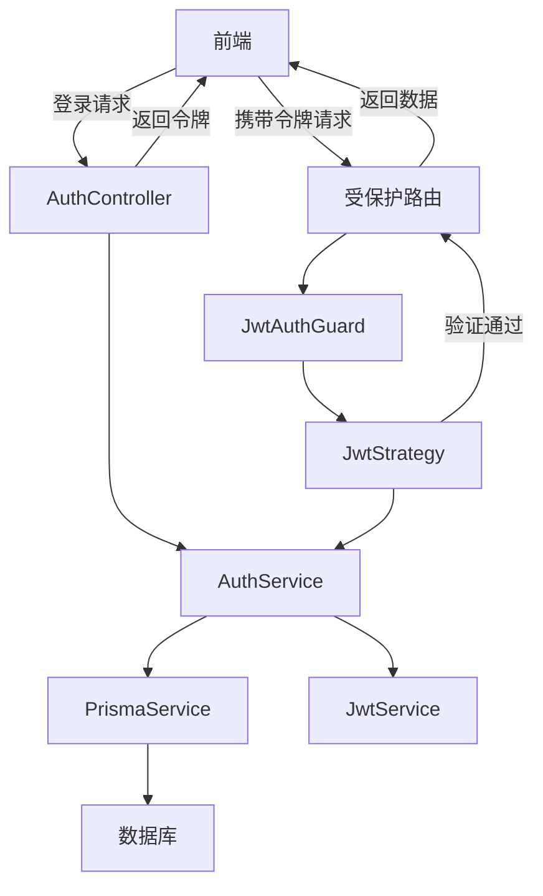
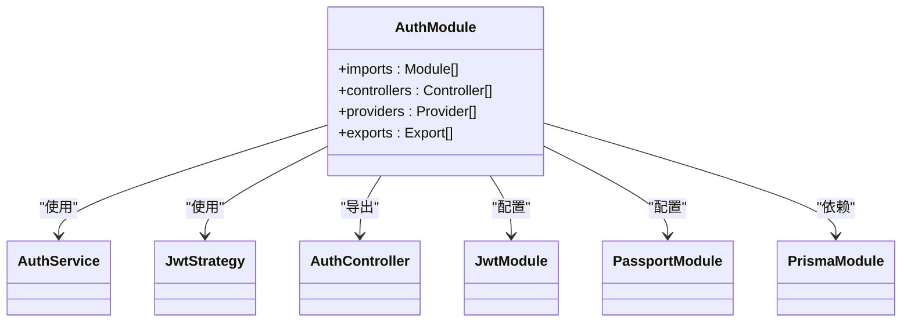
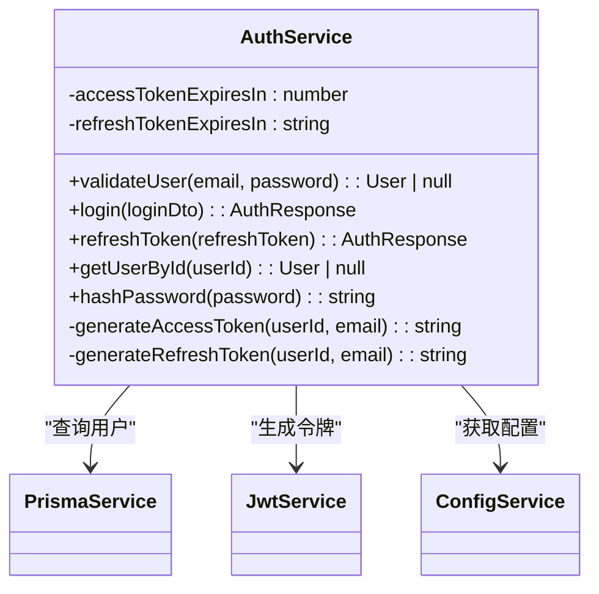
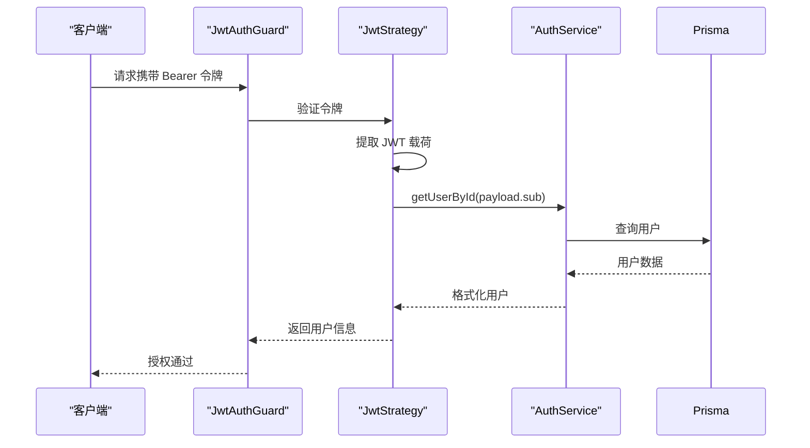
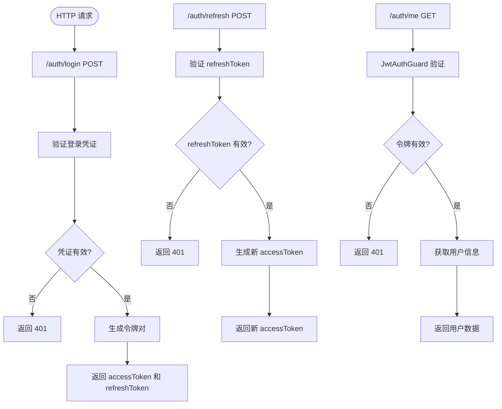
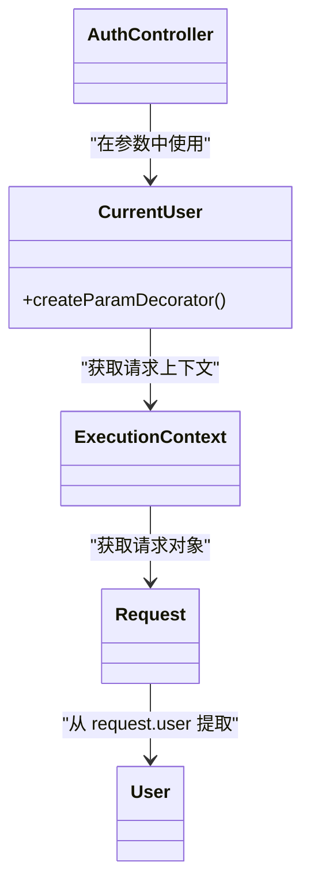

# 认证模块

<cite>
**本文档引用的文件**  
- [auth.module.ts](file://apps/backend/src/auth/auth.module.ts)
- [auth.service.ts](file://apps/backend/src/auth/auth.service.ts)
- [auth.controller.ts](file://apps/backend/src/auth/auth.controller.ts)
- [jwt.strategy.ts](file://apps/backend/src/auth/jwt.strategy.ts)
- [jwt-auth.guard.ts](file://apps/backend/src/auth/jwt-auth.guard.ts)
- [current-user.decorator.ts](file://apps/backend/src/auth/current-user.decorator.ts)
- [auth.dto.ts](file://apps/backend/src/auth/auth.dto.ts)
- [prisma.service.ts](file://apps/backend/src/prisma/prisma.service.ts)
- [schema.prisma](file://apps/backend/prisma/schema.prisma)
- [user.utils.ts](file://packages/shared/src/utils/user.utils.ts)
- [auth.schema.ts](file://packages/shared/src/schemas/auth.schema.ts)
- [auth.ts](file://apps/frontend/src/stores/auth.ts)
- [api.ts](file://apps/frontend/src/api/index.ts)
- [LoginView.vue](file://apps/frontend/src/views/LoginView.vue)
- [.env.docker.example](file://.env.docker.example)
</cite>

## 目录
1. [简介](#简介)
2. [项目结构](#项目结构)
3. [核心组件](#核心组件)
4. [架构概述](#架构概述)
5. [详细组件分析](#详细组件分析)
6. [依赖分析](#依赖分析)
7. [性能考虑](#性能考虑)
8. [故障排除指南](#故障排除指南)
9. [结论](#结论)

## 简介
本项目是一个基于 NestJS 和 Vue 的全栈应用模板，采用 JWT 实现认证机制。后端使用 NestJS 框架，结合 Prisma ORM 进行数据库操作，前端使用 Vue 3 和 Pinia 进行状态管理。认证模块实现了基于 JWT 的认证机制，包括登录、令牌刷新和用户信息获取等功能。

## 项目结构
项目采用 monorepo 结构，包含 backend 和 frontend 两个主要应用，以及一个 shared 包用于共享类型定义和工具函数。



**图示来源**  
- [auth.module.ts](file://apps/backend/src/auth/auth.module.ts)
- [auth.service.ts](file://apps/backend/src/auth/auth.service.ts)
- [auth.controller.ts](file://apps/backend/src/auth/auth.controller.ts)

**本节来源**  
- [auth.module.ts](file://apps/backend/src/auth/auth.module.ts)
- [auth.service.ts](file://apps/backend/src/auth/auth.service.ts)
- [auth.controller.ts](file://apps/backend/src/auth/auth.controller.ts)

## 核心组件
认证模块由多个核心组件构成，包括控制器、服务、守卫、策略和装饰器，共同实现完整的 JWT 认证流程。

**本节来源**  
- [auth.module.ts](file://apps/backend/src/auth/auth.module.ts#L13-L31)
- [auth.service.ts](file://apps/backend/src/auth/auth.service.ts#L20-L149)
- [auth.controller.ts](file://apps/backend/src/auth/auth.controller.ts#L15-L50)

## 架构概述
认证模块采用分层架构，各组件职责分明，协同工作完成认证功能。



**图示来源**  
- [auth.controller.ts](file://apps/backend/src/auth/auth.controller.ts#L15-L50)
- [auth.service.ts](file://apps/backend/src/auth/auth.service.ts#L20-L149)
- [jwt-auth.guard.ts](file://apps/backend/src/auth/jwt-auth.guard.ts#L8-L9)
- [jwt.strategy.ts](file://apps/backend/src/auth/jwt.strategy.ts#L17-L46)

## 详细组件分析

### 认证模块分析
AuthModule 是认证功能的入口，负责组织和配置所有认证相关的组件。



**图示来源**  
- [auth.module.ts](file://apps/backend/src/auth/auth.module.ts#L13-L31)

**本节来源**  
- [auth.module.ts](file://apps/backend/src/auth/auth.module.ts#L13-L31)

### 认证服务分析
AuthService 是认证逻辑的核心，处理用户登录、令牌生成和用户信息查询。



**图示来源**  
- [auth.service.ts](file://apps/backend/src/auth/auth.service.ts#L20-L149)

**本节来源**  
- [auth.service.ts](file://apps/backend/src/auth/auth.service.ts#L20-L149)

### JWT 策略分析
JwtStrategy 负责验证 JWT 令牌的有效性，确保只有合法令牌才能访问受保护的资源。



**图示来源**  
- [jwt.strategy.ts](file://apps/backend/src/auth/jwt.strategy.ts#L17-L46)
- [auth.service.ts](file://apps/backend/src/auth/auth.service.ts#L131-L141)

**本节来源**  
- [jwt.strategy.ts](file://apps/backend/src/auth/jwt.strategy.ts#L17-L46)

### 认证控制器分析
AuthController 提供 REST API 接口，处理登录、令牌刷新和用户信息获取等请求。



**图示来源**  
- [auth.controller.ts](file://apps/backend/src/auth/auth.controller.ts#L15-L50)

**本节来源**  
- [auth.controller.ts](file://apps/backend/src/auth/auth.controller.ts#L15-L50)

### 当前用户装饰器分析
CurrentUser 装饰器提供了一种便捷的方式从请求中提取当前登录用户的信息。



**图示来源**  
- [current-user.decorator.ts](file://apps/backend/src/auth/current-user.decorator.ts#L8-L18)

**本节来源**  
- [current-user.decorator.ts](file://apps/backend/src/auth/current-user.decorator.ts#L8-L18)

## 依赖分析
认证模块与其他模块和外部服务存在明确的依赖关系。

```mermaid
graph TD
AuthModule --> PrismaModule : "依赖"
AuthModule --> PassportModule : "依赖"
AuthModule --> JwtModule : "依赖"
AuthService --> PrismaService : "依赖"
AuthService --> JwtService : "依赖"
AuthService --> ConfigService : "依赖"
JwtStrategy --> ConfigService : "依赖"
JwtStrategy --> AuthService : "依赖"
UserController --> PrismaService : "依赖"
UserController --> JwtAuthGuard : "依赖"
```

**图示来源**  
- [auth.module.ts](file://apps/backend/src/auth/auth.module.ts#L14-L26)
- [auth.service.ts](file://apps/backend/src/auth/auth.service.ts#L25-L29)
- [jwt.strategy.ts](file://apps/backend/src/auth/jwt.strategy.ts#L18-L21)

**本节来源**  
- [auth.module.ts](file://apps/backend/src/auth/auth.module.ts#L14-L26)
- [auth.service.ts](file://apps/backend/src/auth/auth.service.ts#L25-L29)
- [jwt.strategy.ts](file://apps/backend/src/auth/jwt.strategy.ts#L18-L21)

## 性能考虑
认证模块在设计时考虑了性能和安全性，采用了多种优化措施。

1. **密码哈希**：使用 bcrypt 对密码进行哈希处理，配置了 10 轮加密，平衡了安全性和性能。
2. **令牌过期**：访问令牌设置为 15 分钟过期，减少长期有效令牌的安全风险。
3. **请求限制**：登录接口每分钟最多允许 5 次尝试，防止暴力破解攻击。
4. **数据库查询优化**：通过 Prisma 的 findUnique 方法按唯一索引查询用户，提高查询效率。
5. **缓存考虑**：虽然当前实现未使用缓存，但架构支持通过 Redis 等缓存用户信息，减少数据库查询。

## 故障排除指南

### 常见问题及解决方案

#### 令牌过期处理
**问题**：访问令牌 15 分钟后过期，导致用户需要重新登录。

**解决方案**：
1. 前端在请求失败时检查状态码 401
2. 使用刷新令牌获取新的访问令牌
3. 自动重试原始请求

```typescript
// 前端实现示例
httpClient.interceptors.response.use(
  (response) => response,
  async (error) => {
    if (error.response?.status === 401) {
      // 尝试刷新令牌
      const newToken = await refreshToken()
      // 重试原始请求
      error.config.headers.Authorization = `Bearer ${newToken}`
      return axios.request(error.config)
    }
    return Promise.reject(error)
  },
)
```

#### 刷新机制
**问题**：当前实现中，刷新令牌不会轮换，存在被滥用的风险。

**改进建议**：
1. 实现刷新令牌轮换机制，每次使用后生成新的刷新令牌
2. 在数据库中存储刷新令牌的哈希值，便于撤销和追踪
3. 设置刷新令牌的使用次数限制

#### 权限提升漏洞
**问题**：JWT 载荷中包含用户 ID（sub），如果令牌被篡改，可能导致权限提升。

**解决方案**：
1. 服务端始终通过用户 ID 查询数据库获取最新用户信息，不信任客户端提供的任何用户数据
2. 在 JWT 载荷中添加用户角色信息，但服务端仍需验证用户是否有权执行特定操作
3. 实现细粒度的权限控制，基于用户角色和权限进行访问控制

**本节来源**  
- [auth.service.ts](file://apps/backend/src/auth/auth.service.ts#L81-L106)
- [jwt.strategy.ts](file://apps/backend/src/auth/jwt.strategy.ts#L37-L45)
- [api.ts](file://apps/frontend/src/api/index.ts#L46-L55)

## 结论
本认证模块实现了基于 JWT 的完整认证流程，具有良好的架构设计和安全性考虑。通过分层设计，各组件职责分明，易于维护和扩展。模块与 Prisma 用户模型紧密集成，利用共享的类型定义确保前后端数据一致性。前端通过 Pinia 状态管理存储认证状态，并在 HTTP 客户端中自动添加认证头，提供了流畅的用户体验。建议未来增加刷新令牌轮换机制和更细粒度的权限控制，进一步提升系统的安全性和可用性。