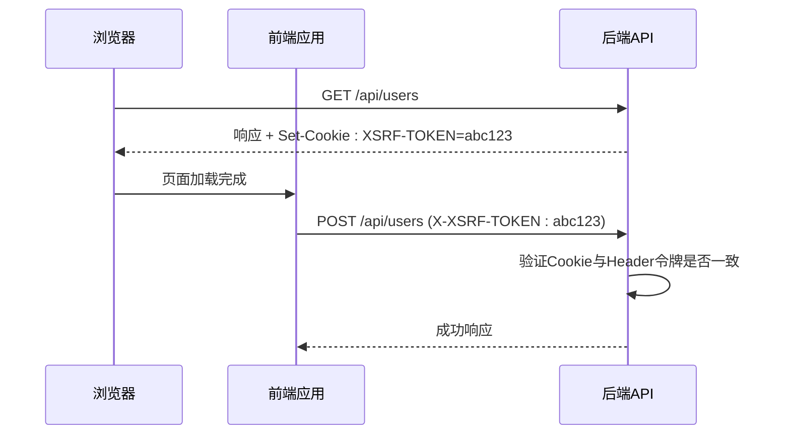
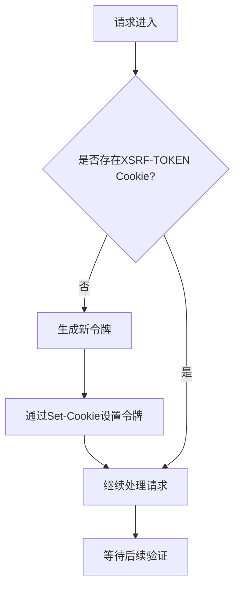
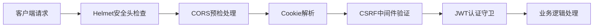
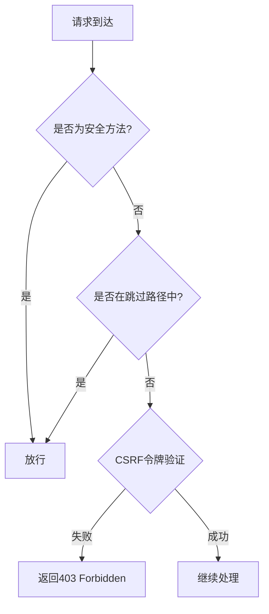

# 安全中间件

<cite>
**本文档引用的文件**   
- [csrf.middleware.ts](file://apps/backend/src/common/middlewares/csrf.middleware.ts)
- [app.module.ts](file://apps/backend/src/app.module.ts)
- [main.ts](file://apps/backend/src/main.ts)
- [api/index.ts](file://apps/frontend/src/api/index.ts)
- [.env.example](file://.env.example)
</cite>

## 目录
1. [引言](#引言)
2. [CSRF中间件核心机制](#csrf中间件核心机制)
3. [令牌生成与验证流程](#令牌生成与验证流程)
4. [请求链执行时机](#请求链执行时机)
5. [敏感操作识别与防护](#敏感操作识别与防护)
6. [配置选项说明](#配置选项说明)
7. [前端集成实践](#前端集成实践)
8. [与JWT认证共存策略](#与jwt认证共存策略)
9. [常见漏洞场景及防范](#常见漏洞场景及防范)
10. [总结](#总结)

## 引言

跨站请求伪造（CSRF）是一种常见的Web安全威胁，攻击者通过诱导用户在已认证的会话中执行非预期的操作。本项目通过实现双重提交Cookie模式的CSRF中间件，有效防御此类攻击。该中间件与JWT认证机制协同工作，为单页应用（SPA）提供全面的安全保护。

**Section sources**
- [csrf.middleware.ts](file://apps/backend/src/common/middlewares/csrf.middleware.ts#L5-L13)

## CSRF中间件核心机制

本项目采用双重提交Cookie（Double Submit Cookie）模式实现CSRF防护，其核心优势在于无状态性，特别适用于分布式和微服务架构。该机制不依赖服务器端会话存储，通过验证Cookie与请求头中令牌的一致性来确认请求的合法性。



**Diagram sources**
- [csrf.middleware.ts](file://apps/backend/src/common/middlewares/csrf.middleware.ts#L10-L12)
- [api/index.ts](file://apps/frontend/src/api/index.ts#L32-L37)

**Section sources**
- [csrf.middleware.ts](file://apps/backend/src/common/middlewares/csrf.middleware.ts#L14-L15)

## 令牌生成与验证流程

CSRF令牌的生成与验证是防护机制的核心环节。系统使用加密安全的随机数生成器创建高强度令牌，并通过时间安全的比较函数防止时序攻击。

### 令牌生成
系统使用Node.js内置的`crypto`模块生成32字节（64字符十六进制）的高强度随机令牌，确保令牌的不可预测性。

### 传输方式
支持两种主要传输方式：
- **Cookie**: 服务器通过`Set-Cookie`响应头自动设置`XSRF-TOKEN`
- **Header**: 客户端从Cookie读取令牌并放入`X-XSRF-TOKEN`请求头

### 会话系统集成
虽然采用无状态设计，但中间件与会话系统通过Cookie机制集成。令牌的生命周期与用户会话保持一致，通过`maxAge`设置24小时有效期。



**Diagram sources**
- [csrf.middleware.ts](file://apps/backend/src/common/middlewares/csrf.middleware.ts#L56-L68)
- [csrf.middleware.ts](file://apps/backend/src/common/middlewares/csrf.middleware.ts#L74-L83)

**Section sources**
- [csrf.middleware.ts](file://apps/backend/src/common/middlewares/csrf.middleware.ts#L86-L91)
- [main.ts](file://apps/backend/src/main.ts#L40)

## 请求链执行时机

CSRF中间件在NestJS请求处理管道中处于早期执行位置，确保在业务逻辑处理前完成安全验证。它与其他安全中间件（如Helmet、CORS）协同工作，构建多层防御体系。



**Diagram sources**
- [app.module.ts](file://apps/backend/src/app.module.ts#L154-L156)
- [main.ts](file://apps/backend/src/main.ts#L25-L37)

**Section sources**
- [app.module.ts](file://apps/backend/src/app.module.ts#L153-L158)

## 敏感操作识别与防护

中间件通过HTTP方法和请求路径两个维度识别需要防护的敏感操作。

### 敏感操作识别
- **HTTP方法**: 对`POST`、`PUT`、`DELETE`、`PATCH`等非安全方法进行防护
- **请求路径**: 对除白名单外的所有API端点进行验证

### 防护策略
- **安全方法豁免**: `GET`、`HEAD`、`OPTIONS`方法自动跳过验证
- **路径白名单**: 特定路径如健康检查、文档页面、登录接口无需CSRF保护



**Diagram sources**
- [csrf.middleware.ts](file://apps/backend/src/common/middlewares/csrf.middleware.ts#L35-L48)

**Section sources**
- [csrf.middleware.ts](file://apps/backend/src/common/middlewares/csrf.middleware.ts#L28-L29)
- [csrf.middleware.ts](file://apps/backend/src/common/middlewares/csrf.middleware.ts#L20-L26)

## 配置选项说明

虽然当前实现采用硬编码配置，但可通过环境变量进行灵活调整。

### 令牌有效期
通过`maxAge`配置项设置令牌有效期为24小时（86400000毫秒），平衡安全性和用户体验。

### 加密方式
使用`crypto.randomBytes`生成加密安全的随机令牌，确保令牌的不可预测性。

### 白名单路由
预定义了以下无需CSRF验证的路由：
- `/api/health`: 健康检查接口
- `/api/docs`: API文档页面
- `/api/auth/login`: 登录接口（通过速率限制保护）
- `/api/auth/refresh`: 刷新令牌接口

**Section sources**
- [csrf.middleware.ts](file://apps/backend/src/common/middlewares/csrf.middleware.ts#L66-L67)
- [csrf.middleware.ts](file://apps/backend/src/common/middlewares/csrf.middleware.ts#L89-L90)

## 前端集成实践

前端应用通过Axios拦截器自动处理CSRF令牌，确保所有非安全请求都携带正确的令牌。

### 实践示例
```typescript
// 请求拦截器自动添加CSRF令牌
httpClient.interceptors.request.use((config) => {
  if (非安全方法) {
    const csrfToken = getCookie('XSRF-TOKEN')
    if (csrfToken) {
      config.headers['X-XSRF-TOKEN'] = csrfToken
    }
  }
  return config
})
```

### Cookie配置
后端设置Cookie时关键配置：
- `httpOnly: false`: 允许JavaScript读取，便于前端获取
- `secure: production`: 生产环境仅通过HTTPS传输
- `sameSite: strict`: 防止跨站请求
- `path: /`: 全局可访问

**Section sources**
- [api/index.ts](file://apps/frontend/src/api/index.ts#L24-L38)
- [csrf.middleware.ts](file://apps/backend/src/common/middlewares/csrf.middleware.ts#L62-L65)

## 与JWT认证共存策略

CSRF中间件与JWT认证形成互补的安全防护体系，分别应对不同类型的攻击。

### 分层安全架构
- **JWT认证**: 身份验证层，确保请求来自合法用户
- **CSRF防护**: 请求授权层，确保请求是用户主动发起的

### 协同工作流程
1. 用户登录获取JWT令牌（无需CSRF保护，通过速率限制防护）
2. 后续请求携带JWT令牌进行身份验证
3. 同时验证CSRF令牌确保请求来源合法

### 安全优势
- **防御CSRF攻击**: 即使攻击者获取了用户的JWT令牌，也无法伪造跨站请求
- **防御XSS攻击**: 即使页面存在XSS漏洞，攻击者也无法获取CSRF令牌（SameSite保护）
- **纵深防御**: 两种机制相互独立，单一机制失效不会导致整体防护崩溃

**Section sources**
- [auth.controller.ts](file://apps/backend/src/auth/auth.controller.ts#L22-L26)
- [auth.service.ts](file://apps/backend/src/auth/auth.service.ts#L59-L75)
- [jwt-auth.guard.ts](file://apps/backend/src/auth/jwt-auth.guard.ts#L8-L9)

## 常见漏洞场景及防范

### 漏洞场景1：SameSite配置不当
**风险**: 将`SameSite`设置为`None`或不设置，导致令牌在跨站请求中自动发送
**防范**: 严格设置`SameSite: 'strict'`，确保令牌仅在同站请求中发送

### 漏洞场景2：HttpOnly配置错误
**风险**: 设置`HttpOnly: true`，导致前端JavaScript无法读取令牌
**防范**: 明确设置`HttpOnly: false`，允许前端从Cookie获取令牌

### 漏洞场景3：令牌比较时序攻击
**风险**: 使用普通字符串比较，可能被时序攻击破解
**防范**: 使用`crypto.timingSafeEqual`进行时间安全的比较

### 漏洞场景4：登录接口防护不足
**风险**: 登录接口若受CSRF影响，可能导致账户被恶意登录
**防范**: 将登录接口加入白名单，改用速率限制进行保护

**Section sources**
- [csrf.middleware.ts](file://apps/backend/src/common/middlewares/csrf.middleware.ts#L62-L64)
- [csrf.middleware.ts](file://apps/backend/src/common/middlewares/csrf.middleware.ts#L82-L83)
- [csrf.middleware.ts](file://apps/backend/src/common/middlewares/csrf.middleware.ts#L24-L25)

## 总结

本项目的CSRF中间件实现了高效、安全的双重提交Cookie防护机制。通过与JWT认证的协同工作，构建了纵深防御体系，有效抵御跨站请求伪造攻击。中间件设计考虑了SPA应用的特点，平衡了安全性与可用性，为系统提供了坚实的安全基础。