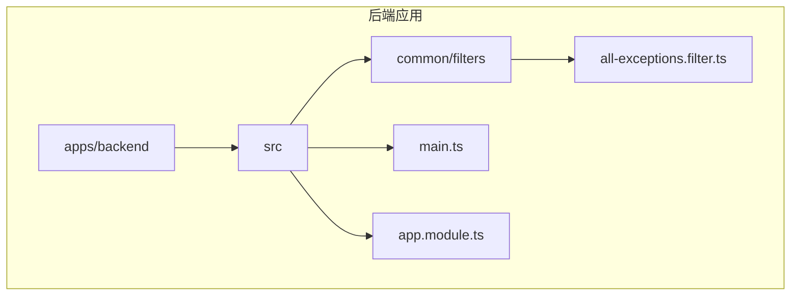
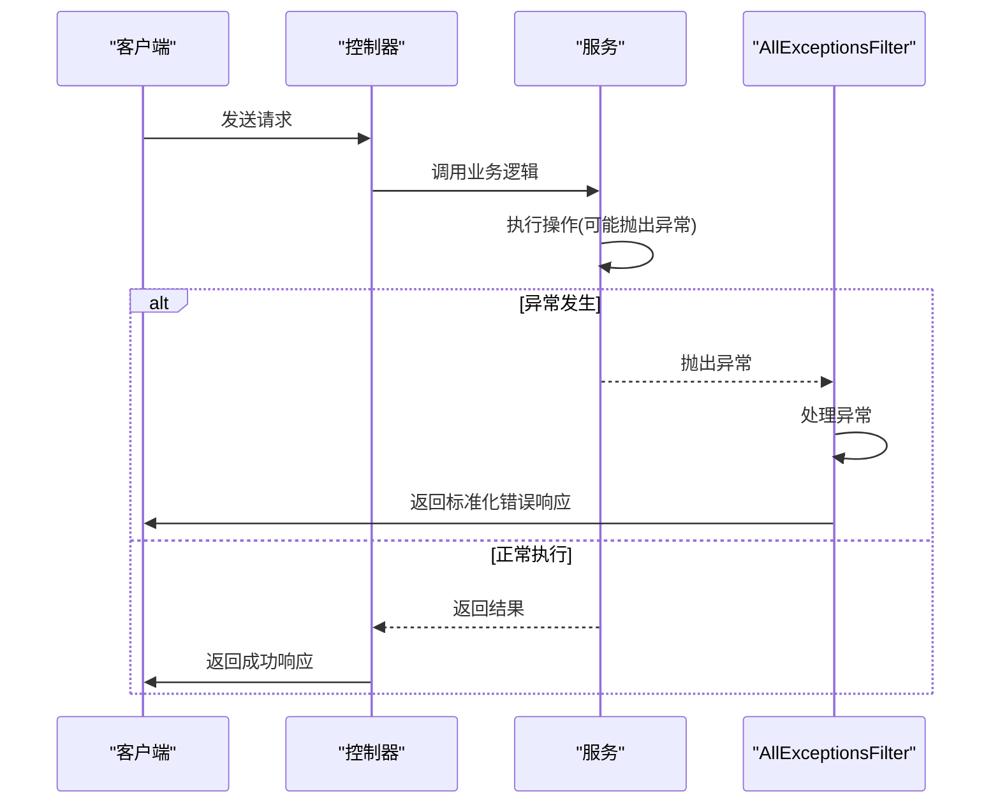
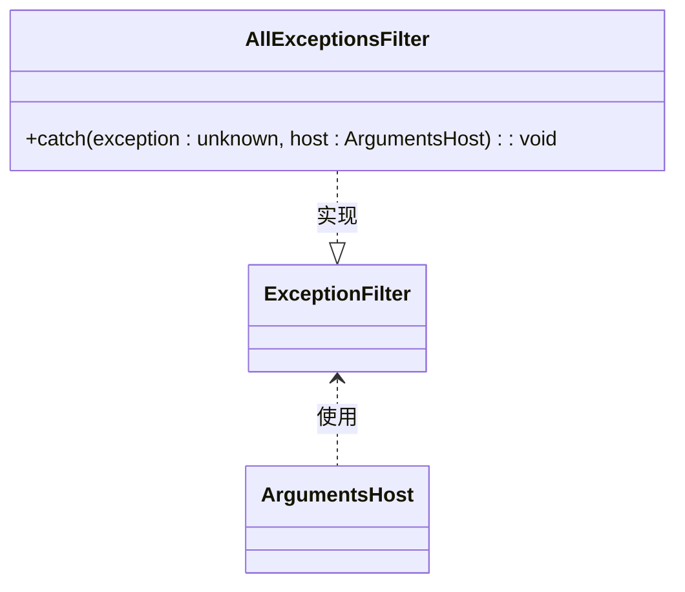
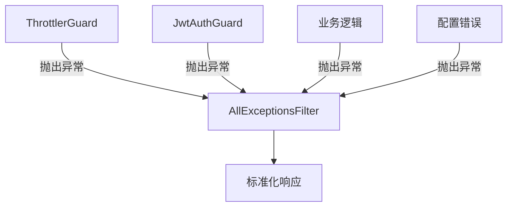
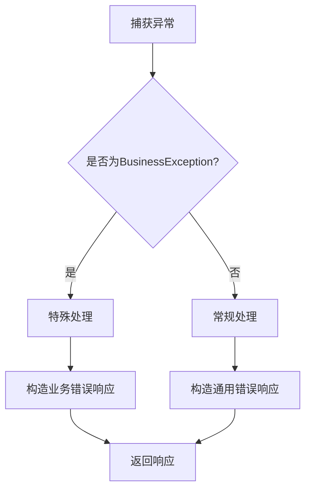

# 异常过滤器

<cite>
**本文档引用的文件**
- [all-exceptions.filter.ts](file://apps/backend/src/common/filters/all-exceptions.filter.ts)
- [main.ts](file://apps/backend/src/main.ts)
- [app.module.ts](file://apps/backend/src/app.module.ts)
- [csrf.middleware.ts](file://apps/backend/src/common/middlewares/csrf.middleware.ts)
- [auth.service.ts](file://apps/backend/src/auth/auth.service.ts)
- [jwt.strategy.ts](file://apps/backend/src/auth/jwt.strategy.ts)
- [prisma.config.ts](file://apps/backend/prisma/prisma.config.ts)
- [redis.health.ts](file://apps/backend/src/redis/redis.health.ts)
</cite>

## 目录
1. [项目结构](#项目结构)
2. [核心组件](#核心组件)
3. [架构概述](#架构概述)
4. [详细组件分析](#详细组件分析)
5. [依赖分析](#依赖分析)
6. [性能考虑](#性能考虑)
7. [故障排除指南](#故障排除指南)
8. [结论](#结论)

## 项目结构

本项目采用基于NestJS的全栈应用模板，包含后端和前端两个主要部分。后端位于`apps/backend`目录，采用模块化设计，将不同功能分离到独立的模块中。异常处理相关的核心代码位于`apps/backend/src/common/filters/`目录下的`all-exceptions.filter.ts`文件中。



**Diagram sources**
- [all-exceptions.filter.ts](file://apps/backend/src/common/filters/all-exceptions.filter.ts#L1-L30)
- [main.ts](file://apps/backend/src/main.ts#L1-L93)

**Section sources**
- [all-exceptions.filter.ts](file://apps/backend/src/common/filters/all-exceptions.filter.ts#L1-L30)
- [main.ts](file://apps/backend/src/main.ts#L1-L93)

## 核心组件

全局异常过滤器`AllExceptionsFilter`是本项目异常处理机制的核心组件。该过滤器实现了NestJS的`ExceptionFilter`接口，通过`@Catch()`装饰器捕获所有未处理的异常，包括HTTP异常和运行时错误。过滤器将异常转换为标准化的JSON响应格式，包含成功状态、数据、消息、状态码和时间戳等字段。

该组件与NestJS内置异常体系紧密集成，能够识别`HttpException`类型的异常并提取其状态码和消息，对于非HTTP异常则统一返回500内部服务器错误。这种设计确保了API响应的一致性，避免了敏感的堆栈信息泄露给客户端。

**Section sources**
- [all-exceptions.filter.ts](file://apps/backend/src/common/filters/all-exceptions.filter.ts#L1-L30)

## 架构概述

本项目的异常处理架构采用分层设计，从底层的异常抛出到顶层的统一响应处理。当应用程序中发生异常时，无论是由业务逻辑、数据库操作还是配置错误引起的，都会被全局异常过滤器捕获。过滤器根据异常类型决定响应的状态码和消息内容，然后通过HTTP响应返回给客户端。



**Diagram sources**
- [all-exceptions.filter.ts](file://apps/backend/src/common/filters/all-exceptions.filter.ts#L1-L30)
- [auth.service.ts](file://apps/backend/src/auth/auth.service.ts#L44-L149)

## 详细组件分析

### AllExceptionsFilter 分析

`AllExceptionsFilter`类实现了NestJS的异常过滤器接口，是整个应用的全局异常处理器。该过滤器通过`app.useGlobalFilters(new AllExceptionsFilter())`在`main.ts`中注册为全局过滤器，确保所有控制器和路由的异常都能被捕获。



**Diagram sources**
- [all-exceptions.filter.ts](file://apps/backend/src/common/filters/all-exceptions.filter.ts#L1-L30)

#### 异常处理流程

异常处理流程从`catch`方法开始，该方法接收两个参数：异常对象和执行上下文。过滤器首先切换到HTTP上下文，获取响应对象。然后根据异常类型判断是HTTP异常还是其他运行时异常，分别获取对应的状态码和消息。最后，构造标准化的JSON响应并返回。

```mermaid
flowchart TD
A[捕获异常] --> B{是否为HttpException?}
B --> |是| C[获取异常状态码]
B --> |否| D[使用500状态码]
C --> E[获取异常消息]
D --> F[使用"服务器内部错误"]
E --> G[构造响应对象]
F --> G
G --> H[返回JSON响应]
```

**Diagram sources**
- [all-exceptions.filter.ts](file://apps/backend/src/common/filters/all-exceptions.filter.ts#L1-L30)

**Section sources**
- [all-exceptions.filter.ts](file://apps/backend/src/common/filters/all-exceptions.filter.ts#L1-L30)

### 与其他异常处理机制的兼容性

`AllExceptionsFilter`与NestJS的其他异常处理机制完全兼容。例如，`ThrottlerGuard`速率限制守卫抛出的异常、`JwtAuthGuard`认证守卫抛出的异常，以及业务逻辑中手动抛出的`UnauthorizedException`、`NotFoundException`等，都能被该过滤器正确处理。



**Diagram sources**
- [all-exceptions.filter.ts](file://apps/backend/src/common/filters/all-exceptions.filter.ts#L1-L30)
- [app.module.ts](file://apps/backend/src/app.module.ts#L146-L150)

**Section sources**
- [all-exceptions.filter.ts](file://apps/backend/src/common/filters/all-exceptions.filter.ts#L1-L30)
- [app.module.ts](file://apps/backend/src/app.module.ts#L146-L150)

## 依赖分析

`AllExceptionsFilter`依赖于NestJS框架的核心模块，特别是`@nestjs/common`中的`ExceptionFilter`、`Catch`、`ArgumentsHost`和`HttpException`等类。该过滤器作为全局组件注册，与应用程序的其他部分松耦合，只通过标准的异常处理接口进行交互。

```mermaid
dependencyDiagram
AllExceptionsFilter --> ExceptionFilter
AllExceptionsFilter --> HttpException
AllExceptionsFilter --> HttpStatus
main.ts --> AllExceptionsFilter
```

**Diagram sources**
- [all-exceptions.filter.ts](file://apps/backend/src/common/filters/all-exceptions.filter.ts#L1-L30)
- [main.ts](file://apps/backend/src/main.ts#L68-L69)

**Section sources**
- [all-exceptions.filter.ts](file://apps/backend/src/common/filters/all-exceptions.filter.ts#L1-L30)
- [main.ts](file://apps/backend/src/main.ts#L68-L69)

## 性能考虑

`AllExceptionsFilter`的设计考虑了性能因素。过滤器的逻辑简单高效，只包含必要的条件判断和对象构造操作，不会对正常请求的性能产生显著影响。由于异常是相对罕见的事件，这种设计在大多数情况下都能提供良好的性能表现。

在生产环境中，该过滤器还能防止敏感的堆栈跟踪信息泄露，提高了应用的安全性。同时，标准化的错误响应格式便于前端统一处理，减少了客户端的复杂性。

## 故障排除指南

### 常见问题及解决方案

**异常未被捕获**
如果发现某些异常未被`AllExceptionsFilter`捕获，首先检查是否正确注册了全局过滤器。在`main.ts`中确认`app.useGlobalFilters(new AllExceptionsFilter())`调用存在且没有语法错误。

**堆栈信息泄露**
在开发环境中，NestJS可能会显示详细的堆栈信息。确保在生产环境中通过适当的配置隐藏这些信息，`AllExceptionsFilter`的设计已经考虑了这一点，只返回标准化的消息而不包含堆栈跟踪。

**自定义业务异常处理**
要支持特定业务异常的处理，可以扩展`AllExceptionsFilter`，添加对自定义异常类型的判断。例如，可以创建`BusinessException`类，并在过滤器中添加相应的处理逻辑。



**Section sources**
- [all-exceptions.filter.ts](file://apps/backend/src/common/filters/all-exceptions.filter.ts#L1-L30)
- [jwt.strategy.ts](file://apps/backend/src/auth/jwt.strategy.ts#L23)
- [prisma.config.ts](file://apps/backend/prisma/prisma.config.ts#L11)
- [redis.health.ts](file://apps/backend/src/redis/redis.health.ts#L32)

## 结论

`AllExceptionsFilter`作为本项目的全局异常处理器，提供了统一、安全和标准化的异常处理机制。通过捕获所有未处理的异常并返回一致的JSON响应格式，该过滤器大大提高了API的可靠性和用户体验。其与NestJS内置异常体系的无缝集成，以及对不同环境的适应性，使其成为现代Web应用中不可或缺的组件。

该过滤器的设计遵循了最佳实践，既保证了错误信息的清晰传达，又防止了敏感信息的泄露。通过简单的扩展，还可以支持更复杂的业务异常处理需求，为应用程序的稳定运行提供了坚实的基础。